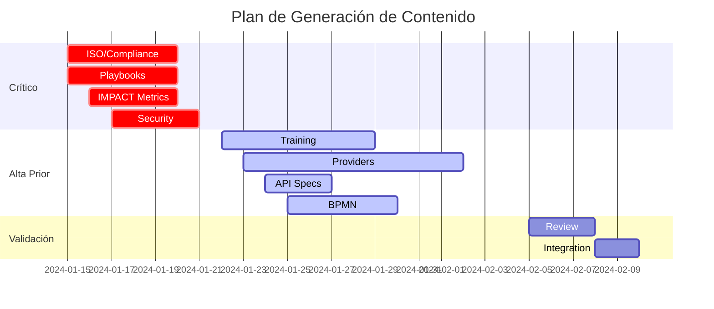

# 🚀 ESTRATEGIA DE GENERACIÓN DE CONTENIDO CON SUBAGENTES

## 1. METODOLOGÍA DE TRABAJO

### Fase 1: Preparación (Semana 1)
1. **Crear Knowledge Base compartida**
   - Cargar todo el material base en `/content-base/`
   - Definir templates y guías de estilo
   - Establecer criterios de calidad

2. **Configurar Subagentes**
   - Asignar roles especializados
   - Proporcionar contexto opinionated
   - Definir outputs esperados

### Fase 2: Generación Paralela (Semanas 2-4)

#### 🔴 Track Crítico (Paralelo)
```
Subagente-ISO → Genera compliance docs
Subagente-Playbooks → Genera playbooks gobierno/adopción  
Subagente-IMPACT → Genera implementación métricas
Subagente-Security → Genera specs TRiSM
```

#### 🟡 Track Alta Prioridad (Semanas 3-5)
```
Subagente-Training → Genera contenido SCORM
Subagente-Providers → Genera guías por proveedor
Subagente-API → Genera especificaciones OpenAPI
Subagente-BPMN → Genera procesos workflow
```

### Fase 3: Revisión y Refinamiento (Semana 5-6)
- Cross-review entre subagentes
- Validación de consistencia
- Ajustes basados en feedback

## 2. PROMPTS BASE PARA SUBAGENTES

### Prompt Master Template
```markdown
Eres un [ROL ESPECIALIZADO] trabajando para un banco Top 5 en México.

CONTEXTO OPINIONATED:
- Lee y memoriza: /content-base/context/bank-context.md
- Aplica normativas: CNBV, Banxico, ISO 42001
- Usa metodología: [ESPECÍFICA POR ROL]
- Tono: Formal pero accesible, en español

TU MISIÓN:
[DESCRIPCIÓN ESPECÍFICA DE LA TAREA]

ENTREGABLES:
1. [ENTREGABLE 1 con formato específico]
2. [ENTREGABLE 2 con criterios de éxito]
3. [ENTREGABLE 3 con métricas]

RESTRICCIONES:
- Todo contenido en español (excepto términos técnicos)
- Enfoque práctico y ejecutable
- Ejemplos del sector bancario mexicano
- Cumplimiento regulatorio integrado

MATERIAL BASE:
- Contexto: /content-base/context/
- Templates: /content-base/templates/
- Ejemplos: /content-base/examples/
- Estilo: /content-base/style-guide/
```

## 3. EJEMPLO DE INVOCACIÓN DE SUBAGENTE

### Para Generar Contenido ISO/Compliance:
```python
subagent_iso = {
    "role": "Especialista Senior en Compliance Bancario y Gestión de Riesgos IA",
    "context_files": [
        "/content-base/context/bank-context.md",
        "/content-base/context/regulatory.md",
        "/docs/operating-model-coe.md"
    ],
    "task": """
    Genera la documentación completa de ISO 42001 para el CoE de IA, incluyendo:
    
    1. MATRIZ DE CUMPLIMIENTO ISO 42001
       - 150+ controles mapeados
       - Evidencias requeridas por control
       - Responsables (RACI)
       - Frecuencia de revisión
       - KPIs de cumplimiento
    
    2. PROCEDIMIENTOS DE AUDITORÍA
       - Checklists detallados
       - Procesos de recolección de evidencias
       - Templates de reportes
       - Calendario de auditorías
    
    3. INTEGRACIÓN CON OTROS ESTÁNDARES
       - Mapeo cruzado con ISO 27001
       - Alineación con ISO 23053 y 23894
       - Cumplimiento CNBV circular 4/2020
    
    Usa como base la estructura actual en /services/docs/docs/iso/
    pero desarrolla TODO el contenido faltante.
    """,
    "output_format": "markdown",
    "quality_criteria": {
        "completeness": "100% de controles ISO cubiertos",
        "practical": "Incluir ejemplos y templates listos para usar",
        "compliance": "Alineado con regulación mexicana",
        "language": "Español formal, términos ISO en inglés permitidos"
    }
}
```

## 4. PIPELINE DE GENERACIÓN

```bash
# Paso 1: Preparar ambiente
mkdir -p content-base/{context,templates,examples,style-guide}

# Paso 2: Ejecutar subagentes en paralelo
parallel_agents = [
    generate_iso_content(),
    generate_playbooks(),
    generate_impact_metrics(),
    generate_security_specs()
]

# Paso 3: Validar outputs
for content in generated_contents:
    validate_compliance(content)
    validate_style_guide(content)
    validate_completeness(content)

# Paso 4: Integrar al portal
integrate_to_mkdocs()
update_dashboard_content()
refresh_api_docs()
```

## 5. CONTROL DE CALIDAD

### Checklist por Contenido Generado:
- [ ] ¿Está en español correcto?
- [ ] ¿Incluye ejemplos bancarios?
- [ ] ¿Cumple con normativas CNBV/Banxico?
- [ ] ¿Es ejecutable/implementable?
- [ ] ¿Tiene métricas de éxito claras?
- [ ] ¿Incluye templates reutilizables?
- [ ] ¿Está alineado con IMPACT framework?
- [ ] ¿Considera el modelo federado?

## 6. MÉTRICAS DE ÉXITO

### Por Subagente:
- **Velocidad**: 1000-2000 palabras/hora de contenido de calidad
- **Completitud**: 95%+ de requerimientos cubiertos
- **Calidad**: 0 errores regulatorios, <5% correcciones necesarias
- **Reusabilidad**: 80%+ de templates aplicables directamente

### Global:
- **Tiempo total**: 4-6 semanas vs 20-25 semanas manual
- **Costo**: 70% reducción vs consultores externos
- **Consistencia**: 100% alineación con guías de estilo
- **Actualización**: Capacidad de regenerar con cambios normativos

## 7. HERRAMIENTAS DE SOPORTE

### Para Subagentes:
```yaml
tools:
  - file_reader: Para acceder a material base
  - web_search: Para normativas actualizadas
  - validator: Para verificar compliance
  - formatter: Para aplicar estilos
  - translator: Para términos técnicos
  - diagram_generator: Para BPMN y flujos
```

## 8. ORDEN DE EJECUCIÓN RECOMENDADO



## PRÓXIMOS PASOS

1. **Crear los archivos de contexto faltantes**:
   - regulatory.md
   - culture.md
   - tech-stack.md

2. **Definir templates específicos**:
   - iso-template.md
   - playbook-template.md
   - training-module.md

3. **Configurar primer subagente piloto**:
   - Comenzar con ISO/Compliance (más crítico)
   - Validar proceso
   - Escalar a otros subagentes

4. **Establecer pipeline de CI/CD**:
   - Auto-validación de contenido
   - Integración con MkDocs
   - Publicación automatizada