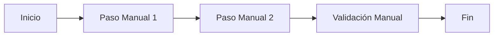
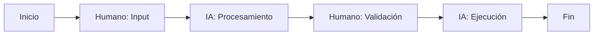

# Plantilla: Playbook - [NOMBRE_PLAYBOOK]

## Metadatos
- **Código**: PB-[SECTOR]-[NÚMERO]
- **Sector/Área**: [BANCA_RETAIL/CORPORATIVA/INVERSIONES/OPERACIONES]
- **Versión**: 1.0
- **Fecha**: [FECHA]
- **Autor**: [AUTOR/EQUIPO]
- **Madurez**: [INICIAL/PROBADO/OPTIMIZADO]
- **Impacto Esperado**: [ALTO/MEDIO/BAJO]

## Executive Summary
[Resumen ejecutivo de 3-4 líneas describiendo el propósito, alcance y beneficios esperados del playbook]

## 1. Contexto y Justificación

### Problemática Actual
- **Pain Points**: [Dolores específicos del área]
- **Ineficiencias**: [Procesos manuales o lentos]
- **Riesgos**: [Operacionales, regulatorios, reputacionales]
- **Costos**: [Impacto económico actual]

### Oportunidad con IA
- **Casos de Uso Prioritarios**: [Lista de 3-5 casos]
- **Quick Wins**: [Victorias tempranas posibles]
- **Transformación Potencial**: [Visión a mediano plazo]

## 2. Casos de Uso Detallados

### Caso de Uso 1: [Nombre Descriptivo]

#### Descripción
[Explicación clara del caso de uso en 2-3 oraciones]

#### Proceso Actual (AS-IS)

- **Tiempo actual**: [X horas/días]
- **FTEs involucrados**: [Número]
- **Sistemas**: [Lista de sistemas]

#### Proceso Propuesto (TO-BE) con Nova-Cell

- **Tiempo esperado**: [X minutos/horas]
- **FTEs optimizados**: [Número]
- **Integración Nova-Cell**: [Módulos específicos]

#### Implementación con Nova-Cell

**Agentes Requeridos**:
1. **[Tipo de Agente 1]**: [Función específica]
2. **[Tipo de Agente 2]**: [Función específica]

**Prompts Clave**:
```
Prompt 1: [Prompt específico para la tarea]
```

```
Prompt 2: [Otro prompt relevante]
```

#### Métricas de Éxito
- **TTFV**: < [X] minutos
- **Reducción de tiempo**: [X]%
- **Accuracy**: > [X]%
- **ROI esperado**: [Semana X]

#### Riesgos y Mitigación
| Riesgo | Probabilidad | Impacto | Mitigación |
|--------|-------------|---------|------------|
| [Riesgo 1] | [A/M/B] | [A/M/B] | [Estrategia] |
| [Riesgo 2] | [A/M/B] | [A/M/B] | [Estrategia] |

### Caso de Uso 2: [Nombre]
[Estructura similar al Caso 1]

### Caso de Uso 3: [Nombre]
[Estructura similar al Caso 1]

## 3. Arquitectura de Solución

### Componentes Técnicos
```yaml
Nova-Cell:
  Modelos:
    - GPT-5: [Uso específico]
    - Claude: [Uso específico]
    - Gemini: [Uso específico]
  
  Integraciones:
    - Sistema_1: [API/Batch/Real-time]
    - Sistema_2: [Método de integración]
  
  Datos:
    - Fuentes: [Lista de fuentes]
    - Volumetría: [Transacciones/día]
    - Sensibilidad: [PII/Confidencial/Público]
```

### Flujo de Datos
1. **Ingesta**: [Cómo llegan los datos]
2. **Procesamiento**: [Transformaciones con IA]
3. **Validación**: [Controles de calidad]
4. **Output**: [Formatos y destinos]

## 4. Roadmap de Implementación

### Fase 1: Piloto (Semanas 1-4)
- [ ] Setup inicial de Nova-Cell
- [ ] Configuración de agentes
- [ ] Pruebas con datos sintéticos
- [ ] Validación con usuarios clave
- **Entregable**: POC funcional

### Fase 2: MVP (Semanas 5-8)
- [ ] Integración con sistemas reales
- [ ] Entrenamiento de usuarios
- [ ] Ajuste de prompts
- [ ] Monitoreo inicial
- **Entregable**: MVP en producción limitada

### Fase 3: Escalamiento (Semanas 9-12)
- [ ] Rollout completo
- [ ] Optimización basada en métricas
- [ ] Documentación final
- [ ] Handover a operación
- **Entregable**: Solución en producción

### Fase 4: Optimización (Mes 4+)
- [ ] Fine-tuning de modelos
- [ ] Automatización adicional
- [ ] Expansión a casos relacionados

## 5. Modelo Operativo

### Roles y Responsabilidades

| Rol | Responsabilidad | Dedicación |
|-----|----------------|------------|
| Product Owner IA | Priorización y visión | 30% |
| Risk Officer IA | Validación y compliance | 20% |
| Usuario Experto | Validación de outputs | 50% |
| Nova-Cell Admin | Soporte técnico | 10% |

### Gobernanza
- **Comité de Seguimiento**: Semanal durante piloto, quincenal después
- **Escalamiento**: [Matriz de escalamiento]
- **Decisiones clave**: [Proceso de aprobación]

### SLAs y Soporte
- **Disponibilidad**: 99.5% en horario bancario
- **Tiempo de respuesta**: < 2 segundos para queries
- **Soporte**: L1 local, L2 CoE, L3 Nova

## 6. Change Management

### Stakeholder Map
| Stakeholder | Interés | Influencia | Estrategia |
|------------|---------|------------|------------|
| [Ejecutivos] | Alto | Alto | Sponsor activo |
| [Usuarios] | Alto | Medio | Capacitación intensiva |
| [IT] | Medio | Alto | Colaboración técnica |
| [Riesgo] | Alto | Alto | Involucramiento temprano |

### Plan de Comunicación
1. **Kick-off**: Presentación ejecutiva
2. **Updates semanales**: Dashboard de avance
3. **Demos**: Cada 2 semanas
4. **Success stories**: Mensual

### Capacitación
- **Usuarios finales**: 4 horas presenciales + práctica
- **Administradores**: 8 horas + certificación
- **Soporte continuo**: Office hours semanales

## 7. Consideraciones de Compliance

### Regulatorio
- **CNBV**: [Consideraciones específicas]
- **Banxico**: [Si aplica]
- **LFPDPPP**: [Protección de datos]
- **ISO 42001**: [Puntos de cumplimiento]

### Ético
- [ ] Sin sesgo algorítmico validado
- [ ] Explicabilidad de decisiones
- [ ] Supervisión humana garantizada
- [ ] Auditoría de prompts

### Seguridad
- [ ] Encriptación en tránsito y reposo
- [ ] No PII en prompts
- [ ] Logs de auditoría completos
- [ ] Segregación de ambientes

## 8. Presupuesto y ROI

### Inversión
| Concepto | Año 1 | Año 2 | Año 3 |
|----------|-------|-------|-------|
| Licencias Nova-Cell | $[X] | $[X] | $[X] |
| Implementación | $[X] | - | - |
| Capacitación | $[X] | $[X/2] | $[X/2] |
| Soporte | $[X] | $[X] | $[X] |
| **Total** | **$[X]** | **$[X]** | **$[X]** |

### Beneficios
| Beneficio | Año 1 | Año 2 | Año 3 |
|-----------|-------|-------|-------|
| Ahorro FTEs | $[X] | $[X*1.5] | $[X*2] |
| Reducción errores | $[X] | $[X] | $[X] |
| Velocidad proceso | $[X] | $[X] | $[X] |
| **Total** | **$[X]** | **$[X]** | **$[X]** |

### ROI
- **Payback period**: [X] meses
- **ROI 3 años**: [X]%
- **VPN**: $[X]

## 9. Métricas IMPACT

### Implementation (Semana 1-4)
- Cobertura de procesos: [X]%
- Usuarios activos: [X]

### Momentum (Semana 5-8)
- Frecuencia de uso: [X] veces/semana
- Engagement score: [X]/10

### Performance (Semana 9-12)
- Productividad: +[X]%
- Calidad: +[X]%

### Acceptance (Ongoing)
- NPS usuarios: > [X]
- Adoption rate: [X]%

### Cost-effective (Mes 3+)
- Costo por transacción: -[X]%
- ROI acumulado: $[X]

### Trust (Ongoing)
- Confianza en outputs: [X]%
- Tasa de override manual: < [X]%

## 10. Lecciones Aprendidas de Otros Sectores
- **Banca Retail**: [Insight aplicable]
- **Banca Corporativa**: [Insight aplicable]
- **Operaciones**: [Insight aplicable]

## 11. Anexos

### A. Especificaciones Técnicas
[Detalles técnicos adicionales]

### B. Ejemplos de Prompts Completos
[Biblioteca de prompts probados]

### C. Casos de Prueba
[Escenarios de validación]

### D. Material de Capacitación
[Enlaces a recursos]

---

### Notas para el Implementador:
- Adaptar casos de uso a realidad específica del área
- Validar métricas con baseline actual
- Involucrar a stakeholders desde el día 1
- Documentar todas las decisiones y cambios
- Mantener foco en quick wins iniciales
- Escalar gradualmente basado en éxito demostrado