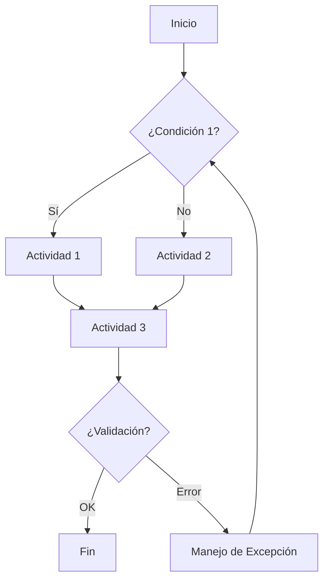

# Plantilla: Procedimiento de [NOMBRE_PROCEDIMIENTO]

## Metadatos
- **Código**: PROC-[ÁREA]-[NÚMERO]
- **Versión**: 1.0
- **Fecha**: [FECHA]
- **Dueño del Proceso**: [ROL_DUEÑO]
- **Frecuencia**: [DIARIO/SEMANAL/MENSUAL/EVENTO]
- **Sistemas Involucrados**: [SISTEMA_1, SISTEMA_2]
- **Tiempo Estimado**: [DURACIÓN]

## 1. Propósito
[Descripción clara del objetivo del procedimiento en 1-2 oraciones]

## 2. Alcance
### Inicio
[Evento o condición que dispara el procedimiento]

### Fin
[Resultado o estado final esperado]

### Límites
- **Incluye**: [Qué está dentro del alcance]
- **Excluye**: [Qué no está cubierto]

## 3. Participantes

| Rol | Responsabilidad | Sistema/Herramienta |
|-----|----------------|-------------------|
| [Rol 1] | [Actividades principales] | [Nova-Cell/Sistema] |
| [Rol 2] | [Actividades principales] | [Herramienta] |

## 4. Entradas Requeridas
- [ ] [Documento/Dato 1] - Fuente: [Sistema/Área]
- [ ] [Documento/Dato 2] - Fuente: [Sistema/Área]
- [ ] [Aprobación/Autorización] - De: [Rol]

## 5. Diagrama de Flujo

## 6. Procedimiento Detallado

### Paso 1: [Nombre del Paso]
**Responsable**: [Rol]  
**Tiempo estimado**: [Minutos/Horas]

1. [Acción específica 1]
2. [Acción específica 2]
3. [Acción específica 3]

**Punto de Control**: ✓ [Verificación requerida]

**Si Nova-Cell está involucrado**:
- Prompt sugerido: "[Prompt específico]"
- Agente recomendado: [Tipo de agente]

### Paso 2: [Nombre del Paso]
**Responsable**: [Rol]  
**Tiempo estimado**: [Minutos/Horas]

1. [Acción específica]
2. [Acción específica]

**Decisión**: 
- Si [condición] → Ir a Paso 3
- Si [otra condición] → Ir a Paso 4

### Paso 3: [Nombre del Paso]
[Contenido del paso]

## 7. Puntos de Control y Validación

| Punto | Qué Validar | Criterio de Aceptación | Acción si Falla |
|-------|------------|----------------------|-----------------|
| PC1 | [Elemento] | [Criterio específico] | [Acción correctiva] |
| PC2 | [Elemento] | [Criterio específico] | [Acción correctiva] |

## 8. Manejo de Excepciones

### Excepción 1: [Nombre]
**Síntoma**: [Cómo se identifica]  
**Acción**: [Qué hacer]  
**Escalamiento**: [A quién contactar]

### Excepción 2: [Nombre]
**Síntoma**: [Cómo se identifica]  
**Acción**: [Qué hacer]  
**Escalamiento**: [A quién contactar]

## 9. Salidas/Entregables
- [ ] [Documento/Reporte 1] - Formato: [PDF/Excel/Sistema]
- [ ] [Registro en sistema] - Sistema: [Nombre]
- [ ] [Notificación] - Destinatarios: [Roles]

## 10. Métricas del Proceso
- **Tiempo de Ciclo**: [Objetivo en horas/días]
- **Tasa de Error**: [< X%]
- **SLA**: [Tiempo máximo permitido]
- **Volumen**: [Transacciones esperadas por período]

## 11. Automatización con Nova-Cell
### Oportunidades Identificadas
- [ ] Paso [X]: Automatizable con agente de [tipo]
- [ ] Validación [Y]: Verificable con prompt engineering
- [ ] Reporte [Z]: Generable con IA

### Métricas IMPACT Aplicables
- **TTFV**: [Tiempo objetivo]
- **Productivity Gain**: [% esperado]

## 12. Cumplimiento Regulatorio
- **CNBV**: [Circular aplicable si existe]
- **Banxico**: [Normativa aplicable si existe]
- **ISO 42001**: [Sección relevante]
- **Control Interno**: [Referencia SOX/COSO si aplica]

## 13. Referencias
- [Política relacionada]
- [Manual de usuario del sistema]
- [Playbook sectorial]

## 14. Glosario de Términos
- **[Término técnico 1]**: [Definición]
- **[Acrónimo 1]**: [Significado completo]

## 15. Historial de Cambios

| Versión | Fecha | Autor | Cambios Realizados |
|---------|-------|-------|-------------------|
| 1.0 | [FECHA] | [AUTOR] | Creación inicial |

---

### Notas para el Generador:
- Usar verbos en infinitivo para las acciones
- Ser específico en tiempos y responsables
- Incluir siempre puntos de control
- Considerar integración con Nova-Cell donde sea relevante
- Mantener trazabilidad con regulación aplicable