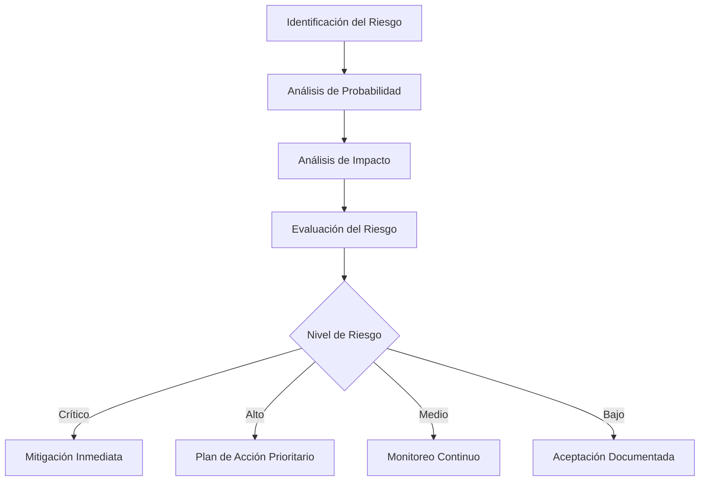
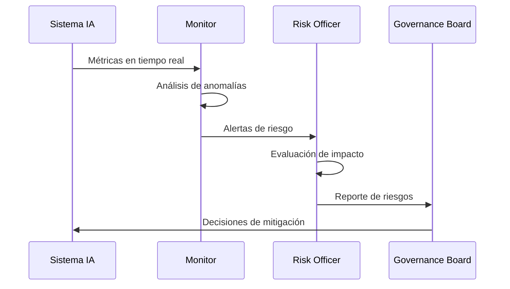
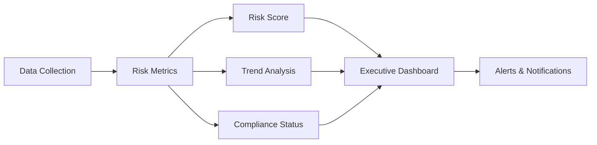
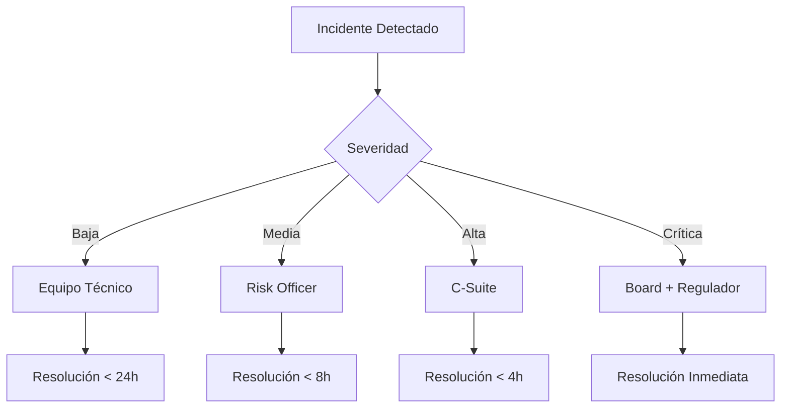

# Guía para Risk Officers en IA

## 📊 Introducción

Esta guía está diseñada para Risk Officers y profesionales de gestión de riesgos que necesitan evaluar, gestionar y mitigar los riesgos asociados con la implementación de sistemas de Inteligencia Artificial en organizaciones gubernamentales.

## 1. Framework de Riesgos de IA

### 1.1 Taxonomía de Riesgos en IA

#### Riesgos Técnicos
- **Precisión del Modelo:** Errores de predicción, falsos positivos/negativos
- **Robustez:** Vulnerabilidad a ataques adversariales
- **Drift:** Degradación del rendimiento con el tiempo
- **Escalabilidad:** Limitaciones de infraestructura
- **Interoperabilidad:** Incompatibilidad con sistemas existentes

#### Riesgos Éticos y Sociales
- **Sesgo Algorítmico:** Discriminación sistémica
- **Transparencia:** Falta de explicabilidad
- **Privacidad:** Exposición de datos sensibles
- **Autonomía:** Decisiones sin supervisión humana
- **Manipulación:** Uso malicioso de la IA

#### Riesgos Operacionales
- **Dependencia Tecnológica:** Single points of failure
- **Competencias:** Falta de personal capacitado
- **Mantenimiento:** Costos y complejidad
- **Integración:** Disrupciones en procesos existentes
- **Cambio Organizacional:** Resistencia y adaptación

#### Riesgos Regulatorios
- **Cumplimiento:** Violación de normativas
- **Responsabilidad Legal:** Accountability de decisiones
- **Auditoría:** Incapacidad de demostrar compliance
- **Soberanía de Datos:** Jurisdicción y control
- **Evolución Regulatoria:** Cambios en el marco legal

### 1.2 Matriz de Evaluación de Riesgos



## 2. Metodología de Evaluación de Riesgos

### 2.1 Pre-Implementación

#### Checklist de Evaluación Inicial
```markdown
☐ Análisis de necesidad de IA
☐ Evaluación de alternativas no-IA
☐ Identificación de stakeholders afectados
☐ Mapeo de datos sensibles involucrados
☐ Revisión de requisitos regulatorios
☐ Evaluación de capacidades internas
☐ Análisis costo-beneficio
☐ Definición de métricas de éxito
```

#### Scoring de Riesgo Inicial

| Dimensión | Peso | Score (1-5) | Riesgo Ponderado |
|-----------|------|-------------|------------------|
| Complejidad Técnica | 20% | | |
| Sensibilidad de Datos | 25% | | |
| Impacto en Ciudadanos | 30% | | |
| Exposición Regulatoria | 15% | | |
| Madurez Organizacional | 10% | | |
| **Total** | **100%** | | |

### 2.2 Durante Implementación

#### Monitoreo de Indicadores de Riesgo

```python
class RiskIndicators:
    def __init__(self):
        self.kris = {
            "model_accuracy": {"threshold": 0.95, "current": None},
            "data_quality": {"threshold": 0.98, "current": None},
            "response_time": {"threshold": 100, "current": None},  # ms
            "bias_score": {"threshold": 0.05, "current": None},
            "explainability": {"threshold": 0.90, "current": None},
            "security_score": {"threshold": 0.95, "current": None}
        }
    
    def evaluate_risk_level(self):
        violations = 0
        for metric, values in self.kris.items():
            if values["current"] and values["current"] < values["threshold"]:
                violations += 1
        
        if violations >= 3:
            return "CRITICAL"
        elif violations >= 2:
            return "HIGH"
        elif violations >= 1:
            return "MEDIUM"
        else:
            return "LOW"
```

### 2.3 Post-Implementación

#### Framework de Auditoría Continua



## 3. Herramientas de Gestión de Riesgos

### 3.1 Risk Assessment Canvas

```markdown
# AI Risk Assessment Canvas - [Nombre del Proyecto]

## 1. Contexto del Sistema
- **Propósito:** [Descripción]
- **Usuarios:** [Quiénes]
- **Datos:** [Tipos y sensibilidad]
- **Decisiones:** [Qué decisiones toma]

## 2. Riesgos Identificados
### Técnicos
- [ ] Riesgo 1: [Descripción]
- [ ] Riesgo 2: [Descripción]

### Éticos
- [ ] Riesgo 1: [Descripción]
- [ ] Riesgo 2: [Descripción]

### Operacionales
- [ ] Riesgo 1: [Descripción]
- [ ] Riesgo 2: [Descripción]

### Regulatorios
- [ ] Riesgo 1: [Descripción]
- [ ] Riesgo 2: [Descripción]

## 3. Controles Propuestos
| Riesgo | Control | Responsable | Frecuencia |
|--------|---------|-------------|------------|
| | | | |

## 4. Métricas de Monitoreo
- KRI 1: [Métrica y threshold]
- KRI 2: [Métrica y threshold]

## 5. Plan de Escalamiento
- Nivel 1: [Acción si...]
- Nivel 2: [Acción si...]
- Nivel 3: [Acción si...]
```

### 3.2 Herramientas de Análisis Cuantitativo

#### Monte Carlo para Evaluación de Riesgos

```python
import numpy as np
import pandas as pd
from scipy import stats

class MonteCarloRiskAnalysis:
    def __init__(self, iterations=10000):
        self.iterations = iterations
        
    def simulate_risk_scenario(self, risk_params):
        """
        Simula escenarios de riesgo usando Monte Carlo
        
        risk_params = {
            'probability': (min, mode, max),  # Distribución triangular
            'impact': (min, mode, max),       # En unidades monetarias
            'mitigation_effectiveness': 0.7   # 70% de efectividad
        }
        """
        results = []
        
        for _ in range(self.iterations):
            # Simular probabilidad de ocurrencia
            prob = np.random.triangular(
                risk_params['probability'][0],
                risk_params['probability'][1],
                risk_params['probability'][2]
            )
            
            # Simular impacto
            impact = np.random.triangular(
                risk_params['impact'][0],
                risk_params['impact'][1],
                risk_params['impact'][2]
            )
            
            # Calcular riesgo residual con mitigación
            residual_risk = prob * impact * (1 - risk_params['mitigation_effectiveness'])
            results.append(residual_risk)
        
        return {
            'mean_risk': np.mean(results),
            'var_95': np.percentile(results, 95),  # Value at Risk 95%
            'cvar_95': np.mean([r for r in results if r >= np.percentile(results, 95)]),
            'max_risk': np.max(results),
            'min_risk': np.min(results)
        }
```

### 3.3 Dashboard de Riesgos

```html
<!DOCTYPE html>
<html>
<head>
    <title>AI Risk Dashboard</title>
    <style>
        .risk-card {
            border: 1px solid #ddd;
            padding: 15px;
            margin: 10px;
            border-radius: 8px;
        }
        .critical { background-color: #ffcccc; }
        .high { background-color: #ffe6cc; }
        .medium { background-color: #ffffcc; }
        .low { background-color: #ccffcc; }
        .metric {
            display: inline-block;
            margin: 10px;
            padding: 10px;
            background: #f0f0f0;
            border-radius: 5px;
        }
    </style>
</head>
<body>
    <h1>AI Risk Management Dashboard</h1>
    
    <div class="risk-card critical">
        <h2>🔴 Riesgos Críticos</h2>
        <ul>
            <li>Sesgo detectado en modelo de scoring crediticio</li>
            <li>Brecha de seguridad en API de inferencia</li>
        </ul>
    </div>
    
    <div class="risk-card high">
        <h2>🟠 Riesgos Altos</h2>
        <ul>
            <li>Drift en modelo de detección de fraude</li>
            <li>Falta de explicabilidad en decisiones críticas</li>
        </ul>
    </div>
    
    <div class="metrics-section">
        <h2>📊 Métricas Clave</h2>
        <div class="metric">
            <strong>Risk Score Global:</strong> 7.8/10
        </div>
        <div class="metric">
            <strong>Modelos en Producción:</strong> 12
        </div>
        <div class="metric">
            <strong>Incidentes Último Mes:</strong> 3
        </div>
        <div class="metric">
            <strong>Compliance Score:</strong> 92%
        </div>
    </div>
</body>
</html>
```

## 4. Estrategias de Mitigación

### 4.1 Framework de Controles

#### Controles Preventivos
1. **Revisión de Diseño:** Evaluación antes de desarrollo
2. **Privacy by Design:** Incorporación desde el inicio
3. **Ethical AI Guidelines:** Principios rectores
4. **Training & Awareness:** Capacitación continua

#### Controles Detectivos
1. **Monitoreo Continuo:** Métricas en tiempo real
2. **Auditorías Periódicas:** Revisiones programadas
3. **Testing Adversarial:** Pruebas de robustez
4. **Feedback Loops:** Canales de retroalimentación

#### Controles Correctivos
1. **Incident Response Plan:** Protocolo de respuesta
2. **Model Rollback:** Reversión a versiones anteriores
3. **Human Override:** Intervención manual
4. **Remediation Process:** Corrección de sesgos

### 4.2 Matriz RACI para Gestión de Riesgos

| Actividad | Risk Officer | Data Scientist | IT Security | Legal | Business Owner |
|-----------|--------------|----------------|-------------|-------|----------------|
| Identificación de Riesgos | A | R | C | C | I |
| Evaluación de Impacto | R | C | C | C | A |
| Diseño de Controles | A | C | R | C | I |
| Implementación | C | R | R | I | A |
| Monitoreo | R | I | C | I | A |
| Reporte | R | C | C | C | A |

*R: Responsible, A: Accountable, C: Consulted, I: Informed*

## 5. Casos de Estudio

### Caso 1: Sesgo en Sistema de Beneficios Sociales

**Contexto:** Sistema de IA para asignación de beneficios sociales mostró sesgo contra minorías.

**Riesgos Identificados:**
- Discriminación algorítmica
- Impacto social negativo
- Riesgo reputacional
- Exposición legal

**Mitigación Aplicada:**
1. Auditoría de fairness con múltiples métricas
2. Re-entrenamiento con datos balanceados
3. Implementación de fairness constraints
4. Monitoreo continuo de disparidad

**Resultado:**
- Reducción del sesgo de 23% a 3%
- Implementación de oversight committee
- Proceso de apelación manual

### Caso 2: Ataque Adversarial en Sistema de Seguridad

**Contexto:** Sistema de reconocimiento facial vulnerable a ataques adversariales.

**Riesgos Identificados:**
- Vulnerabilidad de seguridad
- Falsos negativos en identificación
- Riesgo de seguridad nacional

**Mitigación Aplicada:**
1. Implementación de adversarial training
2. Detección de inputs anómalos
3. Sistema de verificación multicapa
4. Fallback a verificación manual

## 6. Regulaciones y Compliance

### 6.1 Marcos Regulatorios Relevantes

#### Internacional
- **EU AI Act:** Clasificación de riesgos y requisitos
- **ISO/IEC 23053:** Framework para sistemas de IA
- **ISO/IEC 23894:** Gestión de riesgos en IA

#### Nacional (Adaptar según país)
- Ley de Protección de Datos Personales
- Normativa de Transparencia Gubernamental
- Regulaciones Sectoriales Específicas

### 6.2 Checklist de Compliance

```markdown
## Compliance Checklist para Sistemas de IA

### Protección de Datos
☐ Evaluación de Impacto en Privacidad (PIA)
☐ Consentimiento informado documentado
☐ Mecanismos de portabilidad de datos
☐ Derecho al olvido implementado
☐ Minimización de datos aplicada

### Transparencia
☐ Documentación de algoritmos
☐ Explicabilidad de decisiones
☐ Registro de auditoría completo
☐ Información pública disponible
☐ Canal de quejas establecido

### Seguridad
☐ Evaluación de vulnerabilidades
☐ Cifrado de datos implementado
☐ Control de acceso configurado
☐ Plan de respuesta a incidentes
☐ Backup y recuperación probados

### Ética
☐ Evaluación de sesgos realizada
☐ Principios éticos definidos
☐ Comité de ética establecido
☐ Proceso de revisión ética
☐ Mecanismos de accountability
```

## 7. Herramientas y Recursos

### 7.1 Software de Gestión de Riesgos

#### Open Source
- **AI Fairness 360 (IBM):** Detección y mitigación de sesgos
- **Adversarial Robustness Toolbox:** Testing de seguridad
- **MLflow:** Tracking y governance de modelos
- **Great Expectations:** Validación de datos

#### Comerciales
- **DataRobot:** Platform con risk management integrado
- **H2O.ai:** Herramientas de explicabilidad y fairness
- **Fiddler AI:** Monitoring y explicabilidad
- **Arthur AI:** Performance y bias monitoring

### 7.2 Templates y Documentación

#### Template de Risk Assessment Report

```markdown
# AI Risk Assessment Report
**Sistema:** [Nombre]
**Fecha:** [DD/MM/YYYY]
**Risk Officer:** [Nombre]

## Executive Summary
[Resumen de hallazgos principales]

## Risk Assessment
### Methodology
[Metodología utilizada]

### Findings
#### Critical Risks
1. [Riesgo 1]
   - Probabilidad: [Alta/Media/Baja]
   - Impacto: [Alto/Medio/Bajo]
   - Mitigación: [Estrategia]

#### High Risks
[Lista de riesgos altos]

## Recommendations
1. [Recomendación 1]
2. [Recomendación 2]

## Action Plan
| Action | Owner | Deadline | Status |
|--------|-------|----------|--------|
| | | | |

## Appendices
- A. Detailed Risk Matrix
- B. Technical Assessment
- C. Regulatory Compliance Check
```

## 8. Métricas y KPIs

### 8.1 KPIs para Risk Management

```python
class RiskManagementKPIs:
    def __init__(self):
        self.kpis = {
            "risk_coverage": {
                "formula": "risks_with_controls / total_risks",
                "target": 0.95,
                "frequency": "monthly"
            },
            "incident_rate": {
                "formula": "incidents / models_in_production",
                "target": 0.05,
                "frequency": "weekly"
            },
            "mitigation_effectiveness": {
                "formula": "risks_mitigated / risks_identified",
                "target": 0.80,
                "frequency": "quarterly"
            },
            "compliance_score": {
                "formula": "requirements_met / total_requirements",
                "target": 1.00,
                "frequency": "monthly"
            },
            "mean_time_to_remediate": {
                "formula": "sum(remediation_time) / incidents",
                "target": 24,  # hours
                "frequency": "monthly"
            }
        }
    
    def calculate_risk_score(self, weights=None):
        """Calcula un score global de riesgo"""
        if weights is None:
            weights = {
                "technical": 0.25,
                "ethical": 0.30,
                "operational": 0.20,
                "regulatory": 0.25
            }
        
        # Implementar cálculo ponderado
        return sum(score * weight for score, weight in zip(scores, weights.values()))
```

### 8.2 Dashboard de Métricas



## 9. Proceso de Escalamiento

### 9.1 Niveles de Escalamiento



### 9.2 Protocolo de Comunicación

| Nivel | Stakeholder | Canal | Tiempo Respuesta | Contenido |
|-------|-------------|-------|------------------|-----------|
| 1 | Equipo Técnico | Slack/Email | < 1 hora | Detalles técnicos |
| 2 | Risk Officer | Email/Llamada | < 30 min | Impacto y mitigación |
| 3 | Management | Llamada/Reunión | < 15 min | Resumen ejecutivo |
| 4 | Board/Regulador | Reunión/Reporte | Inmediato | Plan de acción |

## 10. Formación y Capacitación

### 10.1 Programa de Capacitación

#### Nivel Básico (Todo el personal)
- Introducción a riesgos de IA
- Principios éticos básicos
- Identificación de incidentes
- Canales de reporte

#### Nivel Intermedio (Equipos técnicos)
- Evaluación técnica de riesgos
- Herramientas de detección
- Implementación de controles
- Testing y validación

#### Nivel Avanzado (Risk Officers)
- Frameworks avanzados de risk management
- Análisis cuantitativo de riesgos
- Regulación y compliance
- Gestión de crisis

### 10.2 Certificaciones Recomendadas

- **CRISC (Certified in Risk and Information Systems Control)**
- **ISO 31000 Risk Management**
- **AI Ethics Certification**
- **Data Privacy Certifications (CIPP/CIPM)**

## Conclusiones

La gestión de riesgos en sistemas de IA gubernamentales requiere un enfoque holístico que combine:

1. **Evaluación Continua:** Los riesgos evolucionan con el sistema
2. **Enfoque Multidisciplinario:** Colaboración entre áreas
3. **Transparencia:** Documentación y comunicación clara
4. **Adaptabilidad:** Flexibilidad ante nuevos riesgos
5. **Compromiso Organizacional:** Apoyo desde el liderazgo

### Próximos Pasos

1. Establecer el Risk Management Framework
2. Formar el equipo de gestión de riesgos
3. Implementar herramientas de monitoreo
4. Desarrollar planes de contingencia
5. Crear cultura de gestión de riesgos

---

**Última actualización:** 2025-01-09  
**Próxima revisión:** 2025-04-09  
**Clasificación:** Uso Interno - Risk Management  
**Contacto:** risk-officers@gov.ai