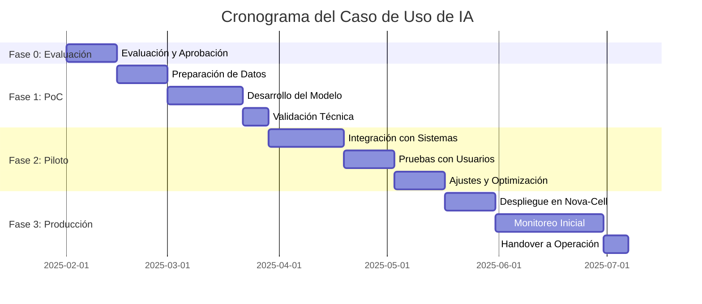

# Anexo A: Formulario de Solicitud de Caso de Uso de IA

---

## 📋 Propósito y Alcance

Este formulario es el punto de entrada oficial para la propuesta, evaluación y priorización de nuevos casos de uso de Inteligencia Artificial (IA) dentro del banco. Su objetivo es asegurar que todas las iniciativas de IA estén alineadas con la estrategia de negocio, cumplan con el marco de gobernanza de IA, la normativa vigente (CNBV, LFPDPPP), y los estándares internacionales (ISO 42001).

El diligenciamiento completo y preciso de este documento es un requisito indispensable para que el Comité de Gobernanza de IA y el Centro de Excelencia (CoE) puedan realizar una evaluación integral.

**ID del Formulario:** `CoE-IA-F-001`  
**Versión:** `2.0`  
**Fecha de Emisión:** `10 de enero de 2025`  
**Estado:** `Vigente`

---

## 1. Información del Solicitante y Patrocinador

*Toda iniciativa debe contar con un líder de la unidad de negocio que la patrocine y se responsabilice de su valor estratégico.*

| Campo | Descripción | Respuesta |
| :--- | :--- | :--- |
| **Nombre del Solicitante*** | Persona que lidera la iniciativa y completa el formulario | |
| **Puesto del Solicitante*** | Cargo actual del solicitante | |
| **Dirección / Área*** | Dirección y área a la que pertenece el solicitante | |
| **Correo Electrónico*** | Email de contacto corporativo | |
| **Teléfono / Extensión** | Número de contacto | |
| **Nombre del Patrocinador de Negocio*** | Director o Subdirector que patrocina la iniciativa | |
| **Puesto del Patrocinador*** | Cargo actual del patrocinador | |
| **Fecha de Solicitud*** | DD/MM/AAAA | |

---

## 2. Descripción del Caso de Uso

*Describa de manera clara y concisa la oportunidad de negocio y la solución propuesta.*

### 2.1 Información General

| Campo | Descripción | Respuesta |
| :--- | :--- | :--- |
| **Nombre del Caso de Uso*** | Título descriptivo y único para la iniciativa | |
| **ID del Caso de Uso** | Será asignado por el CoE | CoE-CU-XXXX |
| **Prioridad de Negocio*** | Nivel de urgencia desde perspectiva de negocio | ☐ Crítica ☐ Alta ☐ Media ☐ Baja |

### 2.2 Descripción Detallada

| Campo | Respuesta |
| :--- | :--- |
| **Resumen Ejecutivo (Elevator Pitch)***  *Describa en 2-3 frases el problema, la solución y el impacto esperado* | |
| **Problema de Negocio a Resolver***  *Detalle el desafío, la ineficiencia o la oportunidad. Use métricas para cuantificar* | |
| **Solución Propuesta con IA***  *Explique cómo se utilizará la IA. ¿Qué decisiones se automatizarán?* | |
| **Alcance de la Solución***  *Defina claramente los límites de la iniciativa* | **In-Scope:**  **Out-of-Scope:** |

### 2.3 Clasificación del Caso de Uso

**Tipo de Caso de Uso*** *(Marque todas las categorías que apliquen)*

☐ Análisis Predictivo  
☐ Segmentación / Clustering  
☐ Sistema de Recomendación  
☐ Procesamiento de Lenguaje Natural (NLP)  
☐ Visión por Computadora  
☐ IA Generativa (Texto, Imagen, Audio)  
☐ Optimización y Simulación  
☐ Detección de Anomalías / Fraude  
☐ Automatización Robótica de Procesos (RPA + IA)  
☐ Otro (especificar): _______________

---

## 3. Justificación de Negocio y Alineación Estratégica

*Cuantifique el valor esperado y demuestre cómo esta iniciativa contribuye a los objetivos del banco.*

### 3.1 Alineación Estratégica

| Campo | Respuesta |
| :--- | :--- |
| **Objetivo Estratégico Principal*** | ☐ Crecimiento Rentable ☐ Eficiencia Operacional ☐ Experiencia del Cliente ☐ Gestión de Riesgos ☐ Innovación Digital |
| **Objetivos Secundarios** | |

### 3.2 Framework IMPACT

*Describa cómo el caso de uso generará valor según las dimensiones del framework:*

| Dimensión | Impacto Esperado | Métrica Clave |
| :--- | :--- | :--- |
| **I**mplementation (Implementación) | | |
| **M**omentum (Impulso de Adopción) | | |
| **P**erformance (Desempeño) | | |
| **A**cceptance (Aceptación del Usuario) | | |
| **C**ost-Effective (Costo-Efectividad) | | |
| **T**rust (Confianza y Transparencia) | | |

### 3.3 Análisis Financiero Preliminar

| Concepto | Año 1 | Año 2 | Año 3 | Total |
| :--- | ---: | ---: | ---: | ---: |
| **Inversión (CAPEX)** | $ | $ | $ | $ |
| **Gastos Operativos (OPEX)** | $ | $ | $ | $ |
| **Beneficios Esperados** | $ | $ | $ | $ |
| **Beneficio Neto** | $ | $ | $ | $ |

**Métricas Financieras:**
- **ROI Estimado:** ____%
- **Periodo de Recuperación (Payback):** ____ meses
- **VAN (Valor Actual Neto):** $________
- **TIR (Tasa Interna de Retorno):** ____%

### 3.4 Beneficios No Financieros

| Tipo de Beneficio | Descripción | Indicador de Medición |
| :--- | :--- | :--- |
| **Experiencia del Cliente** | | NPS, CSAT |
| **Eficiencia Operativa** | | FTE liberados, tiempo de proceso |
| **Cumplimiento Regulatorio** | | Multas evitadas, hallazgos |
| **Reputación y Marca** | | Menciones positivas, premios |
| **Cultura y Capacidades** | | Adopción digital, upskilling |

---

## 4. Análisis Técnico Preliminar

*Proporcione detalles técnicos iniciales para que el CoE evalúe la viabilidad y complejidad.*

### 4.1 Arquitectura de la Solución

| Campo | Respuesta |
| :--- | :--- |
| **Tipo de Modelo de IA Propuesto*** | |
| **Enfoque de Entrenamiento*** | ☐ Supervisado ☐ No Supervisado ☐ Por Refuerzo ☐ Transfer Learning |
| **Frecuencia de Reentrenamiento** | ☐ Diario ☐ Semanal ☐ Mensual ☐ Trimestral ☐ Anual |
| **Modo de Inferencia*** | ☐ Batch ☐ Tiempo Real ☐ Near Real-Time ☐ Streaming |

### 4.2 Datos y Fuentes

| Campo | Descripción | Detalles |
| :--- | :--- | :--- |
| **Fuentes de Datos Principales*** | Sistemas origen de los datos | |
| **Volumen de Datos Estimado** | Tamaño y frecuencia | |
| **Calidad de Datos*** | Estado actual | ☐ Excelente ☐ Buena ☐ Regular ☐ Deficiente |
| **Datos Sensibles*** | ¿Incluye PII/PCI? | ☐ Sí ☐ No |
| **Requerimientos de Gobernanza de Datos** | Lineage, catalogación, etc. | |

### 4.3 Infraestructura y Plataforma

| Componente | Especificación | Justificación |
| :--- | :--- | :--- |
| **Ambiente de Desarrollo** | | |
| **Ambiente de Producción** | | |
| **Plataforma MLOps*** | ☐ Nova-Cell 2.0 ☐ Otra: _______ | |
| **Recursos Computacionales** | CPU/GPU/TPU requeridos | |
| **Almacenamiento Estimado** | GB/TB requeridos | |

### 4.4 Integraciones

| Sistema | Tipo de Integración | Criticidad |
| :--- | :--- | :--- |
| Core Bancario | ☐ API ☐ Batch ☐ Streaming | ☐ Alta ☐ Media ☐ Baja |
| CRM | ☐ API ☐ Batch ☐ Streaming | ☐ Alta ☐ Media ☐ Baja |
| Canales Digitales | ☐ API ☐ Batch ☐ Streaming | ☐ Alta ☐ Media ☐ Baja |
| Data Lake/Warehouse | ☐ API ☐ Batch ☐ Streaming | ☐ Alta ☐ Media ☐ Baja |
| Otros: _________ | ☐ API ☐ Batch ☐ Streaming | ☐ Alta ☐ Media ☐ Baja |

---

## 5. Evaluación de Riesgos Inicial

*Identifique los riesgos potenciales para asegurar un desarrollo responsable y conforme a la regulación.*

### 5.1 Matriz de Riesgos

| Categoría de Riesgo | Nivel | Descripción del Riesgo | Plan de Mitigación |
| :--- | :---: | :--- | :--- |
| **Datos y Privacidad (LFPDPPP)*** | ☐ Bajo ☐ Medio ☐ Alto | | |
| **Regulatorio (CNBV)*** | ☐ Bajo ☐ Medio ☐ Alto | | |
| **Modelo (Sesgo y Equidad)*** | ☐ Bajo ☐ Medio ☐ Alto | | |
| **Operacional*** | ☐ Bajo ☐ Medio ☐ Alto | | |
| **Reputacional*** | ☐ Bajo ☐ Medio ☐ Alto | | |
| **Seguridad de la Información*** | ☐ Bajo ☐ Medio ☐ Alto | | |
| **Tecnológico*** | ☐ Bajo ☐ Medio ☐ Alto | | |
| **Terceros (Vendors)** | ☐ Bajo ☐ Medio ☐ Alto | | |

### 5.2 Consideraciones Éticas y de IA Responsable

| Aspecto | Evaluación | Medidas Propuestas |
| :--- | :--- | :--- |
| **Transparencia y Explicabilidad*** | ☐ Requerida ☐ Deseable ☐ No Aplica | |
| **Equidad y No Discriminación*** | ☐ Crítico ☐ Importante ☐ Moderado | |
| **Privacidad por Diseño*** | ☐ Implementado ☐ Parcial ☐ Pendiente | |
| **Intervención Humana (Human-in-the-loop)*** | ☐ Siempre ☐ Excepciones ☐ No Requerida | |
| **Auditoría y Trazabilidad*** | ☐ Completa ☐ Parcial ☐ Básica | |

---

## 6. Recursos Requeridos

*Identifique los perfiles y la dedicación estimada para el desarrollo e implementación.*

### 6.1 Equipo de Proyecto

| Rol | FTE/Persona-Mes | Fase | Interno/Externo | Área Responsable |
| :--- | :---: | :--- | :--- | :--- |
| **Product Owner*** | | Todas | Interno | |
| **Scrum Master** | | Todas | | CoE |
| **Data Scientist*** | | PoC-Prod | | |
| **Data Engineer*** | | PoC-Prod | | |
| **ML Engineer** | | Piloto-Prod | | |
| **Arquitecto de Soluciones** | | Diseño | | |
| **DevOps/MLOps** | | Piloto-Prod | | |
| **QA/Testing** | | Piloto-Prod | | |
| **Especialista en Riesgos** | | Todas | Interno | |
| **Legal/Cumplimiento** | | Validación | Interno | |

### 6.2 Recursos Adicionales

| Tipo de Recurso | Descripción | Costo Estimado |
| :--- | :--- | ---: |
| **Licencias de Software** | | $ |
| **Servicios Cloud** | | $ |
| **Consultoría Externa** | | $ |
| **Capacitación** | | $ |
| **Otros** | | $ |

---

## 7. Cronograma Propuesto

### 7.1 Plan de Alto Nivel

### 7.2 Hitos Clave

| Hito | Entregable | Fecha Objetivo | Criterio de Éxito |
| :--- | :--- | :--- | :--- |
| **Kick-off del Proyecto** | Acta de constitución | | Equipo formado |
| **Fin de PoC** | Modelo validado | | Accuracy > 85% |
| **Go/No-Go Piloto** | Decisión del Comité | | Aprobación formal |
| **Fin de Piloto** | Resultados del piloto | | KPIs cumplidos |
| **Go-Live Producción** | Modelo en producción | | SLA establecido |
| **Cierre del Proyecto** | Documentación final | | Handover completo |

---

## 8. Métricas de Éxito y Monitoreo

### 8.1 KPIs de Negocio

| KPI | Baseline Actual | Meta Año 1 | Meta Año 2 | Frecuencia Medición |
| :--- | :---: | :---: | :---: | :--- |
| **KPI Principal 1*** | | | | |
| **KPI Principal 2*** | | | | |
| **KPI Principal 3*** | | | | |
| **KPI Secundario 1** | | | | |
| **KPI Secundario 2** | | | | |

### 8.2 KPIs Técnicos del Modelo

| Métrica | Umbral Mínimo | Meta | Frecuencia Monitoreo |
| :--- | :---: | :---: | :--- |
| **Accuracy/Precisión*** | | | Diaria |
| **Recall/Sensibilidad** | | | Diaria |
| **F1-Score** | | | Diaria |
| **AUC-ROC** | | | Semanal |
| **Latencia (ms)** | | | Tiempo real |
| **Throughput (req/s)** | | | Tiempo real |
| **Drift del Modelo** | | | Semanal |

### 8.3 Plan de Monitoreo

**Dashboard de Monitoreo:** ☐ Nova-Cell 2.0 ☐ Power BI ☐ Tableau ☐ Otro: _______

**Alertas Automáticas configuradas para:**
- ☐ Degradación del performance (> 5%)
- ☐ Data drift detectado
- ☐ Errores de sistema
- ☐ Violaciones de SLA
- ☐ Anomalías en predicciones

**Reportes Ejecutivos:** ☐ Semanal ☐ Quincenal ☐ Mensual

---

## 9. Compliance y Validación

### 9.1 Requisitos Regulatorios

| Normativa | Aplica | Requisitos Específicos | Evidencia Requerida |
| :--- | :---: | :--- | :--- |
| **CNBV - Disposiciones IA** | ☐ Sí ☐ No | | |
| **LFPDPPP** | ☐ Sí ☐ No | | |
| **ISO 42001** | ☐ Sí ☐ No | | |
| **Circular Única de Bancos** | ☐ Sí ☐ No | | |
| **PLD/FT** | ☐ Sí ☐ No | | |

### 9.2 Proceso de Validación

| Etapa | Responsable | Documentación Requerida | Plazo |
| :--- | :--- | :--- | :--- |
| **Validación Técnica** | CoE IA | Reporte técnico del modelo | 5 días |
| **Validación de Riesgos** | Gestión de Riesgos | Análisis de riesgos | 5 días |
| **Validación Legal** | Jurídico | Dictamen legal | 3 días |
| **Validación de Seguridad** | CISO | Assessment de seguridad | 5 días |
| **Aprobación Final** | Comité de Gobernanza IA | Acta de aprobación | 2 días |

---

## 10. Aprobaciones Requeridas

*Este apartado será completado durante el proceso de evaluación.*

| Rol | Nombre | Firma | Fecha | Comentarios |
| :--- | :--- | :--- | :--- | :--- |
| **Solicitante** | | | | |
| **Patrocinador de Negocio** | | | | |
| **Líder del CoE de IA** | | | | |
| **Director de Riesgos** | | | | |
| **Oficial de Cumplimiento** | | | | |
| **Director Jurídico** | | | | |
| **CIO/CTO** | | | | |
| **Comité de Gobernanza IA** | | | | |

---

## 11. Documentación Anexa

*Liste y adjunte los documentos de soporte.*

| # | Tipo de Documento | Nombre del Archivo | Fecha | Estado |
| :---: | :--- | :--- | :--- | :--- |
| 1 | Business Case detallado | | | ☐ Adjunto |
| 2 | Análisis de Datos | | | ☐ Adjunto |
| 3 | Arquitectura Técnica | | | ☐ Adjunto |
| 4 | Evaluación de Riesgos | | | ☐ Adjunto |
| 5 | Plan de Proyecto | | | ☐ Adjunto |
| 6 | Análisis de Mercado | | | ☐ Adjunto |
| 7 | Benchmark Competitivo | | | ☐ Adjunto |
| 8 | Otros: _________ | | | ☐ Adjunto |

---

## 12. Instrucciones de Llenado

### 12.1 Proceso de Solicitud

1. **Descarga y Preparación**
   - Descargue la versión más reciente del formulario desde el portal del CoE
   - Revise las instrucciones completas antes de iniciar
   - Reúna toda la información necesaria con su equipo

2. **Completado del Formulario**
   - Complete todos los campos marcados con asterisco (*)
   - Sea específico y use datos cuantitativos cuando sea posible
   - Para campos no aplicables, indique "N/A" con justificación

3. **Revisión Interna**
   - Valide la información con su Patrocinador de Negocio
   - Obtenga revisión preliminar del equipo técnico
   - Asegure alineación con arquitectura empresarial

4. **Envío**
   - Envíe el formulario completo a: `coe-ia@novasolutionsystems.com`
   - Asunto: `[Solicitud CU] - [Nombre del Caso de Uso]`
   - Adjunte toda la documentación de soporte

5. **Seguimiento**
   - Recibirá acuse de recibo en 24 horas hábiles
   - Revisión inicial del CoE en 5 días hábiles
   - Presentación al Comité según calendario mensual

### 12.2 Criterios de Evaluación

Los casos de uso serán evaluados según los siguientes criterios:

| Criterio | Peso | Factores Considerados |
| :--- | :---: | :--- |
| **Valor de Negocio** | 30% | ROI, impacto estratégico, beneficios cuantificables |
| **Viabilidad Técnica** | 25% | Madurez tecnológica, disponibilidad de datos, complejidad |
| **Riesgo y Cumplimiento** | 20% | Riesgos identificados, requisitos regulatorios |
| **Recursos y Capacidades** | 15% | Disponibilidad de talento, presupuesto, timeline |
| **Innovación y Diferenciación** | 10% | Ventaja competitiva, novedad, escalabilidad |

### 12.3 Glosario de Términos

| Término | Definición |
| :--- | :--- |
| **AISIA** | AI System Impact Assessment - Evaluación de impacto del sistema de IA |
| **AUC-ROC** | Area Under the Curve - Receiver Operating Characteristic |
| **CNBV** | Comisión Nacional Bancaria y de Valores |
| **CoE IA** | Centro de Excelencia de Inteligencia Artificial |
| **Data Drift** | Cambio en la distribución de datos que afecta el modelo |
| **F1-Score** | Media armónica entre precisión y recall |
| **FTE** | Full-Time Equivalent - Equivalente a tiempo completo |
| **IMPACT** | Framework de medición de valor del CoE |
| **KPI** | Key Performance Indicator - Indicador clave de desempeño |
| **LFPDPPP** | Ley Federal de Protección de Datos Personales |
| **MLOps** | Machine Learning Operations |
| **Nova-Cell 2.0** | Plataforma de gestión de modelos de IA del banco |
| **PII** | Personally Identifiable Information |
| **PLD/FT** | Prevención de Lavado de Dinero y Financiamiento al Terrorismo |
| **PoC** | Proof of Concept - Prueba de concepto |
| **ROI** | Return on Investment - Retorno de inversión |
| **SLA** | Service Level Agreement - Acuerdo de nivel de servicio |
| **TIR** | Tasa Interna de Retorno |
| **VAN** | Valor Actual Neto |
| **XAI** | Explainable AI - IA Explicable |

---

## 13. Contacto y Soporte

### Centro de Excelencia de IA

- **Email:** coe-ia@novasolutionsystems.com
- **Teams:** Canal CoE-IA-Soporte
- **Portal:** https://coe-ia.banco.interno
- **Horario de Atención:** Lunes a Viernes, 9:00 - 18:00 hrs

### Recursos Adicionales

- [Guía de Mejores Prácticas para Casos de Uso](/best-practices/)
- [Plantillas y Ejemplos](/templates/)
- [FAQ - Preguntas Frecuentes](/faq/)
- [Calendario de Comités de Gobernanza](/calendar/)
- [Portal Nova-Cell 2.0](https://nova-cell.banco.interno)

---

**Versión:** 2.0  
**Última Actualización:** 10 de enero de 2025  
**Próxima Revisión:** Abril 2025  
**Clasificación:** Uso Interno - Confidencial

---

*Este documento es propiedad del Centro de Excelencia de IA. Su distribución está limitada al personal autorizado del banco.*