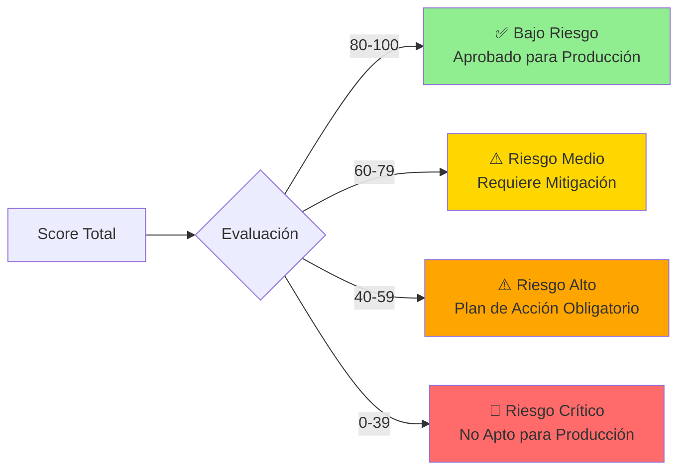
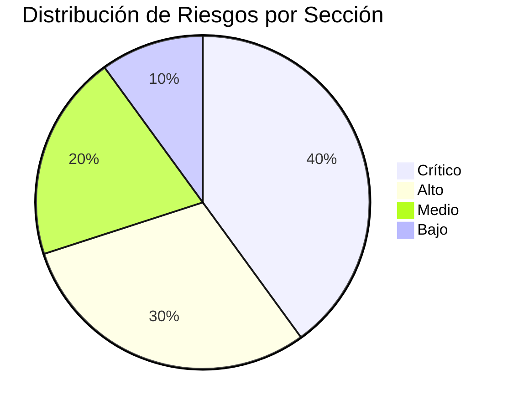
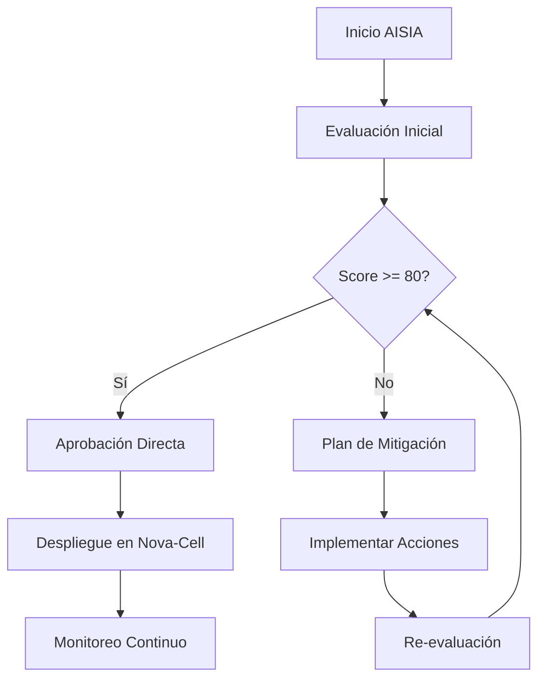

# Anexo B: Checklist AISIA (AI System Impact Assessment)

---

## 📊 Propósito y Alcance

Este checklist constituye la herramienta oficial para la **Evaluación de Impacto de Sistemas de IA (AISIA)** del banco, garantizando que todas las soluciones basadas en inteligencia artificial cumplan con las normativas internacionales y locales, así como con las directrices internas establecidas por el Centro de Excelencia de IA.

La evaluación se efectuará **antes de la puesta en producción**, abarcando aspectos relacionados con datos, seguridad, compliance, ética, performance y riesgos operativos, todo ello enmarcado en los lineamientos del **ISO 42001**, requisitos de la **CNBV** y la **LFPDPPP**, junto con las mejores prácticas globales de IA.

**ID del Checklist:** `CoE-IA-CHK-002`  
**Versión:** `2.0`  
**Fecha de Emisión:** `10 de enero de 2025`  
**Integración:** Nova-Cell 2.0

---

## 🎯 Sistema de Scoring Automático

<div id="scoring-dashboard" style="background: linear-gradient(135deg, #667eea 0%, #764ba2 100%); padding: 20px; border-radius: 10px; color: white; margin: 20px 0;">
  <h3 style="margin-top: 0;">Score Global AISIA</h3>
  <div style="font-size: 48px; font-weight: bold;" id="scoreGlobal">0</div>
  <div style="margin-top: 10px;">
    <span id="riskLevel" style="padding: 5px 15px; background: rgba(255,255,255,0.2); border-radius: 20px;">Calculando...</span>
  </div>
  <div style="margin-top: 20px; display: grid; grid-template-columns: repeat(3, 1fr); gap: 10px;">
    <div>🟢 Bajo Riesgo: 80-100</div>
    <div>🟡 Riesgo Medio: 60-79</div>
    <div>🔴 Alto Riesgo: < 60</div>
  </div>
</div>

---

## 1️⃣ Sección 1: Información General del Sistema

*Información básica y de alto nivel del sistema de IA en evaluación.*

| # | Ítem | Criticidad | Estado | Evidencia | Comentarios |
|---|------|------------|--------|-----------|-------------|
| 1.1 | **Nombre y versión del sistema** | 🔴 Crítico | ☐ Sí ☐ No ☐ Parcial | | |
| 1.2 | **Descripción general del sistema** | 🟠 Alto | ☐ Sí ☐ No ☐ Parcial | | |
| 1.3 | **Responsables y propietarios** | 🔴 Crítico | ☐ Sí ☐ No ☐ Parcial | | |
| 1.4 | **Fecha de creación y última revisión** | 🟡 Medio | ☐ Sí ☐ No ☐ Parcial | | |
| 1.5 | **Interfaces con otros sistemas** | 🟠 Alto | ☐ Sí ☐ No ☐ Parcial | | |
| 1.6 | **Alcance y limitaciones del sistema** | 🟡 Medio | ☐ Sí ☐ No ☐ Parcial | | |
| 1.7 | **Documentación técnica disponible** | 🔴 Crítico | ☐ Sí ☐ No ☐ Parcial | | |
| 1.8 | **Aprobación por equipos de compliance** | 🔴 Crítico | ☐ Sí ☐ No ☐ Parcial | | |
| 1.9 | **Registro de incidencias anteriores** | 🟢 Bajo | ☐ Sí ☐ No ☐ Parcial | | |
| 1.10 | **Integración con Nova-Cell 2.0** | 🔴 Crítico | ☐ Sí ☐ No ☐ Parcial | | |

**Score Sección 1:** <span id="score-s1">0/50</span>

---

## 2️⃣ Sección 2: Evaluación de Datos y Privacidad

*Gestión de datos y aspectos de privacidad según LFPDPPP.*

| # | Ítem | Criticidad | Estado | Evidencia | Comentarios |
|---|------|------------|--------|-----------|-------------|
| 2.1 | **Clasificación y etiquetado de datos** | 🔴 Crítico | ☐ Sí ☐ No ☐ Parcial | | |
| 2.2 | **Consentimiento informado para uso de datos** | 🟠 Alto | ☐ Sí ☐ No ☐ Parcial | | |
| 2.3 | **Mecanismos de anonimización** | 🔴 Crítico | ☐ Sí ☐ No ☐ Parcial | | |
| 2.4 | **Seguridad en el almacenamiento de datos** | 🔴 Crítico | ☐ Sí ☐ No ☐ Parcial | | |
| 2.5 | **Control de acceso y gestión de roles** | 🔴 Crítico | ☐ Sí ☐ No ☐ Parcial | | |
| 2.6 | **Integración con fuentes de datos externas** | 🟡 Medio | ☐ Sí ☐ No ☐ Parcial | | |
| 2.7 | **Políticas de retención y eliminación** | 🟡 Medio | ☐ Sí ☐ No ☐ Parcial | | |
| 2.8 | **Evaluación de riesgos en manejo de datos** | 🟠 Alto | ☐ Sí ☐ No ☐ Parcial | | |
| 2.9 | **Cumplimiento de la LFPDPPP** | 🔴 Crítico | ☐ Sí ☐ No ☐ Parcial | | |
| 2.10 | **Pruebas de acceso a datos sensibles** | 🟠 Alto | ☐ Sí ☐ No ☐ Parcial | | |

**Score Sección 2:** <span id="score-s2">0/50</span>

---

## 3️⃣ Sección 3: Evaluación Técnica y Performance

*Aspectos técnicos, performance y estabilidad del sistema.*

| # | Ítem | Criticidad | Estado | Evidencia | Comentarios |
|---|------|------------|--------|-----------|-------------|
| 3.1 | **Infraestructura y arquitectura** | 🔴 Crítico | ☐ Sí ☐ No ☐ Parcial | | |
| 3.2 | **Configuración de servidores y clusters** | 🟠 Alto | ☐ Sí ☐ No ☐ Parcial | | |
| 3.3 | **Escalabilidad y balanceo de carga** | 🔴 Crítico | ☐ Sí ☐ No ☐ Parcial | | |
| 3.4 | **Tiempo de respuesta y latencia** | 🟠 Alto | ☐ Sí ☐ No ☐ Parcial | | |
| 3.5 | **Pruebas de estrés y rendimiento** | 🔴 Crítico | ☐ Sí ☐ No ☐ Parcial | | |
| 3.6 | **Integración con servicios externos** | 🟡 Medio | ☐ Sí ☐ No ☐ Parcial | | |
| 3.7 | **Calidad de código y patrones de diseño** | 🟡 Medio | ☐ Sí ☐ No ☐ Parcial | | |
| 3.8 | **Mecanismos de backup y recuperación** | 🔴 Crítico | ☐ Sí ☐ No ☐ Parcial | | |
| 3.9 | **Actualización y parches de seguridad** | 🟠 Alto | ☐ Sí ☐ No ☐ Parcial | | |
| 3.10 | **Monitoreo y registro continuo** | 🟠 Alto | ☐ Sí ☐ No ☐ Parcial | | |

**Score Sección 3:** <span id="score-s3">0/50</span>

---

## 4️⃣ Sección 4: Evaluación de Riesgos y Controles

*Identificación, análisis y mitigación de riesgos.*

| # | Ítem | Criticidad | Estado | Evidencia | Comentarios |
|---|------|------------|--------|-----------|-------------|
| 4.1 | **Identificación de riesgos específicos** | 🔴 Crítico | ☐ Sí ☐ No ☐ Parcial | | |
| 4.2 | **Evaluación de impacto y probabilidad** | 🔴 Crítico | ☐ Sí ☐ No ☐ Parcial | | |
| 4.3 | **Existencia de plan de contingencia** | 🔴 Crítico | ☐ Sí ☐ No ☐ Parcial | | |
| 4.4 | **Controles de acceso y autenticación** | 🔴 Crítico | ☐ Sí ☐ No ☐ Parcial | | |
| 4.5 | **Protocolos de recuperación ante incidentes** | 🟠 Alto | ☐ Sí ☐ No ☐ Parcial | | |
| 4.6 | **Registro y seguimiento de incidentes** | 🟠 Alto | ☐ Sí ☐ No ☐ Parcial | | |
| 4.7 | **Test de vulnerabilidades y auditorías** | 🔴 Crítico | ☐ Sí ☐ No ☐ Parcial | | |
| 4.8 | **Actualización de controles y mejora continua** | 🟡 Medio | ☐ Sí ☐ No ☐ Parcial | | |
| 4.9 | **Integración del feedback de auditorías** | 🟡 Medio | ☐ Sí ☐ No ☐ Parcial | | |
| 4.10 | **Conformidad con CNBV e ISO 42001** | 🔴 Crítico | ☐ Sí ☐ No ☐ Parcial | | |

**Score Sección 4:** <span id="score-s4">0/50</span>

---

## 5️⃣ Sección 5: Evaluación Ética y Sesgo

*Principios éticos y prevención de sesgos algorítmicos.*

| # | Ítem | Criticidad | Estado | Evidencia | Comentarios |
|---|------|------------|--------|-----------|-------------|
| 5.1 | **Declaración de principios éticos adoptados** | 🔴 Crítico | ☐ Sí ☐ No ☐ Parcial | | |
| 5.2 | **Evaluación de sesgos en datos y modelo** | 🔴 Crítico | ☐ Sí ☐ No ☐ Parcial | | |
| 5.3 | **Transparencia del algoritmo (XAI)** | 🟠 Alto | ☐ Sí ☐ No ☐ Parcial | | |
| 5.4 | **Mecanismos de supervisión periódica** | 🟠 Alto | ☐ Sí ☐ No ☐ Parcial | | |
| 5.5 | **Inclusión de variables de equidad** | 🟡 Medio | ☐ Sí ☐ No ☐ Parcial | | |
| 5.6 | **Test de impacto social y ético** | 🔴 Crítico | ☐ Sí ☐ No ☐ Parcial | | |
| 5.7 | **Políticas de intervención en caso de sesgo** | 🟠 Alto | ☐ Sí ☐ No ☐ Parcial | | |
| 5.8 | **Validación por terceros independientes** | 🔴 Crítico | ☐ Sí ☐ No ☐ Parcial | | |
| 5.9 | **Canal de escalamiento de problemas éticos** | 🟡 Medio | ☐ Sí ☐ No ☐ Parcial | | |
| 5.10 | **Actualización de políticas éticas** | 🟡 Medio | ☐ Sí ☐ No ☐ Parcial | | |

**Score Sección 5:** <span id="score-s5">0/50</span>

---

## 6️⃣ Sección 6: Evaluación de Seguridad

*Auditoría de seguridad integral del sistema.*

| # | Ítem | Criticidad | Estado | Evidencia | Comentarios |
|---|------|------------|--------|-----------|-------------|
| 6.1 | **Control de acceso y autenticación robusta** | 🔴 Crítico | ☐ Sí ☐ No ☐ Parcial | | |
| 6.2 | **Uso de protocolos de encriptación** | 🔴 Crítico | ☐ Sí ☐ No ☐ Parcial | | |
| 6.3 | **Escaneo de vulnerabilidades periódicas** | 🔴 Crítico | ☐ Sí ☐ No ☐ Parcial | | |
| 6.4 | **Implementación de firewalls y IDS/IPS** | 🟠 Alto | ☐ Sí ☐ No ☐ Parcial | | |
| 6.5 | **Seguridad física en centros de datos** | 🟡 Medio | ☐ Sí ☐ No ☐ Parcial | | |
| 6.6 | **Pruebas de penetración** | 🔴 Crítico | ☐ Sí ☐ No ☐ Parcial | | |
| 6.7 | **Gestión de parches y actualizaciones** | 🟠 Alto | ☐ Sí ☐ No ☐ Parcial | | |
| 6.8 | **Monitoreo en tiempo real (SIEM)** | 🔴 Crítico | ☐ Sí ☐ No ☐ Parcial | | |
| 6.9 | **Protocolos de respuesta ante incidentes** | 🔴 Crítico | ☐ Sí ☐ No ☐ Parcial | | |
| 6.10 | **Revisión periódica de políticas** | 🟠 Alto | ☐ Sí ☐ No ☐ Parcial | | |

**Score Sección 6:** <span id="score-s6">0/50</span>

---

## 7️⃣ Sección 7: Evaluación de Cumplimiento Regulatorio

*Conformidad con normativas y estándares.*

| # | Ítem | Criticidad | Estado | Evidencia | Comentarios |
|---|------|------------|--------|-----------|-------------|
| 7.1 | **Certificación ISO 42001** | 🔴 Crítico | ☐ Sí ☐ No ☐ Parcial | | |
| 7.2 | **Cumplimiento con regulación CNBV** | 🔴 Crítico | ☐ Sí ☐ No ☐ Parcial | | |
| 7.3 | **Conformidad con la LFPDPPP** | 🔴 Crítico | ☐ Sí ☐ No ☐ Parcial | | |
| 7.4 | **Documentación de auditorías externas** | 🟠 Alto | ☐ Sí ☐ No ☐ Parcial | | |
| 7.5 | **Cumplimiento de estándares de seguridad** | 🔴 Crítico | ☐ Sí ☐ No ☐ Parcial | | |
| 7.6 | **Revisión y actualizaciones normativas** | 🟡 Medio | ☐ Sí ☐ No ☐ Parcial | | |
| 7.7 | **Integración de políticas de compliance** | 🔴 Crítico | ☐ Sí ☐ No ☐ Parcial | | |
| 7.8 | **Procedimientos de denuncia y remediación** | 🟠 Alto | ☐ Sí ☐ No ☐ Parcial | | |
| 7.9 | **Evaluación de impacto regulatorio** | 🟠 Alto | ☐ Sí ☐ No ☐ Parcial | | |
| 7.10 | **Aprobación final del área legal** | 🔴 Crítico | ☐ Sí ☐ No ☐ Parcial | | |

**Score Sección 7:** <span id="score-s7">0/50</span>

---

## 8️⃣ Sección 8: Evaluación de Impacto en Stakeholders

*Análisis del impacto en grupos de interés.*

| # | Ítem | Criticidad | Estado | Evidencia | Comentarios |
|---|------|------------|--------|-----------|-------------|
| 8.1 | **Identificación de stakeholders clave** | 🟠 Alto | ☐ Sí ☐ No ☐ Parcial | | |
| 8.2 | **Evaluación de expectativas y necesidades** | 🟡 Medio | ☐ Sí ☐ No ☐ Parcial | | |
| 8.3 | **Transparencia en el uso del sistema** | 🔴 Crítico | ☐ Sí ☐ No ☐ Parcial | | |
| 8.4 | **Participación en fase de diseño** | 🟠 Alto | ☐ Sí ☐ No ☐ Parcial | | |
| 8.5 | **Impacto potencial en imagen del banco** | 🔴 Crítico | ☐ Sí ☐ No ☐ Parcial | | |
| 8.6 | **Feedback y canal de comunicación** | 🟠 Alto | ☐ Sí ☐ No ☐ Parcial | | |
| 8.7 | **Estrategia de mitigación de impactos** | 🔴 Crítico | ☐ Sí ☐ No ☐ Parcial | | |
| 8.8 | **Comunicación de resultados** | 🟠 Alto | ☐ Sí ☐ No ☐ Parcial | | |
| 8.9 | **Revisión de alianzas con terceros** | 🟡 Medio | ☐ Sí ☐ No ☐ Parcial | | |
| 8.10 | **Validación por auditoría externa** | 🔴 Crítico | ☐ Sí ☐ No ☐ Parcial | | |

**Score Sección 8:** <span id="score-s8">0/50</span>

---

## 9️⃣ Sección 9: Plan de Monitoreo y Gobernanza

*Monitoreo continuo y gestión de incidentes.*

| # | Ítem | Criticidad | Estado | Evidencia | Comentarios |
|---|------|------------|--------|-----------|-------------|
| 9.1 | **Definición de KPIs y métricas** | 🔴 Crítico | ☐ Sí ☐ No ☐ Parcial | | |
| 9.2 | **Establecimiento de roles y responsabilidades** | 🟠 Alto | ☐ Sí ☐ No ☐ Parcial | | |
| 9.3 | **Plan de seguimiento periódico** | 🔴 Crítico | ☐ Sí ☐ No ☐ Parcial | | |
| 9.4 | **Sistema de alertas en tiempo real** | 🔴 Crítico | ☐ Sí ☐ No ☐ Parcial | | |
| 9.5 | **Registro y trazabilidad de incidentes** | 🟠 Alto | ☐ Sí ☐ No ☐ Parcial | | |
| 9.6 | **Integración con Nova-Cell 2.0** | 🔴 Crítico | ☐ Sí ☐ No ☐ Parcial | | |
| 9.7 | **Auditoría interna y revisión** | 🟠 Alto | ☐ Sí ☐ No ☐ Parcial | | |
| 9.8 | **Evaluación de retroalimentación** | 🟡 Medio | ☐ Sí ☐ No ☐ Parcial | | |
| 9.9 | **Actualización de políticas** | 🟠 Alto | ☐ Sí ☐ No ☐ Parcial | | |
| 9.10 | **Aprobación del comité de gobernanza** | 🔴 Crítico | ☐ Sí ☐ No ☐ Parcial | | |

**Score Sección 9:** <span id="score-s9">0/50</span>

---

## 📈 Matriz de Clasificación de Riesgo



---

## 📋 Plan de Acción y Recomendaciones

### Recomendaciones Prioritarias

<div id="recommendations" style="background: #f8f9fa; padding: 20px; border-radius: 10px; margin: 20px 0;">
  <h4>🔴 Acciones Críticas (Implementar Inmediatamente)</h4>
  <ul id="critical-actions">
    <li>Pendiente de evaluación...</li>
  </ul>
  
  <h4>🟠 Acciones de Alta Prioridad (Plazo: 30 días)</h4>
  <ul id="high-priority-actions">
    <li>Pendiente de evaluación...</li>
  </ul>
  
  <h4>🟡 Acciones de Prioridad Media (Plazo: 90 días)</h4>
  <ul id="medium-priority-actions">
    <li>Pendiente de evaluación...</li>
  </ul>
</div>

### Matriz RACI de Responsabilidades

| Acción | Responsible | Accountable | Consulted | Informed |
|--------|------------|-------------|-----------|----------|
| Evaluación Inicial | CoE IA | Director TI | Legal, Riesgos | Comité IA |
| Mitigación de Riesgos | Riesgos | CISO | CoE IA | Negocio |
| Validación Técnica | CoE IA | CTO | Arquitectura | PMO |
| Aprobación Final | Comité IA | CEO | Legal, Riesgos | Board |

---

## 🔧 JavaScript para Scoring Automático

```javascript
// Sistema de Scoring Automático AISIA
(function() {
  const PESO_CRITICO = 5;
  const PESO_ALTO = 4;
  const PESO_MEDIO = 3;
  const PESO_BAJO = 2;
  
  // Estructura de secciones con sus ítems
  const secciones = {
    s1: {
      nombre: "Información General",
      items: [
        {id: "1.1", criticidad: "critico", aprobado: false},
        {id: "1.2", criticidad: "alto", aprobado: false},
        {id: "1.3", criticidad: "critico", aprobado: false},
        {id: "1.4", criticidad: "medio", aprobado: false},
        {id: "1.5", criticidad: "alto", aprobado: false},
        {id: "1.6", criticidad: "medio", aprobado: false},
        {id: "1.7", criticidad: "critico", aprobado: false},
        {id: "1.8", criticidad: "critico", aprobado: false},
        {id: "1.9", criticidad: "bajo", aprobado: false},
        {id: "1.10", criticidad: "critico", aprobado: false}
      ]
    },
    // ... más secciones
  };
  
  function calcularScoreSeccion(seccion) {
    let puntaje = 0;
    let maxPuntaje = 0;
    
    seccion.items.forEach(item => {
      let peso = 0;
      switch(item.criticidad) {
        case 'critico': peso = PESO_CRITICO; break;
        case 'alto': peso = PESO_ALTO; break;
        case 'medio': peso = PESO_MEDIO; break;
        case 'bajo': peso = PESO_BAJO; break;
      }
      
      maxPuntaje += peso;
      if (item.aprobado) {
        puntaje += peso;
      }
    });
    
    return {
      puntaje: puntaje,
      maximo: maxPuntaje,
      porcentaje: Math.round((puntaje / maxPuntaje) * 100)
    };
  }
  
  function calcularScoreGlobal() {
    let totalPuntaje = 0;
    let totalMaximo = 0;
    
    Object.keys(secciones).forEach(key => {
      const score = calcularScoreSeccion(secciones[key]);
      totalPuntaje += score.puntaje;
      totalMaximo += score.maximo;
      
      // Actualizar display de cada sección
      const elemento = document.getElementById(`score-${key}`);
      if (elemento) {
        elemento.textContent = `${score.puntaje}/${score.maximo} (${score.porcentaje}%)`;
      }
    });
    
    const porcentajeGlobal = Math.round((totalPuntaje / totalMaximo) * 100);
    
    // Actualizar score global
    document.getElementById('scoreGlobal').textContent = porcentajeGlobal;
    
    // Determinar nivel de riesgo
    let nivelRiesgo = '';
    let colorRiesgo = '';
    
    if (porcentajeGlobal >= 80) {
      nivelRiesgo = '✅ Bajo Riesgo - Aprobado';
      colorRiesgo = '#28a745';
    } else if (porcentajeGlobal >= 60) {
      nivelRiesgo = '⚠️ Riesgo Medio - Requiere Mitigación';
      colorRiesgo = '#ffc107';
    } else if (porcentajeGlobal >= 40) {
      nivelRiesgo = '⚠️ Riesgo Alto - Plan de Acción Obligatorio';
      colorRiesgo = '#fd7e14';
    } else {
      nivelRiesgo = '🚫 Riesgo Crítico - No Apto';
      colorRiesgo = '#dc3545';
    }
    
    const elementoRiesgo = document.getElementById('riskLevel');
    if (elementoRiesgo) {
      elementoRiesgo.textContent = nivelRiesgo;
      elementoRiesgo.style.backgroundColor = colorRiesgo;
    }
    
    return porcentajeGlobal;
  }
  
  // Listener para checkboxes
  document.addEventListener('DOMContentLoaded', function() {
    const checkboxes = document.querySelectorAll('input[type="checkbox"]');
    checkboxes.forEach(checkbox => {
      checkbox.addEventListener('change', function() {
        // Actualizar estado en estructura de datos
        // Recalcular scores
        calcularScoreGlobal();
        generarRecomendaciones();
      });
    });
    
    // Cálculo inicial
    calcularScoreGlobal();
  });
  
  function generarRecomendaciones() {
    // Analizar ítems críticos no aprobados
    const accionesCriticas = [];
    const accionesAltas = [];
    const accionesMedias = [];
    
    Object.values(secciones).forEach(seccion => {
      seccion.items.forEach(item => {
        if (!item.aprobado) {
          switch(item.criticidad) {
            case 'critico':
              accionesCriticas.push(`Completar ítem ${item.id}: ${getDescripcionItem(item.id)}`);
              break;
            case 'alto':
              accionesAltas.push(`Revisar ítem ${item.id}: ${getDescripcionItem(item.id)}`);
              break;
            case 'medio':
              accionesMedias.push(`Evaluar ítem ${item.id}: ${getDescripcionItem(item.id)}`);
              break;
          }
        }
      });
    });
    
    // Actualizar listas de recomendaciones
    actualizarListaRecomendaciones('critical-actions', accionesCriticas);
    actualizarListaRecomendaciones('high-priority-actions', accionesAltas);
    actualizarListaRecomendaciones('medium-priority-actions', accionesMedias);
  }
  
  function actualizarListaRecomendaciones(elementId, acciones) {
    const elemento = document.getElementById(elementId);
    if (elemento) {
      elemento.innerHTML = acciones.length > 0 
        ? acciones.map(a => `<li>${a}</li>`).join('')
        : '<li>✅ No hay acciones pendientes en esta categoría</li>';
    }
  }
  
  function getDescripcionItem(itemId) {
    // Mapeo de descripciones de ítems
    const descripciones = {
      "1.1": "Documentar nombre y versión del sistema",
      "1.2": "Completar descripción general",
      // ... más descripciones
    };
    return descripciones[itemId] || "Acción requerida";
  }
  
  // Función para exportar a PDF
  window.exportarAPDF = function() {
    const contenido = document.getElementById('checklist-content');
    const scoreGlobal = calcularScoreGlobal();
    
    // Aquí se integraría con una librería como jsPDF
    console.log('Exportando a PDF con score global:', scoreGlobal);
    alert('Funcionalidad de exportación a PDF - Score: ' + scoreGlobal + '%');
  };
  
})();
```

---

## 📊 Dashboard de Visualización





---

## 📝 Trazabilidad y Auditoría

### Registro de Evaluaciones

| Fecha | Evaluador | Score | Resultado | Firma Digital |
|-------|-----------|-------|-----------|---------------|
| | | | | |
| | | | | |

### Historial de Cambios

| Versión | Fecha | Cambios Realizados | Responsable |
|---------|-------|-------------------|-------------|
| 2.0 | 10/01/2025 | Versión inicial con scoring automático | CoE IA |
| | | | |

---

## 🔐 Firmas de Aprobación

| Rol | Nombre | Firma | Fecha |
|-----|--------|-------|-------|
| **Responsable de Tecnología** | | | |
| **Responsable de Compliance** | | | |
| **Líder del CoE IA** | | | |
| **Director de Riesgos** | | | |
| **Representante Legal** | | | |

---

## 📚 Referencias y Normativas

- **ISO 42001:2023** - Sistema de Gestión de IA
- **Circular Única de Bancos CNBV** - Disposiciones de IA
- **LFPDPPP** - Ley Federal de Protección de Datos Personales
- **Framework IMPACT** - Metodología interna de evaluación
- **Nova-Cell 2.0** - Plataforma de gestión de modelos

---

## 📞 Soporte y Contacto

**Centro de Excelencia de IA**
- 📧 Email: coe-ia@novasolutionsystems.com
- 💬 Teams: Canal #AISIA-Support
- 🌐 Portal: https://aisia.banco.interno
- 📱 Ext: 5555

---

**Versión:** 2.0  
**Última Actualización:** 10 de enero de 2025  
**Próxima Revisión:** Abril 2025  
**Clasificación:** Uso Interno - Confidencial

---

<div style="text-align: center; margin-top: 40px;">
  <button onclick="exportarAPDF()" style="background: linear-gradient(135deg, #667eea 0%, #764ba2 100%); color: white; padding: 15px 30px; border: none; border-radius: 25px; font-size: 16px; cursor: pointer;">
    📄 Exportar Evaluación a PDF
  </button>
</div>