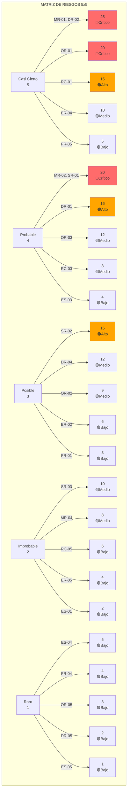
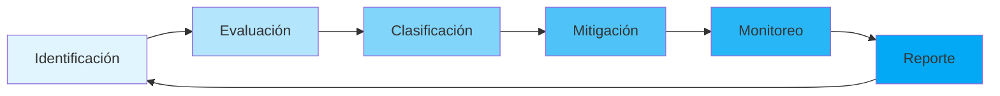

# Anexo C: Matriz de Clasificación de Riesgos de IA

---

## 🎯 Introducción y Marco Conceptual

Este anexo establece la **Matriz de Clasificación de Riesgos** específica para sistemas de Inteligencia Artificial del banco, alineada con los estándares internacionales ISO 31000 (Gestión de Riesgos), ISO 42001 (IA), Basilea III y la regulación CNBV vigente.

La matriz proporciona un framework sistemático para identificar, evaluar, clasificar y gestionar los riesgos asociados con el desarrollo, implementación y operación de sistemas de IA, integrándose con el Enterprise Risk Management (ERM) del banco y la plataforma Nova-Cell 2.0 para monitoreo continuo.

**Documento ID:** `CoE-IA-RISK-003`  
**Versión:** `2.0`  
**Fecha:** `10 de enero de 2025`  
**Clasificación:** Confidencial - Uso Interno

### Principios Fundamentales

1. **Proporcionalidad**: El nivel de control debe ser proporcional al riesgo
2. **Integralidad**: Cobertura de todos los tipos de riesgo de IA
3. **Dinamismo**: Actualización continua según evolución del entorno
4. **Transparencia**: Metodología clara y auditable
5. **Alineación**: Coherencia con el apetito de riesgo institucional

---

## 📊 Dashboard Ejecutivo de Riesgos

<div style="background: linear-gradient(135deg, #667eea 0%, #764ba2 100%); padding: 25px; border-radius: 15px; color: white; margin: 20px 0;">
  <h2 style="margin-top: 0; text-align: center;">🔍 Risk Intelligence Dashboard</h2>
  
  <div style="display: grid; grid-template-columns: repeat(4, 1fr); gap: 15px; margin-top: 20px;">
    <div style="background: rgba(255,255,255,0.1); padding: 15px; border-radius: 10px; text-align: center;">
      <div style="font-size: 32px; font-weight: bold;">42</div>
      <div style="font-size: 12px; margin-top: 5px;">Riesgos Identificados</div>
    </div>
    <div style="background: rgba(255,255,255,0.1); padding: 15px; border-radius: 10px; text-align: center;">
      <div style="font-size: 32px; font-weight: bold; color: #ff6b6b;">8</div>
      <div style="font-size: 12px; margin-top: 5px;">Riesgos Críticos</div>
    </div>
    <div style="background: rgba(255,255,255,0.1); padding: 15px; border-radius: 10px; text-align: center;">
      <div style="font-size: 32px; font-weight: bold; color: #ffd93d;">15</div>
      <div style="font-size: 12px; margin-top: 5px;">Riesgos Altos</div>
    </div>
    <div style="background: rgba(255,255,255,0.1); padding: 15px; border-radius: 10px; text-align: center;">
      <div style="font-size: 32px; font-weight: bold; color: #6bcf7f;">85%</div>
      <div style="font-size: 12px; margin-top: 5px;">Cobertura de Controles</div>
    </div>
  </div>
</div>

---

## 🗂️ Taxonomía de Riesgos de IA

### Categoría 1: Riesgos de Modelo (Model Risk)

| ID | Subcategoría | Descripción | Ejemplos |
|----|--------------|-------------|----------|
| MR-01 | **Sesgo Algorítmico** | Discriminación sistemática en predicciones | Sesgo en scoring crediticio por género/zona |
| MR-02 | **Drift del Modelo** | Degradación del performance en el tiempo | Cambios en patrones de comportamiento post-COVID |
| MR-03 | **Overfitting** | Sobreajuste a datos de entrenamiento | Modelo memoriza en lugar de generalizar |
| MR-04 | **Interpretabilidad** | Falta de explicabilidad (black box) | Decisiones no auditables para regulador |
| MR-05 | **Robustez** | Vulnerabilidad a ataques adversarios | Manipulación de inputs para obtener outputs deseados |

### Categoría 2: Riesgos de Datos (Data Risk)

| ID | Subcategoría | Descripción | Ejemplos |
|----|--------------|-------------|----------|
| DR-01 | **Calidad de Datos** | Datos incorrectos, incompletos o desactualizados | Direcciones erróneas afectan geolocalización |
| DR-02 | **Privacidad** | Exposición de datos personales sensibles | Filtración de PII en logs de entrenamiento |
| DR-03 | **Data Poisoning** | Contaminación maliciosa de datos | Inyección de datos falsos en training set |
| DR-04 | **Dependencia de Terceros** | Riesgos en datos externos | APIs de proveedores no disponibles |
| DR-05 | **Gobernanza de Datos** | Falta de linaje y catalogación | No trazabilidad del origen de datos |

### Categoría 3: Riesgos Operacionales (Operational Risk)

| ID | Subcategoría | Descripción | Ejemplos |
|----|--------------|-------------|----------|
| OR-01 | **Disponibilidad** | Interrupciones del servicio de IA | Caída del sistema de recomendaciones |
| OR-02 | **Latencia** | Tiempos de respuesta inadecuados | Timeout en decisiones real-time |
| OR-03 | **Escalabilidad** | Incapacidad de manejar volumen | Colapso en Black Friday |
| OR-04 | **Integración** | Fallas en interfaces con otros sistemas | Incompatibilidad con core bancario |
| OR-05 | **Monitoreo** | Detección tardía de problemas | Alertas no configuradas correctamente |

### Categoría 4: Riesgos Regulatorios y de Cumplimiento

| ID | Subcategoría | Descripción | Ejemplos |
|----|--------------|-------------|----------|
| RC-01 | **CNBV** | Incumplimiento de disposiciones IA | Falta de documentación para auditoría |
| RC-02 | **LFPDPPP** | Violación de protección de datos | Uso sin consentimiento informado |
| RC-03 | **PLD/FT** | Fallas en detección de lavado | Falsos negativos en screening |
| RC-04 | **ISO 42001** | No conformidad con estándar | Falta de evaluación de impacto |
| RC-05 | **Cross-border** | Restricciones internacionales | GDPR para clientes europeos |

### Categoría 5: Riesgos Éticos y Reputacionales

| ID | Subcategoría | Descripción | Ejemplos |
|----|--------------|-------------|----------|
| ER-01 | **Equidad** | Tratamiento desigual a grupos | Tasas diferentes por código postal |
| ER-02 | **Transparencia** | Opacidad en decisiones | Cliente no entiende rechazo de crédito |
| ER-03 | **Autonomía** | Decisiones sin supervisión humana | IA aprueba préstamos sin revisión |
| ER-04 | **Confianza** | Pérdida de credibilidad | Errores públicos del chatbot |
| ER-05 | **Responsabilidad** | Unclear accountability | ¿Quién responde por decisión errónea? |

### Categoría 6: Riesgos de Seguridad y Ciberseguridad

| ID | Subcategoría | Descripción | Ejemplos |
|----|--------------|-------------|----------|
| SR-01 | **Model Extraction** | Robo de propiedad intelectual | Reverse engineering del modelo |
| SR-02 | **Adversarial Attacks** | Manipulación maliciosa | Evasión de detección de fraude |
| SR-03 | **Inyección de Prompts** | Manipulación de LLMs | Jailbreak de restricciones |
| SR-04 | **Acceso No Autorizado** | Breach de sistemas de IA | Credenciales comprometidas |
| SR-05 | **Supply Chain** | Vulnerabilidades en dependencias | Librerías ML con backdoors |

### Categoría 7: Riesgos Financieros y de Negocio

| ID | Subcategoría | Descripción | Ejemplos |
|----|--------------|-------------|----------|
| FR-01 | **ROI Negativo** | Costos superan beneficios | Proyecto IA no rentable |
| FR-02 | **Oportunidad** | Pérdida de ventaja competitiva | Competencia implementa primero |
| FR-03 | **Concentración** | Dependencia excesiva de IA | Single point of failure |
| FR-04 | **Escalamiento** | Costos exponenciales | Infraestructura GPU prohibitiva |
| FR-05 | **Vendor Lock-in** | Dependencia de proveedor único | Migración imposible/costosa |

### Categoría 8: Riesgos Emergentes y Sistémicos

| ID | Subcategoría | Descripción | Ejemplos |
|----|--------------|-------------|----------|
| ES-01 | **AGI Risk** | Riesgos de IA general | Comportamiento impredecible |
| ES-02 | **Cascada Sistémica** | Contagio entre sistemas | Falla propaga a otros bancos |
| ES-03 | **Regulación Futura** | Cambios normativos | Nueva ley prohíbe uso actual |
| ES-04 | **Singularidad Tecnológica** | Pérdida de control | IA autónoma toma decisiones |
| ES-05 | **Impacto Social** | Disrupción laboral | Automatización masiva |

---

## 🔥 Matriz de Evaluación Probabilidad x Impacto

### Heat Map de Riesgos



### Tabla de Clasificación 5x5

| Probabilidad / Impacto | Insignificante (1) | Menor (2) | Moderado (3) | Mayor (4) | Catastrófico (5) |
|------------------------|-------------------|-----------|--------------|----------|------------------|
| **Casi Cierto (5)** | 5 🟢Bajo | 10 🟡Medio | 15 🟠Alto | 20 🔴Crítico | 25 🔴Crítico |
| **Probable (4)** | 4 🟢Bajo | 8 🟡Medio | 12 🟡Medio | 16 🟠Alto | 20 🔴Crítico |
| **Posible (3)** | 3 🟢Bajo | 6 🟢Bajo | 9 🟡Medio | 12 🟡Medio | 15 🟠Alto |
| **Improbable (2)** | 2 🟢Bajo | 4 🟢Bajo | 6 🟢Bajo | 8 🟡Medio | 10 🟡Medio |
| **Raro (1)** | 1 🟢Bajo | 2 🟢Bajo | 3 🟢Bajo | 4 🟢Bajo | 5 🟢Bajo |

---

## 📐 Sistema de Scoring y Clasificación

### Metodología de Cálculo

```javascript
// Cálculo del Score de Riesgo
function calcularRiesgoInherente(probabilidad, impacto) {
    return probabilidad * impacto;
}

function calcularRiesgoResidual(riesgoInherente, efectividadControl) {
    // efectividadControl: 0-100%
    return riesgoInherente * (1 - efectividadControl/100);
}

// Clasificación del Riesgo
function clasificarRiesgo(score) {
    if (score >= 20) return {nivel: 'CRÍTICO', color: '#ff6b6b', accion: 'INMEDIATA'};
    if (score >= 15) return {nivel: 'ALTO', color: '#ffa500', accion: '7 DÍAS'};
    if (score >= 10) return {nivel: 'MEDIO', color: '#ffd93d', accion: '30 DÍAS'};
    if (score >= 5)  return {nivel: 'BAJO', color: '#90ee90', accion: '90 DÍAS'};
    return {nivel: 'MÍNIMO', color: '#4caf50', accion: 'MONITOREO'};
}
```

### Criterios de Evaluación

| Criterio | Peso | Factores de Evaluación |
|----------|------|------------------------|
| **Impacto Financiero** | 30% | Pérdidas directas, multas, remediation |
| **Impacto Regulatorio** | 25% | Sanciones, restricciones operativas |
| **Impacto Reputacional** | 20% | Cobertura mediática, pérdida de clientes |
| **Impacto Operacional** | 15% | Interrupción de servicios, productividad |
| **Impacto Estratégico** | 10% | Pérdida de ventaja competitiva |

### Umbrales de Tolerancia

| Tipo de Riesgo | Apetito | Tolerancia | Capacidad |
|----------------|---------|------------|-----------|
| **Modelo** | Bajo | 5% error rate | 10% max |
| **Datos** | Muy Bajo | Zero PII breach | 1 incidente/año |
| **Operacional** | Medio | 99.9% uptime | 99.5% min |
| **Regulatorio** | Zero | 100% compliance | N/A |
| **Ético** | Muy Bajo | Zero discriminación | Case-by-case |

---

## 🛡️ Controles Mitigantes por Categoría

### Controles para Riesgos de Modelo

| Control ID | Nombre del Control | Tipo | Efectividad | Costo |
|------------|-------------------|------|-------------|-------|
| CM-01 | **Validación Independiente** | Preventivo | 85% | Alto |
| CM-02 | **Monitoreo de Drift** | Detectivo | 75% | Medio |
| CM-03 | **Explicabilidad (XAI)** | Correctivo | 70% | Alto |
| CM-04 | **A/B Testing** | Preventivo | 80% | Bajo |
| CM-05 | **Model Governance Committee** | Preventivo | 90% | Medio |

### Controles para Riesgos de Datos

| Control ID | Nombre del Control | Tipo | Efectividad | Costo |
|------------|-------------------|------|-------------|-------|
| CD-01 | **Data Quality Gates** | Preventivo | 80% | Medio |
| CD-02 | **Encriptación End-to-End** | Preventivo | 95% | Alto |
| CD-03 | **Anonimización/Pseudonimización** | Preventivo | 85% | Medio |
| CD-04 | **Data Lineage Tracking** | Detectivo | 70% | Alto |
| CD-05 | **Consent Management** | Preventivo | 90% | Medio |

### Controles para Riesgos Operacionales

| Control ID | Nombre del Control | Tipo | Efectividad | Costo |
|------------|-------------------|------|-------------|-------|
| CO-01 | **SLA Monitoring** | Detectivo | 85% | Bajo |
| CO-02 | **Auto-scaling** | Correctivo | 80% | Medio |
| CO-03 | **Circuit Breakers** | Preventivo | 75% | Bajo |
| CO-04 | **Disaster Recovery Plan** | Correctivo | 90% | Alto |
| CO-05 | **Performance Testing** | Preventivo | 70% | Medio |

### Controles para Riesgos Regulatorios

| Control ID | Nombre del Control | Tipo | Efectividad | Costo |
|------------|-------------------|------|-------------|-------|
| CR-01 | **Compliance Dashboard** | Detectivo | 80% | Medio |
| CR-02 | **Regulatory Change Management** | Preventivo | 85% | Alto |
| CR-03 | **Audit Trail Complete** | Detectivo | 95% | Medio |
| CR-04 | **Legal Review Process** | Preventivo | 90% | Alto |
| CR-05 | **Training & Awareness** | Preventivo | 70% | Bajo |

---

## 📈 KRIs - Indicadores Clave de Riesgo

### Panel de KRIs

| KRI ID | Indicador | Umbral Verde | Umbral Ámbar | Umbral Rojo | Frecuencia |
|--------|-----------|--------------|--------------|-------------|------------|
| KRI-01 | **Model Accuracy Degradation** | < 2% | 2-5% | > 5% | Diario |
| KRI-02 | **Data Quality Score** | > 95% | 90-95% | < 90% | Semanal |
| KRI-03 | **System Availability** | > 99.9% | 99.5-99.9% | < 99.5% | Real-time |
| KRI-04 | **Regulatory Findings** | 0 | 1-2 | > 2 | Mensual |
| KRI-05 | **Ethics Complaints** | 0 | 1-3 | > 3 | Mensual |
| KRI-06 | **Security Incidents** | 0 | 1 | > 1 | Real-time |
| KRI-07 | **Cost Overrun** | < 5% | 5-15% | > 15% | Mensual |
| KRI-08 | **Vendor SLA Breach** | 0 | 1-2 | > 2 | Semanal |

### Fórmulas de Cálculo

```python
# Ejemplo de cálculo de KRI-01
def calculate_model_degradation(baseline_accuracy, current_accuracy):
    degradation = ((baseline_accuracy - current_accuracy) / baseline_accuracy) * 100
    if degradation < 2:
        return "GREEN"
    elif degradation <= 5:
        return "AMBER"
    else:
        return "RED"

# Agregación de KRIs para Risk Score Global
def calculate_global_risk_score(kris):
    weights = {
        'KRI-01': 0.20, 'KRI-02': 0.15, 'KRI-03': 0.15,
        'KRI-04': 0.20, 'KRI-05': 0.10, 'KRI-06': 0.15,
        'KRI-07': 0.05
    }
    total_score = sum(kri['score'] * weights[kri['id']] for kri in kris)
    return total_score
```

---

## 🎨 Dashboard Visual Interactivo

<div style="background: #f8f9fa; padding: 20px; border-radius: 10px;">
  <h3 style="text-align: center;">Risk Heat Map - Vista en Tiempo Real</h3>
  
  <div style="display: grid; grid-template-columns: repeat(5, 1fr); gap: 5px; margin: 20px 0;">
    <!-- Fila 5 - Casi Cierto -->
    <div style="background: #90ee90; padding: 10px; text-align: center; border: 1px solid #ddd;">5-1</div>
    <div style="background: #ffd93d; padding: 10px; text-align: center; border: 1px solid #ddd;">5-2</div>
    <div style="background: #ffa500; padding: 10px; text-align: center; border: 1px solid #ddd;">5-3</div>
    <div style="background: #ff6b6b; padding: 10px; text-align: center; border: 1px solid #ddd;">5-4</div>
    <div style="background: #ff6b6b; padding: 10px; text-align: center; border: 1px solid #ddd;">5-5<br/>MR-01</div>
    
    <!-- Fila 4 - Probable -->
    <div style="background: #90ee90; padding: 10px; text-align: center; border: 1px solid #ddd;">4-1</div>
    <div style="background: #ffd93d; padding: 10px; text-align: center; border: 1px solid #ddd;">4-2</div>
    <div style="background: #ffd93d; padding: 10px; text-align: center; border: 1px solid #ddd;">4-3</div>
    <div style="background: #ffa500; padding: 10px; text-align: center; border: 1px solid #ddd;">4-4<br/>DR-01</div>
    <div style="background: #ff6b6b; padding: 10px; text-align: center; border: 1px solid #ddd;">4-5<br/>SR-01</div>
    
    <!-- Fila 3 - Posible -->
    <div style="background: #90ee90; padding: 10px; text-align: center; border: 1px solid #ddd;">3-1</div>
    <div style="background: #90ee90; padding: 10px; text-align: center; border: 1px solid #ddd;">3-2</div>
    <div style="background: #ffd93d; padding: 10px; text-align: center; border: 1px solid #ddd;">3-3<br/>OR-02</div>
    <div style="background: #ffd93d; padding: 10px; text-align: center; border: 1px solid #ddd;">3-4</div>
    <div style="background: #ffa500; padding: 10px; text-align: center; border: 1px solid #ddd;">3-5</div>
    
    <!-- Fila 2 - Improbable -->
    <div style="background: #90ee90; padding: 10px; text-align: center; border: 1px solid #ddd;">2-1</div>
    <div style="background: #90ee90; padding: 10px; text-align: center; border: 1px solid #ddd;">2-2</div>
    <div style="background: #90ee90; padding: 10px; text-align: center; border: 1px solid #ddd;">2-3</div>
    <div style="background: #ffd93d; padding: 10px; text-align: center; border: 1px solid #ddd;">2-4</div>
    <div style="background: #ffd93d; padding: 10px; text-align: center; border: 1px solid #ddd;">2-5</div>
    
    <!-- Fila 1 - Raro -->
    <div style="background: #90ee90; padding: 10px; text-align: center; border: 1px solid #ddd;">1-1</div>
    <div style="background: #90ee90; padding: 10px; text-align: center; border: 1px solid #ddd;">1-2</div>
    <div style="background: #90ee90; padding: 10px; text-align: center; border: 1px solid #ddd;">1-3</div>
    <div style="background: #90ee90; padding: 10px; text-align: center; border: 1px solid #ddd;">1-4</div>
    <div style="background: #90ee90; padding: 10px; text-align: center; border: 1px solid #ddd;">1-5</div>
  </div>
  
  <div style="text-align: center; margin-top: 10px;">
    <span>⬅️ IMPACTO ➡️</span>
  </div>
</div>

---

## 💼 Casos de Uso y Ejemplos Prácticos

### Caso 1: Modelo de Scoring Crediticio con Sesgo

**Contexto:** Modelo de ML para aprobación de créditos muestra sesgo contra códigos postales específicos.

| Aspecto | Evaluación |
|---------|------------|
| **Riesgo Identificado** | MR-01 (Sesgo Algorítmico) |
| **Probabilidad** | 4 - Probable |
| **Impacto** | 5 - Catastrófico (multas CNBV + daño reputacional) |
| **Score Inherente** | 20 - CRÍTICO |
| **Controles Aplicados** | CM-01 (Validación), CM-03 (XAI) |
| **Efectividad Control** | 75% |
| **Score Residual** | 5 - BAJO |
| **Plan de Acción** | 1. Re-entrenamiento con datos balanceados<br/>2. Implementar fairness constraints<br/>3. Auditoría trimestral de equidad |

### Caso 2: Chatbot con Alucinaciones

**Contexto:** Chatbot de servicio al cliente proporciona información incorrecta sobre productos.

| Aspecto | Evaluación |
|---------|------------|
| **Riesgo Identificado** | ER-04 (Pérdida de Confianza) |
| **Probabilidad** | 3 - Posible |
| **Impacto** | 4 - Mayor |
| **Score Inherente** | 12 - MEDIO |
| **Controles Aplicados** | Human-in-the-loop, Knowledge base validation |
| **Efectividad Control** | 60% |
| **Score Residual** | 4.8 - BAJO |
| **Plan de Acción** | 1. Implementar RAG con fuentes verificadas<br/>2. Confidence scoring en respuestas<br/>3. Escalamiento automático a humano |

### Caso 3: Fuga de Datos en Training Pipeline

**Contexto:** Datos personales sensibles expuestos en logs de entrenamiento en cloud.

| Aspecto | Evaluación |
|---------|------------|
| **Riesgo Identificado** | DR-02 (Privacidad) + RC-02 (LFPDPPP) |
| **Probabilidad** | 2 - Improbable |
| **Impacto** | 5 - Catastrófico |
| **Score Inherente** | 10 - MEDIO |
| **Controles Aplicados** | CD-02 (Encriptación), CD-03 (Anonimización) |
| **Efectividad Control** | 90% |
| **Score Residual** | 1 - MÍNIMO |
| **Plan de Acción** | 1. Implementar data masking automático<br/>2. Segregación de ambientes<br/>3. DLP en todos los endpoints |

---

## 🔄 Proceso de Actualización y Monitoreo

### Ciclo de Gestión de Riesgos



### Frecuencia de Revisión

| Componente | Frecuencia | Responsable | Entregable |
|------------|------------|-------------|------------|
| **Risk Assessment** | Trimestral | Risk Management | Informe de evaluación |
| **KRI Monitoring** | Tiempo real / Diario | CoE IA | Dashboard Nova-Cell |
| **Control Testing** | Semestral | Auditoría Interna | Reporte de efectividad |
| **Risk Appetite** | Anual | Board de Directores | Statement actualizado |
| **Taxonomía** | Anual | ERM + CoE IA | Catálogo de riesgos |

---

## 📊 Integración con Nova-Cell 2.0

### APIs de Integración

```python
# Conexión con Nova-Cell Risk Module
from nova_cell import RiskManager

risk_mgr = RiskManager(
    api_key="YOUR_API_KEY",
    environment="production"
)

# Registro de nuevo riesgo
new_risk = risk_mgr.create_risk({
    "category": "MR",
    "subcategory": "Model Drift",
    "probability": 4,
    "impact": 3,
    "description": "Degradación detectada en modelo de fraude",
    "owner": "jperez@novasolutionsystems.com",
    "controls": ["CM-02", "CO-01"]
})

# Actualización de KRI
risk_mgr.update_kri(
    kri_id="KRI-01",
    value=3.5,
    status="AMBER"
)

# Generación de reporte
report = risk_mgr.generate_report(
    type="executive",
    period="Q1-2025",
    format="pdf"
)
```

---

## 📝 Governance y Escalamiento

### Matriz de Escalamiento

| Nivel de Riesgo | Tiempo de Respuesta | Nivel de Aprobación | Comunicación |
|-----------------|-------------------|---------------------|--------------|
| **CRÍTICO** | Inmediato | CEO + Board | Regulador en 24hrs |
| **ALTO** | 24 horas | CRO + Comité Riesgos | Comité Ejecutivo |
| **MEDIO** | 7 días | Director de Área | Risk Management |
| **BAJO** | 30 días | Gerente de Proyecto | Reporte mensual |
| **MÍNIMO** | Monitoreo regular | Analista de Riesgos | Dashboard |

### Comités de Gobierno

1. **Comité de Riesgos de IA** - Mensual
2. **Comité de Ética en IA** - Trimestral
3. **Board Risk Committee** - Trimestral
4. **Comité de Auditoría** - Semestral

---

## 🎯 Métricas de Efectividad

### KPIs del Framework de Riesgos

| Métrica | Meta 2025 | Actual | Tendencia |
|---------|-----------|--------|-----------|
| **Riesgos Críticos Abiertos** | 0 | 2 | ↘️ |
| **Tiempo Promedio de Resolución** | < 15 días | 18 días | ↘️ |
| **Cobertura de Controles** | > 90% | 85% | ↗️ |
| **Incidentes por Riesgo No Identificado** | 0 | 1 | ➡️ |
| **ROI de Controles** | > 3:1 | 2.8:1 | ↗️ |

---

## 📋 Plantilla de Evaluación Rápida

```markdown
## Quick Risk Assessment Template

**Fecha:** ___________
**Evaluador:** ___________
**Sistema IA:** ___________

### 1. Identificación
- [ ] Categoría: _________
- [ ] Subcategoría: _________

### 2. Evaluación
- [ ] Probabilidad (1-5): ___
- [ ] Impacto (1-5): ___
- [ ] Score Inherente: ___

### 3. Controles
- [ ] Control 1: _________
- [ ] Control 2: _________
- [ ] Efectividad Total: ___%

### 4. Riesgo Residual
- [ ] Score: ___
- [ ] Clasificación: _________

### 5. Plan de Acción
- [ ] Acción inmediata: _________
- [ ] Responsable: _________
- [ ] Fecha límite: _________
```

---

## 🔗 Referencias y Recursos

- ISO 31000:2018 - Risk Management Guidelines
- ISO/IEC 23053:2022 - Framework for AI systems using ML
- ISO/IEC 23894:2023 - AI risk management
- CNBV - Disposiciones de carácter general aplicables a las instituciones de crédito
- Basilea III - Operational Risk Management
- NIST AI Risk Management Framework 1.0

---

## 📞 Contacto y Soporte

**Gestión de Riesgos IA - CoE**
- 📧 risk-ai@novasolutionsystems.com
- 💬 #Google Chat: #risk-management-ai
- 📱 Hotline: 5555 (Riesgos Críticos)
- 🌐 Portal: https://risk.nova-cell.banco.interno

---

**Versión:** 2.0  
**Última Actualización:** 10 de enero de 2025  
**Próxima Revisión:** Marzo 2025  
**Clasificación:** Confidencial - Uso Interno

---

*Este documento es propiedad del Centro de Excelencia de IA y el área de Gestión de Riesgos. Cualquier reproducción o distribución requiere autorización expresa.*