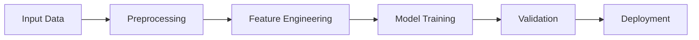
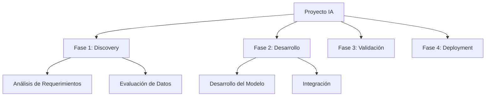

# Anexo D: Plantillas de Documentación para IA

---

## 📝 Introducción

Este anexo proporciona las plantillas estandarizadas para la documentación de proyectos de IA del banco, asegurando consistencia, cumplimiento regulatorio y facilidad de uso. Todas las plantillas están alineadas con CNBV, ISO 42001 y se integran con Nova-Cell 2.0.

**ID del Documento:** `CoE-IA-TPL-004`  
**Versión:** `2.0`  
**Fecha:** `10 de enero de 2025`  
**Clasificación:** Uso Interno

---

## 1️⃣ Plantilla Business Case IA

### Propósito
Documentar la justificación de negocio para proyectos de IA.

```markdown
# Business Case - [Nombre del Proyecto]

## 1. Resumen Ejecutivo
**[OBLIGATORIO]** Descripción breve del proyecto de IA (máx. 200 palabras)
📝 _Ejemplo: "Desarrollo de modelo predictivo para detección temprana de fraude en transacciones digitales, reduciendo pérdidas en 30%."_

## 2. Problema de Negocio
**[OBLIGATORIO]** Situación actual y problema a resolver
- **Contexto:** [Descripción del entorno actual]
- **Dolor de negocio:** [Impacto cuantificado]
- **Oportunidad:** [Beneficio potencial]

💡 _Guía: Incluir métricas actuales y benchmark de industria_

## 3. Solución Propuesta
**[OBLIGATORIO]** Descripción de la solución de IA
- **Tecnología:** [Tipo de modelo/algoritmo]
- **Alcance:** [Áreas/procesos impactados]
- **Integración:** [Sistemas existentes]

## 4. Análisis Financiero
**[OBLIGATORIO]** Evaluación económica del proyecto

| Concepto | Año 1 | Año 2 | Año 3 | Total |
|----------|-------|-------|-------|-------|
| **Inversión (CAPEX)** | $_____ | $_____ | $_____ | $_____ |
| **Operación (OPEX)** | $_____ | $_____ | $_____ | $_____ |
| **Beneficios** | $_____ | $_____ | $_____ | $_____ |
| **ROI** | ___% | ___% | ___% | ___% |

## 5. Análisis de Riesgos
**[OBLIGATORIO]** Principales riesgos identificados

| Riesgo | Probabilidad | Impacto | Mitigación |
|--------|--------------|---------|------------|
| [Descripción] | Alta/Media/Baja | Alto/Medio/Bajo | [Estrategia] |

## 6. Alineación Estratégica
- [ ] Transformación Digital
- [ ] Experiencia del Cliente
- [ ] Eficiencia Operacional
- [ ] Gestión de Riesgos
- [ ] Cumplimiento Regulatorio

## 7. Cronograma de Alto Nivel
- **Fase 1 - Discovery:** [Fechas]
- **Fase 2 - PoC:** [Fechas]
- **Fase 3 - Piloto:** [Fechas]
- **Fase 4 - Producción:** [Fechas]

## 8. Métricas de Éxito
**[OBLIGATORIO]** KPIs para medir el éxito
- **KPI 1:** [Métrica] - Target: [Valor]
- **KPI 2:** [Métrica] - Target: [Valor]

## 9. Stakeholders Clave
| Rol | Nombre | Área | Responsabilidad |
|-----|--------|------|-----------------|
| Sponsor | | | |
| Product Owner | | | |
| Technical Lead | | | |

## 10. Aprobaciones
**[OBLIGATORIO]** Firmas requeridas
- [ ] Director de Negocio - Fecha: _____
- [ ] CIO/CTO - Fecha: _____
- [ ] CFO - Fecha: _____
- [ ] Comité de IA - Fecha: _____

---
*Integración Nova-Cell 2.0: ID Proyecto [___________]*
```

---

## 2️⃣ Plantilla Documentación Técnica del Modelo

### Propósito
Documentación completa de aspectos técnicos del modelo de IA.

```markdown
# Documentación Técnica - [Nombre del Modelo]

## 1. Información General
**[OBLIGATORIO]**
- **ID Modelo:** [Nova-Cell ID]
- **Versión:** [X.Y.Z]
- **Fecha Creación:** [DD/MM/YYYY]
- **Autor(es):** [Nombres]
- **Estado:** [Desarrollo/Validación/Producción]

## 2. Descripción del Modelo
**[OBLIGATORIO]** Propósito y funcionamiento
- **Objetivo:** [Qué problema resuelve]
- **Tipo:** [Clasificación/Regresión/Clustering/etc.]
- **Algoritmo:** [Random Forest/Neural Network/etc.]

📊 _Ejemplo: "Modelo de clasificación binaria usando XGBoost para predecir probabilidad de default"_

## 3. Datos de Entrenamiento
**[OBLIGATORIO]** Características del dataset

### 3.1 Fuentes de Datos
| Fuente | Sistema | Volumen | Frecuencia | Calidad |
|--------|---------|---------|------------|---------|
| [Nombre] | [Sistema] | [Registros] | [Periodicidad] | [Score 1-10] |

### 3.2 Features Engineering
```python
# Ejemplo de transformaciones aplicadas
features = {
    'feature_1': 'descripción y transformación',
    'feature_2': 'descripción y transformación',
    'target': 'variable objetivo'
}
```

### 3.3 Data Quality Checks
- [ ] Completitud (>95%)
- [ ] Consistencia
- [ ] Actualidad
- [ ] Precisión
- [ ] Validación LFPDPPP

## 4. Arquitectura del Modelo
**[OBLIGATORIO]** Diseño técnico



### 4.1 Hiperparámetros
| Parámetro | Valor | Justificación |
|-----------|-------|---------------|
| learning_rate | 0.01 | [Razón] |
| max_depth | 5 | [Razón] |
| n_estimators | 100 | [Razón] |

## 5. Performance y Métricas
**[OBLIGATORIO]** Resultados de validación

### 5.1 Métricas de Entrenamiento
| Métrica | Train | Validation | Test |
|---------|-------|------------|------|
| Accuracy | ___% | ___% | ___% |
| Precision | ___% | ___% | ___% |
| Recall | ___% | ___% | ___% |
| F1-Score | ___% | ___% | ___% |
| AUC-ROC | ___ | ___ | ___ |

### 5.2 Matriz de Confusión
```
        Predicted
        0    1
Actual 0 [TN] [FP]
       1 [FN] [TP]
```

## 6. Interpretabilidad
**[OBLIGATORIO para modelos de alto impacto]**
- **Método XAI:** [SHAP/LIME/etc.]
- **Feature Importance:** [Lista ordenada]
- **Documentación de decisiones:** [Explicación]

## 7. Validación y Testing
- [ ] Unit Tests
- [ ] Integration Tests
- [ ] A/B Testing
- [ ] Shadow Mode
- [ ] Stress Testing

## 8. Deployment
**[OBLIGATORIO]** Especificaciones de despliegue
- **Ambiente:** [Desarrollo/QA/Producción]
- **Infraestructura:** [Cloud/On-premise]
- **API Endpoint:** [URL]
- **SLA:** [Disponibilidad/Latencia]

## 9. Monitoreo y Mantenimiento
- **Frecuencia de reentrenamiento:** [Periodicidad]
- **Drift monitoring:** [Método y umbrales]
- **Alertas configuradas:** [Lista]

## 10. Cumplimiento y Ética
**[OBLIGATORIO]**
- [ ] Evaluación de sesgo completada
- [ ] AISIA assessment aprobado
- [ ] Cumplimiento CNBV validado
- [ ] ISO 42001 compliance check

---
*Nova-Cell 2.0 Integration: Model Registry ID [___________]*
```

---

## 3️⃣ Plantilla Evaluación de Impacto Ético

### Propósito
Evaluar y documentar consideraciones éticas del sistema de IA.

```markdown
# Evaluación de Impacto Ético - [Nombre del Sistema]

## 1. Resumen Ejecutivo
**[OBLIGATORIO]** Síntesis de hallazgos éticos
- **Nivel de Riesgo Ético:** [Bajo/Medio/Alto/Crítico]
- **Principales Preocupaciones:** [Lista]
- **Recomendaciones Clave:** [Lista]

## 2. Contexto del Sistema
**[OBLIGATORIO]**
- **Propósito del Sistema:** [Descripción]
- **Población Afectada:** [Número y características]
- **Decisiones Automatizadas:** [Sí/No - Detalles]
- **Impacto en Derechos:** [Evaluación]

## 3. Análisis de Principios Éticos

### 3.1 Equidad y No Discriminación
**[OBLIGATORIO]**
| Grupo Protegido | Análisis de Impacto | Medidas de Mitigación |
|-----------------|-------------------|----------------------|
| Género | [Evaluación] | [Acciones] |
| Edad | [Evaluación] | [Acciones] |
| Ubicación | [Evaluación] | [Acciones] |
| Nivel Socioeconómico | [Evaluación] | [Acciones] |

### 3.2 Transparencia y Explicabilidad
- **Nivel de Transparencia:** [1-10]
- **Explicabilidad del Modelo:** [Método]
- **Comunicación a Usuarios:** [Estrategia]

### 3.3 Privacidad y Consentimiento
- [ ] Consentimiento informado obtenido
- [ ] Minimización de datos aplicada
- [ ] Anonimización implementada
- [ ] Derecho al olvido garantizado

## 4. Evaluación de Sesgos
**[OBLIGATORIO]**

```python
# Métricas de equidad evaluadas
fairness_metrics = {
    'demographic_parity': 0.XX,
    'equal_opportunity': 0.XX,
    'equalized_odds': 0.XX,
    'disparate_impact': X.XX
}
```

## 5. Stakeholder Impact Assessment
| Stakeholder | Impacto Positivo | Impacto Negativo | Mitigación |
|-------------|------------------|------------------|------------|
| Clientes | | | |
| Empleados | | | |
| Sociedad | | | |
| Reguladores | | | |

## 6. Plan de Mitigación Ético
**[OBLIGATORIO]**
1. **Acción 1:** [Descripción] - Responsable: [Nombre] - Fecha: [DD/MM/YYYY]
2. **Acción 2:** [Descripción] - Responsable: [Nombre] - Fecha: [DD/MM/YYYY]

## 7. Monitoreo Continuo
- **Frecuencia de Revisión:** [Mensual/Trimestral]
- **Métricas de Seguimiento:** [Lista]
- **Comité de Ética:** [Miembros]

## 8. Conclusiones y Recomendaciones
**[OBLIGATORIO]**
- **Aprobación Ética:** [Sí/No/Condicional]
- **Condiciones:** [Si aplica]
- **Fecha de Próxima Revisión:** [DD/MM/YYYY]

---
*Documento validado por Comité de Ética en IA - Fecha: [___________]*
```

---

## 4️⃣ Plantilla Plan de Proyecto IA

### Propósito
Planificación integral de proyectos de IA desde inicio hasta producción.

```markdown
# Plan de Proyecto IA - [Nombre del Proyecto]

## 1. Charter del Proyecto
**[OBLIGATORIO]**
- **ID Proyecto:** [PROJ-IA-XXXX]
- **Sponsor:** [Nombre y Cargo]
- **Project Manager:** [Nombre]
- **Fecha Inicio:** [DD/MM/YYYY]
- **Fecha Fin Estimada:** [DD/MM/YYYY]
- **Presupuesto Total:** $[______]

## 2. Objetivos y Alcance
**[OBLIGATORIO]**

### 2.1 Objetivos SMART
1. **Específico:** [Descripción]
2. **Medible:** [Métrica]
3. **Alcanzable:** [Viabilidad]
4. **Relevante:** [Alineación]
5. **Temporal:** [Plazo]

### 2.2 Alcance
**Incluido:**
- [Elemento 1]
- [Elemento 2]

**Excluido:**
- [Elemento 1]
- [Elemento 2]

## 3. Estructura de Desglose del Trabajo (WBS)


## 4. Cronograma Detallado
**[OBLIGATORIO]**

| ID | Tarea | Duración | Inicio | Fin | Dependencias | Responsable |
|----|-------|----------|--------|-----|--------------|-------------|
| 1.1 | [Tarea] | [Días] | [Fecha] | [Fecha] | [IDs] | [Nombre] |
| 1.2 | [Tarea] | [Días] | [Fecha] | [Fecha] | [IDs] | [Nombre] |

## 5. Gestión de Recursos
**[OBLIGATORIO]**

### 5.1 Equipo del Proyecto
| Rol | Nombre | Dedicación | Costo/Hora | Total Horas |
|-----|--------|------------|------------|-------------|
| Data Scientist | | 100% | $ | |
| ML Engineer | | 75% | $ | |
| Business Analyst | | 50% | $ | |

### 5.2 Recursos Técnicos
- **Infraestructura:** [Especificaciones]
- **Software/Licencias:** [Lista y costos]
- **Datos:** [Fuentes y accesos necesarios]

## 6. Gestión de Riesgos del Proyecto
**[OBLIGATORIO]**

| ID | Riesgo | Prob. | Impacto | Score | Respuesta | Owner |
|----|--------|-------|---------|-------|-----------|-------|
| R1 | [Descripción] | [1-5] | [1-5] | [PxI] | [Estrategia] | [Nombre] |

## 7. Plan de Comunicación
| Audiencia | Mensaje | Medio | Frecuencia | Responsable |
|-----------|---------|-------|------------|-------------|
| Steering Committee | Status Report | Email | Semanal | PM |
| Equipo Técnico | Daily Updates | Teams | Diario | Scrum Master |

## 8. Criterios de Aceptación
**[OBLIGATORIO]**
- [ ] Accuracy del modelo > 90%
- [ ] Latencia < 100ms
- [ ] Disponibilidad > 99.9%
- [ ] Cumplimiento CNBV verificado
- [ ] Documentación completa

## 9. Plan de Transición
- **Handover a Operaciones:** [Fecha]
- **Capacitación Usuarios:** [Fechas]
- **Soporte Post-Producción:** [Período]

## 10. Firmas de Aprobación
- [ ] Project Manager - Fecha: _____
- [ ] Technical Lead - Fecha: _____
- [ ] Business Owner - Fecha: _____

---
*Integración Nova-Cell 2.0: Project ID [___________]*
```

---

## 5️⃣ Plantilla Informe de Validación

### Propósito
Documentar resultados de validación técnica y de negocio.

```markdown
# Informe de Validación - [Nombre del Modelo/Sistema]

## 1. Información de la Validación
**[OBLIGATORIO]**
- **Fecha de Validación:** [DD/MM/YYYY]
- **Validador Principal:** [Nombre]
- **Tipo de Validación:** [Técnica/Negocio/Regulatoria]
- **Versión del Modelo:** [X.Y.Z]

## 2. Metodología de Validación
**[OBLIGATORIO]**
- **Enfoque:** [Independiente/Paralela/Back-testing]
- **Datos de Validación:** [Descripción del dataset]
- **Período Evaluado:** [Fechas]

## 3. Resultados de Performance
**[OBLIGATORIO]**

### 3.1 Métricas Técnicas
| Métrica | Esperado | Obtenido | Cumple | Observaciones |
|---------|----------|----------|--------|---------------|
| Accuracy | >90% | XX% | ✅/❌ | |
| Precision | >85% | XX% | ✅/❌ | |
| Recall | >80% | XX% | ✅/❌ | |
| F1-Score | >82% | XX% | ✅/❌ | |

### 3.2 Métricas de Negocio
| KPI | Target | Actual | Variación | Status |
|-----|--------|--------|-----------|---------|
| [KPI 1] | [Valor] | [Valor] | [%] | ✅/❌ |
| [KPI 2] | [Valor] | [Valor] | [%] | ✅/❌ |

## 4. Análisis de Estabilidad
```python
# PSI (Population Stability Index)
psi_score = 0.XX  # Threshold: < 0.1 (estable)

# Drift Detection
feature_drift = {
    'feature_1': 0.XX,
    'feature_2': 0.XX
}
```

## 5. Validación de Cumplimiento
**[OBLIGATORIO]**
- [ ] Cumple con requerimientos CNBV
- [ ] Alineado con ISO 42001
- [ ] LFPDPPP compliance verificado
- [ ] Evaluación ética aprobada

## 6. Hallazgos y Observaciones
### 6.1 Hallazgos Críticos
- 🔴 [Hallazgo crítico si existe]

### 6.2 Hallazgos Importantes
- 🟡 [Hallazgo importante]

### 6.3 Observaciones
- 🟢 [Observación menor]

## 7. Recomendaciones
**[OBLIGATORIO]**
1. [Recomendación 1]
2. [Recomendación 2]

## 8. Dictamen de Validación
**[OBLIGATORIO]**
- **Resultado:** [APROBADO/RECHAZADO/APROBADO CON CONDICIONES]
- **Condiciones:** [Si aplica]
- **Vigencia:** [Período de validez]

## 9. Firmas
- [ ] Validador Principal - Fecha: _____
- [ ] Revisor Independiente - Fecha: _____
- [ ] Aprobador Final - Fecha: _____

---
*Registro en Nova-Cell 2.0: Validation ID [___________]*
```

---

## 6️⃣ Plantilla Monitoreo y Performance

### Propósito
Seguimiento continuo del desempeño del modelo en producción.

```markdown
# Reporte de Monitoreo - [Nombre del Modelo]

## 1. Resumen del Período
**[OBLIGATORIO]**
- **Período:** [DD/MM/YYYY - DD/MM/YYYY]
- **Ambiente:** [Producción/Pre-producción]
- **Versión Monitoreada:** [X.Y.Z]

## 2. Métricas de Performance
### 2.1 KPIs Técnicos
| Métrica | SLA | Actual | Cumplimiento |
|---------|-----|--------|--------------|
| Disponibilidad | 99.9% | XX.X% | ✅/❌ |
| Latencia P95 | <100ms | XXms | ✅/❌ |
| Throughput | >1000 req/s | XXX req/s | ✅/❌ |
| Error Rate | <0.1% | X.X% | ✅/❌ |

### 2.2 Métricas del Modelo
| Métrica | Baseline | Actual | Drift |
|---------|----------|--------|-------|
| Accuracy | XX% | XX% | X% |
| Precision | XX% | XX% | X% |

## 3. Análisis de Drift
```
Data Drift Score: 0.XX (Threshold: 0.15)
Concept Drift Detected: Yes/No
Features with Drift: [Lista]
```

## 4. Incidentes y Alertas
| Fecha | Severidad | Descripción | Resolución | Tiempo |
|-------|-----------|-------------|------------|--------|
| | Critical/High/Medium/Low | | | |

## 5. Uso y Adopción
- **Total de Predicciones:** [Número]
- **Usuarios Únicos:** [Número]
- **Tasa de Adopción:** [%]

## 6. Acciones Tomadas
- [Acción 1 - Fecha]
- [Acción 2 - Fecha]

## 7. Recomendaciones
- [Recomendación para siguiente período]

---
*Dashboard Nova-Cell 2.0: [Link al dashboard]*
```

---

## 7️⃣ Plantilla Incident Report

### Propósito
Documentación formal de incidentes relacionados con sistemas de IA.

```markdown
# Reporte de Incidente - INC-IA-[XXXXX]

## 1. Información del Incidente
**[OBLIGATORIO]**
- **ID Incidente:** INC-IA-[XXXXX]
- **Fecha/Hora Detección:** [DD/MM/YYYY HH:MM]
- **Severidad:** [Crítica/Alta/Media/Baja]
- **Estado:** [Abierto/En Progreso/Resuelto/Cerrado]
- **Sistema Afectado:** [Nombre]

## 2. Descripción del Incidente
**[OBLIGATORIO]**
### 2.1 ¿Qué ocurrió?
[Descripción detallada del incidente]

### 2.2 Impacto
- **Usuarios Afectados:** [Número]
- **Transacciones Impactadas:** [Número]
- **Pérdida Estimada:** $[_____]
- **Impacto Reputacional:** [Alto/Medio/Bajo]

## 3. Timeline del Incidente
| Hora | Evento | Acción Tomada |
|------|--------|---------------|
| HH:MM | Detección inicial | |
| HH:MM | Escalamiento | |
| HH:MM | Mitigación aplicada | |
| HH:MM | Resolución | |

## 4. Análisis de Causa Raíz
**[OBLIGATORIO]**
### 4.1 Causa Inmediata
[Descripción]

### 4.2 Causa Raíz
[Descripción usando metodología 5 Whys]

### 4.3 Factores Contribuyentes
- [Factor 1]
- [Factor 2]

## 5. Acciones de Resolución
**[OBLIGATORIO]**
### 5.1 Acciones Inmediatas
- [Acción 1 - Responsable]
- [Acción 2 - Responsable]

### 5.2 Acciones Correctivas
| Acción | Responsable | Fecha Compromiso | Status |
|--------|-------------|------------------|---------|
| | | | |

## 6. Lecciones Aprendidas
- [Lección 1]
- [Lección 2]

## 7. Prevención Futura
- [Medida preventiva 1]
- [Medida preventiva 2]

## 8. Aprobaciones
- [ ] Incident Manager - Fecha: _____
- [ ] Service Owner - Fecha: _____
- [ ] Risk Management - Fecha: _____

---
*Ticket Nova-Cell 2.0: [___________]*
```

---

## 8️⃣ Plantilla Change Request

### Propósito
Solicitud formal de cambios en sistemas de IA en producción.

```markdown
# Change Request - CR-IA-[XXXXX]

## 1. Información del Cambio
**[OBLIGATORIO]**
- **ID Change Request:** CR-IA-[XXXXX]
- **Solicitante:** [Nombre]
- **Fecha Solicitud:** [DD/MM/YYYY]
- **Prioridad:** [Crítica/Alta/Media/Baja]
- **Tipo:** [Estándar/Normal/Emergencia]

## 2. Descripción del Cambio
**[OBLIGATORIO]**
### 2.1 Cambio Propuesto
[Descripción detallada]

### 2.2 Justificación
[Razón de negocio o técnica]

### 2.3 Beneficios Esperados
- [Beneficio 1]
- [Beneficio 2]

## 3. Análisis de Impacto
**[OBLIGATORIO]**
| Sistema/Componente | Impacto | Mitigación |
|-------------------|---------|------------|
| [Sistema 1] | [Descripción] | [Plan] |
| [Sistema 2] | [Descripción] | [Plan] |

## 4. Plan de Implementación
### 4.1 Pre-requisitos
- [ ] [Requisito 1]
- [ ] [Requisito 2]

### 4.2 Pasos de Implementación
1. [Paso 1 - Duración]
2. [Paso 2 - Duración]

### 4.3 Plan de Rollback
[Descripción del plan de reversión]

## 5. Testing
- [ ] Unit Testing completado
- [ ] Integration Testing completado
- [ ] UAT aprobado
- [ ] Performance Testing pasado

## 6. Riesgos del Cambio
| Riesgo | Probabilidad | Impacto | Mitigación |
|--------|--------------|---------|------------|
| | | | |

## 7. Ventana de Cambio
- **Fecha/Hora Inicio:** [DD/MM/YYYY HH:MM]
- **Fecha/Hora Fin:** [DD/MM/YYYY HH:MM]
- **Downtime Esperado:** [Minutos]

## 8. Aprobaciones
**[OBLIGATORIO]**
- [ ] Business Owner - Fecha: _____
- [ ] Technical Owner - Fecha: _____
- [ ] CAB (Change Advisory Board) - Fecha: _____

---
*Nova-Cell 2.0 Change ID: [___________]*
```

---

## 📋 Guías de Uso

### Campos Obligatorios
- Todos los campos marcados con **[OBLIGATORIO]** deben completarse
- Use "N/A" si un campo no aplica, con justificación

### Integración Nova-Cell 2.0
- Cada plantilla genera un ID único en Nova-Cell
- Los documentos se sincronizan automáticamente
- Versionado automático habilitado

### Cumplimiento Regulatorio
- Todas las plantillas cumplen con CNBV e ISO 42001
- Revisión legal requerida para cambios en plantillas
- Auditoría trimestral de documentación

### Mejores Prácticas
1. Complete las plantillas progresivamente
2. Mantenga trazabilidad de cambios
3. Archive versiones anteriores
4. Solicite revisión de pares
5. Actualice métricas regularmente

---

## 🔗 Referencias

- CNBV - Disposiciones de carácter general
- ISO 42001:2023 - AI Management System
- Framework de Documentación CoE
- Guía de Estilo de Documentación Técnica
- Manual Nova-Cell 2.0

---

## 📞 Soporte

**Centro de Excelencia de IA**
- 📧 templates-ia@banco.mx
- 💬 Teams: #documentation-support
- 🌐 Wiki: https://wiki.banco.interno/templates

---

**Versión:** 2.0  
**Última Actualización:** 10 de enero de 2025  
**Próxima Revisión:** Abril 2025  
**Clasificación:** Uso Interno

---

*Las plantillas son propiedad del CoE de IA. Cualquier modificación requiere aprobación del Comité de Gobierno de Documentación.*