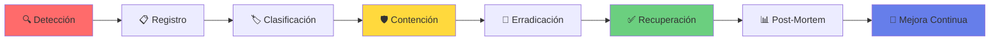
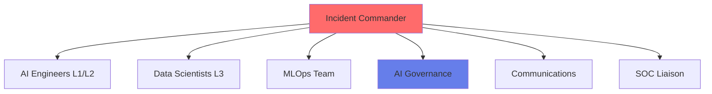
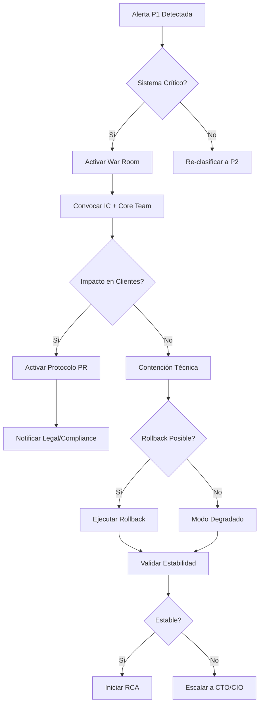
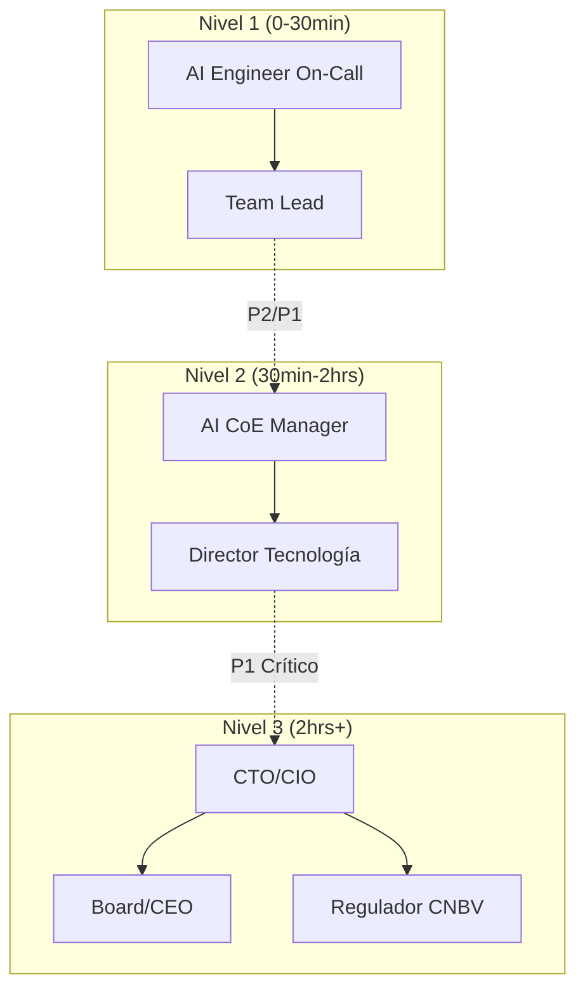
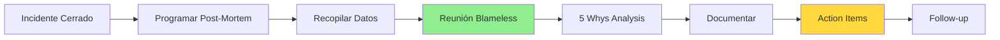

# Anexo E: Guía de Respuesta a Incidentes de IA

---

## 🚨 Introducción

Esta guía establece los procedimientos para la gestión efectiva de incidentes relacionados con sistemas de Inteligencia Artificial del banco, asegurando una respuesta rápida, coordinada y eficiente que minimice el impacto en las operaciones, clientes y cumplimiento regulatorio.

**ID del Documento:** `CoE-IA-INC-005`  
**Versión:** `2.0`  
**Fecha:** `10 de enero de 2025`  
**Clasificación:** Confidencial - Uso Crítico
**Integración:** Nova-Cell 2.0, SOC, ITIL Framework

---

## 1️⃣ Marco de Respuesta a Incidentes de IA

### Ciclo de Vida del Incidente

El proceso de gestión de incidentes de IA sigue un ciclo estructurado de 6 fases, alineado con ITIL v4 y COBIT 2019:



### Fases Detalladas

#### **Fase 1: Detección y Registro (0-15 min)**
- **Fuentes de Detección:**
  - Alertas automáticas de Nova-Cell 2.0
  - Monitoreo proactivo del SOC
  - Reportes de usuarios/clientes
  - Alertas de degradación de métricas
  
- **Acciones Inmediatas:**
  1. Validar la alerta (no es falso positivo)
  2. Crear ticket en Jira Service Management
  3. Asignar ID único: `INC-IA-YYYYMMDD-XXXX`
  4. Notificar al equipo de guardia vía PagerDuty

#### **Fase 2: Análisis y Clasificación (15-30 min)**
- Evaluar impacto y urgencia
- Asignar severidad según matriz definida
- Activar protocolo de respuesta correspondiente
- Convocar al equipo necesario

#### **Fase 3: Contención (30 min - 2 hrs)**
- Ejecutar acciones para estabilizar el servicio
- Prevenir propagación del impacto
- Implementar soluciones temporales
- Documentar todas las acciones tomadas

#### **Fase 4: Erradicación (2-8 hrs)**
- Identificar causa raíz del incidente
- Desarrollar solución permanente
- Validar en ambiente de staging
- Preparar plan de implementación

#### **Fase 5: Recuperación (Variable)**
- Desplegar solución en producción
- Verificar funcionalidad completa
- Monitoreo intensivo post-despliegue
- Confirmar resolución con stakeholders

#### **Fase 6: Post-Mortem (3-5 días post-incidente)**
- Análisis sin culpas (blameless)
- Documentar lecciones aprendidas
- Identificar mejoras al proceso
- Actualizar playbooks y documentación

---

## 2️⃣ Clasificación y Severidad de Incidentes

### Matriz de Severidad

| Severidad | Código | Impacto | Criterios de IA | Ejemplos |
|-----------|--------|---------|-----------------|----------|
| **CRÍTICO** | P1 | **Masivo**<br/>• Pérdida > $1M MXN<br/>• Afectación > 10,000 clientes<br/>• Riesgo regulatorio inminente | • Modelo core inoperante<br/>• Sesgo discriminatorio masivo<br/>• Breach de datos de entrenamiento<br/>• Ataque adversario exitoso | • Sistema de scoring crediticio caído<br/>• Modelo de AML/fraude comprometido<br/>• Exposición de PII en logs |
| **ALTO** | P2 | **Significativo**<br/>• Pérdida $100K-1M MXN<br/>• Afectación 1,000-10,000 clientes<br/>• Degradación severa | • Drift > 20% en métricas<br/>• Falla en pipeline crítico<br/>• Latencia > 5x normal<br/>• Explicabilidad no disponible | • Degradación en chatbot principal<br/>• Retrasos en aprobación de créditos<br/>• Alertas falsas masivas |
| **MEDIO** | P3 | **Moderado**<br/>• Pérdida < $100K MXN<br/>• Afectación < 1,000 clientes<br/>• Degradación notable | • Drift 10-20%<br/>• Fallas intermitentes<br/>• Features no críticas afectadas | • Recomendaciones incorrectas<br/>• Reportes con errores<br/>• Latencia elevada no crítica |
| **BAJO** | P4 | **Menor**<br/>• Sin pérdida financiera<br/>• Afectación mínima<br/>• Inconvenientes menores | • Alertas de monitoreo<br/>• Errores cosméticos<br/>• Logs verbosos | • Typos en respuestas<br/>• Métricas delayed<br/>• UI issues menores |

### SLAs de Respuesta

| Severidad | MTTA | MTTM | MTTR | Escalamiento | Comunicación |
|-----------|------|------|------|--------------|--------------|
| **P1 - CRÍTICO** | 5 min | 30 min | 4 hrs | Inmediato a C-Level | Cada 30 min |
| **P2 - ALTO** | 15 min | 2 hrs | 8 hrs | 1 hr a Directores | Cada hora |
| **P3 - MEDIO** | 1 hr | 8 hrs | 24 hrs | 4 hrs a Gerentes | Cada 4 hrs |
| **P4 - BAJO** | 4 hrs | 24 hrs | 5 días | No requerido | Daily digest |

*MTTA: Mean Time to Acknowledge | MTTM: Mean Time to Mitigate | MTTR: Mean Time to Resolve*

---

## 3️⃣ Roles y Responsabilidades (RACI)

### Estructura del Equipo de Respuesta



### Matriz RACI Detallada

| Actividad | AI Eng L1/L2 | Data Sci L3 | MLOps | Inc Commander | AI Gov | SOC | Business |
|-----------|--------------|-------------|-------|---------------|--------|-----|----------|
| **Detección** | R,A | I | I | I | I | C | I |
| **Clasificación** | R | C | C | A | C | I | I |
| **War Room** | R | R | R | A | C | C | I |
| **Contención** | R | C | R | A | I | C | I |
| **Análisis RCA** | C | R,A | R | I | C | C | I |
| **Comunicación Técnica** | R | R | R | A | I | I | I |
| **Comunicación Negocio** | I | I | I | R,A | R | I | C |
| **Solución** | R | R,A | R,A | A | C | I | I |
| **Validación** | R | R | R | A | R | C | C |
| **Post-Mortem** | C | R | R | A | R | I | C |

*R: Responsible | A: Accountable | C: Consulted | I: Informed*

### Descripción de Roles

- **Incident Commander (IC):** Lidera la respuesta, coordina equipos, toma decisiones críticas
- **AI Engineers L1/L2:** Primera línea, ejecutan playbooks, contención inicial
- **Data Scientists L3:** Análisis profundo de modelos, investigación de causa raíz
- **MLOps Team:** Infraestructura, pipelines, deployments
- **AI Governance:** Cumplimiento, ética, comunicación regulatoria
- **SOC Liaison:** Coordinación de seguridad, análisis de amenazas
- **Business Owner:** Decisiones de negocio, comunicación a clientes

---

## 4️⃣ Procedimientos de Respuesta Detallados

### Procedimiento General por Severidad

#### **Respuesta P1 - CRÍTICO**

```bash
#!/bin/bash
# Script: critical_response.sh
# Ejecutar inmediatamente al detectar P1

# 1. Crear War Room
create_war_room() {
    INCIDENT_ID="INC-IA-$(date +%Y%m%d-%H%M)"
    slack channel create --name "war-room-$INCIDENT_ID"
    
    # 2. Notificar a todos los stakeholders
    pagerduty trigger --severity critical --team ai-oncall
    
    # 3. Activar bridge call
    zoom start meeting --id emergency-bridge
    
    # 4. Iniciar grabación para cumplimiento
    start_recording --compliance CNBV
}

# 5. Ejecutar contención inmediata
containment_actions() {
    case $AFFECTED_MODEL in
        "fraud-detection")
            execute_playbook IA-01-fraud-containment
            ;;
        "credit-scoring")
            execute_playbook IA-02-credit-rollback
            ;;
        *)
            execute_playbook IA-00-generic-shutdown
            ;;
    esac
}

# Main execution
create_war_room
containment_actions
send_initial_comms
```

#### **Flujo de Decisión P1**



### Acciones de Contención por Tipo

| Tipo de Incidente | Acción Inmediata | Script/Comando | Tiempo Objetivo |
|-------------------|------------------|----------------|-----------------|
| **Model Drift** | Rollback a versión anterior | `mlops rollback --model $MODEL --version $LAST_STABLE` | 5 min |
| **Data Poisoning** | Aislar pipeline de datos | `pipeline pause --id data-ingestion && cache clear` | 3 min |
| **Adversarial Attack** | Activar filtros de entrada | `firewall enable --rule adversarial-defense` | 2 min |
| **Bias Detection** | Desviar tráfico a modelo simple | `traffic route --from $BIASED_MODEL --to $SAFE_MODEL` | 5 min |
| **Performance Degradation** | Scale-up de recursos | `kubectl scale --replicas=10 deployment/$MODEL` | 3 min |
| **Security Breach** | Shutdown inmediato | `emergency shutdown --model $MODEL --reason security` | 1 min |

---

## 5️⃣ Playbooks Específicos de IA

### Playbook IA-01: Data/Concept Drift

```yaml
name: IA-01-drift-response
trigger: PSI > 0.15 OR performance_drop > 15%
severity: P2-P1
owner: ml-platform-team

steps:
  - step: 1
    action: "Verificar alerta de drift"
    command: |
      nova-cell check drift --model $MODEL_ID --threshold 0.15
    sla: 5min
    
  - step: 2
    action: "Analizar tipo de drift"
    decision:
      gradual:
        - action: "Schedule retraining"
        - command: "mlops schedule retrain --model $MODEL_ID --priority high"
      sudden:
        - action: "Immediate rollback"
        - command: "mlops rollback --model $MODEL_ID --version last-stable"
    sla: 15min
    
  - step: 3
    action: "Identificar features afectadas"
    command: |
      python analyze_drift.py --model $MODEL_ID --output drift_report.html
    sla: 30min
    
  - step: 4
    action: "Mitigación"
    options:
      - recalibration: "python recalibrate.py --model $MODEL_ID"
      - retrain: "mlops retrain --model $MODEL_ID --data latest"
      - ensemble: "mlops deploy --ensemble $MODEL_ID,$FALLBACK_MODEL"
    sla: 2hrs
    
  - step: 5
    action: "Validación"
    command: |
      mlops test --model $MODEL_ID --dataset validation
      mlops monitor --model $MODEL_ID --duration 1h
    sla: 3hrs

post_actions:
  - update_threshold_alerts
  - schedule_model_review
  - document_drift_patterns
```

### Playbook IA-02: Sesgo Detectado

```yaml
name: IA-02-bias-response
trigger: fairness_metric < 0.8 OR discrimination_alert
severity: P1
owner: ai-governance-team

steps:
  - step: 1
    action: "DETENER procesamiento del grupo afectado"
    command: |
      model pause --segment $AFFECTED_GROUP
      route traffic --to manual-review
    sla: IMMEDIATE
    
  - step: 2
    action: "Notificar Governance y Legal"
    command: |
      notify --urgency critical --teams "ai-governance,legal,risk"
      create_case --type "ethical-bias" --priority critical
    sla: 5min
    
  - step: 3
    action: "Análisis de impacto"
    command: |
      python bias_impact_analysis.py \
        --model $MODEL_ID \
        --group $AFFECTED_GROUP \
        --period "last_7_days"
    sla: 30min
    
  - step: 4
    action: "Implementar mitigación"
    strategies:
      - reweighting: "apply_fairness_constraints.py --method reweight"
      - threshold_optimization: "optimize_thresholds.py --fairness first"
      - model_substitution: "deploy --model $FAIR_FALLBACK_MODEL"
    sla: 4hrs
    
  - step: 5
    action: "Comunicación a afectados"
    command: |
      generate_communication --template bias-incident
      review_by --team legal
      send_after_approval
    sla: 8hrs

compliance_requirements:
  - document_for_CNBV: true
  - external_audit_required: true
  - customer_notification: case_by_case
```

### Playbook IA-03: Ataque Adversario

```yaml
name: IA-03-adversarial-attack
trigger: anomaly_score > 0.9 OR security_alert
severity: P1
owner: security-operations

steps:
  - step: 1
    action: "Activar modo defensivo"
    command: |
      enable_defense --level maximum
      rate_limit --requests 10/min
      enable_captcha --probability 0.5
    sla: 2min
    
  - step: 2
    action: "Identificar patrón de ataque"
    command: |
      analyze_requests --last 1h --anomaly detection
      identify_sources --malicious
    sla: 10min
    
  - step: 3
    action: "Bloquear fuentes maliciosas"
    command: |
      firewall block --ips $MALICIOUS_IPS
      cloudflare enable --protection ddos
    sla: 15min
    
  - step: 4
    action: "Fortalecer modelo"
    command: |
      apply_defense --method adversarial-training
      add_noise --epsilon 0.1
      ensemble_with --robust-models
    sla: 2hrs

coordination:
  - with_SOC: true
  - with_CERT: if_external
  - law_enforcement: if_criminal
```

---

## 6️⃣ Comunicación y Escalamiento

### Matriz de Escalamiento



### Templates de Comunicación

#### **Template 1: Alerta Inicial (Slack/Teams)**
```markdown
🚨 **INCIDENTE IA - [P1/P2/P3/P4]** 🚨

**ID:** INC-IA-20250110-001
**Sistema:** [Nombre del Modelo/Sistema]
**Impacto:** [Descripción breve del impacto]
**Usuarios Afectados:** [Número estimado]

**Estado Actual:** 🔴 Activo / 🟡 Contenido / 🟢 Resuelto

**Acciones Inmediatas:**
- [ ] Rollback iniciado
- [ ] War Room activo: #incident-war-room-001
- [ ] IC asignado: @[nombre]

**Próxima Actualización:** En 30 minutos

📎 Ticket Jira: [link]
📞 Bridge Call: [zoom link]
```

#### **Template 2: Comunicación Ejecutiva**
```markdown
**Para:** Executive Committee
**De:** AI CoE Incident Management
**Asunto:** [P1] Incidente Crítico - Sistema de IA

**Resumen Ejecutivo:**
Se ha detectado un incidente crítico que afecta [sistema]. El impacto estimado es de [cantidad] clientes con una potencial pérdida de $[monto] MXN.

**Timeline:**
- 14:30 - Detección inicial
- 14:35 - Equipo activado
- 14:45 - Contención aplicada
- 15:00 - Servicio estabilizado

**Impacto de Negocio:**
- Financiero: $[monto] MXN
- Clientes: [número] afectados
- Reputacional: [Bajo/Medio/Alto]
- Regulatorio: [Sin impacto/Requiere notificación]

**Acciones en Curso:**
1. [Acción 1 con responsable]
2. [Acción 2 con responsable]

**Próximos Pasos:**
- [Siguiente acción crítica]
- [Timeline esperado]

**Contacto:** [Incident Commander] - [teléfono]
```

#### **Template 3: Notificación Regulatoria (CNBV)**
```markdown
**NOTIFICACIÓN DE INCIDENTE TECNOLÓGICO**
Conforme a las Disposiciones de carácter general aplicables a las instituciones de crédito

**Datos de la Institución:**
- Razón Social: [Banco XYZ, S.A.]
- Fecha y Hora del Incidente: [DD/MM/YYYY HH:MM]

**Clasificación del Incidente:**
- Tipo: Falla en Sistema de Inteligencia Artificial
- Severidad: [Crítica/Alta]
- Sistemas Afectados: [Lista]

**Descripción del Incidente:**
[Descripción detallada del evento]

**Impacto:**
- Operaciones afectadas: [Descripción]
- Número de clientes: [Cantidad]
- Monto involucrado: $[cantidad] MXN

**Medidas Adoptadas:**
1. [Medida 1]
2. [Medida 2]

**Estado Actual:** [Resuelto/En proceso]

**Plan de Remediación:**
[Descripción del plan]

Atentamente,
[CRO/CTO]
[Institución Bancaria]
```

---

## 7️⃣ Herramientas y Recursos

### Stack Tecnológico de Respuesta

| Categoría | Herramienta | Propósito | Acceso |
|-----------|-------------|-----------|---------|
| **Monitoreo** | Nova-Cell 2.0 | Métricas de modelos, drift, performance | https://nova-cell.banco.interno |
| **Observabilidad** | Grafana | Dashboards de infraestructura | https://grafana.banco.interno |
| **Logs** | ELK Stack | Análisis de logs centralizados | https://kibana.banco.interno |
| **Alertas** | PagerDuty | Gestión de on-call y escalamiento | https://banco.pagerduty.com |
| **Tickets** | Jira Service Mgmt | Registro y tracking de incidentes | https://jira.banco.interno |
| **Comunicación** | Slack/Teams | Coordinación en tiempo real | #ai-incidents |
| **War Room** | Zoom | Video conferencia de crisis | Meeting ID: 999-888-777 |
| **Modelos** | MLflow | Registry y versionado de modelos | https://mlflow.banco.interno |
| **Documentación** | Confluence | Knowledge base y post-mortems | https://wiki.banco.interno |

### Scripts de Utilidad

```bash
# Directorio de scripts: /opt/ai-incident-response/

# 1. Quick Assessment
./quick_assess.sh $MODEL_NAME

# 2. Emergency Rollback  
./emergency_rollback.sh $MODEL_NAME $TARGET_VERSION

# 3. Traffic Diversion
./divert_traffic.sh $SOURCE_MODEL $TARGET_MODEL $PERCENTAGE

# 4. Performance Check
./check_performance.sh $MODEL_NAME --last 1h

# 5. Generate Report
./generate_incident_report.sh $INCIDENT_ID
```

---

## 8️⃣ Post-Mortem y Mejora Continua

### Proceso Post-Mortem



### Template Post-Mortem

```markdown
# Post-Mortem: [INC-IA-XXXXXXX]

## Información General
- **Fecha del Incidente:** [DD/MM/YYYY]
- **Duración:** [X horas Y minutos]
- **Severidad:** [P1/P2/P3/P4]
- **Líder Post-Mortem:** [Nombre]

## Resumen Ejecutivo
[1-2 párrafos describiendo qué pasó y el impacto]

## Timeline Detallado
| Hora | Evento | Actor |
|------|--------|-------|
| HH:MM | Inicio del incidente | Sistema |
| HH:MM | Detección | Monitoreo |
| HH:MM | Respuesta inicial | On-call |
| ... | ... | ... |

## Análisis de Causa Raíz (5 Whys)
1. **Why?** [Primer nivel de causa]
2. **Why?** [Segundo nivel]
3. **Why?** [Tercer nivel]
4. **Why?** [Cuarto nivel]
5. **Why?** [Causa raíz]

## ¿Qué funcionó bien?
- [Aspecto positivo 1]
- [Aspecto positivo 2]

## ¿Qué se puede mejorar?
- [Área de mejora 1]
- [Área de mejora 2]

## Action Items
| ID | Acción | Owner | Due Date | Status |
|----|--------|-------|----------|--------|
| 1 | [Acción específica] | [Nombre] | [Fecha] | Open |
| 2 | [Acción específica] | [Nombre] | [Fecha] | Open |

## Métricas del Incidente
- **MTTD:** [XX minutos]
- **MTTA:** [XX minutos]
- **MTTM:** [XX minutos]
- **MTTR:** [XX horas]

## Lecciones Aprendidas
1. [Lección clave 1]
2. [Lección clave 2]

## Anexos
- [Link a logs]
- [Link a dashboards]
- [Link a comunicaciones]
```

### KPIs de Mejora Continua

| Métrica | Target | Actual | Tendencia |
|---------|--------|--------|-----------|
| **MTTD (Mean Time to Detect)** | < 5 min | X min | ↗️ |
| **MTTA (Mean Time to Acknowledge)** | < 10 min | X min | ↘️ |
| **MTTM (Mean Time to Mitigate)** | < 30 min | X min | ↗️ |
| **MTTR (Mean Time to Resolve)** | < 4 hrs | X hrs | ↘️ |
| **Incidentes Recurrentes** | 0% | X% | ↘️ |
| **Post-Mortems Completados** | 100% | X% | ↗️ |
| **Action Items Cerrados** | > 90% | X% | ↗️ |

---

## 9️⃣ Anexos

### Anexo A: Directorio de Contactos de Emergencia

| Rol | Nombre | Móvil | Email | Horario |
|-----|--------|-------|-------|---------|
| **AI CoE Lead** | Juan Pérez | +52 555-1234-001 | jperez@banco.mx | 24/7 |
| **Incident Commander #1** | María García | +52 555-1234-002 | mgarcia@banco.mx | Principal |
| **Incident Commander #2** | Carlos López | +52 555-1234-003 | clopez@banco.mx | Backup |
| **ML Platform Lead** | Ana Martínez | +52 555-1234-004 | amartinez@banco.mx | 24/7 |
| **Data Science Lead** | Roberto Silva | +52 555-1234-005 | rsilva@banco.mx | Business hrs |
| **SOC Duty Manager** | -- | Ext. 9999 | soc@banco.mx | 24/7 |
| **Legal AI** | Patricia Ruiz | +52 555-1234-006 | pruiz@banco.mx | Business hrs |
| **Risk Management** | Diego Hernández | +52 555-1234-007 | dhernandez@banco.mx | 24/7 |
| **PR/Communications** | Laura Torres | +52 555-1234-008 | ltorres@banco.mx | 24/7 |
| **CNBV Liaison** | Fernando Gómez | +52 555-1234-009 | fgomez@banco.mx | Business hrs |

**Números de Emergencia:**
- War Room Hotline: **5555**
- SOC 24/7: **9999**
- Executive Escalation: **1111**

### Anexo B: Checklist de Respuesta Rápida

#### **⚡ Primeros 15 Minutos - CRÍTICO**
- [ ] Acknowledge alerta/ticket
- [ ] Clasificar severidad (P1-P4)
- [ ] Crear canal #war-room si P1/P2
- [ ] Notificar on-call team
- [ ] Asignar Incident Commander
- [ ] Iniciar bridge call si necesario
- [ ] Enviar primera comunicación
- [ ] Activar grabación para compliance
- [ ] Verificar impacto real vs reportado
- [ ] Iniciar acciones de contención

#### **📋 Siguientes 30 Minutos**
- [ ] Ejecutar playbook específico
- [ ] Documentar todas las acciones
- [ ] Actualizar ticket cada 15 min
- [ ] Comunicar a stakeholders
- [ ] Evaluar necesidad de escalamiento
- [ ] Preparar rollback si aplica
- [ ] Coordinar con SOC si es seguridad
- [ ] Notificar a Legal si hay impacto regulatorio

#### **✅ Cierre del Incidente**
- [ ] Confirmar resolución completa
- [ ] Validar con negocio
- [ ] Actualizar documentación
- [ ] Cerrar ticket con RCA preliminar
- [ ] Programar post-mortem
- [ ] Enviar comunicación de cierre
- [ ] Actualizar métricas (MTTR, etc.)
- [ ] Archivar evidencias

### Anexo C: Comandos Rápidos

```bash
# Comandos de emergencia más utilizados

# 1. Ver estado de todos los modelos
nova-cell status --all

# 2. Rollback de emergencia
mlops rollback --model $MODEL --emergency

# 3. Pausar todos los pipelines
pipeline pause --all --reason "incident"

# 4. Activar modo degradado
system mode --degraded --duration 2h

# 5. Forzar re-route de tráfico
traffic route --force --from $A --to $B

# 6. Dump de logs para análisis
collect-logs --last 1h --model $MODEL > incident.log

# 7. Health check rápido
health-check --comprehensive --output json

# 8. Escalar recursos de emergencia
scale-up --emergency --model $MODEL --replicas 10

# 9. Activar defensa contra ataques
defense-mode --activate --level maximum

# 10. Generar reporte ejecutivo
generate-report --incident $ID --format executive
```

---

## 🔗 Referencias

- ITIL v4 Incident Management
- COBIT 2019 Framework
- CNBV Circular Única de Bancos - Capítulo Tecnología
- ISO/IEC 27035 - Information Security Incident Management
- NIST Computer Security Incident Handling Guide
- SRE Book - Google (Chapter on Incident Response)

---

## 📞 Soporte y Contacto

**AI Incident Response Team**
- 📧 ai-incidents@banco.mx
- 💬 Slack: #ai-incident-response
- 📱 Hotline 24/7: 5555
- 🌐 Wiki: https://wiki.banco.interno/ai-incidents
- 📊 Dashboard: https://nova-cell.banco.interno/incidents

---

**Versión:** 2.0  
**Última Actualización:** 10 de enero de 2025  
**Próxima Revisión:** Febrero 2025  
**Clasificación:** Confidencial - Manejo Crítico

---

*Esta guía es de cumplimiento obligatorio para todos los equipos que operan sistemas de IA. El incumplimiento puede resultar en sanciones regulatorias y disciplinarias.*