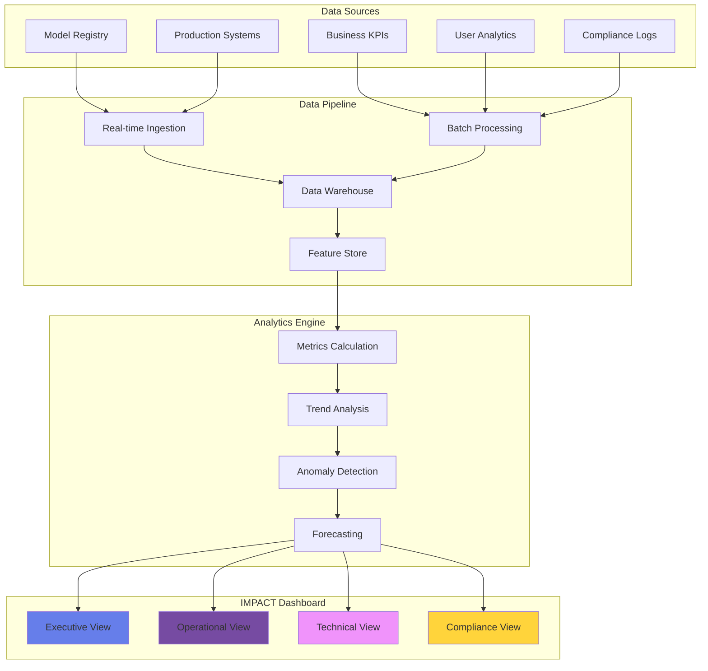
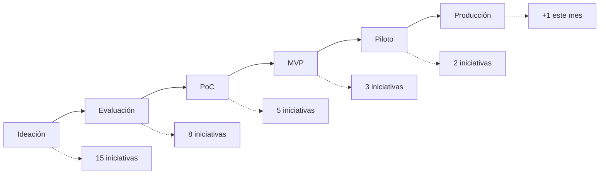

# 📊 IMPACT Dashboard - Métricas de Valor

## 🎯 Visión General

El **IMPACT Dashboard** es el sistema central de monitoreo y medición del valor generado por las iniciativas de IA en el banco. Proporciona una vista unificada y en tiempo real del retorno de inversión, adopción, performance y cumplimiento de todos los modelos de IA en producción.

### ¿Por qué IMPACT?

**I**ntelligence - Inteligencia de negocio basada en datos  
**M**etrics - Métricas cuantificables y accionables  
**P**erformance - Performance técnica y de negocio  
**A**doption - Adopción y uso real por usuarios  
**C**ompliance - Cumplimiento regulatorio  
**T**racking - Tracking continuo de valor  

## 🏗️ Arquitectura del Dashboard



## 📈 Métricas Principales

### 1. ROI Total (Return on Investment)

**Definición**: Retorno acumulado de todas las iniciativas de IA vs inversión total

**Fórmula**:
```python
ROI = ((Valor_Generado - Inversion_Total) / Inversion_Total) * 100
```

**Componentes**:
- **Valor Generado**: 
  - Ahorros en costos operativos
  - Incremento en ingresos
  - Reducción de pérdidas (fraude, default)
  - Mejora en eficiencia

- **Inversión Total**:
  - Desarrollo (CAPEX)
  - Infraestructura
  - Licencias
  - Personal
  - Mantenimiento (OPEX)

**Interpretación**:
- `>300%`: Excepcional
- `200-300%`: Excelente
- `100-200%`: Bueno
- `50-100%`: Aceptable
- `<50%`: Requiere optimización

**Ejemplo de Cálculo**:
```python
# Ejemplo real de Credit Scoring 2.0
valor_generado = {
    "reduccion_defaults": 45_000_000,  # MXN/año
    "eficiencia_proceso": 12_000_000,  # MXN/año
    "mejora_conversion": 8_000_000     # MXN/año
}

inversion = {
    "desarrollo": 5_000_000,
    "infraestructura": 2_000_000,
    "operacion_anual": 3_000_000
}

roi = ((sum(valor_generado.values()) - sum(inversion.values())) / 
       sum(inversion.values())) * 100
# ROI = 550%
```

---

### 2. Modelos en Producción

**Definición**: Cantidad de modelos de IA activamente desplegados y operando

**Categorías**:
- **Por Tier**:
  - Tier 1: Críticos (afectan decisiones de crédito)
  - Tier 2: Importantes (customer-facing)
  - Tier 3: Estándar (procesos internos)
  - Tier 4: Experimentales

- **Por Estado**:
  - 🟢 Activo: Operando normalmente
  - 🟡 Degradado: Performance subóptima
  - 🔴 Crítico: Requiere atención inmediata
  - ⚫ Inactivo: Pausado temporalmente

**Métricas Asociadas**:
- **Disponibilidad promedio**: Target >99.9%
- **Tiempo desde último deployment**: Frecuencia de actualización
- **Cobertura departamental**: % de áreas usando IA

---

### 3. Ahorro Mensual

**Definición**: Reducción de costos operativos atribuible a automatización con IA

**Componentes**:
```python
ahorro_mensual = {
    "reduccion_fte": {
        "horas_automatizadas": 15000,
        "costo_por_hora": 250,  # MXN
        "ahorro": 3_750_000
    },
    "reduccion_errores": {
        "errores_evitados": 500,
        "costo_por_error": 5000,
        "ahorro": 2_500_000
    },
    "eficiencia_proceso": {
        "transacciones_aceleradas": 50000,
        "ahorro_por_transaccion": 20,
        "ahorro": 1_000_000
    }
}
# Total: $7.25M MXN/mes
```

**Tracking**:
- Comparación vs baseline (proceso manual)
- Tendencia últimos 12 meses
- Proyección próximo trimestre

---

### 4. Usuarios Activos

**Definición**: Usuarios únicos interactuando con sistemas de IA

**Segmentación**:
- **Internos**: Empleados del banco
- **Externos**: Clientes finales
- **B2B**: Clientes corporativos

**Métricas de Engagement**:
```python
engagement_metrics = {
    "DAU": "Daily Active Users",
    "MAU": "Monthly Active Users",
    "stickiness": "DAU/MAU ratio",
    "frecuencia_uso": "sesiones/usuario/mes",
    "tiempo_sesion": "minutos promedio",
    "tasa_adopcion": "usuarios_activos/usuarios_totales"
}
```

**Health Score**:
- Adopción >75%: 🟢 Saludable
- Adopción 50-75%: 🟡 Moderado
- Adopción <50%: 🔴 Requiere acción

---

### 5. Score de Cumplimiento

**Definición**: Nivel de adherencia a requerimientos regulatorios y éticos

**Componentes del Score (0-100)**:

| Componente | Peso | Criterios |
|------------|------|-----------|
| **Regulatorio** | 40% | CNBV, Banxico, LFPDPPP compliance |
| **Ética AI** | 25% | Fairness, transparencia, no-discriminación |
| **Documentación** | 15% | Model cards, audit trails completos |
| **Validación** | 10% | Challenger models, backtesting |
| **Gobernanza** | 10% | Aprobaciones, revisiones periódicas |

**Cálculo**:
```python
def calcular_compliance_score(modelo):
    score = 0
    
    # Regulatorio (40 puntos)
    if modelo.cnbv_compliant: score += 20
    if modelo.privacy_compliant: score += 10
    if modelo.aml_compliant: score += 10
    
    # Ética (25 puntos)
    if modelo.bias_tested: score += 10
    if modelo.explainable: score += 10
    if modelo.fair_metrics_ok: score += 5
    
    # Documentación (15 puntos)
    if modelo.model_card_complete: score += 8
    if modelo.audit_trail_complete: score += 7
    
    # Validación (10 puntos)
    if modelo.has_challenger: score += 5
    if modelo.backtesting_passed: score += 5
    
    # Gobernanza (10 puntos)
    if modelo.approved_by_committee: score += 5
    if modelo.review_up_to_date: score += 5
    
    return score
```

---

### 6. Modelos por Área

**Definición**: Distribución de modelos de IA por departamento

**Visualización**: Treemap mostrando:
- Tamaño: Cantidad de modelos
- Color: Performance promedio
- Tooltip: Detalles de cada área

**Áreas Típicas**:
```python
distribucion_areas = {
    "Riesgo": {
        "modelos": 12,
        "tipos": ["Scoring", "PD", "LGD", "EAD"],
        "roi_promedio": 420
    },
    "Marketing": {
        "modelos": 8,
        "tipos": ["Segmentación", "Propensity", "Churn"],
        "roi_promedio": 280
    },
    "Operaciones": {
        "modelos": 15,
        "tipos": ["OCR", "RPA", "Optimización"],
        "roi_promedio": 350
    },
    "Atención Cliente": {
        "modelos": 5,
        "tipos": ["Chatbot", "Sentiment", "Routing"],
        "roi_promedio": 310
    }
}
```

---

### 7. Accuracy Promedio

**Definición**: Performance técnica promedio ponderada de todos los modelos

**Cálculo**:
```python
def calcular_accuracy_ponderada(modelos):
    total_weight = 0
    weighted_sum = 0
    
    for modelo in modelos:
        # Peso basado en tier e impacto
        weight = modelo.tier_weight * modelo.transaction_volume
        
        # Métrica apropiada por tipo
        if modelo.tipo == "clasificacion":
            metric = modelo.f1_score
        elif modelo.tipo == "regresion":
            metric = 1 - modelo.mape  # Convert error to accuracy
        elif modelo.tipo == "ranking":
            metric = modelo.ndcg
        else:  # GenAI/LLM
            metric = modelo.task_success_rate
            
        weighted_sum += metric * weight
        total_weight += weight
    
    return (weighted_sum / total_weight) * 100
```

**Benchmarks por Tipo**:
- Clasificación: F1 >0.85
- Regresión: MAPE <10%
- Ranking: NDCG >0.8
- GenAI: Success Rate >90%

---

### 8. Proyectos en Pipeline

**Definición**: Iniciativas de IA en diferentes fases de desarrollo

**Fases del Pipeline**:


**Métricas de Pipeline**:
- **Velocity**: Proyectos completados/mes
- **Cycle Time**: Días promedio ideación→producción
- **Success Rate**: % que llegan a producción
- **Pipeline Value**: ROI potencial total

---

### 9. Transacciones Procesadas

**Definición**: Volumen de decisiones/predicciones realizadas por modelos de IA

**Métricas de Volumen**:
```python
transacciones = {
    "diarias": {
        "predicciones": 2_500_000,
        "decisiones_automatizadas": 150_000,
        "alertas_generadas": 5_000,
        "documentos_procesados": 10_000
    },
    "tendencia": {
        "crecimiento_mensual": "15%",
        "pico_diario": 3_200_000,
        "promedio_semanal": 17_500_000
    },
    "por_modelo": {
        "fraud_detection": 1_000_000,
        "credit_scoring": 50_000,
        "chatbot": 200_000,
        "document_ocr": 25_000
    }
}
```

**Importancia**:
- Indicador de adopción real
- Base para cálculo de costo/transacción
- Input para capacity planning

---

### 10. Reducción de Fraudes

**Definición**: Valor monetario de fraudes prevenidos por modelos de IA

**Cálculo**:
```python
def calcular_prevencion_fraude(periodo):
    fraudes_detectados = {
        "tarjetas": {
            "casos": 1250,
            "monto_promedio": 15000,
            "prevenido": 18_750_000
        },
        "transferencias": {
            "casos": 85,
            "monto_promedio": 250000,
            "prevenido": 21_250_000
        },
        "identidad": {
            "casos": 320,
            "monto_promedio": 50000,
            "prevenido": 16_000_000
        }
    }
    
    total_prevenido = sum(
        tipo["prevenido"] 
        for tipo in fraudes_detectados.values()
    )
    
    # Ajustar por false positives
    false_positive_rate = 0.05
    valor_real = total_prevenido * (1 - false_positive_rate)
    
    return {
        "monto_prevenido": valor_real,
        "casos_detectados": sum(t["casos"] for t in fraudes_detectados.values()),
        "roi_antifraude": (valor_real / costo_sistema_antifraude) * 100
    }
```

---

## 🎨 Visualización Interactiva

### Dashboard Demo

<iframe src="impact-demo.html" width="100%" height="800" frameborder="0" style="border-radius: 10px; box-shadow: 0 4px 6px rgba(0,0,0,0.1);"></iframe>

[Ver Dashboard en Pantalla Completa](impact-demo.html){target="_blank" .md-button .md-button--primary}

### Características del Dashboard

#### 🔄 Actualización en Tiempo Real
- Métricas críticas: Cada 5 minutos
- KPIs operacionales: Cada hora
- Métricas de negocio: Diario
- Reportes ejecutivos: Semanal

#### 📱 Diseño Responsivo
- Desktop: Vista completa con todos los widgets
- Tablet: Vista optimizada con scroll
- Mobile: Vista simplificada con métricas clave

#### 🔐 Control de Acceso
- **Ejecutivo**: Vista estratégica y ROI
- **Operacional**: Métricas técnicas y performance
- **Compliance**: Métricas regulatorias y auditoría
- **Público**: Dashboard simplificado sin datos sensibles

## 📊 Tipos de Visualizaciones

### Gráficos Disponibles

```python
visualizaciones = {
    "tendencias": {
        "tipo": "Line Chart",
        "uso": "ROI, adopción, volumen en el tiempo",
        "libreria": "Chart.js"
    },
    "distribucion": {
        "tipo": "Donut/Pie Chart",
        "uso": "Modelos por área, estado, tier",
        "libreria": "Chart.js"
    },
    "comparacion": {
        "tipo": "Bar Chart",
        "uso": "Performance por modelo, área",
        "libreria": "Chart.js"
    },
    "correlacion": {
        "tipo": "Scatter Plot",
        "uso": "ROI vs Inversión, Accuracy vs Volumen",
        "libreria": "Plotly"
    },
    "heatmap": {
        "tipo": "Heatmap",
        "uso": "Matriz de riesgos, disponibilidad",
        "libreria": "D3.js"
    },
    "gauges": {
        "tipo": "Gauge Chart",
        "uso": "Compliance score, SLA adherence",
        "libreria": "Google Charts"
    }
}
```

## 🔔 Alertas y Notificaciones

### Sistema de Alertas

```python
alertas_configuradas = {
    "criticas": {
        "modelo_caido": {
            "condicion": "availability < 99%",
            "accion": "SMS + Email + Slack",
            "destinatarios": ["SRE", "Product Owner", "CTO"]
        },
        "compliance_breach": {
            "condicion": "compliance_score < 70",
            "accion": "Email urgente",
            "destinatarios": ["Risk", "Compliance", "Legal"]
        }
    },
    "warnings": {
        "performance_degradation": {
            "condicion": "accuracy < baseline - 5%",
            "accion": "Email + Dashboard flag",
            "destinatarios": ["ML Team", "Product Owner"]
        },
        "roi_declining": {
            "condicion": "roi_trend negative 3 months",
            "accion": "Report mensual",
            "destinatarios": ["CFO", "Head of AI"]
        }
    },
    "informativas": {
        "nuevo_modelo": {
            "condicion": "model deployed to production",
            "accion": "Newsletter",
            "destinatarios": ["All stakeholders"]
        }
    }
}
```

## 📈 Reportes Automatizados

### Tipos de Reportes

| Reporte | Frecuencia | Audiencia | Contenido |
|---------|------------|-----------|-----------|
| **Executive Summary** | Mensual | C-Level | ROI, valor generado, proyecciones |
| **Operational Report** | Semanal | Managers | Performance, issues, mejoras |
| **Technical Report** | Diario | ML Teams | Métricas técnicas, drift, alertas |
| **Compliance Report** | Mensual | Risk/Legal | Auditoría, cumplimiento, riesgos |
| **Innovation Report** | Trimestral | Board | Nuevos proyectos, innovación |

### Formato de Reportes

```python
def generar_reporte_ejecutivo():
    reporte = {
        "periodo": "Noviembre 2024",
        "highlights": [
            "ROI total alcanzó 420%, superando meta en 20%",
            "3 nuevos modelos en producción",
            "Fraudes prevenidos: $45M MXN",
            "100% compliance score mantenido"
        ],
        "metricas_clave": {
            "roi_total": 420,
            "modelos_activos": 35,
            "usuarios_activos": 15000,
            "ahorro_mensual": 45_000_000
        },
        "proximos_pasos": [
            "Launch de Credit Scoring 3.0",
            "Expansión chatbot a app móvil",
            "Piloto de computer vision en sucursales"
        ],
        "riesgos": [
            "Actualización regulatoria CNBV pendiente",
            "Capacidad GPU al 80%"
        ]
    }
    
    return generar_pdf(reporte)
```

## 🎯 KPIs y SLAs

### Service Level Agreements

| Métrica | SLA Target | Actual | Status |
|---------|------------|--------|--------|
| **Dashboard Availability** | 99.9% | 99.95% | ✅ |
| **Data Freshness** | <15 min | 12 min | ✅ |
| **Query Response Time** | <2 sec | 1.3 sec | ✅ |
| **Report Generation** | <5 min | 3.2 min | ✅ |
| **Alert Latency** | <1 min | 45 sec | ✅ |

## 🔧 Configuración y Personalización

### Personalización de Vistas

```javascript
// Configuración de usuario
const userPreferences = {
    theme: "light", // light/dark
    language: "es", // es/en
    defaultView: "executive", // executive/operational/technical
    refreshRate: 300, // segundos
    notifications: {
        email: true,
        push: true,
        sms: false
    },
    widgets: {
        layout: "grid", // grid/list
        visible: [
            "roi_total",
            "modelos_produccion",
            "ahorro_mensual",
            "compliance_score"
        ],
        order: "custom" // custom/default
    }
};
```

## 🚀 Roadmap del Dashboard

### Q1 2025
- [ ] Integración con Tableau/PowerBI
- [ ] API pública para métricas
- [ ] Mobile app nativa

### Q2 2025
- [ ] ML para forecasting automático
- [ ] Análisis what-if scenarios
- [ ] Benchmarking industria

### Q3 2025
- [ ] Real-time streaming analytics
- [ ] Voice commands (Alexa/Google)
- [ ] AR/VR visualizations

## 📚 Recursos Adicionales

### APIs Disponibles

```python
# Endpoints para acceso programático
api_endpoints = {
    "metrics": {
        "GET /api/v1/metrics/roi": "ROI actual y histórico",
        "GET /api/v1/metrics/models": "Lista de modelos y status",
        "GET /api/v1/metrics/compliance": "Score de cumplimiento"
    },
    "reports": {
        "POST /api/v1/reports/generate": "Generar reporte custom",
        "GET /api/v1/reports/scheduled": "Reportes programados"
    },
    "alerts": {
        "POST /api/v1/alerts/configure": "Configurar nueva alerta",
        "GET /api/v1/alerts/history": "Historial de alertas"
    }
}
```

### Documentación Técnica
- [API Reference](../api/impact-api.md)
- [Data Dictionary](../data/metrics-dictionary.md)
- [Integration Guide](../guides/impact-integration.md)
- [Troubleshooting](../support/impact-troubleshooting.md)

---

**Soporte Dashboard IMPACT**:
- 📧 ai@novasolutionsystems.com
- 💬 Slack: #impact-dashboard
- 📞 Ext: 5556
- 🌐 Wiki: confluence.novasolutionsystems.com/impact

*Dashboard IMPACT v2.0 - Transformando datos en decisiones inteligentes*