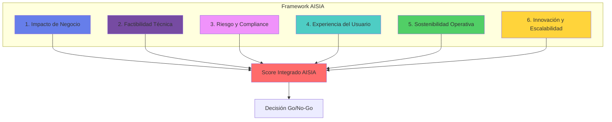
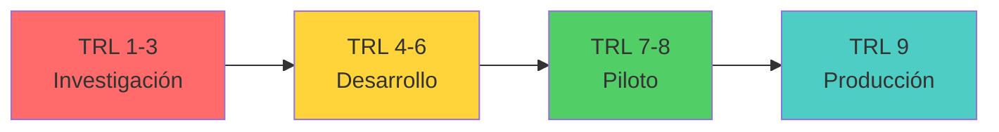
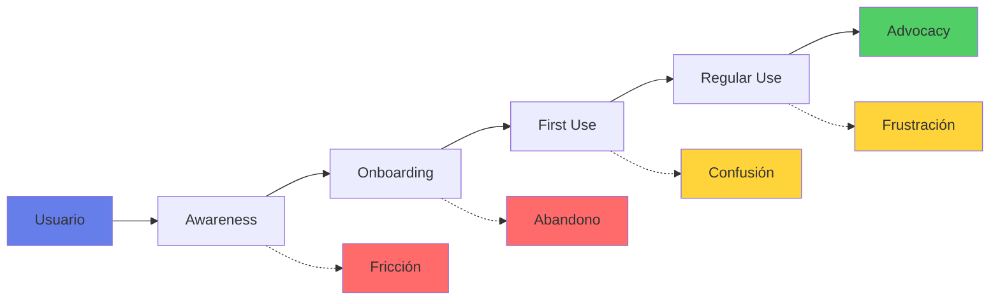
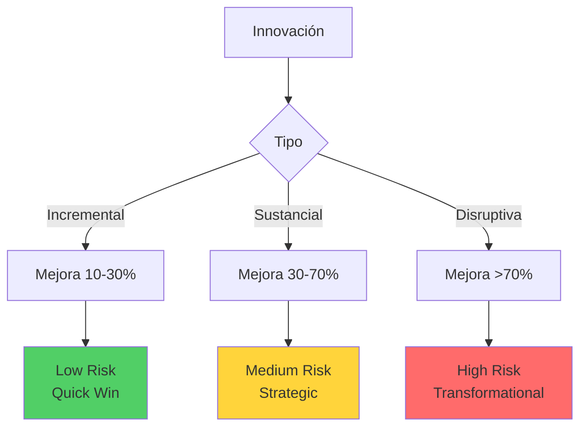
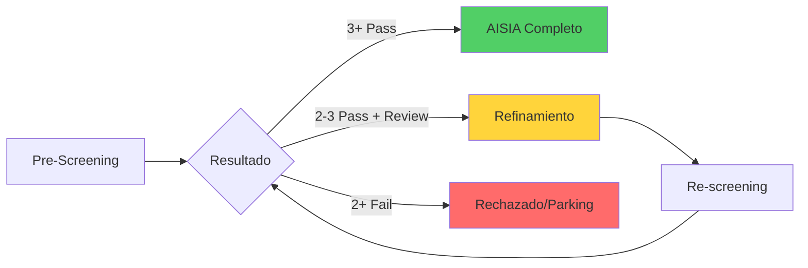
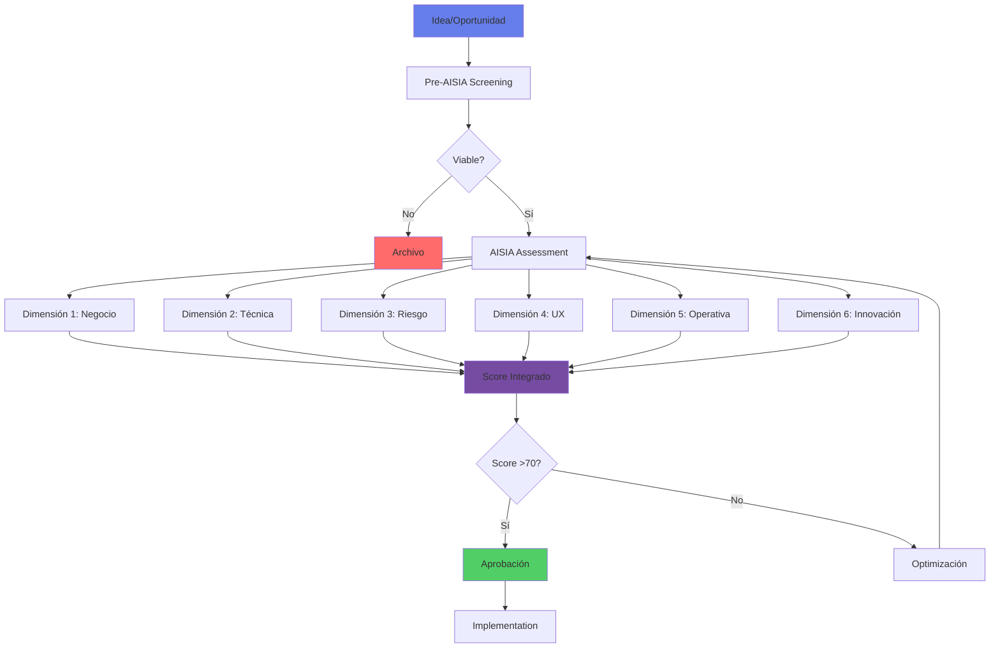

# 🏗️ Framework AISIA - AI Systematic Impact Assessment

## 🎯 Visión General

AISIA (AI Systematic Impact Assessment) es nuestro framework propietario para evaluar sistemáticamente el impacto, riesgos y oportunidades de las iniciativas de IA en la organización, alineado con estándares internacionales y adaptado al contexto bancario mexicano.

### Características Principales
- 📊 **6 Dimensiones** de evaluación integral
- 🎯 **24 KPIs** medibles y accionables
- 🔄 **Proceso iterativo** de mejora continua
- 📈 **Scoring cuantitativo** para priorización
- 🛡️ **Risk-aware** por diseño

## 🧭 Las 6 Dimensiones de AISIA



## 📊 Dimensión 1: Impacto de Negocio

### Objetivo
Evaluar el valor potencial que la iniciativa de IA puede generar para el negocio.

### KPIs Clave

| KPI | Descripción | Peso | Métrica | Target Tier 1 |
|-----|-------------|------|---------|--------------|
| **ROI Proyectado** | Retorno sobre inversión a 2 años | 30% | % ROI | >200% |
| **Reducción de Costos** | Ahorro operativo anual | 25% | MXN | >10M |
| **Incremento de Ingresos** | Nuevos ingresos generados | 25% | MXN | >15M |
| **Time to Value** | Tiempo hasta primer valor | 20% | Meses | <6 |

### Matriz de Evaluación

```python
# Cálculo del score de Impacto de Negocio
def calculate_business_impact_score(initiative):
    scores = {
        'roi': min(initiative.roi / 2.0, 1.0) * 0.30,
        'cost_reduction': min(initiative.cost_savings / 10_000_000, 1.0) * 0.25,
        'revenue_increase': min(initiative.new_revenue / 15_000_000, 1.0) * 0.25,
        'time_to_value': max(0, 1 - (initiative.months_to_value / 12)) * 0.20
    }
    
    return sum(scores.values()) * 100  # Score 0-100
```

### Criterios de Evaluación

| Score | Clasificación | Acción Recomendada |
|-------|--------------|-------------------|
| 80-100 | **Excepcional** | Fast-track aprobación |
| 60-79 | **Alto** | Prioridad alta |
| 40-59 | **Medio** | Evaluar optimizaciones |
| 20-39 | **Bajo** | Reconsiderar enfoque |
| 0-19 | **Insuficiente** | No proceder |

## 🔧 Dimensión 2: Factibilidad Técnica

### Objetivo
Determinar la viabilidad técnica y los recursos necesarios para implementar la solución.

### KPIs Clave

| KPI | Descripción | Peso | Métrica | Target |
|-----|-------------|------|---------|--------|
| **Madurez Tecnológica** | TRL (Technology Readiness Level) | 30% | TRL 1-9 | >7 |
| **Disponibilidad de Datos** | Calidad y acceso a datos necesarios | 25% | Score 0-100 | >80 |
| **Complejidad de Integración** | Esfuerzo para integrar con sistemas | 25% | Story Points | <100 |
| **Skills Gap** | Brecha de capacidades del equipo | 20% | % cubierto | >70% |

### Rúbrica de Disponibilidad de Datos

| Score | Descripción | Evidencia Requerida |
|-------|-------------|-------------------|
| **100** | Datos limpios, catalogados, documentados y disponibles vía API/data product | Link a catálogo, API docs, data quality report |
| **75** | Datos en data warehouse/lakehouse, requiere limpieza moderada | Query de acceso, reporte de calidad, diccionario |
| **50** | Datos existen en sistemas fuente pero requieren nuevo ETL/ELT | Aprobación de acceso, plan de pipeline |
| **25** | Datos deben adquirirse de terceros o recolectarse manualmente | Propuesta de vendor, plan de recolección |
| **0** | Datos no existen o no pueden usarse legal/éticamente | Declaración Legal/Compliance |

### Evaluación de Madurez Tecnológica (TRL)



### Checklist de Factibilidad

- [ ] **Datos**
  - [ ] Volumen suficiente (>10,000 registros)
  - [ ] Calidad verificada (>95% completitud)
  - [ ] Acceso autorizado y gobernado
  - [ ] Actualización periódica asegurada

- [ ] **Infraestructura**
  - [ ] Capacidad de cómputo disponible
  - [ ] Almacenamiento escalable
  - [ ] Red y conectividad adecuada
  - [ ] Ambiente de desarrollo/pruebas

- [ ] **Talento**
  - [ ] Data Scientists asignados
  - [ ] ML Engineers disponibles
  - [ ] Domain experts involucrados
  - [ ] Capacitación planificada

## ⚠️ Dimensión 3: Riesgo y Compliance

### Objetivo
Identificar, evaluar y mitigar riesgos regulatorios, éticos y operacionales.

### KPIs Clave

| KPI | Descripción | Peso | Métrica | Umbral Crítico |
|-----|-------------|------|---------|---------------|
| **Riesgo Regulatorio** | Cumplimiento CNBV/Banxico | 35% | Score 0-100 | <20 |
| **Riesgo Ético** | Sesgo, fairness, transparencia | 30% | Score 0-100 | <30 |
| **Riesgo Operacional** | Impacto en procesos críticos | 20% | VaR | <5M MXN |
| **Riesgo Reputacional** | Potencial impacto en marca | 15% | Score 0-100 | <25 |

### Matriz de Riesgos

```python
# Evaluación de riesgo integrado
risk_matrix = {
    'probability': {
        'very_low': 0.1,
        'low': 0.3,
        'medium': 0.5,
        'high': 0.7,
        'very_high': 0.9
    },
    'impact': {
        'negligible': 1,
        'minor': 2,
        'moderate': 3,
        'major': 4,
        'catastrophic': 5
    }
}

def calculate_risk_score(probability, impact):
    risk_value = risk_matrix['probability'][probability] * risk_matrix['impact'][impact]
    
    if risk_value > 3.5:
        return "CRITICAL - Requiere mitigación inmediata"
    elif risk_value > 2.0:
        return "HIGH - Plan de mitigación obligatorio"
    elif risk_value > 1.0:
        return "MEDIUM - Monitoreo continuo"
    else:
        return "LOW - Aceptable con controles estándar"
```

### Plan de Mitigación Requerido

| Nivel de Riesgo | Acciones Obligatorias | Aprobación Requerida |
|-----------------|----------------------|---------------------|
| **Crítico** | Plan detallado + Contingencia + Seguro | C-Suite + Board |
| **Alto** | Plan de mitigación + Monitoreo diario | Director + CRO |
| **Medio** | Controles estándar + KRIs definidos | Gerente Senior |
| **Bajo** | Controles básicos + Revisión trimestral | Product Owner |

## 👥 Dimensión 4: Experiencia del Usuario

### Objetivo
Asegurar que la solución mejore significativamente la experiencia de usuarios internos y externos.

### KPIs Clave

| KPI | Descripción | Peso | Métrica | Target |
|-----|-------------|------|---------|--------|
| **NPS Improvement** | Mejora en Net Promoter Score | 30% | Δ NPS | >+10 |
| **User Adoption** | Tasa de adopción proyectada | 25% | % usuarios | >70% |
| **Time Savings** | Reducción tiempo de proceso | 25% | % reducción | >40% |
| **Error Reduction** | Disminución de errores | 20% | % reducción | >50% |

### Journey Mapping de IA



### Métricas de UX para IA

```python
# Framework de medición UX
ux_metrics = {
    'transparency': {
        'explanation_quality': 0-100,  # ¿Usuario entiende las decisiones?
        'control_level': 0-100,        # ¿Usuario puede intervenir?
        'trust_score': 0-100           # ¿Usuario confía en el sistema?
    },
    'efficiency': {
        'task_completion_time': seconds,
        'clicks_to_complete': integer,
        'error_rate': percentage
    },
    'satisfaction': {
        'sus_score': 0-100,           # System Usability Scale
        'ces_score': 1-7,             # Customer Effort Score
        'csat': 1-5                   # Customer Satisfaction
    }
}
```

## 🔄 Dimensión 5: Sostenibilidad Operativa

### Objetivo
Garantizar que la solución sea mantenible, escalable y sostenible a largo plazo.

### KPIs Clave

| KPI | Descripción | Peso | Métrica | Target |
|-----|-------------|------|---------|--------|
| **TCO (Total Cost of Ownership)** | Costo total a 3 años | 30% | MXN | <ROI/3 |
| **Scalability Index** | Capacidad de escalar 10x | 25% | Score 0-100 | >75 |
| **Maintenance Effort** | Horas/mes de mantenimiento | 25% | Hours | <40 |
| **Technical Debt** | Deuda técnica acumulada | 20% | Story Points | <200 |

### Modelo de Costos

```python
# Cálculo de TCO para IA
def calculate_tco_ai(initiative):
    # Costos iniciales
    development_cost = initiative.dev_hours * hourly_rate
    infrastructure_setup = initiative.infra_initial
    licensing = initiative.software_licenses
    
    # Costos recurrentes (anual)
    cloud_compute = initiative.monthly_compute * 12
    storage = initiative.monthly_storage * 12
    monitoring = initiative.monitoring_cost * 12
    maintenance = initiative.maintenance_hours * hourly_rate
    
    # Costos de actualización
    retraining = initiative.retraining_frequency * retraining_cost
    upgrades = initiative.annual_upgrades
    
    tco_3_years = development_cost + infrastructure_setup + (
        (cloud_compute + storage + monitoring + maintenance + 
         licensing + retraining + upgrades) * 3
    )
    
    return tco_3_years
```

### Checklist de Sostenibilidad

- [ ] **Arquitectura**
  - [ ] Microservicios o modular
  - [ ] API-first design
  - [ ] Stateless cuando posible
  - [ ] Circuit breakers implementados

- [ ] **MLOps**
  - [ ] CI/CD pipeline configurado
  - [ ] Model versioning activo
  - [ ] A/B testing capability
  - [ ] Rollback automático

- [ ] **Monitoreo**
  - [ ] Drift detection
  - [ ] Performance tracking
  - [ ] Business KPIs linked
  - [ ] Alerting configurado

## 🚀 Dimensión 6: Innovación y Escalabilidad

### Objetivo
Evaluar el potencial innovador y la capacidad de escalar la solución a otros casos de uso.

### KPIs Clave

| KPI | Descripción | Peso | Métrica | Target |
|-----|-------------|------|---------|--------|
| **Innovation Index** | Grado de innovación vs competencia | 30% | Score 0-100 | >70 |
| **Reusability Score** | Componentes reutilizables | 25% | % código | >60% |
| **Platform Potential** | Potencial como plataforma | 25% | Casos de uso | >5 |
| **Market Differentiator** | Ventaja competitiva generada | 20% | Score 0-100 | >75 |

### Matriz de Innovación



### Evaluación de Escalabilidad

```python
# Score de escalabilidad
scalability_factors = {
    'technical': {
        'cloud_native': 20,           # Arquitectura cloud-native
        'api_based': 15,              # APIs bien definidas
        'containerized': 15,          # Containerización
        'auto_scaling': 10,           # Auto-scaling configurado
    },
    'business': {
        'cross_functional': 15,       # Aplicable a múltiples áreas
        'market_size': 10,           # Tamaño del mercado objetivo
        'regulatory_friendly': 10,    # Sin barreras regulatorias
        'partner_ecosystem': 5,       # Ecosistema de partners
    }
}

def calculate_scalability_score(initiative):
    score = 0
    for category in scalability_factors:
        for factor, weight in scalability_factors[category].items():
            if getattr(initiative, factor, False):
                score += weight
    return score  # Max 100
```

## 📈 Scoring Integrado AISIA

### Arquetipos de Iniciativas

Para alinear mejor con objetivos estratégicos, cada iniciativa debe seleccionar su arquetipo durante el pre-screening:

#### Perfiles de Ponderación por Arquetipo

| Dimensión | Efficiency Engine | Innovation Bet | Compliance Shield | Customer Delight |
|-----------|------------------|-----------------|-------------------|------------------|
| **Impacto de Negocio** | 30% | 15% | 10% | 20% |
| **Factibilidad Técnica** | 20% | 25% | 15% | 20% |
| **Riesgo y Compliance** | 15% | 10% | 40% | 20% |
| **Experiencia del Usuario** | 15% | 15% | 10% | 30% |
| **Sostenibilidad Operativa** | 15% | 15% | 20% | 5% |
| **Innovación y Escalabilidad** | 5% | 20% | 5% | 5% |

#### Descripción de Arquetipos

1. **Efficiency Engine** (Default)
   - Objetivo: Optimización de procesos y reducción de costos
   - Ejemplos: Automatización de tareas, optimización de recursos
   
2. **Innovation Bet**
   - Objetivo: Explorar nuevas capacidades y diferenciación
   - Ejemplos: Nuevos productos IA, capacidades experimentales
   
3. **Compliance Shield**
   - Objetivo: Cumplir con regulaciones obligatorias
   - Ejemplos: Modelos AML/KYC, reportes regulatorios
   
4. **Customer Delight**
   - Objetivo: Mejorar radicalmente la experiencia del cliente
   - Ejemplos: Asistentes virtuales, personalización

### Metodología de Cálculo

```python
# Cálculo del AISIA Score integrado
def calculate_aisia_score(initiative):
    dimensions = {
        'business_impact': {
            'weight': 0.25,
            'score': calculate_business_impact_score(initiative)
        },
        'technical_feasibility': {
            'weight': 0.20,
            'score': calculate_technical_feasibility_score(initiative)
        },
        'risk_compliance': {
            'weight': 0.20,
            'score': 100 - calculate_risk_score(initiative)  # Invertido
        },
        'user_experience': {
            'weight': 0.15,
            'score': calculate_ux_score(initiative)
        },
        'operational_sustainability': {
            'weight': 0.10,
            'score': calculate_sustainability_score(initiative)
        },
        'innovation_scalability': {
            'weight': 0.10,
            'score': calculate_innovation_score(initiative)
        }
    }
    
    # Score ponderado
    total_score = sum(
        dim['weight'] * dim['score'] 
        for dim in dimensions.values()
    )
    
    return {
        'total_score': total_score,
        'dimensions': dimensions,
        'recommendation': get_recommendation(total_score),
        'tier': get_tier_classification(total_score)
    }
```

### Matriz de Decisión

| AISIA Score | Clasificación | Decisión | Siguiente Paso |
|-------------|--------------|----------|----------------|
| 85-100 | **Diamond** 💎 | Auto-aprobado | Fast-track a producción |
| 70-84 | **Gold** 🥇 | Aprobado | Proceso estándar |
| 55-69 | **Silver** 🥈 | Condicional | Requiere mejoras |
| 40-54 | **Bronze** 🥉 | Revisar | Re-evaluar approach |
| <40 | **No viable** ❌ | Rechazado | Pivotar o cancelar |

## 🚪 Pre-AISIA Screening

### Filtro Rápido de Viabilidad (Gate Zero)

Antes de iniciar una evaluación AISIA completa, toda iniciativa debe pasar un screening rápido (1-2 días máximo):

#### Formulario de Pre-Screening

```yaml
pre_screening_form:
  basic_info:
    - initiative_name: string (max 50 chars)
    - sponsor: name and role
    - date: submission date
  
  killer_questions:
    1_problem_statement: 
      question: "¿Qué problema específico resuelve?"
      max_length: 1 sentence
      
    2_ai_solution:
      question: "¿Cómo lo resuelve la IA específicamente?"
      max_length: 3 sentences
      
    3_data_availability:
      question: "¿Tenemos los datos necesarios?"
      options: [Yes, No, Maybe - needs investigation]
      
    4_estimated_impact:
      question: "Impacto financiero estimado (orden de magnitud)"
      options: [<100K MXN, 100K-1M MXN, 1M-10M MXN, >10M MXN]
      
    5_risk_flags:
      question: "¿Involucra alguno de estos elementos?"
      checkboxes:
        - credit_decisions: bool
        - customer_facing: bool
        - pii_processing: bool
        - regulatory_reporting: bool
        - none_of_above: bool
    
    6_alternative_considered:
      question: "¿Se ha considerado una solución sin IA?"
      options: [Yes - not viable, Yes - less effective, No]
```

#### Criterios de Decisión Rápida

| Criterio | Pass ✅ | Review 🟡 | Fail ❌ |
|----------|---------|-----------|---------|
| **Problema claro** | Bien definido | Vago pero reformulable | No identificable |
| **Caso de uso de IA** | IA claramente superior | IA marginalmente mejor | Solución tradicional suficiente |
| **Datos** | Disponibles | Obtenibles con esfuerzo | No existen/No accesibles |
| **Impacto** | >1M MXN | 100K-1M MXN | <100K MXN |
| **Riesgo** | Manejable con controles | Requiere análisis profundo | Inaceptable/Prohibido |

#### Rutas Post-Screening



## 🔄 Proceso de Evaluación AISIA

### Workflow Completo



### Timeline Típico

| Fase | Duración | Responsable | Entregable |
|------|----------|-------------|------------|
| **Pre-screening** | 2 días | Product Owner | Concepto validado |
| **Assessment completo** | 5 días | Equipo multidisciplinario | AISIA Report |
| **Optimización** | 3-10 días | Technical Team | Plan mejorado |
| **Aprobación final** | 1 día | Comité IA | Go/No-Go |
| **Total** | 11-18 días | - | Decisión final |

## 📊 Dashboard AISIA

### Visualización en Tiempo Real

```python
# Estructura del dashboard
aisia_dashboard = {
    'portfolio_view': {
        'initiatives_total': count(),
        'by_status': group_by('status'),
        'by_score': histogram('aisia_score'),
        'by_dimension': radar_chart('dimensions')
    },
    
    'trends': {
        'score_evolution': time_series('aisia_score'),
        'approval_rate': percentage('approved/total'),
        'time_to_decision': average('days'),
        'roi_realized': sum('actual_roi')
    },
    
    'insights': {
        'bottlenecks': identify_common_failures(),
        'success_patterns': analyze_high_scorers(),
        'improvement_areas': dimension_analysis(),
        'recommendations': ml_powered_suggestions()
    }
}
```

### KPIs del Framework

| Métrica | Current | Target | Status |
|---------|---------|--------|--------|
| Tiempo promedio evaluación | 12 días | 10 días | 🟡 |
| Tasa de aprobación | 65% | 70% | 🟡 |
| Score promedio | 68 | 75 | 🟡 |
| ROI realizado vs proyectado | 82% | 90% | 🟡 |
| Satisfacción con proceso | 4.2/5 | 4.5/5 | 🟢 |

## 🛠️ Herramientas de Soporte

### AISIA Toolkit

| Herramienta | Propósito | Acceso |
|-------------|-----------|--------|
| **AISIA Calculator** | Excel con fórmulas pre-configuradas | SharePoint/Tools |
| **AISIA Assistant** | Chatbot para guiar evaluación | Nova-Cell Platform |
| **AISIA API** | Integración programática | api.novasolutionsystems.com/aisia |
| **AISIA Templates** | Documentos y presentaciones | Templates/AISIA |
| **AISIA Training** | Curso de certificación | Academy Portal |

### Integraciones

```yaml
integrations:
  project_management:
    - Jira: Auto-creación de épicas
    - Azure DevOps: Sync de backlogs
    
  risk_management:
    - GRC Platform: Feed de riesgos
    - ServiceNow: Tickets de compliance
    
  finance:
    - SAP: Business cases
    - PowerBI: Dashboards financieros
    
  ml_platforms:
    - Azure ML: Métricas técnicas
    - Databricks: Data quality scores
```

## 📚 Casos de Estudio

### Caso 1: Scoring Crediticio con IA
- **AISIA Score**: 87/100
- **Tiempo evaluación**: 8 días
- **ROI proyectado**: 340%
- **Status**: En producción
- **Lecciones**: Importancia de fairness metrics

### Caso 2: Chatbot de Servicio
- **AISIA Score**: 72/100
- **Tiempo evaluación**: 11 días
- **ROI proyectado**: 180%
- **Status**: Piloto exitoso
- **Lecciones**: UX crítico para adopción

### Caso 3: Detección de Fraude
- **AISIA Score**: 91/100
- **Tiempo evaluación**: 6 días
- **ROI proyectado**: 520%
- **Status**: Escalando
- **Lecciones**: Balance precision-recall

## 🔄 Mejora Continua y Retroalimentación

### Sistema de Retroalimentación Operacionalizado

#### Comparación Proyectado vs Real

```python
# Proceso automatizado de validación post-deployment
def track_aisia_accuracy(initiative_id):
    # Captura automática a 6 y 12 meses
    checkpoints = [6, 12, 24]  # meses
    
    for months in checkpoints:
        projected = get_aisia_projections(initiative_id)
        actual = capture_actual_metrics(initiative_id, months)
        
        variance = {
            'roi': (actual.roi - projected.roi) / projected.roi,
            'costs': (actual.costs - projected.costs) / projected.costs,
            'nps_delta': actual.nps_change - projected.nps_change,
            'adoption': actual.adoption_rate - projected.adoption_rate,
            'maintenance': actual.maintenance_hours - projected.maintenance_hours
        }
        
        # Auto-calibración del framework
        if abs(variance['roi']) > 0.30:  # >30% de desviación
            trigger_framework_recalibration('roi_formula')
        
        store_feedback(initiative_id, months, variance)
```

#### Dashboard de Proyectado vs Actual

| Iniciativa | AISIA Score | ROI Proyectado | ROI Real (6m) | Varianza | Status |
|------------|-------------|----------------|---------------|----------|--------|
| Scoring v2 | 87 | 340% | 295% | -13% | ✅ Normal |
| Chatbot CS | 72 | 180% | 210% | +17% | ✅ Superó |
| AML Model | 91 | 520% | 380% | -27% | 🟡 Revisar |
| Doc Extract | 65 | 150% | 45% | -70% | 🔴 Investigar |

### Integración con Gobernanza

#### Conexiones Explícitas

1. **AISIA → Política de IA**
   - El score de `Riesgo Ético` viene directamente de la *Evaluación de Impacto Ético (EIA)* definida en [Política de Uso Responsable](politica-uso-responsable-ia.md#evaluación-de-impacto-ético)
   - AISIA Score determina el Tier inicial del modelo para governance

2. **AISIA → Validación de Modelos**
   - Iniciativas Diamond (85-100) obtienen fast-track en [Procedimiento de Validación](procedimiento-validacion-modelos.md#fast-track)
   - La documentación AISIA alimenta directamente el Model Development Document (MDD)

3. **AISIA → Model Tier Classification**
   ```python
   def determine_model_tier(aisia_results):
       if aisia_results['risk_compliance']['score'] < 40:
           return "Tier 1 - Crítico"
       elif aisia_results['business_impact']['score'] > 80:
           return "Tier 1 - Crítico"
       elif aisia_results['total_score'] > 70:
           return "Tier 2 - Alto"
       else:
           return "Tier 3 - Moderado"
   ```

### Proceso de Actualización

1. **Monthly Sync**: Actualización de iniciativas en flight
2. **Quarterly Calibration**: Ajuste de fórmulas basado en varianzas
3. **Semi-Annual Review**: Revisión de arquetipos y pesos
4. **Annual Overhaul**: Revisión completa con stakeholders
5. **Continuous Learning**: ML model para predecir éxito basado en históricos

### Métricas de Mejora

```python
# Tracking de mejoras al framework
improvement_metrics = {
    'prediction_accuracy': correlation(aisia_score, actual_success),
    'process_efficiency': trend(evaluation_time),
    'user_satisfaction': nps(aisia_users),
    'business_value': sum(roi_achieved),
    'framework_adoption': count(initiatives_using_aisia)
}
```

## 📞 Soporte y Contacto

### Centro de Excelencia AISIA
- **Email**: aisia@novasolutionsystems.com
- **Teams**: #aisia-framework
- **Office Hours**: Martes y Jueves 10-12h
- **Wiki**: confluence.novasolutionsystems.com/aisia

### Recursos Adicionales
- [Política de Uso Responsable de IA](politica-uso-responsable-ia.md)
- [Procedimiento de Validación](procedimiento-validacion-modelos.md)
- [Journey de Adopción](../journey/index.md)
- [Nova-Cell Platform](../servicios/plataforma/nova-cell-hub.md)

---

**Versión**: 2.0  
**Última actualización**: Enero 2025  
**Próxima revisión**: Abril 2025  
**Clasificación**: PÚBLICO INTERNO - ESTRATÉGICO