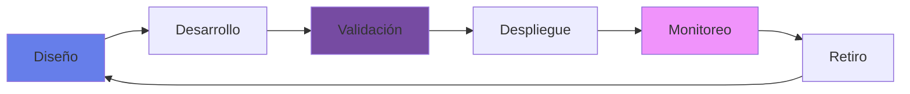
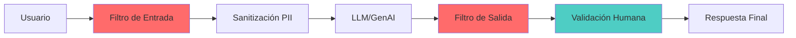
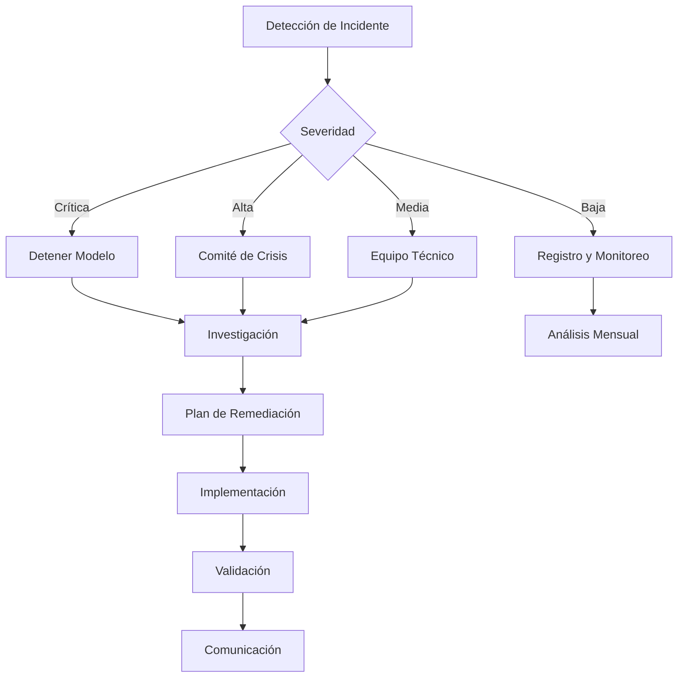

# 📜 Política de Uso Responsable de IA

## 🎯 Propósito y Alcance

Esta política establece los principios, lineamientos y responsabilidades para el desarrollo, implementación y uso ético y responsable de sistemas de Inteligencia Artificial en nuestra institución bancaria, alineados con las regulaciones mexicanas y mejores prácticas internacionales.

### Aplicabilidad
- **Alcance**: Todos los sistemas de IA en producción, desarrollo o evaluación
- **Audiencia**: Empleados, contratistas, proveedores y socios tecnológicos
- **Vigencia**: Efectiva desde enero 2025, revisión anual obligatoria

## 🏛️ Principios Fundamentales

### 1. 👥 Centrado en el Humano
- La IA debe aumentar las capacidades humanas, no reemplazarlas
- Mantener supervisión humana en decisiones críticas
- Priorizar el bienestar del cliente y empleado

### 2. 🔍 Transparencia y Explicabilidad
- Los sistemas deben ser auditables y comprensibles
- Documentar la lógica de decisiones algorítmicas
- Comunicar claramente cuando se usa IA

### 3. ⚖️ Equidad y No Discriminación
- Prevenir sesgos algorítmicos
- Garantizar acceso equitativo a servicios
- Monitoreo continuo de impacto diferencial

### 4. 🔐 Privacidad y Seguridad
- Protección de datos personales según LFPDPPP
- Cifrado end-to-end en modelos sensibles
- Minimización de datos y anonimización

### 5. 📊 Responsabilidad y Rendición de Cuentas
- Trazabilidad completa de decisiones
- Asignación clara de responsabilidades
- Mecanismos de apelación y corrección

## 🎯 Clasificación de Riesgo de Modelos

### Sistema de Niveles (Tiers)

| Nivel | Descripción | Ejemplos | Controles Requeridos |
|-------|-------------|----------|---------------------|
| **Tier 1 - Crítico** | Impacto directo en derechos o finanzas de clientes | Scoring crediticio, detección de fraude con bloqueo de cuentas, decisiones de AML/KYC | Todos los controles de esta política + auditoría externa anual |
| **Tier 2 - Alto** | Impacto significativo en experiencia del cliente | Chatbots de servicio, recomendaciones de productos, segmentación de clientes | Controles completos + auditoría interna semestral |
| **Tier 3 - Moderado** | Impacto indirecto o interno | Optimización de procesos, predicción de demanda, análisis de sentimiento | Controles estándar + auto-evaluación trimestral |
| **Tier 4 - Bajo** | Uso interno sin impacto en clientes | Clasificación de documentos internos, asistentes de productividad | Controles básicos + revisión anual |

### Determinación del Nivel
La clasificación será determinada durante la Evaluación de Impacto Ético (EIA) considerando:
- Número de personas afectadas
- Severidad del impacto potencial
- Reversibilidad de las decisiones
- Sensibilidad de los datos utilizados
- Cumplimiento regulatorio aplicable

## 📋 Lineamientos Operativos

### Ciclo de Vida del Modelo



### Fase 1: Diseño Ético
- [ ] Evaluación de impacto ético (EIA)
- [ ] Análisis de riesgos y beneficios
- [ ] Definición de métricas de equidad
- [ ] Plan de mitigación de sesgos

### Fase 2: Desarrollo Responsable
- [ ] Análisis de idoneidad de datos (data suitability assessment)
- [ ] Documentación completa del linaje de datos
- [ ] Datos representativos y balanceados
- [ ] Técnicas de fairness-aware ML
- [ ] Documentación técnica completa
- [ ] Pruebas de robustez y adversariales

### Fase 3: Validación Rigurosa
- [ ] Auditoría de sesgos algorítmicos
- [ ] Pruebas de explicabilidad
- [ ] Validación con grupos diversos
- [ ] Certificación de cumplimiento

### Fase 4: Despliegue Controlado
- [ ] Lanzamiento gradual (canary release)
- [ ] Monitoreo en tiempo real
- [ ] Mecanismos de fallback
- [ ] Comunicación transparente

### Fase 5: Monitoreo Continuo
- [ ] KPIs de equidad y performance
- [ ] Detección de drift
- [ ] Feedback loops
- [ ] Auditorías periódicas

## 🚫 Usos Prohibidos

### Absolutamente Prohibido
1. **Vigilancia masiva** sin consentimiento
2. **Manipulación** de comportamiento vulnerable
3. **Discriminación** por características protegidas
4. **Suplantación** de identidad o deepfakes
5. **Decisiones autónomas** sin supervisión en:
   - Otorgamiento de créditos superiores a 10,000 UDIs
   - Terminación de relaciones bancarias
   - Evaluación de empleados para promociones o despidos

### Requiere Aprobación Especial
- Scoring crediticio automatizado
- Análisis biométrico
- Perfilamiento de clientes
- Modelos de predicción de comportamiento

## 👮 Gobernanza y Roles

### Comité de Ética de IA

| Rol | Responsabilidad | Frecuencia |
|-----|----------------|------------|
| **Chief AI Ethics Officer** | Supervisión estratégica | Mensual |
| **Risk Management** | Evaluación de riesgos | Por proyecto |
| **Legal & Compliance** | Cumplimiento regulatorio | Continuo |
| **Data Protection Officer** | Privacidad de datos | Por modelo |
| **Representante de Negocio** | Impacto en clientes | Trimestral |
| **Tecnología** | Implementación técnica | Continuo |

### Responsabilidades por Rol

#### Product Owner
- Definir casos de uso éticos
- Documentar decisiones de diseño
- Asegurar transparencia con usuarios

#### Desarrolladores
- Implementar controles técnicos
- Documentar código y decisiones
- Realizar pruebas de sesgo

#### Risk Officers
- Evaluar riesgos de modelo
- Validar métricas de equidad
- Aprobar despliegues

## 🤖 Lineamientos para IA Generativa y LLMs

### Controles Específicos para GenAI

#### Riesgos Únicos y Mitigaciones
| Riesgo | Descripción | Control Obligatorio |
|--------|-------------|-------------------|
| **Alucinaciones** | Generación de información falsa | RAG con fuentes verificadas + validación humana |
| **Fuga de Datos** | Exposición de información sensible | Filtros de PII + sanitización de prompts |
| **Prompt Injection** | Manipulación maliciosa de prompts | Validación de entrada + sandboxing |
| **Toxicidad** | Generación de contenido inapropiado | Filtros de contenido + monitoreo continuo |
| **Propiedad Intelectual** | Uso no autorizado de contenido | Auditoría de fuentes + atribución |

#### Reglas de Uso
1. **Prohibido** usar GenAI para generar información financiera o legal sin supervisión
2. **Obligatorio** implementar RAG para cualquier chatbot que interactúe con clientes
3. **Restringido** el envío de datos sensibles a APIs de terceros (GPT, Claude, etc.)
4. **Requerido** mantener logs completos de prompts y respuestas por 2 años

#### Arquitectura Segura para LLMs


## 📊 Métricas y KPIs

### Métricas de Equidad
```python
# Métricas base por modelo (ajustables según Tier de riesgo)
fairness_metrics = {
    "demographic_parity": 0.8,  # Min ratio (Tier 4)
    "equal_opportunity": 0.85,   # Min threshold (Tier 3)
    "calibration": 0.9,          # Min score (Tier 2)
    "individual_fairness": True   # Required (Tier 1)
}
# Nota: Modelos Tier 1 pueden requerir umbrales más estrictos
# definidos en la Evaluación de Impacto Ético
```

### Dashboard de Cumplimiento
- **Modelos en Producción**: Cumplimiento actual
- **Incidentes Éticos**: Tendencia mensual
- **Auditorías Completadas**: % del plan anual
- **Formación en Ética**: Cobertura del personal

## 🔄 Proceso de Escalamiento



### Niveles de Severidad

| Nivel | Descripción | Tiempo de Respuesta | Escalamiento |
|-------|-------------|-------------------|--------------|
| **Crítica** | Discriminación sistemática | Inmediato | CEO + Dirección Jurídica (evaluación regulatoria) |
| **Alta** | Sesgo significativo | 4 horas | C-Suite |
| **Media** | Desviación de métricas | 24 horas | Gerencia |
| **Baja** | Observación menor | 72 horas | Equipo técnico |

### Componentes del Plan de Remediación

Todo plan de remediación debe incluir obligatoriamente:

1. **Análisis de Causa Raíz**
   - Identificación del origen del problema
   - Factores contribuyentes
   - Timeline del incidente

2. **Impacto Cuantificado**
   - Número de clientes afectados
   - Pérdidas financieras estimadas
   - Impacto reputacional

3. **Acciones Correctivas**
   - Re-entrenamiento del modelo
   - Ajuste de umbrales
   - Corrección de datos

4. **Acciones Preventivas**
   - Nuevos controles implementados
   - Actualización de procesos
   - Mejoras en monitoreo

5. **Plan de Comunicación**
   - Notificación a afectados
   - Comunicación interna
   - Reporte regulatorio (si aplica)

## 📚 Formación y Capacitación

### Programa Obligatorio

#### Nivel Básico (Todos)
- Principios de IA responsable (4 hrs)
- Identificación de sesgos (2 hrs)
- Uso de herramientas IA (2 hrs)

#### Nivel Intermedio (Usuarios IA)
- Interpretación de modelos (8 hrs)
- Métricas de equidad (4 hrs)
- Casos de estudio (4 hrs)

#### Nivel Avanzado (Desarrolladores)
- Técnicas de debiasing (16 hrs)
- Explicabilidad avanzada (8 hrs)
- Auditoría de modelos (8 hrs)

## 🔍 Auditoría y Compliance

### Calendario de Auditorías

| Tipo | Frecuencia | Responsable | Entregable |
|------|-----------|-------------|------------|
| **Auto-evaluación** | Mensual | Product Owner | Checklist |
| **Revisión técnica** | Trimestral | CoE IA | Reporte técnico |
| **Auditoría interna** | Semestral | Risk Management | Informe de riesgos |
| **Auditoría externa** | Anual | Firma externa | Certificación |

### Documentación Requerida
1. **Model Card** por cada modelo
2. **Data Sheet** por dataset
3. **Impact Assessment** por caso de uso
4. **Audit Trail** completo
5. **Incident Log** actualizado

## 🚨 Mecanismos de Denuncia

### Canales Disponibles
- 📧 **Email confidencial**: etica-ia@novasolutionsystems.com
- 📞 **Línea directa**: 800-ETICA-IA
- 🌐 **Portal anónimo**: ethics.novasolutionsystems.com/ia
- 💬 **Buzón físico**: En cada oficina

### Protección al Denunciante
- Confidencialidad garantizada
- Prohibición de represalias
- Investigación independiente
- Feedback sobre resolución

## 📑 Marco Regulatorio

### Normativa Aplicable

#### Regulación Nacional
- **CNBV**: 
  - Circular Única de Bancos (CUB) - Título Segundo, Capítulo I (Administración de Riesgos)
  - Disposiciones de carácter general en materia de riesgo operacional (Art. 68 - Modelos)
- **Banxico**: 
  - Circular 3/2012 - Disposiciones aplicables a operaciones de instituciones de crédito
  - Circular 4/2019 - Modelos de riesgo y validación
- **INAI**: 
  - Ley Federal de Protección de Datos Personales en Posesión de Particulares (LFPDPPP)
  - Guía para implementar un Sistema de Gestión de Seguridad de Datos Personales

#### Estándares Internacionales
- **ISO/IEC 23053:2022**: Framework for AI Trustworthiness
- **ISO/IEC 23894:2023**: AI Risk Management
- **ISO/IEC 38507:2022**: Governance implications of AI use by organizations

### Alineación Internacional
- EU AI Act (referencia)
- NIST AI Risk Management Framework
- Singapore Model AI Governance
- OECD AI Principles

## 🔄 Revisión y Actualización

### Proceso de Actualización
1. **Revisión anual** obligatoria
2. **Actualizaciones** por cambios regulatorios
3. **Mejoras** por lecciones aprendidas
4. **Consulta** con stakeholders
5. **Aprobación** del Consejo

### Control de Versiones

| Versión | Fecha | Cambios | Aprobado por |
|---------|-------|---------|--------------|
| 1.0 | Ene 2025 | Versión inicial | Consejo Directivo |
| 1.1 | Jul 2025 | Actualización CNBV | Comité de Riesgos |

## 📞 Contacto y Soporte

### Centro de Excelencia de IA
- **Email**: coe-ia@novasolutionsystems.com
- **Teams**: Canal #ai-governance
- **Horario**: Lun-Vie 8:00-18:00
- **Portal**: nova-cell.novasolutionsystems.com/ethics

### Recursos Adicionales
- [Framework AISIA](framework-aisia.md)
- [Procedimiento de Validación](procedimiento-validacion-modelos.md)
- [Checklist de Seguridad](checklist-seguridad.md)
- [Guía de Privacidad](privacidad-datos.md)

---

**Última actualización**: Enero 2025  
**Próxima revisión**: Julio 2025  
**Documento clasificado como**: PÚBLICO INTERNO