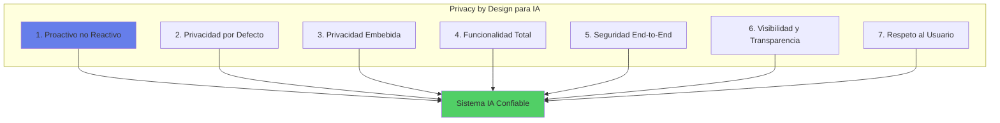
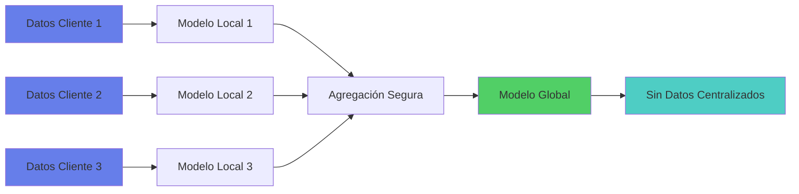
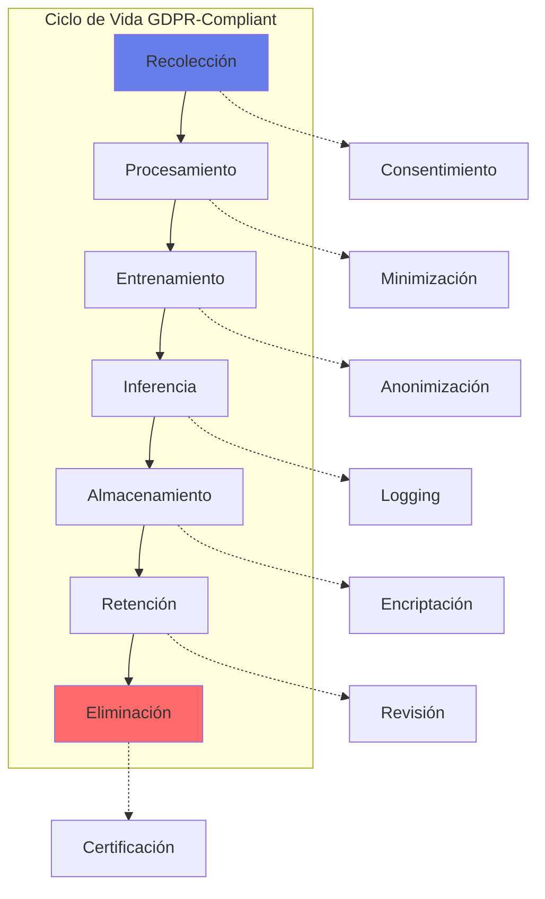
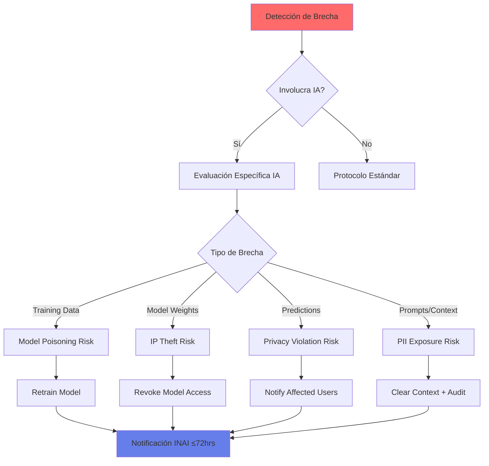

# 🔐 Política de Privacidad y Protección de Datos para IA

## 📋 Resumen Ejecutivo

Esta política establece los lineamientos obligatorios para el tratamiento, protección y gobierno de datos personales y sensibles en todos los sistemas de Inteligencia Artificial del banco, garantizando el cumplimiento de la LFPDPPP, GDPR (para clientes europeos) y las mejores prácticas internacionales de privacidad.

### Marco de Referencia
- **Normativa Nacional**: LFPDPPP, Reglamento LFPDPPP, Criterios INAI
- **Normativa Internacional**: GDPR, CCPA, ISO/IEC 27701
- **Principios**: Privacy by Design, Data Minimization, Purpose Limitation
- **Alcance**: Todos los modelos de IA que procesen datos personales

## 🎯 Principios Fundamentales de Privacidad

### Los 7 Pilares de Privacy by Design para IA



### Principios ARCO para IA

| Derecho | Descripción | Implementación en IA | SLA |
|---------|-------------|---------------------|-----|
| **Acceso** | Ver qué datos usa el modelo | API de consulta + Portal | 5 días |
| **Rectificación** | Corregir datos incorrectos | Pipeline de actualización | 10 días |
| **Cancelación** | Eliminar datos del sistema | Proceso de olvido (unlearning) | 15 días |
| **Oposición** | No ser sujeto a decisiones IA | Opt-out + revisión humana significativa* | Inmediato |

> *Una "revisión humana significativa" requiere evaluación independiente por personal calificado con autoridad para anular la recomendación del modelo. Debe incluir revisión de factores clave que llevaron a la decisión automatizada y cualquier información adicional del cliente. No es suficiente simplemente aprobar la salida del modelo.

## 📊 Clasificación de Datos para IA

### Taxonomía de Sensibilidad

| Nivel | Tipo de Datos | Ejemplos | Controles IA Requeridos |
|-------|--------------|----------|------------------------|
| **L4 - Crítico** | Datos sensibles LFPDPPP | Salud, religión, origen étnico, preferencia sexual | Prohibido para IA sin consentimiento explícito |
| **L3 - Alto** | Datos financieros y patrimoniales | Ingresos, deudas, historial crediticio, cuentas | Encriptación + Anonimización + Audit trail |
| **L2 - Medio** | Datos identificables | Nombre, RFC, CURP, dirección, teléfono | Seudonimización + Control de acceso |
| **L1 - Bajo** | Datos agregados/públicos | Estadísticas, datos abiertos, información pública | Controles estándar |

### Matriz de Uso Permitido

```python
# Validación automática de uso de datos
def validate_data_usage(model_purpose, data_level, consent_type):
    usage_matrix = {
        'L4': {
            'allowed_purposes': ['medical_emergency', 'legal_requirement'],
            'required_consent': 'explicit_written',
            'ai_restrictions': 'no_automated_decisions'
        },
        'L3': {
            'allowed_purposes': ['credit_scoring', 'risk_assessment', 'fraud_detection'],
            'required_consent': 'explicit',
            'ai_restrictions': 'human_review_required'
        },
        'L2': {
            'allowed_purposes': ['service_improvement', 'personalization', 'marketing'],
            'required_consent': 'informed',
            'ai_restrictions': 'opt_out_available'
        },
        'L1': {
            'allowed_purposes': ['analytics', 'reporting', 'research'],
            'required_consent': 'implied',
            'ai_restrictions': 'none'
        }
    }
    
    level_rules = usage_matrix[data_level]
    
    if model_purpose not in level_rules['allowed_purposes']:
        return False, "Purpose not allowed for this data level"
    
    if consent_type != level_rules['required_consent']:
        return False, "Insufficient consent level"
    
    return True, level_rules['ai_restrictions']
```

## 🛡️ Técnicas de Protección de Privacidad

### Privacy-Preserving Machine Learning

#### 1. Differential Privacy

```python
# Implementación de privacidad diferencial
import numpy as np

def add_differential_privacy(data, epsilon=1.0):
    """
    Agrega ruido Laplaciano para garantizar privacidad diferencial
    epsilon: parámetro de privacidad (menor = más privado)
    """
    sensitivity = calculate_sensitivity(data)
    scale = sensitivity / epsilon
    
    noise = np.random.laplace(0, scale, data.shape)
    private_data = data + noise
    
    # Garantía: Pr[M(D) ∈ S] ≤ e^ε × Pr[M(D') ∈ S]
    privacy_guarantee = f"ε-differential privacy with ε={epsilon}"
    
    return private_data, privacy_guarantee
```

#### 2. Federated Learning



#### 3. Homomorphic Encryption

```python
# Procesamiento sobre datos encriptados
def homomorphic_ml_inference(encrypted_data, model):
    """
    Realiza inferencia sobre datos encriptados sin desencriptar
    """
    # Operaciones homomórficas
    encrypted_features = homomorphic_transform(encrypted_data)
    encrypted_prediction = model.predict_encrypted(encrypted_features)
    
    # El banco nunca ve los datos en texto plano
    return encrypted_prediction  # Cliente desencripta localmente
```

### Técnicas de Anonimización para IA

| Técnica | Descripción | Uso en IA | Nivel de Protección |
|---------|-------------|-----------|-------------------|
| **K-Anonymity** | Cada registro indistinguible de k-1 otros | Datasets de entrenamiento | Medio |
| **L-Diversity** | K-anonymity + diversidad en atributos sensibles | Datos categóricos | Alto |
| **T-Closeness** | L-diversity + distribución cercana a original | Datos numéricos | Muy Alto |
| **Synthetic Data** | Datos artificiales que preservan propiedades | Training sin datos reales | Máximo |

## 🔄 Ciclo de Vida de Datos en IA

### Fases y Controles



### Controles por Fase

#### Fase 1: Recolección
- [ ] Consentimiento informado obtenido
- [ ] Propósito específico documentado
- [ ] Aviso de privacidad actualizado
- [ ] Evaluación de necesidad (data minimization)

#### Fase 2: Procesamiento
- [ ] Base legal verificada
- [ ] Transformaciones documentadas
- [ ] Logs de procesamiento activos
- [ ] Quality checks implementados

#### Fase 3: Entrenamiento
- [ ] Datos anonimizados/seudonimizados
- [ ] Segregación train/test/validation
- [ ] No memorización de PII verificada
- [ ] Auditoría de data leakage

#### Fase 4: Inferencia
- [ ] Datos de entrada validados
- [ ] Predicciones no revelan PII
- [ ] Logs de decisiones mantenidos
- [ ] Explicabilidad disponible

#### Fase 5: Almacenamiento
- [ ] Encriptación at-rest (AES-256)
- [ ] Encriptación in-transit (TLS 1.3)
- [ ] Access controls implementados
- [ ] Backup con misma protección

#### Fase 6: Retención
- [ ] Política de retención definida
- [ ] Revisión periódica de necesidad
- [ ] Alertas de expiración configuradas
- [ ] Proceso de renovación documentado

#### Fase 7: Eliminación
- [ ] Borrado seguro (DoD 5220.22-M)
- [ ] Eliminación de backups
- [ ] Certificado de destrucción
- [ ] Model unlearning si aplica

## 🤖 Consideraciones Especiales para GenAI/LLMs

### Riesgos de Privacidad Únicos

| Riesgo | Descripción | Mitigación Obligatoria |
|--------|-------------|----------------------|
| **Training Data Extraction** | LLM puede memorizar y revelar datos de entrenamiento | Differential privacy + Filtros de salida |
| **Prompt Injection PII** | Usuario inyecta PII en prompts | Sanitización automática pre-procesamiento |
| **Inference Attacks** | Deducir información sensible de respuestas | Rate limiting + Output filtering |
| **Context Leakage** | RAG puede exponer documentos sensibles | Access control en vectorstore |
| **Cross-User Contamination** | Contexto de un usuario afecta a otro | Sesiones aisladas + Context clearing |

### Arquitectura de Privacidad para LLMs

```python
class PrivacyPreservingLLM:
    def __init__(self):
        self.pii_detector = PIIDetector()
        self.anonymizer = DataAnonymizer()
        self.output_filter = OutputSanitizer()
        
    def process_prompt(self, prompt, user_context, data_level='L2'):
        # 1. Detectar y reemplazar PII con placeholders estables
        clean_prompt, pii_map = self.pii_detector.scan_and_replace(prompt)
        
        if pii_map:
            log_pii_attempt(user_context, pii_map)
            
            # Decisión basada en nivel de sensibilidad de datos
            if data_level in ['L3', 'L4']:
                # Para datos sensibles, rechazar el prompt
                return "Su solicitud contiene información personal. Por favor reformule sin incluir datos personales específicos."
            elif data_level == 'L2':
                # Para datos medios, proceder con placeholders
                log_warning(f"Proceeding with placeholders for L2 data: {pii_map.keys()}")
            # L1 puede proceder normalmente
        
        # 2. Agregar contexto de privacidad
        privacy_context = f"""
        SYSTEM: Never reveal personal information.
        Never use real names, addresses, or identifiers.
        If asked about specific individuals, decline politely.
        Current data sensitivity level: {data_level}
        """
        
        # 3. Generar respuesta con prompt limpio
        response = self.llm.generate(privacy_context + clean_prompt)
        
        # 4. Filtrar salida
        safe_response = self.output_filter.sanitize(response)
        
        # 5. Logging para auditoría
        log_interaction(user_context, clean_prompt, safe_response)
        
        return safe_response
```

## 📋 Evaluación de Impacto en Privacidad (PIA)

### Cuando es Obligatoria

Una PIA es obligatoria para modelos de IA cuando:
1. Procesan datos de Nivel L3 o L4
2. Afectan a >10,000 individuos
3. Usan técnicas de profiling automatizado
4. Combinan múltiples fuentes de datos
5. Implementan vigilancia o monitoreo
6. Son modelos de GenAI/LLMs con memoria

> **Nota Importante**: La PIA es el proceso formal para determinar los controles técnicos de privacidad necesarios y proporcionales para cada iniciativa de IA. La sección `technical_measures` del PIA constituye requisitos de implementación obligatorios para el equipo de IA, que serán validados por el DPO y Seguridad.

### Plantilla de PIA para IA

```yaml
privacy_impact_assessment:
  project:
    name: string
    ai_model_type: [supervised, unsupervised, generative, reinforcement]
    data_sensitivity: [L1, L2, L3, L4]
    
  data_processing:
    purpose:
      primary: string
      secondary: list
    legal_basis:
      - consent
      - contract
      - legal_obligation
      - vital_interests
      - public_task
      - legitimate_interests
    
  data_subjects:
    categories: [customers, employees, prospects, minors]
    volume: integer
    geographical_scope: [local, national, international]
    
  data_categories:
    personal_data:
      - type: string
        sensitivity: [L1-L4]
        retention: days
    special_categories:  # Datos sensibles LFPDPPP
      - type: string
        justification: string
        additional_safeguards: list
        
  risks:
    - risk: string
      likelihood: [very_low, low, medium, high, very_high]
      impact: [negligible, limited, significant, maximum]
      mitigation: string
      residual_risk: [acceptable, manageable, high]
      
  technical_measures:
    encryption:
      at_rest: [algorithm, key_length]
      in_transit: [protocol, version]
    anonymization:
      technique: [k-anonymity, differential_privacy, synthetic]
      parameters: dict
    access_control:
      authentication: [MFA, SSO, biometric]
      authorization: [RBAC, ABAC]
      
  compliance_check:
    lfpdppp: boolean
    gdpr: boolean  # Si aplica
    sector_specific: list
    
  approval:
    dpo_review: date
    risk_assessment: date
    legal_review: date
    final_approval: date
```

## 🚨 Gestión de Brechas de Datos

### Protocolo de Respuesta para IA



### Timeline de Respuesta

| Tiempo | Acción | Responsable |
|--------|--------|------------|
| **0-1 hora** | Contención inicial | Security Operations |
| **1-4 horas** | Evaluación de impacto | DPO + AI Team |
| **4-24 horas** | Investigación forense | CERT |
| **24-72 horas** | Notificación INAI | Legal + DPO |
| **72+ horas** | Notificación usuarios afectados | Customer Service |
| **7 días** | Reporte completo | Risk Management |
| **30 días** | Lecciones aprendidas | Todos |

## 🔍 Auditoría y Monitoreo

### KPIs de Privacidad para IA

```python
privacy_kpis = {
    'consent_rate': {
        'formula': 'explicit_consents / total_users',
        'target': 0.95,
        'frequency': 'daily'
    },
    'data_minimization': {
        'formula': 'features_used / features_available',
        'target': 0.60,  # No más del 60% de features disponibles
        'frequency': 'per_model'
    },
    'anonymization_effectiveness': {
        'formula': 're_identification_attempts_failed / total_attempts',
        'target': 1.00,
        'frequency': 'quarterly'
    },
    'retention_compliance': {
        'formula': 'data_deleted_on_time / data_scheduled_deletion',
        'target': 1.00,
        'frequency': 'monthly'
    },
    'arco_response_time': {
        'formula': 'average_days_to_respond',
        'target': 5,
        'frequency': 'monthly'
    },
    'pia_coverage': {
        'formula': 'models_with_pia / total_models_l3_l4',
        'target': 1.00,
        'frequency': 'quarterly'
    }
}
```

### Dashboard de Privacidad

| Métrica | Actual | Target | Tendencia | Status |
|---------|--------|--------|-----------|--------|
| Tasa de consentimiento | 92% | 95% | ↑ | 🟡 |
| Minimización de datos | 55% | 60% | ↑ | 🟢 |
| Efectividad anonimización | 100% | 100% | → | 🟢 |
| Cumplimiento retención | 98% | 100% | ↑ | 🟡 |
| Tiempo respuesta ARCO | 4.2 días | 5 días | ↓ | 🟢 |
| Cobertura PIA | 100% | 100% | → | 🟢 |

## 🛠️ Herramientas y Tecnologías

### Stack de Privacy Tech

```yaml
privacy_tools:
  detection:
    - Microsoft Presidio  # PII detection
    - Google Cloud DLP    # Data loss prevention
    - AWS Macie          # Sensitive data discovery
    
  anonymization:
    - ARX Data Anonymization Tool
    - Privitar Platform
    - Aircloak Analytics
    
  consent_management:
    - OneTrust
    - TrustArc
    - Usercentrics
    
  privacy_engineering:
    - Google Differential Privacy Library
    - PySyft (Federated Learning)
    - Microsoft SEAL (Homomorphic Encryption)
    
  monitoring:
    - Immuta (Data Governance)
    - Collibra (Data Catalog)
    - BigID (Privacy Management)
```

### APIs de Privacidad

```python
# API endpoints para gestión de privacidad
privacy_api = {
    # Derechos ARCO
    'GET /api/privacy/my-data': 'Obtener todos mis datos',
    'PUT /api/privacy/rectify': 'Corregir datos incorrectos',
    'DELETE /api/privacy/forget-me': 'Solicitar eliminación',
    'POST /api/privacy/opt-out': 'Oponerse al procesamiento',
    
    # Consentimiento
    'GET /api/privacy/consents': 'Ver consentimientos activos',
    'POST /api/privacy/consent': 'Otorgar consentimiento',
    'DELETE /api/privacy/consent/{id}': 'Revocar consentimiento',
    
    # Transparencia
    'GET /api/privacy/processing-activities': 'Ver cómo se usan mis datos',
    'GET /api/privacy/ai-decisions': 'Ver decisiones de IA sobre mí',
    'GET /api/privacy/data-sources': 'Ver origen de mis datos',
}
```

## 📚 Cumplimiento Regulatorio

### Mapeo de Requerimientos

| Regulación | Artículos Clave | Implementación en IA |
|------------|----------------|---------------------|
| **LFPDPPP** | Art. 6-9 (Principios) | Privacy by Design, minimización |
| **LFPDPPP** | Art. 23-26 (ARCO) | APIs de derechos, portal de privacidad |
| **LFPDPPP** | Art. 36-37 (Transferencias) | Contratos y consentimiento para cloud AI |
| **INAI** | Criterio 47/2022 | Evaluación de impacto obligatoria |
| **GDPR** | Art. 25 (PbD) | Privacidad desde el diseño |
| **GDPR** | Art. 35 (DPIA) | PIA para alto riesgo |
| **ISO 27701** | Anexo A | Controles de privacidad implementados |

### Transferencias Internacionales de Datos para IA

#### Requisitos para Uso de Servicios IA en la Nube

Cuando se utilicen servicios de IA de terceros ubicados fuera de México (ej. OpenAI, Google Cloud AI, AWS), se requiere:

1. **Aviso de Privacidad Actualizado**
   - Cláusula explícita sobre transferencia internacional
   - Identificación del país receptor
   - Finalidades de la transferencia

2. **Consentimiento Específico**
   ```text
   "Consiento que mis datos personales sean transferidos a [Proveedor] 
   ubicado en [País] para procesamiento mediante inteligencia artificial, 
   conforme a las medidas de seguridad descritas en el aviso de privacidad."
   ```

3. **Acuerdo de Procesamiento de Datos (DPA)**
   - Cláusulas contractuales estándar
   - Garantías de nivel de protección equivalente a LFPDPPP
   - Auditoría y derecho de inspección
   - Notificación de brechas en <24 horas

4. **Evaluación de Riesgo del País**
   - Verificar adecuación del marco legal del país receptor
   - Para EEUU: Validar Privacy Shield o mecanismos alternativos
   - Para UE: GDPR proporciona protección adecuada

#### Matriz de Decisión para Cloud AI

| Tipo de Datos | API Pública | Private Cloud | On-Premise | Federated |
|---------------|-------------|---------------|------------|-----------|
| **L4 - Crítico** | ❌ Prohibido | ⚠️ Con DPA estricto | ✅ Preferido | ✅ Ideal |
| **L3 - Alto** | ❌ No recomendado | ✅ Con controles | ✅ Sí | ✅ Sí |
| **L2 - Medio** | ⚠️ Con anonimización | ✅ Sí | ✅ Sí | ✅ Sí |
| **L1 - Bajo** | ✅ Permitido | ✅ Sí | ✅ Sí | ✅ Sí |

### Documentación Requerida

1. **Registro de Actividades de Tratamiento** (RAT)
2. **Avisos de Privacidad** actualizados para IA
3. **Evaluaciones de Impacto** (PIAs)
4. **Registro de Consentimientos**
5. **Logs de Ejercicio de Derechos ARCO**
6. **Acuerdos de Transferencia de Datos**
7. **Políticas de Retención y Eliminación**

## 🤝 Roles y Responsabilidades

### Matriz RACI para Privacidad en IA

| Actividad | DPO | AI Team | Legal | Risk | Security |
|-----------|-----|---------|-------|------|----------|
| Definir requerimientos de privacidad | A | R | C | I | C |
| Realizar PIA | A | R | C | C | I |
| Implementar controles técnicos | C | R | I | I | A |
| Gestionar consentimientos | A | R | C | I | I |
| Responder solicitudes ARCO | A | R | C | I | C |
| Notificar brechas | A | C | R | C | R |
| Auditar cumplimiento | R | C | C | A | C |

**R**: Responsable | **A**: Aprobador | **C**: Consultado | **I**: Informado

## 🎓 Capacitación y Concientización

### Programa de Formación

#### Nivel 1: Awareness General (Todos)
- Principios de privacidad (2 hrs)
- Derechos ARCO (1 hr)
- Identificación de PII (1 hr)
- **Examen**: 80% para aprobar

#### Nivel 2: Privacidad para IA (Desarrolladores)
- Privacy by Design para ML (4 hrs)
- Técnicas de anonimización (4 hrs)
- Differential Privacy (3 hrs)
- Federated Learning (3 hrs)
- **Proyecto práctico**: Implementar DP en modelo

#### Nivel 3: Especialización (DPO Team)
- Marco regulatorio completo (8 hrs)
- Gestión de incidentes (4 hrs)
- Auditoría de privacidad (4 hrs)
- **Certificación**: CIPP/CIPM requerida

## 🚀 Hoja de Ruta de Privacidad

### 2025 Q1-Q2
- [ ] Implementar Differential Privacy en modelos Tier 1
- [ ] Desplegar consent management platform
- [ ] Automatizar PIAs para nuevos modelos

### 2025 Q3-Q4
- [ ] Piloto de Federated Learning
- [ ] Synthetic data generation pipeline
- [ ] Portal de transparencia para clientes

### 2026
- [ ] Homomorphic encryption para inferencia
- [ ] Zero-knowledge proofs para verificación
- [ ] Privacy-preserving MLOps completo

## 📞 Contacto y Soporte

### Oficina del DPO
- **Email**: dpo@banco.mx
- **Hotline**: 800-PRIVACY
- **Portal**: privacy.banco.mx
- **Horario**: 24/7 para incidentes

### Recursos Adicionales
- [Política de Uso Responsable de IA](politica-uso-responsable-ia.md)
- [Procedimiento de Validación de Modelos](procedimiento-validacion-modelos.md)
- [Framework AISIA](framework-aisia.md)
- [Checklist de Seguridad](checklist-seguridad.md)

---

**Versión**: 1.0  
**Fecha de emisión**: Enero 2025  
**Próxima revisión**: Julio 2025  
**Clasificación**: CONFIDENCIAL - CUMPLIMIENTO CRÍTICO