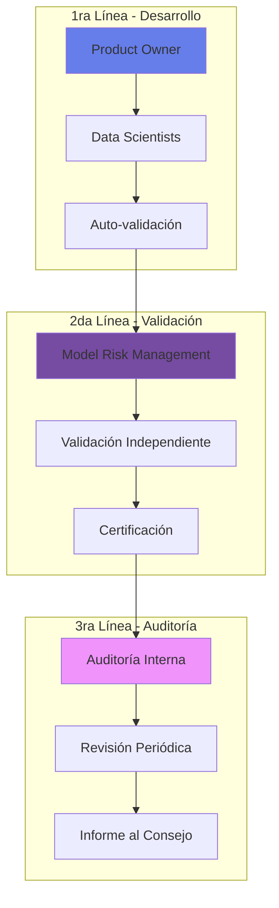
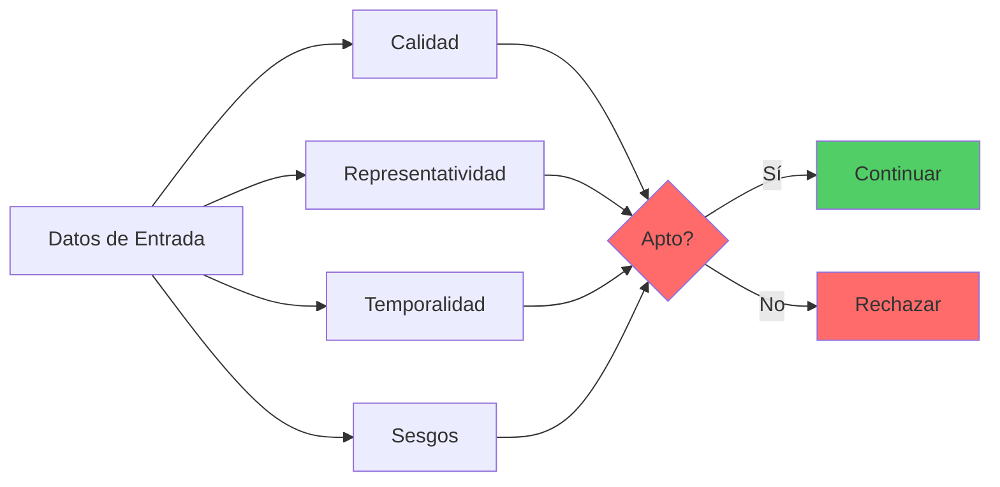
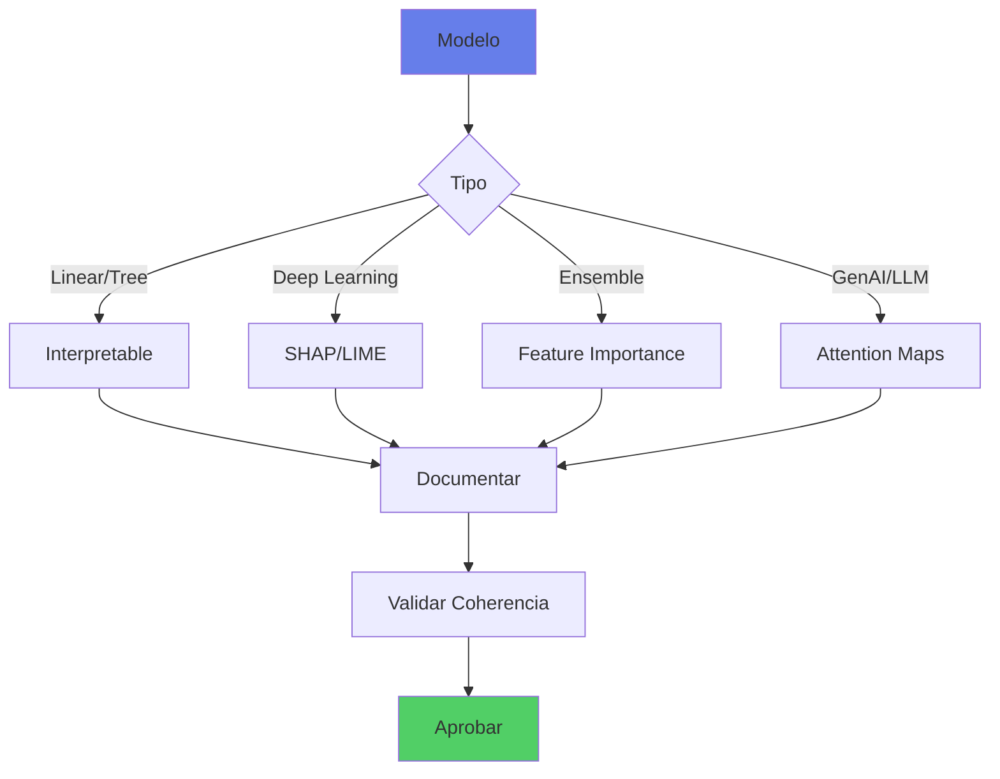
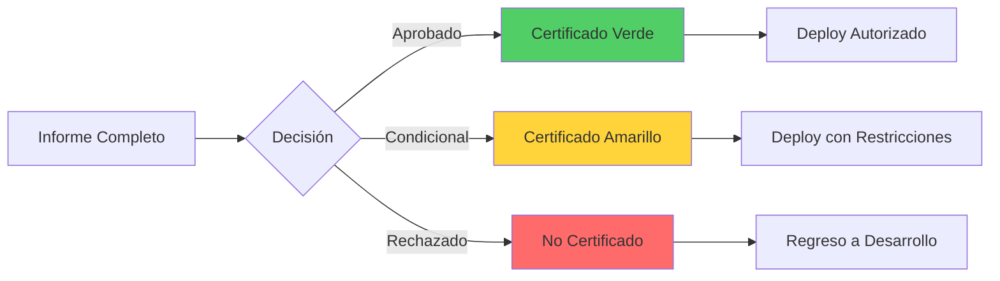

# 🔬 Procedimiento de Validación de Modelos de IA

## 📋 Resumen Ejecutivo

Este procedimiento establece el marco metodológico para la validación de todos los modelos de Inteligencia Artificial antes de su despliegue en producción, garantizando su confiabilidad, equidad y alineación con mejores prácticas de la industria y estándares regulatorios aplicables.

### Información Clave
- **Aplicación**: Todos los modelos de IA/ML en el banco
- **Frecuencia**: Pre-producción + validación periódica
- **Responsable**: Unidad de Validación de Modelos (MRM)
- **Actualización**: Semestral o por cambio regulatorio

## 🎯 Objetivos y Alcance

### Objetivos Principales
1. **Verificar** la precisión y robustez de los modelos
2. **Evaluar** riesgos de sesgo y discriminación
3. **Asegurar** cumplimiento regulatorio
4. **Documentar** hallazgos y recomendaciones
5. **Certificar** aptitud para producción

### Alcance
- ✅ Modelos de Machine Learning supervisados y no supervisados
- ✅ Modelos de Deep Learning y redes neuronales
- ✅ Modelos de IA Generativa y LLMs
- ✅ Sistemas de reglas expertas con componentes de IA
- ❌ Análisis estadísticos tradicionales sin ML

## 🏗️ Framework de Validación

### Estructura de Tres Líneas de Defensa



## 📊 Categorización de Modelos por Riesgo

> **Nota**: La clasificación de modelos por Tiers se define en la [Política de Uso Responsable de IA](politica-uso-responsable-ia.md#clasificación-de-riesgo-de-modelos). Este procedimiento detalla los requisitos de validación para cada nivel.

### Matriz de Validación por Tier

| Tier | Validación Requerida | Timeline | Frecuencia | Validador |
|------|---------------------|----------|------------|-----------|
| **Tier 1 - Crítico** | Completa (8 fases) + Externa | 8 semanas | Semestral | Interno + Externo |
| **Tier 2 - Alto** | Completa (8 fases) | 6 semanas | Anual | Interno Senior |
| **Tier 3 - Moderado** | Estándar (5 fases condensadas) | 3-4 semanas | Anual | Interno |
| **Tier 4 - Bajo** | Simplificada (fast-track) | 1-2 semanas | Bienal | Auto-validación + Revisión |

### Rutas de Validación Diferenciadas

#### 🚀 Fast-Track (Tier 4)
- Revisión documental + Replicación básica
- Pruebas automatizadas de performance
- Checklist de compliance simplificado
- Timeline: 5-10 días hábiles

#### 📋 Estándar (Tier 3)
- Fases 1-3 completas
- Fases 4-5 combinadas (Fairness + Explicabilidad)
- Fase 6 simplificada (solo critical paths)
- Timeline: 15-20 días hábiles

#### 🔬 Completa (Tier 1-2)
- Todas las fases detalladas
- Modelo challenger obligatorio
- Validación externa para Tier 1
- Timeline: 30-40 días hábiles

## 🔄 Proceso de Validación Detallado

### Fase 1: Pre-Validación (Semana 1)

#### 1.1 Recepción de Documentación
- [ ] Model Development Document (MDD)
- [ ] Technical Design Document (TDD)
- [ ] Dataset Documentation
- [ ] Código fuente y notebooks
- [ ] Resultados de pruebas internas

#### 1.2 Evaluación de Completitud
```python
# Checklist automatizado
validation_checklist = {
    "documentation": ["MDD", "TDD", "Data_Dict"],
    "code": ["training_script", "inference_script", "tests"],
    "data": ["train_set", "test_set", "validation_set"],
    "metrics": ["performance", "fairness", "stability"]
}
```

#### 1.3 Asignación de Validador
- Validador sin conflicto de interés
- Expertise en el dominio del modelo
- Certificación en validación de modelos

### Fase 2: Validación Conceptual (Semana 2)

#### 2.1 Revisión de Diseño
| Aspecto | Criterios de Evaluación | Evidencia Requerida |
|---------|------------------------|-------------------|
| **Idoneidad** | Metodología apropiada para el problema | Literatura, benchmarks |
| **Supuestos** | Validez de assumptions del modelo | Análisis estadístico |
| **Limitaciones** | Documentación clara de restricciones | Casos de falla conocidos |
| **Alternativas** | Justificación vs otros enfoques | Comparativa de métodos |

#### 2.2 Modelo Challenger (Obligatorio para Tier 1-2)

Para modelos de alto riesgo, se requiere comparación con un modelo más simple:

```python
# Validación Champion vs Challenger
challenger_requirements = {
    "model_type": "interpretable",  # e.g., logistic regression, decision tree
    "performance_baseline": 0.80,    # Mínimo aceptable
    "lift_required": 0.05,          # Champion debe superar por 5%+
    "complexity_justified": True     # Documentar por qué la complejidad vale la pena
}

# Evaluación comparativa
def validate_champion_challenger(champion_model, challenger_model):
    champion_perf = evaluate(champion_model)
    challenger_perf = evaluate(challenger_model)
    
    lift = champion_perf - challenger_perf
    
    if lift < challenger_requirements["lift_required"]:
        return "Complejidad no justificada - usar challenger"
    
    return "Champion aprobado con lift de {:.2%}".format(lift)
```

#### 2.2 Evaluación de Datos



### Fase 3: Validación Técnica (Semanas 3-4)

#### 3.0 Validación Específica para GenAI/LLMs

Para modelos generativos y LLMs, se requieren pruebas adicionales:

```python
# Suite de validación para GenAI
genai_validation_suite = {
    "hallucination_test": {
        "method": "factual_consistency_check",
        "threshold": 0.95,  # 95% de respuestas deben ser verificables
        "dataset": "knowledge_base_test_set"
    },
    
    "prompt_injection_test": {
        "method": "owasp_llm_top10_attacks",
        "pass_rate": 0.99,  # 99% de ataques deben ser bloqueados
        "test_prompts": load_attack_prompts()
    },
    
    "data_leakage_test": {
        "method": "membership_inference_attack",
        "max_leakage": 0.001,  # <0.1% de información sensible expuesta
        "pii_patterns": load_pii_regex_patterns()
    },
    
    "toxicity_test": {
        "method": "perspective_api_scoring",
        "max_toxicity": 0.05,  # <5% de respuestas tóxicas
        "dataset": "real_toxicity_prompts"
    },
    
    "rag_accuracy": {  # Si usa Retrieval Augmented Generation
        "retrieval_precision": 0.90,
        "source_attribution": True,
        "hallucination_with_rag": 0.02  # Max 2% con RAG activo
    }
}

# Ejecutar validación
for test_name, test_config in genai_validation_suite.items():
    result = run_genai_test(model, test_config)
    assert result.pass_rate >= test_config.get('threshold', 0.95)
```

#### 3.1 Replicación Independiente
```python
# Proceso de replicación
def replicate_model_training():
    """
    1. Usar datos y código provistos
    2. Re-entrenar modelo desde cero
    3. Comparar métricas con reportadas
    4. Tolerancia: ±5% relativo al valor original
    """
    original_metrics = load_reported_metrics()
    replicated_model = train_from_scratch()
    replicated_metrics = evaluate(replicated_model)
    
    # Tolerancia relativa, no absoluta
    relative_diff = abs(original_metrics - replicated_metrics) / original_metrics
    
    # Para modelos no determinísticos (Deep Learning), permitir justificación
    if relative_diff > 0.05:
        if model_type in ['deep_learning', 'ensemble'] and relative_diff < 0.10:
            return validation_with_justification
        else:
            return validation_failed
    
    return validation_passed
```

#### 3.2 Pruebas de Performance

| Métrica | Tier 1 | Tier 2 | Tier 3 | Tier 4 |
|---------|--------|--------|--------|--------|
| **Accuracy/AUC** | >0.90 | >0.85 | >0.80 | >0.75 |
| **Precision** | >0.85 | >0.80 | >0.75 | >0.70 |
| **Recall** | >0.85 | >0.80 | >0.75 | >0.70 |
| **F1-Score** | >0.85 | >0.80 | >0.75 | >0.70 |
| **Estabilidad (PSI)** | <0.1 | <0.15 | <0.20 | <0.25 |

#### 3.3 Análisis de Robustez

##### Pruebas Adversariales
```python
# Test de robustez adversarial
adversarial_tests = {
    "noise_injection": add_gaussian_noise(data, sigma=0.1),
    "missing_features": randomly_drop_features(data, p=0.2),
    "distribution_shift": apply_covariate_shift(data),
    "adversarial_examples": generate_adversarial_samples(model)
}

for test_name, test_data in adversarial_tests.items():
    performance_drop = evaluate_model(model, test_data)
    assert performance_drop < MAX_ACCEPTABLE_DROP[model_tier]
```

##### Análisis de Sensibilidad
- Perturbación de inputs ±10%
- Cambios en hiperparámetros
- Variación en datos de entrenamiento
- Bootstrap sampling

### Fase 4: Validación de Equidad (Semana 5)

#### 4.1 Métricas de Fairness

```python
# Evaluación de equidad algorítmica
fairness_metrics = {
    "demographic_parity": calculate_demographic_parity(predictions, protected_attr),
    "equal_opportunity": calculate_equal_opportunity(predictions, labels, protected_attr),
    "equalized_odds": calculate_equalized_odds(predictions, labels, protected_attr),
    "calibration": calculate_calibration(predictions, labels, protected_attr),
    "individual_fairness": calculate_individual_fairness(model, similar_individuals)
}

# Los umbrales se definen en la Evaluación de Impacto Ético (EIA) del modelo
# basados en el contexto específico y requerimientos legales
fairness_targets = load_fairness_targets_from_eia(model_id)

# Validar contra targets específicos del modelo
for metric_name, metric_value in fairness_metrics.items():
    target = fairness_targets.get(metric_name)
    
    if metric_value < target:
        risk_assessment = assess_residual_risk(metric_name, metric_value, target)
        
        if risk_assessment == "unacceptable":
            return validation_failed
        elif risk_assessment == "mitigable":
            return validation_conditional
        else:
            document_accepted_risk(metric_name, metric_value, target)

# Referencia: 80% rule para demographic parity es estándar legal en EEUU
# pero puede variar según jurisdicción y caso de uso
```

#### 4.2 Análisis de Sesgo

| Tipo de Sesgo | Método de Detección | Mitigación Requerida |
|---------------|-------------------|---------------------|
| **Histórico** | Análisis temporal de datos | Re-balanceo o re-peso |
| **Representación** | Distribución demográfica | Aumentación de datos |
| **Medición** | Calidad diferencial por grupo | Corrección de medición |
| **Agregación** | Performance por subgrupo | Modelos específicos |
| **Evaluación** | Métricas por segmento | Métricas balanceadas |

### Fase 5: Validación de Explicabilidad (Semana 6)

#### 5.1 Métodos de Explicación



#### 5.2 Requisitos de Explicabilidad por Tier

| Tier | Requisito | Método | Documentación |
|------|-----------|---------|---------------|
| **1** | Explicación individual completa | SHAP + Counterfactuals | Por cada decisión |
| **2** | Explicación por segmento | LIME + Feature Importance | Por grupo de usuarios |
| **3** | Explicación global | Partial Dependence Plots | Modelo completo |
| **4** | Explicación básica | Feature Importance | Top 10 features |

### Fase 6: Pruebas de Integración (Semana 7)

#### 6.1 Testing en Ambiente de Pre-Producción

```python
# Suite de pruebas de integración
integration_tests = {
    "latency": measure_inference_time() < SLA_LATENCY,
    "throughput": measure_requests_per_second() > MIN_THROUGHPUT,
    "memory": measure_memory_usage() < MAX_MEMORY,
    "concurrency": test_concurrent_requests(n=1000),
    "failover": test_fallback_mechanism(),
    "monitoring": verify_metrics_collection(),
    "logging": verify_audit_trail()
}

assert all(integration_tests.values()), "Integration tests failed"
```

#### 6.2 Validación de APIs y Endpoints

| Prueba | Descripción | Criterio de Éxito |
|--------|-------------|------------------|
| **Contract Testing** | Validar schema de entrada/salida | 100% compliance |
| **Error Handling** | Manejo de inputs inválidos | Graceful degradation |
| **Rate Limiting** | Protección contra abuso | Límites enforced |
| **Authentication** | Seguridad de endpoints | OAuth2/JWT válido |
| **Versioning** | Compatibilidad backward | No breaking changes |

### Fase 7: Documentación y Certificación (Semana 8)

#### 7.1 Informe de Validación

##### Estructura del Informe
1. **Resumen Ejecutivo**
   - Veredicto: Aprobado/Rechazado/Condicional
   - Principales hallazgos
   - Riesgos identificados
   - Recomendaciones

2. **Validación Conceptual**
   - Idoneidad metodológica
   - Calidad de datos
   - Supuestos y limitaciones

3. **Validación Técnica**
   - Performance metrics
   - Robustez y estabilidad
   - Escalabilidad

4. **Validación de Equidad**
   - Métricas de fairness
   - Análisis de sesgo
   - Impacto diferencial

5. **Condiciones y Restricciones**
   - Casos de uso aprobados
   - Limitaciones operativas
   - Monitoreo requerido

#### 7.2 Certificación



## 🔄 Validación Continua Post-Producción

### Monitoreo de Performance

```python
# KPIs de monitoreo continuo
monitoring_kpis = {
    "accuracy_drift": track_metric_over_time("accuracy", window="7d"),
    "prediction_drift": calculate_psi(current_dist, training_dist),
    "feature_drift": detect_covariate_shift(current_features, training_features),
    "fairness_drift": track_fairness_metrics(protected_attributes),
    "business_kpi": track_business_metrics(revenue_impact, customer_satisfaction)
}

# Umbrales de alerta
alert_thresholds = {
    "accuracy_drop": 0.05,  # 5% drop triggers alert
    "psi": 0.2,             # PSI > 0.2 indicates significant shift
    "fairness_violation": 0.1  # 10% degradation in fairness
}
```

### Calendario de Re-Validación

| Tier | Validación Completa | Validación Parcial | Monitoreo |
|------|-------------------|-------------------|-----------|
| **1** | Semestral | Trimestral | Diario |
| **2** | Anual | Semestral | Semanal |
| **3** | Anual | Anual | Mensual |
| **4** | Bienal | Anual | Trimestral |

## 🚨 Proceso de Escalamiento

### Triggers de Re-Validación Inmediata

1. **Cambio Material en Datos**
   - Nueva fuente de datos
   - Cambio en distribución >20%
   - Pérdida de features críticas

2. **Degradación de Performance**
   - Caída >5% en métrica principal
   - Incremento en quejas de clientes
   - Detección de sesgos emergentes

3. **Cambio Regulatorio**
   - Nueva circular CNBV/Banxico
   - Actualización de normativa
   - Requerimiento de auditoría

4. **Incidente de Producción**
   - Falla del modelo
   - Decisiones incorrectas sistemáticas
   - Brecha de seguridad

## 📋 Checklist de Validación Rápida

### Para Product Owners
- [ ] ¿Documentación completa entregada?
- [ ] ¿Código versionado en Git?
- [ ] ¿Datos de prueba disponibles?
- [ ] ¿Métricas de baseline definidas?
- [ ] ¿Stakeholders notificados?

### Para Validadores
- [ ] ¿Modelo replicable?
- [ ] ¿Performance aceptable?
- [ ] ¿Fairness verificada?
- [ ] ¿Robustez probada?
- [ ] ¿Documentación clara?

### Para Risk Management
- [ ] ¿Riesgos identificados?
- [ ] ¿Controles implementados?
- [ ] ¿Cumplimiento regulatorio?
- [ ] ¿Plan de contingencia?
- [ ] ¿Monitoreo definido?

## 🛠️ Herramientas y Recursos

### Stack de Validación

```yaml
# Herramientas aprobadas para validación
validation_tools:
  statistical:
    - Python: scipy, statsmodels
    - R: forecast, tidymodels
  
  fairness:
    - Fairlearn
    - AIF360 (AI Fairness 360)
    - What-If Tool
  
  explainability:
    - SHAP
    - LIME
    - InterpretML
  
  adversarial:
    - Adversarial Robustness Toolbox
    - Foolbox
    - CleverHans
  
  monitoring:
    - Evidently AI
    - WhyLabs
    - Arize AI
```

### Plantillas y Formatos

| Documento | Plantilla | Ubicación |
|-----------|-----------|-----------|
| Model Development Document | MDD_Template_v2.docx | /templates/validation/ |
| Validation Report | VAL_Report_Template.docx | /templates/validation/ |
| Risk Assessment | RISK_Template.xlsx | /templates/risk/ |
| Fairness Analysis | FAIR_Template.ipynb | /notebooks/validation/ |
| Monitoring Dashboard | MON_Dashboard.json | /dashboards/ |

## 📊 Métricas de Éxito del Proceso

### KPIs de Validación

```python
# Métricas del proceso de validación
validation_process_metrics = {
    "cycle_time": {
        "target": "8 weeks",
        "current": calculate_average_cycle_time()
    },
    "first_pass_rate": {
        "target": 0.70,
        "current": approved_first_time / total_validations
    },
    "defect_escape_rate": {
        "target": 0.02,
        "current": production_issues / deployed_models
    },
    "compliance_rate": {
        "target": 1.00,
        "current": compliant_models / total_models
    }
}
```

### Dashboard de Validación

| Métrica | Q1 2025 | Q2 2025 | Target | Status |
|---------|---------|---------|--------|--------|
| Modelos Validados | 12 | 18 | 15 | ✅ |
| Tiempo Promedio | 7.5 sem | 6.8 sem | 8 sem | ✅ |
| Tasa de Aprobación | 75% | 82% | 70% | ✅ |
| Incidentes Post-Deploy | 1 | 0 | <2 | ✅ |

## 📚 Referencias y Normativa

### Documentos Regulatorios
- CNBV Circular Única de Bancos - Anexo 33 (Riesgo Operacional)
- Banxico Circular 4/2019 - Validación de Modelos
- Basel Committee BCBS 239 - Risk Data Aggregation
- SR 11-7 Federal Reserve - Model Risk Management

### Estándares Internacionales
- ISO/IEC 23053:2022 - AI Trustworthiness
- ISO/IEC 23894:2023 - AI Risk Management
- IEEE 7000-2021 - Model Process for Addressing Ethical Concerns

### Mejores Prácticas
- Google Model Cards for Model Reporting
- Microsoft Responsible AI Standard v2
- IBM AI Fairness 360 Toolkit Documentation

## 🤝 Contacto y Soporte

### Equipo de Validación de Modelos
- **Email**: model-validation@novasolutionsystems.com
- **Teams**: #model-risk-management
- **Horario**: Lun-Vie 8:00-18:00
- **Escalamiento**: mrm-escalation@novasolutionsystems.com

### Recursos Adicionales
- [Política de Uso Responsable de IA](politica-uso-responsable-ia.md)
- [Framework AISIA](framework-aisia.md)
- [Guía de MLOps](../recursos/documentacion-tecnica/mlops-guide.md)
- [Nova-Cell Platform](../servicios/plataforma/nova-cell-hub.md)

---

**Versión**: 1.0  
**Fecha de emisión**: Enero 2025  
**Próxima revisión**: Julio 2025  
**Clasificación**: CONFIDENCIAL - USO INTERNO