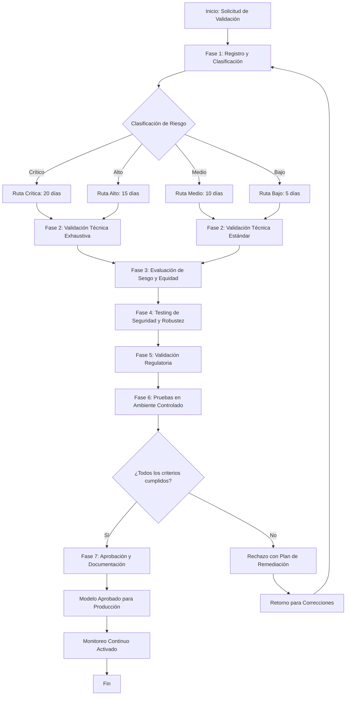

---
tags:
  - gobernanza
  - procedimiento
  - validación
  - modelos
  - riesgo
  - IMPACT
  - ISO-23053
search:
  boost: 2
---

# Procedimiento de Validación de Modelos de Inteligencia Artificial

## Metadatos
- **Código**: PROC-GOV-001
- **Versión**: 1.0
- **Fecha**: 09 de septiembre de 2025
- **Dueño del Proceso**: Centro de Excelencia de IA (CoE IA)
- **Frecuencia**: Por evento (nuevo modelo o actualización)
- **Sistemas Involucrados**: Nova-Cell, Sistema de Gestión de Modelos, AISIA Platform
- **Tiempo Estimado**: 5-20 días hábiles según clasificación de riesgo

## 1. Propósito

Establecer un proceso sistemático y estandarizado para la validación integral de modelos de Inteligencia Artificial que garantice su funcionalidad técnica, cumplimiento ético, adherencia regulatoria y alineación con los principios de IA responsable antes de su implementación en ambientes productivos.

## 2. Alcance

### Inicio
Registro de un nuevo modelo de IA o actualización significativa de modelo existente que requiera validación para despliegue en producción.

### Fin
Modelo aprobado y documentado completamente, listo para implementación productiva, o rechazo formal con justificación y plan de remediación.

### Límites
- **Incluye**: Todos los modelos de ML/AI que procesan datos corporativos, impactan decisiones de negocio o interactúan con clientes
- **Incluye**: Modelos desarrollados internamente, por terceros, o implementados via Nova-Cell
- **Incluye**: Actualizaciones de modelos que cambien lógica, datos de entrenamiento o parámetros críticos
- **Excluye**: Herramientas de productividad personal sin acceso a datos corporativos
- **Excluye**: Sistemas de automatización tradicional sin componentes de aprendizaje automático

## 3. Participantes

| Rol | Responsabilidad | Sistema/Herramienta |
|-----|----------------|-------------------|
| **Data Scientist/Desarrollador** | Registrar modelo, documentar arquitectura, ejecutar pruebas técnicas | Nova-Cell, MLflow, Git |
| **Product Owner** | Definir casos de uso, criterios de aceptación, supervisar implementación | AISIA Platform |
| **Risk Officer IA** | Validar gestión de riesgos, aprobar controles, evaluar impacto regulatorio | Sistema de Gestión de Riesgos |
| **CoE IA** | Coordinar proceso, validar estándares técnicos, asegurar cumplimiento | Nova-Cell, Dashboard IMPACT |
| **Compliance Officer** | Verificar cumplimiento regulatorio, validar documentación legal | Sistema de Compliance |
| **Auditor Interno** | Validar controles independientemente para modelos críticos | Sistema de Auditoría |
| **Comité de IA** | Aprobar modelos de alto/crítico riesgo, resolver excepciones | Portal de Gobernanza |

## 4. Entradas Requeridas
- [ ] **Código fuente del modelo** - Fuente: Repository Git corporativo
- [ ] **Datos de entrenamiento y validación** - Fuente: Data Lake corporativo
- [ ] **Documentación técnica (Model Card)** - De: Data Scientist
- [ ] **Business case y ROI esperado** - De: Product Owner
- [ ] **Evaluación AISIA completada** - De: Product Owner/Risk Officer
- [ ] **Aprobación previa del caso de uso** - De: CoE IA o Comité IA

## 5. Diagrama de Flujo



## 6. Procedimiento Detallado

### Fase 1: Registro y Clasificación del Modelo
**Responsable**: Data Scientist + CoE IA  
**Tiempo estimado**: 1 día hábil

#### Actividades:
1. **Registrar solicitud en Sistema de Gestión de Modelos**
   - Completar formulario de registro con metadatos del modelo
   - Asignar identificador único (MOD-YYYY-NNN)
   - Cargar documentación técnica inicial

2. **Clasificar nivel de riesgo del modelo según matriz corporativa**
   - **Riesgo Crítico**: Decisiones crediticias automatizadas, trading algorítmico, AML crítico
   - **Riesgo Alto**: Scoring crediticio, detección de fraude, KYC automatizado
   - **Riesgo Medio**: Recomendaciones de productos, análisis predictivo operativo
   - **Riesgo Bajo**: Análisis descriptivo, herramientas de productividad

3. **Asignar ruta de validación y equipo revisor**
   - Designar Risk Officer especializado según dominio
   - Programar sesiones de revisión en calendario
   - Notificar a stakeholders del cronograma

**Punto de Control**: ✓ Modelo registrado con clasificación validada por Risk Officer

**Integración Nova-Cell**:
- Prompt sugerido: "Analiza este modelo IA y sugiere su clasificación de riesgo bancario considerando regulación CNBV"
- Agente recomendado: Compliance Agent con contexto regulatorio mexicano

**Criterios de Avance**:
- Documentación técnica mínima completa (>70% campos obligatorios)
- Clasificación de riesgo validada por segunda línea de defensa
- Recursos asignados para ruta correspondiente

---

### Fase 2: Validación Técnica
**Responsable**: Data Scientist + CoE IA  
**Tiempo estimado**: 2-5 días según riesgo

#### 2.1 Arquitectura y Diseño
1. **Validar arquitectura del modelo**
   - Revisar selección de algoritmo y justificación técnica
   - Verificar escalabilidad y performance esperada
   - Evaluar dependencias y requisitos de infraestructura

2. **Analizar calidad de datos de entrenamiento**
   - Verificar representatividad y cobertura temporal (mínimo 24 meses)
   - Evaluar completitud y consistencia de datos
   - Validar procesos de limpieza y preprocesamiento

3. **Revisar métricas de desempeño**
   - Validar métricas de evaluación seleccionadas
   - Verificar performance en datos de validación
   - Confirmar estabilidad a través de validación cruzada

**Punto de Control**: ✓ Arquitectura técnica aprobada con métricas dentro de umbrales definidos

#### 2.2 Reproducibilidad y Versionado
1. **Verificar reproducibilidad completa**
   - Validar que el modelo sea reproducible con semillas fijas
   - Confirmar documentación de hiperparámetros
   - Probar reconstrucción en ambiente limpio

2. **Validar gestión de versiones**
   - Verificar versionado de código, datos y modelos
   - Confirmar trazabilidad completa de cambios
   - Validar tags y releases en repositorio

**Criterios Técnicos Críticos**:
- Accuracy/F1-Score según benchmarks sectoriales
- Latencia <100ms para modelos en tiempo real
- Throughput mínimo según volumetría esperada
- Memory footprint dentro de límites de infraestructura

---

### Fase 3: Evaluación de Sesgo y Equidad
**Responsable**: Risk Officer IA + Data Scientist  
**Tiempo estimado**: 2-4 días según complejidad

> 📋 **Nota:** Este proceso implementa directamente el principio rector de **Equidad y No Discriminación** definido en la [Política de Uso Responsable de IA](politica-uso-responsable-ia.md#4-principios-rectores).

#### 3.1 Análisis de Sesgo Algorítmico
1. **Identificar variables protegidas aplicables**
   - Género, edad, ubicación geográfica, ingresos
   - Características étnicas (donde legalmente aplicable)
   - Estado civil y composición familiar

2. **Ejecutar análisis cuantitativo de sesgo**
   ```python
   # Ejemplo de métricas de equidad requeridas
   fairness_metrics = {
       'demographic_parity': <threshold_0.1>,
       'equal_opportunity': <threshold_0.05>, 
       'calibration': <threshold_0.1>,
       'individual_fairness': <threshold_0.05>
   }
   ```

3. **Documentar hallazgos y mitigaciones**
   - Generar reporte de equidad con evidencia estadística
   - Proponer ajustes al modelo si se detectan sesgos
   - Implementar controles de monitoreo continuo

**Punto de Control**: ✓ Análisis de sesgo completado sin hallazgos críticos

#### 3.2 Validación de Explicabilidad
1. **Implementar métodos de explicabilidad**
   - SHAP values para modelos de ML tradicional
   - LIME para modelos complejos
   - Attention mechanisms para modelos de NLP

2. **Validar explicaciones con expertos de negocio**
   - Confirmar que explicaciones son intuitivas
   - Verificar alineación con conocimiento de dominio
   - Documentar casos límite y excepciones

**Criterios de Explicabilidad**:
- 100% de decisiones explicables bajo demanda
- Tiempo de generación de explicación <5 segundos
- Explicaciones comprensibles para audiencia no técnica

**Integración Nova-Cell**:
- Prompt sugerido: "Genera explicación en lenguaje natural de esta decisión del modelo de scoring crediticio para un cliente bancario"
- Agente recomendado: Explanation Agent con contexto bancario mexicano

---

### Fase 4: Testing de Seguridad y Robustez
**Responsable**: CoE IA + Cybersecurity Team  
**Tiempo estimado**: 3-5 días según criticidad

#### 4.1 Pruebas de Robustez
1. **Adversarial Testing**
   - Generar ejemplos adversariales usando FGSM, PGD
   - Probar resistencia a ataques de evasión
   - Validar comportamiento en bordes del espacio de features

2. **Testing de Distribución**
   - Probar performance con data drift simulado
   - Evaluar degradación bajo distribuciones atípicas
   - Confirmar alertas automáticas por concept drift

3. **Pruebas de Stress**
   - Validar performance bajo alta carga
   - Probar comportamiento con datos faltantes/corruptos
   - Evaluar recuperación ante fallas de infraestructura

**Punto de Control**: ✓ Modelo resiste pruebas adversariales dentro de tolerancias definidas

#### 4.2 Validación de Seguridad
1. **Análisis de superficie de ataque**
   - Identificar puntos de entrada potenciales
   - Evaluar riesgos de inyección de datos
   - Validar controles de acceso y autenticación

2. **Pruebas de privacidad**
   - Confirmar ausencia de membership inference attacks
   - Validar imposibilidad de reconstruir datos de entrenamiento
   - Probar anonimización efectiva en outputs

3. **Validación de model stealing resistance**
   - Probar resistencia a extracción por queries
   - Validar rate limiting efectivo
   - Confirmar obfuscación de respuestas técnicas

**Criterios de Seguridad Críticos**:
- Zero vulnerabilidades críticas o altas
- Resistencia a top 10 ataques OWASP para ML
- Compliance con estándares de seguridad corporativos

---

### Fase 5: Validación Regulatoria
**Responsable**: Compliance Officer + Risk Officer IA  
**Tiempo estimado**: 2-3 días hábiles

#### 5.1 Cumplimiento CNBV/Banxico
1. **Validar documentación regulatoria**
   - Confirmar completitud de documentación técnica
   - Validar evidencias de testing y validación
   - Verificar trazabilidad de decisiones

2. **Revisar controles de riesgo operativo**
   - Confirmar planes de contingencia documentados
   - Validar procedimientos de escalamiento
   - Verificar capacidad de rollback inmediato

3. **Evaluar impacto en clientes**
   - Análizar efectos en experiencia del cliente
   - Validar procesos de apelación disponibles
   - Confirmar transparencia en uso de IA

**Punto de Control**: ✓ Cumplimiento regulatorio confirmado por Compliance Officer

#### 5.2 Validación LFPDPPP
1. **Confirmar protección de datos personales**
   - Verificar consentimiento explícito donde aplicable
   - Validar minimización de datos procesados
   - Confirmar derechos ARCO implementados

2. **Validar transparencia algorítmica**
   - Confirmar avisos de privacidad actualizados
   - Validar derecho de explicación implementado
   - Verificar portabilidad de decisiones automatizadas

**Criterios Regulatorios**:
- 100% cumplimiento con circular CNBV aplicable
- Documentación lista para revisión regulatoria
- Procesos de transparencia completamente implementados

---

### Fase 6: Pruebas en Ambiente Controlado
**Responsable**: Product Owner + Data Scientist  
**Tiempo estimado**: 3-7 días según complejidad

#### 6.1 Implementación en Sandbox
1. **Desplegar en ambiente de pruebas**
   - Configurar infraestructura réplica de producción
   - Implementar modelo con datos históricos
   - Activar monitoreo completo de métricas

2. **Ejecutar casos de prueba de negocio**
   - Validar casos de uso definidos funcionan correctamente
   - Probar escenarios límite y excepcionales
   - Confirmar integración con sistemas existentes

3. **Validar métricas IMPACT en tiempo real**
   - Monitorear Implementation metrics
   - Evaluar Performance vs baseline
   - Medir Acceptance rate de recomendaciones

**Punto de Control**: ✓ Modelo funciona correctamente en ambiente controlado por >72 horas continuas

#### 6.2 Piloto con Usuarios Limitados
1. **Seleccionar cohorte de prueba representativa**
   - Definir criterios de selección sin sesgo
   - Obtener consentimiento explícito de participantes
   - Configurar monitoreo especial del piloto

2. **Ejecutar prueba comparativa A/B**
   - Comparar vs método actual (baseline)
   - Medir métricas de negocio y experiencia
   - Recopilar feedback cualitativo de usuarios

3. **Analizar resultados del piloto**
   - Validar mejoras measurables vs baseline
   - Confirmar ausencia de impactos negativos
   - Documentar lecciones aprendidas

**Criterios de Éxito del Piloto**:
- Performance igual o superior a método actual
- NPS/CSAT igual o superior
- Zero incidentes críticos durante prueba
- Métricas IMPACT dentro de rangos objetivo

---

### Fase 7: Aprobación y Documentación
**Responsable**: CoE IA + Risk Officer IA  
**Tiempo estimado**: 1-2 días hábiles

#### 7.1 Compilación de Evidencias
1. **Generar paquete de aprobación completo**
   - Compilar todos los reportes de validación
   - Incluir evidencias de testing y cumplimiento
   - Preparar resumen ejecutivo para Comité

2. **Validar completitud documental**
   - Confirmar Model Card completa y actualizada
   - Validar documentación técnica exhaustiva
   - Verificar planes de monitoreo y mantenimiento

3. **Preparar documentación de producción**
   - Crear runbooks operacionales
   - Documentar procedimientos de escalamiento
   - Definir métricas y alertas de monitoreo

**Punto de Control**: ✓ Documentación completa y revisada por todas las partes

#### 7.2 Proceso de Aprobación Final
1. **Obtener aprobaciones según matriz de autorización**
   - **Riesgo Bajo/Medio**: CoE IA + Risk Officer
   - **Riesgo Alto**: Comité IA
   - **Riesgo Crítico**: Comité IA + CEO sign-off

2. **Registrar decisión y activar monitoreo**
   - Actualizar estatus en Sistema de Gestión de Modelos
   - Activar dashboards de monitoreo continuo
   - Programar revisiones periódicas obligatorias

3. **Comunicar aprobación a stakeholders**
   - Notificar a equipos de implementación
   - Informar cronograma de despliegue a producción
   - Activar procesos de change management

**Criterios Finales de Aprobación**:
- Todas las fases completadas exitosamente
- Zero hallazgos críticos sin mitigar
- Aprobación formal de autoridades designadas
- Documentación 100% completa y actualizada

**Integración Nova-Cell para Aprobación**:
- Prompt sugerido: "Resume el estatus de validación de este modelo de IA y confirma si cumple todos los criterios para aprobación según estándares bancarios mexicanos"
- Agente recomendado: Validation Summary Agent

---

## 7. Puntos de Control y Validación

| Punto | Qué Validar | Criterio de Aceptación | Acción si Falla |
|-------|------------|----------------------|-----------------|
| **PC1 - Registro** | Documentación inicial completa | >70% campos obligatorios completados | Retornar a solicitante con gaps específicos |
| **PC2 - Técnico** | Performance y arquitectura | Métricas dentro de umbrales definidos | Refinar modelo o reconsiderar algoritmo |
| **PC3 - Sesgo** | Análisis de equidad | Fairness metrics dentro de tolerancia | Implementar mitigaciones de sesgo |
| **PC4 - Seguridad** | Robustez y protección | Zero vulnerabilidades críticas/altas | Fortalecer controles de seguridad |
| **PC5 - Regulatorio** | Cumplimiento normativo | 100% adherencia a regulación aplicable | Ajustar modelo para cumplimiento |
| **PC6 - Piloto** | Funcionamiento real | Métricas IMPACT dentro de rangos | Optimizar o rediseñar implementación |
| **PC7 - Final** | Aprobación completa | Todas las fases exitosas | No aplica - proceso completado |

## 8. Manejo de Excepciones y Rechazos

### 8.1 Tipos de Rechazo

#### Rechazo Técnico:
**Síntomas**: Performance insuficiente, arquitectura inadecuada, datos de baja calidad  
**Acción**: Retorno a desarrollo con recomendaciones específicas de mejora  
**Escalamiento**: CoE IA → Product Owner → Director de Tecnología

#### Rechazo por Sesgo:
**Síntomas**: Métricas de equidad fuera de tolerancia, discriminación detectada  
**Acción**: Implementación obligatoria de técnicas de mitigación de sesgo  
**Escalamiento**: Risk Officer → Chief Risk Officer → Comité de Ética IA

#### Rechazo Regulatorio:
**Síntomas**: Incumplimiento de CNBV/Banxico, violación de LFPDPPP  
**Acción**: Ajustes para cumplimiento con validación legal adicional  
**Escalamiento**: Compliance Officer → Chief Compliance Officer → CEO

#### Rechazo de Seguridad:
**Síntomas**: Vulnerabilidades críticas, riesgos de privacidad  
**Acción**: Fortalecimiento de controles con re-testing completo  
**Escalamiento**: CISO → CRO → Consejo de Administración

### 8.2 Proceso de Excepción

#### Cuándo Aplica:
- Urgencia operativa crítica con justificación de negocio
- Modelo de tercero con limitaciones de acceso a código fuente
- Requerimiento regulatorio emergente con timelines ajustados

#### Aprobación de Excepciones:
1. **Solicitud formal** con justificación detallada y análisis de riesgos
2. **Evaluación por Risk Committee** con definición de controles compensatorios
3. **Aprobación temporal** con timeline específico para regularización (máximo 90 días)
4. **Monitoreo intensivo** con reportes semanales al Comité IA

#### Excepciones NO Permitidas:
- ❌ Modelos con sesgo discriminatorio detectado
- ❌ Sistemas sin supervisión humana en decisiones críticas
- ❌ Modelos que violen protección de datos personales
- ❌ Sistemas sin capacidad de explicación para reguladores

---

## 9. Métricas del Proceso

### 9.1 Métricas Operacionales
- **Tiempo de Ciclo Total**: 15 días objetivo (95% casos dentro de SLA)
- **Tasa de Aprobación Primera Pasada**: >70%
- **SLA por Riesgo**: Crítico 20d, Alto 15d, Medio 10d, Bajo 5d
- **Backlog de Validaciones**: <10 modelos en cola

### 9.2 Métricas de Calidad
- **Tasa de Rechazos por Causa**: <10% técnico, <5% sesgo, <3% regulatorio
- **Incidentes Post-Producción**: <1 por mes por modelos validados
- **Compliance Score**: 100% para auditorías internas/externas

### 9.3 Métricas IMPACT
- **Time to First Value**: <15 minutos para acceso a dashboards
- **Productivity Gain**: 40% reducción en tiempo de validación manual
- **Process Efficiency**: 95% automatización de checks estándar
- **Trust Score**: NPS >30 entre Data Scientists y Product Owners

## 10. Automatización con Nova-Cell

### 10.1 Oportunidades de Automatización Identificadas

#### Análisis Técnico Automatizado:
- [ ] **Code Quality Assessment**: Análisis automático de calidad del código del modelo
- [ ] **Documentation Generation**: Generación automática de secciones estándar de Model Cards
- [ ] **Performance Benchmarking**: Comparación automática contra modelos baseline

#### Detección de Sesgo Automatizada:
- [ ] **Bias Detection Pipeline**: Ejecución automática de análisis de equidad
- [ ] **Fairness Report Generation**: Generación de reportes de equidad estandarizados
- [ ] **Mitigation Strategy Recommendations**: Sugerencias de técnicas de mitigación

#### Validación Regulatoria Asistida:
- [ ] **Compliance Checklist Automation**: Verificación automática de requisitos regulatorios
- [ ] **Documentation Gap Analysis**: Identificación automática de documentación faltante
- [ ] **Risk Assessment Support**: Asistencia en clasificación de riesgos

### 10.2 Prompts Nova-Cell Específicos

#### Para Análisis Técnico:
```
Actúa como un experto en validación de modelos ML en banca mexicana. 
Analiza este modelo de [tipo] considerando:
- Performance vs benchmarks sectoriales
- Robustez para ambiente bancario productivo  
- Cumplimiento con estándares CNBV
- Recomienda optimizaciones específicas

Contexto: [detalles del modelo y caso de uso]
```

#### Para Evaluación de Sesgo:
```
Eres un especialista en equidad algorítmica para el sector financiero mexicano.
Evalúa este modelo por sesgos potenciales:
- Analiza fairness metrics para variables protegidas
- Identifica riesgos de discriminación específicos para banca
- Sugiere técnicas de mitigación aplicables
- Considera regulación mexicana de protección al consumidor

Datos del modelo: [información técnica]
```

#### Para Documentación Regulatoria:
```
Como experto en cumplimiento regulatorio bancario México, 
genera documentación para validación regulatoria:
- Mapea controles vs circular CNBV 4/2020
- Documenta trazabilidad de decisiones
- Explica mecanismos de transparencia
- Justifica proporcionalidad de controles

Modelo: [descripción y riesgo]
```

### 10.3 Integración con Métricas IMPACT

#### Métricas Automatizadas:
- **Implementation**: Tracking automático de adopción del proceso
- **Momentum**: Medición de velocity de validaciones
- **Performance**: Benchmarking de tiempo vs SLAs
- **Acceptance**: Rate de aprobación primera pasada
- **Cost-Effective**: Costo por validación vs método manual
- **Trust**: NPS automático post-validación

#### Dashboard en Tiempo Real:
- Estado de validaciones en proceso
- Bottlenecks identificados automáticamente
- Predicción de tiempo de completación
- Alertas por incumplimiento de SLAs
- Métricas de mejora continua

---

## 11. Cumplimiento Regulatorio

### 11.1 Mapeo Normativo Específico

#### CNBV Circular 4/2020 - Riesgos Tecnológicos:
- **Artículo 15**: Gestión de riesgos en desarrollo tecnológico
- **Artículo 23**: Validación independiente de sistemas críticos
- **Artículo 31**: Documentación y trazabilidad de cambios
- **Anexo 5**: Criterios para evaluación de riesgos operacionales

#### Banxico - Disposiciones Generales:
- **Capítulo III**: Gestión integral de riesgos
- **Sección 2**: Riesgo operacional y tecnológico
- **Artículo 45**: Validación de modelos para decisiones críticas

#### ISO 42001:2023 - AIMS:
- **Cláusula 6.2**: Planificación de objetivos IA
- **Cláusula 8.2**: Controles del sistema IA
- **Anexo A.5**: Controles del ciclo de vida (A.5.1 a A.5.9)
- **Anexo A.9**: Controles de supervisión (A.9.1 a A.9.3)

### 11.2 Evidencias Requeridas para Auditoría

#### Documentación Obligatoria:
1. **Model Inventory**: Registro completo actualizado
2. **Validation Reports**: Por cada fase del proceso
3. **Risk Assessments**: AISIA completada y actualizada
4. **Testing Evidence**: Pruebas técnicas, sesgo, seguridad
5. **Approval Records**: Decisiones documentadas y trazables
6. **Monitoring Logs**: Evidencia de supervisión continua

#### Controles de Auditoría:
- **Control 1**: Existencia de proceso formal documentado
- **Control 2**: Evidencia de ejecución consistente
- **Control 3**: Segregación de funciones validador/desarrollador
- **Control 4**: Trazabilidad completa de decisiones
- **Control 5**: Competencias adecuadas del equipo validador

### 11.3 Preparación para Supervisión Regulatoria

#### Documentación Lista para CNBV:
- Inventario completo de modelos IA en producción
- Evidencias de validación independiente
- Reportes de incidentes y remedios aplicados
- Análisis de impacto en operaciones críticas
- Plan de continuidad ante falla de modelos

#### Capacidad de Respuesta (SLA: 5 días hábiles):
- Acceso inmediato a documentación técnica
- Explicación detallada de cualquier decisión automatizada
- Evidencia de supervisión humana efectiva
- Demostración de controles de sesgo y equidad
- Planes de mejora continua documentados

---

## 12. Formularios y Checklists

### 12.1 Formulario de Solicitud de Validación

#### Información Básica del Modelo:
```yaml
ID_Solicitud: MOD-2025-XXX
Fecha_Solicitud: DD/MM/YYYY
Solicitante: [Nombre y rol]
Product_Owner: [Responsable de negocio]
Area_Negocio: [Crédito/Riesgo/Operaciones/etc]

Descripción_Modelo:
  Nombre: [Nombre descriptivo del modelo]
  Tipo: [ML_Supervisado/No_Supervisado/Deep_Learning/NLP/etc]
  Objetivo_Negocio: [Descripción del problema que resuelve]
  Casos_Uso: [Lista de aplicaciones específicas]

Clasificación_Inicial:
  Nivel_Riesgo: [Crítico/Alto/Medio/Bajo]
  Justificación: [Explicación de la clasificación]
  Impacto_Clientes: [Descripción del impacto directo/indirecto]
  Regulación_Aplicable: [CNBV/Banxico/LFPDPPP/etc]
```

#### Información Técnica:
```yaml
Arquitectura:
  Algoritmo: [Random Forest/Neural Network/etc]
  Framework: [scikit-learn/TensorFlow/PyTorch/etc]
  Lenguaje: [Python/R/Java/etc]
  Dependencias: [Lista de librerías críticas]

Datos:
  Fuentes: [Descripción de origen de datos]
  Volumen_Entrenamiento: [Número de registros]
  Periodo_Datos: [Rango temporal]
  Variables_Entrada: [Lista de features]
  Variable_Objetivo: [Target variable]

Performance:
  Métrica_Principal: [Accuracy/F1/AUC/etc]
  Valor_Validación: [Resultado en test set]
  Benchmark: [Comparación vs método actual]
  Latencia_Requerida: [Tiempo de respuesta]
```

### 12.2 Checklist de Validación por Fases

#### ✅ Checklist Fase 1 - Registro
- [ ] Formulario de solicitud 100% completado
- [ ] Business case con ROI cuantificado
- [ ] Código fuente en repository corporativo
- [ ] Datos identificados y accesibles
- [ ] Product Owner asignado y comprometido
- [ ] Clasificación de riesgo validada por Risk Officer
- [ ] Cronograma acordado con todas las partes
- [ ] Recursos técnicos confirmados

#### ✅ Checklist Fase 2 - Validación Técnica
- [ ] Arquitectura documentada y revisada
- [ ] Performance validada en datos independientes
- [ ] Reproducibilidad confirmada (3 ejecuciones idénticas)
- [ ] Versionado completo (código + datos + modelo)
- [ ] Dependencias documentadas y aprobadas
- [ ] Escalabilidad validada para volumetría esperada
- [ ] Integración con sistemas existentes probada
- [ ] Documentación técnica completada al 95%

#### ✅ Checklist Fase 3 - Sesgo y Equidad
- [ ] Variables protegidas identificadas
- [ ] Métricas de equidad calculadas (demographic parity, equal opportunity)
- [ ] Análisis de disparate impact completado
- [ ] Explicabilidad implementada y probada
- [ ] Revisión por experto en equidad algorítmica
- [ ] Mitigaciones implementadas si aplica
- [ ] Plan de monitoreo de sesgo definido
- [ ] Documentación de equidad completada

#### ✅ Checklist Fase 4 - Seguridad y Robustez
- [ ] Pruebas adversariales ejecutadas sin fallas críticas
- [ ] Resistencia a data drift validada
- [ ] Testing de privacidad completado
- [ ] Análisis de superficie de ataque realizado
- [ ] Controles de acceso implementados
- [ ] Plan de contingencia documentado
- [ ] Recovery procedures probados
- [ ] Monitoreo de seguridad configurado

#### ✅ Checklist Fase 5 - Regulatorio
- [ ] Cumplimiento CNBV/Banxico confirmado
- [ ] LFPDPPP compliance validado
- [ ] Documentación legal revisada y aprobada
- [ ] Procesos de transparencia implementados
- [ ] Derechos del cliente asegurados
- [ ] Escalamiento regulatorio documentado
- [ ] Evidencias preparadas para auditoría
- [ ] Sign-off de Compliance Officer

#### ✅ Checklist Fase 6 - Piloto
- [ ] Ambiente sandbox configurado correctamente
- [ ] Casos de prueba ejecutados exitosamente
- [ ] Métricas IMPACT baseline establecidas
- [ ] Cohorte de prueba seleccionada sin sesgo
- [ ] Consentimiento de participantes obtenido
- [ ] A/B testing ejecutado por mínimo 72 horas
- [ ] Performance igual/superior a método actual
- [ ] Zero incidentes críticos durante piloto

#### ✅ Checklist Fase 7 - Aprobación Final
- [ ] Todas las fases anteriores completadas
- [ ] Documentación consolidada al 100%
- [ ] Model Card completada y revisada
- [ ] Aprobaciones formales obtenidas según matriz
- [ ] Monitoreo continuo configurado
- [ ] Runbooks operacionales creados
- [ ] Plan de mantenimiento definido
- [ ] Go-live plan aprobado por todas las partes

### 12.3 Matriz de Aprobación por Riesgo

| Nivel Riesgo | Aprobadores Requeridos | Documentación Adicional | SLA Total |
|--------------|----------------------|-------------------------|-----------|
| **Crítico** | CoE IA + Risk Officer + Compliance + CEO | + Auditoría externa + Legal opinion | 20 días |
| **Alto** | CoE IA + Risk Officer + Compliance + Comité IA | + Independent validation | 15 días |
| **Medio** | CoE IA + Risk Officer + Product Owner | + Peer review | 10 días |
| **Bajo** | CoE IA + Product Owner | Documentación estándar | 5 días |

### 12.4 Templates de Documentación

#### Template Model Card (Versión Bancaria):
```markdown
# Model Card: [Nombre del Modelo]

## Información General
- **ID**: MOD-YYYY-NNN
- **Versión**: X.Y.Z
- **Fecha**: DD/MM/YYYY
- **Owner**: [Data Scientist responsable]
- **Stakeholder**: [Product Owner]

## Propósito y Casos de Uso
- **Objetivo**: [Descripción del problema de negocio]
- **Casos de Uso**: [Aplicaciones específicas]
- **Fuera de Alcance**: [Usos NO permitidos]

## Métricas de Performance
- **Métrica Principal**: [Accuracy/F1/AUC] = X.XX%
- **Baseline Comparison**: +XX% vs método anterior
- **Validation Method**: [Cross-validation/Hold-out]
- **Test Period**: [Fechas de validación]

## Análisis de Equidad
- **Variables Protegidas**: [Lista]
- **Métricas de Equidad**: 
  - Demographic Parity: X.XX
  - Equal Opportunity: X.XX
  - Calibration: X.XX
- **Mitigaciones**: [Si aplica]

## Datos de Entrenamiento
- **Fuentes**: [Descripción]
- **Período**: [Rango temporal]
- **Volumen**: [# registros]
- **Variables**: [Lista de features]

## Consideraciones Éticas
- **Riesgos Identificados**: [Lista]
- **Mitigaciones**: [Controles implementados]
- **Supervisión Humana**: [Nivel requerido]

## Implementación
- **Infraestructura**: [Requerimientos]
- **Latencia**: [Tiempo de respuesta]
- **Throughput**: [Capacidad]
- **Monitoreo**: [Métricas y alertas]

## Aprobaciones
- **CoE IA**: [Nombre y fecha]
- **Risk Officer**: [Nombre y fecha]
- **Compliance**: [Nombre y fecha]
- **Final Approval**: [Autoridad y fecha]
```

---

## 13. Referencias

### 13.1 Políticas Corporativas
- Política de Uso Responsable de Inteligencia Artificial (versión 1.0)
- Política de Gestión de Riesgos Operacionales
- Política de Protección de Datos Personales
- Código de Ética Corporativo

### 13.2 Regulación Aplicable
- CNBV Circular 4/2020 - Disposiciones sobre gestión de riesgos tecnológicos
- Banxico Circular 2/2019 - Disposiciones para instituciones fintech
- LFPDPPP - Ley Federal de Protección de Datos Personales
- ISO/IEC 42001:2023 - Sistema de Gestión de IA

### 13.3 Marcos de Referencia Técnicos
- NIST AI Risk Management Framework (AI RMF 1.0)
- EU AI Act - Clasificación de sistemas de alto riesgo
- IEEE Standards for AI Systems (IEEE 2857, 2858)
- OECD AI Principles - Responsible AI Guidelines

## 14. Glosario de Términos

- **AISIA (AI System Impact Assessment)**: Evaluación obligatoria del impacto de sistemas de IA antes de implementación
- **Adversarial Testing**: Pruebas de resistencia contra ataques maliciosos diseñados para engañar al modelo
- **Concept Drift**: Cambio en la relación entre variables de entrada y objetivo a lo largo del tiempo
- **Data Drift**: Cambio en la distribución de los datos de entrada comparado con datos de entrenamiento
- **Demographic Parity**: Métrica de equidad que requiere tasas de decisión similares entre grupos demográficos
- **Equal Opportunity**: Métrica de equidad que requiere tasas de verdaderos positivos similares entre grupos
- **Explicabilidad (Explainability)**: Capacidad de proporcionar razones comprensibles para las decisiones del modelo
- **Framework IMPACT**: Sistema de métricas corporativo (Implementation, Momentum, Performance, Acceptance, Cost-Effective, Trust)
- **Model Card**: Documento estandarizado que describe el modelo, su performance, limitaciones y consideraciones éticas
- **Nova-Cell**: Plataforma corporativa para desarrollo aumentado con IA con governance y seguridad integrada
- **Shadow AI**: Uso no autorizado de herramientas de IA externas fuera del marco de governance corporativo

## 15. Historial de Cambios

| Versión | Fecha | Autor | Cambios Realizados |
|---------|-------|-------|-------------------|
| 1.0 | 09/09/2025 | CoE IA | Creación inicial basada en ISO 42001 y regulación mexicana |

---

**Documento controlado - Distribución según matriz de clasificación de información corporativa**

*Este procedimiento entra en vigencia inmediatamente y será revisado trimestralmente o ante cambios regulatorios significativos. Para consultas técnicas contactar al Centro de Excelencia de IA via #ai-governance en Google Chat corporativo.*