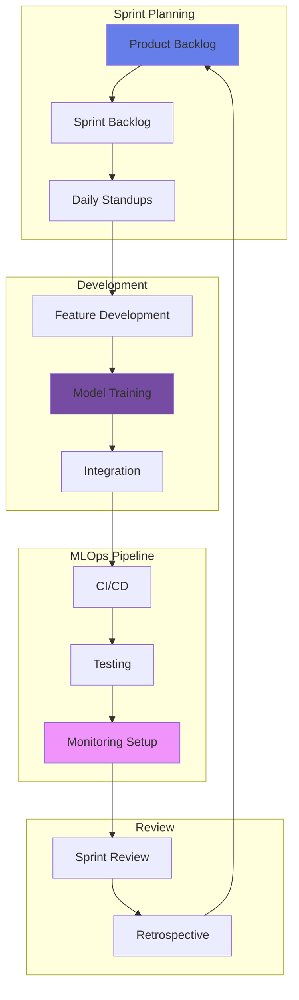
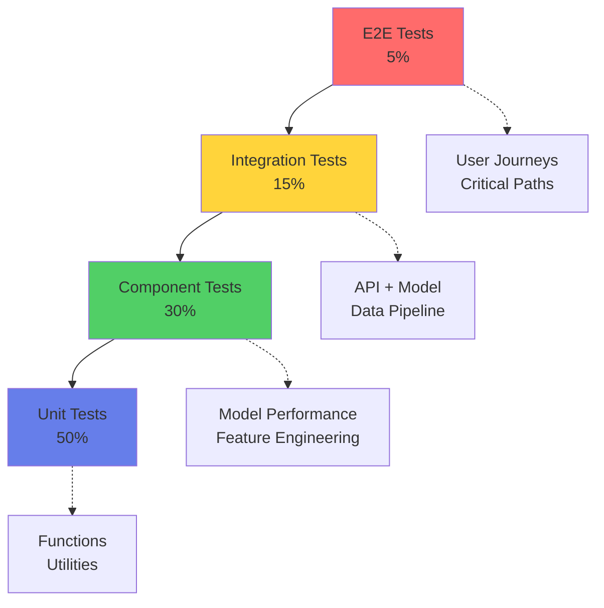
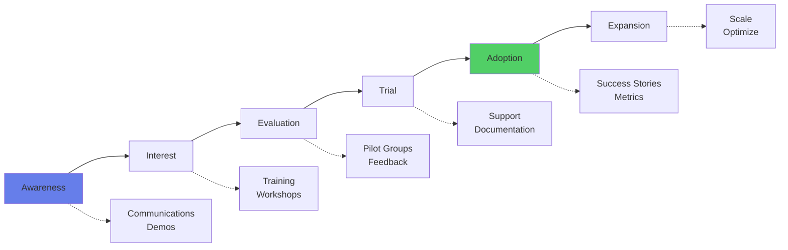

# 🏗️ Etapa 3: Construir

## 🎯 Objetivo de la Etapa

Desarrollar un Minimum Viable Product (MVP) o piloto production-ready basado en los resultados exitosos del experimento, implementando todas las capacidades core, controles de gobernanza y preparación para un despliegue controlado.

### Duración Típica
- **12-16 semanas** para MVP completo
- **8-10 semanas** si usas componentes reutilizables
- **16-20 semanas** para sistemas críticos (Tier 1)

### Entregables Clave
1. 🚀 MVP/Piloto funcional en ambiente pre-producción
2. 📚 Documentación técnica completa
3. 🔒 Evaluación de seguridad aprobada
4. ⚖️ Cumplimiento regulatorio verificado
5. 👥 Plan de adopción y change management
6. 📊 Métricas de performance validadas
7. 🎯 Plan de rollout detallado

## 📥 Inputs desde Etapa Experimentar

### Pre-requisitos Obligatorios
- ✅ **Go Decision** del experimento con métricas cumplidas
- ✅ **Technical Design Document** (TDD) aprobado
- ✅ **Business Case refinado** con ROI confirmado
- ✅ **Risk Assessment** con plan de mitigación
- ✅ **Equipo de desarrollo** asignado y capacitado
- ✅ **Presupuesto para MVP** aprobado
- ✅ **Compliance y Ethics review** completados
- ✅ **Arquitectura target** definida y aprobada

## 🏗️ Metodología de Construcción

### Agile + MLOps Framework



### Sprint Structure (2-week sprints)

| Sprint | Focus Area | Key Deliverables | Review Checkpoint |
|--------|------------|------------------|-------------------|
| **Sprint 0** | Setup & Planning | Dev environment, CI/CD pipeline | Architecture review |
| **Sprint 1-2** | Core Model Development | Base model, feature pipeline | Model performance |
| **Sprint 3-4** | API & Integration | REST/gRPC APIs, authentication | Integration tests |
| **Sprint 5-6** | UI/UX Development | Frontend, user workflows | UX review |
| **Sprint 7-8** | Observability & Monitoring | Logging, metrics, dashboards | SRE review |
| **Sprint 9-10** | Security & Compliance | Security controls, audit logs | Security review |
| **Sprint 11-12** | Performance & Optimization | Load testing, optimization | Performance benchmarks |
| **Sprint 13-14** | Documentation & Training | User docs, training materials | Stakeholder review |
| **Sprint 15-16** | Pre-prod Deployment | Deployment, final testing | Go-live readiness |

## 🎨 Arquitectura de Referencia

### Arquitectura para Modelo ML Tradicional

```python
# Arquitectura de microservicios para ML
architecture = {
    "frontend": {
        "technology": "React/Angular",
        "deployment": "CDN + S3",
        "authentication": "OAuth 2.0 + JWT"
    },
    "api_gateway": {
        "technology": "Kong/Apigee",
        "features": ["rate_limiting", "authentication", "logging"],
        "protocols": ["REST", "GraphQL", "gRPC"]
    },
    "ml_services": {
        "model_serving": {
            "framework": "TensorFlow Serving/TorchServe",
            "deployment": "Kubernetes",
            "scaling": "HPA based on latency"
        },
        "feature_store": {
            "online": "Redis/DynamoDB",
            "offline": "S3/Data Lake",
            "framework": "Feast/Tecton"
        },
        "model_registry": {
            "platform": "MLflow/Kubeflow",
            "versioning": "semantic versioning",
            "metadata": "comprehensive tracking"
        }
    },
    "data_pipeline": {
        "orchestration": "Airflow/Prefect",
        "processing": "Spark/Dask",
        "streaming": "Kafka/Kinesis"
    },
    "observability": {
        "metrics": "Prometheus + Grafana",
        "logging": "ELK Stack",
        "tracing": "Jaeger/Zipkin",
        "ml_monitoring": "Evidently/WhyLabs"
    }
}
```

### Arquitectura para GenAI/LLM

```yaml
genai_architecture:
  llm_layer:
    base_model: "GPT-4/Claude/Llama"
    fine_tuning: "LoRA/QLoRA cuando aplique"
    deployment: "vLLM/TGI for self-hosted"
    
  rag_pipeline:
    document_processing:
      - chunking: "recursive/semantic"
      - embedding: "text-embedding-3/e5-large"
    vector_store:
      technology: "Pinecone/Weaviate/Qdrant"
      index_type: "HNSW/IVF"
      dimensions: 1536
    retrieval:
      strategy: "hybrid (dense + sparse)"
      reranking: "cross-encoder"
      
  prompt_management:
    templating: "Jinja2/Langchain"
    versioning: "git-based"
    testing: "automated prompt testing"
    
  safety_layer:
    input_validation:
      - prompt_injection_detection
      - pii_detection
      - content_moderation
    output_validation:
      - hallucination_detection
      - fact_checking
      - bias_detection
      
  caching:
    semantic_cache: "Redis with embeddings"
    response_cache: "CDN for common queries"
```

## 🔧 Desarrollo por Componentes

### 1. Model Development Pipeline

```python
class ModelDevelopmentPipeline:
    def __init__(self, project_config):
        self.config = project_config
        self.mlflow_tracking = MLflowTracking()
        self.model_registry = ModelRegistry()
        
    def train_model(self, features, labels, params):
        """Pipeline de entrenamiento con tracking completo"""
        with self.mlflow_tracking.start_run() as run:
            # 1. Data validation
            self.validate_data(features, labels)
            
            # 2. Feature engineering
            processed_features = self.feature_pipeline(features)
            
            # 3. Model training
            model = self.train(processed_features, labels, params)
            
            # 4. Model evaluation
            metrics = self.evaluate(model, test_data)
            
            # 5. Fairness & bias checks
            fairness_report = self.check_fairness(model, sensitive_attrs)
            
            # 6. Model registration if passes thresholds
            if self.passes_thresholds(metrics, fairness_report):
                self.model_registry.register(
                    model=model,
                    metrics=metrics,
                    stage="staging"
                )
            
            return model, metrics, fairness_report
```

### 2. API Development Standards

```python
# FastAPI implementation for model serving
from fastapi import FastAPI, HTTPException
from pydantic import BaseModel, Field
import asyncio
from typing import Optional

app = FastAPI(title="AI Model API", version="1.0.0")

class PredictionRequest(BaseModel):
    """Request schema with validation"""
    customer_id: str = Field(..., regex="^[A-Z0-9]{10}$")
    features: dict = Field(..., example={"age": 35, "income": 50000})
    explain: bool = Field(False, description="Return explanation")
    
class PredictionResponse(BaseModel):
    """Response schema with metadata"""
    prediction: float
    confidence: float
    model_version: str
    explanation: Optional[dict] = None
    request_id: str
    timestamp: str

@app.post("/predict", response_model=PredictionResponse)
async def predict(request: PredictionRequest):
    """Main prediction endpoint with comprehensive handling"""
    try:
        # 1. Input validation (automatic via Pydantic)
        
        # 2. Feature extraction
        features = await extract_features(request)
        
        # 3. Model inference
        prediction = await model.predict(features)
        
        # 4. Generate explanation if requested
        explanation = None
        if request.explain:
            explanation = await generate_explanation(features, prediction)
        
        # 5. Audit logging
        await log_prediction(request, prediction)
        
        # 6. Build response
        return PredictionResponse(
            prediction=prediction.value,
            confidence=prediction.confidence,
            model_version=model.version,
            explanation=explanation,
            request_id=generate_request_id(),
            timestamp=datetime.utcnow().isoformat()
        )
        
    except Exception as e:
        await log_error(e, request)
        raise HTTPException(status_code=500, detail="Prediction failed")
```

### 3. Testing Strategy

#### Test Pyramid para AI



#### Test Coverage Requirements

| Component | Coverage Mínimo | Tipos de Tests |
|-----------|----------------|----------------|
| **Modelo ML** | 95% | Unit, Performance, Fairness, Robustness |
| **API Endpoints** | 90% | Unit, Integration, Load, Security |
| **Data Pipeline** | 85% | Unit, Integration, Data Quality |
| **Frontend** | 80% | Unit, Component, E2E |
| **Infrastructure** | 75% | Integration, Chaos Engineering |

### 4. MLOps Implementation

```yaml
# MLOps pipeline configuration
mlops_pipeline:
  continuous_training:
    trigger: "scheduled/drift-detected/manual"
    data_validation:
      - schema_validation
      - distribution_checks
      - data_quality_metrics
    
    model_training:
      - hyperparameter_tuning
      - cross_validation
      - ensemble_methods
    
    model_validation:
      - performance_thresholds
      - fairness_checks
      - robustness_tests
      - regulatory_compliance
    
  continuous_integration:
    code_quality:
      - linting: "pylint/flake8"
      - type_checking: "mypy"
      - security_scan: "bandit/safety"
    
    testing:
      - unit_tests: "pytest"
      - integration_tests: "pytest + docker"
      - model_tests: "custom framework"
    
  continuous_deployment:
    staging:
      - shadow_deployment
      - a_b_testing
      - canary_release
    
    production:
      - blue_green_deployment
      - feature_flags
      - gradual_rollout
    
  continuous_monitoring:
    model_performance:
      - accuracy_tracking
      - drift_detection
      - outlier_detection
    
    business_metrics:
      - conversion_rates
      - customer_satisfaction
      - revenue_impact
    
    system_health:
      - latency_p50_p95_p99
      - error_rates
      - resource_utilization
```

## 🔒 Security & Compliance Implementation

### Security Controls por Tier

| Model Tier | Controles Requeridos | Validación |
|------------|---------------------|------------|
| **Tier 1** | • Encryption at rest/transit<br>• MFA for access<br>• RBAC with least privilege<br>• Audit logging<br>• Penetration testing<br>• Code signing<br>• Data Loss Prevention (DLP)<br>• Threat modeling | CISO approval |
| **Tier 2** | • Encryption at rest/transit<br>• MFA for access<br>• RBAC<br>• Audit logging<br>• Network segmentation<br>• WAF/DDoS protection<br>• Vulnerability scanning<br>• DLP for sensitive data | Security team review |
| **Tier 3** | • Basic encryption<br>• Access control<br>• Standard logging | Security checklist |
| **Tier 4** | • Minimal controls<br>• Basic authentication | Self-assessment |

### Compliance Checklist

```python
compliance_requirements = {
    "data_privacy": {
        "LFPDPPP": [
            "consent_management",
            "data_minimization",
            "purpose_limitation",
            "retention_policies"
        ],
        "GDPR_if_applicable": [
            "right_to_explanation",
            "data_portability",
            "privacy_by_design"
        ]
    },
    "financial_regulation": {
        "CNBV": [
            "model_documentation",
            "audit_trail",
            "risk_assessment",
            "periodic_validation"
        ],
        "Banxico": [
            "transaction_monitoring",
            "reporting_requirements",
            "data_retention"
        ]
    },
    "internal_policies": {
        "model_governance": [
            "model_inventory_registration",
            "challenger_model_requirement",
            "performance_monitoring",
            "annual_review"
        ]
    }
}
```

## 📊 Observability & Monitoring

### Comprehensive Monitoring Stack

```python
class MLMonitoring:
    def __init__(self):
        self.metrics_client = PrometheusClient()
        self.logging_client = ElasticsearchClient()
        self.ml_monitor = EvidentlyClient()
        
    def setup_monitors(self, model_name, tier):
        """Configura monitores según tier del modelo"""
        
        # Business KPIs
        self.setup_business_metrics(model_name)
        
        # Technical metrics
        self.setup_technical_metrics(model_name, tier)
        
        # ML-specific metrics
        self.setup_ml_metrics(model_name)
        
        # Alerts configuration
        self.setup_alerts(model_name, tier)
    
    def setup_ml_metrics(self, model_name):
        """Métricas específicas de ML"""
        return {
            "prediction_drift": {
                "method": "KS_test",
                "threshold": 0.1,
                "window": "1_hour"
            },
            "feature_drift": {
                "method": "wasserstein_distance",
                "threshold": 0.05,
                "window": "1_day"
            },
            "performance_decay": {
                "baseline": "production_metrics",
                "threshold": "5%_degradation",
                "window": "1_week"
            },
            "data_quality": {
                "missing_values": "<1%",
                "outliers": "<5%",
                "schema_violations": "0"
            }
        }
```

### Dashboard Requirements

| Dashboard | Métricas | Frecuencia | Audiencia |
|-----------|----------|------------|-----------|
| **Executive** | ROI, Adoption, Business Impact | Daily | C-Level |
| **Operational** | Latency, Errors, Throughput | Real-time | DevOps |
| **ML Performance** | Accuracy, Drift, Fairness | Hourly | Data Scientists |
| **Compliance** | Audit logs, Decisions, Explanations | Daily | Risk/Compliance |

## 👥 Change Management & Adoption

### Estrategia de Adopción



### Training Plan

| Audiencia | Contenido | Formato | Duración |
|-----------|-----------|---------|----------|
| **End Users** | Cómo usar el sistema | Hands-on workshop | 2 horas |
| **Business Owners** | Interpretar resultados | Webinar + Q&A | 1 hora |
| **Technical Team** | Mantenimiento y troubleshooting | Deep-dive técnico | 4 horas |
| **Compliance** | Controles y auditoría | Documentación + sesión | 2 horas |

## ✅ Definition of Done

### MVP Release Criteria

#### Funcionalidad
- [ ] Todas las user stories del MVP completadas
- [ ] Funcionalidad core probada con usuarios reales
- [ ] Performance cumple SLAs definidos
- [ ] Integración con sistemas existentes validada

#### Calidad
- [ ] Code coverage >85%
- [ ] 0 bugs críticos, <5 bugs altos
- [ ] Security scan sin vulnerabilidades críticas
- [ ] Performance tests pasados (latencia, throughput)

#### Documentación
- [ ] Documentación técnica completa
- [ ] Manual de usuario disponible
- [ ] Runbooks para operaciones
- [ ] Arquitectura documentada

#### Compliance
- [ ] AISIA score actualizado y aprobado
- [ ] Revisión de seguridad completada
- [ ] Compliance check aprobado
- [ ] Ética AI review completado

#### Operaciones
- [ ] Monitoring configurado y probado
- [ ] Alertas definidas y testeadas
- [ ] Backup y recovery probados
- [ ] Rollback plan documentado

## 🚀 Pre-Production Readiness

### Readiness Checklist

```yaml
production_readiness:
  infrastructure:
    - [ ] Ambientes (dev/staging/prod) configurados
    - [ ] Auto-scaling configurado y probado
    - [ ] DR plan documentado y probado
    - [ ] Certificados SSL/TLS instalados
  
  security:
    - [ ] Penetration testing completado
    - [ ] Secrets management implementado
    - [ ] Network policies configuradas
    - [ ] WAF rules configuradas
  
  operations:
    - [ ] SRE team onboarded
    - [ ] On-call rotation establecida
    - [ ] Incident response plan
    - [ ] Change management process
  
  business:
    - [ ] Go-live plan aprobado
    - [ ] Comunicación a stakeholders
    - [ ] Success metrics definidas
    - [ ] Rollback criteria clara
```

### Pilot Execution Plan

| Fase | Duración | Scope | Success Criteria |
|------|----------|-------|------------------|
| **Alpha** | 2 semanas | Team interno (10 users) | Funcionalidad validada |
| **Beta Cerrada** | 4 semanas | Early adopters (50 users) | Bugs <10, NPS >30 |
| **Beta Abierta** | 4 semanas | Volunteer users (200) | Estabilidad, performance |
| **Controlled Rollout** | 2 semanas | 10% usuarios target | Métricas de negocio |

## 📋 Risk Management

### Risk Matrix para Construcción

| Riesgo | Probabilidad | Impacto | Mitigación |
|--------|--------------|---------|------------|
| **Scope creep** | Alta | Alto | Strict change control, MVP focus |
| **Technical debt** | Media | Alto | Refactoring sprints, code reviews |
| **Talent shortage** | Media | Alto | Training plan, external consultants |
| **Integration issues** | Alta | Medio | Early integration testing |
| **Compliance delays** | Baja | Alto | Early engagement, checkpoints |
| **Performance issues** | Media | Medio | Load testing, optimization sprints |

## 🔄 Transición a Validar

### Criterios de Salida

- [ ] MVP completamente funcional en pre-producción
- [ ] Todas las pruebas pasadas (funcional, performance, seguridad)
- [ ] Documentación completa y actualizada
- [ ] Equipo de soporte entrenado
- [ ] Plan de piloto aprobado
- [ ] Métricas de baseline establecidas
- [ ] Stakeholders alineados para validación
- [ ] Presupuesto para piloto asegurado

### Entregables para Siguiente Etapa

1. **MVP desplegado** en ambiente de pre-producción
2. **Pilot Execution Plan** detallado
3. **Monitoring Dashboard** configurado
4. **Training Materials** para usuarios
5. **Support Procedures** documentados
6. **Success Metrics** framework
7. **Risk Register** actualizado

---

**Duración estimada**: 12-16 semanas  
**Inversión típica**: $2-5M MXN  
**Tasa de éxito**: 75% si se sigue la metodología  
**Soporte CoE**: Technical guidance + Architecture review