# 🚀 Etapa 5: Desplegar

## 🎯 Objetivo de la Etapa

Ejecutar el despliegue completo del sistema AI validado a producción, asegurando una transición suave, adopción exitosa y operación estable mientras se mantiene el cumplimiento regulatorio y se minimizan los riesgos operacionales.

### Duración Típica
- **4-6 semanas** para despliegue estándar
- **2-3 semanas** para sistemas simples (Tier 3-4)
- **6-8 semanas** para sistemas críticos con rollout gradual

### Entregables Clave
1. 🌐 Sistema en producción operando establemente
2. 📊 Dashboard de monitoreo activo
3. 👥 Usuarios adoptando la solución
4. 📚 Documentación de producción completa
5. 🔧 Equipo de soporte operacional
6. ✅ Métricas de producción validadas
7. 📈 Plan de optimización continua

## 📥 Inputs desde Etapa Validar

### Pre-requisitos del Despliegue
- ✅ **Go Decision** del piloto con todas las aprobaciones
- ✅ **Sistema validado** con métricas cumplidas
- ✅ **Plan de despliegue** detallado y aprobado
- ✅ **Equipo de soporte** entrenado y listo
- ✅ **Monitoring configurado** y probado
- ✅ **Rollback plan** documentado y ensayado
- ✅ **Comunicaciones** preparadas para stakeholders
- ✅ **CNBV notificación** (para Tier 1-2)

## 🎯 Estrategia de Despliegue

### Deployment Patterns por Tier

```mermaid
graph TB
    A[Modelo Tier] --> B{Tier Level}
    
    B -->|Tier 1| C[Canary Deployment<br/>1% → 5% → 25% → 50% → 100%]
    B -->|Tier 2| D[Blue-Green<br/>con shadow mode]
    B -->|Tier 3| E[Rolling Update<br/>25% incrementos]
    B -->|Tier 4| F[Direct Deployment<br/>100% inmediato]
    
    C --> G[6-8 semanas]
    D --> H[4-6 semanas]
    E --> I[2-3 semanas]
    F --> J[1 semana]
    
    style A fill:#667eea
    style C fill:#ff6b6b
    style D fill:#ffd43b
    style E fill:#51cf66
    style F fill:#4ecdc4
```



### Deployment Strategy Matrix

| Tier | Pattern | Rollout Schedule | Rollback Time | Monitoring |
|------|---------|------------------|---------------|------------|
| **Tier 1** | Canary | Week 1: 1%<br>Week 2: 5%<br>Week 3: 25%<br>Week 4: 50%<br>Week 5-6: 100% | <5 min | Real-time + Alerting |
| **Tier 2** | Blue-Green | Week 1: Shadow<br>Week 2: 10%<br>Week 3: 50%<br>Week 4: 100% | <10 min | Enhanced monitoring |
| **Tier 3** | Rolling | Day 1: 25%<br>Day 3: 50%<br>Day 5: 75%<br>Day 7: 100% | <30 min | Standard monitoring |
| **Tier 4** | Direct | Day 1: 100% | <1 hour | Basic monitoring |

## 🔄 Deployment Pipeline

### CI/CD Pipeline para Producción

```yaml
production_pipeline:
  pre_deployment:
    - regulatory_approval_check:
        cnbv_clearance: required_for_tier_1_2
        internal_approvals: [Risk, Compliance, Security]
    
    - final_validation:
        security_scan: "Critical: 0, High: 0"
        performance_test: "Meets all SLAs"
        integration_test: "100% pass"
        compliance_check: "All controls verified"
    
    - deployment_readiness:
        infrastructure: "Scaled and ready"
        monitoring: "Dashboards active"
        support_team: "On standby"
        rollback_plan: "Tested and ready"
  
  deployment:
    tier_1_2_deployment:
      - create_deployment_ticket
      - notify_stakeholders
      - enable_enhanced_monitoring
      - deploy_to_canary_group
      - monitor_metrics_realtime
      - gradual_traffic_shift
      - validate_each_stage
      
    tier_3_4_deployment:
      - standard_deployment_process
      - monitor_key_metrics
      - user_notification
      - support_activation
  
  post_deployment:
    - health_checks:
        interval: "Every 5 minutes"
        duration: "First 48 hours"
    
    - performance_validation:
        latency_check: "P95 < target"
        error_rate: "< 0.1%"
        throughput: "> expected"
    
    - business_metrics:
        user_adoption: "Track hourly"
        transaction_success: "Monitor continuously"
        roi_indicators: "Daily calculation"
```

### Infrastructure Deployment

```python
class ProductionDeployment:
    def __init__(self, model_tier, deployment_config):
        self.tier = model_tier
        self.config = deployment_config
        self.monitoring = MonitoringSystem()
        self.rollback_manager = RollbackManager()
        
    def execute_deployment(self):
        """Orchestrates production deployment by tier"""
        
        # Pre-deployment checks
        if not self.pre_deployment_validation():
            return {"status": "ABORTED", "reason": "Pre-deployment validation failed"}
        
        # Select deployment strategy
        if self.tier == 1:
            return self.canary_deployment()
        elif self.tier == 2:
            return self.blue_green_deployment()
        elif self.tier == 3:
            return self.rolling_deployment()
        else:
            return self.direct_deployment()
    
    def canary_deployment(self):
        """Gradual rollout for critical systems"""
        stages = [
            {"percentage": 1, "duration_days": 7, "success_criteria": "strict"},
            {"percentage": 5, "duration_days": 7, "success_criteria": "strict"},
            {"percentage": 25, "duration_days": 7, "success_criteria": "standard"},
            {"percentage": 50, "duration_days": 7, "success_criteria": "standard"},
            {"percentage": 100, "duration_days": None, "success_criteria": "standard"}
        ]
        
        for stage in stages:
            # Deploy to percentage of users
            self.deploy_to_percentage(stage["percentage"])
            
            # Monitor intensively
            metrics = self.monitoring.collect_metrics(
                duration=stage["duration_days"],
                granularity="minute"
            )
            
            # Validate against criteria
            if not self.validate_metrics(metrics, stage["success_criteria"]):
                self.rollback_manager.execute_rollback()
                return {"status": "ROLLED_BACK", "stage": stage["percentage"]}
            
            # Proceed to next stage
            self.log_stage_success(stage)
        
        return {"status": "SUCCESS", "deployment": "complete"}
```

## 📊 Production Monitoring

### Multi-Layer Monitoring Architecture


### Production Metrics Framework

```python
production_metrics = {
    "sla_metrics": {
        "availability": {
            "target": "99.95%",
            "measurement": "uptime / total_time",
            "alert_threshold": "99.9%",
            "escalation": "immediate"
        },
        "latency_p95": {
            "target": "<2s",
            "measurement": "95th percentile response time",
            "alert_threshold": "3s",
            "escalation": "5 minutes"
        },
        "error_rate": {
            "target": "<0.1%",
            "measurement": "errors / total_requests",
            "alert_threshold": "0.5%",
            "escalation": "immediate"
        }
    },
    
    "model_health": {
        "prediction_drift": {
            "method": "PSI",
            "threshold": 0.2,
            "check_frequency": "hourly",
            "action": "investigate"
        },
        "feature_drift": {
            "method": "KS test",
            "threshold": 0.1,
            "check_frequency": "daily",
            "action": "retrain_evaluation"
        },
        "performance_decay": {
            "baseline": "validation_metrics",
            "threshold": "5% degradation",
            "check_frequency": "daily",
            "action": "model_refresh"
        }
    },
    
    "business_impact": {
        "transaction_volume": {
            "tracking": "real-time",
            "comparison": "vs_baseline",
            "alert": ">20% deviation"
        },
        "conversion_rate": {
            "tracking": "hourly",
            "comparison": "vs_control",
            "alert": "<5% improvement"
        },
        "cost_per_transaction": {
            "tracking": "daily",
            "target": "<$X",
            "alert": ">10% increase"
        }
    },
    
    "regulatory_compliance": {
        "decision_logging": {
            "requirement": "100% logged",
            "retention": "7 years",
            "audit": "monthly"
        },
        "explainability": {
            "requirement": "100% explainable",
            "validation": "weekly sample",
            "audit": "quarterly"
        },
        "fairness_metrics": {
            "monitoring": "continuous",
            "thresholds": "per CNBV guidelines",
            "reporting": "monthly"
        }
    }
}
```

### Alert Configuration

| Alert Level | Response Time | Escalation | Example Triggers |
|-------------|--------------|------------|------------------|
| **P0 - Critical** | <5 min | VP + CTO | System down, data breach, >10% errors |
| **P1 - High** | <30 min | Manager + Lead | SLA breach, model failure, security alert |
| **P2 - Medium** | <2 hours | Team Lead | Performance degradation, drift detected |
| **P3 - Low** | <24 hours | On-call engineer | Minor bugs, optimization opportunities |

## 👥 Change Management & Adoption

### User Adoption Strategy

```python
class AdoptionManager:
    def __init__(self, user_segments):
        self.segments = user_segments
        self.training_tracker = TrainingTracker()
        self.feedback_system = FeedbackSystem()
        
    def execute_adoption_plan(self):
        """Manages user adoption during deployment"""
        
        adoption_phases = {
            "awareness": {
                "duration": "2 weeks before",
                "activities": [
                    "email_announcements",
                    "team_meetings",
                    "demo_sessions"
                ],
                "success_metric": "90% awareness"
            },
            "training": {
                "duration": "1 week before",
                "activities": [
                    "hands_on_workshops",
                    "video_tutorials",
                    "documentation_review",
                    "Q&A_sessions"
                ],
                "success_metric": "80% trained"
            },
            "assisted_usage": {
                "duration": "First 2 weeks",
                "activities": [
                    "floor_walkers",
                    "help_desk_priority",
                    "daily_office_hours",
                    "slack_support"
                ],
                "success_metric": "70% active users"
            },
            "independent_usage": {
                "duration": "Weeks 3-4",
                "activities": [
                    "reduced_support",
                    "peer_champions",
                    "best_practices_sharing"
                ],
                "success_metric": "85% proficient"
            },
            "optimization": {
                "duration": "Month 2+",
                "activities": [
                    "advanced_features",
                    "workflow_optimization",
                    "feedback_incorporation"
                ],
                "success_metric": "90% satisfaction"
            }
        }
        
        return adoption_phases
```

### Communication Plan

| Stakeholder | Message | Channel | Frequency | Owner |
|-------------|---------|---------|-----------|-------|
| **Executive Leadership** | ROI impact, strategic value | Executive dashboard | Weekly | Product Owner |
| **Department Heads** | Operational improvements | Email + Meetings | Bi-weekly | Program Manager |
| **End Users** | How-to, benefits, support | Teams, Email, Portal | Daily → Weekly | Change Manager |
| **IT Operations** | Technical status, issues | Slack, Dashboards | Real-time | Tech Lead |
| **Risk & Compliance** | Audit results, metrics | Reports, Meetings | Weekly | Compliance Lead |
| **External Regulators** | Compliance status | Formal reports | Monthly/Quarterly | Legal |

## 🔧 Operational Handover

### Support Model

```yaml
support_structure:
  tier_1_support:
    scope: "Basic queries, password resets, navigation"
    response_time: "<1 hour"
    availability: "24x7 for Tier 1-2 systems"
    escalation: "If unresolved in 2 hours"
  
  tier_2_support:
    scope: "Feature issues, integration problems"
    response_time: "<4 hours"
    availability: "Business hours + on-call"
    escalation: "If model-related or critical"
  
  tier_3_support:
    scope: "Model issues, performance problems"
    response_time: "<8 hours"
    availability: "Business hours"
    escalation: "To development team"
  
  development_team:
    scope: "Bug fixes, model updates"
    response_time: "Per SLA"
    availability: "On-call for P0/P1"
```

### Runbook Structure

```markdown
# Production Runbook - [System Name]

## System Overview
- Architecture diagram
- Component descriptions
- Data flow
- Dependencies

## Common Operations
### Daily Tasks
1. Health check procedure
2. Metric validation
3. Report generation

### Model Retraining
1. Trigger conditions
2. Retraining process
3. Validation steps
4. Deployment procedure

## Troubleshooting Guide
### Issue: High Latency
- Symptoms: Response time >3s
- Diagnosis: Check [specific metrics]
- Resolution: [Step-by-step fix]

### Issue: Model Drift
- Symptoms: PSI >0.2
- Diagnosis: Analyze feature distributions
- Resolution: Trigger retraining pipeline

## Emergency Procedures
### Rollback Process
1. Identify rollback trigger
2. Execute rollback command
3. Validate system state
4. Notify stakeholders

### Disaster Recovery
1. Assess impact
2. Activate DR site
3. Restore from backup
4. Validate data integrity
```

## 🔄 Continuous Improvement

### Post-Deployment Optimization

```python
class ContinuousImprovement:
    def __init__(self, deployment_metrics):
        self.metrics = deployment_metrics
        self.optimization_tracker = OptimizationTracker()
        
    def identify_improvements(self):
        """Identifies optimization opportunities post-deployment"""
        
        improvement_areas = {
            "performance": self.analyze_performance_bottlenecks(),
            "cost": self.identify_cost_savings(),
            "accuracy": self.find_model_improvements(),
            "user_experience": self.analyze_ux_friction(),
            "automation": self.discover_automation_opportunities()
        }
        
        prioritized_improvements = self.prioritize_by_roi(improvement_areas)
        
        return {
            "quick_wins": prioritized_improvements[:3],
            "medium_term": prioritized_improvements[3:7],
            "strategic": prioritized_improvements[7:]
        }
    
    def implement_feedback_loop(self):
        """Creates continuous feedback mechanism"""
        return {
            "user_feedback": {
                "collection": "In-app surveys, interviews",
                "frequency": "Weekly pulse, monthly deep-dive",
                "action": "Prioritized backlog"
            },
            "model_feedback": {
                "collection": "Performance metrics, drift detection",
                "frequency": "Daily automated, weekly review",
                "action": "Retraining triggers"
            },
            "business_feedback": {
                "collection": "KPI tracking, ROI measurement",
                "frequency": "Weekly dashboard, monthly review",
                "action": "Strategic adjustments"
            }
        }
```

### Success Metrics Tracking

| Metric Category | Week 1 | Week 2 | Week 4 | Month 2 | Month 3 |
|-----------------|--------|--------|--------|---------|---------|
| **Adoption Rate** | >30% | >50% | >70% | >85% | >90% |
| **User Satisfaction** | >3/5 | >3.5/5 | >4/5 | >4.2/5 | >4.5/5 |
| **System Stability** | >99% | >99.5% | >99.9% | >99.95% | >99.95% |
| **ROI Realization** | 10% | 25% | 50% | 75% | 100% |
| **Support Tickets** | <50/day | <30/day | <20/day | <10/day | <5/day |

## ⚠️ Risk Management

### Production Risk Matrix

```python
production_risks = {
    "technical_risks": {
        "scalability_issues": {
            "trigger": "Load >80% capacity",
            "mitigation": "Auto-scaling + capacity planning",
            "owner": "Infrastructure team"
        },
        "integration_failures": {
            "trigger": "API errors >1%",
            "mitigation": "Circuit breakers + fallbacks",
            "owner": "Integration team"
        },
        "model_degradation": {
            "trigger": "Performance drop >5%",
            "mitigation": "Automated retraining pipeline",
            "owner": "ML team"
        }
    },
    "operational_risks": {
        "knowledge_gap": {
            "trigger": "Support escalations >20%",
            "mitigation": "Additional training sessions",
            "owner": "Training team"
        },
        "process_misalignment": {
            "trigger": "User complaints >10/day",
            "mitigation": "Process refinement workshops",
            "owner": "Process team"
        }
    },
    "compliance_risks": {
        "regulatory_changes": {
            "trigger": "New CNBV circular",
            "mitigation": "Compliance review + updates",
            "owner": "Legal/Compliance"
        },
        "audit_findings": {
            "trigger": "Any critical finding",
            "mitigation": "Immediate remediation plan",
            "owner": "Risk management"
        }
    }
}
```

## ✅ Deployment Success Criteria

### Go-Live Checklist

- [ ] **All systems operational** in production
- [ ] **Monitoring active** with alerts configured
- [ ] **Performance meeting SLAs** consistently
- [ ] **Users trained** and actively using system
- [ ] **Support team operational** and responding
- [ ] **Rollback tested** and ready if needed
- [ ] **Documentation complete** and accessible
- [ ] **Compliance verified** by legal/risk
- [ ] **Business metrics positive** trend visible
- [ ] **No P0/P1 issues** in last 48 hours

### Week 1 Review Gates

| Day | Checkpoint | Success Criteria | Action if Failed |
|-----|------------|------------------|------------------|
| **Day 1** | System stability | Zero P0 issues | Immediate rollback |
| **Day 2** | User adoption | >20% active users | Enhanced support |
| **Day 3** | Performance | All SLAs met | Performance tuning |
| **Day 5** | Business impact | Positive indicators | Review and adjust |
| **Day 7** | Overall health | All metrics green | Continue to scale |

## 🚀 Transition to Scale

### Scaling Readiness Assessment

```yaml
scaling_criteria:
  technical_readiness:
    - [ ] System stability >99.9% for 30 days
    - [ ] Performance headroom >50%
    - [ ] Zero critical bugs for 14 days
    - [ ] Automated operations proven
  
  business_readiness:
    - [ ] ROI targets achieved
    - [ ] User satisfaction >4/5
    - [ ] Adoption rate >85%
    - [ ] Process integration complete
  
  organizational_readiness:
    - [ ] Support model mature
    - [ ] Knowledge transfer complete
    - [ ] Change management successful
    - [ ] Stakeholder satisfaction high
```

### Handover to BAU

1. **Operational Documentation** transferred
2. **Support processes** fully operational
3. **Monitoring and alerting** stable
4. **Enhancement backlog** prioritized
5. **Governance structure** in place
6. **Success metrics** institutionalized

---

**Duración estimada**: 4-6 semanas  
**Inversión típica**: $1-2M MXN  
**Tasa de éxito**: 90% con preparación adecuada  
**Soporte CoE**: 24x7 durante primera semana, luego on-demand