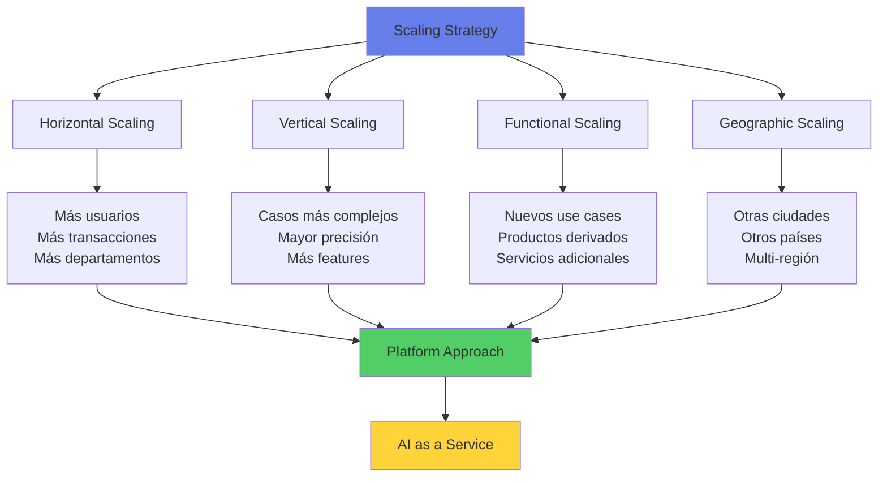
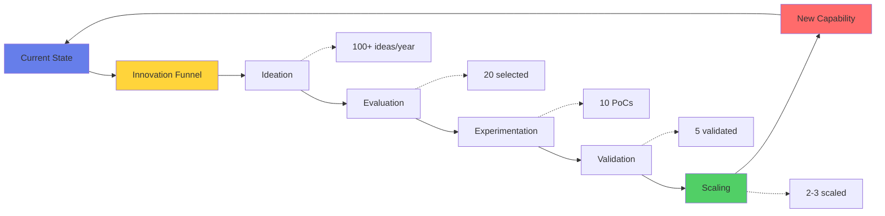

# 📈 Etapa 6: Escalar

## 🎯 Objetivo de la Etapa

Expandir el sistema AI probado y operacional a nuevas geografías, departamentos, casos de uso o volúmenes, maximizando el valor de la inversión inicial mientras se mantiene la estabilidad, performance y cumplimiento regulatorio.

### Duración Típica
- **3-6 meses** para expansión departamental
- **6-12 meses** para rollout nacional
- **12-18 meses** para expansión internacional

### Entregables Clave
1. 🌍 Sistema escalado a nuevos dominios
2. 📊 Plataforma reutilizable establecida
3. 🔄 Procesos de MLOps maduros
4. 📈 ROI multiplicado
5. 🎯 Nuevos casos de uso implementados
6. 🏆 Centro de excelencia consolidado
7. 📚 Best practices documentadas

## 📥 Inputs desde Etapa Desplegar

### Pre-requisitos para Escalar
- ✅ **Sistema estable** en producción >3 meses
- ✅ **ROI demostrado** y medido
- ✅ **Adopción exitosa** >85%
- ✅ **Procesos maduros** de soporte y operación
- ✅ **Lecciones aprendidas** documentadas
- ✅ **Capacidad técnica** disponible
- ✅ **Presupuesto aprobado** para expansión
- ✅ **Sponsor ejecutivo** comprometido

## 🎯 Estrategias de Escalamiento

### Dimensiones de Scaling



### Scaling Patterns

| Pattern | Cuándo Usar | Complejidad | Inversión | ROI Potencial |
|---------|-------------|-------------|-----------|---------------|
| **Replication** | Mismo caso, nuevos usuarios | Baja | Mínima | 3-5x |
| **Adaptation** | Caso similar, nuevo contexto | Media | Moderada | 2-4x |
| **Evolution** | Caso mejorado, más features | Media-Alta | Significativa | 4-6x |
| **Innovation** | Nuevos casos basados en learnings | Alta | Alta | 5-10x |
| **Platform** | AI como servicio interno | Muy Alta | Muy Alta | 10-20x |

## 🏗️ Arquitectura para Scale

### Platform Engineering Approach

```python
class AIScalingPlatform:
    """Platform para escalar soluciones AI across the enterprise"""
    
    def __init__(self):
        self.components = {
            "core_platform": {
                "ml_infrastructure": {
                    "compute": "Kubernetes + GPU clusters",
                    "storage": "Data Lake + Feature Store",
                    "networking": "Service Mesh + API Gateway",
                    "orchestration": "Airflow + Kubeflow"
                },
                "shared_services": {
                    "model_registry": "Centralized model catalog",
                    "feature_store": "Reusable features",
                    "data_catalog": "Enterprise data discovery",
                    "monitoring": "Unified observability"
                },
                "governance": {
                    "compliance_engine": "Automated compliance checks",
                    "audit_trail": "Comprehensive logging",
                    "access_control": "RBAC + policies",
                    "cost_management": "Usage tracking + chargeback"
                }
            },
            "domain_accelerators": {
                "credit_risk": {
                    "base_models": ["scoring", "pd", "lgd"],
                    "features": ["bureau", "behavioral", "alternative"],
                    "pipelines": ["training", "validation", "deployment"]
                },
                "fraud_detection": {
                    "base_models": ["transaction", "account", "network"],
                    "features": ["velocity", "patterns", "anomalies"],
                    "pipelines": ["real-time", "batch", "investigation"]
                },
                "customer_intelligence": {
                    "base_models": ["segmentation", "propensity", "ltv"],
                    "features": ["demographics", "transactions", "interactions"],
                    "pipelines": ["personalization", "campaigns", "retention"]
                }
            },
            "self_service_tools": {
                "automl": "No-code model building",
                "experiment_tracking": "MLflow-based experimentation",
                "deployment_wizard": "Guided deployment process",
                "monitoring_dashboard": "Custom metrics and alerts"
            }
        }
    
    def scale_solution(self, original_solution, scaling_params):
        """Scales an existing solution to new domains"""
        
        scaling_strategy = self.determine_strategy(
            original_solution,
            scaling_params
        )
        
        if scaling_strategy == "replication":
            return self.replicate_solution(original_solution, scaling_params)
        elif scaling_strategy == "adaptation":
            return self.adapt_solution(original_solution, scaling_params)
        elif scaling_strategy == "platform":
            return self.platformize_solution(original_solution)
    
    def platformize_solution(self, solution):
        """Converts a solution into a platform service"""
        
        return {
            "api_layer": self.create_api_wrapper(solution),
            "multi_tenancy": self.implement_multi_tenancy(solution),
            "customization": self.add_configuration_layer(solution),
            "monitoring": self.integrate_platform_monitoring(solution),
            "billing": self.implement_usage_tracking(solution)
        }
```

### Multi-Tenant Architecture

```yaml
multi_tenant_design:
  isolation_levels:
    tier_1_systems:
      data: "Physical separation"
      compute: "Dedicated clusters"
      network: "VPC per tenant"
      security: "Tenant-specific encryption keys"
    
    tier_2_systems:
      data: "Logical separation with row-level security"
      compute: "Namespace isolation in K8s"
      network: "Network policies"
      security: "Shared KMS with tenant keys"
    
    tier_3_4_systems:
      data: "Schema separation"
      compute: "Container isolation"
      network: "API rate limiting"
      security: "Standard encryption"
  
  tenant_management:
    onboarding:
      - provision_resources
      - configure_access
      - setup_monitoring
      - initialize_billing
    
    customization:
      - feature_flags
      - configuration_overrides
      - custom_models
      - white_labeling
    
    governance:
      - usage_quotas
      - performance_slas
      - data_retention_policies
      - compliance_requirements
```

## 📊 Scaling Metrics & KPIs

### Scaling Success Metrics

```python
scaling_metrics = {
    "adoption_metrics": {
        "new_users_onboarded": {
            "target": "+1000/month",
            "measurement": "MAU growth",
            "benchmark": "Industry: +500/month"
        },
        "departments_using": {
            "target": "80% of eligible",
            "current": "tracking",
            "timeline": "12 months"
        },
        "geographic_coverage": {
            "target": "All major regions",
            "current": "tracking",
            "expansion_rate": "1 region/quarter"
        }
    },
    
    "technical_metrics": {
        "platform_availability": {
            "target": "99.99%",
            "current": "tracking",
            "measurement": "Uptime across all tenants"
        },
        "api_latency_p95": {
            "target": "<100ms",
            "current": "tracking",
            "per_region": True
        },
        "concurrent_models": {
            "capacity": "1000",
            "current_usage": "tracking",
            "growth_rate": "+50/month"
        },
        "reusability_index": {
            "target": ">60%",
            "calculation": "shared_components / total_components"
        }
    },
    
    "business_metrics": {
        "cumulative_roi": {
            "target": "500% in 18 months",
            "current": "tracking",
            "breakdown_by_solution": True
        },
        "cost_per_prediction": {
            "target": "50% reduction",
            "baseline": "$0.10",
            "current": "tracking"
        },
        "time_to_new_solution": {
            "target": "<4 weeks",
            "baseline": "16 weeks",
            "improvement": "75%"
        },
        "revenue_attribution": {
            "direct": "Track revenue from AI decisions",
            "indirect": "Efficiency gains monetized",
            "new_products": "AI-enabled offerings"
        }
    },
    
    "innovation_metrics": {
        "new_use_cases": {
            "target": "2 per quarter",
            "pipeline": "10 in evaluation",
            "success_rate": ">60%"
        },
        "model_improvements": {
            "accuracy_gains": "Track per model",
            "feature_innovations": "New data sources",
            "algorithm_advances": "New techniques adopted"
        },
        "intellectual_property": {
            "patents_filed": "Track",
            "papers_published": "Track",
            "open_source_contributions": "Track"
        }
    }
}
```

### Scaling Dashboard

| Dimension | Q1 Target | Q2 Target | Q3 Target | Q4 Target | Status |
|-----------|-----------|-----------|-----------|-----------|--------|
| **Users** | +500 | +1000 | +2000 | +3000 | 🟢 On track |
| **Transactions/day** | 10K | 50K | 100K | 500K | 🟡 At risk |
| **Models in Production** | 5 | 10 | 20 | 35 | 🟢 On track |
| **Departments** | 3 | 5 | 8 | 12 | 🟢 Ahead |
| **ROI Realized** | 150% | 250% | 400% | 500% | 🟢 On track |

## 🌍 Geographic & Regulatory Scaling

### Multi-Region Deployment Strategy

```python
class GeographicScaling:
    def __init__(self, base_region="Mexico"):
        self.base_region = base_region
        self.regulatory_map = self.load_regulatory_requirements()
        
    def plan_expansion(self, target_regions):
        """Plans expansion to new geographic regions"""
        
        expansion_plan = {}
        for region in target_regions:
            expansion_plan[region] = {
                "regulatory_analysis": self.analyze_regulations(region),
                "data_residency": self.plan_data_architecture(region),
                "localization": self.identify_localizations(region),
                "timeline": self.estimate_timeline(region),
                "investment": self.calculate_investment(region)
            }
        
        return expansion_plan
    
    def analyze_regulations(self, region):
        """Analyzes regulatory requirements per region"""
        
        regulations = {
            "Mexico": {
                "primary": ["CNBV", "Banxico", "LFPDPPP"],
                "ai_specific": ["Circular 13/2023"],
                "data_residency": "Required for financial data",
                "model_validation": "Mandatory for risk models"
            },
            "USA": {
                "primary": ["Fed", "OCC", "CFPB"],
                "ai_specific": ["SR 11-7", "Fair Lending"],
                "data_residency": "Varies by state",
                "model_validation": "Required for credit decisions"
            },
            "Brazil": {
                "primary": ["BCB", "CMN", "LGPD"],
                "ai_specific": ["Resolution 4,658"],
                "data_residency": "Required for personal data",
                "model_validation": "Required for material models"
            },
            "Colombia": {
                "primary": ["SFC", "Banco de la República"],
                "ai_specific": ["Circular Externa 025"],
                "data_residency": "Recommended",
                "model_validation": "Risk-based approach"
            }
        }
        
        return regulations.get(region, "Research required")
```

### Localization Requirements

| Region | Language | Currency | Date Format | Regulations | Cultural Adaptations |
|--------|----------|----------|-------------|-------------|---------------------|
| **Mexico** | Spanish | MXN | DD/MM/YYYY | CNBV, LFPDPPP | Base configuration |
| **USA** | English | USD | MM/DD/YYYY | Fed, State laws | Credit scoring differences |
| **Brazil** | Portuguese | BRL | DD/MM/YYYY | LGPD, BCB | CPF validation |
| **Colombia** | Spanish | COP | DD/MM/YYYY | SFC | Different credit bureau |

## 🚀 Innovation & Evolution

### Continuous Innovation Framework



### Innovation Pipeline

```python
innovation_pipeline = {
    "horizon_1": {
        "focus": "Core optimization",
        "timeline": "0-6 months",
        "examples": [
            "Model accuracy improvements",
            "Cost optimizations",
            "Performance enhancements",
            "Bug fixes and stability"
        ],
        "investment": "20%",
        "risk": "Low"
    },
    "horizon_2": {
        "focus": "Adjacent opportunities",
        "timeline": "6-18 months",
        "examples": [
            "New features for existing models",
            "Integration with new systems",
            "Expansion to similar use cases",
            "Advanced analytics"
        ],
        "investment": "30%",
        "risk": "Medium"
    },
    "horizon_3": {
        "focus": "Transformational innovation",
        "timeline": "18+ months",
        "examples": [
            "Quantum computing experiments",
            "Breakthrough AI techniques",
            "New business models",
            "Industry-first capabilities"
        ],
        "investment": "10%",
        "risk": "High"
    },
    "operational_excellence": {
        "focus": "Platform and process",
        "timeline": "Continuous",
        "investment": "40%",
        "risk": "Low"
    }
}
```

## 🎓 Capability Building

### AI Center of Excellence Maturity

```python
class CoEMaturityModel:
    def __init__(self):
        self.maturity_levels = {
            "Level 1 - Initial": {
                "characteristics": [
                    "Ad-hoc AI projects",
                    "Limited expertise",
                    "No formal processes",
                    "Isolated successes"
                ],
                "typical_duration": "0-6 months"
            },
            "Level 2 - Developing": {
                "characteristics": [
                    "Defined AI strategy",
                    "Growing team",
                    "Basic processes",
                    "Multiple projects"
                ],
                "typical_duration": "6-12 months"
            },
            "Level 3 - Defined": {  # Current target
                "characteristics": [
                    "Standardized processes",
                    "Reusable components",
                    "Governance framework",
                    "Consistent delivery"
                ],
                "typical_duration": "12-24 months"
            },
            "Level 4 - Managed": {
                "characteristics": [
                    "Platform approach",
                    "Self-service capabilities",
                    "Measured outcomes",
                    "Predictable delivery"
                ],
                "typical_duration": "24-36 months"
            },
            "Level 5 - Optimized": {
                "characteristics": [
                    "AI-first culture",
                    "Continuous innovation",
                    "Industry leadership",
                    "Transformational impact"
                ],
                "typical_duration": "36+ months"
            }
        }
    
    def assess_current_maturity(self, organization):
        """Evaluates current maturity level"""
        assessment_criteria = {
            "strategy": self.assess_strategy(organization),
            "people": self.assess_people(organization),
            "process": self.assess_process(organization),
            "technology": self.assess_technology(organization),
            "governance": self.assess_governance(organization)
        }
        
        return self.calculate_maturity_score(assessment_criteria)
```

### Skills Development Program

| Role | Current Skills | Target Skills | Training Path | Timeline |
|------|---------------|---------------|---------------|----------|
| **Data Scientists** | ML basics | Deep learning, MLOps | Coursera + Projects | 6 months |
| **ML Engineers** | Development | Platform engineering | AWS/GCP certs + Practice | 9 months |
| **Product Owners** | Business | AI strategy | Executive education | 3 months |
| **Risk Managers** | Traditional risk | AI risk management | Specialized workshops | 6 months |

## 📈 Value Realization

### Cumulative Value Creation

```python
def calculate_cumulative_value(scaling_timeline):
    """Calculates cumulative value from scaling initiatives"""
    
    value_streams = {
        "direct_savings": {
            "year_1": 10_000_000,  # MXN
            "year_2": 25_000_000,
            "year_3": 50_000_000,
            "growth_rate": 1.5
        },
        "revenue_increase": {
            "year_1": 5_000_000,
            "year_2": 15_000_000,
            "year_3": 35_000_000,
            "growth_rate": 2.0
        },
        "risk_reduction": {
            "year_1": 8_000_000,
            "year_2": 20_000_000,
            "year_3": 40_000_000,
            "growth_rate": 1.8
        },
        "innovation_value": {
            "year_1": 2_000_000,
            "year_2": 10_000_000,
            "year_3": 30_000_000,
            "growth_rate": 3.0
        }
    }
    
    total_value = sum(
        sum(stream.values()) 
        for stream in value_streams.values()
    )
    
    return {
        "cumulative_value": total_value,
        "roi": (total_value / total_investment) * 100,
        "payback_period": calculate_payback(value_streams, investment),
        "value_per_model": total_value / number_of_models
    }
```

## 🎯 Strategic Partnerships

### Ecosystem Development

```yaml
partnership_strategy:
  technology_partners:
    cloud_providers:
      - partner: "Microsoft/AWS/GCP"
      - value: "Infrastructure and AI services"
      - model: "Strategic alliance"
    
    ai_platforms:
      - partner: "DataRobot/H2O.ai/Databricks"
      - value: "Advanced capabilities"
      - model: "License + support"
    
    data_providers:
      - partner: "Bureau/Alternative data"
      - value: "Enhanced features"
      - model: "Data subscription"
  
  academic_partnerships:
    universities:
      - partner: "ITAM/TEC/UNAM"
      - value: "Research and talent"
      - model: "Joint programs"
    
    research_labs:
      - partner: "International AI labs"
      - value: "Cutting-edge research"
      - model: "Collaboration"
  
  industry_partnerships:
    consortiums:
      - partner: "Banking AI consortium"
      - value: "Shared learning"
      - model: "Membership"
    
    fintech_ecosystem:
      - partner: "Innovative fintechs"
      - value: "Agile innovation"
      - model: "Partnership/Investment"
```

## ✅ Scaling Success Criteria

### Maturity Assessment Checklist

#### Technical Maturity
- [ ] Platform approach implemented
- [ ] >70% component reusability
- [ ] <4 weeks for new solutions
- [ ] 99.99% platform availability
- [ ] Automated MLOps pipelines

#### Business Impact
- [ ] >500% cumulative ROI
- [ ] >10 production models
- [ ] >80% department coverage
- [ ] Measurable competitive advantage
- [ ] New revenue streams created

#### Organizational Capability
- [ ] CoE fully established
- [ ] Self-service capabilities
- [ ] AI-literate workforce
- [ ] Innovation pipeline active
- [ ] Knowledge sharing culture

#### Governance & Compliance
- [ ] Multi-region compliance
- [ ] Automated governance
- [ ] Audit trail complete
- [ ] Risk framework mature
- [ ] Ethics board operational

## 🚀 Next Horizons

### Future State Vision

```markdown
# 3-Year Vision

## Year 1: Foundation
- ✅ 5-10 models in production
- ✅ Single region operation
- ✅ Department-level adoption
- ✅ 200% ROI

## Year 2: Expansion
- 🎯 20-30 models in production
- 🎯 Multi-region presence
- 🎯 Enterprise-wide adoption
- 🎯 500% ROI
- 🎯 Platform operational

## Year 3: Leadership
- 🔮 50+ models in production
- 🔮 International operations
- 🔮 AI-first organization
- 🔮 1000% ROI
- 🔮 Industry benchmark
```

### Continuous Evolution

```python
continuous_evolution = {
    "technology_radar": [
        "Quantum ML",
        "Federated Learning",
        "Causal AI",
        "Neuromorphic Computing",
        "AutoML 2.0"
    ],
    "business_opportunities": [
        "AI-as-a-Service externally",
        "White-label solutions",
        "Data monetization",
        "AI consulting spin-off"
    ],
    "organizational_transformation": [
        "AI-native processes",
        "Augmented workforce",
        "Predictive operations",
        "Autonomous systems"
    ]
}
```

---

**Duración estimada**: 6-18 meses por ciclo  
**Inversión típica**: $10-50M MXN  
**ROI esperado**: 500-1000%  
**Soporte CoE**: Strategic guidance + Platform support

## 🎊 Conclusión

La etapa de Escalar representa la madurez y el máximo valor de tu journey de IA. En este punto, la IA no es solo una herramienta, sino una capacidad estratégica que diferencia al banco en el mercado.

### Claves del Éxito
1. **Pensar en plataforma**, no en proyectos
2. **Reutilizar y componentizar** todo lo posible
3. **Medir obsesivamente** el valor creado
4. **Innovar continuamente** para mantener ventaja
5. **Desarrollar talento** como ventaja competitiva
6. **Gobernar proactivamente** para mantener confianza

### El Journey Continúa...
El escalamiento no es un destino, sino un proceso continuo de evolución, aprendizaje y creación de valor. Cada nuevo modelo, cada mejora, cada innovación contribuye a construir un banco más inteligente, eficiente y centrado en el cliente.

**¡Felicitaciones por llegar hasta aquí! 🎉**

---

Para soporte continuo: coe-ia@banco.mx