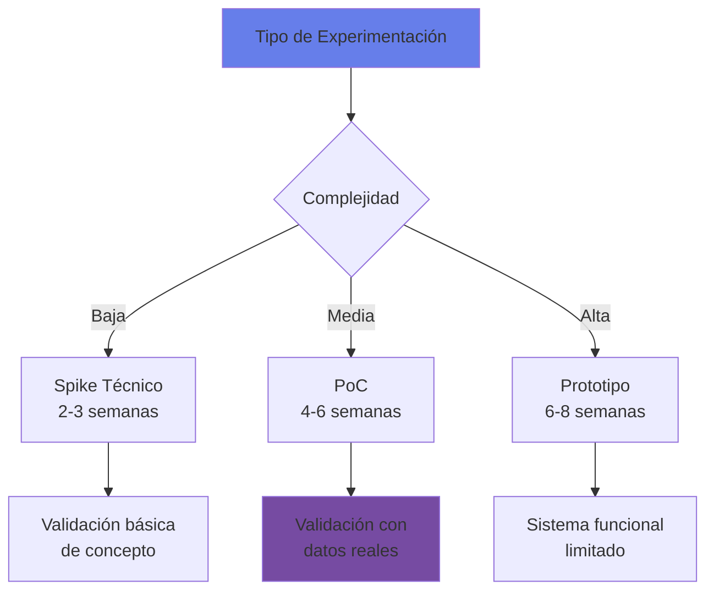
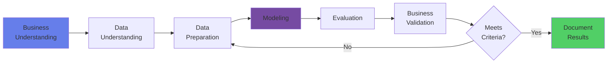
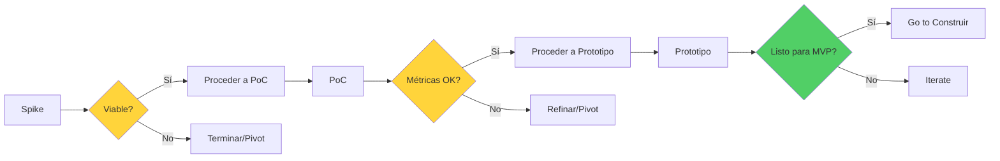
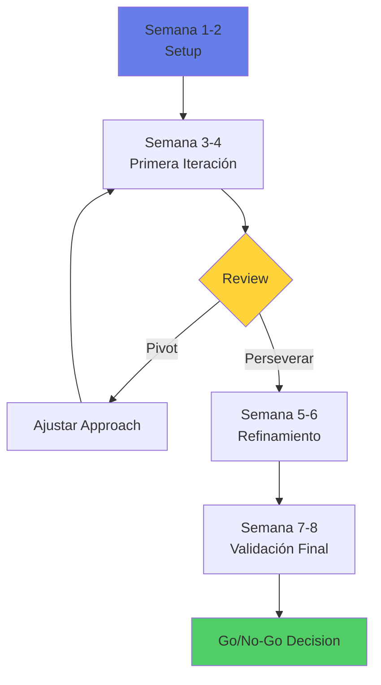

# 🧪 Etapa 2: Experimentar

## 🎯 Objetivo de la Etapa

Validar la viabilidad técnica de tu solución de IA mediante la construcción de un Proof of Concept (PoC) o prototipo funcional, demostrando que la tecnología puede resolver el problema identificado con los datos disponibles.

### Duración Típica
- **6-8 semanas** para PoC completo
- **3-4 semanas** si usas un Green Path
- **2-3 semanas** para spike técnico simple

### Entregables Clave
1. 🤖 PoC/Prototipo funcional
2. 📊 Métricas de performance técnica
3. 📈 Business case refinado con datos reales
4. 🎯 Informe de viabilidad técnica
5. ✅ Go/No-Go decision documentada

## 🔬 Tipos de Experimentación

### Elige tu Approach



| Tipo | Cuándo Usar | Alcance | Inversión | Entregables Específicos |
|------|------------|---------|-----------|------------------------|
| **Spike Técnico** | Validar factibilidad básica | Test de concepto, no producción | <$100K MXN | • Reporte técnico de hallazgos<br/>• Código demo en repositorio<br/>• Recomendación Go/No-Go para PoC |
| **PoC** | Demostrar capacidad con datos reales | Funcionalidad core, métricas reales | $100-500K MXN | • Modelo funcional (no producción)<br/>• Reporte de métricas técnicas<br/>• Business case refinado<br/>• Evaluación preliminar de riesgos |
| **Prototipo** | Preparar para piloto | Sistema casi completo, UI básica | $500K-1M MXN | • Sistema funcional con UI<br/>• Reporte completo de performance<br/>• Plan detallado para MVP<br/>• Análisis de integración |

## 📥 Inputs desde Etapa Explorar

### Entregables Requeridos de la Etapa Anterior
- ✅ **Problema validado** y objetivo de negocio claro
- ✅ **Caso de uso aprobado** con alcance definido
- ✅ **Pre-AISIA Greenlight** (score >40)
- ✅ **Data Access Memo** confirmando viabilidad de datos
- ✅ **Business case preliminar** con ROI proyectado
- ✅ **Presupuesto aprobado** para experimentación
- ✅ **Equipo formado** con roles asignados
- ✅ **Compromiso del sponsor** documentado

## 🛠️ Setup del Experimento

### Paso 1: Ambiente de Experimentación

#### Opción A: Nova-Cell Sandbox
```bash
# Solicitar ambiente en Nova-Cell
nova-cell env create --type=sandbox \
  --project="mi-poc" \
  --duration=8w \
  --resources=medium

# Recursos incluidos:
# - 4 vCPUs, 16GB RAM
# - GPU compartida (opcional)
# - Jupyter Lab preconfigurado
# - Librerías ML/DL estándar
# - Acceso a data lake (read-only)
```

#### Opción B: Ambiente Cloud
```yaml
cloud_resources:
  provider: Azure/AWS/GCP
  compute:
    type: ml.medium
    gpus: optional
  storage:
    data: 100GB
    models: 50GB
  security:
    network: isolated
    encryption: at-rest
    access: rbac
```

### Paso 2: Acceso a Datos

#### Data Pipeline para PoC

```python
# Template de pipeline seguro para PoC
class PoCDataPipeline:
    def __init__(self, project_id):
        self.project_id = project_id
        self.data_catalog = DataCatalog()
        self.privacy_filter = PrivacyFilter()
    
    def load_data(self, dataset_id):
        # 1. Verificar permisos
        assert self.data_catalog.has_access(dataset_id, self.project_id)
        
        # 2. Cargar datos con sampling
        data = self.data_catalog.load(
            dataset_id,
            sample_size=10000,  # Limitar para PoC
            anonymize=True      # Aplicar anonimización
        )
        
        # 3. Aplicar filtros de privacidad
        data = self.privacy_filter.apply(data)
        
        # 4. Logging para auditoría
        log_data_access(self.project_id, dataset_id)
        
        return data
```

### Paso 3: Metodología de Experimentación

#### Framework CRISP-DM Adaptado



## 📊 Métricas de Éxito

### ⚖️ Métricas Regulatorias y Éticas (Obligatorias)

#### Fairness/Sesgo
| Métrica | Descripción | Umbral Aceptable | Requerido por |
|---------|-------------|------------------|---------------|
| **Demographic Parity** | Diferencia en tasa de aprobación entre grupos | <5% | CONDUSEF |
| **Equal Opportunity** | Diferencia en tasa de verdaderos positivos | <10% | Ética AI |
| **Disparate Impact** | Ratio de tasas de selección | >0.8 | Regulación |
| **Individual Fairness** | Consistencia en decisiones similares | >95% | CNBV |

#### Explainabilidad (XAI)
| Componente | Requisito | Aplicación |
|------------|-----------|------------|
| **Feature Importance** | Documentar top 10 features | Todos los modelos |
| **SHAP/LIME valores** | Para decisiones individuales | Modelos Tier 1-2 |
| **Counterfactual Explanations** | "¿Qué cambiaría la decisión?" | Crédito/Riesgo |
| **Natural Language Explanations** | Para usuarios finales | Customer-facing |

#### Robustez y Estabilidad
| Test | Métrica | Umbral Mínimo |
|------|---------|---------------|
| **Data Drift Detection** | PSI (Population Stability Index) | <0.2 |
| **Adversarial Robustness** | Accuracy bajo perturbaciones | >90% del baseline |
| **Stress Testing** | Performance en condiciones extremas | >80% del baseline |
| **Temporal Stability** | Varianza entre períodos | <10% |

### Métricas Técnicas por Tipo de Modelo

#### Modelos de Clasificación
| Métrica | PoC Mínimo | Producción Target |
|---------|------------|------------------|
| **Accuracy** | >75% | >85% |
| **Precision** | >70% | >80% |
| **Recall** | >70% | >80% |
| **F1-Score** | >70% | >80% |
| **AUC-ROC** | >0.75 | >0.85 |

#### Modelos de Regresión
| Métrica | PoC Mínimo | Producción Target |
|---------|------------|------------------|
| **RMSE** | <20% baseline | <10% baseline |
| **MAE** | <15% baseline | <7% baseline |
| **R²** | >0.60 | >0.80 |
| **MAPE** | <20% | <10% |

#### Modelos GenAI/LLM
| Métrica | PoC Mínimo | Producción Target | Método de Medición |
|---------|------------|------------------|--------------------|
| **Task-Specific Accuracy** | >70% | >85% | Depende del caso:<br/>• Q&A: F1/Exact Match<br/>• Summarization: ROUGE<br/>• Classification: Accuracy<br/>• Generation: BLEU/METEOR |
| **Hallucination Rate** | <10% | <5% | Human evaluation + automated checks |
| **Response Time (P95)** | <5s | <2s | Latency monitoring |
| **Safety Score** | >95% | >99% | Toxicity/bias detection |
| **User Satisfaction** | >3.5/5 | >4/5 | Surveys/expert review |
| **Context Relevance** | >80% | >90% | Retrieval accuracy (para RAG) |

### Métricas de Negocio vs Baseline

```python
# Framework de evaluación de negocio con baseline obligatorio
business_metrics = {
    'baseline_comparison': {
        'current_process': 'Manual/Sistema actual',
        'measurement_period': '3 meses históricos',
        'data_source': 'Sistema transaccional'
    },
    'time_saved': {
        'current_process': 120,  # minutos
        'with_ai': 30,           # minutos
        'improvement': '75%'
    },
    'cost_reduction': {
        'current_cost': 1000,     # MXN por transacción
        'with_ai': 250,
        'savings': '75%'
    },
    'error_reduction': {
        'current_error_rate': 0.05,
        'with_ai': 0.01,
        'improvement': '80%'
    },
    'customer_satisfaction': {
        'current_nps': 30,
        'projected_nps': 45,
        'improvement': '+15 points'
    }
}
```

## 🔄 Puntos de Decisión Intermedios

### Decision Gates por Tipo de Experimento



## 🎯 Experimentos por Caso de Uso

### Green Path: RAG Assistant

```python
# Experimento estándar para RAG
class RAGExperiment:
    def __init__(self):
        self.embeddings_model = "text-embedding-ada-002"
        self.llm_model = "gpt-3.5-turbo"
        self.vector_store = "chromadb"
        
    def run_experiment(self, documents):
        # 1. Preparar documentos
        chunks = self.chunk_documents(documents)
        
        # 2. Crear embeddings
        embeddings = self.create_embeddings(chunks)
        
        # 3. Almacenar en vector DB
        self.store_vectors(embeddings)
        
        # 4. Test queries
        test_results = self.evaluate_retrieval(test_queries)
        
        # 5. Métricas
        return {
            'retrieval_accuracy': test_results['accuracy'],
            'response_quality': test_results['quality'],
            'latency': test_results['avg_latency'],
            'cost_per_query': test_results['cost']
        }
```

### Caso Custom: Modelo de Scoring

```python
# Template para experimento de scoring
class ScoringExperiment:
    def __init__(self, model_type='xgboost'):
        self.model_type = model_type
        self.features = load_feature_config()
        
    def experiment_pipeline(self):
        # 1. Feature engineering
        X, y = self.prepare_features()
        
        # 2. Split estratificado
        X_train, X_test, y_train, y_test = train_test_split(
            X, y, test_size=0.2, stratify=y
        )
        
        # 3. Entrenar múltiples modelos
        models = {
            'baseline': LogisticRegression(),
            'xgboost': XGBClassifier(),
            'neural': MLPClassifier()
        }
        
        # 4. Comparar performance
        results = {}
        for name, model in models.items():
            model.fit(X_train, y_train)
            y_pred = model.predict(X_test)
            
            results[name] = {
                'auc': roc_auc_score(y_test, y_pred),
                'precision': precision_score(y_test, y_pred),
                'recall': recall_score(y_test, y_pred),
                'f1': f1_score(y_test, y_pred)
            }
        
        return results
```

## 📝 Documentación del Experimento

### Experiment Card Template

```markdown
# Experiment Card: [Nombre del Experimento]

## Metadata
- **ID**: EXP-2025-001
- **Fecha**: [DD/MM/YYYY]
- **Equipo**: [Nombres]
- **Duración**: [X semanas]

## Hipótesis
"Creemos que [solución] resolverá [problema] 
logrando [métrica] de [valor]"

## Setup
- **Datos**: [Dataset, volumen, período]
- **Modelos**: [Algoritmos probados]
- **Infraestructura**: [Recursos utilizados]
- **Costo**: [Total invertido]

## Resultados
### Métricas Técnicas
- Accuracy: X%
- Precision: X%
- Recall: X%
- F1: X%

### Métricas de Negocio
- Tiempo ahorrado: X%
- Costo reducido: $X
- Errores evitados: X%

## Conclusiones
- ✅ Hipótesis validada/rechazada
- 📊 Insights clave
- ⚠️ Riesgos identificados
- 🚀 Recomendaciones

## Artefactos
- [Link a código]
- [Link a datos]
- [Link a modelos]
- [Link a presentación]
```

## 🔄 Proceso de Iteración

### Ciclo de Experimentación Ágil



### Sprint Planning

| Sprint | Objetivo | Entregables | Review con |
|--------|----------|-------------|------------|
| **Sprint 0** | Setup y datos | Ambiente listo, datos cargados | Tech Lead |
| **Sprint 1** | Baseline model | Modelo simple funcionando | Data Science Team |
| **Sprint 2** | Mejora modelo | Modelo optimizado | Product Owner |
| **Sprint 3** | Validación negocio | Métricas de negocio | Stakeholders |
| **Sprint 4** | Documentación | Reporte final | Sponsor |

## ✅ Criterios Go/No-Go

### Decision Framework

```python
def evaluate_experiment(results):
    """Evalúa el experimento con criterios cuantificables"""
    
    # Cálculo de métricas compuestas
    roi = calculate_roi(
        benefits=results['cost_savings'] + results['revenue_increase'],
        investment=results['total_investment'],
        period_years=2
    )
    
    data_quality = calculate_data_quality(
        completeness=results['data_completeness'],  # >95%
        accuracy=results['data_accuracy'],          # >90%
        consistency=results['data_consistency'],    # >95%
        timeliness=results['data_freshness']       # <7 días
    )
    
    risk_score = calculate_risk_score(
        technical_risk=results['technical_complexity'],
        regulatory_risk=results['regulatory_exposure'],
        operational_risk=results['change_management'],
        reputational_risk=results['customer_impact']
    )
    
    # Criterios hard gates (todos deben cumplirse)
    go_criteria = {
        'technical_feasibility': results['primary_metric'] > 0.75,
        'business_value': roi > 1.5,
        'data_availability': data_quality > 0.8,
        'risk_acceptable': risk_score < 0.3,
        'sponsor_support': results['sponsor_signoff'] == True,
        'regulatory_compliance': results['compliance_review_passed'] == True,
        'ethical_ai_review': results['ethics_review_passed'] == True,
        'fairness_check': results['bias_metrics_acceptable'] == True
    }
    
    # Todos los criterios deben cumplirse
    decision = all(go_criteria.values())
    
    if decision:
        return "GO - Proceder a Construir"
    else:
        failed = [k for k, v in go_criteria.items() if not v]
        return f"NO-GO - Revisar: {failed}"
```

### Matriz de Decisión

| Criterio | Peso | Score (1-5) | Weighted | Threshold | Cómo se Calcula |
|----------|------|-------------|----------|-----------|------------------|
| **Viabilidad Técnica** | 25% | ? | ? | >3.5 | Promedio de métricas técnicas vs targets |
| **Valor de Negocio** | 20% | ? | ? | >4.0 | ROI + impacto estratégico |
| **Compliance Regulatorio** | 20% | ? | ? | >4.5 | Revisión legal/compliance (binario 1 o 5) |
| **Calidad de Datos** | 15% | ? | ? | >3.5 | Score compuesto de calidad |
| **Riesgo** | 10% | ? | ? | <3.0 | Inverso del risk score |
| **Ética y Fairness** | 5% | ? | ? | >4.0 | Métricas de sesgo y revisión ética |
| **Adopción Esperada** | 5% | ? | ? | >3.5 | UAT feedback + change readiness |
| **Total** | 100% | - | ? | >3.5 | Promedio ponderado |

## 🚨 Alertas y Mitigaciones

### Red Flags Comunes

| Problema | Síntoma | Mitigación | Cuándo Escalar |
|----------|---------|------------|----------------|
| **Overfitting** | Train acc >95%, Test <70% | Regularización, más datos | Si persiste 2 sprints |
| **Data Leakage** | Métricas irrealmente altas | Auditoría de pipeline | Inmediatamente |
| **Drift** | Performance degrada con tiempo | Monitoreo continuo | >5% degradación |
| **Sesgo** | Diferencias por grupo | Fairness constraints | Cualquier discriminación |
| **Costo excesivo** | >150% presupuesto | Optimizar recursos | >200% presupuesto |

### Plan B: Pivot Strategies

1. **Si el modelo no converge**: Simplificar problema o cambiar approach
2. **Si los datos son insuficientes**: Synthetic data o transfer learning
3. **Si el ROI no se justifica**: Buscar quick wins parciales
4. **Si hay blockers técnicos**: Evaluar soluciones cloud/vendor

## 🔍 Validación Adicional

### Human-in-the-Loop (HITL) Validation

```python
class HITLValidation:
    def __init__(self, model, human_reviewers):
        self.model = model
        self.reviewers = human_reviewers
        
    def validate_batch(self, test_cases):
        results = []
        for case in test_cases:
            # Predicción del modelo
            model_output = self.model.predict(case)
            
            # Revisión humana
            human_feedback = self.get_human_review(
                input=case,
                output=model_output,
                reviewer=self.select_reviewer(case)
            )
            
            results.append({
                'case_id': case.id,
                'model_output': model_output,
                'human_agrees': human_feedback['agrees'],
                'correction': human_feedback.get('correction'),
                'confidence': human_feedback['confidence'],
                'edge_case': human_feedback.get('is_edge_case', False)
            })
            
        return self.calculate_metrics(results)
```

### Early Integration Testing

| Sistema | Test Requerido | Criterio de Éxito |
|---------|---------------|-------------------|
| **APIs Core Banking** | Conectividad y autenticación | Latencia <100ms |
| **Data Lake** | Lectura de datos históricos | Throughput >1000 rec/s |
| **Sistema de Decisiones** | Formato de output compatible | 100% parseable |
| **Monitoring** | Logs y métricas | Captura completa |
| **Seguridad** | Vulnerability scan | 0 críticas, <3 altas |

### User Acceptance Testing (UAT) para Prototipos

```yaml
uat_protocol:
  participants:
    - target_users: 5-10 usuarios finales
    - business_experts: 2-3 domain experts
    - duration: 2-3 días
  
  evaluation:
    - usability: System Usability Scale (SUS) >68
    - effectiveness: Task completion rate >80%
    - efficiency: Time to complete vs baseline
    - satisfaction: Net Promoter Score (NPS) >30
    - feedback: Qualitative insights for mejoras
```

## 🎓 Recursos de Soporte

### Expertise Disponible

| Recurso | Disponibilidad | Cómo Solicitar | Review Obligatorio |
|---------|---------------|----------------|--------------------|
| **Data Scientists CoE** | 20 hrs/semana | coe-ia@banco.mx | Sprint reviews |
| **ML Engineers** | 10 hrs/semana | Slack #ml-support | Diseño técnico |
| **Arquitectos IA** | Consultas ad-hoc | Office hours martes | Arquitectura |
| **Especialistas en ética** | Review obligatorio | ethics-ai@banco.mx | ✅ Antes de Go/No-Go |
| **Legal & Compliance** | Review obligatorio | compliance-ai@banco.mx | ✅ Antes de Go/No-Go |
| **Security Team** | Review obligatorio | security-ai@banco.mx | ✅ Código y datos |

### Herramientas y Templates
- 🔧 [Nova-Cell Experiment Tracker](../servicios/plataforma/nova-cell-hub.md)
- 📊 [Jupyter Notebooks Templates](../templates/experiment-notebooks/)
- 📈 [MLflow para tracking](http://mlflow.banco.mx)
- 🎯 [A/B Testing Framework](../tools/ab-testing-guide.md)

## 📞 Checkpoints y Reviews

### Review Gates Obligatorios

| Semana | Review | Participantes | Decisión |
|--------|--------|--------------|----------|
| **2** | Technical Feasibility | Tech Lead + Arquitecto | Continue/Adjust |
| **4** | Mid-Point Review | Product Owner + Sponsor | Continue/Pivot |
| **6** | Business Validation | Stakeholders | Refine/Prepare |
| **8** | Go/No-Go | Comité Decisión† + Sponsor | Go/No-Go/Iterate |

† **Comité de Decisión**: Head of CoE AI, Business Unit Head, Chief Risk Officer, Chief Compliance Officer, Data Protection Officer, Sponsor Ejecutivo

### Preparación para Reviews
1. **Deck ejecutivo** (5 slides max)
2. **Demo funcional** (10 min)
3. **Métricas dashboard** (live)
4. **Risk assessment** actualizado
5. **Recomendación clara** con próximos pasos

## 🚀 Transición a Construir

### Criterios de Salida
- [ ] PoC demuestra viabilidad técnica
- [ ] Métricas cumplen umbrales mínimos
- [ ] Business case positivo confirmado
- [ ] Sponsor aprueba continuar
- [ ] Equipo para construcción identificado
- [ ] Presupuesto para MVP aprobado
- [ ] Riesgos identificados y plan de mitigación
- [ ] Documentación completa del experimento

### Entregables para Siguiente Etapa
1. **Technical Design Document** (TDD)
2. **Refined Business Case** con datos reales
3. **Risk Assessment** actualizado
4. **Project Plan** para construcción
5. **Team Charter** con roles definidos

---

**Duración estimada**: 6-8 semanas  
**Inversión típica**: $300-800K MXN  
**Tasa de éxito**: 65% avanzan a Construir  
**Soporte CoE**: Full technical support