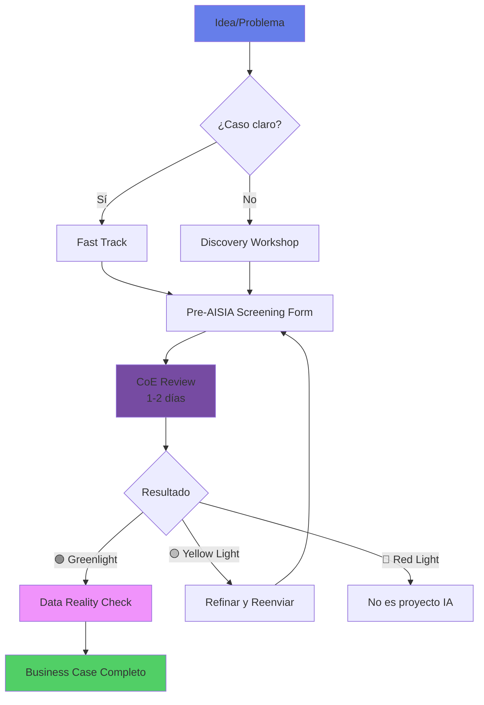
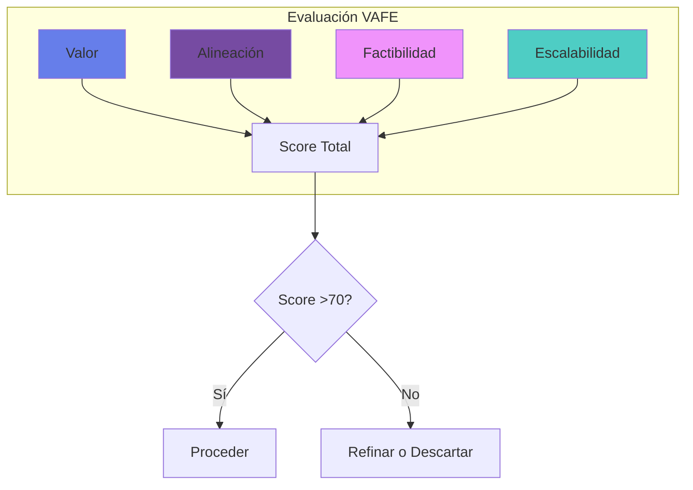
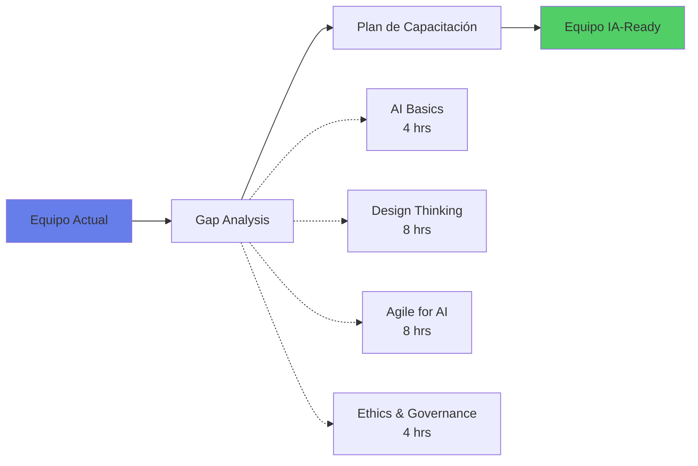

# 🔍 Etapa 1: Explorar

## 🎯 Objetivo de la Etapa

Identificar oportunidades de IA de alto valor en tu área, entender el potencial de la tecnología y construir el caso de negocio inicial para justificar la inversión en una iniciativa de IA.

### Duración Típica
- **4-6 semanas** para exploración completa
- **2-3 semanas** si ya tienes caso de uso identificado

### Entregables Clave
1. 📋 Catálogo de oportunidades de IA
2. 📊 Business case preliminar
3. 🎯 Caso de uso priorizado
4. 👥 Equipo inicial formado
5. ✅ Pre-AISIA screening completado

## 🚀 ¿Por Dónde Empezar?

### Paso 1: Flujo de Exploración con Pre-AISIA Gate



### Paso 2: Pre-AISIA Screening (Obligatorio)

Complete el formulario simplificado antes de invertir tiempo en el business case completo:

```yaml
pre_aisia_screening:
  # Información Básica
  initiative_name: "Nombre descriptivo (max 50 chars)"
  sponsor: "Nombre y cargo del sponsor ejecutivo"
  area: "Departamento/División"
  
  # Preguntas Clave (máx 3 oraciones cada una)
  1_problem_statement: "¿Qué problema específico resuelve?"
  2_ai_solution: "¿Cómo lo resolvería la IA?"
  3_data_availability: "¿Qué datos necesitas y dónde están?"
  4_estimated_impact: "[<100K | 100K-1M | 1M-10M | >10M] MXN"
  5_risk_flags: "¿Involucra decisiones de crédito, datos sensibles o regulación?"
  6_alternative: "¿Por qué IA vs solución tradicional?"
  
  # Compromiso
  sponsor_commitment: "Confirmo disponibilidad de recursos y apoyo activo"
  signature: "Firma digital del sponsor"
  date: "Fecha"
```

**Respuesta del CoE en 24-48 horas:**
- 🟢 **Greenlight**: Proceder con Data Reality Check
- 🟡 **Yellow Light**: Ajustar según feedback específico
- 🔴 **Red Light**: No viable como proyecto IA (con justificación)

### Paso 3: Data Reality Check (Post-Greenlight)

**⚠️ CRÍTICO**: Antes de invertir tiempo en el business case completo, valida la viabilidad de datos:

#### Reunión Obligatoria de 30 minutos
**Participantes**: Product Owner + Domain Expert + Data Steward asignado

#### Preguntas a Responder:
1. **¿Los datos existen?**
   - Fuentes específicas identificadas
   - Volumen estimado disponible
   - Período histórico cubierto

2. **¿Quién es el owner y cómo se accede?**
   - Data Owner formal identificado
   - Proceso de solicitud de acceso
   - Timeline para obtener acceso

3. **¿Hay blockers inmediatos?**
   - Restricciones de privacidad (LFPDPPP)
   - Limitaciones regulatorias
   - Restricciones técnicas (sistemas legacy)

#### Entregable: Data Access Memo
```markdown
# Data Access Memo - [Nombre Iniciativa]
Fecha: [DD/MM/YYYY]
Data Steward: [Nombre]

## Confirmación de Viabilidad
- [ ] Datos identificados y existen
- [ ] Acceso técnicamente posible
- [ ] Sin blockers regulatorios críticos
- [ ] Timeline de acceso: [X semanas]

## Riesgos Identificados
- [Lista de riesgos de datos]

## Próximos Pasos
- [Acciones para obtener acceso]

Firma Data Steward: ___________
```

**🚫 NO PROCEDER con business case si:**
- Los datos no existen o son insuficientes
- El acceso tomará >3 meses
- Hay blockers regulatorios sin solución

### Paso 4: Discovery Workshop (Opcional)

Si no tienes un caso de uso claro, participa en nuestro **AI Discovery Workshop**:

| Sesión | Duración | Objetivo | Participantes |
|--------|----------|----------|--------------|
| **Inspiración** | 2 hrs | Casos de éxito en banca | Líderes de área |
| **Ideación** | 4 hrs | Brainstorming de oportunidades | Equipo completo |
| **Priorización** | 2 hrs | Matriz valor vs factibilidad | Decisores |
| **Roadmapping** | 2 hrs | Plan de acción | Core team |

## 📊 Identificación de Oportunidades

### Matriz de Oportunidades por Área

#### 🏦 Banca Minorista
| Oportunidad | Impacto Potencial | Complejidad | Green Path Disponible |
|-------------|------------------|-------------|---------------------|
| Chatbot de servicio | Alto | Baja | ✅ Sí |
| Scoring crediticio alternativo | Muy Alto | Media | ✅ Sí |
| Personalización de ofertas | Alto | Media | 🚧 Próximamente |
| Detección de fraude | Muy Alto | Alta | ✅ Sí |

#### 💼 Banca Corporativa
| Oportunidad | Impacto Potencial | Complejidad | Green Path Disponible |
|-------------|------------------|-------------|---------------------|
| Análisis de documentos | Alto | Baja | ✅ Sí |
| Predicción de default | Muy Alto | Media | 🚧 En desarrollo |
| Optimización de pricing | Alto | Alta | ❌ Custom |
| KYC automatizado | Muy Alto | Media | ✅ Sí |

#### 🛡️ Risk & Compliance
| Oportunidad | Impacto Potencial | Complejidad | Green Path Disponible |
|-------------|------------------|-------------|---------------------|
| AML monitoring mejorado | Muy Alto | Alta | 🚧 Q2 2025 |
| Análisis de contratos | Alto | Media | ✅ Sí |
| Stress testing con ML | Alto | Alta | ❌ Custom |
| Regulatory reporting | Medio | Baja | ✅ Sí |

### Herramienta: Opportunity Radar

Usa nuestro **[Opportunity Radar](../tools/opportunity-radar.md)** para evaluar automáticamente oportunidades:

```python
# Ejemplo de evaluación automática
opportunity = {
    'name': 'Chatbot de Atención al Cliente',
    'department': 'Contact Center',
    'problem': 'Alto volumen de consultas repetitivas',
    'current_cost': 12_000_000,  # MXN/año
    'automation_potential': 0.70,  # 70% automatizable
    'data_availability': 'high',
    'regulatory_risk': 'low'
}

score = opportunity_radar.evaluate(opportunity)
# Output: Score 85/100 - Alta prioridad - Green Path disponible
```

## 💡 Criterios de Selección

### Framework VAFE (Valor, Alineación, Factibilidad, Escalabilidad)



#### Valor (40%)
- [ ] ROI proyectado:
  - Green Path / Primera iniciativa: >100%
  - Proyectos maduros: >200%
  - Proyectos estratégicos: Evaluar valor cualitativo
- [ ] Payback <18 meses
- [ ] Impacto en KPIs críticos
- [ ] Reducción de riesgo cuantificable
- [ ] **O** Establece capacidad reutilizable (plataforma/framework)

#### Alineación (20%)
- [ ] Fit con estrategia digital
- [ ] **Compromiso documentado del sponsor** (no solo "soporte")
- [ ] Cultura data-driven del área
- [ ] Capacidad de cambio demostrada

#### Factibilidad (25%)
- [ ] Datos disponibles y de calidad
- [ ] Tecnología madura (TRL >6)
- [ ] Skills disponibles o adquiribles
- [ ] Presupuesto asegurado

#### Escalabilidad (15%)
- [ ] Aplicable a múltiples áreas
- [ ] Crecimiento sin incremento lineal de costo
- [ ] Potencial de plataforma
- [ ] Exportable a otras geografías

## 📝 Business Case Template

### Estructura Recomendada

```markdown
# Business Case: [Nombre de la Iniciativa]

## 1. Resumen Ejecutivo
- Problema a resolver
- Solución propuesta con IA
- Beneficios esperados
- Inversión requerida
- ROI proyectado

## 2. Situación Actual (AS-IS)
- Proceso actual
- Pain points
- Costos actuales
- Métricas baseline

## 3. Situación Futura (TO-BE)
- Proceso con IA
- Mejoras esperadas
- Nuevas capacidades
- Métricas objetivo

## 4. Análisis Financiero
- CAPEX: [Inversión inicial]
- OPEX: [Costos operativos]
- Beneficios: [Cuantificados]
- NPV: [Valor presente neto]
- IRR: [Tasa interna de retorno]

## 5. Análisis de Riesgo
- Riesgos técnicos
- Riesgos regulatorios
- Riesgos de adopción
- Plan de mitigación

## 6. Plan de Implementación
- Fases del proyecto
- Timeline
- Recursos necesarios
- Quick wins

## 7. Criterios de Éxito
- KPIs específicos
- Método de medición
- Baseline vs Target
- Período de evaluación
```

### Calculadora de ROI

Usa nuestra **[Calculadora de ROI para IA](../tools/roi-calculator.md)**:

| Input | Valor Ejemplo |
|-------|--------------|
| **Costo actual del proceso** | $10M MXN/año |
| **% Automatizable** | 60% |
| **Inversión en IA** | $3M MXN |
| **Costo operativo IA** | $1M MXN/año |
| **Mejora en eficiencia** | 40% |
| **Nuevos ingresos** | $2M MXN/año |

**ROI Calculado**: 267% en 2 años

## 🤝 Formación del Equipo

### Roles Mínimos Requeridos

| Rol | Responsabilidad | Dedicación | ¿Quién? |
|-----|----------------|------------|---------|
| **Sponsor Ejecutivo** | Championing y recursos | 10% | Director/VP |
| **Product Owner** | Definición y priorización | 50% | Gerente de área |
| **Technical Lead** | Arquitectura y feasibility | 30% | Arquitecto/Senior Dev |
| **Domain Expert** | Conocimiento del negocio | 20% | Analista senior |
| **Data Steward** | Acceso y calidad de datos | 20% | Data analyst |

### Competencias a Desarrollar



## 🎯 Casos de Uso Recomendados para Empezar

### 🟢 Green Paths (Menor Riesgo, Mayor Probabilidad de Éxito)

1. **[RAG Assistant](green-paths/rag-assistant.md)**
   - Asistente basado en documentos internos
   - ROI: 180-250%
   - Tiempo: 3-4 meses
   - Riesgo: Bajo

2. **[Document Classification](green-paths/document-classification.md)**
   - Clasificación automática de documentos
   - ROI: 200-300%
   - Tiempo: 2-3 meses
   - Riesgo: Bajo

3. **[Chatbot Call Center](green-paths/chatbot-call-center.md)**
   - Automatización de consultas frecuentes
   - ROI: 150-200%
   - Tiempo: 4-6 meses
   - Riesgo: Medio-Bajo

### 🟡 Casos Intermedios

- Análisis de sentimiento en redes sociales
- Predicción de churn de clientes
- Optimización de campañas de marketing
- Forecasting de demanda

### 🔴 Casos Avanzados (Requieren Mayor Madurez)

- Scoring crediticio con deep learning
- Trading algorítmico
- Detección de fraude en tiempo real
- Asesor financiero virtual completo

## ✅ Checkpoint: ¿Estás Listo para Avanzar?

### Criterios de Salida de la Etapa Explorar

- [ ] **Caso de uso definido** con problema claro y solución IA
- [ ] **Business case aprobado** por sponsor ejecutivo
- [ ] **Equipo formado** con roles clave asignados
- [ ] **Datos identificados** y acceso confirmado
- [ ] **Pre-AISIA completado** con score >40
- [ ] **Presupuesto tentativo** para PoC
- [ ] **Compromiso del sponsor** documentado
- [ ] **Quick wins identificados** para mostrar valor temprano

### ⚠️ Red Flags - No Avances Si:

- ❌ No hay un problema de negocio claro
- ❌ ROI <100% o payback >24 meses
- ❌ No hay datos o son de muy baja calidad
- ❌ No hay sponsor ejecutivo comprometido
- ❌ Resistencia cultural muy alta
- ❌ Restricciones regulatorias no resueltas

## 🛠️ Recursos y Herramientas

### Plantillas Disponibles
- 📄 [Business Case Template](../templates/business-case-ai.docx)
- 📊 [ROI Calculator](../tools/roi-calculator.xlsx)
- 📋 [Opportunity Assessment](../templates/opportunity-assessment.pptx)
- 🎯 [Use Case Canvas](../templates/use-case-canvas.pdf)

### Workshops y Capacitación
- 🎓 **AI Discovery Workshop** - Martes, 4 hrs
- 💡 **Innovation Lab Tour** - Jueves, 2 hrs
- 📚 **AI Fundamentals** - Online, self-paced
- 🤝 **Networking Session** - Último viernes del mes

### Contacto y Soporte
- 📧 **Email**: coe-ia@banco.mx
- 💬 **Teams**: #ai-exploration
- 📞 **Office Hours**: Lun-Vie 10-12h
- 🌐 **Portal**: [nova-cell.banco.mx](../servicios/plataforma/nova-cell-hub.md)

## 🚀 Siguiente Paso: Experimentar

Una vez que hayas completado los criterios de salida, estás listo para avanzar a la **[Etapa 2: Experimentar](experimentar.md)**, donde construirás tu primer PoC y validarás la viabilidad técnica de tu solución.

### Preview de la Etapa Experimentar
- Construcción de PoC/Prototipo
- Validación técnica con datos reales
- Medición de performance
- Refinamiento del business case
- Go/No-Go decision

---

**Duración estimada de esta etapa**: 4-6 semanas  
**Nivel de inversión**: Bajo (<$500K MXN)  
**Probabilidad de éxito**: 70% si sigues el proceso  
**Soporte disponible**: Full support del CoE