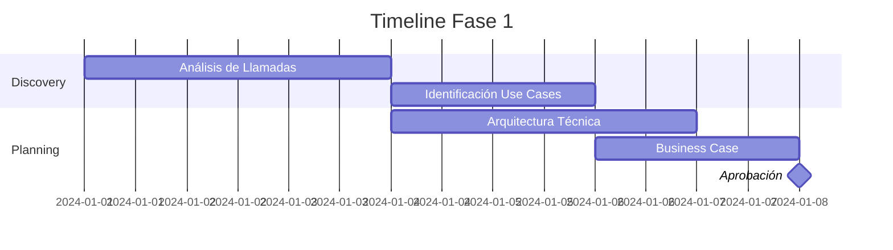

# 🤖 Green Path: Chatbot para Call Center

## Transformación Inteligente del Servicio al Cliente

### 📊 Caso de Negocio

**Problema a Resolver:**
- 70% de llamadas son consultas repetitivas (saldo, estados de cuenta, horarios)
- Tiempo promedio de espera: 8 minutos
- Costo por llamada: $45 MXN
- Satisfacción del cliente: 3.2/5

**Oportunidad:**
- Automatizar 60% de interacciones de primer nivel
- Reducir tiempo de resolución a <30 segundos
- Liberar agentes para casos complejos
- Disponibilidad 24/7/365

### 🎯 Métricas de Éxito

| Métrica | Baseline | Target 6M | Target 12M |
|---------|----------|-----------|------------|
| **Deflection Rate** | 0% | 40% | 60% |
| **First Contact Resolution** | 65% | 75% | 85% |
| **Average Handle Time** | 8 min | 4 min | 2 min |
| **CSAT Score** | 3.2/5 | 3.8/5 | 4.2/5 |
| **Costo por Interacción** | $45 | $25 | $15 |
| **ROI Proyectado** | - | 180% | 320% |

## 🚀 Roadmap de Implementación

### Fase 1: Discovery & Planning (Semanas 1-2)



**Actividades:**
1. **Análisis de Transcripciones**
   - Mining de 10,000 llamadas históricas
   - Categorización de intents principales
   - Identificación de flujos conversacionales

2. **Priorización de Use Cases**
   ```python
   use_cases_prioritarios = {
       "Consulta de Saldo": {"volumen": 35%, "complejidad": "Baja"},
       "Estado de Cuenta": {"volumen": 20%, "complejidad": "Baja"},
       "Reporte de Tarjeta": {"volumen": 15%, "complejidad": "Media"},
       "Cambio de NIP": {"volumen": 10%, "complejidad": "Media"},
       "Información Sucursales": {"volumen": 8%, "complejidad": "Baja"}
   }
   ```

### Fase 2: Desarrollo del MVP (Semanas 3-8)

**Stack Tecnológico:**

```yaml
nlp_engine:
  provider: Azure OpenAI
  model: GPT-4
  fine_tuning: Domain-specific banking terms
  
integration:
  telephony: Genesys Cloud / Twilio
  crm: Salesforce Service Cloud
  core_banking: APIs REST secured
  
infrastructure:
  hosting: Azure Mexico Central
  scaling: Auto-scaling 10-100 instances
  backup: Multi-region redundancy
```

**Componentes Clave:**

1. **Motor de NLU (Natural Language Understanding)**
   - Entrenamiento con 50,000 conversaciones etiquetadas
   - 95% accuracy en intent classification
   - Soporte bilingüe (Español/Inglés)

2. **Gestor de Diálogos**
   - State machine para flujos complejos
   - Context management entre turnos
   - Fallback a agente humano

3. **Integración con Sistemas**
   ```python
   class ChatbotIntegration:
       def consultar_saldo(self, cuenta_id):
           # Integración con Core Banking
           response = core_banking_api.get_balance(
               account_id=cuenta_id,
               auth_token=self.secure_token
           )
           return self.format_response(response)
       
       def transferir_agente(self, context):
           # Handoff inteligente
           ticket = {
               "priority": self.calculate_priority(context),
               "summary": self.generate_summary(context),
               "sentiment": self.analyze_sentiment(context),
               "suggested_actions": self.recommend_actions(context)
           }
           return crm_api.create_ticket(ticket)
   ```

### Fase 3: Piloto Controlado (Semanas 9-12)

**Estrategia de Rollout:**

| Semana | Cobertura | Volumen | Segmento |
|--------|-----------|---------|----------|
| 9 | 5% llamadas | 500/día | Early adopters |
| 10 | 10% llamadas | 1,000/día | Digital natives |
| 11 | 20% llamadas | 2,000/día | Público general |
| 12 | 35% llamadas | 3,500/día | Todos los segmentos |

**Monitoreo en Tiempo Real:**

```python
dashboard_metricas = {
    "performance": {
        "successful_resolutions": track_hourly(),
        "escalation_rate": monitor_threshold(max=0.20),
        "response_time": measure_p95(target_ms=500),
        "concurrent_sessions": monitor_capacity()
    },
    "quality": {
        "intent_accuracy": measure_daily(min=0.92),
        "customer_satisfaction": survey_post_call(),
        "sentiment_analysis": track_conversation(),
        "compliance_violations": alert_immediate()
    }
}
```

### Fase 4: Optimización con IA (Semanas 13-16)

**Machine Learning Pipeline:**

1. **Continuous Learning**
   - Reentrenamiento semanal con nuevas conversaciones
   - A/B testing de respuestas
   - Reinforcement learning basado en CSAT

2. **Análisis Predictivo**
   ```python
   def predict_customer_needs(customer_profile):
       # Modelo predictivo basado en histórico
       features = extract_features(customer_profile)
       prediction = ml_model.predict(features)
       
       return {
           "likely_intent": prediction.intent,
           "probability": prediction.confidence,
           "proactive_offer": generate_offer(prediction),
           "escalation_risk": calculate_risk(features)
       }
   ```

3. **Personalización Avanzada**
   - Tono adaptativo según perfil del cliente
   - Ofertas contextuales basadas en LTV
   - Idioma y velocidad ajustables

### Fase 5: Escalamiento (Mes 4-6)

**Expansión de Capacidades:**

| Capability | Mes 4 | Mes 5 | Mes 6 |
|------------|-------|-------|-------|
| **Canales** | Voz | WhatsApp | Web Chat |
| **Idiomas** | ES/EN | + Portugués | + Lenguas indígenas |
| **Transacciones** | Consultas | + Pagos | + Inversiones |
| **Integraciones** | 5 sistemas | 10 sistemas | 15 sistemas |

## 🔒 Consideraciones de Seguridad y Compliance

### Autenticación Multi-Factor

```python
class SecureAuthentication:
    def authenticate_customer(self, session):
        # Nivel 1: Verificación de número telefónico
        phone_verified = self.verify_caller_id(session.phone)
        
        # Nivel 2: Preguntas de seguridad
        if phone_verified:
            security_score = self.ask_security_questions(
                questions=self.get_dynamic_questions(session.customer_id),
                max_attempts=3
            )
        
        # Nivel 3: Biometría de voz (opcional)
        if self.requires_high_security(session.intent):
            voice_match = self.verify_voice_biometrics(
                sample=session.audio_stream,
                profile=session.customer_voice_profile
            )
        
        return AuthResult(
            authenticated=all([phone_verified, security_score > 0.8]),
            confidence_level=calculate_confidence(),
            allowed_operations=determine_scope()
        )
```

### Cumplimiento Regulatorio

- **LFPDPPP**: Consentimiento explícito para grabación
- **CNBV**: Logs de auditoría para todas las transacciones
- **CONDUSEF**: Scripts de cumplimiento obligatorio
- **PCI DSS**: No almacenamiento de datos sensibles

## 📈 Análisis de ROI

### Modelo Financiero

```python
roi_calculation = {
    "costos": {
        "desarrollo_inicial": 2_500_000,  # MXN
        "licencias_anuales": 800_000,
        "mantenimiento_mensual": 150_000,
        "infraestructura_cloud": 200_000
    },
    "ahorros": {
        "reduccion_headcount": 0,  # No despidos, reasignación
        "eficiencia_operativa": 4_200_000,  # Anual
        "reduccion_abandono": 1_800_000,  # Menor churn
        "ventas_incrementales": 2_400_000  # Cross-sell/up-sell
    },
    "roi_año_1": "185%",
    "payback_period": "7 meses",
    "npv_5_años": 28_500_000
}
```

### Beneficios Cualitativos

1. **Experiencia del Cliente**
   - Disponibilidad 24/7
   - Respuesta inmediata
   - Consistencia en el servicio

2. **Empleados**
   - Enfoque en casos de alto valor
   - Reducción de estrés por volumen
   - Desarrollo de nuevas habilidades

3. **Marca**
   - Percepción de innovación
   - Diferenciación competitiva
   - Atracción de clientes digitales

## 🎓 Gestión del Cambio

### Plan de Comunicación

| Audiencia | Mensaje Clave | Canal | Frecuencia |
|-----------|---------------|-------|------------|
| **Agentes** | "El bot es tu asistente, no tu reemplazo" | Workshops | Semanal |
| **Clientes** | "Servicio más rápido y disponible 24/7" | App/SMS | Al lanzamiento |
| **Ejecutivos** | "ROI positivo y mejora en NPS" | Dashboard | Mensual |
| **Reguladores** | "Cumplimiento total con normativa" | Reportes | Trimestral |

### Capacitación del Personal

```yaml
programa_entrenamiento:
  agentes_call_center:
    - Manejo de escalaciones del bot
    - Interpretación de insights del bot
    - Supervisión y QA de conversaciones
    
  equipo_tecnico:
    - Mantenimiento del modelo NLP
    - Gestión de integraciones
    - Monitoreo y troubleshooting
    
  managers:
    - Análisis de métricas
    - Optimización de flujos
    - Gestión del cambio
```

## 🔄 Mejora Continua

### KPIs de Monitoreo

```python
class ChatbotMonitoring:
    def daily_health_check(self):
        metrics = {
            "technical": {
                "uptime": self.check_availability(),
                "latency": self.measure_response_time(),
                "error_rate": self.count_failures(),
                "api_health": self.check_integrations()
            },
            "business": {
                "resolution_rate": self.calculate_fcr(),
                "escalation_rate": self.count_transfers(),
                "satisfaction": self.aggregate_csat(),
                "containment": self.measure_deflection()
            },
            "compliance": {
                "data_privacy": self.audit_pii_handling(),
                "consent_rate": self.track_permissions(),
                "regulatory": self.check_compliance()
            }
        }
        
        return self.generate_dashboard(metrics)
```

### Roadmap de Evolución

**Q3 2024:**
- Integración con voicebot
- Análisis de sentimiento en tiempo real
- Proactive engagement

**Q4 2024:**
- Video chat con avatar IA
- Soporte multimodal (voz + texto + imagen)
- Predictive issue resolution

**2025:**
- Agente autónomo con capacidad transaccional completa
- Integración con metaverso bancario
- Emotional AI para empatía mejorada

## 📚 Recursos y Soporte

### Documentación Técnica
- [API Integration Guide](../../technical/api-documentation.md)
- [NLP Model Training](../../resources/ml-guides/nlp-training.md)
- [Security Best Practices](../../governance/security-checklist.md)

### Herramientas
- [ROI Calculator Chatbot](../../tools/roi-calculator.md)
- [Conversation Designer](https://nova-cell.novasolutionsystems.com/tools/conversation-designer)
- [Intent Builder](https://nova-cell.novasolutionsystems.com/tools/intent-builder)

### Contacto
- **Product Owner**: Carlos Mendoza (carlos.mendoza@novasolutionsystems.com)
- **Tech Lead**: Ana Rivera (ana.rivera@novasolutionsystems.com)
- **CoE Support**: coe-ia@novasolutionsystems.com

---

**¿Listo para transformar tu call center con IA?**

[Solicitar Workshop](mailto:coe-ia@novasolutionsystems.com?subject=Workshop%20Chatbot%20Call%20Center){.md-button .md-button--primary}
[Ver Demo en Vivo](https://nova-cell.novasolutionsystems.com/demos/chatbot){.md-button}

---

*Centro de Excelencia de IA - Acelerando la transformación digital del servicio al cliente*