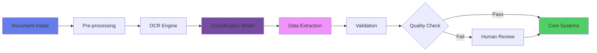

# 📄 Green Path: Clasificación Inteligente de Documentos

## Automatización del Procesamiento Documental con IA

### 📊 Caso de Negocio

**Problema a Resolver:**
- 500,000 documentos procesados manualmente al mes
- 72 horas promedio de procesamiento
- 15% tasa de error en clasificación manual
- $120 MXN costo por documento procesado

**Oportunidad:**
- Automatizar 85% de la clasificación documental
- Reducir tiempo de procesamiento a <5 minutos
- Accuracy del 98% en clasificación
- Extracción automática de datos clave

### 🎯 Métricas de Éxito

| Métrica | Baseline | Target 3M | Target 6M |
|---------|----------|-----------|-----------|
| **Throughput** | 20 docs/hora | 200 docs/hora | 500 docs/hora |
| **Accuracy** | 85% | 95% | 98% |
| **Processing Time** | 72 hrs | 2 hrs | 5 min |
| **Cost per Document** | $120 | $40 | $15 |
| **STP Rate** | 0% | 60% | 85% |
| **ROI Proyectado** | - | 220% | 450% |

## 🚀 Roadmap de Implementación

### Fase 1: Análisis y Diseño (Semanas 1-2)

**Taxonomía de Documentos:**

```python
document_taxonomy = {
    "Onboarding": {
        "IFE/INE": {"volumen": "30%", "campos": ["nombre", "curp", "direccion"]},
        "Comprobante Domicilio": {"volumen": "25%", "campos": ["direccion", "fecha"]},
        "Comprobante Ingresos": {"volumen": "20%", "campos": ["salario", "empresa"]}
    },
    "Créditos": {
        "Solicitudes": {"volumen": "15%", "campos": ["monto", "plazo", "garantias"]},
        "Pagarés": {"volumen": "5%", "campos": ["monto", "fecha", "firmas"]},
        "Avalúos": {"volumen": "3%", "campos": ["valor", "ubicacion", "perito"]}
    },
    "Operaciones": {
        "Contratos": {"volumen": "2%", "campos": ["partes", "clausulas", "vigencia"]},
        "SPEI/Transferencias": {"volumen": "0.5%", "campos": ["origen", "destino", "monto"]}
    }
}
```

**Arquitectura Técnica:**



### Fase 2: Desarrollo del Motor de IA (Semanas 3-6)

**Stack Tecnológico:**

```yaml
ocr_engine:
  primary: Azure Form Recognizer
  fallback: Tesseract OCR
  preprocessing: OpenCV
  
classification:
  model: BERT-based custom model
  training_data: 100,000 labeled documents
  accuracy_target: 98%
  
extraction:
  method: Named Entity Recognition (NER)
  framework: SpaCy + Custom Rules
  validation: Schema-based
  
infrastructure:
  compute: Azure ML Compute
  storage: Azure Blob Storage
  database: CosmosDB
  queue: Service Bus
```

**Pipeline de Procesamiento:**

```python
class DocumentProcessor:
    def __init__(self):
        self.ocr = AzureFormRecognizer()
        self.classifier = DocumentClassifier()
        self.extractor = DataExtractor()
        self.validator = SchemaValidator()
    
    async def process_document(self, document):
        # 1. Pre-procesamiento
        enhanced_doc = await self.preprocess(document)
        
        # 2. OCR con confidence scoring
        ocr_result = await self.ocr.extract_text(
            enhanced_doc,
            confidence_threshold=0.85
        )
        
        # 3. Clasificación multi-label
        classification = await self.classifier.predict(
            text=ocr_result.text,
            image_features=enhanced_doc.features,
            return_probabilities=True
        )
        
        # 4. Extracción específica por tipo
        if classification.confidence > 0.90:
            extracted_data = await self.extractor.extract(
                document_type=classification.primary_class,
                text=ocr_result.text,
                layout=ocr_result.layout
            )
            
            # 5. Validación y enriquecimiento
            validated_data = await self.validator.validate(
                data=extracted_data,
                schema=self.get_schema(classification.primary_class),
                external_validations=True  # CURP, RFC, etc.
            )
            
            return ProcessingResult(
                status="success",
                document_type=classification.primary_class,
                confidence=classification.confidence,
                extracted_data=validated_data,
                processing_time=self.calculate_time()
            )
        else:
            return self.route_to_human_review(document, ocr_result)
```

### Fase 3: Entrenamiento del Modelo (Semanas 7-10)

**Dataset Preparation:**

```python
class DatasetBuilder:
    def prepare_training_data(self):
        # Datos históricos etiquetados
        historical_docs = self.load_historical(
            years=3,
            min_quality_score=0.8
        )
        
        # Augmentation para balance
        augmented_docs = self.augment_dataset(
            historical_docs,
            techniques=[
                "rotation",
                "noise_injection", 
                "perspective_transform",
                "color_variation"
            ]
        )
        
        # Split estratificado
        train, val, test = self.stratified_split(
            augmented_docs,
            ratios=(0.7, 0.15, 0.15),
            ensure_representation=True
        )
        
        return {
            "train": self.create_tfrecords(train),
            "validation": self.create_tfrecords(val),
            "test": self.create_tfrecords(test),
            "class_weights": self.calculate_weights(train)
        }
```

**Training Pipeline:**

```python
model_config = {
    "architecture": "Vision Transformer + BERT",
    "parameters": {
        "vision_encoder": "ViT-Base",
        "text_encoder": "BERT-Spanish",
        "fusion_method": "cross-attention",
        "num_classes": 47,
        "dropout": 0.3
    },
    "training": {
        "epochs": 100,
        "batch_size": 32,
        "learning_rate": 1e-4,
        "optimizer": "AdamW",
        "scheduler": "CosineAnnealingWarmRestarts",
        "early_stopping": 10
    },
    "metrics": [
        "accuracy",
        "f1_macro",
        "precision_per_class",
        "recall_per_class",
        "confusion_matrix"
    ]
}
```

### Fase 4: Piloto con Validación Humana (Semanas 11-14)

**Human-in-the-Loop Strategy:**

```python
class HumanInTheLoopPipeline:
    def __init__(self):
        self.confidence_thresholds = {
            "auto_approve": 0.95,
            "human_review": 0.85,
            "reject": 0.70
        }
        
    def route_document(self, prediction):
        if prediction.confidence >= self.confidence_thresholds["auto_approve"]:
            # Procesamiento automático completo
            return self.auto_process(prediction)
            
        elif prediction.confidence >= self.confidence_thresholds["human_review"]:
            # Revisión humana con pre-población
            review_task = {
                "document": prediction.document_id,
                "suggested_class": prediction.class_name,
                "extracted_fields": prediction.extracted_data,
                "confidence_scores": prediction.field_confidences,
                "priority": self.calculate_priority(prediction)
            }
            return self.queue_for_review(review_task)
            
        else:
            # Rechazo automático con notificación
            return self.reject_and_notify(prediction)
    
    def continuous_learning(self, human_corrections):
        # Retroalimentación para mejora del modelo
        if len(human_corrections) >= 100:
            self.retrain_model(
                corrections=human_corrections,
                method="active_learning"
            )
```

**Dashboard de Monitoreo:**

```python
monitoring_metrics = {
    "operational": {
        "documents_processed": count_per_hour(),
        "average_processing_time": calculate_avg_time(),
        "queue_depth": monitor_backlog(),
        "stp_rate": calculate_straight_through()
    },
    "quality": {
        "accuracy_by_type": track_per_document_type(),
        "false_positive_rate": monitor_fp_rate(),
        "false_negative_rate": monitor_fn_rate(),
        "human_agreement_rate": compare_with_reviews()
    },
    "business": {
        "cost_savings": calculate_monthly_savings(),
        "productivity_gain": measure_throughput_increase(),
        "error_reduction": compare_with_baseline(),
        "compliance_metrics": track_regulatory_requirements()
    }
}
```

### Fase 5: Integración con Sistemas Core (Semanas 15-18)

**Integration Architecture:**

```python
class SystemIntegration:
    def __init__(self):
        self.connectors = {
            "core_banking": CoreBankingAPI(),
            "document_management": DMSConnector(),
            "workflow_engine": BPMIntegration(),
            "data_warehouse": DWHLoader()
        }
    
    async def integrate_document(self, processed_doc):
        # 1. Validación de reglas de negocio
        business_rules = await self.validate_business_rules(
            document_type=processed_doc.type,
            extracted_data=processed_doc.data
        )
        
        if business_rules.passed:
            # 2. Enrutamiento por tipo de documento
            if processed_doc.type in ["IFE", "INE", "Passport"]:
                customer_id = await self.connectors["core_banking"].update_kyc(
                    customer_data=processed_doc.data,
                    document_evidence=processed_doc.url
                )
                
            elif processed_doc.type in ["Income_Proof", "Bank_Statement"]:
                credit_score = await self.calculate_credit_score(
                    financial_data=processed_doc.data
                )
                await self.connectors["core_banking"].update_credit_profile(
                    customer_id=processed_doc.customer_id,
                    score=credit_score
                )
                
            # 3. Archivo en DMS
            archive_result = await self.connectors["document_management"].store(
                document=processed_doc,
                retention_policy=self.get_retention_policy(processed_doc.type),
                encryption=True
            )
            
            # 4. Trigger workflows
            if processed_doc.triggers_workflow:
                await self.connectors["workflow_engine"].start_process(
                    process_name=processed_doc.workflow_name,
                    variables=processed_doc.data
                )
            
            return IntegrationResult(
                status="success",
                systems_updated=list(self.connectors.keys()),
                audit_trail=self.generate_audit_log()
            )
```

## 🔒 Seguridad y Compliance

### Data Privacy & Protection

```python
class SecurityManager:
    def __init__(self):
        self.encryption = AES256Encryption()
        self.tokenizer = DataTokenizer()
        self.audit = AuditLogger()
        
    def process_sensitive_document(self, document):
        # 1. Detección de PII
        pii_elements = self.detect_pii(document)
        
        # 2. Tokenización de datos sensibles
        if pii_elements:
            tokenized_doc = self.tokenizer.tokenize(
                document=document,
                pii_fields=pii_elements,
                preserve_format=True
            )
            
        # 3. Encriptación en reposo
        encrypted_doc = self.encryption.encrypt(
            data=tokenized_doc,
            key_rotation=True
        )
        
        # 4. Audit trail
        self.audit.log(
            action="document_processed",
            document_id=document.id,
            user=self.get_current_user(),
            pii_detected=len(pii_elements) > 0,
            compliance_checks=self.run_compliance_checks()
        )
        
        return SecureDocument(
            encrypted_data=encrypted_doc,
            tokens=self.tokenizer.get_tokens(),
            audit_id=self.audit.get_transaction_id()
        )
```

### Cumplimiento Regulatorio

| Regulación | Requisito | Implementación |
|------------|-----------|----------------|
| **LFPDPPP** | Consentimiento para procesamiento | Validación previa al intake |
| **CNBV** | Trazabilidad completa | Audit log inmutable |
| **ISO 27001** | Controles de acceso | RBAC + MFA |
| **NOM-151** | Conservación de documentos | Retention policies automatizadas |

## 📈 Análisis de ROI

### Modelo Financiero

```python
roi_analysis = {
    "inversión": {
        "desarrollo_modelo": 1_800_000,  # MXN
        "infraestructura": 600_000,
        "licencias_ocr": 400_000,
        "capacitación": 200_000,
        "total": 3_000_000
    },
    "ahorros_anuales": {
        "reducción_fte": 8_500_000,  # Reasignación de 45 FTEs
        "disminución_errores": 2_300_000,  # Menos reprocesos
        "mejora_velocidad": 3_200_000,  # Faster time-to-market
        "total": 14_000_000
    },
    "métricas": {
        "roi_año_1": "367%",
        "payback_period": "3.2 meses",
        "tcr_5_años": 52_000_000,
        "irr": "142%"
    }
}
```

## 🎓 Gestión del Cambio

### Plan de Adopción

```yaml
change_management:
  fase_1_comunicación:
    - Town halls explicando beneficios
    - Demos personalizadas por área
    - FAQs y materiales de soporte
    
  fase_2_capacitación:
    - Operadores: Uso de herramienta de revisión
    - Supervisores: Interpretación de métricas
    - IT: Mantenimiento y troubleshooting
    
  fase_3_adopción:
    - Pilot con early adopters
    - Feedback loops semanales
    - Ajustes basados en retroalimentación
    
  fase_4_escalamiento:
    - Rollout gradual por departamento
    - Champions en cada área
    - Gamification para adopción
```

## 🔄 Evolución y Roadmap Futuro

### Q3-Q4 2024
- Expansión a 20 tipos de documentos adicionales
- Integración con RPA para end-to-end automation
- Multi-language support (EN, PT)

### 2025
- Computer Vision avanzado para documentos manuscritos
- Blockchain para trazabilidad inmutable
- AutoML para optimización continua
- Procesamiento de documentos no estructurados (emails, chats)

## 📚 Recursos y Soporte

### Documentación
- [Guía de Integración API](../../technical/api-documentation.md)
- [Manual de Operación](../../operating/document-classification-manual.md)
- [Best Practices OCR](../../resources/ocr-best-practices.md)

### Herramientas
- [ROI Calculator](../../tools/roi-calculator.md)
- [Document Taxonomy Builder](https://nova-cell.novasolutionsystems.com/tools/taxonomy)
- [Model Performance Dashboard](https://nova-cell.novasolutionsystems.com/dashboards/doc-class)

### Soporte
- **Product Owner**: Laura Jiménez (laura.jimenez@novasolutionsystems.com)
- **ML Engineer Lead**: Roberto Silva (roberto.silva@novasolutionsystems.com)
- **CoE Support**: coe-ia@novasolutionsystems.com

---

**¿Listo para automatizar tu procesamiento documental?**

[Solicitar PoC](mailto:coe-ia@novasolutionsystems.com?subject=PoC%20Document%20Classification){.md-button .md-button--primary}
[Ver Demo](https://nova-cell.novasolutionsystems.com/demos/document-ai){.md-button}

---

*Centro de Excelencia de IA - Transformando el procesamiento documental con inteligencia artificial*