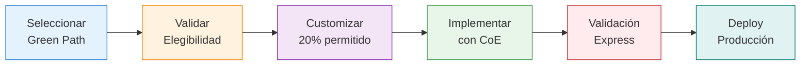

# 🟢 Green Paths - Patrones Preaprobados

    <h2 style="color: white; margin-top: 0;">Acelera tu Implementación con Patrones Validados</h2>
    

        Arquitecturas probadas con controles de gobernanza embebidos que reducen el tiempo a producción en 40%
    

## 🎯 ¿Qué son los Green Paths?

Los **Green Paths** son patrones de implementación de IA que han sido:

✅ **Pre-validados** por arquitectura y seguridad  
✅ **Pre-aprobados** por gobernanza y riesgo  
✅ **Pre-integrados** con la plataforma Nova-Cell  
✅ **Pre-documentados** con guías paso a paso  
✅ **Pre-configurados** con controles y monitoreo  

## 🚀 Beneficios de usar Green Paths

    <strong style="color: #4CAF50; font-size: 2em;">-40%</strong>
    
Reducción tiempo a producción

    <strong style="color: #2196F3; font-size: 2em;">100%</strong>
    
Cumplimiento regulatorio

    <strong style="color: #FF9800; font-size: 2em;">-60%</strong>
    
Menos rework en validación

    <strong style="color: #9C27B0; font-size: 2em;">95%</strong>
    
Tasa de éxito en producción

## 📚 Catálogo de Green Paths Disponibles

### 🤖 Procesamiento de Lenguaje Natural (NLP)

    <h3>💬 RAG Assistant</h3>
    
<strong>Asistente inteligente con conocimiento empresarial</strong>

    
    **Use cases típicos:**
    - Soporte interno (HR, IT, Legal)
    - Atención al cliente
    - Knowledge management
    
    **Stack tecnológico:**
    - LangChain + GPT-4
    - Vector DB (Pinecone/Weaviate)
    - FastAPI + React
    
    **Tiempo a producción:** 4-6 semanas
    
    <a href="rag-assistant/" class="md-button md-button--primary">Ver implementación →</a>

    <h3>📞 Chatbot Call Center</h3>
    
<strong>Automatización inteligente de llamadas</strong>

    
    **Use cases típicos:**
    - Primer nivel de soporte
    - Routing inteligente
    - Transcripción y análisis
    
    **Stack tecnológico:**
    - Dialogflow/Rasa
    - Speech-to-text/Text-to-speech
    - Integración CTI
    
    **Tiempo a producción:** 6-8 semanas
    
    <a href="chatbot-call-center/" class="md-button md-button--primary">Ver implementación →</a>

### 📄 Procesamiento de Documentos

    <h3>📋 Document Classification</h3>
    
<strong>Clasificación automática de documentos</strong>

    
    **Use cases típicos:**
    - Procesamiento de solicitudes
    - Categorización de contratos
    - Routing de correspondencia
    
    **Stack tecnológico:**
    - OCR + NLP
    - BERT fine-tuned
    - Document AI
    
    **Tiempo a producción:** 3-4 semanas
    
    <a href="document-classification/" class="md-button md-button--primary">Ver implementación →</a>

    <h3>📝 Information Extraction</h3>
    
<strong>Extracción estructurada de datos</strong>

    
    **Use cases típicos:**
    - Procesamiento de facturas
    - Extracción de KYC
    - Parsing de contratos
    
    **Stack tecnológico:**
    - LayoutLM/DocTR
    - Named Entity Recognition
    - Form recognizer
    
    **Tiempo a producción:** 4-5 semanas
    
    <a href="information-extraction/" class="md-button md-button--primary">Ver implementación →</a>

### 📊 Analytics & Scoring

    <h3>💳 Credit Scoring IA</h3>
    
<strong>Evaluación crediticia con ML explicable</strong>

    
    **Use cases típicos:**
    - Scoring de crédito
    - Evaluación de riesgo
    - Límites dinámicos
    
    **Stack tecnológico:**
    - XGBoost/LightGBM
    - SHAP para explicabilidad
    - MLflow para tracking
    
    **Tiempo a producción:** 8-10 semanas
    
    <a href="credit-scoring/" class="md-button md-button--primary">Ver implementación →</a>

    <h3>🎯 Next Best Action</h3>
    
<strong>Recomendaciones personalizadas</strong>

    
    **Use cases típicos:**
    - Cross-selling
    - Retención de clientes
    - Marketing personalizado
    
    **Stack tecnológico:**
    - Reinforcement Learning
    - Real-time decisioning
    - A/B testing framework
    
    **Tiempo a producción:** 6-8 semanas
    
    <a href="next-best-action/" class="md-button md-button--primary">Ver implementación →</a>

## ✅ Criterios de Elegibilidad

Para usar un Green Path, tu caso de uso debe:

1. **Alinearse al menos 80%** con el patrón definido
2. **Aceptar los controles** embebidos sin modificación
3. **Usar la plataforma** Nova-Cell como base
4. **Comprometerse con los SLAs** establecidos
5. **Seguir el proceso** de validación estándar

## 🔄 Proceso de Adopción

## 🛡️ Controles Embebidos

Todos los Green Paths incluyen:

    <h4>🔒 Seguridad</h4>
    <ul style="font-size: 0.9em;">
        <li>Encriptación end-to-end</li>
        <li>Control de acceso RBAC</li>
        <li>Audit logging completo</li>
        <li>Data Loss Prevention</li>
    </ul>

    <h4>⚖️ Gobernanza</h4>
    <ul style="font-size: 0.9em;">
        <li>Model cards automáticos</li>
        <li>Lineage tracking</li>
        <li>Bias detection</li>
        <li>Explicabilidad (XAI)</li>
    </ul>

    <h4>📊 Monitoreo</h4>
    <ul style="font-size: 0.9em;">
        <li>Performance metrics</li>
        <li>Data drift detection</li>
        <li>Business KPIs</li>
        <li>Alertas automáticas</li>
    </ul>

    <h4>🔄 MLOps</h4>
    <ul style="font-size: 0.9em;">
        <li>CI/CD pipelines</li>
        <li>A/B testing</li>
        <li>Rollback automático</li>
        <li>Feature store</li>
    </ul>

## 📋 Comparación de Green Paths

| Green Path | Complejidad | Tiempo | Datos Requeridos | ROI Típico | Riesgo |
|------------|-------------|---------|------------------|------------|---------|
| **RAG Assistant** | Media | 4-6 sem | 1000+ docs | 150-200% | Bajo |
| **Chatbot Call Center** | Alta | 6-8 sem | 10K+ llamadas | 200-300% | Medio |
| **Document Classification** | Baja | 3-4 sem | 5000+ docs | 100-150% | Bajo |
| **Information Extraction** | Media | 4-5 sem | 3000+ forms | 150-200% | Bajo |
| **Credit Scoring** | Alta | 8-10 sem | 50K+ registros | 250-400% | Alto |
| **Next Best Action** | Alta | 6-8 sem | 100K+ interacciones | 200-300% | Medio |

## 🚀 Cómo Empezar

    
Pasos para adoptar un Green Path

    <ol>
        <li><strong>Evalúa</strong> tu caso contra nuestro catálogo</li>
        <li><strong>Contacta</strong> al Arquitecto de Adopción para validación</li>
        <li><strong>Revisa</strong> la documentación técnica del patrón</li>
        <li><strong>Inicia</strong> el proyecto con el template predefinido</li>
        <li><strong>Colabora</strong> con el CoE durante la implementación</li>
    </ol>

## 💡 Casos de Éxito

    <h3 style="color: white;">Implementaciones Exitosas</h3>
    
    

        
        

            <h4 style="color: white;">Banca Digital - RAG Assistant</h4>
            

                • 80% reducción en consultas a soporte 
                • 4 semanas de implementación 
                • ROI: $450K/año
            

        

        
        

            <h4 style="color: white;">Operaciones - Document Classification</h4>
            

                • 95% precisión en clasificación 
                • 3 semanas de implementación 
                • ROI: $320K/año
            

        

        
    

## 🤝 Soporte del CoE

Al adoptar un Green Path, recibes:

- ✅ **Template de proyecto** con estructura predefinida
- ✅ **Código base** probado y optimizado
- ✅ **Configuración de infraestructura** as-code
- ✅ **Documentación técnica** y runbooks
- ✅ **Acompañamiento del Arquitecto de Adopción**
- ✅ **Fast-track en validación** MRM
- ✅ **Soporte prioritario** durante implementación

## ❓ Preguntas Frecuentes

??? question "¿Puedo modificar un Green Path?"
    Sí, puedes customizar hasta un 20% del patrón manteniendo los controles core. Modificaciones mayores requieren validación completa.

??? question "¿Qué pasa si mi caso no encaja en ningún Green Path?"
    Trabajaremos contigo en un patrón custom que después puede convertirse en un nuevo Green Path para el banco.

??? question "¿Los Green Paths garantizan aprobación regulatoria?"
    Los Green Paths están pre-validados pero cada implementación debe pasar por el gate de compliance específico para sus datos y contexto.

??? question "¿Cuánto cuesta usar un Green Path?"
    No hay costo adicional. Los Green Paths son parte del servicio del CoE para acelerar la adopción de IA.

---

!!! tip "Próximo paso"
    Explora el **[RAG Assistant Green Path](rag-assistant/)** - nuestro patrón más popular con 12 implementaciones exitosas.