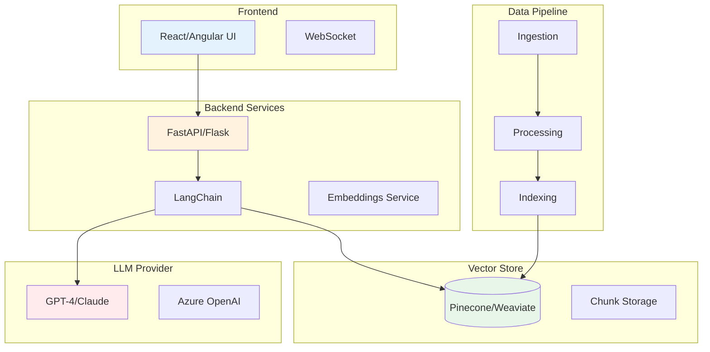

# 💬 RAG Assistant - Green Path

<div class="nova-gradient-bg" style="padding: 2rem; border-radius: 10px; margin-bottom: 2rem;">
    <h2 style="color: white; margin-top: 0;">Implementación de Asistente RAG Empresarial</h2>
    <p style="color: white; font-size: 1.1em; margin-bottom: 0;">
        Patrón validado para crear asistentes inteligentes con conocimiento corporativo
    </p>
</div>

## 📋 Ficha Técnica

<div class="grid cards">

<div class="nova-card-metric">
    <strong>⏱️ Tiempo a Producción</strong>
    <p>4-6 semanas</p>
</div>

<div class="nova-card-metric">
    <strong>💰 ROI Esperado</strong>
    <p>150-200%</p>
</div>

<div class="nova-card-metric">
    <strong>🎯 Precisión Típica</strong>
    <p>92-95%</p>
</div>

<div class="nova-card-metric">
    <strong>📊 Casos Implementados</strong>
    <p>12 exitosos</p>
</div>

</div>

## 🎯 Casos de Uso Aprobados

Este Green Path está pre-aprobado para:

✅ **Soporte interno** (HR, IT, Legal, Finanzas)  
✅ **Atención al cliente** (FAQ, consultas de productos)  
✅ **Knowledge Management** (documentación técnica, políticas)  
✅ **Asistentes especializados** (análisis, recomendaciones)  
✅ **Onboarding** (capacitación, guías interactivas)  

## 🏗️ Arquitectura de Referencia



## 📦 Stack Tecnológico Validado

### Core Components
- **LLM Framework:** LangChain 0.1.x
- **LLM Provider:** Azure OpenAI (GPT-4) / Anthropic Claude
- **Vector Database:** Pinecone / Weaviate / Qdrant
- **Backend:** FastAPI + Pydantic
- **Frontend:** React + TypeScript
- **Embeddings:** OpenAI Ada-002 / Cohere

### Infrastructure
- **Compute:** Azure Container Instances / AKS
- **Storage:** Azure Blob Storage
- **Monitoring:** Application Insights + Grafana
- **Security:** Azure Key Vault + API Management

## 🚀 Plan de Implementación

### Semana 1-2: Setup y Data Preparation

<div class="nova-card-feature">
    <h4>Actividades:</h4>
    <ul>
        <li>✅ Provisioning de infraestructura con Terraform</li>
        <li>✅ Setup de ambiente de desarrollo</li>
        <li>✅ Recolección y análisis de documentos</li>
        <li>✅ Definición de taxonomía y metadata</li>
    </ul>
    
    <h4>Entregables:</h4>
    <ul>
        <li>Ambiente configurado</li>
        <li>Documentos procesados (min 1000)</li>
        <li>Pipeline de ingesta funcionando</li>
    </ul>
</div>

### Semana 3-4: Desarrollo Core

<div class="nova-card-feature">
    <h4>Actividades:</h4>
    <ul>
        <li>✅ Implementación de RAG pipeline</li>
        <li>✅ Fine-tuning de prompts</li>
        <li>✅ Desarrollo de API REST</li>
        <li>✅ Integración con sistemas empresariales</li>
    </ul>
    
    <h4>Entregables:</h4>
    <ul>
        <li>RAG pipeline funcional</li>
        <li>API documentada con Swagger</li>
        <li>Suite de pruebas automatizadas</li>
    </ul>
</div>

### Semana 5-6: Validación y Deployment

<div class="nova-card-feature">
    <h4>Actividades:</h4>
    <ul>
        <li>✅ Testing con usuarios piloto</li>
        <li>✅ Validación de seguridad y compliance</li>
        <li>✅ Deployment a producción</li>
        <li>✅ Configuración de monitoreo</li>
    </ul>
    
    <h4>Entregables:</h4>
    <ul>
        <li>Reporte de UAT</li>
        <li>Certificación de seguridad</li>
        <li>Sistema en producción</li>
        <li>Dashboards de monitoreo</li>
    </ul>
</div>

## 🛡️ Controles de Gobernanza Embebidos

### Seguridad
```yaml
security_controls:
  encryption:
    - at_rest: AES-256
    - in_transit: TLS 1.3
  authentication:
    - method: OAuth 2.0 / SAML
    - mfa: Required for admin
  authorization:
    - model: RBAC
    - granularity: Document level
  audit:
    - all_queries: Logged
    - retention: 90 days
  data_protection:
    - pii_detection: Enabled
    - dlp_rules: Configured
```

### Compliance
```yaml
compliance_controls:
  model_governance:
    - model_card: Auto-generated
    - version_control: Git + MLflow
    - approval_workflow: MRM gate
  data_governance:
    - lineage_tracking: Enabled
    - consent_management: Integrated
    - retention_policies: Configured
  monitoring:
    - bias_detection: Continuous
    - drift_detection: Daily
    - performance_metrics: Real-time
```

## 📊 Métricas y KPIs

### Métricas Técnicas
| Métrica | Target | Alerta |
|---------|--------|--------|
| **Latencia P95** | <2s | >3s |
| **Disponibilidad** | 99.9% | <99.5% |
| **Precisión** | >92% | <85% |
| **Tokens/día** | <1M | >1.5M |

### Métricas de Negocio
| Métrica | Target | Medición |
|---------|--------|----------|
| **Consultas resueltas** | >80% | Diario |
| **Satisfacción usuario** | >4.2/5 | Semanal |
| **Reducción tickets** | >40% | Mensual |
| **ROI** | >150% | Trimestral |

## 💻 Código Base y Templates

### Estructura del Proyecto
```
rag-assistant/
├── .github/workflows/     # CI/CD pipelines
├── infrastructure/        # Terraform/ARM templates
│   ├── main.tf
│   ├── variables.tf
│   └── outputs.tf
├── backend/              # FastAPI application
│   ├── app/
│   │   ├── main.py
│   │   ├── chains/      # LangChain logic
│   │   ├── models/      # Pydantic models
│   │   └── utils/
│   └── tests/
├── frontend/             # React application
│   ├── src/
│   └── public/
├── data-pipeline/        # Ingestion scripts
│   ├── ingest.py
│   ├── process.py
│   └── index.py
├── monitoring/           # Dashboards & alerts
│   ├── grafana/
│   └── alerts/
└── docs/                # Documentation
```

### Ejemplo de Implementación

```python
# backend/app/chains/rag_chain.py
from langchain.chains import RetrievalQA
from langchain.embeddings import OpenAIEmbeddings
from langchain.vectorstores import Pinecone
from langchain.llms import AzureOpenAI

class RAGAssistant:
    def __init__(self, config):
        self.embeddings = OpenAIEmbeddings(
            deployment=config.EMBEDDING_MODEL
        )
        self.vectorstore = Pinecone(
            index_name=config.INDEX_NAME,
            embedding=self.embeddings
        )
        self.llm = AzureOpenAI(
            deployment_name=config.LLM_MODEL,
            temperature=0.7
        )
        self.qa_chain = RetrievalQA.from_chain_type(
            llm=self.llm,
            retriever=self.vectorstore.as_retriever(
                search_kwargs={"k": 5}
            ),
            return_source_documents=True
        )
    
    async def query(self, question: str, context: dict = None):
        """Process user query with RAG pipeline"""
        # Add guardrails
        if self._contains_pii(question):
            return self._handle_pii_query()
        
        # Execute chain
        result = await self.qa_chain.arun(question)
        
        # Log for audit
        self._log_query(question, result, context)
        
        return result
```

## 🔧 Configuración Requerida

### Variables de Entorno
```bash
# .env.example
AZURE_OPENAI_ENDPOINT=https://your-instance.openai.azure.com
AZURE_OPENAI_KEY=your-api-key
PINECONE_API_KEY=your-pinecone-key
PINECONE_ENVIRONMENT=us-west1-gcp
APPLICATION_INSIGHTS_KEY=your-app-insights-key
```

### Configuración de Seguridad
```yaml
# config/security.yaml
rate_limiting:
  requests_per_minute: 60
  tokens_per_day: 1000000

content_filtering:
  enable_pii_detection: true
  enable_profanity_filter: true
  blocked_topics:
    - personal_finance
    - medical_advice
    - legal_counsel

access_control:
  require_authentication: true
  allowed_domains:
    - banco.mx
  role_permissions:
    user:
      - read
      - query
    admin:
      - read
      - query
      - configure
      - monitor
```

## 📈 Casos de Éxito Implementados

<div class="nova-card" style="background: linear-gradient(135deg, #667eea 0%, #764ba2 100%); padding: 2rem;">
    <h3 style="color: white;">HR Assistant - Recursos Humanos</h3>
    <div style="display: grid; grid-template-columns: 1fr 1fr; gap: 2rem; margin-top: 1rem;">
        <div>
            <p style="color: white;"><strong>Contexto:</strong></p>
            <ul style="color: rgba(255,255,255,0.9);">
                <li>15,000 empleados</li>
                <li>500+ políticas y procedimientos</li>
                <li>2000+ consultas/mes</li>
            </ul>
        </div>
        <div>
            <p style="color: white;"><strong>Resultados:</strong></p>
            <ul style="color: rgba(255,255,255,0.9);">
                <li>75% reducción en tickets HR</li>
                <li>Respuesta promedio: 1.2 segundos</li>
                <li>ROI: $380K/año</li>
            </ul>
        </div>
    </div>
</div>

## ⚠️ Consideraciones y Limitaciones

<div class="admonition warning">
    <p class="admonition-title">Limitaciones del Green Path</p>
    <ul>
        <li>Máximo 10M tokens/mes incluidos</li>
        <li>Documentos solo en español e inglés</li>
        <li>No apto para datos sensibles nivel 4</li>
        <li>Requiere mínimo 1000 documentos para entrenamiento</li>
        <li>No incluye voice interface (requiere extensión)</li>
    </ul>
</div>

## 🚀 Quick Start

```bash
# 1. Clonar template
git clone https://github.com/banco/rag-assistant-template.git
cd rag-assistant-template

# 2. Configurar ambiente
cp .env.example .env
# Editar .env con tus credenciales

# 3. Instalar dependencias
pip install -r requirements.txt
npm install

# 4. Inicializar infraestructura
cd infrastructure
terraform init
terraform plan
terraform apply

# 5. Ejecutar pipeline de datos
python data-pipeline/ingest.py --source docs/
python data-pipeline/index.py

# 6. Lanzar aplicación
cd backend
uvicorn app.main:app --reload

# 7. Acceder a UI
open http://localhost:3000
```

## 📚 Recursos Adicionales

- 📖 [Documentación completa en Confluence](https://confluence.banco.mx/rag-assistant)
- 🎥 [Video tutorial paso a paso](https://learning.banco.mx/rag-tutorial)
- 💬 [Canal Teams de soporte](https://teams.microsoft.com/l/channel/rag-support)
- 🐛 [Reportar issues](https://jira.banco.mx/rag-assistant)

## 🤝 Soporte del CoE

<div class="nova-card-feature">
    <h3>Tu Arquitecto de Adopción te acompañará en:</h3>
    <ul>
        <li>✅ Revisión inicial de requerimientos</li>
        <li>✅ Sesiones de diseño de solución</li>
        <li>✅ Code reviews semanales</li>
        <li>✅ Apoyo en gates de validación</li>
        <li>✅ Troubleshooting y optimización</li>
    </ul>
    
    <a href="../../servicios/solicitar-apoyo/" class="md-button md-button--primary">
        Solicitar Arquitecto de Adopción →
    </a>
</div>

---

!!! success "Ready to start?"
    Este Green Path está listo para usar. Contacta al CoE para iniciar tu implementación con acompañamiento experto.