# 🗺️ Journey de Adopción de IA

    <h2 style="color: white; margin-top: 0;">Tu Camino hacia la IA Empresarial</h2>
    

        6 etapas probadas para implementar IA de forma responsable y escalable en banca
    

## 📍 ¿Dónde estás en el journey?

```mermaid
graph LR
    A[🔍 Explorar] --> B[🧪 Experimentar]
    B --> C[🔨 Construir]
    C --> D[✅ Validar]
    D --> E[🚀 Desplegar]
    E --> F[📈 Escalar]
    
    style A fill:#E3F2FD,stroke:#1976D2,stroke-width:2px
    style B fill:#FFF3E0,stroke:#F57C00,stroke-width:2px
    style C fill:#F3E5F5,stroke:#7B1FA2,stroke-width:2px
    style D fill:#E8F5E9,stroke:#388E3C,stroke-width:2px
    style E fill:#FFEBEE,stroke:#C62828,stroke-width:2px
    style F fill:#E0F2F1,stroke:#00796B,stroke-width:2px
```

## 🎯 Las 6 Etapas del Journey

<!-- ETAPA 1: EXPLORAR -->

    <h3>1️⃣ Explorar</h3>
    
<strong>Objetivo:</strong> Identificar oportunidades y evaluar viabilidad

    
    <h4>✅ Actividades clave:</h4>
    <ul>
        <li>Mapeo de casos de uso potenciales</li>
        <li>Evaluación de madurez (AISIA)</li>
        <li>Análisis de data readiness</li>
        <li>Estimación de ROI</li>
    </ul>
    
    <h4>📋 Entregables:</h4>
    <ul>
        <li>Business case documentado</li>
        <li>Assessment de viabilidad</li>
        <li>Roadmap preliminar</li>
    </ul>
    
    <h4>⏱️ Duración típica:</h4>
    
1-2 semanas

    
    <h4>🛠️ Herramientas:</h4>
    <ul>
        <li><a href="../../recursos/herramientas/aisia-assessment/">AISIA Assessment</a></li>
        <li><a href="../../recursos/herramientas/roi-calculator/">Calculadora ROI</a></li>
        <li><a href="../../recursos/herramientas/opportunity-radar/">Opportunity Radar</a></li>
    </ul>
    
    <a href="explorar/" class="md-button md-button--primary">Ver detalles →</a>

<!-- ETAPA 2: EXPERIMENTAR -->

    <h3>2️⃣ Experimentar</h3>
    
<strong>Objetivo:</strong> Validar hipótesis con PoC rápido

    
    <h4>✅ Actividades clave:</h4>
    <ul>
        <li>Setup ambiente sandbox</li>
        <li>Desarrollo de PoC</li>
        <li>Evaluación de modelos</li>
        <li>Benchmarking de soluciones</li>
    </ul>
    
    <h4>📋 Entregables:</h4>
    <ul>
        <li>PoC funcional</li>
        <li>Métricas de performance</li>
        <li>Reporte de viabilidad técnica</li>
    </ul>
    
    <h4>⏱️ Duración típica:</h4>
    
2-4 semanas

    
    <h4>🛠️ Herramientas:</h4>
    <ul>
        <li><a href="../../servicios/plataforma/nova-cell/">Nova-Cell Sandbox</a></li>
        <li><a href="../../recursos/conocimiento/knowledge-hub-guide/">Langfuse (experimentos)</a></li>
        <li>Jupyter Notebooks</li>
    </ul>
    
    <a href="experimentar/" class="md-button md-button--primary">Ver detalles →</a>

<!-- ETAPA 3: CONSTRUIR -->

    <h3>3️⃣ Construir</h3>
    
<strong>Objetivo:</strong> Desarrollar solución production-ready

    
    <h4>✅ Actividades clave:</h4>
    <ul>
        <li>Arquitectura de solución</li>
        <li>Desarrollo con mejores prácticas</li>
        <li>Implementación de pipelines MLOps</li>
        <li>Integración con sistemas</li>
    </ul>
    
    <h4>📋 Entregables:</h4>
    <ul>
        <li>Código production-ready</li>
        <li>Documentación técnica</li>
        <li>Pipelines CI/CD</li>
        <li>Model card</li>
    </ul>
    
    <h4>⏱️ Duración típica:</h4>
    
6-10 semanas

    
    <h4>🛠️ Herramientas:</h4>
    <ul>
        <li><a href="../green-paths/">Green Paths (patrones)</a></li>
        <li>GitHub Enterprise</li>
        <li>Azure DevOps</li>
        <li>Backstage (catálogo)</li>
    </ul>
    
    <a href="construir/" class="md-button md-button--primary">Ver detalles →</a>

<!-- ETAPA 4: VALIDAR -->

    <h3>4️⃣ Validar</h3>
    
<strong>Objetivo:</strong> Asegurar cumplimiento y robustez

    
    <h4>✅ Actividades clave:</h4>
    <ul>
        <li>Validación MRM</li>
        <li>Testing de fairness y bias</li>
        <li>Evaluación de privacidad</li>
        <li>Red teaming y stress testing</li>
    </ul>
    
    <h4>📋 Entregables:</h4>
    <ul>
        <li>Certificación MRM</li>
        <li>Reporte de explicabilidad</li>
        <li>Análisis de riesgos</li>
        <li>Aprobación de gobernanza</li>
    </ul>
    
    <h4>⏱️ Duración típica:</h4>
    
2-3 semanas

    
    <h4>🛠️ Herramientas:</h4>
    <ul>
        <li><a href="../../gobernanza/procedimiento-validacion-modelos/">Framework MRM</a></li>
        <li>LIME/SHAP (XAI)</li>
        <li>Fairlearn</li>
        <li>Adversarial testing tools</li>
    </ul>
    
    <a href="validar/" class="md-button md-button--primary">Ver detalles →</a>

<!-- ETAPA 5: DESPLEGAR -->

    <h3>5️⃣ Desplegar</h3>
    
<strong>Objetivo:</strong> Llevar a producción de forma segura

    
    <h4>✅ Actividades clave:</h4>
    <ul>
        <li>Deployment con human-in-the-loop</li>
        <li>Configuración de monitoreo</li>
        <li>Setup de alertas y rollback</li>
        <li>Capacitación de usuarios</li>
    </ul>
    
    <h4>📋 Entregables:</h4>
    <ul>
        <li>Modelo en producción</li>
        <li>Dashboard de monitoreo</li>
        <li>Runbooks operativos</li>
        <li>Plan de contingencia</li>
    </ul>
    
    <h4>⏱️ Duración típica:</h4>
    
1-2 semanas

    
    <h4>🛠️ Herramientas:</h4>
    <ul>
        <li>Kubernetes/OpenShift</li>
        <li>Prometheus/Grafana</li>
        <li>Azure Monitor</li>
        <li>Feature flags</li>
    </ul>
    
    <a href="desplegar/" class="md-button md-button--primary">Ver detalles →</a>

<!-- ETAPA 6: ESCALAR -->

    <h3>6️⃣ Escalar</h3>
    
<strong>Objetivo:</strong> Optimizar y expandir el impacto

    
    <h4>✅ Actividades clave:</h4>
    <ul>
        <li>Optimización de performance</li>
        <li>Expansión a nuevos canales</li>
        <li>Reentrenamiento y mejora continua</li>
        <li>Medición de impacto de negocio</li>
    </ul>
    
    <h4>📋 Entregables:</h4>
    <ul>
        <li>Métricas de impacto</li>
        <li>Plan de escalamiento</li>
        <li>Lecciones aprendidas</li>
        <li>Patrones reutilizables</li>
    </ul>
    
    <h4>⏱️ Duración típica:</h4>
    
Continuo

    
    <h4>🛠️ Herramientas:</h4>
    <ul>
        <li><a href="../../metricas/dashboard-impact/">Dashboard IMPACT</a></li>
        <li>A/B testing platform</li>
        <li>AutoML tools</li>
        <li>Cost optimization tools</li>
    </ul>
    
    <a href="escalar/" class="md-button md-button--primary">Ver detalles →</a>

## 🚦 Gates y Controles por Etapa

```mermaid
graph TD
    subgraph "Gates de Control"
        G1[Gate 1: Viabilidad] 
        G2[Gate 2: Técnico]
        G3[Gate 3: Arquitectura]
        G4[Gate 4: Compliance]
        G5[Gate 5: Producción]
        G6[Gate 6: Valor]
    end
    
    subgraph "Responsables"
        R1[Product Owner + CoE]
        R2[Tech Lead + CoE]
        R3[Arquitectura + Seguridad]
        R4[MRM + Legal + Risk]
        R5[Operaciones + CoE]
        R6[Negocio + Finanzas]
    end
    
    G1 --> R1
    G2 --> R2
    G3 --> R3
    G4 --> R4
    G5 --> R5
    G6 --> R6
```

## 📊 Métricas Clave por Etapa

| Etapa | KPIs Principales | Target | Responsable |
|-------|-----------------|---------|-------------|
| **Explorar** | % Casos viables | >60% | Product Owner |
| **Experimentar** | Tiempo a PoC | <15 días | Tech Lead |
| **Construir** | Velocity (story points) | >40/sprint | Scrum Master |
| **Validar** | % Aprobación MRM | >95% | Risk Manager |
| **Desplegar** | Disponibilidad | >99.9% | SRE |
| **Escalar** | ROI realizado | >150% | Product Owner |

## 🎯 Factores de Éxito

    
Claves para un journey exitoso

    <ul>
        <li>✅ <strong>Sponsor ejecutivo</strong> comprometido desde el inicio</li>
        <li>✅ <strong>Equipo multidisciplinario</strong> con dedicación adecuada</li>
        <li>✅ <strong>Data de calidad</strong> disponible y gobernada</li>
        <li>✅ <strong>Caso de uso bien definido</strong> con métricas claras</li>
        <li>✅ <strong>Adopción de usuarios</strong> mediante change management</li>
        <li>✅ <strong>Arquitecto de Adopción</strong> como guía en cada etapa</li>
    </ul>

## 🚨 Riesgos Comunes y Mitigación

    
Principales riesgos en el journey

    
| Riesgo | Probabilidad | Impacto | Mitigación |
|--------|--------------|---------|------------|
| **Datos insuficientes/mala calidad** | Alta | Alto | Data profiling temprano + Data quality gates |
| **Resistencia al cambio** | Media | Alto | Change management + Quick wins |
| **Complejidad técnica subestimada** | Media | Medio | PoC iterativo + Arquitecto de Adopción |
| **Incumplimiento regulatorio** | Baja | Alto | Gobernanza embebida + Validación continua |
| **Drift del modelo** | Media | Medio | Monitoreo continuo + Reentrenamiento |

## 🤝 Tu Socio en el Journey

    <h3 style="color: white;">🏗️ El Arquitecto de Adopción</h3>
    
Tu guía experto en cada etapa del journey

    
    

        

            <h4 style="color: white;">En cada Gate:</h4>
            <ul style="color: white;">
                <li>Revisa criterios de éxito</li>
                <li>Identifica riesgos</li>
                <li>Facilita aprobaciones</li>
            </ul>
        

        

            <h4 style="color: white;">Durante el Journey:</h4>
            <ul style="color: white;">
                <li>Conecta con expertos</li>
                <li>Provee mejores prácticas</li>
                <li>Acelera resolución de bloqueadores</li>
            </ul>
        

    

    
    <a href="../../servicios/arquitecto-adopcion/" class="md-button" style="background: white; color: #667eea; margin-top: 1rem;">
        Conoce más sobre este rol →
    </a>

## 📈 Tracking del Journey

    <h3>🎯 Tu progreso actual</h3>
    
    

        
<strong>Proyecto:</strong> [Nombre del proyecto]

        
<strong>Etapa actual:</strong> [Etapa]

        
<strong>Progreso:</strong>

        

            

                45%
            

        

        
<strong>Próximo gate:</strong> Validación MRM (en 5 días)

    

    
    <a href="../../metricas/mi-proyecto/" class="md-button md-button--primary">Ver dashboard completo →</a>

## 🚀 Acelera tu Journey

    <h4>🟢 Green Paths</h4>
    
Patrones preaprobados que reducen tiempo a producción en 40%

    <a href="../green-paths/">Explorar patrones →</a>

    <h4>📚 Playbooks</h4>
    
Guías detalladas basadas en casos exitosos del banco

    <a href="../../recursos/conocimiento/playbooks/">Ver playbooks →</a>

    <h4>🎓 Formación</h4>
    
Capacitación específica por rol y etapa

    <a href="../../recursos/academia/">Ver cursos →</a>

    <h4>🛠️ Herramientas</h4>
    
Stack tecnológico listo para usar

    <a href="../../recursos/herramientas/">Ver herramientas →</a>

---

!!! info "Siguiente paso"
    Comienza explorando la **[Etapa 1: Explorar](explorar/)** para identificar y evaluar tu caso de uso de IA.