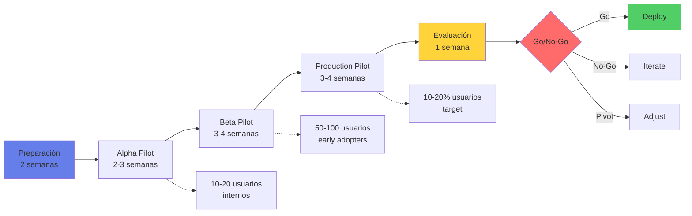
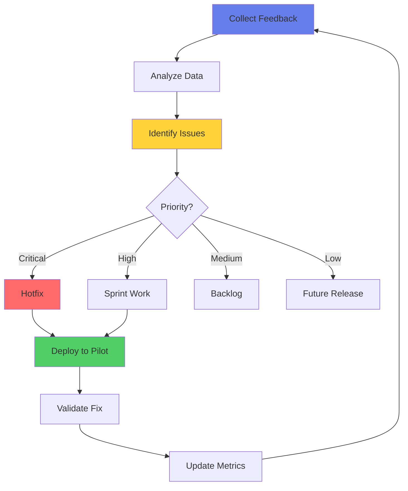

# ✅ Etapa 4: Validar

## 🎯 Objetivo de la Etapa

Ejecutar un piloto controlado del MVP en un ambiente real con usuarios seleccionados, validando que la solución cumple con los objetivos de negocio, métricas de performance y criterios de aceptación antes del despliegue completo.

### Duración Típica
- **8-12 semanas** para piloto estándar
- **4-6 semanas** para validación acelerada (Tier 3-4)
- **12-16 semanas** para sistemas críticos con múltiples fases

### Entregables Clave
1. 📊 Reporte de resultados del piloto
2. ✅ Métricas de éxito validadas
3. 📈 ROI real vs proyectado
4. 🎯 Feedback consolidado de usuarios
5. 🔧 Lista de mejoras priorizadas
6. 📋 Plan de despliegue completo
7. ✍️ Sign-off para producción

## 📥 Inputs desde Etapa Construir

### Pre-requisitos del MVP
- ✅ **MVP funcional** en ambiente pre-producción
- ✅ **Documentación completa** (técnica y usuario)
- ✅ **Training materials** preparados
- ✅ **Monitoring dashboards** operacionales
- ✅ **Support procedures** establecidos
- ✅ **Baseline metrics** capturadas
- ✅ **Risk register** actualizado
- ✅ **Pilot execution plan** aprobado

## 🚀 Estrategia de Validación

### Fases del Piloto



### Matriz de Validación por Fase

| Fase | Usuarios | Duración | Focus | Criterios de Éxito |
|------|----------|----------|-------|-------------------|
| **Alpha** | 10-20 internos | 2-3 sem | Funcionalidad, bugs | • Zero bugs críticos<br>• Core features work<br>• Feedback positivo |
| **Beta** | 50-100 early adopters | 3-4 sem | Usabilidad, performance | • NPS >40<br>• <5 bugs altos<br>• SLAs cumplidos |
| **Production** | 10-20% target | 3-4 sem | Impacto negocio, escala | • ROI medible<br>• Adoption >70%<br>• Métricas negocio |

## 📊 Framework de Métricas

### Pirámide de Métricas de Validación

```python
class ValidationMetrics:
    def __init__(self):
        self.levels = {
            "L1_Technical": {
                "latency": {"target": "<2s p95", "weight": 0.15},
                "availability": {"target": ">99.5%", "weight": 0.10},
                "error_rate": {"target": "<1%", "weight": 0.10},
                "throughput": {"target": ">100 req/s", "weight": 0.05}
            },
            "L2_Model": {
                "accuracy": {"target": ">85%", "weight": 0.15},
                "fairness": {"target": "DI >0.8", "weight": 0.10},
                "drift": {"target": "PSI <0.2", "weight": 0.05},
                "explainability": {"target": "100% decisions", "weight": 0.05}
            },
            "L3_User": {
                "satisfaction": {"target": "NPS >50", "weight": 0.10},
                "adoption": {"target": ">75%", "weight": 0.10},
                "task_completion": {"target": ">90%", "weight": 0.05},
                "time_saved": {"target": ">30%", "weight": 0.05}
            },
            "L4_Business": {
                "roi": {"target": ">150%", "weight": 0.20},
                "cost_reduction": {"target": ">20%", "weight": 0.15},
                "revenue_impact": {"target": "+10%", "weight": 0.15},
                "risk_reduction": {"target": ">25%", "weight": 0.10}
            }
        }
    
    def calculate_validation_score(self, measurements):
        """Calcula score ponderado de validación"""
        total_score = 0
        for level, metrics in self.levels.items():
            for metric, config in metrics.items():
                actual = measurements.get(f"{level}.{metric}")
                target = config["target"]
                weight = config["weight"]
                
                # Normalizar y ponderar
                score = self.normalize_metric(actual, target)
                total_score += score * weight
                
        return total_score  # 0-100
```

### Tracking Dashboard

| Métrica | Baseline | Target | Actual | Status | Trend |
|---------|----------|--------|--------|--------|-------|
| **Accuracy** | 75% | 85% | ? | ? | ? |
| **Latency P95** | 3s | 2s | ? | ? | ? |
| **NPS Score** | 30 | 50 | ? | ? | ? |
| **Cost per Transaction** | $10 | $7 | ? | ? | ? |
| **Adoption Rate** | 0% | 75% | ? | ? | ? |

## 👥 User Validation Process

### Structured User Feedback Collection

```yaml
user_validation:
  recruitment:
    alpha:
      - internal_champions: 5
      - power_users: 10
      - skeptics: 5  # Crítico incluir
    
    beta:
      - early_adopters: 30
      - regular_users: 50
      - new_users: 20
    
  feedback_methods:
    quantitative:
      - surveys: "Weekly pulse + final"
      - analytics: "Usage patterns tracking"
      - task_timing: "Before/after comparison"
      - error_tracking: "Automated logging"
    
    qualitative:
      - interviews: "30-min structured"
      - focus_groups: "Weekly sessions"
      - observation: "Task shadowing"
      - diary_studies: "Daily logs"
    
  feedback_loops:
    daily:
      - bug_reports: "Immediate triage"
      - critical_issues: "24hr resolution"
    
    weekly:
      - feature_requests: "Prioritization meeting"
      - usability_issues: "UX team review"
    
    sprint:
      - major_changes: "Backlog grooming"
      - roadmap_updates: "Stakeholder review"
```

### User Acceptance Criteria

```python
# UAT Validation Framework
uat_criteria = {
    "functional_acceptance": {
        "all_features_working": {"required": True, "threshold": 100},
        "integration_points": {"required": True, "threshold": 100},
        "data_accuracy": {"required": True, "threshold": 99},
        "security_controls": {"required": True, "threshold": 100}
    },
    "performance_acceptance": {
        "response_time": {"required": True, "threshold": "< SLA"},
        "concurrent_users": {"required": True, "threshold": "> target"},
        "data_volume": {"required": True, "threshold": "production-like"},
        "stability": {"required": True, "threshold": "99.5% uptime"}
    },
    "usability_acceptance": {
        "task_completion": {"required": True, "threshold": 90},
        "error_rate": {"required": False, "threshold": 5},
        "time_to_learn": {"required": False, "threshold": "< 2 hours"},
        "satisfaction": {"required": True, "threshold": "NPS > 40"}
    },
    "business_acceptance": {
        "roi_evidence": {"required": True, "threshold": "positive"},
        "process_improvement": {"required": True, "threshold": "measurable"},
        "risk_mitigation": {"required": True, "threshold": "documented"},
        "compliance": {"required": True, "threshold": "verified"}
    }
}
```

## 🔬 A/B Testing Strategy

### Experiment Design for Banking AI

```python
class ABTestingFramework:
    def __init__(self, model_name, tier):
        self.model_name = model_name
        self.tier = tier
        self.min_sample_size = self.calculate_sample_size()
        
    def setup_experiment(self):
        """Configura experimento A/B para validación"""
        return {
            "design": {
                "type": "randomized_controlled_trial",
                "allocation": "50/50" if self.tier > 2 else "80/20",
                "stratification": ["customer_segment", "risk_profile"],
                "duration": "4 weeks minimum"
            },
            "control_group": {
                "treatment": "existing_process",
                "size": self.min_sample_size,
                "monitoring": "standard"
            },
            "treatment_group": {
                "treatment": "ai_solution",
                "size": self.min_sample_size,
                "monitoring": "enhanced"
            },
            "metrics": {
                "primary": ["conversion_rate", "processing_time"],
                "secondary": ["customer_satisfaction", "error_rate"],
                "guardrail": ["fraud_rate", "compliance_violations"]
            },
            "analysis": {
                "statistical_test": "t-test/chi-square",
                "significance_level": 0.05,
                "power": 0.80,
                "minimum_detectable_effect": 0.05
            }
        }
    
    def calculate_sample_size(self):
        """Calcula tamaño de muestra requerido"""
        # Simplified - use proper power analysis
        base_size = 1000
        tier_multiplier = {1: 5, 2: 3, 3: 2, 4: 1}
        return base_size * tier_multiplier.get(self.tier, 1)
```

### Experiment Tracking

| Métrica | Control (A) | Treatment (B) | Diferencia | P-value | Significativo |
|---------|-------------|---------------|------------|---------|---------------|
| **Conversion Rate** | 15% | 18% | +3pp | 0.02 | ✅ Sí |
| **Processing Time** | 120s | 45s | -62.5% | 0.001 | ✅ Sí |
| **Error Rate** | 5% | 3% | -2pp | 0.08 | ❌ No |
| **Satisfaction** | 3.5/5 | 4.2/5 | +0.7 | 0.01 | ✅ Sí |

## 🛡️ Risk Validation

### Risk Assessment Matrix

```python
risk_validation = {
    "operational_risks": {
        "system_failure": {
            "probability": "low",
            "impact": "high",
            "mitigation": "Fallback to manual process",
            "validation": "Chaos engineering tests"
        },
        "user_resistance": {
            "probability": "medium",
            "impact": "medium",
            "mitigation": "Change management program",
            "validation": "Adoption metrics tracking"
        },
        "integration_issues": {
            "probability": "medium",
            "impact": "high",
            "mitigation": "Phased rollout",
            "validation": "Integration tests daily"
        }
    },
    "model_risks": {
        "performance_degradation": {
            "probability": "medium",
            "impact": "high",
            "mitigation": "Continuous monitoring",
            "validation": "Daily performance checks"
        },
        "bias_amplification": {
            "probability": "low",
            "impact": "very_high",
            "mitigation": "Fairness constraints",
            "validation": "Weekly fairness audits"
        },
        "adversarial_attacks": {
            "probability": "low",
            "impact": "high",
            "mitigation": "Input validation",
            "validation": "Red team exercises"
        }
    },
    "compliance_risks": {
        "regulatory_violation": {
            "probability": "very_low",
            "impact": "critical",
            "mitigation": "Compliance checks",
            "validation": "Legal review weekly"
        },
        "data_breach": {
            "probability": "very_low",
            "impact": "critical",
            "mitigation": "Security controls",
            "validation": "Security audits",
            "financial_impact": "$100M+ MXN"
        }
    },
    "third_party_risks": {
        "vendor_failure": {
            "probability": "low",
            "impact": "high",
            "mitigation": "Multi-vendor strategy",
            "validation": "Vendor audits quarterly"
        },
        "data_residency": {
            "probability": "low",
            "impact": "very_high",
            "mitigation": "Mexico-only processing",
            "validation": "Infrastructure audit"
        }
    },
    "model_governance": {
        "framework": "Bank's Model Risk Management (MRM)",
        "independent_validation": "Required for Tier 1-2",
        "review_frequency": "Quarterly for Tier 1, Semi-annual for Tier 2",
        "stress_testing": "Required for credit and fraud models"
    }
}
```

### Contingency Plans

| Scenario | Trigger | Action | Owner | Timeline |
|----------|---------|--------|-------|----------|
| **Performance Degradation** | Accuracy <80% | Rollback to previous version | ML Team | <1 hour |
| **High Error Rate** | Errors >5% | Switch to manual review | Ops Team | Immediate |
| **User Rejection** | Adoption <30% | Enhanced training program | Product | 1 week |
| **Regulatory Concern** | Compliance flag | Pause pilot | Legal | Immediate |
| **Security Incident** | Any breach | Full stop & investigation | CISO | Immediate |

## 📈 Business Impact Validation

### ROI Calculation Framework

```python
class ROIValidation:
    def __init__(self, pilot_data):
        self.pilot_data = pilot_data
        self.baseline = self.get_baseline_metrics()
        
    def calculate_actual_roi(self):
        """Calcula ROI real basado en datos del piloto"""
        
        # Beneficios cuantificables
        benefits = {
            "cost_savings": {
                "labor_reduction": self.calculate_labor_savings(),
                "error_reduction": self.calculate_error_savings(),
                "efficiency_gains": self.calculate_efficiency_gains()
            },
            "revenue_increase": {
                "new_customers": self.calculate_new_revenue(),
                "upsell_cross_sell": self.calculate_upsell_revenue(),
                "retention_improvement": self.calculate_retention_value()
            },
            "risk_mitigation": {
                "fraud_prevention": self.calculate_fraud_savings(),
                "compliance_fines_avoided": self.calculate_compliance_savings()
            }
        }
        
        # Costos totales
        costs = {
            "development": self.pilot_data["dev_costs"],
            "infrastructure": self.pilot_data["infra_costs"],
            "operations": self.pilot_data["ops_costs"],
            "training": self.pilot_data["training_costs"],
            "opportunity": self.pilot_data["opportunity_costs"]
        }
        
        total_benefits = sum(
            sum(category.values()) 
            for category in benefits.values()
        )
        total_costs = sum(costs.values())
        
        roi = ((total_benefits - total_costs) / total_costs) * 100
        payback_period = total_costs / (total_benefits / 12)  # months
        
        return {
            "roi_percentage": roi,
            "payback_months": payback_period,
            "annual_benefits": total_benefits,
            "total_investment": total_costs,
            "benefit_breakdown": benefits,
            "cost_breakdown": costs
        }
```

### Value Realization Tracking

| Valor Esperado | Baseline | Target | Actual | Variance | Status |
|----------------|----------|--------|--------|----------|--------|
| **Cost Reduction** | $100K/mo | $70K/mo | ? | ? | ? |
| **Processing Time** | 5 days | 1 day | ? | ? | ? |
| **Error Rate** | 10% | 3% | ? | ? | ? |
| **Customer Satisfaction** | 60% | 80% | ? | ? | ? |
| **Revenue per Customer** | $1000 | $1200 | ? | ? | ? |

## 🔄 Iteration & Improvement

### Continuous Improvement Process



### Issue Prioritization Matrix

| Severidad | Frecuencia | Acción | Timeline | Ejemplo |
|-----------|------------|--------|----------|---------|
| **Critical** | Any | Immediate fix | <24 hrs | Security breach, data loss |
| **High** | >10/day | Fast track | <1 week | Core feature broken |
| **Medium** | >5/day | Sprint priority | 2 weeks | Performance issue |
| **Low** | <5/day | Backlog | Next release | UI improvement |

## 📋 Validation Checkpoints

### Weekly Review Cadence

| Día | Actividad | Participantes | Output |
|-----|-----------|---------------|--------|
| **Lunes** | Metrics Review | Data team + Product | Performance report |
| **Martes** | User Feedback | UX + Product + Users | Improvement list |
| **Miércoles** | Technical Review | Engineering + DevOps | Technical debt log |
| **Jueves** | Risk & Compliance | Risk + Legal + Security | Risk status |
| **Viernes** | Stakeholder Update | All + Executives | Go/No-Go status |

### Go/No-Go Decision Framework

```python
def final_validation_decision(pilot_results):
    """Framework para decisión final de validación"""
    
    criteria = {
        # Hard gates (must pass all)
        "mandatory": {
            "functional_complete": pilot_results["features_working"] == 100,
            "security_cleared": pilot_results["security_issues"] == 0,
            "compliance_approved": pilot_results["compliance_review"] == "pass",
            "no_critical_bugs": pilot_results["critical_bugs"] == 0
        },
        
        # Soft gates (weighted scoring)
        "performance": {
            "roi_positive": (pilot_results["roi"] > 100, 0.25),
            "user_adoption": (pilot_results["adoption"] > 60, 0.20),
            "metrics_met": (pilot_results["kpis_achieved"] > 0.75, 0.20),
            "user_satisfaction": (pilot_results["nps"] > 40, 0.15),
            "technical_stability": (pilot_results["uptime"] > 99, 0.10),
            "process_improvement": (pilot_results["efficiency_gain"] > 20, 0.10)
        }
    }
    
    # Check mandatory criteria
    if not all(criteria["mandatory"].values()):
        return {
            "decision": "NO-GO",
            "reason": "Mandatory criteria not met",
            "failed_criteria": [
                k for k, v in criteria["mandatory"].items() if not v
            ]
        }
    
    # Calculate weighted score
    weighted_score = sum(
        weight if condition else 0 
        for condition, weight in criteria["performance"].values()
    )
    
    if weighted_score >= 0.70:
        return {"decision": "GO", "confidence": weighted_score}
    elif weighted_score >= 0.50:
        return {"decision": "CONDITIONAL", "improvements_needed": True}
    else:
        return {"decision": "NO-GO", "score": weighted_score}
```

## 📝 Documentation & Reporting

### Pilot Report Template

```markdown
# Pilot Validation Report - [Project Name]

## Executive Summary
- Pilot Duration: [Start - End]
- Users Involved: [Number and segments]
- Overall Result: [GO/NO-GO/CONDITIONAL]
- Key Achievements: [Top 3]
- Main Challenges: [Top 3]

## Metrics Performance
### Technical Metrics
- [Metric tables and charts]

### Business Metrics  
- [ROI analysis and projections]

### User Metrics
- [Adoption and satisfaction data]

## Risk Assessment
- Identified Risks: [List with mitigation status]
- Residual Risks: [Ongoing concerns]

## Recommendations
1. Immediate Actions Required
2. Improvements for Production
3. Long-term Enhancements

## Stakeholder Sign-offs
- Business Owner: [Name, Date]
- Technical Lead: [Name, Date]
- Risk & Compliance: [Name, Date]
- Executive Sponsor: [Name, Date]
```

## ✅ Exit Criteria

### Validation Success Criteria

- [ ] **All mandatory gates passed** (security, compliance, functional)
- [ ] **Performance metrics achieved** (>75% of targets)
- [ ] **User adoption confirmed** (>60% active usage)
- [ ] **ROI validated** (>100% projected)
- [ ] **Risks mitigated** (all high risks addressed)
- [ ] **Stakeholder approval** (formal sign-offs obtained)
- [ ] **Production readiness** confirmed
- [ ] **Support team trained** and ready
- [ ] **Rollback plan tested** and documented

### Deliverables for Deployment

1. **Validation Report** completo con métricas
2. **Stakeholder Sign-offs** documentados
3. **Production Deployment Plan** detallado
4. **Risk Mitigation Plan** actualizado
5. **Training & Support Materials** finalizados
6. **Monitoring & Alerting** configurado
7. **Communication Plan** para go-live

## 🚀 Transition to Deploy

### Deployment Readiness Checklist

```yaml
deployment_readiness:
  technical:
    - [ ] Production environment ready
    - [ ] Data migration plan tested
    - [ ] Integration points validated
    - [ ] Performance benchmarks met
    - [ ] Security controls verified
    
  operational:
    - [ ] Support team trained
    - [ ] Runbooks updated
    - [ ] Monitoring active
    - [ ] Incident process defined
    - [ ] SLAs communicated
    
  business:
    - [ ] Launch plan approved
    - [ ] Communications sent
    - [ ] Training completed
    - [ ] Success metrics defined
    - [ ] Feedback channels open
```

---

**Duración estimada**: 8-12 semanas  
**Inversión típica**: $500K-1M MXN (piloto)  
**Tasa de éxito**: 80% si métricas se cumplen  
**Soporte CoE**: Full monitoring & analysis support