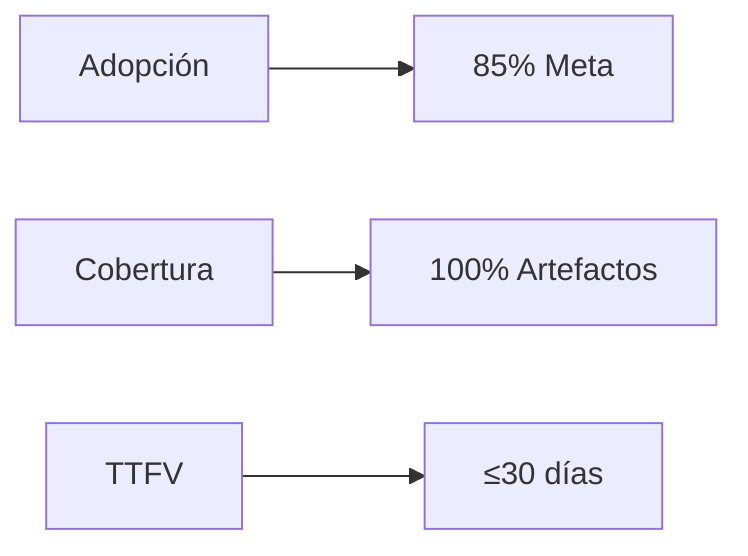

# 📊 Dashboard de Métricas IMPACT

## 🎯 Framework IMPACT - Indicadores Clave

El Dashboard IMPACT proporciona visibilidad en tiempo real sobre la adopción y el valor generado por las iniciativas de IA en la organización.

## 📈 Métricas Principales

### Implementation (Implementación)

**Indicadores Actuales:**
- 🎯 **Adopción Nova-Cell**: En despliegue inicial
- 📦 **Artefactos Migrados**: En proceso
- ⏱️ **Time to First Value**: Objetivo 30 días

### Momentum (Impulso)
- 📈 **Crecimiento Mensual**: Meta +25% nuevos artefactos
- 👥 **Usuarios Activos**: Objetivo 70% engagement semanal
- 🏆 **Madurez de Squads**: En formación

### Performance (Desempeño)
- ⚡ **Velocidad de Desarrollo**: Meta 2.1x mejora
- ✅ **Calidad de Código**: Objetivo 8.0/10
- 🔧 **Disponibilidad Nova-Cell**: Target 99.9%

### Acceptance (Aceptación)
- ✔️ **Tasa de Aceptación IA**: Meta 25-40%
- 🐛 **Reducción de Bugs**: Objetivo -40%
- 😊 **NPS Usuarios**: Target +20 puntos

### Cost-Effective (Costo-Beneficio)
- 💰 **ROI Proyectado**: 162% a 3 años (basado en benchmarks SPACE)
- 📉 **Reducción Costos**: En evaluación
- ⏰ **Break-even**: Esperado semana 11

### Trust (Confianza)
- 🔒 **Compliance Rate**: Meta 95%
- 🛡️ **Incidentes Seguridad**: Target 0
- 📋 **Explicabilidad**: Objetivo 100% decisiones críticas

## 🚦 Sistema de Alertas

### Zonas de Control
| Métrica | 🟢 Verde | 🟡 Alerta | 🔴 Crítico |
|---------|----------|-----------|------------|
| TTFV | ≤30 días | 31-45 días | >45 días |
| Velocity | ≥2.0x | 1.5-1.9x | <1.5x |
| Quality | ≥8.0 | 7.0-7.9 | <7.0 |
| Security | ≥95% | 90-94% | <90% |
| Engagement | ≥70% | 60-69% | <60% |
| ROI | ≥200% | 150-199% | <150% |

## 📊 Vistas del Dashboard

### Vista Ejecutiva
- Resumen de KPIs principales
- Tendencias trimestrales
- ROI acumulado
- Riesgos principales

### Vista Operativa
- Métricas por squad
- Performance por proyecto
- Utilización de recursos
- Incidentes y resolución

### Vista Técnica
- Métricas de plataforma
- Latencia y disponibilidad
- Uso de recursos compute
- Pipeline success rate

## 🔄 Actualización de Datos

- **Tiempo Real**: Métricas de plataforma
- **Diario**: Indicadores de adopción
- **Semanal**: Métricas de calidad
- **Mensual**: ROI y valor de negocio

## 📱 Acceso al Dashboard

### Web
- URL: dashboard.nova-cell.novasolutionsystems.com
- Login: SSO corporativo

### Mobile
- App: Nova Analytics (próximamente)
- Notificaciones push para alertas críticas

### API
- Endpoint: api.nova-cell.novasolutionsystems.com/metrics
- Documentación: [API Docs](../api/impact-api.md)

## 📈 Reportes Automatizados

### Disponibles
- **Diario**: Resumen ejecutivo por email
- **Semanal**: Reporte de progreso a stakeholders
- **Mensual**: Análisis detallado para Comité IA
- **Trimestral**: Presentación Board

### Suscripción
1. Acceder al dashboard
2. Configurar preferencias
3. Seleccionar métricas
4. Definir frecuencia

## 🎯 Casos de Uso del Dashboard

### Para Ejecutivos
- Visibilidad del ROI
- Estado del portfolio
- Riesgos y compliance

### Para Product Owners
- Performance del squad
- Métricas de adopción
- Feedback usuarios

### Para Desarrolladores
- Métricas de calidad
- Velocidad de desarrollo
- Utilización de herramientas

## 🆘 Soporte

**Dashboard Support**: dashboard-support@novasolutionsystems.com
**Documentación**: [Guía de Usuario](../guides/dashboard-guide.md)
**FAQ**: [Preguntas Frecuentes](../support/dashboard-faq.md)