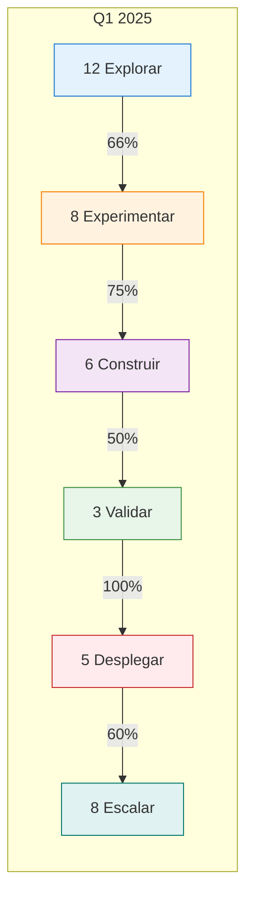

# 📊 Dashboard Portfolio de IA

<div class="nova-gradient-bg" style="padding: 2rem; border-radius: 10px; margin-bottom: 2rem;">
    <h2 style="color: white; margin-top: 0;">Portafolio de Iniciativas de IA</h2>
    <p style="color: white; font-size: 1.1em; margin-bottom: 0;">
        Vista ejecutiva del estado y valor de todas las iniciativas de IA del banco
    </p>
</div>

## 📈 Métricas Ejecutivas

<div class="grid cards">

<div class="nova-card-metric" style="border-left-color: #4CAF50;">
    <strong style="color: #4CAF50; font-size: 3em;">42</strong>
    <p style="font-size: 0.9em; color: var(--md-default-fg-color--light);">Casos de uso activos</p>
    <small>↑ 15% vs Q anterior</small>
</div>

<div class="nova-card-metric" style="border-left-color: #2196F3;">
    <strong style="color: #2196F3; font-size: 3em;">$8.7M</strong>
    <p style="font-size: 0.9em; color: var(--md-default-fg-color--light);">Valor generado YTD</p>
    <small>82% del target anual</small>
</div>

<div class="nova-card-metric" style="border-left-color: #FF9800;">
    <strong style="color: #FF9800; font-size: 3em;">156</strong>
    <p style="font-size: 0.9em; color: var(--md-default-fg-color--light);">Usuarios capacitados</p>
    <small>+23 este mes</small>
</div>

<div class="nova-card-metric" style="border-left-color: #9C27B0;">
    <strong style="color: #9C27B0; font-size: 3em;">94%</strong>
    <p style="font-size: 0.9em; color: var(--md-default-fg-color--light);">Satisfacción CoE</p>
    <small>NPS: 72</small>
</div>

</div>

## 🎯 Estado del Pipeline



## 📊 Distribución por Área de Negocio

<div style="display: grid; grid-template-columns: 1fr 1fr; gap: 2rem;">

<div>
    <h3>Casos por División</h3>
    
| División | Activos | Pipeline | Total |
|----------|---------|----------|-------|
| **Banca Digital** | 12 | 5 | 17 |
| **Riesgos** | 8 | 3 | 11 |
| **Operaciones** | 7 | 4 | 11 |
| **Marketing** | 6 | 2 | 8 |
| **Call Center** | 5 | 3 | 8 |
| **Compliance** | 4 | 1 | 5 |

</div>

<div>
    <h3>Valor por Tipo de Caso</h3>
    
| Tipo | Casos | Valor Anual | % Total |
|------|-------|-------------|---------|
| **Automatización** | 15 | $3.2M | 37% |
| **Customer Experience** | 10 | $2.8M | 32% |
| **Risk Management** | 8 | $1.5M | 17% |
| **Revenue Generation** | 6 | $0.9M | 10% |
| **Compliance** | 3 | $0.3M | 4% |

</div>

</div>

## 🚦 Top 10 Iniciativas por Impacto

<div class="nova-card">
    <table style="width: 100%;">
        <thead>
            <tr>
                <th>Ranking</th>
                <th>Iniciativa</th>
                <th>División</th>
                <th>Etapa</th>
                <th>Valor Estimado</th>
                <th>Riesgo</th>
                <th>Estado</th>
            </tr>
        </thead>
        <tbody>
            <tr>
                <td>1️⃣</td>
                <td><strong>Asistente Virtual 360</strong></td>
                <td>Banca Digital</td>
                <td>Escalar</td>
                <td>$1.2M</td>
                <td><span style="color: green;">●</span> Bajo</td>
                <td>✅ On track</td>
            </tr>
            <tr>
                <td>2️⃣</td>
                <td><strong>Credit Scoring IA</strong></td>
                <td>Riesgos</td>
                <td>Validar</td>
                <td>$850K</td>
                <td><span style="color: orange;">●</span> Medio</td>
                <td>⚠️ En revisión MRM</td>
            </tr>
            <tr>
                <td>3️⃣</td>
                <td><strong>Detección Fraude Real-time</strong></td>
                <td>Seguridad</td>
                <td>Desplegar</td>
                <td>$750K</td>
                <td><span style="color: green;">●</span> Bajo</td>
                <td>✅ On track</td>
            </tr>
            <tr>
                <td>4️⃣</td>
                <td><strong>Procesamiento Documentos</strong></td>
                <td>Operaciones</td>
                <td>Escalar</td>
                <td>$620K</td>
                <td><span style="color: green;">●</span> Bajo</td>
                <td>✅ On track</td>
            </tr>
            <tr>
                <td>5️⃣</td>
                <td><strong>Next Best Action</strong></td>
                <td>Marketing</td>
                <td>Construir</td>
                <td>$580K</td>
                <td><span style="color: orange;">●</span> Medio</td>
                <td>✅ On track</td>
            </tr>
            <tr>
                <td>6️⃣</td>
                <td><strong>Chatbot Call Center</strong></td>
                <td>Servicio</td>
                <td>Experimentar</td>
                <td>$500K</td>
                <td><span style="color: orange;">●</span> Medio</td>
                <td>⏱️ Delayed</td>
            </tr>
            <tr>
                <td>7️⃣</td>
                <td><strong>AML Intelligence</strong></td>
                <td>Compliance</td>
                <td>Validar</td>
                <td>$450K</td>
                <td><span style="color: red;">●</span> Alto</td>
                <td>⚠️ Bloqueado</td>
            </tr>
            <tr>
                <td>8️⃣</td>
                <td><strong>Análisis Sentimiento</strong></td>
                <td>Marketing</td>
                <td>Explorar</td>
                <td>$380K</td>
                <td><span style="color: green;">●</span> Bajo</td>
                <td>✅ On track</td>
            </tr>
            <tr>
                <td>9️⃣</td>
                <td><strong>Optimización Cobranza</strong></td>
                <td>Recuperación</td>
                <td>Construir</td>
                <td>$350K</td>
                <td><span style="color: orange;">●</span> Medio</td>
                <td>✅ On track</td>
            </tr>
            <tr>
                <td>🔟</td>
                <td><strong>Recomendador Productos</strong></td>
                <td>Banca Digital</td>
                <td>Experimentar</td>
                <td>$320K</td>
                <td><span style="color: green;">●</span> Bajo</td>
                <td>✅ On track</td>
            </tr>
        </tbody>
    </table>
</div>

## 📈 Tendencias y Proyecciones

<div class="grid cards">

<div class="nova-card-feature">
    <h3>📊 Velocity del CoE</h3>
    
    <div style="background: #f5f5f5; padding: 1rem; border-radius: 8px;">
        <p><strong>Q4 2024:</strong> 8 casos completados</p>
        <p><strong>Q1 2025:</strong> 12 casos proyectados</p>
        <p><strong>Mejora:</strong> +50% productividad</p>
    </div>
    
    <p style="margin-top: 1rem;">Factores de mejora:</p>
    <ul>
        <li>Green paths implementados</li>
        <li>Plataforma Nova-Cell 2.0</li>
        <li>Arquitecto de Adopción activo</li>
    </ul>
</div>

<div class="nova-card-feature">
    <h3>💰 ROI Acumulado</h3>
    
    ```mermaid
    graph TD
        A[Q1: $1.5M] --> B[Q2: $3.2M]
        B --> C[Q3: $5.8M]
        C --> D[Q4: $8.7M]
        D --> E[2025 Target: $12M]
        
        style E fill:#4CAF50,color:#fff
    ```
</div>

<div class="nova-card-feature">
    <h3>⏱️ Time to Value</h3>
    
| Métrica | 2024 | 2025 | Mejora |
|---------|------|------|--------|
| **Idea → PoC** | 28 días | 15 días | -46% |
| **PoC → Producción** | 95 días | 68 días | -28% |
| **Total ciclo** | 123 días | 83 días | -33% |

</div>

</div>

## 🎯 Framework IMPACT - Métricas Clave

<div class="nova-card" style="background: linear-gradient(135deg, #1E4976 0%, #0D5A5B 100%); padding: 2rem;">
    <h3 style="color: white;">Dimensiones de Impacto</h3>
    
    <div style="display: grid; grid-template-columns: repeat(3, 1fr); gap: 1rem; margin-top: 1.5rem;">
        
        <div style="background: rgba(255,255,255,0.1); padding: 1rem; border-radius: 8px;">
            <h4 style="color: #4CAF50;">I - Innovation</h4>
            <p style="color: white; font-size: 2em; margin: 0.5rem 0;">8.2/10</p>
            <p style="color: rgba(255,255,255,0.8); font-size: 0.9em;">Nuevos casos de uso/mes: 4</p>
        </div>
        
        <div style="background: rgba(255,255,255,0.1); padding: 1rem; border-radius: 8px;">
            <h4 style="color: #2196F3;">M - Maturity</h4>
            <p style="color: white; font-size: 2em; margin: 0.5rem 0;">Level 3</p>
            <p style="color: rgba(255,255,255,0.8); font-size: 0.9em;">MLOps implementado</p>
        </div>
        
        <div style="background: rgba(255,255,255,0.1); padding: 1rem; border-radius: 8px;">
            <h4 style="color: #FF9800;">P - Performance</h4>
            <p style="color: white; font-size: 2em; margin: 0.5rem 0;">94%</p>
            <p style="color: rgba(255,255,255,0.8); font-size: 0.9em;">SLA cumplimiento</p>
        </div>
        
        <div style="background: rgba(255,255,255,0.1); padding: 1rem; border-radius: 8px;">
            <h4 style="color: #9C27B0;">A - Adoption</h4>
            <p style="color: white; font-size: 2em; margin: 0.5rem 0;">67%</p>
            <p style="color: rgba(255,255,255,0.8); font-size: 0.9em;">Áreas usando IA</p>
        </div>
        
        <div style="background: rgba(255,255,255,0.1); padding: 1rem; border-radius: 8px;">
            <h4 style="color: #4CAF50;">C - Compliance</h4>
            <p style="color: white; font-size: 2em; margin: 0.5rem 0;">100%</p>
            <p style="color: rgba(255,255,255,0.8); font-size: 0.9em;">Modelos validados</p>
        </div>
        
        <div style="background: rgba(255,255,255,0.1); padding: 1rem; border-radius: 8px;">
            <h4 style="color: #00BCD4;">T - Transformation</h4>
            <p style="color: white; font-size: 2em; margin: 0.5rem 0;">$8.7M</p>
            <p style="color: rgba(255,255,255,0.8); font-size: 0.9em;">Valor generado</p>
        </div>
        
    </div>
</div>

## 🚨 Alertas y Riesgos

<div class="admonition warning">
    <p class="admonition-title">Iniciativas que requieren atención</p>
    
| Iniciativa | Problema | Impacto | Acción Requerida | Owner |
|------------|----------|---------|------------------|-------|
| **AML Intelligence** | Falta aprobación regulatoria | Alto | Reunión con CNBV | Legal |
| **Chatbot Call Center** | Integración CRM retrasada | Medio | Escalar a IT | Tech Lead |
| **Credit Scoring IA** | Sesgo detectado en validación | Alto | Re-entrenar modelo | Data Science |

</div>

## 📅 Hitos Próximos 30 Días

<div class="nova-card-feature">
    
| Fecha | Hito | Iniciativa | Responsable |
|-------|------|------------|-------------|
| **15 Ene** | Go-live | Asistente Virtual 360 | Product Owner |
| **18 Ene** | Gate MRM | Credit Scoring IA | Risk Manager |
| **22 Ene** | PoC Complete | Chatbot Call Center | Tech Lead |
| **25 Ene** | Kickoff | Análisis Sentimiento | Arquitecto Adopción |
| **30 Ene** | Q1 Planning | Portfolio completo | PMO CoE |

</div>

## 🎬 Acciones Rápidas

<div class="grid cards">

<div class="nova-card-metric" style="text-align: center; cursor: pointer;">
    <span style="font-size: 2em;">➕</span>
    <h4>Registrar nuevo caso</h4>
    <a href="../servicios/solicitar-apoyo/" class="md-button md-button--primary">Iniciar →</a>
</div>

<div class="nova-card-metric" style="text-align: center; cursor: pointer;">
    <span style="font-size: 2em;">📊</span>
    <h4>Ver mi proyecto</h4>
    <a href="../mi-proyecto/" class="md-button md-button--primary">Dashboard →</a>
</div>

<div class="nova-card-metric" style="text-align: center; cursor: pointer;">
    <span style="font-size: 2em;">📈</span>
    <h4>Exportar reporte</h4>
    <button class="md-button md-button--primary">PDF/Excel →</button>
</div>

<div class="nova-card-metric" style="text-align: center; cursor: pointer;">
    <span style="font-size: 2em;">🔔</span>
    <h4>Configurar alertas</h4>
    <button class="md-button md-button--primary">Setup →</button>
</div>

</div>

## 📊 Filtros y Vistas

<div class="nova-card" style="padding: 1.5rem; background: #f5f5f5;">
    <div style="display: flex; gap: 1rem; flex-wrap: wrap;">
        <select style="padding: 0.5rem; border-radius: 5px; border: 1px solid #ddd;">
            <option>Todas las divisiones</option>
            <option>Banca Digital</option>
            <option>Riesgos</option>
            <option>Operaciones</option>
        </select>
        
        <select style="padding: 0.5rem; border-radius: 5px; border: 1px solid #ddd;">
            <option>Todas las etapas</option>
            <option>Explorar</option>
            <option>Experimentar</option>
            <option>Construir</option>
            <option>Validar</option>
            <option>Desplegar</option>
            <option>Escalar</option>
        </select>
        
        <select style="padding: 0.5rem; border-radius: 5px; border: 1px solid #ddd;">
            <option>Q1 2025</option>
            <option>Q4 2024</option>
            <option>Q3 2024</option>
        </select>
        
        <button class="md-button" style="margin-left: auto;">🔄 Actualizar</button>
    </div>
</div>

---

!!! info "Actualización de datos"
    Dashboard actualizado en tiempo real. Última sincronización: **Hace 5 minutos**
    
    Fuentes: Nova-Cell Platform | Jira | ServiceNow | Sistemas financieros