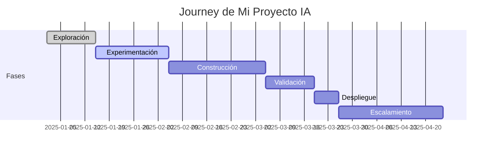

# 📋 Mi Proyecto de IA - Vista Personalizada

## 🎯 Dashboard Personal de Proyecto

Vista personalizada para gestionar y monitorear tu proyecto de IA desde la ideación hasta producción.

## 📊 Estado de Mi Proyecto

### Información General
- **Nombre del Proyecto**: [Tu proyecto aquí]
- **Fase Actual**: Exploración / Experimentación / Construcción / Validación / Despliegue / Escalamiento
- **Squad**: [Tu equipo]
- **Sponsor**: [Líder de área]
- **Inicio**: [Fecha inicio]
- **Go-Live Estimado**: [Fecha objetivo]

## 🚦 Health Check

### Indicadores de Salud
| Aspecto | Estado | Score | Acciones |
|---------|--------|-------|----------|
| 📈 Progreso | 🟢 En tiempo | 85% | On track |
| 💰 Presupuesto | 🟢 Dentro | 78% | OK |
| 👥 Recursos | 🟡 Parcial | 60% | Necesita ML Engineer |
| 🔒 Compliance | 🟢 Completo | 100% | AISIA aprobado |
| 📊 Calidad | 🟢 Alta | 92% | Tests pasando |

## 📅 Timeline del Proyecto

## ✅ Checklist de Fase Actual

### Fase: Experimentación
- [x] Caso de uso definido
- [x] Datos identificados
- [x] Ambiente Nova-Cell configurado
- [ ] PoC inicial desarrollado
- [ ] Métricas base establecidas
- [ ] Stakeholders alineados

## 📊 Métricas de Mi Proyecto

### Métricas Técnicas
- **Accuracy**: Objetivo vs Actual
- **Latencia**: Target <100ms
- **Throughput**: Transacciones/seg
- **Error Rate**: <1%

### Métricas de Negocio
- **Usuarios Impactados**: Proyección
- **Ahorro Estimado**: USD/año
- **Eficiencia Ganada**: % mejora
- **ROI Proyectado**: X%

## 🔧 Recursos Asignados

### Equipo
- **Product Owner**: [Nombre]
- **Tech Lead**: [Nombre]
- **Data Scientists**: [2 personas]
- **ML Engineers**: [1 persona]
- **QA Specialist**: [1 persona]

### Infraestructura
- **Nova-Cell Credits**: 1000/mes
- **GPU Hours**: 100/mes
- **Storage**: 500GB
- **Compute**: Standard tier

## 📝 Documentación

### Artefactos Completados
- ✅ Business Case
- ✅ Technical Design
- ✅ AISIA Assessment
- ⏳ Model Card (en progreso)
- ⏳ Data Sheet (en progreso)
- ❌ Production Runbook

## 🚨 Riesgos y Issues

### Riesgos Activos
| Riesgo | Probabilidad | Impacto | Mitigación |
|--------|--------------|---------|------------|
| Data quality | Media | Alto | Validación adicional |
| Recursos | Baja | Medio | Backup plan |
| Timeline | Media | Medio | Fast-track option |

### Issues Abiertos
1. **[HIGH]** Latencia en ambiente de prueba
2. **[MED]** Falta documentación de API
3. **[LOW]** Actualización de dependencias

## 🎯 Próximos Pasos

### Esta Semana
- [ ] Completar training del modelo v2
- [ ] Review con stakeholders
- [ ] Pruebas de integración

### Próximas 2 Semanas
- [ ] Validación con usuarios piloto
- [ ] Ajuste de hiperparámetros
- [ ] Preparar demo para comité

## 📈 Histórico de Performance

### Evolución del Modelo
| Versión | Fecha | Accuracy | F1-Score | Estado |
|---------|-------|----------|----------|---------|
| v0.1 | 01/01 | 72% | 0.68 | Baseline |
| v0.2 | 15/01 | 81% | 0.78 | Mejorado |
| v0.3 | 01/02 | 87% | 0.85 | Current |
| v1.0 | Target | 90% | 0.88 | Goal |

## 💬 Comunicación

### Canales del Proyecto
- **Chat**: #proyecto-[nombre]
- **Wiki**: confluence/proyecto-[nombre]
- **Repo**: github/nova-ai/[nombre]
- **Board**: jira/[PROJECT-KEY]

### Stakeholders
- **Sponsor**: [Email]
- **CoE Contact**: arquitecto-adopcion@novasolutionsystems.com
- **Support**: nova-cell-support@novasolutionsystems.com

## 🏆 Achievements

### Milestones Completados
- ✅ Kick-off exitoso
- ✅ PoC funcional
- ✅ Aprobación AISIA
- ⏳ Go/No-Go decision
- ❌ Production release

## 🔗 Links Rápidos

- [Nova-Cell Workspace](https://nova-cell.novasolutionsystems.com/workspace/[project])
- [Knowledge Hub](../knowledge-hub-guide.md)
- [Solicitar Soporte](../servicios/solicitar-apoyo.md)
- [Dashboard General](dashboard-impact.md)

---

*Dashboard actualizado automáticamente desde Nova-Cell Project Management*