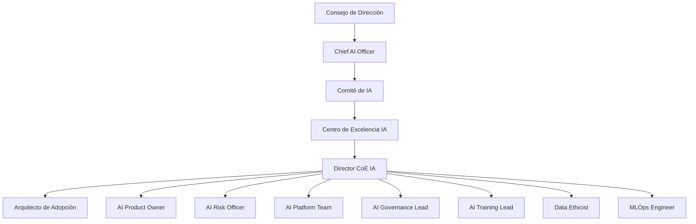
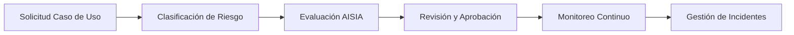

---
tags:
  - gobernanza
  - inteligencia-artificial
  - operating-model
  - coe-ia
  - organizacion
  - raci
  - impact-framework
search:
  boost: 2
---

# Modelo Operativo del Centro de Excelencia de Inteligencia Artificial (CoE IA)

  <h2 style="margin: 0; font-size: 1.8rem;">⚙️ Modelo Operativo del CoE IA</h2>
  
Estructura, funciones y procesos para la adopción segura y responsable de IA

  

    <strong>📋 Versión:</strong> 1.0 Vigente
  

  

    <strong>📅 Fecha:</strong> 09 de enero de 2025
  

  

    <strong>👤 Autor:</strong> Centro de Excelencia Nova IA
  

  

    <strong>✅ Aprobado por:</strong> Consejo de Dirección
  

  

    <strong>🔄 Próxima revisión:</strong> 09 de julio de 2025
  

  

    <strong>🔒 Clasificación:</strong> INTERNO
  

## Introducción

El presente documento establece el Modelo Operativo del Centro de Excelencia de Inteligencia Artificial (CoE IA) del Banco, delineando su estructura organizacional, roles y responsabilidades, procesos clave, y mecanismos de gobernanza para asegurar una adopción de IA segura, responsable, medible y escalable. Este modelo es fundamental para la implementación efectiva de la [Política de Uso Responsable de Inteligencia Artificial](governance/politica-uso-responsable-ia.md) y para maximizar el valor estratégico de la IA en toda la organización.

El CoE IA actúa como un hub central de excelencia, facilitando la innovación y la estandarización, al tiempo que garantiza el cumplimiento normativo y la gestión proactiva de riesgos asociados a la IA. Este modelo operativo ha sido diseñado para fomentar la colaboración entre las unidades de negocio, tecnología, riesgo y cumplimiento, promoviendo una cultura de IA responsable y ética.

## 1. Misión y Visión del CoE IA

### 1.1 Misión

Asegurar que la adopción de Inteligencia Artificial en el Banco sea segura, responsable, medible y escalable, actuando como el hub central de excelencia que impulsa la innovación, estandarización y gobernanza en todo el ciclo de vida de la IA.

### 1.2 Visión

Ser el referente estratégico y técnico en Inteligencia Artificial para el Banco, transformando la organización en un líder en innovación responsable y ética de IA, generando valor sostenible para nuestros clientes, colaboradores y accionistas.

## 2. Estructura Organizacional Detallada

El CoE IA se integra en la estructura de gobernanza corporativa, reportando al Comité de IA y, en última instancia, al Consejo de Dirección. Su diseño es matricial, permitiendo la colaboración transversal y el soporte a las unidades de negocio (Primera Línea de Defensa) y a las funciones de control (Segunda y Tercera Línea de Defensa).

### 2.1 Cadena de Mando y Comités de Gobernanza

La estructura de gobernanza de IA del Banco se articula en tres niveles principales:

#### 2.1.1 Consejo de Dirección / Board
- **Mandato:** Define la estrategia general de IA, aprueba las políticas corporativas de IA y supervisa el desempeño general del programa
- **Frecuencia:** Trimestral
- **Composición:** CEO, Directores Ejecutivos de áreas clave (Tecnología, Riesgos, Negocio, Finanzas, Legal)

#### 2.1.2 Comité de IA
- **Mandato:** Aprueba casos de uso de IA de alto riesgo, supervisa la implementación de la estrategia de IA, monitorea el cumplimiento de políticas y gestiona los riesgos críticos
- **Frecuencia:** Mensual
- **Composición:** Chief AI Officer (Presidente), Director del CoE IA, Chief Risk Officer, Chief Compliance Officer, Director de Tecnología, Representantes de Negocio

#### 2.1.3 Centro de Excelencia de IA (CoE IA)
- **Mandato:** Ejecuta la estrategia de IA, desarrolla capacidades, establece estándares técnicos, implementa políticas, gestiona el Knowledge Hub y brinda soporte a las unidades de negocio
- **Frecuencia:** Diario/Semanal
- **Composición:** Director del CoE IA y los roles clave detallados a continuación

### 2.2 Roles y Responsabilidades Clave del CoE IA

#### 2.2.1 Director del CoE IA
**Responsabilidades:**
- Liderar la estrategia y ejecución del CoE IA
- Asegurar la alineación con los objetivos de negocio y regulatorios
- Gestionar el presupuesto y los recursos del CoE
- Representar al CoE ante el Comité de IA

#### 2.2.2 Chief AI Officer (CAIO)
**Responsabilidades:**
- Supervisión estratégica del programa de IA a nivel corporativo
- Definición de la visión y hoja de ruta de la IA
- Aseguramiento de la integración de la IA en la estrategia general del Banco

#### 2.2.3 Arquitecto de Adopción de IA (Rol Diferenciador)

**Descripción del Rol:**
El Arquitecto de Adopción de IA es un rol estratégico único que actúa como el principal catalizador de la transformación digital con IA en toda la organización. Este rol diferenciador combina expertise técnica con visión de negocio para acelerar la adopción efectiva de soluciones de IA.

**Responsabilidades Principales:**
- **Estrategia de Adopción:** Diseñar e implementar estrategias personalizadas para la adopción de soluciones de IA por vertical de negocio
- **Identificación de Oportunidades:** Proactivamente identificar y priorizar nuevos casos de uso de alto impacto mediante análisis de procesos y pain points
- **Facilitación Técnica:** Facilitar la integración de la IA en los procesos existentes, asegurando compatibilidad técnica y operacional
- **Puente Organizacional:** Actuar como traductor bidireccional entre el CoE técnico y los equipos de negocio
- **Evangelización:** Promover activamente la cultura de IA mediante showcases, demos y sesiones de ideación
- **Aceleración de Squads:** Mentorear y acompañar a los squads en su journey de madurez (Shadow → Federated → Autonomous)
- **Gestión del Cambio:** Liderar iniciativas de gestión del cambio para superar resistencias organizacionales
- **Medición de Impacto:** Definir y monitorear KPIs de adopción y ROI por iniciativa

**Responsabilidades Secundarias:**
- Mantener actualizado el roadmap de adopción por área
- Coordinar con AI Champions en cada vertical
- Documentar mejores prácticas y lecciones aprendidas
- Contribuir al Knowledge Hub con casos de éxito
- Participar en la evaluación de herramientas y proveedores

**Frecuencia de Actividades:**

| Actividad | Frecuencia | Participantes | Duración |
|-----------|------------|---------------|----------|
| **Squad Review Sessions** | Semanal | Squad leads, Product Owners | 1 hora |
| **Opportunity Discovery Workshops** | Quincenal | Líderes de área, Process owners | 2 horas |
| **Adoption Metrics Review** | Mensual | Director CoE, CAIO | 1 hora |
| **AI Champions Sync** | Mensual | AI Champions de todas las áreas | 1.5 horas |
| **Executive Showcases** | Trimestral | C-Suite, Board | 30 min |
| **Innovation Labs** | Trimestral | Equipos multidisciplinarios | 1 día |
| **Adoption Roadmap Planning** | Semestral | Todos los stakeholders | 2 días |

**Perfil Requerido:**
- Experiencia: 8+ años en transformación digital, 5+ años en IA/ML
- Formación: Ingeniería/Ciencias + MBA o equivalente
- Certificaciones: AI/ML platforms, Change Management, Agile
- Habilidades: Comunicación ejecutiva, facilitación, pensamiento estratégico
- Conocimientos: MLOps, arquitectura empresarial, regulación bancaria

**Métricas de Éxito:**
- Número de casos de uso identificados y priorizados
- Velocidad de adopción (time-to-production)
- % de squads graduados a siguiente nivel de madurez
- NPS de usuarios de soluciones IA
- ROI acumulado de iniciativas implementadas
- Reducción en Shadow AI detectado

#### 2.2.4 AI Product Owner
**Responsabilidades:**
- Definir la visión, roadmap y backlog de productos de IA internos (Nova-Cell, Knowledge Hub)
- Priorizar funcionalidades
- Asegurar que los productos satisfagan las necesidades de los usuarios

#### 2.2.5 AI Risk Officer
**Responsabilidades:**
- Evaluar y gestionar los riesgos específicos de IA (sesgo, degradación, privacidad)
- Validar la implementación de controles
- Asegurar el cumplimiento con normativas (CNBV, LFPDPPP, ISO 42001)

#### 2.2.6 AI Platform Team (Nova-Cell Team)
**Responsabilidades:**
- Diseñar, construir y mantener la plataforma corporativa Nova-Cell
- Asegurar la escalabilidad, seguridad y disponibilidad de la plataforma
- Gestionar la infraestructura de MLOps

#### 2.2.7 AI Governance Lead
**Responsabilidades:**
- Desarrollar, mantener y comunicar las políticas de gobernanza de IA
- Coordinar las actividades de cumplimiento y auditoría
- Asegurar la alineación con marcos regulatorios

#### 2.2.8 AI Training Lead / Academia AI
**Responsabilidades:**
- Diseñar y ejecutar programas de capacitación en IA responsable
- Fomentar la cultura de IA
- Gestionar la Academia AI y certificaciones

#### 2.2.9 Data Ethicist / AI Ethics Specialist
**Responsabilidades:**
- Investigar y mitigar sesgos algorítmicos
- Asegurar la equidad y no discriminación de los sistemas de IA
- Promover principios éticos en el diseño y uso de la IA

#### 2.2.10 MLOps Engineer
**Responsabilidades:**
- Implementar y gestionar pipelines de CI/CD para modelos de IA
- Automatizar el despliegue, monitoreo y reentrenamiento de modelos
- Optimizar la infraestructura para la operación de IA en producción

### 2.3 Interacciones con Otras Áreas (Líneas de Defensa)

- **Primera Línea (Unidades de Negocio):** El CoE proporciona las herramientas, estándares, capacitación y soporte para implementación responsable
- **Segunda Línea (Gestión de Riesgos, Cumplimiento, Legal):** Integración de marcos de riesgo y cumplimiento en el ciclo de vida de la IA
- **Tercera Línea (Auditoría Interna):** Facilitación de auditorías con documentación y trazabilidad necesarias

## 3. Matriz RACI para Procesos Clave

| Proceso Clave | Chief AI Officer | Director CoE IA | Arq. Adopción IA | AI Product Owner | AI Risk Officer | AI Platform Team | AI Governance Lead | Data Scientist | Product Owner | Risk Officer | Compliance Officer | Auditoría Interna |
|:-------------|:----------------|:---------------|:----------------|:----------------|:---------------|:----------------|:-------------------|:---------------|:--------------|:-------------|:------------------|:------------------|
| **Definición de Estrategia IA** | A, R | C, I | R | I | I | I | I | I | I | I | I | I |
| **Identificación de Casos de Uso** | I | A | R | C | C | I | I | C | R | C | I | I |
| **Aprobación de Casos de Uso IA** | A | R | R | C | R | I | C | R | R | A | C | I |
| **Desarrollo de Políticas IA** | A | R | C | I | C | I | R | I | I | C | R | I |
| **Gestión de Riesgos IA** | A | R | C | C | R | C | C | R | C | A | C | I |
| **Gestión del Knowledge Hub** | I | A | R | R | C | R | C | R | C | I | I | I |
| **Desarrollo Nova-Cell** | I | A | C | R | C | R | I | I | I | I | I | I |
| **Adopción y Change Management** | I | A | R | C | I | C | C | I | R | I | I | I |
| **Capacitación en IA** | I | A | R | I | C | I | R | I | C | I | I | I |
| **Squad Maturity Assessment** | I | A | R | C | C | I | I | I | R | C | I | I |
| **Monitoreo de Modelos** | I | A | C | C | R | R | C | R | C | A | C | I |
| **Auditoría de Cumplimiento** | I | I | I | I | C | I | C | I | I | I | C | A, R |
| **Gestión de Incidentes IA** | I | A | C | C | R | C | C | R | C | A | C | I |
| **Revisión de Artefactos** | I | C | R | R | R | I | C | R | C | C | I | I |
| **ROI y Métricas de Adopción** | A | R | R | C | I | I | I | I | C | I | I | I |

**Leyenda:** R=Responsible, A=Accountable, C=Consulted, I=Informed

## 4. Marcos de Entrega de Servicios y Flujos Operacionales

### 4.1 Gobernanza y Gestión de Riesgos

**Servicios Proporcionados:**
- Evaluación de Impacto de Sistemas de IA (AISIA)
- Análisis de sesgos
- Definición de controles de riesgo
- Monitoreo de cumplimiento regulatorio
- Gestión de excepciones

**Workflow:**

### 4.2 Plataforma y Tecnología (Nova-Cell)

**Servicios Proporcionados:**
- Provisión de infraestructura MLOps
- Herramientas de desarrollo (SDKs, APIs)
- Gestión de entornos (desarrollo, testing, producción)
- Soporte técnico para Nova-Cell

### 4.3 Estandarización y Knowledge Hub

**Servicios Proporcionados:**
- Desarrollo y mantenimiento de políticas
- Estándares (DoD/DoR IA)
- Plantillas técnicas
- Gestión de la Librería Centralizada de Artefactos de IA

### 4.4 Capacitación y Adopción (Academia AI)

**Servicios Proporcionados:**
- Programas de capacitación (Academia AI)
- Certificación interna
- Programa de AI Champions
- Comunicación interna
- Gestión del cambio

## 5. Modelos de Presupuesto y Estrategias de Asignación de Recursos

### 5.1 Modelo de Financiación

Se propone un **modelo híbrido** de financiación:

#### Financiación Centralizada
- Presupuesto operativo del CoE IA (salarios del equipo central)
- Infraestructura base de Nova-Cell
- Licencias de herramientas de gobernanza
- Programas de capacitación corporativa

#### Mecanismo de Chargeback/Cost-Sharing
- Proyectos de IA específicos de unidades de negocio
- Soporte intensivo del CoE
- Desarrollo de modelos complejos
- Consultoría especializada
- Uso de recursos de cómputo avanzados

### 5.2 Asignación de Recursos

#### Recursos Humanos
- Contratación, desarrollo y retención del talento especializado en IA
- Formación interna y movilidad de roles
- Construcción de base sólida de conocimiento

#### Tecnología e Infraestructura
- Optimización del uso de los recursos de Nova-Cell
- Equilibrio entre demanda de proyectos y eficiencia de costos
- Revisiones periódicas de capacidad y demanda

#### Proyectos
- Priorización según impacto estratégico
- Alineación con objetivos de gobernanza y adopción
- ROI potencial (Framework IMPACT)
- Disponibilidad de recursos del CoE

## 6. Sistemas de Gestión del Desempeño (Framework IMPACT)

### 6.1 Métricas Clave y Objetivos

### 6.1.1 Curva de Adopción de 11 Semanas

El CoE IA implementa un programa estructurado de adopción basado en la curva validada de 11 semanas para maximizar la productividad y minimizar el tiempo de implementación:

| Semana | Fase | Productividad Meta | Actividades Clave | Métrica de Éxito |
|--------|------|-------------------|-------------------|------------------|
| 1-2 | Setup Inicial | 0.3x | Configuración ambiente, accesos, training básico | 100% equipos con acceso |
| 3-4 | Familiarización | 0.6x | Primeros casos de uso, shadowing, mentoring | 80% completó primer caso |
| 5-6 | Adopción Básica | 1.0x | Paridad con métodos tradicionales | TTFV ≤ 30 días |
| 7-8 | Aceleración | 1.5x | Optimización de workflows, autonomía | Velocity ≥ 1.5x |
| 9-10 | Optimización | 2.0x | Patrones avanzados, best practices | Quality Score ≥ 8.0 |
| 11+ | Maestría | 2.5x | Productividad máxima, mentoría a otros | ROI ≥ 200% |

### 6.1.2 Seis Métricas Críticas de Éxito

El CoE IA monitorea continuamente seis indicadores predictivos que determinan el éxito de la adopción:

#### 🎯 Métricas Predictivas (Zona Verde/Alerta/Crítica)

1. **Time to First Value (TTFV)**
   - 🟢 Zona Verde: ≤ 30 días
   - 🟡 Zona Alerta: 31-45 días
   - 🔴 Zona Crítica: > 45 días

2. **Developer Velocity Index**
   - 🟢 Zona Verde: ≥ 2.0x
   - 🟡 Zona Alerta: 1.5x-1.9x
   - 🔴 Zona Crítica: < 1.5x

3. **Code Quality Score**
   - 🟢 Zona Verde: ≥ 8.0/10
   - 🟡 Zona Alerta: 7.0-7.9/10
   - 🔴 Zona Crítica: < 7.0/10

4. **Security Compliance Rate**
   - 🟢 Zona Verde: ≥ 95%
   - 🟡 Zona Alerta: 90-94%
   - 🔴 Zona Crítica: < 90%

5. **User Engagement Rate**
   - 🟢 Zona Verde: ≥ 70%
   - 🟡 Zona Alerta: 60-69%
   - 🔴 Zona Crítica: < 60%

6. **Business ROI Realized**
   - 🟢 Zona Verde: ≥ 200%
   - 🟡 Zona Alerta: 150-199%
   - 🔴 Zona Crítica: < 150%

#### Implementation (Implementación)
- **Adopción:** >80% equipos usando el Hub en 6 meses
- **Cobertura:** 100% artefactos críticos migrados
- **Time to First Value:** ≤ 30 días (Métrica Crítica #1)

#### Momentum (Impulso)
- **Crecimiento:** +25% artefactos nuevos mensualmente
- **Engagement:** ≥70% usuarios activos semanalmente (Métrica Crítica #5)
- **Madurez:** % de squads federados con AI Product Owners y AI Risk Officers

#### Performance (Desempeño)
- **Eficiencia de Procesos:** Mejora 2.2x-2.5x en velocidad y throughput (Métrica Crítica #2)
- **Calidad de Modelos:** Precisión, robustez y explicabilidad (Métrica Crítica #3)
- **Disponibilidad:** 99.9% uptime Nova-Cell y Knowledge Hub

#### Acceptance (Aceptación)
- **Tasa de Aceptación:** 25-40% outputs de IA aceptados
- **Calidad del Output:** -40% reducción en densidad de bugs
- **NPS de Usuarios:** +20 puntos en satisfacción

#### Cost-Effective (Costo-Beneficio)
- **ROI:** Break-even semana 11, ≥200% ROI año 1 (Métrica Crítica #6)
- **Ahorro de Costos:** Reducción en costos operativos
- **Eficiencia:** Tiempo de desarrollo de soluciones IA

#### Trust (Confianza)
- **Compliance:** ≥95% auditorías pasadas sin hallazgos críticos (Métrica Crítica #4)
- **Seguridad:** Cero incidentes de seguridad relacionados con IA
- **Explicabilidad:** % de decisiones de IA explicables a reguladores

### 6.2 Reporting y Revisión

- **Dashboard en Tiempo Real:** Monitoreo continuo de KPIs IMPACT
- **Reportes Mensuales:** Presentación al Comité de IA
- **Reportes Trimestrales:** Presentación al Consejo de Dirección

## 7. Procedimientos de Gestión de Riesgos y Escalamiento

### 7.1 Identificación y Evaluación de Riesgos

- Identificación y evaluación de riesgos específicos de IA en cada fase del ciclo de vida
- Uso de la Matriz de Clasificación de Riesgos IA
- Categorización de riesgos (sesgo algorítmico, degradación de modelos, ataques adversarios, privacidad)

### 7.2 Mitigación y Controles

- Definición e implementación de controles obligatorios
- Evaluaciones AISIA
- Monitoreo continuo de métricas de desempeño y sesgo
- Planes de contingencia y auditorías internas

### 7.3 Monitoreo y Escalamiento de Riesgos

#### Proceso de Escalamiento:
1. **Nivel 1 (Operativo):** Product Owner y Data Scientist
2. **Nivel 2 (CoE IA):** AI Risk Officer y AI Platform Team
3. **Nivel 3 (Comité de IA):** Decisiones estratégicas
4. **Notificación Regulatoria:** Compliance Officer según normativa

#### Kill Switch
- Procedimiento de parada de emergencia 24/7
- Disponible para sistemas de IA críticos
- Desactivación inmediata ante fallas catastróficas

## 8. Protocolos de Interacción con Stakeholders

### 8.1 Comité de IA

**Composición:**
- Chief AI Officer (Presidente)
- Director del CoE IA
- Chief Risk Officer
- Chief Compliance Officer
- Director de Tecnología
- Director de Innovación
- Representantes de Unidades de Negocio

**Funciones Específicas:**
- Revisar y aprobar estrategia de IA y roadmap
- Aprobar casos de uso de IA de alto riesgo
- Revisar informes de desempeño (IMPACT) y cumplimiento
- Tomar decisiones sobre mitigación de riesgos críticos
- Asignar recursos para iniciativas estratégicas
- Aprobar nuevas políticas y estándares de IA

### 8.2 Interacción con Unidades de Negocio

**Puntos de Contacto:** Arquitectos de Adopción de IA y AI Product Owners
**Mecanismos:**
- Workshops de ideación de casos de uso
- Sesiones de consultoría
- Soporte en implementación de soluciones
- Programas de AI Champions

### 8.3 Interacción con Funciones de Control

**Puntos de Contacto:** AI Risk Officer, AI Governance Lead
**Mecanismos:**
- Reuniones regulares de coordinación
- Procesos de revisión conjunta (AISIA, validación de modelos)
- Intercambio de información sobre cambios regulatorios

### 8.4 Interacción con Tecnología e Infraestructura

**Puntos de Contacto:** AI Platform Team, MLOps Engineers
**Mecanismos:**
- Colaboración en diseño y operación de Nova-Cell
- Integración con infraestructura de TI existente
- Aseguramiento de la seguridad de la información

### 8.5 Interacción con Recursos Humanos

**Puntos de Contacto:** Director del CoE IA, AI Training Lead
**Mecanismos:**
- Definición de perfiles de IA
- Estrategias de reclutamiento
- Programas de desarrollo de talento
- Gestión del cambio cultural

## 9. Procesos de Gestión del Cambio para la Adopción de IA

### 9.1 Estrategia de Migración de Shadow AI

- **Identificación Proactiva:** Auditorías de herramientas, monitoreo de tráfico de red
- **Período de Gracia:** Amnistía y soporte prioritario para migración voluntaria (90 días)
- **Migración a Nova-Cell:** Plataforma corporativa segura y gobernada

### 9.2 Plan de Comunicación y Sensibilización

**Mensajería Clave:**
- Valor de la IA para potenciar el trabajo humano
- Seguridad de Nova-Cell
- Protección del cumplimiento regulatorio

**Canales:**
- Townhalls con la dirección
- Newsletters del CoE
- Workshops prácticos
- Casos de éxito internos
- Red de AI Champions

### 9.3 Programa de AI Champions

**Selección:**
- Nominación por líderes de área
- Demostración de competencias técnicas y de liderazgo
- Compromiso con la evangelización

**Responsabilidades:**
- Actuar como multiplicadores de conocimiento
- Identificar nuevos casos de uso
- Proporcionar soporte local y retroalimentación al CoE

### 9.4 Medición del Cambio Cultural

#### Indicadores Tempranos (0-6 meses)
- Reducción de tráfico a herramientas no aprobadas
- Incremento en tasa de adopción de Nova-Cell
- Aumento en consultas sobre IA responsable

#### Indicadores de Progreso (6-18 meses)
- NPS de herramientas corporativas vs. externas
- % de áreas con casos de uso activos
- Tiempo de aprobación de nuevos casos de uso

#### Indicadores de Madurez (18+ meses)
- IA integrada en procesos core de negocio
- Innovación espontánea
- Cero incidentes de Shadow AI crítico
- IA como ventaja competitiva reconocida

## 10. Referencias y Anexos

### 10.1 Políticas Corporativas Relacionadas
- [Política de Uso Responsable de Inteligencia Artificial](governance/politica-uso-responsable-ia.md)
- [Knowledge Hub – Librería Centralizada de Artefactos de IA](knowledge-hub-guide.md)
- [Catálogo de Servicios del CoE](catalogo-servicios-coe.md)
- [Plan de Comunicación del CoE](plan-comunicacion-coe.md)

### 10.2 Marco Regulatorio y Estándares
- ISO/IEC 42001:2023 - Sistema de Gestión de IA (AIMS)
- ISO/IEC 23053 - Framework de IA basado en Machine Learning
- ISO/IEC 23894 - Gestión de Riesgos en IA
- CNBV Circular 4/2020 - Gestión de riesgos tecnológicos
- LFPDPPP - Ley Federal de Protección de Datos Personales

### 10.3 Anexos Externos
- Anexo A: Formulario de Solicitud de Caso de Uso IA
- Anexo B: Checklist de Evaluación AISIA
- Anexo C: Matriz de Clasificación de Riesgos IA
- Anexo D: Plantillas de Documentación Técnica

## 11. Control de Cambios

| Versión | Fecha | Autor | Descripción del Cambio |
|:--------|:------|:------|:--------------------|
| 1.0 | 09/01/2025 | CoE IA | Versión inicial del Modelo Operativo del CoE de IA, alineada con la estrategia corporativa y regulación |

---

*Este Modelo Operativo es un documento vivo que será revisado y actualizado periódicamente para adaptarse a la evolución de la tecnología, la normativa y las necesidades del Banco. Para consultas o aclaraciones, contactar al Centro de Excelencia de IA a través del canal #ai-governance en Teams corporativo.*

**Documento controlado - Prohibida su reproducción sin autorización del CoE IA**
