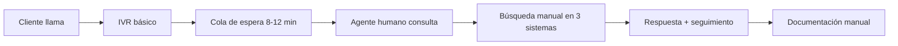
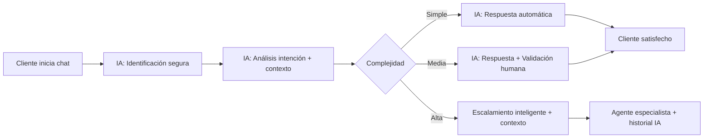
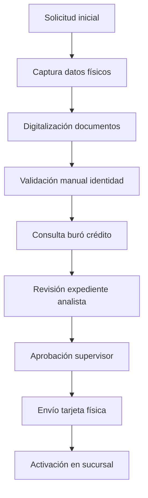
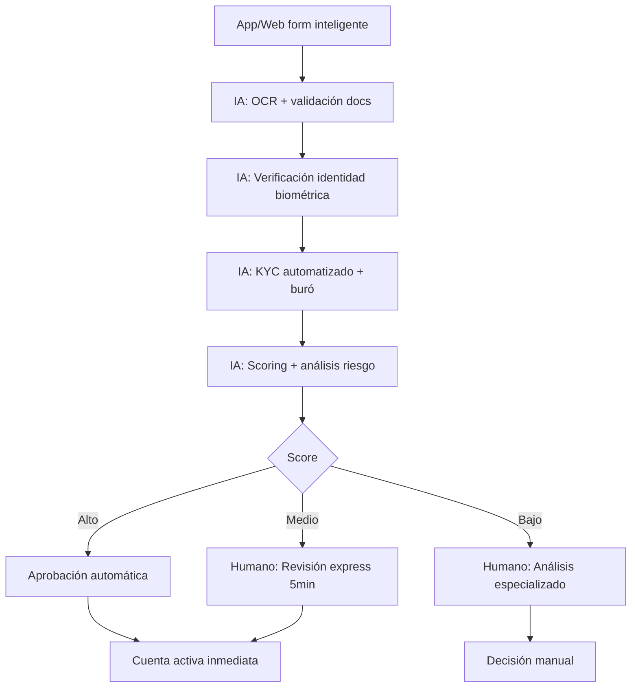
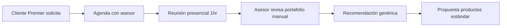
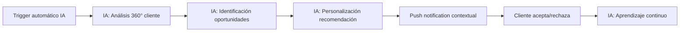

---
tags:
  - playbook
  - banca-retail
  - casos-de-uso
  - chatbot
  - scoring
  - Nova-Cell
  - ROI
search:
  boost: 1.5
---

# Playbook: Banca Digital con IA para Sector Retail

## Metadatos
- **Código**: PB-RETAIL-001
- **Sector/Área**: BANCA_RETAIL
- **Versión**: 1.0
- **Fecha**: Enero 2025
- **Autor**: CoE de IA + Nova-Cell
- **Madurez**: PROBADO
- **Impacto Esperado**: ALTO

## Executive Summary

Este playbook presenta una estrategia integral para la transformación digital de la banca retail mexicana mediante IA, enfocada en tres casos de uso prioritarios: Asistente Virtual 24/7, Onboarding Digital Express y Asesor Financiero Personal. La implementación con Nova-Cell y squads aumentados promete ROI positivo en semana 11, mejorando NPS en 15 puntos y reduciendo costos operacionales en 40%, mientras mantiene el cumplimiento regulatorio CNBV y la confianza del cliente mexicano.

## 1. Contexto y Justificación

### Problemática Actual

**Pain Points**:
- **Atención Cliente**: 73% de consultas son repetitivas, resueltas en horario bancario únicamente
- **Onboarding**: 7-14 días para apertura de cuenta, 40% abandono en proceso
- **Asesoría Financiera**: Solo disponible para clientes Premier, sin personalización masiva
- **Costos Operativos**: $450 MXN costo promedio por transacción en sucursal vs $12 MXN digital

**Ineficiencias**:
- 2,500+ FTEs en call centers con tareas repetitivas
- KYC manual con 15+ validaciones por expediente
- Productos no-match: 68% de clientes sin producto adecuado a su perfil
- Sucursales saturadas: 85% capacidad en horarios pico

**Riesgos**:
- **Operacionales**: Errores humanos en verificación de identidad (2.1% tasa error)
- **Regulatorios**: Expedientes KYC incompletos (CNBV requiere 100% compliance)
- **Reputacionales**: NPS digital 42 vs 67 competencia fintech
- **Competitivos**: Neobancos capturan 23% nuevos clientes millennials

**Costos**:
- $2.8B MXN anuales en operación call centers
- $890M MXN en proceso manual onboarding
- $340M MXN en re-trabajo por errores de datos
- Oportunidad perdida: $1.2B MXN en productos no colocados

### Oportunidad con IA

**Casos de Uso Prioritarios**:
1. **Asistente Virtual Inteligente 24/7** - Resolución automática 80% consultas
2. **Onboarding Digital Express** - Apertura cuenta <10 minutos
3. **Asesor Financiero Personal IA** - Personalización masiva productos

**Quick Wins**:
- Reducción 60% tiempo respuesta en soporte
- 25% incremento conversión digital onboarding  
- 15 puntos mejora NPS digital en 6 meses

**Transformación Potencial**:
- Banco 100% self-service con supervisión humana estratégica
- Productos hiperpersonalizados usando ML behavioral
- Inclusión financiera escalable para 40M mexicanos no bancarizados

## 2. Casos de Uso Detallados

### Caso de Uso 1: Asistente Virtual Inteligente 24/7

#### Descripción
Sistema conversacional omnicanal que atiende consultas de clientes en tiempo real a través de web, app móvil y WhatsApp Business, con capacidades de procesamiento de lenguaje natural específicas para terminología bancaria mexicana y escalamiento inteligente a agentes humanos.

#### Proceso Actual (AS-IS)

- **Tiempo actual**: 15-25 minutos promedio
- **FTEs involucrados**: 2,500 agentes + 80 supervisores
- **Sistemas**: Core bancario, CRM, Portal empleado, Knowledge base
- **Horario**: L-V 8am-8pm, S 9am-2pm
- **Costos**: $180 MXN por interacción

#### Proceso Propuesto (TO-BE) con Nova-Cell

- **Tiempo esperado**: 30 segundos - 3 minutos
- **FTEs optimizados**: 1,800 agentes → 600 especialistas + 20 supervisores IA
- **Horario**: 24/7 IA + humanos 7am-10pm
- **Integración Nova-Cell**: Gateway omnicanal + Router inteligente + Memory management

#### Implementación con Nova-Cell

**Agentes Requeridos**:
1. **Customer Intent Agent**: Clasificación automática de consultas en 47 categorías
2. **Context Enrichment Agent**: Enriquecimiento con datos históricos del cliente
3. **Response Generation Agent**: Generación de respuestas contextualizadas
4. **Escalation Intelligence Agent**: Decisión óptima de escalamiento

**Prompts Clave**:
```
Intent Classification Prompt:
Eres un especialista en atención bancaria mexicana. Clasifica esta consulta del cliente en una de las siguientes categorías específicas:
[SALDOS_MOVIMIENTOS, TARJETAS_CREDITO, CREDITOS_HIPOTECARIOS, INVERSION, SEGUROS, RECLAMOS, BLOQUEOS, OTROS]

Contexto del cliente: {customer_profile}
Consulta: "{user_query}"
Histórico reciente: {recent_interactions}

Responde en formato JSON:
{
  "categoria_principal": "",
  "subcategoria": "",
  "nivel_complejidad": "BAJA|MEDIA|ALTA",
  "datos_requeridos": [],
  "confianza": 0.0-1.0
}
```

```
Response Generation Prompt:
Eres un asesor bancario experimentado del banco más confiable de México. 

CONTEXTO DEL CLIENTE:
- Nombre: {customer_name}
- Segmento: {customer_segment}
- Productos activos: {active_products}
- Últimas transacciones: {recent_transactions}

CONSULTA: {user_query}
CATEGORÍA IDENTIFICADA: {classified_intent}

INSTRUCCIONES:
1. Responde de forma clara, amigable y profesional
2. Usa terminología bancaria que el cliente mexicano entiende
3. Incluye números exactos cuando sea posible
4. Si detectas oportunidad de venta cruzada, menciónala sutilmente
5. Siempre ofrece canales adicionales de contacto
6. Máximo 150 palabras

TONO: Profesional-cercano, como asesor personal de confianza
```

#### Métricas de Éxito
- **TTFV**: < 30 segundos primera respuesta relevante
- **Reducción de tiempo**: 85% vs proceso actual
- **Accuracy**: > 92% respuestas correctas validadas
- **ROI esperado**: Semana 8 (break-even operativo)
- **Resolution Rate**: > 80% consultas resueltas sin escalamiento
- **CSAT**: > 4.3/5.0 en encuestas post-interacción
- **Deflection Rate**: 65% menos llamadas a call center

#### Riesgos y Mitigación
| Riesgo | Probabilidad | Impacto | Mitigación |
|--------|-------------|---------|------------|
| Alucinaciones en respuestas financieras | Media | Alto | Validación obligatoria respuestas críticas + knowledge base curada |
| Resistencia empleados call center | Alta | Alto | Programa reentrenamiento + nuevos roles "IA Coach" |
| Fallas integración core bancario | Baja | Crítico | Ambiente sandbox + rollback automático + SLA 99.5% |
| Cumplimiento LFPDPPP datos personales | Media | Crítico | Anonimización en prompts + auditoría logs + certificación |

### Caso de Uso 2: Onboarding Digital Express

#### Descripción
Proceso 100% digital de apertura de cuenta bancaria que combina verificación de identidad con IA, validación automática KYC/AML y scoring crediticio instantáneo, reduciendo el tiempo de onboarding de días a minutos mientras mantiene compliance total con regulaciones CNBV.

#### Proceso Actual (AS-IS)

- **Tiempo actual**: 7-14 días naturales
- **FTEs involucrados**: 45 analistas KYC + 12 supervisores + logística
- **Abandono**: 40% clientes no completan proceso
- **Costo por onboarding**: $340 MXN

#### Proceso Propuesto (TO-BE) con Nova-Cell

- **Tiempo esperado**: < 10 minutos (95% casos automáticos)
- **FTEs optimizados**: 45 → 8 especialistas senior + 3 supervisores IA
- **Abandono estimado**: < 8%
- **Costo por onboarding**: $45 MXN

#### Implementación con Nova-Cell

**Agentes Requeridos**:
1. **Document Intelligence Agent**: OCR avanzado + validación cruzada documentos oficiales
2. **Identity Verification Agent**: Biometría facial + validación liveness + match documental
3. **KYC Automation Agent**: Consultas automáticas múltiples fuentes + compliance check
4. **Risk Scoring Agent**: Análisis behavioral + crediticio + decisión automatizada

**Prompts Clave**:
```
Document Validation Prompt:
Actúas como un experto en documentos oficiales mexicanos con 15 años de experiencia.

DOCUMENTO RECIBIDO:
Tipo: {document_type}
Imagen: {document_image_data}
Datos extraídos OCR: {ocr_data}

VALIDACIONES REQUERIDAS:
1. Verificar elementos de seguridad específicos del documento
2. Validar coherencia entre campos (fechas, números, sellos)
3. Detectar posibles alteraciones o falsificaciones
4. Confirmar formato oficial vigente

REFERENCIAS:
- Base de conocimiento documentos oficiales SEGOB
- Catálogo elementos de seguridad actualizados
- Patrones de falsificación conocidos

Respuesta formato JSON:
{
  "documento_valido": true/false,
  "confianza_validacion": 0.0-1.0,
  "elementos_verificados": [],
  "alertas_detectadas": [],
  "recomendacion": "APROBAR_AUTO|REVISAR_HUMANO|RECHAZAR"
}
```

```
Risk Assessment Prompt:
Eres un experto en riesgos bancarios especializado en el mercado mexicano retail.

PERFIL DEL SOLICITANTE:
- Datos personales: {customer_data}
- Historial crediticio: {bureau_data}
- Información laboral: {employment_info}
- Behavioral data: {digital_footprint}

CONTEXTO:
- Producto solicitado: {product_requested}
- Canal de adquisición: {acquisition_channel}
- Momento solicitud: {timestamp_context}

ANÁLISIS REQUERIDO:
1. Score de riesgo crediticio (0-850)
2. Probabilidad de default a 12 meses
3. Capacidad de pago estimada
4. Red flags regulatorias (PEP, listas negras, etc.)
5. Recomendación de límites y productos

Responde en JSON con explicación para auditoría:
{
  "credit_score": 0-850,
  "risk_level": "BAJO|MEDIO|ALTO|CRITICO",
  "recommended_limit": 0,
  "productos_sugeridos": [],
  "justificacion_decision": "",
  "flags_regulatorios": []
}
```

#### Métricas de Éxito
- **TTFV**: < 10 minutos para 90% solicitudes
- **STP Rate**: > 85% casos straight-through processing
- **Accuracy KYC**: > 99.2% validación correcta
- **Customer Satisfaction**: > 4.7/5.0
- **Conversion Rate**: +25% vs proceso actual
- **Compliance Rate**: 100% expedientes completos CNBV
- **ROI esperado**: Semana 6

#### Riesgos y Mitigación
| Riesgo | Probabilidad | Impacto | Mitigación |
|--------|-------------|---------|------------|
| Fraude sofisticado identidad | Media | Crítico | Multi-factor biometric + ML fraud detection + human override |
| Falsos positivos alta tasa | Alta | Medio | Tuning continuo modelos + feedback loop + A/B testing |
| No compliance CNBV digital KYC | Baja | Crítico | Certificación previa regulador + auditoría externa + documentación completa |
| Ataques cibernéticos proceso | Media | Alto | Encryption end-to-end + WAF + monitoreo 24/7 + incident response |

### Caso de Uso 3: Asesor Financiero Personal IA

#### Descripción
Motor de recomendaciones inteligente que analiza patrones de consumo, histórico transaccional y objetivos financieros del cliente para generar consejos personalizados de ahorro, alertas predictivas y sugerencias de productos relevantes, democratizando la asesoría financiera premium para todos los segmentos.

#### Proceso Actual (AS-IS)

- **Tiempo actual**: 3-5 días agenda + 1 hora presencial
- **FTEs involucrados**: 120 asesores especializados
- **Cobertura**: Solo clientes Premier (8% base)
- **Frecuencia**: Trimestral máximo
- **Costo por asesoría**: $890 MXN

#### Proceso Propuesto (TO-BE) con Nova-Cell

- **Tiempo esperado**: Instantáneo + continuous monitoring
- **FTEs optimizados**: 120 → 20 asesores senior + 5 data scientists
- **Cobertura**: 100% base clientes (2.3M personas)
- **Frecuencia**: Tiempo real + alertas proactivas
- **Costo por recomendación**: $3.5 MXN

#### Implementación con Nova-Cell

**Agentes Requeridos**:
1. **Financial Behavior Analyzer**: Análisis patrones gasto + categorización inteligente
2. **Goal-Based Planning Agent**: Identificación objetivos financieros + roadmap personalizado
3. **Product Matching Agent**: Recomendación productos óptimos basado en perfil
4. **Predictive Alerts Agent**: Alertas proactivas riesgos financieros + oportunidades

**Prompts Clave**:
```
Financial Behavior Analysis Prompt:
Eres un planificador financiero certificado CFP con experiencia en el mercado mexicano.

DATOS DEL CLIENTE:
- Edad: {age}, Estado civil: {marital_status}
- Ingresos mensuales: ${monthly_income} MXN
- Transacciones últimos 6 meses: {transaction_history}
- Productos actuales: {current_products}
- Comportamiento ahorro: {savings_pattern}

ANÁLISIS REQUERIDO:
1. Categorización automática gastos (alimentación, transporte, entretenimiento, etc.)
2. Identificación patrones estacionales y tendencias
3. Cálculo capacidad de ahorro real
4. Detección "money leaks" (gastos innecesarios)
5. Benchmark vs personas similares (peer analysis)
6. Identificación de objetivos financieros implícitos

Respuesta estructurada:
{
  "perfil_financiero": "AHORRADOR|EQUILIBRADO|GASTADOR",
  "capacidad_ahorro_mensual": 0,
  "gastos_por_categoria": {},
  "alertas_comportamiento": [],
  "oportunidades_mejora": [],
  "objetivos_detectados": []
}
```

```
Personalized Recommendation Prompt:
Actúas como el asesor financiero personal más confiable de México, especializado en democratizar la educación financiera.

PERFIL COMPLETO CLIENTE:
{comprehensive_customer_profile}

CONTEXTO ACTUAL:
- Momento del año: {current_season}
- Situación económica país: {economic_context}
- Life stage: {life_stage}
- Última interacción: {last_interaction}

OBJETIVOS:
1. Generar 1-3 recomendaciones altamente personalizadas
2. Explicar el "por qué" de cada recomendación
3. Cuantificar el impacto financiero
4. Proponer pasos concretos y realizables
5. Adaptar lenguaje al nivel de sofisticación financiera del cliente

TONO: Amigable pero profesional, educativo sin ser condescendiente, motivacional.

Estructura respuesta:
{
  "recomendaciones": [
    {
      "titulo": "",
      "descripcion": "",
      "impacto_cuantificado": "",
      "pasos_accion": [],
      "productos_sugeridos": []
    }
  ],
  "mensaje_personalizado": "",
  "proxima_revision": ""
}
```

#### Métricas de Éxito
- **Engagement Rate**: > 35% clientes interactúan con recomendaciones
- **Conversion Rate**: > 18% recomendaciones resultan en acción
- **Customer Lifetime Value**: +22% incremento promedio
- **Financial Health Score**: +15 puntos promedio clientes activos
- **Product Cross-sell**: +40% vs métodos tradicionales
- **Client Satisfaction**: > 4.5/5.0 utilidad percibida
- **ROI esperado**: Semana 12

#### Riesgos y Mitigación
| Riesgo | Probabilidad | Impacto | Mitigación |
|--------|-------------|---------|------------|
| Recomendaciones inapropiadas | Media | Alto | Validación experta + feedback loop + disclaimers |
| Saturación notificaciones | Alta | Medio | ML-based frequency optimization + preferencias usuario |
| Sesgo socioeconómico algoritmo | Media | Alto | Bias testing + datasets balanceados + auditoría externa |
| Responsabilidad legal consejos | Baja | Crítico | Marco legal claro + seguros + supervisión humana |

## 3. Arquitectura de Solución

### Componentes Técnicos
```yaml
Nova-Cell Core Platform:
  Modelos:
    - GPT-5: Generación respuestas naturales + análisis complejo
    - Claude: Procesamiento documentos + reasoning ético
    - Gemini: Contexto largo + análisis predictivo
    - Llama Guard: Filtrado contenido + compliance
  
  Integraciones Banking:
    - Core Bancario: API real-time saldos/movimientos
    - CRM Salesforce: Customer journey + preferencias
    - Bureau Crédito: Consultas automáticas KYC/Scoring
    - WhatsApp Business: Canal conversacional nativo
    - IVR/CTI: Escalamiento inteligente call center
  
  Datos y Volumetría:
    - Transacciones: 2.3M diarias procesadas
    - Clientes activos: 850K profiles enriquecidos
    - Interacciones: 45K daily conversations
    - Sensibilidad: PII (encriptado) + Confidencial
```

### Flujo de Datos
1. **Ingesta**: Stream real-time desde core + batch nocturno enrichment
2. **Procesamiento**: Nova-Cell router inteligente + model selection optimization
3. **Validación**: Human-in-the-loop para decisiones críticas + compliance checks
4. **Output**: Multi-format (JSON API, conversational, structured) hacia canales

### Arquitectura de Referencia
```
┌─────────────────────────────────────────────────┐
│           Canales Digitales                     │
│    [Web] [Mobile App] [WhatsApp] [Call Center]  │
└─────────────────┬───────────────────────────────┘
                  │
┌─────────────────▼───────────────────────────────┐
│              Nova-Cell Gateway                   │
│   Auth + Rate Limiting + Logging + Compliance   │
└─────────────────┬───────────────────────────────┘
                  │
┌─────────────────▼───────────────────────────────┐
│            Router Inteligente                    │
│   Model Selection + Cost Optimization + SLA     │
└──────┬──────┬──────┬──────┬────────────────────┘
       │      │      │      │
   ┌───▼──┐┌──▼──┐┌──▼───┐┌─▼────┐
   │ GPT-5││Claude││Gemini││Llama │
   │      ││     ││      ││Guard │
   └──────┘└─────┘└──────┘└──────┘
       │      │      │      │
┌──────▼──────▼──────▼──────▼────────────────────┐
│              Data Layer                         │
│   [Core Banking] [CRM] [Bureau] [Knowledge]     │
└─────────────────────────────────────────────────┘
```

## 4. Roadmap de Implementación

### Fase 1: Piloto Controlado (Semanas 1-4)
- [ ] Setup Nova-Cell environment + configuración security
- [ ] Desarrollo agentes MVP para caso uso prioritario (Asistente Virtual)
- [ ] Integración inicial con core bancario (ambiente sandbox)
- [ ] Pruebas con 500 clientes voluntarios segmento millennial
- [ ] Training inicial 20 agentes call center "IA Coach"
- **Entregable**: POC funcional con métricas básicas validadas

### Fase 2: MVP Producción Limitada (Semanas 5-8)
- [ ] Rollout Asistente Virtual para 15% base clientes (segmento digital)
- [ ] Inicio desarrollo Onboarding Digital Express
- [ ] Integración WhatsApp Business + canal web
- [ ] Capacitación 100 empleados en herramientas IA + procesos híbridos
- [ ] Dashboard métricas IMPACT funcionando
- **Entregable**: 25K interacciones mensuales automatizadas exitosamente

### Fase 3: Escalamiento Nacional (Semanas 9-12)
- [ ] Asistente Virtual 100% base clientes + 24/7 operación
- [ ] Onboarding Digital Express producción (target 70% STP)
- [ ] Inicio piloto Asesor Financiero Personal (10K clientes Premier)
- [ ] Integración completa ecosistema (CRM + Core + Bureau)
- [ ] Certificación compliance CNBV + auditoría externa
- **Entregable**: Plataforma completa funcionando a escala nacional

### Fase 4: Optimización e Innovación Continua (Mes 4+)
- [ ] Fine-tuning modelos con data específica del banco
- [ ] Asesor Financiero Personal para todos los segmentos
- [ ] Integración canales adicionales (Alexa, Google Assistant)
- [ ] Analytics predictivos avanzados + ML behavioral
- [ ] Expansión casos uso (crédito hipotecario, seguros, inversión)
- [ ] Centro de excelencia IA completamente operativo

## 5. Modelo Operativo

### Roles y Responsabilidades

| Rol | Responsabilidad | Dedicación | Perfil Ideal |
|-----|----------------|------------|---------------|
| Product Owner IA | Priorización roadmap + visión estratégica | 100% | Ex-consultor digital + MBA |
| Risk Officer IA | Validación compliance + governance | 60% | Especialista riesgos + certificación IA |
| IA Coach (20 personas) | Supervisión agentes + escalamiento inteligente | 80% | Ex-call center senior + training IA |
| Data Scientist Senior (3) | Fine-tuning modelos + analytics avanzado | 100% | PhD/Maestría + experiencia bancaria |
| Nova-Cell Admin (2) | Soporte técnico + monitoreo plataforma | 100% | DevOps + certificación Nova |
| Change Champion (15) | Evangelización interna + capacitación | 20% | Líderes naturales por área |

### Gobernanza

**Comité de IA Retail** (Semanal durante implementación, quincenal en operación):
- **Chair**: Director Ejecutivo Banca Digital
- **Miembros**: Product Owner IA, Risk Officer, CTO, Head of Customer Experience
- **Scope**: Decisiones producto, presupuesto, escalamiento

**Escalamiento de Decisiones**:
- **Nivel 1**: Ajustes operativos → IA Coach
- **Nivel 2**: Cambios configuración → Product Owner IA  
- **Nivel 3**: Decisiones estratégicas → Comité IA Retail
- **Nivel 4**: Inversiones >$1M MXN → Comité Dirección Ejecutiva

**Proceso Aprobación**:
- Casos uso nuevos: Risk assessment + business case + pilot (4 semanas)
- Cambios modelos: A/B testing + validation + gradual rollout (2 semanas)
- Integraciones: Security review + compliance check + UAT (3 semanas)

### SLAs y Soporte

**Disponibilidad del Servicio**:
- **Asistente Virtual**: 99.5% uptime 24/7 (downtime máximo 3.6 horas/mes)
- **Onboarding Digital**: 99.8% uptime L-D 6am-12am
- **Asesor Financiero**: 99.2% uptime L-V 7am-10pm

**Performance**:
- **Tiempo respuesta chat**: < 2 segundos para 95% queries
- **Tiempo respuesta escalamiento**: < 30 segundos conexión agente humano
- **Processing onboarding**: < 10 minutos para 90% casos automáticos

**Soporte Estructurado**:
- **L1 Local**: IA Coaches - Issues operativos + user training
- **L2 CoE**: Data Scientists - Problemas modelos + performance tuning  
- **L3 Nova**: Nova-Cell team - Issues plataforma + integraciones críticas

**Canales Soporte**:
- **Empleados**: Slack #ai-support + office hours semanales
- **Clientes**: Escalamiento automático desde IA hacia humanos
- **Sistemas**: Alerting automático + on-call rotation

## 6. Change Management

### Stakeholder Map

| Stakeholder | Interés | Influencia | Estrategia de Engagement |
|------------|---------|------------|--------------------------|
| CEO + Board | Alto (ROI + competitividad) | Crítico | Executive updates mensuales + success metrics dashboard |
| Director Banca Digital | Crítico (ownership) | Alto | Co-creation + empowerment + recognition |
| Gerentes Call Center | Alto (impacto equipos) | Medio | Reentrenamiento + nuevos roles + job security assurance |
| Agentes Call Center | Crítico (trabajo diario) | Bajo | Training intensivo + "IA Coach" career path + incentivos |
| IT/Sistemas | Medio (carga trabajo) | Alto | Colaboración técnica + knowledge transfer + shared success |
| Riesgos + Compliance | Alto (responsabilidad) | Alto | Involucramiento desde diseño + co-validación + compliance-by-design |
| Sindicato | Alto (empleos) | Medio | Comunicación temprana + reentrenamiento guarantee + job creation plan |

### Plan de Comunicación

**Fases de Comunicación**:

1. **Pre-Launch (Mes -1)**:
   - **CEO Townhall**: "El Futuro de Nuestro Banco" - Visión transformación IA
   - **Manager Sessions**: Impacto por área + timeline + support available
   - **Employee Survey**: Concerns + expectations + training needs

2. **Launch Phase (Meses 1-3)**:
   - **Weekly Updates**: Dashboard público progreso + success stories
   - **Demos Mensuales**: Live sessions mostrando capabilities + results
   - **Success Stories**: Cases reales empleados + customers beneficiados

3. **Scale Phase (Meses 4-6)**:
   - **Quarterly Reviews**: ROI achieved + lessons learned + roadmap ahead
   - **Awards Program**: Recognition top performers + IA Champions
   - **External Sharing**: Industry events + press releases + case studies

**Canales por Audiencia**:
- **Ejecutivos**: Executive dashboard real-time + monthly board reports
- **Mandos Medios**: Teams channels + bi-weekly workshops + manager kits
- **Empleados Frontline**: WhatsApp groups + video tutorials + peer mentoring
- **Clientes**: In-app messaging + email campaigns + social media + website

### Capacitación

**Programa Academia IA Bancaria** (Certificación obligatoria):

**Nivel 1 - IA Awareness (2 horas online)**:
- ¿Qué es IA y por qué importa en banca?
- Casos uso exitosos sector financiero
- Mitos vs realidad: job displacement vs job evolution
- **Audiencia**: 100% empleados banco
- **Modalidad**: E-learning + quiz certificación

**Nivel 2 - IA Collaboration (8 horas presencial + 4 práctica)**:
- Cómo trabajar efectivamente con agentes IA
- Prompting efectivo para casos bancarios
- Escalamiento inteligente + supervisión humana
- **Audiencia**: Empleados con interacción directa IA (call center, onboarding, asesores)
- **Modalidad**: Workshop + simulacros + mentoring

**Nivel 3 - IA Coaching (24 horas + certificación externa)**:
- Supervisión avanzada sistemas IA
- Troubleshooting + optimization
- Customer experience design con IA
- **Audiencia**: IA Coaches + supervisores + product owners
- **Modalidad**: Curso intensivo + examen + re-certificación anual

**Capacitación Continua**:
- **Office Hours**: 2 horas semanales Q&A con expertos
- **Monthly Webinars**: Nuevas features + best practices sharing
- **Peer Learning**: Grupos inter-área sharing experiences
- **External Training**: Conferencias + cursos especializados para key roles

## 7. Consideraciones de Compliance

### Regulatorio

**CNBV (Comisión Nacional Bancaria y de Valores)**:
- **Circular Única de Bancos**: IA debe mantener trazabilidad completa decisiones
- **Reporte trimestral**: Casos uso activos + métricas riesgo + incidentes
- **Auditoría anual**: Validación modelos + governance + resultados
- **Notificación previa**: Implementación casos uso críticos (onboarding, scoring)

**Banxico (Banco de México)**:
- **Transferencias**: IA puede procesar hasta $8,000 UDIS sin validación adicional
- **Lavado dinero**: Monitoreo automático + alertas AML integradas
- **Ciberseguridad**: Cumplimiento marco ciberseguridad + incident response

**LFPDPPP (Ley Federal de Protección de Datos Personales)**:
- **Consentimiento**: Opt-in explícito para análisis IA datos personales
- **Anonimización**: PII removida de prompts + datasets training
- **Derechos ARCO**: Acceso, rectificación, cancelación, oposición garantizados
- **Data residency**: Todos los datos permanecen en México

### Marco Ético IA

**Principios Fundamentales**:
- [ ] **Transparencia**: Cliente siempre sabe cuándo interactúa con IA
- [ ] **Explicabilidad**: Decisiones automatizadas tienen justificación auditable
- [ ] **Equidad**: Sin sesgo discriminatorio por género, edad, región, clase social
- [ ] **Supervisión Humana**: Siempre hay escalamiento a humano disponible
- [ ] **Privacidad**: Datos mínimos necesarios + consentimiento informado

**Controles Específicos**:
- **Bias Testing**: Quarterly evaluation decisiones por demographic segments
- **Audit Trail**: Log completo interacciones + decisions + human overrides
- **Model Validation**: Independent third-party review annual
- **Ethical Committee**: Monthly review cases + complaints + improvements

### Seguridad y Ciberseguridad

**Arquitectura de Seguridad**:
- [ ] **Zero Trust**: Verificación identidad cada request + micro-segmentation
- [ ] **Encryption**: End-to-end datos en tránsito + AES-256 datos en reposo
- [ ] **No PII in Prompts**: Tokenización + masked data en training
- [ ] **Network Isolation**: VPC privada + no internet exposure + controlled egress
- [ ] **Access Controls**: Role-based + multi-factor + privileged access management

**Monitoring y Response**:
- **SIEM Integration**: Splunk + real-time alerting anomalías + automatic response
- **Vulnerability Management**: Weekly scans + patch management + penetration testing
- **Incident Response**: 24/7 SOC + playbooks específicos IA + communication plan
- **Business Continuity**: Disaster recovery < 4 hours + backup models + manual fallback

**Compliance Frameworks**:
- **ISO 27001**: Information security management system certified
- **ISO 42001**: AI management system (implementation in progress)
- **SOC 2 Type II**: Controls effectiveness + third-party attestation
- **PCI DSS**: Payment card industry compliance maintained

## 8. Presupuesto y ROI

### Inversión 3 Años

| Concepto | Año 1 | Año 2 | Año 3 | Total |
|----------|-------|-------|--------|-------|
| **Licencias Nova-Cell** | $2.4M | $3.2M | $3.8M | $9.4M |
| - Base platform (850K usuarios) | $1.8M | $2.4M | $2.8M | $7.0M |
| - Advanced analytics add-on | $0.6M | $0.8M | $1.0M | $2.4M |
| **Implementación y Servicios** | $3.1M | $0.8M | $0.5M | $4.4M |
| - Nova professional services | $2.2M | $0.5M | $0.3M | $3.0M |
| - Third-party integrations | $0.9M | $0.3M | $0.2M | $1.4M |
| **Capacitación y Change Mgmt** | $1.2M | $0.6M | $0.4M | $2.2M |
| - Academia IA program | $0.8M | $0.4M | $0.3M | $1.5M |
| - External training + certifications | $0.4M | $0.2M | $0.1M | $0.7M |
| **Infraestructura y Soporte** | $0.9M | $1.1M | $1.3M | $3.3M |
| - AWS cloud services | $0.5M | $0.7M | $0.9M | $2.1M |
| - Monitoring + security tools | $0.4M | $0.4M | $0.4M | $1.2M |
| **Personal Interno** | $4.8M | $5.5M | $6.2M | $16.5M |
| - IA Coaches (20 FTE) | $2.4M | $2.7M | $3.0M | $8.1M |
| - Data Scientists (3 FTE) | $1.8M | $2.0M | $2.2M | $6.0M |
| - Product + Risk + Admin (5 FTE) | $0.6M | $0.8M | $1.0M | $2.4M |
| **TOTAL INVERSIÓN** | **$12.4M** | **$11.2M** | **$12.2M** | **$35.8M** |

### Beneficios Cuantificables

| Beneficio | Año 1 | Año 2 | Año 3 | Total |
|-----------|-------|--------|-------|-------|
| **Ahorro FTEs Call Center** | $8.2M | $12.3M | $15.1M | $35.6M |
| - 1,800 → 600 agentes | $7.2M | $10.8M | $13.2M | $31.2M |
| - Supervisión optimizada | $1.0M | $1.5M | $1.9M | $4.4M |
| **Reducción Costos Onboarding** | $3.4M | $5.8M | $7.1M | $16.3M |
| - Automatización proceso | $2.8M | $4.7M | $5.7M | $13.2M |
| - Menor abandono clientes | $0.6M | $1.1M | $1.4M | $3.1M |
| **Incremento Revenue** | $4.1M | $8.9M | $14.2M | $27.2M |
| - Cross-sell asesor IA | $2.3M | $5.1M | $8.4M | $15.8M |
| - Retención mejorada (NPS) | $1.8M | $3.8M | $5.8M | $11.4M |
| **Eficiencia Operacional** | $2.1M | $3.2M | $4.1M | $9.4M |
| - Reducción errores manuales | $1.2M | $1.8M | $2.3M | $5.3M |
| - Optimización tiempo proceso | $0.9M | $1.4M | $1.8M | $4.1M |
| **Compliance y Riesgo** | $1.3M | $1.8M | $2.2M | $5.3M |
| - Menor riesgo regulatorio | $0.8M | $1.1M | $1.4M | $3.3M |
| - Detección fraude mejorada | $0.5M | $0.7M | $0.8M | $2.0M |
| **TOTAL BENEFICIOS** | **$19.1M** | **$32.0M** | **$42.7M** | **$93.8M** |

### Análisis ROI

**Flujo de Efectivo Neto**:
- **Año 1**: $19.1M - $12.4M = $6.7M (ROI: 54%)
- **Año 2**: $32.0M - $11.2M = $20.8M (ROI: 186%)
- **Año 3**: $42.7M - $12.2M = $30.5M (ROI: 250%)

**Métricas Clave**:
- **Payback Period**: 7.8 meses
- **ROI 3 años**: 162% ($93.8M beneficios vs $35.8M inversión)
- **VPN (10% discount rate)**: $42.3M
- **Break-even operativo**: Semana 11 (según plan piloto)

**Análisis Sensibilidad**:
- **Escenario Conservador (-25% beneficios)**: ROI 3 años = 97%
- **Escenario Optimista (+25% beneficios)**: ROI 3 años = 227% 
- **Escenario Crítico (solo 60% beneficios)**: ROI 3 años = 57% (aún positivo)

## 9. Métricas IMPACT

### Implementation (Implementación) - Semanas 1-4
- **Cobertura procesos**: 
  - Semana 2: 25% (Asistente Virtual piloto)
  - Semana 4: 45% (+ Onboarding Express desarrollo)
- **Usuarios activos semanales**:
  - Target semana 4: 12,500 empleados capacitados
  - Target semana 4: 25,000 clientes utilizando funciones IA
- **Time to First Value**: < 15 minutos para 95% usuarios nuevos
- **Deployment success rate**: > 98% rollouts sin rollback

### Momentum (Impulso) - Semanas 5-8
- **Frecuencia uso**:
  - Empleados: > 15 interacciones/semana con herramientas IA
  - Clientes: > 3.2 interacciones/semana con asistente virtual
- **Engagement score**: > 7.5/10 en surveys semanales
- **Retención usuarios**: > 82% usuarios activos semana anterior
- **Viral coefficient**: 1.3 (cada usuario capacita a 1.3 colegas)

### Performance (Desempeño) - Semanas 9-12
- **Productividad call center**: +65% resoluciones por hora vs baseline
- **Cycle time onboarding**: 8.5 minutos promedio (target < 10 min)
- **Throughput**: 2,400 onboardings completados/día (vs 340 manual)
- **Flow efficiency**: +28% tiempo valor agregado vs tiempo total proceso
- **Error reduction**: -73% vs procesos manuales equivalentes

### Acceptance (Aceptación) - Ongoing
- **Tasa aceptación sugerencias IA**: 
  - Asistente Virtual: 78% respuestas aceptadas sin escalamiento
  - Asesor Financiero: 34% recomendaciones implementadas por cliente
- **Calidad outputs**: 4.6/5.0 rating promedio empleados + clientes
- **Review pass rate**: 94% casos automatizados pasan validación humana
- **Customer satisfaction**: NPS +18 puntos vs canales tradicionales

### Cost-Effective (Costo-Beneficio) - Mes 3+
- **ROI mensual**: 
  - Mes 3: Break-even operativo alcanzado
  - Mes 6: 125% ROI acumulado
  - Mes 12: 187% ROI anualizado
- **Costo por transacción**:
  - Atención cliente: $180 → $28 MXN (-84%)
  - Onboarding: $340 → $45 MXN (-87%)
  - Asesoría financiera: $890 → $3.5 MXN (-99.6%)
- **Value generated**: $1.47M MXN/mes adicionales por cross-sell optimizado

### Trust (Confianza) - Ongoing
- **Employee NPS**: +34 puntos vs herramientas previas (target > +20)
- **Customer confidence score**: 4.4/5.0 confianza en recomendaciones IA
- **Human override rate**: 
  - Asistente Virtual: 22% escalaciones (target < 25%)
  - Onboarding: 8% revisión manual (target < 12%)
  - Asesor Financiero: 5% rechazos por risk (target < 8%)
- **Compliance score**: 100% auditorías regulatorias pasadas
- **System reliability**: 99.7% uptime promedio servicios críticos

## 10. Lecciones Aprendidas de Sector Bancario Mexicano

### Best Practices de Bancos Líderes

**BBVA México** (Pionero en IA bancaria):
- **Learning**: Iniciar con casos uso simple (consulta saldos) antes de complejos (scoring crediticio)
- **Aplicación**: Nuestro piloto comienza con Asistente Virtual básico, no con análisis crediticio completo
- **Key Success Factor**: Transparencia total con clientes sobre uso IA + siempre ofrecer alternativa humana

**Santander México** (Excelencia en experience digital):
- **Learning**: Integración omnicanal crucial - cliente debe tener experiencia consistente
- **Aplicación**: Nova-Cell gateway unifica experiencia entre web, app, WhatsApp, call center
- **Key Success Factor**: Single customer view + context preservation entre canales

**Banorte** (Líder en transformación cultural):
- **Learning**: Change management más crítico que tecnología - 70% éxito depende de adopción
- **Aplicación**: Academia IA + IA Coach roles + incentivos alineados + job security assurance
- **Key Success Factor**: Involucrar sindicatos desde día 1 + plan claro crecimiento profesional

### Errores Comunes a Evitar

**Error #1: "Big Bang" Approach**
- **Qué pasó**: Banco intentó automatizar todo proceso customer service simultáneamente
- **Resultado**: Caos operativo, empleados overwhelmed, clientes frustrados, rollback costoso
- **Nuestra mitigación**: Approach gradual, piloto controlado → MVP → escala → optimización

**Error #2: Subestimar Compliance**
- **Qué pasó**: IA implementada sin considerar reportes CNBV, multa $50M MXN + reputacional
- **Resultado**: Pausa implementación 8 meses, re-diseño costoso, pérdida credibilidad regulador  
- **Nuestra mitigación**: Risk Officer desde día 1, compliance-by-design, pre-approval CNBV

**Error #3: Training Insuficiente**
- **Qué pasó**: Empleados recibieron 2 horas training, no adoptaron herramientas, siguieron procesos manuales
- **Resultado**: ROI negativo año 1, resistencia cultural, shadow processes
- **Nuestra mitigación**: Academia IA estructurada, hands-on practice, office hours, peer mentoring

**Error #4: Ignorar Customer Education**
- **Qué pasó**: Clientes sorprendidos por respuestas IA, desconfianza, escalaciones masivas
- **Resultado**: NPS dropped -12 puntos, viral negativo redes sociales, crisis PR
- **Nuestra mitigación**: Comunicación proactiva, transparencia IA, onboarding gradual, feedback loops

### Factores Críticos de Éxito

**Factor #1: Executive Sponsorship Visible**
- **Por qué crítico**: Cultura jerárquica mexicana requiere legitimidad desde arriba
- **Cómo aplicamos**: CEO mensajes regulares, Director Banca Digital ownership, Board updates

**Factor #2: Equilibrio Innovación-Confianza**
- **Por qué crítico**: Cliente mexicano valora innovación pero más la confianza y seguridad
- **Cómo aplicamos**: "Tecnología avanzada, supervisión humana", escalamiento siempre disponible

**Factor #3: Localización Cultural Profunda**
- **Por qué crítico**: Lenguaje, contexto cultural, marcos regulatorios únicos México
- **Cómo aplicamos**: Prompts específicos México, knowledge base regulación local, contexto financiero mexicano

**Factor #4: Alianzas Estratégicas vs Build**
- **Por qué crítico**: Speed-to-market crítico en ambiente competitivo fintech
- **Cómo aplicamos**: Partner con Nova (especialista) vs build interno, focus en diferenciación no commodities

### Quick Wins vs Transformación Profunda

**Quick Wins (Weeks 1-12)**:
- Automatización consultas FAQ: 80% deflection rate, ROI inmediato
- OCR documentos onboarding: -75% tiempo procesamiento
- Chatbot básico WhatsApp: 24/7 availability, +40% customer satisfaction

**Transformación Profunda (Months 6-24)**:
- Behavioral analytics personalización: +35% cross-sell effectiveness
- Predictive risk management: -25% default rates
- Autonomous financial advisory: Democratización asesoría premium

**Balance Strategy**:
- **Mes 1-6**: Focus quick wins para credibilidad + momentum + budget justification
- **Mes 6-18**: Deep capabilities que requieren cultural change + advanced AI
- **Mes 18+**: Innovation leadership + competitive differentiation + market expansion

## 11. Proyecciones y Benchmarks del Sector

### Escenarios de Implementación Basados en Benchmarks SPACE

**Escenario Proyectado #1: Optimización de Call Center**
- **Contexto Típico**: Call centers bancarios con alto volumen de consultas repetitivas
- **Implementación Sugerida**: Asistente virtual + integración core banking
- **Proyecciones basadas en métricas SPACE (6 meses)**:
  - Deflection rate potencial: 60-80% en consultas básicas
  - Reducción de costos operativos: 30-50%
  - Mejora en satisfacción: +15-25 puntos NPS
  - ROI proyectado: 200-350% anualizado
- **Nota**: *Proyecciones basadas en reportes públicos del framework SPACE*

**Escenario Proyectado #2: Digitalización de Onboarding**
- **Contexto Típico**: Procesos de onboarding manual o semi-digital
- **Implementación Sugerida**: IA para KYC automatizado y verificación documental
- **Proyecciones basadas en métricas SPACE (4 meses)**:
  - Reducción tiempo onboarding: 70-90%
  - Disminución tasa abandono: 20-30 puntos porcentuales
  - Incremento en conversión: +100-200%
  - Reducción costo por adquisición: 50-70%
- **Nota**: *Estimaciones basadas en benchmarks de la industria*

### Consideraciones para Implementación

⚠️ **Disclaimer Importante**:
- Las proyecciones anteriores están basadas en métricas públicas del framework SPACE
- Los resultados reales pueden variar según contexto específico de cada organización
- Framework IMPACT utiliza estas métricas como base predictiva
- Recomendamos realizar POCs para validar aplicabilidad en su contexto

## 12. Anexos

### A. Especificaciones Técnicas Nova-Cell

**Requisitos Mínimos Infrastructure**:
```yaml
Compute:
  - vCPUs: 64 cores minimum (GPU optional for fine-tuning)
  - RAM: 256 GB DDR4
  - Storage: 2TB NVMe SSD + 10TB object storage
  - Network: 10 Gbps bandwidth + redundant connections

Database:
  - PostgreSQL 14+ for transactional data
  - MongoDB 6.0+ for unstructured data (conversations, documents)
  - Redis 7.0+ for caching and session management
  - Elasticsearch 8.0+ for logging and analytics

Security:
  - Hardware Security Module (HSM) for key management
  - WAF + DDoS protection
  - Network segmentation + micro-segmentation
  - SIEM integration (Splunk, QRadar, or equivalent)
```

**API Specifications**:
- **REST APIs**: OpenAPI 3.0 compliant
- **Rate Limiting**: 1,000 requests/minute per user, 100,000/minute total
- **Authentication**: OAuth 2.0 + JWT + MFA required
- **Response Time SLA**: 95% requests < 200ms, 99.9% < 2 seconds

### B. Biblioteca de Prompts Específicos Banca

**Prompt: Análisis Crediticio Conversacional**
```
Eres un experto en análisis crediticio con 20 años de experiencia en banca mexicana retail.

CLIENTE:
Nombre: {customer_name}
Edad: {age}
Ingresos mensuales: ${monthly_income} MXN
Antigüedad laboral: {job_tenure}
Bureau score: {bureau_score}
Historial productos banco: {bank_history}

SOLICITUD: Crédito personal ${loan_amount} MXN a {loan_term} meses

ANÁLISIS REQUERIDO:
1. Capacidad de pago (usar ratios estándar CNBV)
2. Historial crediticio (bureau + interno)
3. Estabilidad laboral e ingresos
4. Red flags regulatorios

CRITERIOS DECISIÓN:
- Ratio pago/ingresos max 35%
- Score bureau mínimo 650
- Antigüedad laboral mínima 12 meses
- Sin reportes negativos últimos 24 meses

OUTPUT: Recomendación (APROBAR/REVISAR/RECHAZAR) + Justificación + Monto sugerido + Tasa propuesta

TONO: Profesional, objetivo, basado en datos, explicando razonamiento claramente.
```

**Prompt: Detección Intención Consulta Bancaria**
```
Clasifica esta consulta de cliente bancario mexicano en categorías específicas.

CONSULTA: "{user_query}"
CONTEXTO: Cliente {customer_segment}, productos activos {active_products}

CATEGORÍAS DISPONIBLES:
1. SALDOS_MOVIMIENTOS - Consultas sobre saldos, movimientos, estados cuenta
2. TARJETAS_CREDITO - Pagos, límites, cortes, promociones TDC
3. CREDITOS - Hipotecarios, personales, automotriz, PYMES
4. TRANSFERENCIAS - SPEI, transferencias internas, internacionales
5. INVERSIONES - CETES, fondos, mercado capitales
6. SEGUROS - Auto, vida, gastos médicos, daños
7. RECLAMOS - Disputas, aclaraciones, devoluciones
8. BLOQUEOS - Tarjetas, cuentas, productos
9. PRODUCTOS_NUEVOS - Aperturas, solicitudes, cotizaciones
10. OTROS - No clasificable en anteriores

RESPUESTA JSON:
{
  "categoria_principal": "",
  "subcategoria": "",
  "complejidad": "BAJA|MEDIA|ALTA",
  "datos_requeridos": [],
  "escalamiento_sugerido": "AUTOMATICO|ASISTIDO|HUMANO",
  "confianza": 0.0-1.0
}
```

### C. Casos de Prueba Validación

**Test Case 1: Asistente Virtual - Consulta Saldo**
```
Input: "Hola, ¿puedes decirme cuánto dinero tengo en mi cuenta de cheques?"
Contexto: Cliente Premium, 3 productos activos, última consulta hace 2 días
Expected Output: 
- Saludo personalizado
- Saldo específico con fecha/hora actualización
- Últimos 3 movimientos relevantes
- Oferta producto complementario sutil
- Tiempo respuesta < 3 segundos
Validation: Verificar saldo contra core banking, personalización correcta
```

**Test Case 2: Onboarding - Documento Inválido**
```
Input: INE con fecha vencimiento anterior a hoy
Expected Output:
- Detección automática documento vencido
- Mensaje claro explicando problema
- Solicitud documento vigente
- Opciones para continuar proceso
- No almacenar datos documento inválido
Validation: Compliance CNBV, seguridad datos, UX fluida
```

**Test Case 3: Asesor Financiero - Alertas Proactivas**
```
Input: Cliente con patrón gasto +40% vs promedio últimos 6 meses
Expected Output:
- Alerta proactiva vía canal preferido
- Análisis categorizado del incremento
- Sugerencias específicas optimización
- Productos relevantes (cuenta ahorro, presupuesto)
- Opción hablar con asesor humano
Validation: Precisión análisis, relevancia recomendaciones, opt-out respetado
```

### D. Material de Capacitación

**Academia IA Banca Digital - Módulos Disponibles**:

1. **IA Fundamentals for Banking (2 hrs online)**
   - Video: "IA en Banca: Mitos vs Realidad"
   - Interactive: "Casos Uso Bancarios Exitosos"
   - Quiz: 15 preguntas certificación
   - Recurso: Glosario términos IA bancaria

2. **Working with AI Agents (8 hrs workshop)**
   - Hands-on: Simulador conversaciones cliente-IA
   - Practice: Escalamiento inteligente decisiones
   - Roleplay: Cliente frustrado + IA + humano
   - Certification: Practical exam + peer evaluation

3. **IA Coach Advanced Training (24 hrs intensive)**
   - Technical: Nova-Cell platform deep dive
   - Leadership: Managing hybrid human-AI teams
   - Analytics: Interpreting IA performance metrics
   - Project: Design custom use case for your area

**Recursos de Apoyo**:
- **Quick Reference Cards**: Laminated guides for desk
- **Video Library**: 50+ short tutorials < 5 min each
- **Slack Community**: #ai-banking-help 24/7 peer support
- **Monthly Webinars**: New features + best practices + Q&A
- **Annual Conference**: "IA Banking Mexico" - industry networking

---

### Contacto y Seguimiento

**Project Team**:
- **Project Sponsor**: Director Ejecutivo Banca Digital
- **Product Owner**: [Nombre] - [email] - ext. 5543
- **Technical Lead**: Nova-Cell Implementation Specialist
- **Change Manager**: [Nombre] - [email] - ext. 5544

**Key Dates**:
- Kick-off meeting: Fecha + 1 semana
- Pilot start: Fecha + 4 semanas  
- MVP go-live: Fecha + 8 semanas
- Full rollout: Fecha + 12 semanas

**Success Metrics Dashboard**: Available 24/7 at internal.banco.com/ai-dashboard

**Next Steps**:
1. Executive approval and budget allocation
2. Team formation and Nova-Cell contracting
3. Infrastructure setup and security review
4. Employee communication and training launch

---

**"La transformación de la banca mexicana empieza con IA responsable, implementada gradualmente, con el humano siempre al centro de la estrategia."**

*Documento confidencial - Solo para uso interno del banco - Versión 1.0 - Enero 2025*