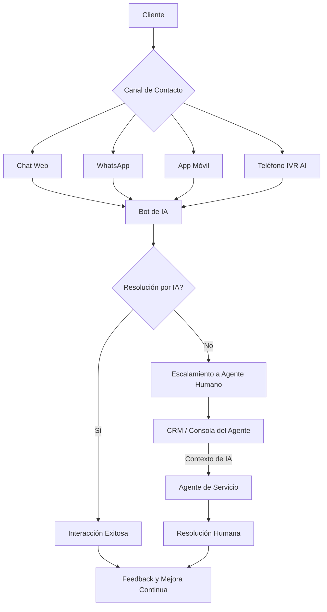
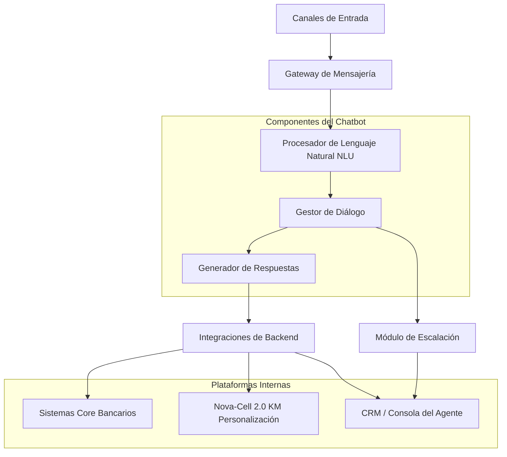
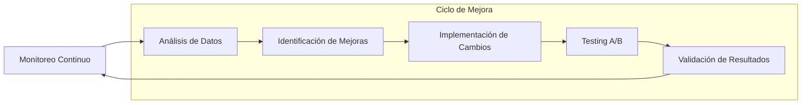
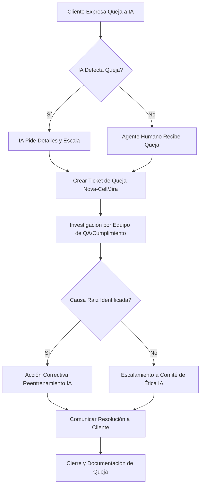
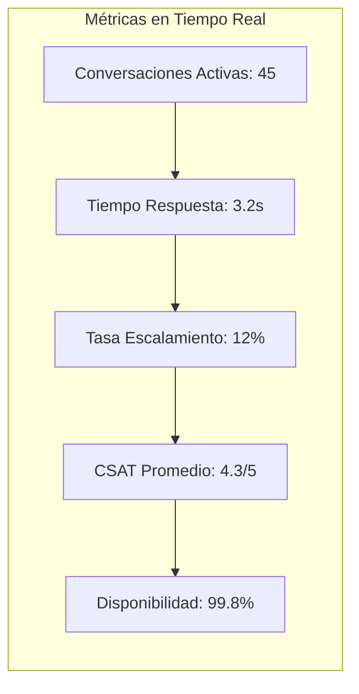

# Playbook de IA para Servicio al Cliente - Banco de México v1.0

> **Última actualización:** Enero 2025  
> **Clasificación:** Uso Interno  
> **Marco Regulatorio:** CONDUSEF, LFPDPPP, CNBV

## 🎯 Propósito

Este playbook establece las directrices y el marco operativo para la implementación y gestión de sistemas de Inteligencia Artificial en el servicio al cliente de un banco mexicano, buscando optimizar la experiencia del cliente, mejorar la eficiencia operativa y asegurar el cumplimiento regulatorio y ético.

---

## 1. Marco de Servicio (Service Framework)

Este marco define cómo la IA se integra en la estrategia de servicio al cliente, garantizando interacciones fluidas y un soporte robusto.

### 1.1 Interacciones con Clientes Potenciadas por IA

La IA será el motor principal para resolver consultas rutinarias, proporcionar información y guiar a los clientes a través de procesos bancarios, liberando a los agentes humanos para tareas más complejas y de alto valor.

**Objetivos Clave:**
- **Resolución en Primer Contacto (FCR):** Aumentar el porcentaje de interacciones resueltas completamente por IA sin intervención humana.
- **Disponibilidad 24/7:** Ofrecer soporte continuo a través de canales digitales.
- **Personalización:** Adaptar respuestas y ofertas basadas en el perfil e historial del cliente.

**Ejemplo de Interacción:**
```
Cliente: "Hola, quiero saber mi saldo."
IA: "¡Claro! Para proteger tu información, por favor, verifica tu identidad. ¿Podrías proporcionarme los últimos 4 dígitos de tu tarjeta de débito y tu fecha de nacimiento (DD/MM/AAAA)?"
Cliente: "XXXX, 01/01/1990"
IA: "Gracias. Tu saldo actual en la cuenta de ahorros es de $15,250.75 MXN. ¿Hay algo más en lo que pueda ayudarte hoy?"
```

### 1.2 Integración Omnicanal

La IA operará de manera consistente a través de todos los puntos de contacto del cliente, asegurando una experiencia unificada y la transferencia de contexto entre canales y agentes.



### 1.3 Protocolos de Escalación

Cuando la IA no pueda resolver una consulta o detecte un problema que requiera intervención humana, se activarán protocolos de escalamiento claros y eficientes.

**Criterios de Escalación Automática:**
- **Intención no reconocida:** Después de 3 intentos fallidos de la IA.
- **Sentimiento negativo:** Detección de frustración o enojo del cliente.
- **Consulta compleja:** Solicitudes que requieren juicio humano (disputas, asesoría financiera compleja).
- **Límites de transacción:** Operaciones que exceden umbrales predefinidos para IA.
- **Solicitud explícita:** El cliente pide hablar con un agente.

**Ejemplo de Script de Escalación (Chat):**
```
IA: "Parece que tu consulta es un poco compleja y quiero asegurarme de que recibas la mejor ayuda. Te conectaré con uno de nuestros agentes especializados. ¿Te parece bien?"
Cliente: "Sí, por favor."
IA: "Excelente. El agente [Nombre del Agente] te atenderá en breve. Ya le he compartido el historial de nuestra conversación para que no tengas que repetir la información."
```

### 1.4 Gestión de Acuerdos de Nivel de Servicio (SLA)

Se establecerán SLAs específicos para las interacciones con IA y para los procesos de escalamiento, monitoreando continuamente el rendimiento para asegurar la calidad del servicio.

| Métrica SLA | Objetivo (IA) | Objetivo (Escalamiento) |
|-------------|---------------|-------------------------|
| **Tiempo de Primera Respuesta (TFR)** | < 5 segundos | N/A |
| **Tiempo de Resolución Promedio (TRP)** | < 2 minutos | < 10 minutos |
| **Tasa de Resolución en Primer Contacto (FCR)** | > 85% | N/A |
| **Tiempo de Espera para Agente (TEA)** | N/A | < 1 minuto |
| **Tasa de Satisfacción del Cliente (CSAT)** | > 90% | > 85% |
| **Disponibilidad del Servicio IA** | 99.9% | N/A |

**Integración con Nova-Cell 2.0:**
Las métricas de SLA serán reportadas en tiempo real a Nova-Cell 2.0, utilizando APIs de integración para alimentar dashboards y activar alertas si los umbrales no se cumplen.

---

## 2. Implementación de Chatbot

Esta sección detalla los componentes técnicos y funcionales para construir y operar chatbots de servicio al cliente.

### 2.1 Arquitectura y Componentes

La arquitectura del chatbot estará diseñada para ser modular, escalable y robusta, facilitando la integración con sistemas existentes y la evolución futura.



**Componentes Clave:**
- **Gateway de Mensajería:** Maneja la comunicación con WhatsApp, Web Chat, etc.
- **NLU (Natural Language Understanding):** Interpreta la intención y extrae entidades del mensaje del cliente.
- **Gestor de Diálogo:** Dirige la conversación, mantiene el contexto y determina la siguiente acción.
- **Generador de Respuestas:** Formula la respuesta adecuada (predefinida, dinámica o generativa).
- **Integraciones de Backend:** Conecta el chatbot con sistemas bancarios para recuperar información o ejecutar transacciones.

### 2.2 Capacidades de NLP/NLU

El corazón del chatbot reside en su capacidad para entender y procesar el lenguaje humano.

- **Reconocimiento de Intenciones (Intent Recognition):** Identifica el propósito principal detrás del mensaje del cliente (ej. "consultar_saldo", "pagar_tarjeta", "bloquear_tarjeta").
- **Extracción de Entidades (Entity Extraction):** Identifica y extrae información clave dentro del mensaje (ej. "saldo", "tarjeta de crédito", "número de cuenta").
- **Análisis de Sentimiento (Sentiment Analysis):** Evalúa el tono emocional del cliente para adaptar la respuesta o escalar si es necesario.
- **Manejo de Contexto (Context Management):** Mantiene el hilo de la conversación a lo largo de múltiples turnos.

**Ejemplo de Configuración de Intención:**
```json
{
  "intent": "consultar_saldo",
  "examples": [
    "Quiero saber mi saldo",
    "¿Cuánto dinero tengo en mi cuenta?",
    "Ver mi balance",
    "Estado de cuenta",
    "¿Cuál es mi saldo actual?"
  ],
  "entities": [
    {"entity": "tipo_cuenta", "values": ["ahorro", "cheques", "inversión"]},
    {"entity": "tipo_tarjeta", "values": ["crédito", "débito"]}
  ],
  "response_templates": [
    "Tu saldo actual es {saldo_disponible} MXN. ¿Necesitas algo más?",
    "El balance de tu cuenta {tipo_cuenta} es {saldo_disponible} MXN."
  ]
}
```

### 2.3 Reconocimiento de Intenciones

El sistema debe identificar con precisión las diferentes intenciones de los clientes para proporcionar respuestas relevantes.

**Intenciones Principales:**

| Categoría | Intención | Ejemplos de Frases |
|-----------|-----------|-------------------|
| **Consultas** | consultar_saldo | "¿Cuál es mi saldo?", "Ver mi balance" |
| **Consultas** | consultar_movimientos | "Últimas transacciones", "Movimientos de mi cuenta" |
| **Transacciones** | transferir_dinero | "Quiero transferir dinero", "Enviar dinero a otra cuenta" |
| **Transacciones** | pagar_servicios | "Pagar luz", "Cómo pago mi teléfono" |
| **Tarjetas** | bloquear_tarjeta | "Bloquear mi tarjeta", "Mi tarjeta fue robada" |
| **Tarjetas** | activar_tarjeta | "Activar tarjeta nueva", "Habilitar mi tarjeta" |
| **Productos** | solicitar_credito | "Quiero un préstamo", "Solicitar crédito hipotecario" |
| **Soporte** | reportar_problema | "Tengo un problema", "La app no funciona" |
| **Escalación** | hablar_agente | "Quiero hablar con una persona", "Necesito ayuda humana" |

### 2.4 Generación de Respuestas

Las respuestas del chatbot serán claras, concisas y útiles, utilizando una combinación de plantillas predefinidas y generación dinámica.

- **Respuestas Predefinidas:** Para intenciones comunes y flujos estructurados.
- **Respuestas Dinámicas:** Integran datos en tiempo real de los sistemas bancarios (ej. saldos, movimientos).
- **Respuestas Generativas (con supervisión):** Para consultas más abiertas, utilizando modelos de lenguaje grandes con estrictos filtros de seguridad y cumplimiento.

**Script de Ejemplo (Generación Dinámica):**
```python
def generar_respuesta_saldo(customer_id, tipo_cuenta=None):
    try:
        # Llamada a Nova-Cell para obtener datos del cliente
        customer_data = nova_cell_api.fetch_customer_data(customer_id)
        
        if not customer_data:
            return "Lo siento, no pude recuperar tu información en este momento. Por favor, inténtalo más tarde."

        cuentas = customer_data.get('cuentas', [])
        
        if not cuentas:
            return "No tienes cuentas registradas. ¿Hay algo más en lo que pueda ayudarte?"

        if tipo_cuenta:
            # Filtrar por tipo de cuenta si se especificó
            cuenta_encontrada = next((c for c in cuentas if c['tipo'].lower() == tipo_cuenta.lower()), None)
            if cuenta_encontrada:
                saldo = cuenta_encontrada['saldo']
                return f"El saldo de tu cuenta de {tipo_cuenta} es de ${saldo:,.2f} MXN."
            else:
                return f"No encontré una cuenta de {tipo_cuenta}. ¿Te gustaría saber el saldo de otra cuenta?"
        else:
            # Mostrar saldos de todas las cuentas si no se especificó tipo
            respuestas_saldos = []
            for cuenta in cuentas:
                respuestas_saldos.append(f"Tu cuenta de {cuenta['tipo']} tiene un saldo de ${cuenta['saldo']:,.2f} MXN.")
            return " ".join(respuestas_saldos) + "¿Hay algo más?"
            
    except Exception as e:
        # Registrar error en Nova-Cell para monitoreo
        nova_cell_api.createAlert({
            'severity': 'ERROR',
            'message': f"Error al generar respuesta de saldo: {e}",
            'system_id': 'chatbot-service'
        })
        return "Hubo un problema técnico al procesar tu solicitud. Por favor, inténtalo de nuevo o contacta a un agente."
```

### 2.5 Integración con Core Banking

El chatbot se integrará con los sistemas bancarios centrales a través de APIs seguras y robustas para realizar consultas y transacciones.

- **API de Consulta:** Acceso a saldos, movimientos, información de productos.
- **API Transaccional:** Pagos, transferencias, bloqueos de tarjeta, solicitudes de productos.
- **API de Autenticación:** Verificación de identidad del cliente (ej. OTP, biometría).

**Ejemplo de Integración:**
```javascript
class CoreBankingIntegration {
    constructor(apiKey, baseUrl) {
        this.apiKey = apiKey;
        this.baseUrl = baseUrl;
    }
    
    async getCustomerBalance(customerId) {
        try {
            const response = await fetch(`${this.baseUrl}/api/v1/customers/${customerId}/balance`, {
                headers: {
                    'Authorization': `Bearer ${this.apiKey}`,
                    'Content-Type': 'application/json'
                }
            });
            
            if (!response.ok) {
                throw new Error(`API Error: ${response.status}`);
            }
            
            return await response.json();
        } catch (error) {
            console.error('Error fetching balance:', error);
            throw error;
        }
    }
    
    async blockCard(customerId, cardNumber, reason) {
        try {
            const response = await fetch(`${this.baseUrl}/api/v1/cards/block`, {
                method: 'POST',
                headers: {
                    'Authorization': `Bearer ${this.apiKey}`,
                    'Content-Type': 'application/json'
                },
                body: JSON.stringify({
                    customerId,
                    cardNumber,
                    reason,
                    timestamp: new Date().toISOString()
                })
            });
            
            return await response.json();
        } catch (error) {
            console.error('Error blocking card:', error);
            throw error;
        }
    }
}
```

**Integración con Nova-Cell 2.0:**
Nova-Cell 2.0 actuará como un orquestador para estas integraciones, proporcionando una capa de abstracción y seguridad, y centralizando la gestión de APIs y la trazabilidad de las operaciones.

---

## 3. Aseguramiento de la Calidad

La calidad del servicio proporcionado por la IA es primordial. Esta sección describe cómo se monitorea, mide y mejora continuamente.

### 3.1 Monitoreo de Conversaciones

Se implementará un sistema de monitoreo continuo para evaluar el rendimiento de la IA y la calidad de las interacciones.

- **Muestreo Aleatorio:** Revisión manual de un 5% de conversaciones de IA.
- **Monitoreo Basado en Reglas:** Identificación automática de conversaciones que cumplen ciertos criterios (ej. escaladas, sentimiento negativo, palabras clave).
- **Human-in-the-Loop (HITL):** Agentes humanos intervienen en tiempo real para corregir o mejorar las respuestas del bot.

**KPIs de Monitoreo:**
- **Tasa de Escalación:** Porcentaje de conversaciones transferidas a un agente humano.
- **Tasa de No Resolución:** Porcentaje de consultas que la IA no pudo resolver.
- **Tasa de Intervención HITL:** Frecuencia con la que los agentes corrigen al bot.

### 3.2 Análisis de Sentimiento

El análisis de sentimiento se utilizará para detectar la frustración del cliente y activar alertas o escalamientos proactivos.

**Umbrales de Alerta de Sentimiento:**
- **Negativo Moderado (Score -0.3 a -0.6):** Activar un mensaje de empatía de la IA.
- **Negativo Fuerte (Score -0.6 a -0.8):** Escalar automáticamente a un agente humano.
- **Crítico/Ofensivo (Score < -0.8):** Activar alerta de seguridad y escalamiento inmediato.

```python
class SentimentAnalyzer:
    def __init__(self):
        self.sentiment_thresholds = {
            'moderate_negative': -0.3,
            'strong_negative': -0.6,
            'critical': -0.8
        }
    
    def analyze_sentiment(self, message):
        # Simulación de análisis de sentimiento
        # En producción, esto usaría modelos de ML especializados
        negative_words = ['problema', 'malo', 'terrible', 'frustrado', 'enojado']
        positive_words = ['gracias', 'excelente', 'perfecto', 'bueno', 'genial']
        
        score = 0
        words = message.lower().split()
        
        for word in words:
            if word in negative_words:
                score -= 0.2
            elif word in positive_words:
                score += 0.2
        
        # Normalizar score
        score = max(-1, min(1, score))
        
        return {
            'score': score,
            'label': self._get_sentiment_label(score),
            'confidence': abs(score)
        }
    
    def _get_sentiment_label(self, score):
        if score >= 0.3:
            return 'POSITIVE'
        elif score <= self.sentiment_thresholds['critical']:
            return 'CRITICAL'
        elif score <= self.sentiment_thresholds['strong_negative']:
            return 'STRONG_NEGATIVE'
        elif score <= self.sentiment_thresholds['moderate_negative']:
            return 'MODERATE_NEGATIVE'
        else:
            return 'NEUTRAL'
```

### 3.3 Calificación de Calidad (Quality Scoring)

Se definirá una matriz de calificación para evaluar objetivamente el rendimiento de la IA en cada interacción.

| Dimensión de Calidad | Criterios de Evaluación | Peso | Puntuación (1-5) |
|----------------------|-------------------------|------|------------------|
| **Precisión de Respuesta** | La respuesta es correcta y relevante | 25% | |
| **Claridad y Concisión** | La respuesta es fácil de entender | 15% | |
| **Completitud** | La respuesta aborda todos los aspectos de la consulta | 20% | |
| **Manejo de Contexto** | La IA recuerda información previa de la conversación | 15% | |
| **Tono y Empatía** | La IA mantiene un tono apropiado y empático | 10% | |
| **Resolución Exitosa** | La consulta fue resuelta por la IA | 15% | |

**Cálculo del Score de Calidad:**
```python
class QualityScorer:
    def __init__(self, nova_cell_api):
        self.api = nova_cell_api
        self.weights = {
            'precision': 0.25,
            'claridad': 0.15,
            'completitud': 0.20,
            'contexto': 0.15,
            'tono': 0.10,
            'resolucion': 0.15
        }
        self.quality_threshold_warning = 0.75
        self.quality_threshold_critical = 0.60

    def calculate_conversation_score(self, conversation_data):
        """
        Calcula el score de calidad para una conversación dada.
        """
        scores = conversation_data.get('scores', {})
        total_score = sum(scores.get(dim, 0) * weight for dim, weight in self.weights.items())
        
        # Normalizar a una escala de 0 a 1 (si las puntuaciones son de 1 a 5)
        normalized_score = total_score / 5 if total_score > 0 else 0
        
        status = "EXCELENTE"
        if normalized_score < self.quality_threshold_critical:
            status = "CRÍTICO"
        elif normalized_score < self.quality_threshold_warning:
            status = "ADVERTENCIA"
        
        # Enviar métrica a Nova-Cell
        self.api.pushMetrics({
            'conversation_id': conversation_data.get('id'),
            'quality_score': normalized_score,
            'status': status
        })
        
        return normalized_score, status
```

### 3.4 Bucles de Retroalimentación

Los insights del monitoreo y la calificación de calidad se usarán para alimentar un proceso de mejora continua.

- **Reuniones Semanales de Calidad:** Equipos de QA, Data Scientists y Agentes revisan el rendimiento de la IA.
- **Actualización de Modelos:** Los datos etiquetados y las conversaciones fallidas se utilizan para reentrenar y mejorar los modelos de NLU.
- **Ajuste de Respuestas:** Modificación de plantillas o reglas de generación de respuestas.
- **Mejora de la Base de Conocimiento:** Identificación de gaps en la información disponible para la IA.

### 3.5 Mejora Continua

La IA de servicio al cliente se gestionará con un enfoque ágil, con ciclos de desarrollo y despliegue iterativos.



- **Experimentación A/B:** Probar nuevas intenciones, respuestas o flujos de diálogo con un subconjunto de usuarios.
- **Análisis de Causas Raíz:** Para cada falla o escalamiento significativo, realizar un análisis para identificar la causa subyacente.
- **Despliegue Gradual:** Implementar nuevas funcionalidades en fases, monitoreando de cerca el impacto.

---

## 4. Cumplimiento y Ética

Asegurar el cumplimiento regulatorio y los principios éticos es fundamental para la confianza del cliente y la reputación del banco.

### 4.1 Directrices CONDUSEF

Las operaciones de IA en servicio al cliente deben adherirse a los principios de protección al usuario de servicios financieros establecidos por la CONDUSEF.

- **Transparencia:** Informar claramente al cliente cuando está interactuando con una IA y no con un humano.
- **Trato Justo:** Evitar prácticas discriminatorias o sesgos algorítmicos en la atención.
- **Derecho a la Asistencia Humana:** Garantizar que el cliente siempre pueda optar por interactuar con un agente humano.
- **Información Clara y Veraz:** Las respuestas de la IA deben ser precisas y no engañosas.
- **Mecanismos de Reclamación:** Establecer procesos claros para que los clientes presenten quejas relacionadas con la IA.

**Ejemplo de Aviso de IA (Chat):**
```
IA: "Hola, soy tu asistente virtual de [Nombre del Banco]. Estoy aquí para ayudarte con tus consultas. Si prefieres hablar con un agente humano en cualquier momento, solo escribe 'hablar con un agente'."
```

### 4.2 Privacidad de Datos (LFPDPPP)

El manejo de datos personales por parte de la IA debe cumplir estrictamente con la Ley Federal de Protección de Datos Personales en Posesión de los Particulares (LFPDPPP).

- **Consentimiento Informado:** Obtener el consentimiento explícito del cliente para el uso de sus datos en interacciones con IA.
- **Minimización de Datos:** La IA solo debe acceder a los datos estrictamente necesarios para la consulta.
- **Derechos ARCO:** Garantizar el ejercicio de los derechos de Acceso, Rectificación, Cancelación y Oposición sobre los datos procesados por la IA.
- **Seguridad de Datos:** Implementar medidas de seguridad robustas para proteger los datos personales utilizados por la IA.

**Principios de Minimización de Datos:**
```python
class DataMinimization:
    def __init__(self):
        self.access_levels = {
            'consultar_saldo': ['account_balance', 'account_type'],
            'consultar_movimientos': ['transaction_history', 'account_balance'],
            'bloquear_tarjeta': ['card_number', 'card_status'],
            'transferir_dinero': ['account_balance', 'beneficiaries', 'transaction_limits']
        }
    
    def get_required_data(self, intent):
        """
        Retorna solo los datos necesarios para la intención específica
        """
        return self.access_levels.get(intent, [])
    
    def filter_customer_data(self, customer_data, intent):
        """
        Filtra los datos del cliente basado en la intención
        """
        required_fields = self.get_required_data(intent)
        filtered_data = {}
        
        for field in required_fields:
            if field in customer_data:
                filtered_data[field] = customer_data[field]
        
        return filtered_data
```

### 4.3 Tratamiento Justo y Sesgo Algorítmico

Se implementarán controles para mitigar el sesgo algorítmico y asegurar un trato equitativo a todos los clientes.

- **Auditorías de Sesgo:** Realizar pruebas periódicas para identificar y corregir sesgos en las respuestas o decisiones de la IA.
- **Diversidad en Datos de Entrenamiento:** Asegurar que los datos utilizados para entrenar la IA sean representativos de la base de clientes.
- **Monitoreo de Impacto:** Evaluar el impacto de la IA en diferentes segmentos de clientes.

### 4.4 Manejo de Quejas

Se establecerá un proceso claro para la gestión de quejas relacionadas con el servicio de IA.



**Proceso de Identificación de Quejas:**
- **Identificación Temprana:** La IA debe ser capaz de identificar cuando un cliente está presentando una queja y escalarla de inmediato.
- **Registro Centralizado:** Todas las quejas relacionadas con IA deben registrarse en un sistema centralizado para su seguimiento.
- **Investigación y Resolución:** Un equipo especializado investigará las quejas y tomará acciones correctivas.
- **Comunicación al Cliente:** Mantener al cliente informado sobre el estado de su queja.

---

## 5. Gestión de Operaciones

Esta sección cubre la gestión diaria de la IA de servicio al cliente, incluyendo herramientas, conocimiento y métricas.

### 5.1 Herramientas de Asistencia al Agente

La IA no solo interactúa con los clientes, sino que también empodera a los agentes humanos.

- **Co-piloto de Agente:** La IA sugiere respuestas, artículos de la base de conocimiento o acciones al agente en tiempo real.
- **Resumen de Conversaciones:** La IA genera un resumen conciso de las interacciones previas del cliente.
- **Búsqueda Inteligente en Base de Conocimiento:** Permite a los agentes encontrar rápidamente información relevante.
- **Automatización de Tareas:** La IA puede pre-llenar formularios o iniciar procesos en sistemas backend.

**Ejemplo de Sugerencia de IA para Agente:**
```
[Cliente]: "Mi tarjeta no pasa en el cajero, ¿qué hago?"
[IA Co-piloto Sugerencia]: "Posibles intenciones: 'Tarjeta no funciona', 'Problema con cajero'. 
Sugerencia de respuesta: 'Lamento escuchar eso. ¿Podrías indicarme si la tarjeta es de crédito o débito? También puedo ayudarte a bloquearla temporalmente si lo deseas.'"
```

### 5.2 Gestión del Conocimiento

Una base de conocimiento centralizada y bien estructurada es crucial para la IA y los agentes.

- **Base de Conocimiento Única (Single Source of Truth):** Toda la información de productos, políticas y procedimientos reside en un solo lugar.
- **Contenido Optimizado para IA:** Artículos y FAQs redactados para ser fácilmente procesados por modelos de lenguaje.
- **Actualización Continua:** Proceso para revisar y actualizar el contenido regularmente.
- **Versionado de Contenido:** Control de versiones para rastrear cambios y rollbacks.

**Estructura de la Base de Conocimiento:**
```
/knowledge-base/
├── productos/
│   ├── cuentas-ahorro.md
│   ├── tarjetas-credito.md
│   └── prestamos.md
├── procesos/
│   ├── transferencias.md
│   ├── pagos-servicios.md
│   └── bloqueo-tarjetas.md
├── politicas/
│   ├── horarios-atencion.md
│   └── limites-transacciones.md
└── faq/
    ├── general.md
    └── tecnicos.md
```

### 5.3 Métricas de Rendimiento

Se monitorearán KPIs para evaluar la eficiencia y efectividad de las operaciones de IA y del equipo de servicio al cliente.

| KPI Operacional | Definición | Objetivo | Frecuencia |
|-----------------|------------|----------|------------|
| **Tasa de Resolución por IA (AIRR)** | % de consultas resueltas completamente por IA | > 80% | Diario |
| **Tiempo Promedio de Manejo (TPM) - IA** | Tiempo promedio de interacción con la IA | < 90 segundos | Diario |
| **TPM - Agente (con IA)** | Tiempo promedio de interacción del agente usando herramientas IA | < 5 minutos | Diario |
| **Costo por Interacción (CPI) - IA** | Costo de una interacción resuelta por IA | < $1.00 MXN | Semanal |
| **Costo por Interacción (CPI) - Agente** | Costo de una interacción resuelta por agente | < $5.00 MXN | Semanal |
| **Tasa de Desviación de Intención** | Frecuencia con la que la IA malinterpreta la intención | < 5% | Diario |
| **Net Promoter Score (NPS)** | Propensión del cliente a recomendar el servicio | > 70 | Mensual |
| **Customer Effort Score (CES)** | Facilidad percibida para resolver la consulta | > 4.0 | Semanal |

### 5.4 Paneles de Control (Reporting Dashboards)

Se crearán dashboards interactivos para visualizar el rendimiento de la IA, las operaciones y los KPIs clave.

**Dashboard Operacional (Tiempo Real):**


**Tipos de Dashboards:**
- **Dashboard Operacional:** Métricas en tiempo real (conversaciones activas, tasa de escalamiento, TPM).
- **Dashboard de Calidad:** CSAT, FCR, scores de calidad, principales problemas.
- **Dashboard de Cumplimiento:** Auditorías de sesgo, incidentes de privacidad, quejas.
- **Dashboard Ejecutivo:** Resumen de alto nivel para la dirección.

### 5.5 Gestión de Incidentes

Protocolo específico para incidentes relacionados con el servicio al cliente con IA.

**Clasificación de Incidentes:**
- **P1 - Crítico:** Caída total del servicio de IA, breach de datos del cliente
- **P2 - Alto:** Degradación significativa en la calidad de respuestas (>20% error rate)
- **P3 - Medio:** Problemas de integración con sistemas backend
- **P4 - Bajo:** Issues menores de configuración o contenido

**Procedimiento de Escalación:**
```javascript
function handleServiceIncident(incidentType, severity) {
    const escalationMatrix = {
        'P1': ['cto', 'customer-service-director', 'ciso'],
        'P2': ['customer-service-manager', 'ai-team-lead'],
        'P3': ['ai-operations-team'],
        'P4': ['technical-support']
    };
    
    const recipients = escalationMatrix[severity] || ['technical-support'];
    
    // Notificar a stakeholders
    recipients.forEach(role => {
        notificationService.send(role, {
            severity: severity,
            incident: incidentType,
            timestamp: new Date(),
            action: 'immediate_attention_required'
        });
    });
    
    // Crear ticket en Nova-Cell
    nova_cell_api.createIncident({
        title: `Customer Service AI Incident - ${incidentType}`,
        severity: severity,
        system_affected: 'customer-service-ai',
        status: 'OPEN'
    });
}
```

---

## 6. Capacitación y Desarrollo

El éxito de la IA en el servicio al cliente depende de la capacidad del personal para trabajar con estas nuevas tecnologías.

### 6.1 Programas de Capacitación del Personal

Se desarrollarán programas de capacitación específicos para diferentes roles dentro del equipo de servicio al cliente.

**Programa para Agentes de Primera Línea (40 horas):**
- **Módulo 1:** Fundamentos de IA en servicio al cliente (8 horas)
- **Módulo 2:** Interacción con co-piloto de IA (12 horas)
- **Módulo 3:** Manejo de escalamientos y transferencias (8 horas)
- **Módulo 4:** Corrección y entrenamiento del bot (8 horas)
- **Módulo 5:** Ética y privacidad en IA (4 horas)

**Programa para Supervisores (24 horas):**
- **Módulo 1:** Análisis de dashboards y reportes de IA (8 horas)
- **Módulo 2:** Gestión de calidad y KPIs (8 horas)
- **Módulo 3:** Manejo de escalamientos complejos (8 horas)

**Programa para Entrenadores de IA (60 horas):**
- **Módulo 1:** Conceptos avanzados de NLP/NLU (16 horas)
- **Módulo 2:** Etiquetado de datos y mejora de modelos (20 horas)
- **Módulo 3:** Análisis de conversaciones y patrones (16 horas)
- **Módulo 4:** Testing y validación de mejoras (8 horas)

### 6.2 Alfabetización en IA

Es fundamental que todo el personal del banco tenga un nivel básico de comprensión sobre la IA.

**Conceptos Básicos Cubiertos:**
- **¿Qué es la IA?** Definiciones, tipos de IA, capacidades y limitaciones
- **Funcionamiento de Chatbots:** Arquitectura básica, NLU, generación de respuestas
- **Beneficios y Riesgos:** Impacto en el cliente y el negocio, riesgos asociados
- **Ética de la IA:** Principios de uso responsable, sesgo, transparencia

**Programa de Alfabetización (8 horas para todo el personal):**
```
Hora 1-2: Introducción a la IA y casos de uso en banca
Hora 3-4: Cómo funciona nuestro chatbot y herramientas IA
Hora 5-6: Beneficios para clientes y empleados
Hora 7-8: Ética, privacidad y uso responsable
```

### 6.3 Adopción de Herramientas

Se implementarán estrategias para asegurar una alta tasa de adopción de las nuevas herramientas de IA.

**Estrategias de Adopción:**
- **Cambio Cultural:** Fomentar una cultura de colaboración entre humanos y IA
- **Comunicación Continua:** Informar sobre los beneficios de las herramientas
- **Soporte y Feedback:** Proporcionar canales de soporte y recolección de feedback
- **Gamificación:** Incentivar el uso a través de dinámicas de juego

**Métricas de Adopción:**
- **Tasa de Uso de Co-piloto:** % de agentes que usan activamente el co-piloto IA
- **Satisfacción de Herramientas:** Score de satisfacción de agentes con herramientas IA
- **Tiempo de Adopción:** Tiempo promedio para que nuevos agentes adopten las herramientas
- **Feedback Score:** Calidad del feedback proporcionado por los usuarios

**Programa de Gamificación:**
```javascript
const gamificationSystem = {
    badges: [
        {name: 'AI Helper', criteria: 'Use co-pilot 50 times'},
        {name: 'Quality Master', criteria: 'Maintain >4.5 CSAT for 1 month'},
        {name: 'Bot Trainer', criteria: 'Provide 20 training corrections'},
        {name: 'Customer Champion', criteria: 'Resolve 100 escalated cases'}
    ],
    
    leaderboards: [
        'Top AI Tool Users',
        'Highest Customer Satisfaction',
        'Most Helpful Feedback Providers'
    ],
    
    rewards: [
        'Monthly recognition',
        'Extra vacation day',
        'Training opportunities',
        'Team lunch'
    ]
};
```

---

## 📊 Anexos

### Anexo A: Scripts de Conversación Comunes

**Script 1: Consulta de Saldo**
```
IA: "Hola, veo que quieres consultar tu saldo. Para proteger tu información, necesito verificar tu identidad."
Cliente: [Proporciona información]
IA: "Perfecto, tu saldo actual en la cuenta de ahorros es $X,XXX.XX MXN. ¿Hay algo más en lo que pueda ayudarte?"
```

**Script 2: Bloqueo de Tarjeta**
```
IA: "Entiendo que necesitas bloquear tu tarjeta. Esto es importante para proteger tu cuenta. ¿Es por robo, pérdida o fraude?"
Cliente: [Especifica razón]
IA: "He bloqueado tu tarjeta inmediatamente. Recibirás una confirmación por SMS. ¿Te gustaría solicitar una tarjeta de reemplazo?"
```

### Anexo B: Umbrales de Calidad y Alertas

| Métrica | Verde | Amarillo | Rojo |
|---------|--------|----------|------|
| CSAT | >4.0 | 3.5-4.0 | <3.5 |
| FCR | >85% | 75-85% | <75% |
| Tiempo Respuesta | <5s | 5-10s | >10s |
| Tasa Escalación | <15% | 15-25% | >25% |
| Disponibilidad | >99.5% | 99-99.5% | <99% |

### Anexo C: Matriz de Intenciones y Respuestas

[Tabla detallada con 50+ intenciones, ejemplos de frases, entidades requeridas y plantillas de respuesta]

---

## 📚 Referencias y Recursos

### Normativas y Estándares
- **CONDUSEF:** Disposiciones aplicables a la transparencia y sanas prácticas en la prestación de servicios financieros
- **LFPDPPP:** Ley Federal de Protección de Datos Personales en Posesión de los Particulares
- **CNBV:** Marco regulatorio general para instituciones de crédito
- **ISO 42001:2023:** Artificial Intelligence Management System

### Herramientas y Plataformas
- **Nova-Cell 2.0:** Plataforma de gestión IA del banco
- **Plataformas de NLU:** Dialogflow, IBM Watson Assistant, Rasa
- **CRM:** Salesforce Service Cloud, Zendesk
- **Analítica:** Grafana, Power BI
- **Jira Service Management:** Gestión de tickets y quejas

### Contactos Clave
- **Equipo de Servicio al Cliente:** atencion-cliente@novasolutionsystems.com
- **CoE IA:** coe-ia@novasolutionsystems.com
- **Cumplimiento y Ética:** cumplimiento-ia@novasolutionsystems.com
- **Soporte Técnico IA 24/7:** +52-555-XXX-XXXX

### Actualizaciones del Documento
- **Versión:** 1.0
- **Última Actualización:** Enero 2025
- **Próxima Revisión:** Abril 2025
- **Responsable:** Director de Servicio al Cliente

---

*Este documento es propiedad del Banco de México y contiene información confidencial. Su distribución está limitada al personal autorizado.*