# Playbook de Gestión de Riesgos en IA - Banco de México v2.0

> **Última actualización:** Enero 2025  
> **Clasificación:** Uso Interno  
> **Marco Regulatorio:** CNBV, Basilea III, ISO 42001

## 🎯 Propósito

Este playbook establece el marco integral para la gestión de riesgos inherentes a sistemas de Inteligencia Artificial en un entorno bancario mexicano, garantizando el equilibrio entre innovación tecnológica y cumplimiento regulatorio.

---

## 1. Marco Ejecutivo de Gobierno

### 1.1 Estructura de Gobierno de Riesgos de IA

La gobernanza de riesgos en IA se establece mediante una estructura jerárquica clara que asegura la supervisión adecuada y la toma de decisiones informadas.

#### Comités y Responsabilidades

| Comité | Frecuencia | Responsabilidades | Participantes |
|--------|------------|-------------------|---------------|
| **Comité de Riesgos IA** | Mensual | - Definir apetito de riesgo<br>- Aprobar políticas<br>- Supervisar incidentes críticos | CRO, Board Members, CISO |
| **Subcomité de Modelos** | Quincenal | - Validar modelos<br>- Monitorear drift<br>- Aprobar cambios | Chief Data Scientist, Risk Officers |
| **Subcomité de Datos** | Quincenal | - Gobernanza de datos<br>- Calidad y privacidad<br>- Cumplimiento LFPDPPP | CDO, Legal, Privacy Officer |
| **Subcomité Operacional** | Semanal | - Disponibilidad sistemas<br>- SLAs y performance<br>- Integración Nova-Cell | CTO, MLOps Lead |
| **Subcomité Ético** | Mensual | - Fairness y transparencia<br>- Sesgo algorítmico<br>- Impacto social | Ethics Officer, Compliance |

### 1.2 Modelo de Tres Líneas de Defensa

```mermaid
graph LR
    A[1ª Línea: Operación] --> B[2ª Línea: Risk & Compliance]
    B --> C[3ª Línea: Auditoría]
    
    subgraph "Primera Línea"
        A1[Equipos de Desarrollo]
        A2[MLOps]
        A3[Data Engineering]
    end
    
    subgraph "Segunda Línea"
        B1[Risk Management]
        B2[Compliance]
        B3[CoE IA]
    end
    
    subgraph "Tercera Línea"
        C1[Auditoría Interna]
        C2[Auditoría Externa]
    end
```



#### Responsabilidades por Línea

**Primera Línea - Gestión Operativa:**
- Identificación temprana de riesgos
- Implementación de controles
- Monitoreo continuo de modelos
- Reporte de incidentes

**Segunda Línea - Supervisión y Control:**
- Definición de políticas y estándares
- Validación independiente de modelos
- Monitoreo de cumplimiento
- Asesoría especializada

**Tercera Línea - Aseguramiento:**
- Auditoría independiente
- Validación de efectividad de controles
- Reporte directo al Board
- Certificación de cumplimiento

### 1.3 Marco Regulatorio y Alineación

#### Cumplimiento Normativo

| Regulación | Aplicación | Requerimientos Clave |
|------------|------------|---------------------|
| **CNBV** | Obligatorio | - Registro de modelos<br>- Validación independiente<br>- Documentación técnica |
| **Basilea III** | Obligatorio | - Capital por riesgo operacional<br>- Stress testing<br>- Reporting periódico |
| **ISO 42001** | Recomendado | - Sistema de gestión IA<br>- Ciclo PDCA<br>- Mejora continua |
| **LFPDPPP** | Obligatorio | - Protección datos personales<br>- Consentimiento informado<br>- Derechos ARCO |
| **PLD/FT** | Obligatorio | - Detección patrones sospechosos<br>- Reporte operaciones<br>- KYC/AML |

### 1.4 Framework de Apetito de Riesgo

```javascript
// Definición de Apetito de Riesgo
const riskAppetite = {
    modelo: {
        maxDrift: 0.05,        // Máximo 5% de degradación
        minAccuracy: 0.85,     // Mínimo 85% precisión
        maxBias: 0.02          // Máximo 2% sesgo
    },
    operacional: {
        maxDowntime: 60,       // Máximo 60 minutos/mes
        maxLatency: 500,       // Máximo 500ms respuesta
        minAvailability: 0.999 // 99.9% disponibilidad
    },
    datos: {
        maxErrorRate: 0.01,    // Máximo 1% error en datos
        maxMissingData: 0.05,  // Máximo 5% datos faltantes
        privacyBreaches: 0     // Cero brechas de privacidad
    },
    financiero: {
        maxLoss: 1000000,      // Máximo $1M MXN pérdida
        minROI: 1.2,           // Mínimo 20% retorno
        maxCostOverrun: 0.1    // Máximo 10% sobrecosto
    }
};
```

### 1.5 Integración con Nova-Cell 2.0

La plataforma Nova-Cell 2.0 actúa como el hub central para la gestión de riesgos en IA:

- **API de Integración:** Endpoints RESTful para reporting en tiempo real
- **Dashboard Ejecutivo:** Visualización de KRIs y alertas
- **Automatización:** Escalamiento automático de incidentes
- **Trazabilidad:** Logs completos de todas las operaciones

---

## 2. Taxonomía de Riesgos en IA

### 2.1 Categorías Principales de Riesgo

```mermaid
mindmap
  root((Riesgos IA))
    Modelo
      Sesgo Algorítmico
      Model Drift
      Overfitting
      Interpretabilidad
      Ataques Adversarios
    Datos
      Calidad
      Privacidad
      Data Poisoning
      Gobernanza
      Dependencia Terceros
    Operacional
      Disponibilidad
      Latencia
      Escalabilidad
      Integración
      Monitoreo
    Regulatorio
      CNBV
      LFPDPPP
      PLD/FT
      ISO 42001
      Cross-border
    Ético
      Equidad
      Transparencia
      Autonomía
      Confianza
      Responsabilidad
    Seguridad
      Model Extraction
      Adversarial Attacks
      Prompt Injection
      Acceso No Autorizado
      Supply Chain
    Financiero
      ROI Negativo
      Concentración
      Vendor Lock-in
      Escalamiento Costos
      Oportunidad Perdida
    Sistémico
      AGI Risk
      Cascada Sistémica
      Regulación Futura
      Impacto Social
      Singularidad
```



### 2.2 Registro de Riesgos - Plantilla

```markdown
## Registro de Riesgo ID: [MR-001]

**Categoría:** Modelo  
**Subcategoría:** Sesgo Algorítmico  
**Sistema Afectado:** Scoring Crediticio v2.3  
**Fecha Identificación:** 2025-01-10  

### Descripción
Potencial sesgo en decisiones crediticias basado en código postal

### Evaluación
- **Probabilidad:** 4/5 (Alta)
- **Impacto:** 5/5 (Crítico)
- **Riesgo Inherente:** 20 (CRÍTICO)

### Controles Aplicados
1. Validación independiente trimestral
2. Fairness testing mensual
3. Auditoría de decisiones

### Efectividad de Controles: 75%
**Riesgo Residual:** 5 (BAJO)

### Plan de Acción
- [ ] Implementar re-entrenamiento con datos balanceados
- [ ] Agregar explicabilidad SHAP/LIME
- [ ] Establecer comité de revisión ética

**Responsable:** Juan Pérez (Chief Data Scientist)  
**Fecha Objetivo:** 2025-02-15  
**Estado:** EN PROGRESO
```

### 2.3 Matriz de Clasificación de Riesgos

| ID | Categoría | Riesgo | Probabilidad | Impacto | Score | Prioridad |
|----|-----------|--------|--------------|---------|-------|-----------|
| MR-01 | Modelo | Sesgo Algorítmico | 4 | 5 | 20 | CRÍTICO |
| MR-02 | Modelo | Model Drift | 3 | 4 | 12 | MEDIO |
| DR-01 | Datos | Calidad de Datos | 3 | 3 | 9 | BAJO |
| DR-02 | Datos | Privacidad | 2 | 5 | 10 | MEDIO |
| OR-01 | Operacional | Disponibilidad | 2 | 4 | 8 | BAJO |
| RC-01 | Regulatorio | Incumplimiento CNBV | 2 | 5 | 10 | MEDIO |
| ER-01 | Ético | Falta de Transparencia | 3 | 3 | 9 | BAJO |
| SR-01 | Seguridad | Model Extraction | 2 | 4 | 8 | BAJO |
| FR-01 | Financiero | ROI Negativo | 3 | 3 | 9 | BAJO |
| ES-01 | Sistémico | Cascada de Fallas | 1 | 5 | 5 | MÍNIMO |

---

## 3. Metodología de Evaluación de Riesgos

### 3.1 Evaluación Cuantitativa

#### Cálculo del Riesgo Inherente

```python
def calcular_riesgo_inherente(probabilidad, impacto):
    """
    Calcula el riesgo inherente basado en probabilidad e impacto
    
    Args:
        probabilidad (int): Escala 1-5
        impacto (int): Escala 1-5
    
    Returns:
        tuple: (score, clasificacion)
    """
    score = probabilidad * impacto
    
    if score >= 20:
        clasificacion = "CRÍTICO"
    elif score >= 15:
        clasificacion = "ALTO"
    elif score >= 10:
        clasificacion = "MEDIO"
    elif score >= 5:
        clasificacion = "BAJO"
    else:
        clasificacion = "MÍNIMO"
    
    return score, clasificacion

# Ejemplo de uso
prob = 4  # Alta probabilidad
imp = 5   # Impacto crítico
score, nivel = calcular_riesgo_inherente(prob, imp)
print(f"Riesgo Inherente: {score} ({nivel})")
# Output: Riesgo Inherente: 20 (CRÍTICO)
```

#### Cálculo del Riesgo Residual

```python
def calcular_riesgo_residual(riesgo_inherente, efectividad_control):
    """
    Calcula el riesgo residual después de aplicar controles
    
    Args:
        riesgo_inherente (int): Score del riesgo inherente
        efectividad_control (float): Porcentaje de efectividad (0-100)
    
    Returns:
        float: Riesgo residual
    """
    factor_mitigacion = 1 - (efectividad_control / 100)
    riesgo_residual = riesgo_inherente * factor_mitigacion
    return round(riesgo_residual, 2)

# Ejemplo de uso
inherente = 20
efectividad = 75  # 75% de efectividad
residual = calcular_riesgo_residual(inherente, efectividad)
print(f"Riesgo Residual: {residual}")
# Output: Riesgo Residual: 5.0
```

### 3.2 Análisis de Escenarios

#### Escenarios de Stress Testing

```javascript
const stressScenarios = [
    {
        id: "SC-001",
        nombre: "Drift Masivo en Modelos",
        descripcion: "Degradación del 30% en precisión de modelos críticos",
        probabilidad: 2,
        impacto: 5,
        triggers: [
            "Cambio abrupto en comportamiento del mercado",
            "Pandemia o crisis económica",
            "Cambio regulatorio significativo"
        ],
        mitigacion: [
            "Reentrenamiento de emergencia",
            "Rollback a versión anterior",
            "Activación de modelos de respaldo"
        ]
    },
    {
        id: "SC-002",
        nombre: "Ataque Adversario Coordinado",
        descripcion: "Intento de manipulación sistemática de modelos",
        probabilidad: 2,
        impacto: 4,
        triggers: [
            "Detección de patrones anómalos",
            "Alertas de seguridad múltiples",
            "Comportamiento inusual en predicciones"
        ],
        mitigacion: [
            "Aislamiento de sistemas afectados",
            "Activación de modo manual",
            "Auditoría forense inmediata"
        ]
    },
    {
        id: "SC-003",
        nombre: "Fuga Masiva de Datos",
        descripcion: "Exposición de datos sensibles de clientes",
        probabilidad: 1,
        impacto: 5,
        triggers: [
            "Detección de acceso no autorizado",
            "Alertas de DLP",
            "Reporte externo de vulnerabilidad"
        ],
        mitigacion: [
            "Activación de protocolo de breach",
            "Notificación a CNBV y afectados",
            "Contención y análisis forense"
        ]
    }
];
```

### 3.3 Evaluación Integrada AISIA

La integración con el framework AISIA permite una evaluación continua y automatizada:

```python
class AISIAEvaluator:
    def __init__(self, nova_cell_api):
        self.api = nova_cell_api
        self.thresholds = {
            'model_accuracy': 0.85,
            'data_quality': 0.95,
            'system_availability': 0.999,
            'compliance_score': 0.90
        }
    
    def evaluate_system(self, system_id):
        """Evaluación completa del sistema IA"""
        metrics = self.api.get_metrics(system_id)
        
        evaluation = {
            'system_id': system_id,
            'timestamp': datetime.now(),
            'scores': {},
            'risks': [],
            'recommendations': []
        }
        
        # Evaluar cada dimensión
        for metric, threshold in self.thresholds.items():
            current_value = metrics.get(metric, 0)
            evaluation['scores'][metric] = current_value
            
            if current_value < threshold:
                risk_level = self._calculate_risk_level(metric, current_value, threshold)
                evaluation['risks'].append({
                    'metric': metric,
                    'current': current_value,
                    'threshold': threshold,
                    'level': risk_level
                })
                
                # Generar recomendaciones
                recommendation = self._generate_recommendation(metric, current_value)
                evaluation['recommendations'].append(recommendation)
        
        # Calcular score global
        evaluation['global_score'] = self._calculate_global_score(evaluation['scores'])
        evaluation['risk_rating'] = self._determine_risk_rating(evaluation['global_score'])
        
        return evaluation
    
    def _calculate_risk_level(self, metric, current, threshold):
        deviation = (threshold - current) / threshold
        if deviation > 0.2:
            return "CRÍTICO"
        elif deviation > 0.1:
            return "ALTO"
        elif deviation > 0.05:
            return "MEDIO"
        else:
            return "BAJO"
    
    def _generate_recommendation(self, metric, current_value):
        recommendations = {
            'model_accuracy': f"Reentrenar modelo. Accuracy actual: {current_value:.2%}",
            'data_quality': f"Revisar pipeline de datos. Calidad: {current_value:.2%}",
            'system_availability': f"Optimizar infraestructura. Disponibilidad: {current_value:.3%}",
            'compliance_score': f"Actualizar controles. Compliance: {current_value:.2%}"
        }
        return recommendations.get(metric, "Revisar configuración")
    
    def _calculate_global_score(self, scores):
        weights = {
            'model_accuracy': 0.3,
            'data_quality': 0.25,
            'system_availability': 0.25,
            'compliance_score': 0.2
        }
        
        total = sum(scores.get(k, 0) * v for k, v in weights.items())
        return round(total, 3)
    
    def _determine_risk_rating(self, score):
        if score >= 0.95:
            return "MÍNIMO"
        elif score >= 0.90:
            return "BAJO"
        elif score >= 0.85:
            return "MEDIO"
        elif score >= 0.80:
            return "ALTO"
        else:
            return "CRÍTICO"
```

### 3.4 Matriz de Evaluación Rápida

```markdown
## Checklist de Evaluación Rápida de Riesgos

**Fecha:** ___________  
**Evaluador:** ___________  
**Sistema IA:** ___________  

### 1. Identificación del Riesgo
- [ ] Categoría definida
- [ ] Descripción clara
- [ ] Sistema afectado identificado
- [ ] Stakeholders notificados

### 2. Evaluación Inicial
- [ ] Probabilidad estimada (1-5): ___
- [ ] Impacto estimado (1-5): ___
- [ ] Score calculado: ___
- [ ] Clasificación asignada: ___________

### 3. Análisis de Controles
- [ ] Controles existentes identificados
- [ ] Efectividad evaluada (%): ___
- [ ] Gaps identificados
- [ ] Controles adicionales propuestos

### 4. Cálculo de Riesgo Residual
- [ ] Riesgo residual calculado: ___
- [ ] Aceptable según apetito: Sí/No
- [ ] Requiere escalamiento: Sí/No
- [ ] Plan de acción definido

### 5. Documentación
- [ ] Registro en sistema
- [ ] Evidencias adjuntas
- [ ] Responsable asignado
- [ ] Fecha de revisión establecida

### 6. Comunicación
- [ ] Reporte generado
- [ ] Stakeholders informados
- [ ] Dashboard actualizado
- [ ] Alertas configuradas
```

---

## 4. Marco de Controles

### 4.1 Clasificación de Controles

```mermaid
graph TD
    A[Controles IA] --> B[Preventivos]
    A --> C[Detectivos]
    A --> D[Correctivos]
    
    B --> B1[Validación Independiente]
    B --> B2[Testing A/B]
    B --> B3[Capacitación]
    B --> B4[Segregación de Funciones]
    
    C --> C1[Monitoreo de Drift]
    C --> C2[Alertas Automáticas]
    C --> C3[Auditoría Continua]
    C --> C4[KRI Monitoring]
    
    D --> D1[Rollback]
    D --> D2[Reentrenamiento]
    D --> D3[Escalamiento]
    D --> D4[Planes de Contingencia]
```



### 4.2 Catálogo de Controles

| ID Control | Tipo | Nombre | Descripción | Efectividad |
|------------|------|--------|-------------|-------------|
| CP-01 | Preventivo | Validación Independiente | Revisión por terceros antes de producción | 85% |
| CP-02 | Preventivo | A/B Testing | Comparación controlada de versiones | 75% |
| CP-03 | Preventivo | Data Quality Gates | Validación automática de calidad de datos | 80% |
| CP-04 | Preventivo | Access Control | Control de acceso basado en roles | 90% |
| CD-01 | Detectivo | Drift Monitoring | Detección automática de degradación | 70% |
| CD-02 | Detectivo | Anomaly Detection | Identificación de comportamientos atípicos | 65% |
| CD-03 | Detectivo | Performance Monitoring | Seguimiento de métricas de rendimiento | 85% |
| CD-04 | Detectivo | Compliance Scanning | Verificación automática de cumplimiento | 75% |
| CC-01 | Correctivo | Auto-rollback | Reversión automática ante fallas | 95% |
| CC-02 | Correctivo | Emergency Retraining | Reentrenamiento de emergencia | 70% |
| CC-03 | Correctivo | Incident Response | Protocolo de respuesta a incidentes | 80% |
| CC-04 | Correctivo | Disaster Recovery | Plan de recuperación ante desastres | 85% |

### 4.3 Metodología RCSA (Risk & Control Self-Assessment)

```python
class RCSAFramework:
    def __init__(self):
        self.risk_registry = {}
        self.control_registry = {}
        self.assessment_results = []
    
    def assess_control_effectiveness(self, control_id, risk_id):
        """
        Evalúa la efectividad de un control sobre un riesgo específico
        """
        control = self.control_registry.get(control_id)
        risk = self.risk_registry.get(risk_id)
        
        if not control or not risk:
            return None
        
        assessment = {
            'control_id': control_id,
            'risk_id': risk_id,
            'date': datetime.now(),
            'tests_performed': [],
            'effectiveness_score': 0,
            'gaps_identified': [],
            'action_plan': []
        }
        
        # Realizar pruebas de efectividad
        tests = [
            self._test_design_effectiveness(control),
            self._test_operational_effectiveness(control),
            self._test_coverage(control, risk),
            self._test_timeliness(control)
        ]
        
        assessment['tests_performed'] = tests
        assessment['effectiveness_score'] = sum(t['score'] for t in tests) / len(tests)
        
        # Identificar gaps
        if assessment['effectiveness_score'] < 0.7:
            assessment['gaps_identified'].append({
                'type': 'EFFECTIVENESS_GAP',
                'description': f"Control effectiveness below threshold: {assessment['effectiveness_score']:.2%}",
                'severity': 'HIGH'
            })
            
            # Generar plan de acción
            assessment['action_plan'].append({
                'action': 'Enhance control design',
                'responsible': 'Risk Management',
                'due_date': datetime.now() + timedelta(days=30),
                'priority': 'HIGH'
            })
        
        self.assessment_results.append(assessment)
        return assessment
    
    def _test_design_effectiveness(self, control):
        """Evalúa si el control está bien diseñado"""
        criteria = {
            'documented': control.get('documented', False),
            'automated': control.get('automated', False),
            'validated': control.get('validated', False),
            'integrated': control.get('integrated', False)
        }
        
        score = sum(1 for v in criteria.values() if v) / len(criteria)
        
        return {
            'test': 'Design Effectiveness',
            'score': score,
            'criteria': criteria
        }
    
    def _test_operational_effectiveness(self, control):
        """Evalúa si el control opera efectivamente"""
        # Simulación de métricas operacionales
        metrics = {
            'uptime': 0.98,
            'false_positive_rate': 0.05,
            'response_time': 0.95,
            'coverage': 0.90
        }
        
        score = sum(metrics.values()) / len(metrics)
        
        return {
            'test': 'Operational Effectiveness',
            'score': score,
            'metrics': metrics
        }
    
    def _test_coverage(self, control, risk):
        """Evalúa la cobertura del control sobre el riesgo"""
        risk_factors = risk.get('factors', [])
        covered_factors = control.get('covers', [])
        
        if not risk_factors:
            return {'test': 'Coverage', 'score': 0, 'coverage': 0}
        
        coverage = len(set(covered_factors) & set(risk_factors)) / len(risk_factors)
        
        return {
            'test': 'Coverage',
            'score': coverage,
            'coverage': f"{coverage:.2%}"
        }
    
    def _test_timeliness(self, control):
        """Evalúa la oportunidad del control"""
        response_time = control.get('response_time_ms', 1000)
        max_acceptable = 500  # milliseconds
        
        if response_time <= max_acceptable:
            score = 1.0
        else:
            score = max_acceptable / response_time
        
        return {
            'test': 'Timeliness',
            'score': score,
            'response_time': response_time
        }
    
    def generate_rcsa_report(self):
        """Genera reporte consolidado de RCSA"""
        report = {
            'date': datetime.now(),
            'total_assessments': len(self.assessment_results),
            'average_effectiveness': 0,
            'high_risk_gaps': [],
            'action_items': []
        }
        
        if self.assessment_results:
            report['average_effectiveness'] = sum(
                a['effectiveness_score'] for a in self.assessment_results
            ) / len(self.assessment_results)
            
            for assessment in self.assessment_results:
                if assessment['effectiveness_score'] < 0.7:
                    report['high_risk_gaps'].append({
                        'control': assessment['control_id'],
                        'risk': assessment['risk_id'],
                        'score': assessment['effectiveness_score'],
                        'gaps': assessment['gaps_identified']
                    })
                
                report['action_items'].extend(assessment['action_plan'])
        
        return report
```

### 4.4 Testing y Validación de Controles

```javascript
// Framework de Testing de Controles
class ControlTesting {
    constructor() {
        this.testResults = [];
        this.testSchedule = new Map();
    }
    
    scheduleControlTest(controlId, frequency) {
        const schedule = {
            controlId: controlId,
            frequency: frequency, // 'daily', 'weekly', 'monthly', 'quarterly'
            lastRun: null,
            nextRun: this.calculateNextRun(frequency),
            status: 'scheduled'
        };
        
        this.testSchedule.set(controlId, schedule);
    }
    
    async runControlTest(controlId) {
        const testConfig = {
            controlId: controlId,
            timestamp: new Date(),
            tests: []
        };
        
        // Ejecutar suite de pruebas
        testConfig.tests.push(await this.testFunctionalRequirements(controlId));
        testConfig.tests.push(await this.testPerformance(controlId));
        testConfig.tests.push(await this.testIntegration(controlId));
        testConfig.tests.push(await this.testSecurity(controlId));
        
        // Calcular score global
        const totalScore = testConfig.tests.reduce((sum, test) => sum + test.score, 0);
        testConfig.overallScore = totalScore / testConfig.tests.length;
        testConfig.passed = testConfig.overallScore >= 0.7;
        
        // Generar recomendaciones
        if (!testConfig.passed) {
            testConfig.recommendations = this.generateRecommendations(testConfig);
        }
        
        this.testResults.push(testConfig);
        
        // Actualizar schedule
        const schedule = this.testSchedule.get(controlId);
        if (schedule) {
            schedule.lastRun = new Date();
            schedule.nextRun = this.calculateNextRun(schedule.frequency);
            schedule.status = testConfig.passed ? 'passed' : 'failed';
        }
        
        return testConfig;
    }
    
    async testFunctionalRequirements(controlId) {
        // Simulación de prueba funcional
        const requirements = [
            'detectsTargetRisk',
            'generatesAlerts',
            'logsActivity',
            'escalatesIncidents'
        ];
        
        const results = {};
        let passedCount = 0;
        
        for (const req of requirements) {
            // Simular verificación
            results[req] = Math.random() > 0.2; // 80% success rate simulation
            if (results[req]) passedCount++;
        }
        
        return {
            test: 'Functional Requirements',
            score: passedCount / requirements.length,
            details: results
        };
    }
    
    async testPerformance(controlId) {
        // Simulación de prueba de rendimiento
        const metrics = {
            responseTime: Math.random() * 100, // ms
            throughput: Math.random() * 1000,  // ops/sec
            errorRate: Math.random() * 0.05,   // %
            availability: 0.99 + Math.random() * 0.01 // 99-100%
        };
        
        // Calcular score basado en umbrales
        let score = 0;
        if (metrics.responseTime < 50) score += 0.25;
        if (metrics.throughput > 500) score += 0.25;
        if (metrics.errorRate < 0.01) score += 0.25;
        if (metrics.availability > 0.995) score += 0.25;
        
        return {
            test: 'Performance',
            score: score,
            metrics: metrics
        };
    }
    
    async testIntegration(controlId) {
        // Verificar integración con sistemas
        const integrations = {
            'Nova-Cell 2.0': true,
            'SIEM': true,
            'Ticketing': Math.random() > 0.1,
            'Dashboard': true
        };
        
        const passedCount = Object.values(integrations).filter(v => v).length;
        
        return {
            test: 'Integration',
            score: passedCount / Object.keys(integrations).length,
            integrations: integrations
        };
    }
    
    async testSecurity(controlId) {
        // Verificar aspectos de seguridad
        const securityChecks = {
            'authentication': true,
            'authorization': true,
            'encryption': Math.random() > 0.05,
            'auditTrail': true,
            'inputValidation': Math.random() > 0.1
        };
        
        const passedCount = Object.values(securityChecks).filter(v => v).length;
        
        return {
            test: 'Security',
            score: passedCount / Object.keys(securityChecks).length,
            checks: securityChecks
        };
    }
    
    generateRecommendations(testConfig) {
        const recommendations = [];
        
        testConfig.tests.forEach(test => {
            if (test.score < 0.7) {
                switch(test.test) {
                    case 'Functional Requirements':
                        recommendations.push('Review and update control logic');
                        break;
                    case 'Performance':
                        recommendations.push('Optimize control performance');
                        break;
                    case 'Integration':
                        recommendations.push('Fix integration issues');
                        break;
                    case 'Security':
                        recommendations.push('Address security vulnerabilities');
                        break;
                }
            }
        });
        
        return recommendations;
    }
    
    calculateNextRun(frequency) {
        const now = new Date();
        switch(frequency) {
            case 'daily':
                return new Date(now.getTime() + 24 * 60 * 60 * 1000);
            case 'weekly':
                return new Date(now.getTime() + 7 * 24 * 60 * 60 * 1000);
            case 'monthly':
                return new Date(now.getFullYear(), now.getMonth() + 1, now.getDate());
            case 'quarterly':
                return new Date(now.getFullYear(), now.getMonth() + 3, now.getDate());
            default:
                return new Date(now.getTime() + 24 * 60 * 60 * 1000);
        }
    }
}
```

---

## 5. Monitoreo y Reporting

### 5.1 Dashboard de KRIs (Key Risk Indicators)


### 5.2 Early Warning System

```python
class EarlyWarningSystem:
    def __init__(self):
        self.indicators = {
            'model_drift': {
                'current': 0,
                'threshold_warning': 3,
                'threshold_critical': 5,
                'unit': 'percent'
            },
            'data_quality': {
                'current': 98,
                'threshold_warning': 95,
                'threshold_critical': 90,
                'unit': 'percent'
            },
            'system_latency': {
                'current': 150,
                'threshold_warning': 300,
                'threshold_critical': 500,
                'unit': 'ms'
            },
            'error_rate': {
                'current': 0.5,
                'threshold_warning': 1,
                'threshold_critical': 2,
                'unit': 'percent'
            },
            'compliance_score': {
                'current': 92,
                'threshold_warning': 90,
                'threshold_critical': 85,
                'unit': 'percent'
            }
        }
        
        self.alerts = []
        self.escalation_matrix = {
            'warning': ['risk_analyst', 'team_lead'],
            'critical': ['risk_analyst', 'team_lead', 'cro', 'ciso']
        }
    
    def check_indicators(self):
        """Verifica todos los indicadores y genera alertas"""
        for indicator_name, indicator_data in self.indicators.items():
            alert = self._evaluate_indicator(indicator_name, indicator_data)
            if alert:
                self.alerts.append(alert)
                self._send_alert(alert)
    
    def _evaluate_indicator(self, name, data):
        current = data['current']
        warning = data['threshold_warning']
        critical = data['threshold_critical']
        
        # Determinar dirección del umbral
        if name in ['model_drift', 'system_latency', 'error_rate']:
            # Valores altos son malos
            if current >= critical:
                return self._create_alert(name, 'CRITICAL', current, critical, data['unit'])
            elif current >= warning:
                return self._create_alert(name, 'WARNING', current, warning, data['unit'])
        else:
            # Valores bajos son malos
            if current <= critical:
                return self._create_alert(name, 'CRITICAL', current, critical, data['unit'])
            elif current <= warning:
                return self._create_alert(name, 'WARNING', current, warning, data['unit'])
        
        return None
    
    def _create_alert(self, indicator, severity, current, threshold, unit):
        return {
            'id': f"ALERT-{datetime.now().strftime('%Y%m%d%H%M%S')}",
            'timestamp': datetime.now(),
            'indicator': indicator,
            'severity': severity,
            'current_value': current,
            'threshold': threshold,
            'unit': unit,
            'message': f"{indicator} ha alcanzado nivel {severity}: {current}{unit} (umbral: {threshold}{unit})",
            'status': 'OPEN'
        }
    
    def _send_alert(self, alert):
        """Envía alerta a los responsables según matriz de escalación"""
        recipients = self.escalation_matrix.get(alert['severity'].lower(), [])
        
        for recipient in recipients:
            # Simulación de envío
            print(f"Enviando alerta {alert['id']} a {recipient}")
            # Aquí iría la integración real con sistemas de notificación
            # self.notification_service.send(recipient, alert)
    
    def get_dashboard_data(self):
        """Retorna datos formateados para dashboard"""
        dashboard = {
            'timestamp': datetime.now(),
            'indicators': [],
            'active_alerts': len([a for a in self.alerts if a['status'] == 'OPEN']),
            'health_score': self._calculate_health_score()
        }
        
        for name, data in self.indicators.items():
            indicator_status = 'NORMAL'
            if name in ['model_drift', 'system_latency', 'error_rate']:
                if data['current'] >= data['threshold_critical']:
                    indicator_status = 'CRITICAL'
                elif data['current'] >= data['threshold_warning']:
                    indicator_status = 'WARNING'
            else:
                if data['current'] <= data['threshold_critical']:
                    indicator_status = 'CRITICAL'
                elif data['current'] <= data['threshold_warning']:
                    indicator_status = 'WARNING'
            
            dashboard['indicators'].append({
                'name': name,
                'value': data['current'],
                'unit': data['unit'],
                'status': indicator_status,
                'trend': self._calculate_trend(name)
            })
        
        return dashboard
    
    def _calculate_health_score(self):
        """Calcula score de salud global del sistema"""
        total_score = 0
        weights = {
            'model_drift': 0.25,
            'data_quality': 0.20,
            'system_latency': 0.20,
            'error_rate': 0.20,
            'compliance_score': 0.15
        }
        
        for name, weight in weights.items():
            indicator = self.indicators[name]
            # Normalizar a escala 0-1
            if name in ['model_drift', 'system_latency', 'error_rate']:
                # Invertir escala para métricas negativas
                normalized = max(0, 1 - (indicator['current'] / indicator['threshold_critical']))
            else:
                # Métricas positivas
                normalized = min(1, indicator['current'] / 100)
            
            total_score += normalized * weight
        
        return round(total_score * 100, 1)
    
    def _calculate_trend(self, indicator_name):
        """Calcula tendencia del indicador (simulado)"""
        # En producción, esto consultaría datos históricos
        import random
        return random.choice(['↑', '↓', '→'])
```

### 5.3 Estructura de Reportes

#### Reporte Ejecutivo Semanal

```markdown
# Reporte Ejecutivo de Riesgos IA
**Semana:** 2025-W02  
**Período:** 08/01/2025 - 14/01/2025  
**Clasificación:** Confidencial  

## Resumen Ejecutivo

### Health Score Global: 87.3%
- **Tendencia:** ↑ Mejora de 2.1% vs semana anterior
- **Sistemas Monitoreados:** 24
- **Incidentes Críticos:** 0
- **Alertas Activas:** 3

## KPIs Principales

| Indicador | Valor Actual | Objetivo | Estado | Tendencia |
|-----------|--------------|----------|--------|-----------|
| Model Accuracy | 87.2% | >85% | ✅ | → |
| System Availability | 99.95% | >99.9% | ✅ | ↑ |
| Data Quality | 98.3% | >95% | ✅ | ↑ |
| Compliance Score | 91.5% | >90% | ✅ | → |
| Security Incidents | 2 | <5 | ✅ | ↓ |

## Riesgos Principales

### 🔴 Riesgos Críticos (0)
*No se identificaron riesgos críticos esta semana*

### 🟡 Riesgos Altos (2)
1. **Drift en Modelo de Fraude**
   - Sistema: Fraud Detection v3.2
   - Drift detectado: 4.8%
   - Acción: Reentrenamiento programado para 15/01

2. **Latencia en API de Scoring**
   - Sistema: Credit Scoring API
   - Latencia promedio: 485ms
   - Acción: Optimización de infraestructura en curso

### 🟢 Riesgos Medios (3)
- Actualización pendiente de documentación CNBV
- Capacitación de nuevos usuarios retrasada
- Integración con sistema legacy pendiente

## Acciones Tomadas

1. ✅ Completada validación trimestral de modelos
2. ✅ Implementado nuevo control de data quality
3. ✅ Actualizado protocolo de respuesta a incidentes
4. ⏳ En progreso: Migración a Nova-Cell 2.0
5. ⏳ En progreso: Certificación ISO 42001

## Próximos Pasos

- [ ] Completar reentrenamiento de modelo de fraude
- [ ] Resolver issues de latencia en API
- [ ] Actualizar documentación regulatoria
- [ ] Realizar simulacro de incidente crítico
- [ ] Revisar y actualizar matriz de riesgos

## Métricas de Cumplimiento

- **Controles Operativos:** 47/50 (94%)
- **Auditorías Completadas:** 8/10 (80%)
- **Planes de Acción Abiertos:** 12
- **Tiempo Promedio Resolución:** 3.2 días

---
*Preparado por: Equipo de Risk Management IA*  
*Revisado por: Chief Risk Officer*  
*Distribución: Comité Ejecutivo, Board de Directores*
```

### 5.4 Integración con Nova-Cell 2.0

```javascript
// API de Integración con Nova-Cell 2.0
class NovaCellIntegration {
    constructor(apiKey, endpoint) {
        this.apiKey = apiKey;
        this.endpoint = endpoint;
        this.headers = {
            'Authorization': `Bearer ${apiKey}`,
            'Content-Type': 'application/json'
        };
    }
    
    async pushMetrics(metrics) {
        const payload = {
            timestamp: new Date().toISOString(),
            source: 'risk-management-system',
            metrics: metrics,
            metadata: {
                version: '2.0',
                environment: 'production'
            }
        };
        
        try {
            const response = await fetch(`${this.endpoint}/api/v2/metrics`, {
                method: 'POST',
                headers: this.headers,
                body: JSON.stringify(payload)
            });
            
            if (!response.ok) {
                throw new Error(`HTTP error! status: ${response.status}`);
            }
            
            return await response.json();
        } catch (error) {
            console.error('Error pushing metrics to Nova-Cell:', error);
            // Implementar retry logic
            return this.retryWithBackoff(() => this.pushMetrics(metrics));
        }
    }
    
    async fetchRiskAssessment(systemId) {
        try {
            const response = await fetch(
                `${this.endpoint}/api/v2/systems/${systemId}/risk-assessment`,
                {
                    method: 'GET',
                    headers: this.headers
                }
            );
            
            if (!response.ok) {
                throw new Error(`HTTP error! status: ${response.status}`);
            }
            
            return await response.json();
        } catch (error) {
            console.error('Error fetching risk assessment:', error);
            return null;
        }
    }
    
    async createAlert(alert) {
        const payload = {
            ...alert,
            source: 'risk-management-system',
            created_at: new Date().toISOString()
        };
        
        try {
            const response = await fetch(`${this.endpoint}/api/v2/alerts`, {
                method: 'POST',
                headers: this.headers,
                body: JSON.stringify(payload)
            });
            
            if (!response.ok) {
                throw new Error(`HTTP error! status: ${response.status}`);
            }
            
            const result = await response.json();
            
            // Si es crítico, también crear incidente
            if (alert.severity === 'CRITICAL') {
                await this.createIncident(alert);
            }
            
            return result;
        } catch (error) {
            console.error('Error creating alert:', error);
            return null;
        }
    }
    
    async createIncident(alert) {
        const incident = {
            title: alert.message,
            severity: alert.severity,
            system_affected: alert.system_id,
            description: alert.description,
            initial_alert_id: alert.id,
            status: 'OPEN',
            assigned_to: this.determineAssignee(alert)
        };
        
        try {
            const response = await fetch(`${this.endpoint}/api/v2/incidents`, {
                method: 'POST',
                headers: this.headers,
                body: JSON.stringify(incident)
            });
            
            return await response.json();
        } catch (error) {
            console.error('Error creating incident:', error);
            return null;
        }
    }
    
    determineAssignee(alert) {
        // Lógica de asignación basada en tipo y severidad
        const assignmentMatrix = {
            'CRITICAL': 'senior-risk-analyst',
            'HIGH': 'risk-analyst',
            'MEDIUM': 'junior-analyst',
            'LOW': 'operations-team'
        };
        
        return assignmentMatrix[alert.severity] || 'risk-team';
    }
    
    async retryWithBackoff(fn, maxRetries = 3, delay = 1000) {
        for (let i = 0; i < maxRetries; i++) {
            try {
                return await fn();
            } catch (error) {
                if (i === maxRetries - 1) throw error;
                await new Promise(resolve => setTimeout(resolve, delay * Math.pow(2, i)));
            }
        }
    }
}
```

---

## 6. Gestión de Incidentes

### 6.1 Protocolo de Respuesta Rápida


### 6.2 Matriz de Severidad

| Severidad | Tiempo Respuesta | Escalamiento | Ejemplos |
|-----------|-----------------|--------------|----------|
| **P1 - CRÍTICO** | < 15 min | CEO, CRO, CISO, CNBV | - Falla total del sistema<br>- Breach de datos<br>- Decisiones erróneas masivas |
| **P2 - ALTO** | < 1 hora | Director, Risk Manager | - Degradación >20%<br>- Errores en producción<br>- Incumplimiento regulatorio |
| **P3 - MEDIO** | < 4 horas | Team Lead, Analyst | - Degradación <20%<br>- Alertas múltiples<br>- Issues de integración |
| **P4 - BAJO** | < 24 horas | Analyst | - Documentación<br>- Mejoras menores<br>- Alertas informativas |

### 6.3 Playbook de Respuesta

```bash
#!/bin/bash
# Script de Respuesta Automática a Incidentes Críticos

INCIDENT_ID=$1
SEVERITY=$2
SYSTEM_AFFECTED=$3

echo "================================================"
echo "PROTOCOLO DE RESPUESTA A INCIDENTE ACTIVADO"
echo "================================================"
echo "Incident ID: $INCIDENT_ID"
echo "Severidad: $SEVERITY"
echo "Sistema: $SYSTEM_AFFECTED"
echo "Timestamp: $(date)"
echo "================================================"

# Función para logging
log_action() {
    echo "[$(date '+%Y-%m-%d %H:%M:%S')] $1" >> /var/log/incidents/${INCIDENT_ID}.log
}

# Paso 1: Notificación inicial
notify_stakeholders() {
    log_action "Iniciando notificaciones"
    
    if [ "$SEVERITY" == "P1" ]; then
        # Notificación crítica
        curl -X POST https://api.pagerduty.com/incidents \
            -H "Authorization: Token token=${PAGERDUTY_TOKEN}" \
            -H "Content-Type: application/json" \
            -d "{
                \"incident\": {
                    \"type\": \"incident\",
                    \"title\": \"CRÍTICO: Incidente en $SYSTEM_AFFECTED\",
                    \"service\": {\"id\": \"${SERVICE_ID}\"},
                    \"urgency\": \"high\",
                    \"incident_key\": \"${INCIDENT_ID}\"
                }
            }"
        
        # SMS a ejecutivos
        send_sms "+52555XXXXX" "ALERTA CRÍTICA: Sistema $SYSTEM_AFFECTED comprometido. War Room activado."
    fi
    
    # Slack notification
    curl -X POST https://hooks.slack.com/services/${SLACK_WEBHOOK} \
        -H 'Content-Type: application/json' \
        -d "{
            \"text\": \"🚨 Incidente $SEVERITY detectado\",
            \"attachments\": [{
                \"color\": \"danger\",
                \"fields\": [
                    {\"title\": \"ID\", \"value\": \"$INCIDENT_ID\", \"short\": true},
                    {\"title\": \"Sistema\", \"value\": \"$SYSTEM_AFFECTED\", \"short\": true},
                    {\"title\": \"War Room\", \"value\": \"https://meet.banco.mx/warroom\", \"short\": false}
                ]
            }]
        }"
}

# Paso 2: Contención automática
contain_incident() {
    log_action "Iniciando contención automática"
    
    case $SYSTEM_AFFECTED in
        "credit-scoring")
            log_action "Activando modo fallback para credit scoring"
            kubectl scale deployment credit-scoring --replicas=0 -n production
            kubectl scale deployment credit-scoring-fallback --replicas=3 -n production
            ;;
        "fraud-detection")
            log_action "Aumentando umbrales de fraude temporalmente"
            curl -X POST https://api.nova-cell.interno/v2/models/fraud/config \
                -H "Authorization: Bearer ${API_TOKEN}" \
                -d '{"threshold": 0.8, "mode": "conservative"}'
            ;;
        *)
            log_action "Sistema no reconocido, contención manual requerida"
            ;;
    esac
}

# Paso 3: Recolección de evidencia
collect_evidence() {
    log_action "Recolectando evidencia"
    
    EVIDENCE_DIR="/var/incidents/${INCIDENT_ID}/evidence"
    mkdir -p $EVIDENCE_DIR
    
    # Logs del sistema
    kubectl logs -l app=${SYSTEM_AFFECTED} --tail=1000 > ${EVIDENCE_DIR}/app_logs.txt
    
    # Métricas
    curl https://api.nova-cell.interno/v2/metrics/${SYSTEM_AFFECTED}/last-hour \
        > ${EVIDENCE_DIR}/metrics.json
    
    # Estado del sistema
    kubectl describe deployment ${SYSTEM_AFFECTED} > ${EVIDENCE_DIR}/deployment_state.txt
    
    # Snapshot de base de datos
    pg_dump -h db.interno -U readonly -d ${SYSTEM_AFFECTED}_db \
        > ${EVIDENCE_DIR}/db_snapshot.sql
    
    log_action "Evidencia recolectada en $EVIDENCE_DIR"
}

# Paso 4: Crear War Room virtual
create_warroom() {
    if [ "$SEVERITY" == "P1" ]; then
        log_action "Creando War Room virtual"
        
        # Crear canal dedicado en Slack
        CHANNEL_ID=$(curl -X POST https://slack.com/api/conversations.create \
            -H "Authorization: Bearer ${SLACK_TOKEN}" \
            -H "Content-Type: application/json" \
            -d "{\"name\": \"incident-${INCIDENT_ID}\"}" \
            | jq -r '.channel.id')
        
        # Invitar a participantes clave
        curl -X POST https://slack.com/api/conversations.invite \
            -H "Authorization: Bearer ${SLACK_TOKEN}" \
            -H "Content-Type: application/json" \
            -d "{
                \"channel\": \"${CHANNEL_ID}\",
                \"users\": \"U123,U456,U789\"
            }"
        
        # Crear documento compartido
        curl -X POST https://api.confluence.banco.mx/content \
            -H "Authorization: Bearer ${CONFLUENCE_TOKEN}" \
            -d "{
                \"type\": \"page\",
                \"title\": \"Incident Response - ${INCIDENT_ID}\",
                \"space\": {\"key\": \"INCIDENTS\"},
                \"body\": {
                    \"storage\": {
                        \"value\": \"<h1>Incident ${INCIDENT_ID}</h1><p>War Room activo</p>\",
                        \"representation\": \"storage\"
                    }
                }
            }"
    fi
}

# Ejecutar pasos según severidad
log_action "Iniciando protocolo de respuesta"

notify_stakeholders

if [ "$SEVERITY" == "P1" ] || [ "$SEVERITY" == "P2" ]; then
    contain_incident
    collect_evidence
fi

if [ "$SEVERITY" == "P1" ]; then
    create_warroom
fi

log_action "Protocolo de respuesta inicial completado"

echo "================================================"
echo "Respuesta inicial completada"
echo "Log disponible en: /var/log/incidents/${INCIDENT_ID}.log"
echo "================================================"
```

### 6.4 Template de Comunicación

```markdown
## 🚨 Notificación de Incidente - [SEVERIDAD]

**Para:** [Stakeholders]  
**De:** Centro de Operaciones IA  
**Fecha:** [TIMESTAMP]  
**ID Incidente:** [INC-XXXXXX]  

### Resumen Ejecutivo
[Descripción breve del incidente en 2-3 líneas]

### Detalles del Incidente
- **Sistema Afectado:** [Nombre del sistema]
- **Inicio del Incidente:** [Timestamp]
- **Detección:** [Automática/Manual]
- **Impacto Actual:** [Descripción del impacto]
- **Usuarios Afectados:** [Número/Porcentaje]

### Acciones Tomadas
1. ✅ [Acción completada 1]
2. ✅ [Acción completada 2]
3. ⏳ [Acción en progreso]
4. ⏸️ [Acción pendiente]

### Línea de Tiempo
- **[HH:MM]** - Detección inicial
- **[HH:MM]** - Escalamiento a equipo
- **[HH:MM]** - Inicio de contención
- **[HH:MM]** - [Otro evento relevante]

### Próximos Pasos
- [ ] [Siguiente acción]
- [ ] [Siguiente acción]

### Información de Contacto
- **Incident Commander:** [Nombre] - [Teléfono]
- **War Room:** [URL/Ubicación]
- **Línea Directa:** +52-555-XXX-XXXX

### Actualizaciones
Las actualizaciones se proporcionarán cada [30 minutos/1 hora] o cuando haya cambios significativos.

---
*Este es un comunicado oficial del Centro de Excelencia en IA*
```

### 6.5 Análisis Post-Mortem

```python
class PostMortemAnalysis:
    def __init__(self, incident_id):
        self.incident_id = incident_id
        self.analysis = {
            'incident_id': incident_id,
            'date': datetime.now(),
            'participants': [],
            'timeline': [],
            'root_causes': [],
            'contributing_factors': [],
            'what_went_well': [],
            'what_went_wrong': [],
            'action_items': [],
            'lessons_learned': []
        }
    
    def add_timeline_event(self, timestamp, event, impact=None):
        """Agrega evento a la línea de tiempo"""
        self.analysis['timeline'].append({
            'timestamp': timestamp,
            'event': event,
            'impact': impact
        })
        self.analysis['timeline'].sort(key=lambda x: x['timestamp'])
    
    def identify_root_cause(self, cause, evidence, category='technical'):
        """Identifica causa raíz con evidencia"""
        self.analysis['root_causes'].append({
            'cause': cause,
            'evidence': evidence,
            'category': category,
            'verified': False
        })
    
    def perform_5_whys_analysis(self, initial_problem):
        """Realiza análisis de 5 Por Qués"""
        whys = {'problem': initial_problem, 'whys': []}
        
        for i in range(5):
            why = input(f"Por qué #{i+1}: ")
            whys['whys'].append({
                'level': i+1,
                'question': f"¿Por qué {whys['whys'][-1]['answer'] if whys['whys'] else initial_problem}?",
                'answer': why
            })
            
            if input("¿Es esta la causa raíz? (s/n): ").lower() == 's':
                self.identify_root_cause(why, f"5 Whys Analysis - Level {i+1}")
                break
        
        return whys
    
    def calculate_impact_metrics(self):
        """Calcula métricas de impacto del incidente"""
        metrics = {
            'duration_minutes': 0,
            'users_affected': 0,
            'transactions_failed': 0,
            'revenue_impact': 0,
            'sla_breach': False,
            'regulatory_impact': False
        }
        
        # Calcular duración
        if len(self.analysis['timeline']) >= 2:
            start = self.analysis['timeline'][0]['timestamp']
            end = self.analysis['timeline'][-1]['timestamp']
            metrics['duration_minutes'] = (end - start).total_seconds() / 60
        
        # Evaluar breach de SLA
        if metrics['duration_minutes'] > 60:  # SLA de 1 hora
            metrics['sla_breach'] = True
        
        return metrics
    
    def generate_action_items(self):
        """Genera items de acción basados en el análisis"""
        for root_cause in self.analysis['root_causes']:
            # Generar acción preventiva
            self.analysis['action_items'].append({
                'type': 'preventive',
                'description': f"Implementar control para prevenir: {root_cause['cause']}",
                'priority': 'HIGH',
                'assigned_to': None,
                'due_date': datetime.now() + timedelta(days=30),
                'status': 'OPEN'
            })
        
        # Acciones de mejora de detección
        self.analysis['action_items'].append({
            'type': 'detective',
            'description': "Mejorar monitoreo y alertas tempranas",
            'priority': 'MEDIUM',
            'assigned_to': 'monitoring_team',
            'due_date': datetime.now() + timedelta(days=14),
            'status': 'OPEN'
        })
        
        # Actualización de documentación
        self.analysis['action_items'].append({
            'type': 'documentation',
            'description': "Actualizar runbooks y playbooks",
            'priority': 'MEDIUM',
            'assigned_to': 'documentation_team',
            'due_date': datetime.now() + timedelta(days=7),
            'status': 'OPEN'
        })
    
    def generate_report(self):
        """Genera reporte completo de post-mortem"""
        report = f"""
# Post-Mortem Analysis Report
## Incident ID: {self.incident_id}
## Date: {self.analysis['date'].strftime('%Y-%m-%d')}

### Executive Summary
{self._generate_executive_summary()}

### Timeline of Events
{self._format_timeline()}

### Root Cause Analysis
{self._format_root_causes()}

### Impact Assessment
{self._format_impact()}

### What Went Well
{self._format_positives()}

### What Went Wrong
{self._format_negatives()}

### Action Items
{self._format_action_items()}

### Lessons Learned
{self._format_lessons()}

### Appendices
- Evidence collected
- Logs and metrics
- Communication records

---
*Report generated by Risk Management System v2.0*
"""
        return report
    
    def _generate_executive_summary(self):
        metrics = self.calculate_impact_metrics()
        return f"""
El incidente {self.incident_id} ocurrió el {self.analysis['date'].strftime('%Y-%m-%d')} 
con una duración total de {metrics['duration_minutes']:.0f} minutos. 
Se identificaron {len(self.analysis['root_causes'])} causas raíz y 
se generaron {len(self.analysis['action_items'])} items de acción para prevenir recurrencia.
"""
    
    def _format_timeline(self):
        timeline_str = ""
        for event in self.analysis['timeline']:
            timeline_str += f"- **{event['timestamp'].strftime('%H:%M')}** - {event['event']}"
            if event['impact']:
                timeline_str += f" (Impacto: {event['impact']})"
            timeline_str += "\n"
        return timeline_str
    
    def _format_root_causes(self):
        causes_str = ""
        for i, cause in enumerate(self.analysis['root_causes'], 1):
            causes_str += f"{i}. **{cause['cause']}**\n"
            causes_str += f"   - Categoría: {cause['category']}\n"
            causes_str += f"   - Evidencia: {cause['evidence']}\n"
        return causes_str
    
    def _format_impact(self):
        metrics = self.calculate_impact_metrics()
        return f"""
- Duración: {metrics['duration_minutes']:.0f} minutos
- Usuarios afectados: {metrics['users_affected']:,}
- Transacciones fallidas: {metrics['transactions_failed']:,}
- Impacto en revenue: ${metrics['revenue_impact']:,.2f} MXN
- Breach de SLA: {'Sí' if metrics['sla_breach'] else 'No'}
- Impacto regulatorio: {'Sí' if metrics['regulatory_impact'] else 'No'}
"""
    
    def _format_positives(self):
        if not self.analysis['what_went_well']:
            return "- Detección temprana del incidente\n- Comunicación efectiva del equipo"
        return "\n".join(f"- {item}" for item in self.analysis['what_went_well'])
    
    def _format_negatives(self):
        if not self.analysis['what_went_wrong']:
            return "- Tiempo de respuesta inicial\n- Documentación desactualizada"
        return "\n".join(f"- {item}" for item in self.analysis['what_went_wrong'])
    
    def _format_action_items(self):
        items_str = ""
        for item in self.analysis['action_items']:
            items_str += f"- [ ] **{item['description']}**\n"
            items_str += f"  - Prioridad: {item['priority']}\n"
            items_str += f"  - Responsable: {item['assigned_to'] or 'Por asignar'}\n"
            items_str += f"  - Fecha límite: {item['due_date'].strftime('%Y-%m-%d')}\n"
        return items_str
    
    def _format_lessons(self):
        if not self.analysis['lessons_learned']:
            return """
1. La importancia de mantener runbooks actualizados
2. Necesidad de mejorar el monitoreo proactivo
3. Valor de los simulacros regulares de incidentes
"""
        return "\n".join(f"{i}. {lesson}" 
                        for i, lesson in enumerate(self.analysis['lessons_learned'], 1))
```

---

## 📚 Referencias y Recursos

### Normativas y Estándares
- **CNBV:** Disposiciones de carácter general aplicables a las instituciones de crédito
- **Basilea III:** Marco regulatorio internacional para bancos
- **ISO 42001:2023:** Artificial Intelligence Management System
- **ISO 31000:2018:** Risk Management Guidelines
- **LFPDPPP:** Ley Federal de Protección de Datos Personales

### Herramientas y Plataformas
- **Nova-Cell 2.0:** Plataforma de gestión IA del banco
- **Grafana:** Visualización de métricas
- **PagerDuty:** Gestión de incidentes
- **Jira Service Management:** Ticketing
- **Confluence:** Documentación

### Contactos Clave
- **Risk Management IA:** risk-ai@banco.mx
- **CoE IA:** coe-ia@banco.mx
- **Incident Response:** incident-response@banco.mx
- **Línea Directa 24/7:** +52-555-XXX-XXXX

### Actualizaciones del Documento
- **Versión:** 2.0
- **Última Actualización:** Enero 2025
- **Próxima Revisión:** Abril 2025
- **Responsable:** Chief Risk Officer

---

*Este documento es propiedad del Banco de México y contiene información confidencial. Su distribución está limitada al personal autorizado.*