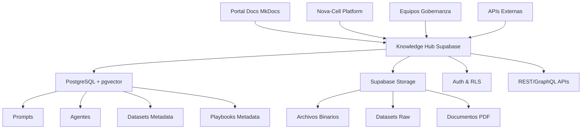
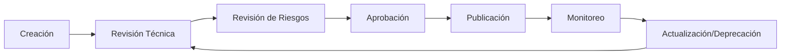

---
tags:
  - gobernanza
  - inteligencia-artificial
  - knowledge-hub
  - artefactos-ia
  - supabase
  - nova-cell
  - cumplimiento
search:
  boost: 2
---

# Knowledge Hub – Librería Centralizada de Artefactos de IA

<div class="nova-card-hero nova-scale-in">
  <h2 style="margin: 0; font-size: 1.8rem;">📚 Knowledge Hub IA</h2>
  <p style="margin: 0.5rem 0 0; opacity: 0.9;">Plataforma centralizada para la gestión, gobernanza y distribución de artefactos de Inteligencia Artificial</p>
</div>

<div class="nova-grid nova-grid--2" style="margin: 2rem 0;">
  <div class="nova-card-metric">
    <strong>📋 Versión:</strong> 1.0 <span class="nova-badge nova-badge--primary">Vigente</span>
  </div>
  <div class="nova-card-metric">
    <strong>📅 Fecha:</strong> 09 de enero de 2025
  </div>
  <div class="nova-card-metric">
    <strong>👤 Autor:</strong> Centro de Excelencia Nova IA
  </div>
  <div class="nova-card-metric">
    <strong>✅ Aprobado por:</strong> Comité de Gobernanza de IA
  </div>
  <div class="nova-card-metric">
    <strong>🔄 Próxima revisión:</strong> 09 de julio de 2025
  </div>
  <div class="nova-card-metric">
    <strong>🔒 Clasificación:</strong> <span class="nova-badge nova-badge--warning">INTERNO</span>
  </div>
</div>

## Introducción

En el marco de la [Política de Uso Responsable de Inteligencia Artificial](governance/politica-uso-responsable-ia.md), el Banco ha establecido un robusto ecosistema para el desarrollo y la operación de soluciones de IA. Un componente fundamental de este ecosistema es el **Knowledge Hub – Librería Centralizada de Artefactos de IA**.

Este documento detalla la arquitectura, implementación, gobernanza y operación del Knowledge Hub, diseñado para ser el repositorio único y autorizado de todos los artefactos de IA aprobados corporativamente. Su propósito es asegurar la reusabilidad, el cumplimiento normativo y la eficiencia en el ciclo de vida de la IA, proporcionando a los equipos técnicos, Product Owners y Risk Officers las herramientas necesarias para gestionar estos activos de manera segura y transparente.

La implementación del Knowledge Hub refuerza nuestro compromiso con la innovación responsable, permitiendo una rápida adopción de capacidades de IA mientras se mantienen los más altos estándares de seguridad, privacidad y ética.

## 1. Objetivo

El objetivo principal del Knowledge Hub es **centralizar, gobernar y auditar todos los artefactos de Inteligencia Artificial aprobados** por el Centro de Excelencia de IA y el Comité de Gobernanza. Esto incluye, pero no se limita a:

- **Prompts estandarizados y validados:** Frases o instrucciones específicas diseñadas para guiar el comportamiento de los Modelos de Lenguaje Grandes (LLMs) en casos de uso bancarios críticos.
- **Agentes de IA configurados:** Componentes de software autónomos o semi-autónomos que ejecutan tareas específicas dentro de la plataforma Nova-Cell, siguiendo lógicas predefinidas y aprobadas.
- **Datasets validados y curados:** Conjuntos de datos que han pasado por estrictos controles de calidad, anonimización/seudonimización, y aprobación de cumplimiento regulatorio para el entrenamiento y validación de modelos de IA.
- **Playbooks sectoriales y plantillas:** Guías operativas, mejores prácticas y formatos predefinidos para la implementación consistente y compliant de soluciones de IA en diversas áreas de negocio del Banco.
- **Modelos de IA pre-entrenados o ajustados (fine-tuned):** Binarios de modelos que han sido validados y aprobados para su uso en producción, con su correspondiente documentación y métricas de desempeño.

Mediante esta centralización, se busca:
- **Asegurar la consistencia y calidad:** Garantizando que solo artefactos validados y aprobados sean utilizados en la producción.
- **Facilitar la reusabilidad:** Reduciendo el esfuerzo de desarrollo y acelerando la implementación de nuevas soluciones de IA.
- **Fortalecer la gobernanza:** Proporcionando mecanismos de versionado, auditoría y control de acceso que cumplen con la Política de Uso Responsable de Inteligencia Artificial y regulaciones como ISO 42001 y CNBV.
- **Mejorar la trazabilidad:** Ofreciendo un historial completo de cada artefacto, incluyendo su origen, modificaciones y aprobaciones.
- **Minimizar riesgos:** Al prevenir el uso de artefactos no validados o que puedan introducir sesgos o vulnerabilidades.

## 2. Alcance

### 2.1 Aplica a:

El Knowledge Hub es de aplicación obligatoria para la gestión de los siguientes elementos dentro del ecosistema de IA del Banco:

- **Todos los artefactos de IA** desarrollados o utilizados en la plataforma corporativa Nova-Cell, incluyendo prompts, agentes, datasets, y playbooks.
- **Equipos de desarrollo de IA y Data Science** que crean, modifican o consumen artefactos de IA.
- **Product Owners** responsables de la definición y gestión de soluciones de IA.
- **Risk Officers y equipos de Cumplimiento** encargados de la validación y auditoría de artefactos de IA.
- **Sistemas y aplicaciones** que interactúen con Nova-Cell y requieran el consumo de artefactos de IA gobernados.
- **Procesos de aprobación y auditoría** definidos por el Centro de Excelencia de IA y el Comité de Gobernanza de IA.
- **Proveedores y terceros** que colaboren en el desarrollo o integración de soluciones de IA, debiendo adherirse a los estándares del Hub.

### 2.2 No aplica a:

- Artefactos de IA en fase de **exploración o prueba de concepto inicial** que no estén destinados a ser persistidos o compartidos corporativamente.
- Herramientas o scripts de **uso personal y no productivo** que no involucren datos sensibles o la toma de decisiones críticas.
- Sistemas de automatización o herramientas estadísticas **tradicionales** que no incorporen componentes de aprendizaje automático o inteligencia artificial.
- Documentación o código fuente **no relacionado directamente** con la definición o configuración de artefactos de IA gobernados.

## 3. Definiciones

Para una comprensión unificada de este documento, se establecen las siguientes definiciones clave:

- **Artefacto de IA:** Cualquier componente, configuración, dato o documento que es fundamental para el diseño, desarrollo, operación o gobernanza de un sistema de Inteligencia Artificial. En el contexto del Hub, incluye prompts, agentes, datasets validados, playbooks y modelos de IA.
- **Prompt:** Una instrucción o entrada específica, generalmente en lenguaje natural, proporcionada a un modelo generativo de IA (como un LLM) para guiar su respuesta o comportamiento. Los prompts en el Hub son validados y estandarizados para casos de uso bancarios.
- **Agente de IA:** Un componente de software que incorpora lógica de IA para realizar tareas específicas, interactuar con otros sistemas o usuarios, y tomar decisiones autónomas o semi-autónomas dentro de un dominio definido.
- **Dataset Validado:** Un conjunto de datos que ha sido sometido a un proceso riguroso de curación, limpieza, anonimización/seudonimización, análisis de sesgos y aprobación formal por el CoE IA y Risk Management, garantizando su idoneidad y cumplimiento para el entrenamiento y validación de modelos de IA.
- **Playbook Sectorial:** Una guía detallada o un conjunto de instrucciones estandarizadas que describe cómo implementar soluciones de IA para un caso de uso o sector bancario específico, incluyendo configuraciones, mejores prácticas y consideraciones de cumplimiento.
- **Nova-Cell:** La plataforma corporativa de desarrollo aumentado con IA del Banco, que integra herramientas para el ciclo de vida de la IA, desde la experimentación hasta la producción, y que interactúa directamente con el Knowledge Hub.
- **Supabase:** Una plataforma de código abierto que proporciona funcionalidades de base de datos (PostgreSQL), autenticación, almacenamiento de archivos, APIs y suscripciones en tiempo real, utilizada como la infraestructura principal del Knowledge Hub.
- **RBAC (Role-Based Access Control):** Un método de restringir el acceso al sistema a usuarios autorizados basado en los roles que tienen dentro de la organización.
- **Gobernanza de IA:** El conjunto de políticas, procesos, roles y responsabilidades que aseguran que los sistemas de IA se desarrollen y utilicen de manera ética, responsable, segura y conforme a la normativa.

## 4. Principios Rectores

El diseño y la operación del Knowledge Hub se rigen por los siguientes principios, alineados con la Política de Uso Responsable de Inteligencia Artificial del Banco:

1. **Gobernanza por Diseño:** Cada artefacto incorporado al Hub debe pasar por un proceso de revisión y aprobación que garantice su alineación con las políticas internas y la normativa externa (ISO 42001, CNBV, LFPDPPP).
2. **Transparencia y Trazabilidad:** Todos los artefactos deben tener un historial de versiones claro, metadatos descriptivos completos y un registro de auditoría que indique quién, cuándo y por qué se realizó cada cambio o aprobación.
3. **Seguridad y Privacidad de Datos:** La información contenida en los artefactos (especialmente en datasets) y el acceso al Hub deben estar protegidos con los más altos estándares de seguridad, incluyendo cifrado, control de acceso granular y residencia de datos en México.
4. **Reusabilidad y Estandarización:** Fomentar la creación y el uso de artefactos genéricos y bien documentados para maximizar la eficiencia y reducir la duplicación de esfuerzos en el desarrollo de soluciones de IA.
5. **Calidad y Confiabilidad:** Solo artefactos que hayan pasado por procesos de validación rigurosos y cumplan con los umbrales de calidad definidos serán aprobados e incluidos en el Hub.
6. **Facilidad de Acceso y Descubrimiento:** Proporcionar capacidades de búsqueda avanzadas (full-text y semántica) para que los usuarios puedan encontrar y utilizar rápidamente los artefactos relevantes.
7. **Escalabilidad y Robustez:** La arquitectura del Hub debe ser capaz de soportar un volumen creciente de artefactos y usuarios, manteniendo un alto rendimiento y disponibilidad.

## 5. Arquitectura Técnica Detallada

El Knowledge Hub se implementará utilizando **Supabase** como plataforma principal, aprovechando su suite integrada de servicios para una gestión eficiente y segura de los artefactos de IA. Esta elección minimiza la complejidad operativa al tiempo que proporciona la flexibilidad y escalabilidad necesarias para un entorno bancario.

### 5.1 Visión General de la Arquitectura



### 5.2 Componentes de Supabase

#### 5.2.1 PostgreSQL como Base de Datos Central

PostgreSQL será el motor de base de datos principal para almacenar todos los metadatos y la información estructurada de los artefactos. Su robustez, capacidad de extensión y cumplimiento con estándares lo hacen ideal para un entorno bancario.

**Extensiones Clave:**
- `uuid-ossp`: Para generar IDs únicos universales para cada artefacto
- `pg_trgm`: Para mejorar la búsqueda full-text con coincidencias aproximadas
- `pgvector`: Para búsqueda semántica mediante embeddings vectoriales

#### 5.2.2 Supabase Storage para Archivos Binarios

Supabase Storage proporcionará un servicio de almacenamiento de objetos escalable y seguro para archivos no estructurados o de gran tamaño:

- **Playbooks:** Archivos PDF, Markdown o DOCX
- **Contenido SCORM:** Módulos de capacitación interactivos
- **Plantillas:** Documentos, configuraciones o código de plantilla
- **Grandes Datasets:** Archivos de datos brutos o preprocesados
- **Modelos de IA:** Binarios de modelos entrenados

#### 5.2.3 Control de Acceso y Autenticación

**Autenticación:**
- Integración con SSO corporativo vía OpenID Connect/SAML
- Gestión de sesiones mediante JWT (JSON Web Tokens)

**Row Level Security (RLS):**
- Políticas granulares en tablas PostgreSQL
- Control de acceso basado en roles y departamentos
- Aislamiento automático por nivel de autorización

## 6. Modelo de Datos Detallado

### 6.1 Tabla `prompts`

```sql
CREATE TABLE prompts (
    id UUID PRIMARY KEY DEFAULT gen_random_uuid(),
    titulo VARCHAR(255) NOT NULL,
    texto TEXT NOT NULL,
    version VARCHAR(50) NOT NULL,
    descripcion TEXT,
    tags TEXT[],
    modelo_compatible VARCHAR(100),
    caso_uso_bancario TEXT,
    ejemplo_uso TEXT,
    embedding VECTOR(1536),
    estado ENUM('DRAFT', 'PENDING_REVIEW', 'APPROVED', 'REJECTED', 'DEPRECATED') DEFAULT 'DRAFT',
    riesgo_clasificacion ENUM('ALTO', 'MEDIO', 'BAJO') DEFAULT 'BAJO',
    owner_id UUID NOT NULL,
    departamento_id UUID,
    created_at TIMESTAMP WITH TIME ZONE DEFAULT NOW(),
    created_by UUID NOT NULL,
    updated_at TIMESTAMP WITH TIME ZONE DEFAULT NOW(),
    updated_by UUID NOT NULL,
    approved_at TIMESTAMP WITH TIME ZONE,
    approved_by UUID,
    review_date TIMESTAMP WITH TIME ZONE,
    next_review_date TIMESTAMP WITH TIME ZONE,
    compliance_status JSONB,
    metadata JSONB
);
```

### 6.2 Tabla `agentes`

```sql
CREATE TABLE agentes (
    id UUID PRIMARY KEY DEFAULT gen_random_uuid(),
    nombre VARCHAR(255) NOT NULL,
    rol VARCHAR(255),
    descripcion TEXT NOT NULL,
    version VARCHAR(50) NOT NULL,
    configuracion JSONB NOT NULL,
    dependencias TEXT[],
    embedding VECTOR(1536),
    estado ENUM('DRAFT', 'PENDING_REVIEW', 'APPROVED', 'REJECTED', 'DEPRECATED') DEFAULT 'DRAFT',
    riesgo_clasificacion ENUM('ALTO', 'MEDIO', 'BAJO') DEFAULT 'MEDIO',
    owner_id UUID NOT NULL,
    departamento_id UUID,
    created_at TIMESTAMP WITH TIME ZONE DEFAULT NOW(),
    created_by UUID NOT NULL,
    updated_at TIMESTAMP WITH TIME ZONE DEFAULT NOW(),
    updated_by UUID NOT NULL,
    approved_at TIMESTAMP WITH TIME ZONE,
    approved_by UUID,
    review_date TIMESTAMP WITH TIME ZONE,
    next_review_date TIMESTAMP WITH TIME ZONE,
    compliance_status JSONB,
    metadata JSONB
);
```

### 6.3 Tabla `datasets`

```sql
CREATE TABLE datasets (
    id UUID PRIMARY KEY DEFAULT gen_random_uuid(),
    nombre VARCHAR(255) NOT NULL,
    descripcion TEXT NOT NULL,
    origen VARCHAR(255),
    version VARCHAR(50) NOT NULL,
    esquema JSONB,
    tamano_bytes BIGINT,
    formato_archivo VARCHAR(50),
    url_storage TEXT,
    anonimizacion_metodo TEXT,
    compliance_status JSONB,
    analisis_sesgo_resumen TEXT,
    estado ENUM('DRAFT', 'PENDING_REVIEW', 'APPROVED', 'REJECTED', 'DEPRECATED') DEFAULT 'DRAFT',
    riesgo_clasificacion ENUM('ALTO', 'MEDIO', 'BAJO') DEFAULT 'ALTO',
    owner_id UUID NOT NULL,
    departamento_id UUID,
    created_at TIMESTAMP WITH TIME ZONE DEFAULT NOW(),
    created_by UUID NOT NULL,
    updated_at TIMESTAMP WITH TIME ZONE DEFAULT NOW(),
    updated_by UUID NOT NULL,
    approved_at TIMESTAMP WITH TIME ZONE,
    approved_by UUID,
    review_date TIMESTAMP WITH TIME ZONE,
    next_review_date TIMESTAMP WITH TIME ZONE,
    metadata JSONB
);
```

### 6.4 Tabla `playbooks`

```sql
CREATE TABLE playbooks (
    id UUID PRIMARY KEY DEFAULT gen_random_uuid(),
    titulo VARCHAR(255) NOT NULL,
    categoria VARCHAR(100),
    descripcion TEXT,
    version VARCHAR(50) NOT NULL,
    url_storage TEXT NOT NULL,
    tipo_documento VARCHAR(50),
    estado ENUM('DRAFT', 'PENDING_REVIEW', 'APPROVED', 'REJECTED', 'DEPRECATED') DEFAULT 'DRAFT',
    owner_id UUID NOT NULL,
    departamento_id UUID,
    created_at TIMESTAMP WITH TIME ZONE DEFAULT NOW(),
    created_by UUID NOT NULL,
    updated_at TIMESTAMP WITH TIME ZONE DEFAULT NOW(),
    updated_by UUID NOT NULL,
    approved_at TIMESTAMP WITH TIME ZONE,
    approved_by UUID,
    review_date TIMESTAMP WITH TIME ZONE,
    next_review_date TIMESTAMP WITH TIME ZONE,
    metadata JSONB
);
```

## 7. Flujos de Trabajo y Procesos de Gobernanza

### 7.1 Ciclo de Vida del Artefacto



### 7.2 Proceso de Aprobación

| Rol | Responsabilidad | Nivel de Aprobación |
|-----|----------------|-------------------|
| **Data Scientist** | Creación y documentación inicial | Revisión técnica |
| **Product Owner** | Validación de caso de uso | Aprobación funcional |
| **Risk Officer** | Evaluación de riesgos y compliance | Aprobación de riesgos |
| **CoE IA** | Validación final y publicación | Aprobación ejecutiva |

### 7.3 Matriz de Control de Acceso (RBAC)

| Rol | Prompts | Agentes | Datasets | Playbooks |
|-----|---------|---------|----------|-----------|
| **Data Scientist** | Crear, Editar (propios), Leer (aprobados) | Crear, Editar (propios), Leer (aprobados) | Leer (aprobados) | Leer (aprobados) |
| **Product Owner** | Leer (todos), Aprobar (su área) | Leer (todos), Aprobar (su área) | Leer (metadatos) | Crear, Editar, Leer |
| **Risk Officer** | Leer (todos), Aprobar/Rechazar | Leer (todos), Aprobar/Rechazar | Leer (todos), Aprobar/Rechazar | Leer (todos) |
| **CoE Admin** | CRUD completo, Publicar | CRUD completo, Publicar | CRUD completo, Publicar | CRUD completo, Publicar |

## 8. Especificaciones de API

### 8.1 Endpoints Principales

#### Búsqueda de Artefactos
```http
GET /api/v1/search?q={query}&type={prompt|agente|dataset|playbook}&status=approved
```

#### Crear Prompt
```http
POST /api/v1/prompts
Content-Type: application/json

{
  "titulo": "Asistente de Crédito Personal",
  "texto": "Eres un especialista en productos crediticios...",
  "tags": ["credito", "atencion-cliente"],
  "modelo_compatible": "GPT-4",
  "caso_uso_bancario": "Respuesta a consultas sobre créditos personales"
}
```

#### Obtener Prompt por ID
```http
GET /api/v1/prompts/{id}
```

#### Búsqueda Semántica
```http
POST /api/v1/search/semantic
Content-Type: application/json

{
  "query": "asistente para detectar fraude en transacciones",
  "limit": 10,
  "threshold": 0.8
}
```

### 8.2 Autenticación y Autorización

Todas las APIs requieren autenticación mediante JWT Bearer token:

```http
Authorization: Bearer <jwt_token>
```

Las políticas RLS de PostgreSQL se aplicarán automáticamente basadas en el rol del usuario contenido en el JWT.

## 9. Seguridad y Cumplimiento

### 9.1 Medidas de Seguridad Implementadas

- **Cifrado en tránsito:** TLS 1.3 para todas las comunicaciones
- **Cifrado en reposo:** AES-256 para datos almacenados
- **Control de acceso:** RLS + RBAC granular
- **Auditoría:** Logs completos de todas las operaciones
- **Residencia de datos:** Infraestructura en México (AWS Querétaro)

### 9.2 Cumplimiento Regulatorio

- **LFPDPPP:** Anonimización y protección de datos personales
- **CNBV:** Trazabilidad y documentación de decisiones automatizadas
- **ISO 42001:** Sistema de gestión de IA
- **ISO 27001:** Seguridad de la información

## 10. Integración con Nova-Cell

### 10.1 Consumo de Artefactos

Nova-Cell consumirá artefactos del Knowledge Hub mediante:

- **API REST:** Para obtener prompts y configuraciones de agentes
- **Caché local:** Para mejorar performance y disponibilidad
- **Validación en tiempo real:** Verificación de versiones y estado de aprobación

### 10.2 Publicación de Artefactos

```javascript
// Ejemplo de integración desde Nova-Cell
const knowledgeHub = new KnowledgeHubClient({
  apiUrl: 'https://knowledge-hub.banco.mx/api/v1',
  authToken: userJWT
});

// Obtener prompt aprobado
const prompt = await knowledgeHub.getPrompt('assistant-credit-v2');

// Publicar nuevo prompt para revisión
const newPrompt = await knowledgeHub.createPrompt({
  titulo: 'Detector de Fraude v3',
  texto: '...',
  estado: 'PENDING_REVIEW'
});
```

## 11. Implementación y Métricas de Éxito

### 11.1 Roadmap de Implementación

#### Fase 1: Fundación (Semanas 1-4)
- [ ] Setup de infraestructura Supabase
- [ ] Implementación del modelo de datos base
- [ ] Configuración de autenticación SSO
- [ ] APIs básicas CRUD

#### Fase 2: Gobernanza (Semanas 5-8)
- [ ] Implementación de workflows de aprobación
- [ ] Sistema de versionado
- [ ] Configuración RLS y RBAC
- [ ] Dashboard de administración

#### Fase 3: Búsqueda Avanzada (Semanas 9-12)
- [ ] Integración pgvector
- [ ] Generación de embeddings
- [ ] Búsqueda semántica
- [ ] Optimización de performance

#### Fase 4: Integración (Semanas 13-16)
- [ ] APIs de integración con Nova-Cell
- [ ] Enlaces desde Portal de Documentación
- [ ] Migración de artefactos existentes
- [ ] Capacitación de usuarios

### 11.2 Métricas de Éxito (Framework IMPACT)

#### Implementation
- **Adopción:** >80% equipos usando el Hub en 6 meses
- **Cobertura:** 100% artefactos críticos migrados
- **Time to First Value:** <15 minutos para nuevos usuarios

#### Momentum
- **Crecimiento:** +25% artefactos nuevos mensualmente
- **Engagement:** >70% usuarios activos semanalmente
- **Contribuciones:** Promedio 3 artefactos nuevos por equipo/mes

#### Performance
- **Búsqueda:** <200ms para 95% consultas
- **Disponibilidad:** 99.9% uptime
- **Escalabilidad:** Soporte para 10,000+ artefactos

#### Acceptance
- **Satisfacción:** NPS >50 entre usuarios
- **Calidad:** <5% artefactos rechazados en revisión
- **Reusabilidad:** >60% artefactos reutilizados

#### Cost-Effective
- **ROI:** Break-even en mes 8
- **Eficiencia:** -40% tiempo desarrollo de soluciones IA
- **Costos operativos:** <$50K USD anuales

#### Trust
- **Compliance:** 100% auditorías pasadas
- **Seguridad:** Cero incidentes de seguridad
- **Confianza:** >85% usuarios confían en artefactos del Hub

## 12. Procedimientos Operacionales

### 12.1 Monitoreo y Alertas

#### Métricas Técnicas
- **Performance de base de datos:** Latencia, throughput, conexiones
- **Almacenamiento:** Uso de espacio, crecimiento, backup status
- **APIs:** Response times, error rates, rate limiting

#### Métricas de Negocio
- **Uso de artefactos:** Descargas, búsquedas, ratings
- **Ciclo de aprobación:** Tiempo promedio, backlog, rechazos
- **Adopción:** Usuarios activos, departamentos participantes

### 12.2 Respaldo y Recuperación

- **Backup automático:** Diario incremental, semanal completo
- **Retención:** 30 días incrementales, 12 meses completos
- **RTO:** 4 horas para restauración completa
- **RPO:** 24 horas máximo de pérdida de datos

### 12.3 Actualizaciones y Mantenimiento

- **Ventana de mantenimiento:** Sábados 2:00-6:00 AM
- **Actualizaciones de seguridad:** Aplicación inmediata para críticas
- **Upgrades de plataforma:** Trimestrales con pruebas previas
- **Migración de datos:** Procedimientos documentados y probados

## 13. Referencias y Anexos

### 13.1 Políticas Relacionadas
- [Política de Uso Responsable de Inteligencia Artificial](governance/politica-uso-responsable-ia.md)
- [Procedimiento de Validación de Modelos](governance/procedimiento-validacion-modelos.md)
- [Operating Model del CoE](operating-model-coe.md)

### 13.2 Documentación Técnica
- [Guía de Integración con Nova-Cell](#)
- [Manual de Usuario del Knowledge Hub](#)
- [Documentación de APIs](#)

### 13.3 Normativa Aplicable
- ISO/IEC 42001:2023 - Sistema de Gestión de IA
- ISO/IEC 27001:2022 - Seguridad de la Información
- CNBV - Disposiciones de carácter general aplicables a instituciones de crédito
- LFPDPPP - Ley Federal de Protección de Datos Personales

## 14. Control de Cambios

| Versión | Fecha | Autor | Descripción del Cambio |
|---------|-------|-------|----------------------|
| 1.0 | 09/01/2025 | CoE IA | Versión inicial del Knowledge Hub Guide |

---

*Esta guía técnica forma parte integral del ecosistema de gobernanza de IA del Banco y será revisada semestralmente o ante cambios regulatorios significativos. Para consultas técnicas o propuestas de mejora, contactar al Centro de Excelencia de IA a través del canal #ai-governance en Teams corporativo.*

**Documento controlado - Prohibida su reproducción sin autorización del CoE IA**
