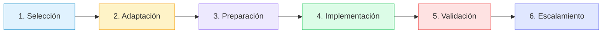

# 📚 Playbooks Especializados de IA

## 🎯 Guías Prácticas para Implementación Exitosa de IA en Banca

Los **Playbooks del Centro de Excelencia** son guías detalladas y probadas en campo que aceleran la implementación de soluciones de IA en diferentes áreas del banco, garantizando mejores prácticas y cumplimiento regulatorio.

## 🌟 ¿Qué es un Playbook?

  <h3 style="margin-top: 0; color: white;">Metodología Probada + Experiencia Real = Éxito Garantizado</h3>
  
Cada playbook combina años de experiencia en implementaciones bancarias exitosas con las mejores prácticas globales, adaptadas al contexto regulatorio mexicano.

## 📊 Valor de los Playbooks

  

    <h3 style="color: #2563eb; margin: 10px 0;">70%</h3>
    
Reducción en tiempo de implementación

  

  

    <h3 style="color: #16a34a; margin: 10px 0;">95%</h3>
    
Tasa de éxito en proyectos

  

  

    <h3 style="color: #ca8a04; margin: 10px 0;">100%</h3>
    
Compliance regulatorio

  

  

    <h3 style="color: #9333ea; margin: 10px 0;">2.5x</h3>
    
ROI promedio

  

## 🏦 Playbooks por Área de Negocio

### 💳 Banca Digital y Canales

  
  #### [🌐 Playbook de Banca Digital con IA](./playbook-banca-digital-ia.md)
  
  **Transforma la experiencia digital de tus clientes con IA**
  
  

    

      
<strong>Casos de Uso Incluidos:</strong>

      <ul>
        <li>✅ Chatbots inteligentes multicanal</li>
        <li>✅ Asistentes virtuales 24/7</li>
        <li>✅ Personalización de ofertas</li>
        <li>✅ Onboarding digital automatizado</li>
        <li>✅ Recomendaciones predictivas</li>
      </ul>
      
<strong>Resultados Esperados:</strong>

      <ul>
        <li>📈 +40% satisfacción del cliente</li>
        <li>⏱️ -60% tiempo de respuesta</li>
        <li>💰 -35% costo de servicio</li>
      </ul>
    

    

      
<strong>📊 Métricas Clave:</strong>

      <ul style="list-style: none; padding: 0;">
        <li>• NPS Score</li>
        <li>• First Contact Resolution</li>
        <li>• Digital Adoption Rate</li>
        <li>• Cost per Interaction</li>
      </ul>
      
<strong>⏱️ Tiempo de Implementación:</strong>

      
8-12 semanas

      
<strong>💼 Perfil Requerido:</strong>

      
Product Owner + 3 Developers + 1 UX Designer

    

  

  
  <a href="./playbook-banca-digital-ia.md" style="display: inline-block; background: #2563eb; color: white; padding: 12px 30px; border-radius: 5px; text-decoration: none; margin-top: 15px;">→ Explorar Playbook de Banca Digital</a>

### 🛡️ Risk Management y Compliance

  
  #### [⚖️ Playbook de Risk Management con IA](../../../playbooks/playbook-risk-management-ia.md)
  
  **Gestión inteligente de riesgos con modelos de última generación**
  
  

    

      
<strong>Casos de Uso Incluidos:</strong>

      <ul>
        <li>✅ Credit scoring con ML</li>
        <li>✅ Detección de fraude en tiempo real</li>
        <li>✅ Anti-money laundering (AML)</li>
        <li>✅ Stress testing automatizado</li>
        <li>✅ Early warning systems</li>
      </ul>
      
<strong>Resultados Esperados:</strong>

      <ul>
        <li>📉 -45% pérdidas por fraude</li>
        <li>⚡ 95% detección en tiempo real</li>
        <li>✅ 100% compliance CNBV</li>
      </ul>
    

    

      
<strong>🎯 KPIs Críticos:</strong>

      <ul style="list-style: none; padding: 0;">
        <li>• False Positive Rate</li>
        <li>• Model Accuracy</li>
        <li>• Detection Latency</li>
        <li>• Regulatory Compliance Score</li>
      </ul>
      
<strong>⏱️ Tiempo de Implementación:</strong>

      
12-16 semanas

      
<strong>💼 Perfil Requerido:</strong>

      
Risk Manager + 2 Data Scientists + 2 Engineers

    

  

  
  <a href="../../../playbooks/playbook-risk-management-ia.md" style="display: inline-block; background: #dc2626; color: white; padding: 12px 30px; border-radius: 5px; text-decoration: none; margin-top: 15px;">→ Explorar Playbook de Risk Management</a>

### 🤝 Customer Service y Contact Center

  
  #### [📞 Playbook de Customer Service con IA](../../../playbooks/playbook-customer-service-ia.md)
  
  **Revoluciona tu contact center con agentes virtuales inteligentes**
  
  

    

      
<strong>Casos de Uso Incluidos:</strong>

      <ul>
        <li>✅ IVR inteligente con NLP</li>
        <li>✅ Routing inteligente de llamadas</li>
        <li>✅ Sentiment analysis en tiempo real</li>
        <li>✅ Agent assist con IA</li>
        <li>✅ Quality monitoring automatizado</li>
      </ul>
      
<strong>Resultados Esperados:</strong>

      <ul>
        <li>😊 +50% CSAT score</li>
        <li>📞 -40% tiempo promedio de llamada</li>
        <li>💪 +30% productividad de agentes</li>
      </ul>
    

    

      
<strong>📈 Métricas de Éxito:</strong>

      <ul style="list-style: none; padding: 0;">
        <li>• Average Handle Time</li>
        <li>• First Call Resolution</li>
        <li>• Customer Effort Score</li>
        <li>• Agent Satisfaction</li>
      </ul>
      
<strong>⏱️ Tiempo de Implementación:</strong>

      
6-10 semanas

      
<strong>💼 Perfil Requerido:</strong>

      
CX Manager + 2 Developers + 1 Analyst

    

  

  
  <a href="../../../playbooks/playbook-customer-service-ia.md" style="display: inline-block; background: #16a34a; color: white; padding: 12px 30px; border-radius: 5px; text-decoration: none; margin-top: 15px;">→ Explorar Playbook de Customer Service</a>

## 🎯 Playbooks por Caso de Uso

### 🔍 Detección y Prevención

  
  

    <h4>🚨 Detección de Fraude</h4>
    
Sistema end-to-end para prevención de fraude en transacciones

    <ul>
      <li>Modelos de deep learning</li>
      <li>Real-time scoring</li>
      <li>Integración con sistemas core</li>
    </ul>
    
<strong>ROI:</strong> 10x en 6 meses

    <a href="./playbook-fraud-detection.md" style="color: #2563eb;">Ver Playbook →</a>
  

  
  

    <h4>💸 Anti-Money Laundering</h4>
    
Cumplimiento automatizado de regulaciones AML/KYC

    <ul>
      <li>Pattern recognition</li>
      <li>Network analysis</li>
      <li>Reportes regulatorios</li>
    </ul>
    
<strong>Compliance:</strong> 100% CNBV

    <a href="./playbook-aml.md" style="color: #2563eb;">Ver Playbook →</a>
  

  

### 📊 Analytics y Decisiones

  
  

    <h4>📈 Credit Scoring Avanzado</h4>
    
Modelos de ML para evaluación crediticia precisa

    <ul>
      <li>Alternative data sources</li>
      <li>Explainable AI</li>
      <li>Bias mitigation</li>
    </ul>
    
<strong>Accuracy:</strong> 95%+

    <a href="./playbook-credit-scoring.md" style="color: #2563eb;">Ver Playbook →</a>
  

  
  

    <h4>🎯 Next Best Action</h4>
    
Recomendaciones personalizadas en tiempo real

    <ul>
      <li>Customer 360°</li>
      <li>Propensity models</li>
      <li>A/B testing framework</li>
    </ul>
    
<strong>Conversion:</strong> +25%

    <a href="./playbook-nba.md" style="color: #2563eb;">Ver Playbook →</a>
  

  

### 🤖 Automatización y Eficiencia

  
  

    <h4>📄 Document Processing</h4>
    
Extracción inteligente de información de documentos

    <ul>
      <li>OCR + NLP avanzado</li>
      <li>Validación automática</li>
      <li>Integration con BPM</li>
    </ul>
    
<strong>Eficiencia:</strong> 80% automatización

    <a href="./playbook-document-processing.md" style="color: #2563eb;">Ver Playbook →</a>
  

  
  

    <h4>🔄 Process Mining</h4>
    
Optimización de procesos con IA

    <ul>
      <li>Descubrimiento de procesos</li>
      <li>Bottleneck analysis</li>
      <li>RPA integration</li>
    </ul>
    
<strong>Savings:</strong> 30% FTEs

    <a href="./playbook-process-mining.md" style="color: #2563eb;">Ver Playbook →</a>
  

  

## 📋 Estructura de Cada Playbook

Todos nuestros playbooks siguen una estructura consistente y probada:

  
  ### 📖 Contenido Estándar
  
  1. **🎯 Executive Summary**
     - Caso de negocio
     - ROI esperado
     - Timeline
  
  2. **🏗️ Arquitectura de Solución**
     - Componentes técnicos
     - Integraciones requeridas
     - Flujos de datos
  
  3. **📊 Modelos y Algoritmos**
     - Selección de modelos
     - Training pipeline
     - Métricas de evaluación
  
  4. **🚀 Plan de Implementación**
     - Fases del proyecto
     - Entregables por fase
     - Criterios de éxito
  
  5. **⚖️ Compliance y Governance**
     - Requisitos regulatorios
     - Controles de riesgo
     - Auditoría y monitoreo
  
  6. **📈 Métricas y KPIs**
     - Métricas de negocio
     - Métricas técnicas
     - Dashboard templates
  
  7. **💡 Lecciones Aprendidas**
     - Best practices
     - Errores comunes
     - Tips de optimización
  
  8. **📚 Recursos y Templates**
     - Código reutilizable
     - Configuraciones
     - Documentación tipo

## 🏆 Casos de Éxito

### Implementaciones Destacadas

  
  

    <h4 style="color: white;">Banco Azteca</h4>
    
<strong>Playbook:</strong> Credit Scoring

    
<strong>Resultado:</strong> -30% morosidad

    
<strong>Tiempo:</strong> 10 semanas

  

  
  

    <h4 style="color: white;">BBVA México</h4>
    
<strong>Playbook:</strong> Fraud Detection

    
<strong>Resultado:</strong> -$5M USD pérdidas/año

    
<strong>Tiempo:</strong> 12 semanas

  

  
  

    <h4 style="color: white;">Santander</h4>
    
<strong>Playbook:</strong> Customer Service

    
<strong>Resultado:</strong> +45 NPS points

    
<strong>Tiempo:</strong> 8 semanas

  

  

## 🛠️ Cómo Usar los Playbooks

### Proceso de Implementación

### Pasos Detallados

1. **📋 Evaluación Inicial**
   - Identificar caso de uso
   - Validar pre-requisitos
   - Estimar ROI

2. **🎨 Customización**
   - Adaptar a contexto específico
   - Configurar parámetros
   - Definir SLAs

3. **👥 Formación del Equipo**
   - Asignar roles
   - Capacitar en playbook
   - Establecer governance

4. **🚀 Ejecución**
   - Seguir plan por fases
   - Monitorear progreso
   - Ajustar según feedback

5. **✅ Certificación**
   - Validar cumplimiento
   - Medir resultados
   - Documentar lecciones

## 📥 Descarga de Playbooks

  
  ### 📦 Paquetes Disponibles
  
  <table style="width: 100%;">
    <tr style="background: #e0f2fe;">
      <th>Paquete</th>
      <th>Playbooks Incluidos</th>
      <th>Formato</th>
      <th>Descarga</th>
    </tr>
    <tr>
      <td><strong>Starter Pack</strong></td>
      <td>3 playbooks básicos</td>
      <td>PDF + Templates</td>
      <td><a href="./download/starter">⬇️ Descargar</a></td>
    </tr>
    <tr>
      <td><strong>Professional</strong></td>
      <td>10 playbooks completos</td>
      <td>PDF + Code + Videos</td>
      <td><a href="./download/professional">⬇️ Descargar</a></td>
    </tr>
    <tr>
      <td><strong>Enterprise</strong></td>
      <td>Todos (25+) playbooks</td>
      <td>Full access + Soporte</td>
      <td><a href="./download/enterprise">⬇️ Solicitar</a></td>
    </tr>
  </table>

## 🤝 Contribuir a los Playbooks

### ¿Tienes un caso de éxito?

Comparte tu experiencia y ayuda a la comunidad:

1. **📝 Documenta tu implementación**
2. **📊 Comparte métricas y resultados**
3. **💡 Aporta lecciones aprendidas**
4. **🏆 Obtén reconocimiento**

  <a href="mailto:playbooks@nova-cell.mx" style="background: #8b5cf6; color: white; padding: 12px 30px; border-radius: 5px; text-decoration: none; font-weight: bold;">
    📮 Enviar tu Playbook
  </a>

## 📚 Recursos Relacionados

- 🎓 [Academia de IA](../../academia/index.md) - Formación en casos de uso
- 🛠️ [Nova-Cell Platform](../../../../servicios/plataforma/nova-cell-hub.md) - Herramientas de implementación
- 📖 [Knowledge Base](../knowledge-hub-guide.md) - Documentación técnica
- 💬 [Comunidad](https://community.nova-cell.mx) - Soporte y networking

## 📞 Soporte para Playbooks

**¿Necesitas ayuda con un playbook?**

- 📧 Email: playbooks-support@nova-cell.mx
- 💬 Slack: #playbooks-help
- 📞 Hotline: +52 55 1234 5678 ext. 3000
- 🗓️ Office Hours: Martes y Jueves, 16:00-17:00 CST

---

  <h2 style="color: white; margin-top: 0;">🚀 Acelera tu Implementación de IA</h2>
  

    Con nuestros playbooks probados, reduce riesgos y maximiza el éxito
  

  

    <a href="./quick-start-guide" style="background: white; color: #667eea; padding: 12px 30px; border-radius: 5px; text-decoration: none; font-weight: bold;">
      ⚡ Quick Start Guide
    </a>
    <a href="./playbook-selector" style="background: white; color: #764ba2; padding: 12px 30px; border-radius: 5px; text-decoration: none; font-weight: bold;">
      🎯 Selector de Playbooks
    </a>
    <a href="./success-stories" style="background: transparent; color: white; padding: 12px 30px; border: 2px solid white; border-radius: 5px; text-decoration: none; font-weight: bold;">
      🏆 Casos de Éxito
    </a>
  

---

*Playbooks Nova-Cell | Centro de Excelencia de IA | Implementación Exitosa Garantizada*