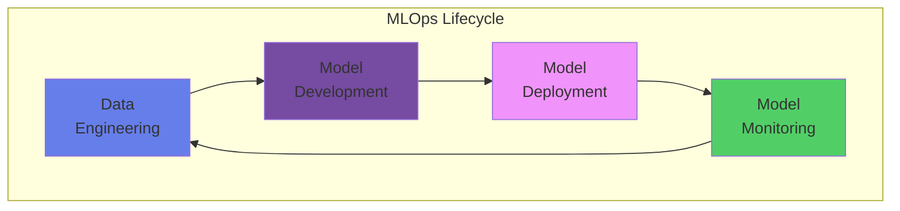
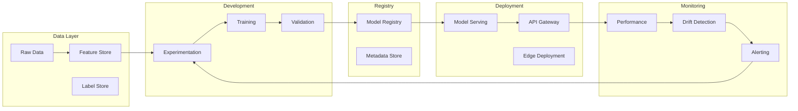

# 🚀 Guía Completa de MLOps

## Operacionalización de Machine Learning a Escala Empresarial

### 📋 ¿Qué es MLOps?

MLOps (Machine Learning Operations) es un conjunto de prácticas que combina Machine Learning, DevOps y Data Engineering para implementar y mantener sistemas de ML en producción de manera confiable y eficiente.



## 🎯 Principios Fundamentales

### 1. Reproducibilidad
```yaml
reproducibility:
  code_versioning:
    tool: Git
    strategy: GitFlow
    
  data_versioning:
    tool: DVC / Delta Lake
    strategy: Immutable snapshots
    
  environment_versioning:
    tool: Docker / Conda
    strategy: Container images
    
  experiment_tracking:
    tool: MLflow / Weights & Biases
    strategy: Comprehensive logging
```

### 2. Automatización
```python
automation_levels = {
    "ML0": "Manual process",
    "ML1": "ML pipeline automation",
    "ML2": "CI/CD pipeline automation",
    "ML3": "Full MLOps automation"
}
```

### 3. Monitoreo Continuo
- Model performance drift
- Data drift detection
- System health metrics
- Business KPI tracking

### 4. Colaboración
- Cross-functional teams
- Shared repositories
- Standardized workflows
- Knowledge sharing

## 🏗️ Arquitectura MLOps de Referencia

### Componentes Core



### Stack Tecnológico Recomendado

| Capa | Herramientas Open Source | Herramientas Enterprise |
|------|--------------------------|------------------------|
| **Orquestación** | Airflow, Kubeflow, Prefect | Azure ML, AWS SageMaker |
| **Feature Store** | Feast, Hopsworks | Databricks Feature Store |
| **Experimentación** | MLflow, DVC | Weights & Biases, Neptune |
| **Model Registry** | MLflow, BentoML | Azure ML Registry, Vertex AI |
| **Serving** | TorchServe, TF Serving | SageMaker Endpoints, AzureML |
| **Monitoring** | Evidently, Alibi Detect | DataRobot, Fiddler |
| **Infrastructure** | Kubernetes, Docker | EKS, AKS, GKE |

## 📊 Pipeline MLOps End-to-End

### 1. Data Pipeline

```python
class DataPipeline:
    def __init__(self):
        self.raw_data_path = "s3://data-lake/raw/"
        self.processed_path = "s3://data-lake/processed/"
        self.feature_store = FeatureStore()
        
    def run_pipeline(self, date):
        # 1. Ingestion
        raw_data = self.ingest_data(date)
        
        # 2. Validation
        validated_data = self.validate_data(raw_data)
        
        # 3. Transformation
        transformed_data = self.transform_data(validated_data)
        
        # 4. Feature Engineering
        features = self.engineer_features(transformed_data)
        
        # 5. Store in Feature Store
        self.feature_store.write(
            features=features,
            entity="customer",
            timestamp=date
        )
        
        # 6. Data Quality Metrics
        metrics = self.calculate_quality_metrics(features)
        self.log_metrics(metrics)
        
        return features
    
    def validate_data(self, data):
        """Great Expectations validation"""
        validator = DataValidator()
        
        expectations = {
            "completeness": lambda df: df.isnull().sum() / len(df) < 0.05,
            "uniqueness": lambda df: df['id'].is_unique,
            "range_checks": lambda df: (df['age'] >= 18) & (df['age'] <= 120),
            "format_checks": lambda df: df['email'].str.match(r'^[\w\.-]+@[\w\.-]+\.\w+$')
        }
        
        for check_name, check_func in expectations.items():
            if not check_func(data):
                raise DataQualityException(f"Failed {check_name}")
        
        return data
```

### 2. Training Pipeline

```python
class TrainingPipeline:
    def __init__(self):
        self.mlflow_uri = "http://mlflow.novasolutionsystems.com"
        self.model_registry = ModelRegistry()
        mlflow.set_tracking_uri(self.mlflow_uri)
        
    def train_model(self, config):
        with mlflow.start_run() as run:
            # 1. Load training data
            X_train, y_train = self.load_training_data(config['data_version'])
            
            # 2. Log parameters
            mlflow.log_params(config['hyperparameters'])
            
            # 3. Train model
            model = self.train(
                X_train, y_train,
                **config['hyperparameters']
            )
            
            # 4. Validate model
            metrics = self.validate(model, X_val, y_val)
            mlflow.log_metrics(metrics)
            
            # 5. Log model
            mlflow.sklearn.log_model(
                sk_model=model,
                artifact_path="model",
                registered_model_name=config['model_name']
            )
            
            # 6. Promote if meets criteria
            if metrics['auc'] > config['threshold']:
                self.model_registry.transition_stage(
                    name=config['model_name'],
                    version=run.info.run_id,
                    stage="Staging"
                )
            
            return model, metrics
```

### 3. Deployment Pipeline

```python
class DeploymentPipeline:
    def __init__(self):
        self.k8s_client = KubernetesClient()
        self.monitoring = MonitoringService()
        
    def deploy_model(self, model_uri, deployment_config):
        # 1. Build container
        container = self.build_container(model_uri)
        
        # 2. Run smoke tests
        if not self.smoke_test(container):
            raise DeploymentException("Smoke tests failed")
        
        # 3. Deploy with strategy
        if deployment_config['strategy'] == 'canary':
            self.canary_deployment(container, deployment_config)
        elif deployment_config['strategy'] == 'blue_green':
            self.blue_green_deployment(container, deployment_config)
        else:
            self.rolling_deployment(container, deployment_config)
        
        # 4. Setup monitoring
        self.monitoring.configure(
            model_name=deployment_config['model_name'],
            metrics=['latency', 'throughput', 'error_rate'],
            alerts=deployment_config['alerts']
        )
        
        return deployment_config['endpoint']
    
    def canary_deployment(self, container, config):
        """Progressive rollout with traffic splitting"""
        stages = [
            {"traffic": 5, "duration": "1h", "metrics": ["error_rate < 0.01"]},
            {"traffic": 25, "duration": "2h", "metrics": ["latency_p99 < 100ms"]},
            {"traffic": 50, "duration": "4h", "metrics": ["accuracy > 0.95"]},
            {"traffic": 100, "duration": "permanent", "metrics": []}
        ]
        
        for stage in stages:
            self.k8s_client.update_traffic_split(
                service=config['service_name'],
                canary_weight=stage['traffic']
            )
            
            if stage['metrics']:
                self.wait_and_validate(stage['duration'], stage['metrics'])
```

## 🔍 Monitoring & Observability

### Métricas Clave

```python
class MLOpsMetrics:
    def __init__(self):
        self.prometheus = PrometheusClient()
        self.grafana = GrafanaClient()
        
    def setup_dashboards(self):
        dashboards = {
            "model_performance": {
                "accuracy": "rate(predictions_correct[5m])",
                "precision": "sum(true_positives) / sum(predicted_positives)",
                "recall": "sum(true_positives) / sum(actual_positives)",
                "f1_score": "2 * precision * recall / (precision + recall)",
                "auc_roc": "model_auc_roc"
            },
            "system_performance": {
                "latency_p50": "histogram_quantile(0.5, prediction_latency)",
                "latency_p99": "histogram_quantile(0.99, prediction_latency)",
                "throughput": "rate(predictions_total[1m])",
                "error_rate": "rate(predictions_failed[5m])",
                "cpu_usage": "container_cpu_usage_seconds_total",
                "memory_usage": "container_memory_usage_bytes"
            },
            "data_quality": {
                "missing_features": "sum(features_missing)",
                "out_of_range": "sum(features_out_of_range)",
                "schema_violations": "sum(schema_violations_total)",
                "data_freshness": "time() - max(last_data_update)"
            },
            "business_metrics": {
                "predictions_per_user": "avg(predictions_by_user)",
                "revenue_impact": "sum(revenue_attributed_to_model)",
                "cost_per_prediction": "sum(compute_cost) / sum(predictions)",
                "user_satisfaction": "avg(user_feedback_score)"
            }
        }
        
        for dashboard_name, metrics in dashboards.items():
            self.grafana.create_dashboard(dashboard_name, metrics)
```

### Drift Detection

```python
class DriftDetector:
    def __init__(self):
        self.baseline_stats = self.load_baseline_statistics()
        
    def detect_data_drift(self, current_data):
        drift_results = {}
        
        for feature in current_data.columns:
            # Kolmogorov-Smirnov test for numerical features
            if current_data[feature].dtype in ['float64', 'int64']:
                statistic, p_value = ks_2samp(
                    self.baseline_stats[feature],
                    current_data[feature]
                )
                drift_results[feature] = {
                    'test': 'KS',
                    'statistic': statistic,
                    'p_value': p_value,
                    'drift_detected': p_value < 0.05
                }
            
            # Chi-square test for categorical features
            else:
                chi2, p_value = chi2_contingency(
                    pd.crosstab(
                        self.baseline_stats[feature],
                        current_data[feature]
                    )
                )[:2]
                drift_results[feature] = {
                    'test': 'Chi2',
                    'statistic': chi2,
                    'p_value': p_value,
                    'drift_detected': p_value < 0.05
                }
        
        return drift_results
    
    def detect_concept_drift(self, predictions, actuals):
        """Detect if model performance is degrading"""
        window_size = 1000
        
        performance_windows = []
        for i in range(0, len(predictions), window_size):
            window_preds = predictions[i:i+window_size]
            window_actuals = actuals[i:i+window_size]
            
            accuracy = accuracy_score(window_actuals, window_preds)
            performance_windows.append(accuracy)
        
        # Page-Hinkley test for drift
        ph_test = PageHinkley(threshold=0.05, alpha=0.99)
        drift_points = []
        
        for i, acc in enumerate(performance_windows):
            ph_test.add_element(acc)
            if ph_test.detected_change():
                drift_points.append(i * window_size)
        
        return drift_points
```

## 🔐 Seguridad y Compliance en MLOps

### Controles de Seguridad

```yaml
security_controls:
  data_security:
    - Encryption at rest (AES-256)
    - Encryption in transit (TLS 1.3)
    - Data tokenization for PII
    - Access control with RBAC
    
  model_security:
    - Model signing and verification
    - Adversarial robustness testing
    - Input validation and sanitization
    - Output filtering for sensitive data
    
  infrastructure_security:
    - Network segmentation
    - Container scanning
    - Secret management (Vault)
    - Audit logging
    
  compliance:
    - GDPR/CCPA compliance
    - Model explainability (LIME/SHAP)
    - Bias detection and mitigation
    - Regulatory reporting
```

### Auditoría y Trazabilidad

```python
class MLOpsAuditLogger:
    def __init__(self):
        self.audit_store = AuditStore()
        
    def log_model_training(self, event):
        audit_entry = {
            'timestamp': datetime.now(),
            'event_type': 'MODEL_TRAINING',
            'user': event['user'],
            'model_name': event['model_name'],
            'data_version': event['data_version'],
            'hyperparameters': event['hyperparameters'],
            'metrics': event['metrics'],
            'git_commit': event['git_commit'],
            'environment': event['environment']
        }
        
        self.audit_store.write(audit_entry)
    
    def log_prediction(self, event):
        audit_entry = {
            'timestamp': datetime.now(),
            'event_type': 'PREDICTION',
            'model_version': event['model_version'],
            'input_hash': hashlib.sha256(str(event['input']).encode()).hexdigest(),
            'output': event['output'],
            'latency_ms': event['latency'],
            'user_id': event.get('user_id', 'anonymous')
        }
        
        self.audit_store.write(audit_entry)
```

## 📈 CI/CD para ML

### Pipeline CI/CD

```yaml
# .gitlab-ci.yml
stages:
  - test
  - build
  - train
  - validate
  - deploy
  - monitor

variables:
  PYTHON_VERSION: "3.9"
  MODEL_NAME: "credit_scoring_model"

# Data validation
test:data:
  stage: test
  script:
    - python -m pytest tests/test_data_quality.py
    - great_expectations checkpoint run data_validation

# Code quality
test:code:
  stage: test
  script:
    - black --check src/
    - flake8 src/
    - mypy src/
    - pytest tests/ --cov=src --cov-report=xml

# Model training
train:model:
  stage: train
  script:
    - python src/train.py --config config/training.yaml
    - mlflow models validate --model-uri runs:/$CI_COMMIT_SHA/model
  artifacts:
    paths:
      - models/
    expire_in: 30 days

# Model validation
validate:performance:
  stage: validate
  script:
    - python src/validate.py --model models/latest
    - python src/bias_check.py --model models/latest
    - python src/explainability.py --model models/latest
  only:
    - main
    - develop

# Deployment
deploy:staging:
  stage: deploy
  script:
    - docker build -t $MODEL_NAME:$CI_COMMIT_SHA .
    - docker push $REGISTRY/$MODEL_NAME:$CI_COMMIT_SHA
    - kubectl apply -f k8s/staging/
  environment:
    name: staging
  only:
    - develop

deploy:production:
  stage: deploy
  script:
    - docker build -t $MODEL_NAME:$CI_COMMIT_SHA .
    - docker push $REGISTRY/$MODEL_NAME:$CI_COMMIT_SHA
    - kubectl apply -f k8s/production/
  environment:
    name: production
  when: manual
  only:
    - main

# Monitoring
monitor:performance:
  stage: monitor
  script:
    - python src/monitor.py --environment production
    - python src/drift_detection.py --window 24h
  only:
    - schedules
```

## 🎯 Best Practices

### 1. Versionado

```python
versioning_strategy = {
    "code": {
        "tool": "Git",
        "branch_strategy": "GitFlow",
        "commit_convention": "Conventional Commits"
    },
    "data": {
        "tool": "DVC",
        "storage": "S3",
        "naming": "dataset_v{major}.{minor}.{patch}"
    },
    "models": {
        "tool": "MLflow",
        "naming": "{model_name}_v{version}_{timestamp}",
        "metadata": ["hyperparameters", "metrics", "data_version"]
    },
    "environments": {
        "tool": "Docker",
        "registry": "ECR",
        "tagging": "{environment}-{version}-{commit_sha}"
    }
}
```

### 2. Testing Strategy

```python
class MLTestingFramework:
    def __init__(self):
        self.test_suites = {
            "unit_tests": self.run_unit_tests,
            "integration_tests": self.run_integration_tests,
            "model_tests": self.run_model_tests,
            "performance_tests": self.run_performance_tests
        }
    
    def run_model_tests(self, model):
        tests = []
        
        # Invariance tests
        tests.append(self.test_invariance(model))
        
        # Directional expectation tests
        tests.append(self.test_directional_expectations(model))
        
        # Minimum functionality tests
        tests.append(self.test_minimum_functionality(model))
        
        # Metamorphic tests
        tests.append(self.test_metamorphic_relations(model))
        
        return all(tests)
    
    def test_invariance(self, model):
        """Test that irrelevant changes don't affect predictions"""
        base_input = self.get_sample_input()
        base_prediction = model.predict(base_input)
        
        # Change irrelevant feature
        modified_input = base_input.copy()
        modified_input['irrelevant_feature'] = np.random.random()
        modified_prediction = model.predict(modified_input)
        
        return np.allclose(base_prediction, modified_prediction, rtol=1e-5)
```

### 3. Documentation

```markdown
# Model Card Template

## Model Details
- **Model Name**: credit_scoring_v2
- **Version**: 2.3.1
- **Type**: XGBoost Classifier
- **Training Date**: 2024-01-15
- **Owner**: Risk Analytics Team

## Intended Use
- **Primary Use**: Credit risk assessment for personal loans
- **Users**: Credit analysts, automated decisioning system
- **Out of Scope**: Corporate loans, mortgages

## Training Data
- **Dataset**: customer_financial_data_v3
- **Size**: 1.2M records
- **Time Period**: 2020-2023
- **Features**: 127 engineered features

## Performance Metrics
- **AUC-ROC**: 0.89
- **Precision**: 0.85
- **Recall**: 0.82
- **F1 Score**: 0.83

## Limitations
- Limited performance on customers < 6 months history
- Potential bias against certain zip codes
- Requires retraining every quarter

## Ethical Considerations
- Fairness metrics monitored across protected attributes
- Explainability provided via SHAP values
- Human review required for edge cases
```

## 🚀 Roadmap de Implementación MLOps

### Fase 1: Foundation (Mes 1-2)
- [ ] Setup de infraestructura base
- [ ] Implementación de versionado
- [ ] Pipeline básico de training
- [ ] Registro de modelos

### Fase 2: Automation (Mes 3-4)
- [ ] CI/CD pipelines
- [ ] Automated testing
- [ ] Feature store básico
- [ ] Deployment automation

### Fase 3: Scale (Mes 5-6)
- [ ] Multi-model serving
- [ ] A/B testing framework
- [ ] Advanced monitoring
- [ ] Auto-scaling

### Fase 4: Optimize (Mes 7+)
- [ ] AutoML integration
- [ ] Cost optimization
- [ ] Advanced drift detection
- [ ] Self-healing systems

## 📚 Recursos y Herramientas

### Herramientas Recomendadas

| Categoría | Open Source | Cloud | Enterprise |
|-----------|------------|-------|------------|
| **Orquestación** | Airflow, Prefect | Step Functions | Control-M |
| **Experimentación** | MLflow | SageMaker | Domino |
| **Feature Store** | Feast | Feature Store | Tecton |
| **Model Serving** | BentoML | Vertex AI | DataRobot |
| **Monitoring** | Evidently | CloudWatch | Datadog |

### Enlaces Útiles
- [MLOps Maturity Model](https://ml-ops.org/content/mlops-maturity-model)
- [Google's ML Best Practices](https://developers.google.com/machine-learning/guides)
- [MLOps Community](https://mlops.community/)
- [Awesome MLOps](https://github.com/visenger/awesome-mlops)

## 🤝 Soporte del CoE

### ¿Necesitas ayuda con MLOps?

El Centro de Excelencia ofrece:
- Consultoría en arquitectura MLOps
- Implementación de pipelines
- Capacitación y certificación
- Soporte 24/7 para sistemas críticos

**Contacto:**
- Email: mlops@novasolutionsystems.com
- Slack: #mlops-support
- Teams: MLOps Community

---

**¿Listo para escalar tu ML a producción?**

[Solicitar Consultoría MLOps](mailto:mlops@novasolutionsystems.com?subject=Consultoría%20MLOps){.md-button .md-button--primary}
[Unirse a la Comunidad](https://teams.microsoft.com/join/mlops-community){.md-button}

---

*Centro de Excelencia de IA - Llevando Machine Learning de experimentación a producción*