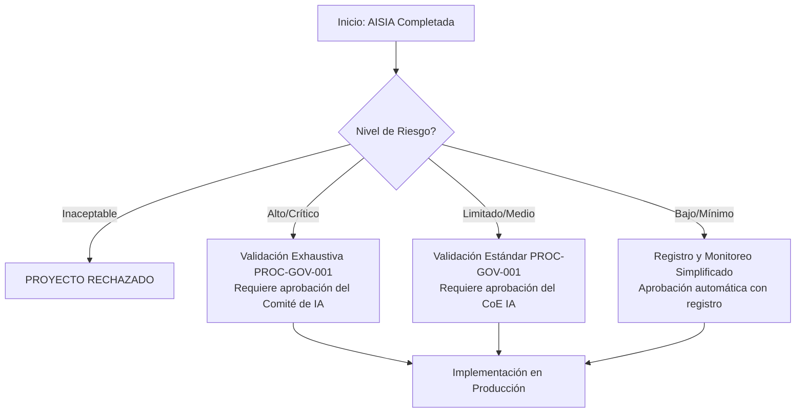
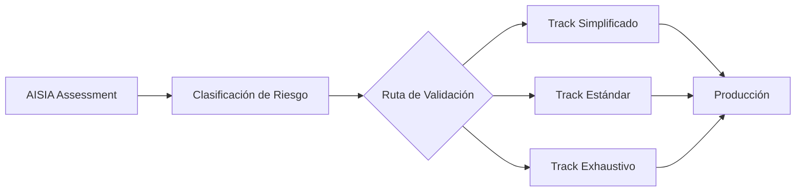

# Herramienta de Evaluación de Impacto de Sistemas de IA (AISIA)

  

    <h2>🎯 Evaluación Obligatoria para Sistemas de IA</h2>
    
Esta herramienta es un requisito obligatorio según la <strong>Política de Uso Responsable de IA</strong> para todos los nuevos sistemas de IA antes de su desarrollo. Su propósito es identificar, analizar y mitigar los riesgos potenciales asociados a un sistema de IA, garantizando el cumplimiento regulatorio y ético.

  

## 📊 Herramienta Interactiva AISIA

  <iframe srcdoc='<!DOCTYPE html>
<html lang="es-MX">
<head>
    <meta charset="UTF-8">
    <meta name="viewport" content="width=device-width, initial-scale=1.0">
    <title>Herramienta de Evaluación de Impacto de Sistemas de IA (AISIA)</title>
    
</head>
<body>

    

        <h1>🏛️ Herramienta de Evaluación de Impacto de Sistemas de IA (AISIA)</h1>
        
Esta herramienta es un requisito obligatorio según la <strong>Política de Uso Responsable de IA</strong> para todos los nuevos sistemas de IA antes de su desarrollo. Su propósito es identificar, analizar y mitigar los riesgos potenciales asociados a un sistema de IA, garantizando el cumplimiento regulatorio y ético. El resultado de esta evaluación determinará la ruta a seguir en el <strong>PROC-GOV-001: Procedimiento de Validación de Modelos</strong>.

        
        <form id="aisiaForm">
            <!-- SECCIÓN 1: FORMULARIO DE EVALUACIÓN INICIAL -->
            

                <h2>1. Formulario de Evaluación Inicial</h2>
                

                    <label for="aiSystemName">Nombre del Sistema de IA</label>
                    <input type="text" id="aiSystemName" name="aiSystemName" placeholder="Ej: Modelo de Scoring para Crédito de Consumo v2.1" required>
                

                

                    <label for="purpose">Propósito y Alcance del Sistema</label>
                    <textarea id="purpose" name="purpose" placeholder="Ej: El sistema tiene como objetivo predecir la probabilidad de incumplimiento de pago para nuevos solicitantes de tarjetas de crédito. Se utilizará en el proceso de originación para automatizar la decisión de aprobación/rechazo para solicitudes de bajo monto (<$50,000 MXN) y como recomendación para montos superiores." required></textarea>
                    <small>Describa el problema de negocio que resuelve y los límites de su aplicación.</small>
                

                

                    <label for="stakeholders">Stakeholders Involucrados</label>
                    <input type="text" id="stakeholders" name="stakeholders" placeholder="Ej: Product Owner (Tarjetas de Crédito), Risk Officer (Riesgo Crediticio), Data Science Team, Cumplimiento Normativo" required>
                    <small>Liste los roles y áreas clave que participan o son impactados por el sistema.</small>
                

                

                    <label for="dataUsed">Datos Utilizados</label>
                    <textarea id="dataUsed" name="dataUsed" placeholder="Ej: Datos sociodemográficos del cliente (edad, estado civil, etc.), historial crediticio interno y de buró, ingresos comprobados, datos transaccionales de cuentas del banco. No se utilizan datos sensibles como origen étnico, religión o preferencias políticas." required></textarea>
                    <small>Describa las categorías de datos para entrenamiento y operación, indicando si se usan datos personales o sensibles según la LFPDPPP.</small>
                

            

            <!-- SECCIÓN 2: MATRIZ DE CLASIFICACIÓN DE RIESGO -->
            

                <h2>2. Matriz de Clasificación de Riesgo</h2>
                
Responda las siguientes preguntas para calcular automáticamente el nivel de riesgo del sistema. Este cálculo se basa en los criterios del EU AI Act, la regulación bancaria mexicana (CNBV) y el impacto en derechos fundamentales.

                <h3>2.1 Criterios de Riesgo Inaceptable (Basado en EU AI Act)</h3>
                

                    <label>¿El sistema utiliza técnicas subliminales o manipuladoras que puedan causar daño físico o psicológico?</label>
                    <input type="radio" name="unacceptable1" value="yes" data-score="100"> Sí
                    <input type="radio" name="unacceptable1" value="no" data-score="0" checked> No
                

                

                    <label>¿El sistema explota vulnerabilidades de grupos específicos (edad, discapacidad) para distorsionar su comportamiento de manera perjudicial?</label>
                    <input type="radio" name="unacceptable2" value="yes" data-score="100"> Sí
                    <input type="radio" name="unacceptable2" value="no" data-score="0" checked> No
                

                

                    <label>¿El sistema realiza "social scoring" o calificación social de personas que pueda conducir a un tratamiento perjudicial o desfavorable en contextos no relacionados?</label>
                    <input type="radio" name="unacceptable3" value="yes" data-score="100"> Sí
                    <input type="radio" name="unacceptable3" value="no" data-score="0" checked> No
                

                <h3>2.2 Criterios de Alto Riesgo (CNBV y Casos de Uso Bancarios Críticos)</h3>
                

                    <label>¿El sistema toma decisiones o es un componente clave en la determinación del acceso a productos de crédito (originación, scoring, fijación de precios)?</label>
                    <input type="radio" name="highrisk1" value="yes" data-score="30"> Sí
                    <input type="radio" name="highrisk1" value="no" data-score="0" checked> No
                

                

                    <label>¿El sistema se utiliza para la prevención, detección o investigación de lavado de dinero (AML/PLD) o financiamiento al terrorismo?</label>
                    <input type="radio" name="highrisk2" value="yes" data-score="25"> Sí
                    <input type="radio" name="highrisk2" value="no" data-score="0" checked> No
                

                

                    <label>¿El sistema se utiliza para procesos de identificación y conocimiento del cliente (KYC)?</label>
                    <input type="radio" name="highrisk3" value="yes" data-score="20"> Sí
                    <input type="radio" name="highrisk3" value="no" data-score="0" checked> No
                

                

                    <label>¿El sistema toma decisiones sobre el acceso a empleo, gestión de personal o terminación de relaciones laborales dentro del banco?</label>
                    <input type="radio" name="highrisk4" value="yes" data-score="25"> Sí
                    <input type="radio" name="highrisk4" value="no" data-score="0" checked> No
                

                 

                    <label>¿El sistema determina el acceso a servicios públicos o privados esenciales (ej. seguros, fianzas)?</label>
                    <input type="radio" name="highrisk5" value="yes" data-score="20"> Sí
                    <input type="radio" name="highrisk5" value="no" data-score="0" checked> No
                

                

                    <label>¿El sistema realiza trading algorítmico o gestiona inversiones de forma automatizada?</label>
                    <input type="radio" name="highrisk6" value="yes" data-score="30"> Sí
                    <input type="radio" name="highrisk6" value="no" data-score="0" checked> No
                

                <h3>2.3 Evaluación de Impacto en Derechos y Privacidad (LFPDPPP)</h3>
                

                    <label>¿El sistema procesa datos personales sensibles (salud, biométricos, ideología, etc.)?</label>
                    <input type="radio" name="impact1" value="yes" data-score="20"> Sí
                    <input type="radio" name="impact1" value="no" data-score="0" checked> No
                

                

                    <label>¿Las decisiones del sistema son completamente automatizadas y tienen un efecto legal o significativo en las personas (ej. rechazo de un servicio)?</label>
                    <input type="radio" name="impact2" value="yes" data-score="15"> Sí
                    <input type="radio" name="impact2" value="no" data-score="0" checked> No
                

                

                    <label>¿Es difícil o imposible para un cliente apelar o solicitar una revisión humana de una decisión tomada por el sistema?</label>
                    <input type="radio" name="impact3" value="yes" data-score="15"> Sí
                    <input type="radio" name="impact3" value="no" data-score="0" checked> No
                

                

                    <label>¿El sistema podría generar o amplificar sesgos discriminatorios contra grupos protegidos?</label>
                    <input type="radio" name="impact4" value="yes" data-score="25"> Sí
                    <input type="radio" name="impact4" value="no" data-score="0" checked> No
                

                <h3>2.4 Criterios de Riesgo Limitado y Mínimo</h3>
                 

                    <label>¿El sistema interactúa directamente con los clientes (ej. chatbot, sistema de recomendación) sin tomar decisiones críticas?</label>
                    <input type="radio" name="limited1" value="yes" data-score="10"> Sí
                    <input type="radio" name="limited1" value="no" data-score="0" checked> No
                

                

                    <label>¿El sistema automatiza procesos internos de back-office que no tienen impacto directo en clientes (ej. clasificación de documentos, optimización de rutas)?</label>
                    <input type="radio" name="limited2" value="yes" data-score="5"> Sí
                    <input type="radio" name="limited2" value="no" data-score="0" checked> No
                

                 

                    <label>¿El sistema se utiliza como herramienta de asistencia para un humano que toma la decisión final (ej. asistente de codificación, generador de resúmenes)?</label>
                    <input type="radio" name="limited3" value="yes" data-score="5"> Sí
                    <input type="radio" name="limited3" value="no" data-score="0" checked> No
                

            

            <!-- SECCIÓN 3: EVALUACIÓN DE IMPACTO DETALLADA -->
            

                <h2>3. Evaluación de Impacto Detallada</h2>
                <h3>Impacto en Clientes y Empleados</h3>
                

                    <label for="impact_clients">¿Cómo podría afectar este sistema a los clientes de manera positiva y negativa?</label>
                    <textarea id="impact_clients" name="impact_clients" placeholder="Positivo: decisiones de crédito más rápidas y accesibles. Negativo: posibles rechazos incorrectos, falta de transparencia en la decisión, perpetuación de sesgos históricos."></textarea>
                

                <h3>Riesgos de Discriminación y Sesgo</h3>
                

                    <label for="impact_bias">¿Qué grupos demográficos podrían verse afectados de manera desproporcionada y cómo se planea medir y mitigar este riesgo?</label>
                    <textarea id="impact_bias" name="impact_bias" placeholder="Ej: Mujeres, jóvenes, residentes de ciertas zonas geográficas. Se medirá la paridad demográfica y la igualdad de oportunidades en las tasas de aprobación. Se utilizarán técnicas como re-weighting y adversarial debiasing."></textarea>
                

                <h3>Transparencia y Explicabilidad</h3>
                

                    <label for="impact_explainability">¿Cómo se explicarán las decisiones del sistema a los clientes, empleados y reguladores?</label>
                    <textarea id="impact_explainability" name="impact_explainability" placeholder="Ej: Se utilizarán SHAP values para generar explicaciones locales para cada decisión. Se prepararán resúmenes en lenguaje natural para los clientes afectados, indicando los 3 principales factores de la decisión, según lo exige la LFPDPPP."></textarea>
                

                <h3>Seguridad y Robustez</h3>
                

                    <label for="impact_security">¿Cuáles son los principales riesgos de seguridad (ataques adversarios, envenenamiento de datos) y cuál es el plan de contingencia ante una falla del sistema?</label>
                    <textarea id="impact_security" name="impact_security" placeholder="Riesgos: manipulación de datos de entrada para obtener un crédito indebido. Plan de contingencia: monitoreo de drift, alertas automáticas y un kill switch que revierte al proceso manual si las métricas de performance caen por debajo del 95% del baseline."></textarea>
                

            

            
            <!-- SECCIÓN 4: CONTROLES Y MITIGACIONES -->
            

                <h2>4. Controles y Mitigaciones Propuestos</h2>
                
Marque los controles que planea implementar. Esto es un plan inicial que será validado por la segunda línea de defensa.

                
                <h3>Controles Técnicos</h3>
                

                    <input type="checkbox" id="ctrl_tech1" name="ctrl_tech1"> <label for="ctrl_tech1">Monitoreo continuo de métricas de desempeño y sesgo (ISO 23894).</label> 
                    <input type="checkbox" id="ctrl_tech2" name="ctrl_tech2"> <label for="ctrl_tech2">Implementación de herramientas de explicabilidad (SHAP, LIME).</label> 
                    <input type="checkbox" id="ctrl_tech3" name="ctrl_tech3"> <label for="ctrl_tech3">Pruebas de robustez y ataques adversarios.</label> 
                    <input type="checkbox" id="ctrl_tech4" name="ctrl_tech4"> <label for="ctrl_tech4">Encriptación de datos en tránsito y en reposo.</label> 
                

                <h3>Salvaguardas Operacionales</h3>
                

                    <input type="checkbox" id="ctrl_op1" name="ctrl_op1"> <label for="ctrl_op1">Supervisión humana obligatoria para decisiones críticas (Nivel 3 o 4).</label> 
                    <input type="checkbox" id="ctrl_op2" name="ctrl_op2"> <label for="ctrl_op2">Proceso claro de apelación y revisión humana para clientes.</label> 
                    <input type="checkbox" id="ctrl_op3" name="ctrl_op3"> <label for="ctrl_op3">Plan de contingencia y rollback documentado y probado.</label> 
                    <input type="checkbox" id="ctrl_op4" name="ctrl_op4"> <label for="ctrl_op4">Capacitación específica para los usuarios finales del sistema.</label> 
                

                <h3>Requisitos de Documentación (ISO 42001)</h3>
                

                    <input type="checkbox" id="ctrl_doc1" name="ctrl_doc1"> <label for="ctrl_doc1">Creación de una "Model Card" detallada.</label> 
                    <input type="checkbox" id="ctrl_doc2" name="ctrl_doc2"> <label for="ctrl_doc2">Documentación completa de la fuente de datos y preprocesamiento.</label> 
                    <input type="checkbox" id="ctrl_doc3" name="ctrl_doc3"> <label for="ctrl_doc3">Registro de logs inmutables para cada decisión del modelo.</label> 
                

            

            <button type="button" class="btn" onclick="calculateAndShowResults()">Calcular Riesgo y Generar Dashboard</button>
        </form>

        <!-- SECCIÓN 5: DASHBOARD DE RESULTADOS -->
        

            <h2>5. Dashboard de Resultados AISIA</h2>
            

                

                    <h4>Score de Riesgo AISIA</h4>
                    
0

                

                

                    <h4>Nivel de Riesgo Asignado</h4>
                    

                        N/A
                    

                

            

            
            

                <h3>Recomendaciones y Próximos Pasos</h3>
                

            

            

                <h4>Flujo de Aprobación Requerido</h4>
                
El nivel de riesgo asignado determina el proceso de validación y aprobación. Consulte el diagrama para entender la ruta que seguirá su proyecto.

            

             

                <h4>Alineación con Frameworks</h4>
                
Este sistema, una vez aprobado, será monitoreado continuamente a través del <strong>Framework IMPACT</strong> del CoE. La documentación generada servirá como base para las auditorías de cumplimiento con <strong>ISO/IEC 42001</strong> y la <strong>regulación de la CNBV</strong>.

            

        

    

    

</body>
</html>' width="100%" height="2400" style="border: none; border-radius: 8px;">
  </iframe>

## 🔄 Flujo de Aprobación según Nivel de Riesgo

## 📋 Guía de Uso de la Herramienta

### 1. Cuándo Usar AISIA

!!! warning "Obligatorio para Todos los Nuevos Sistemas"
    Esta evaluación es **mandatoria** antes de iniciar el desarrollo de cualquier sistema de IA según la Política de Uso Responsable de IA, sin importar su complejidad aparente.

### 2. Quién Debe Completar AISIA

- **Product Owner**: Responsable principal de completar la evaluación
- **Risk Officer**: Revisión y validación de la evaluación
- **Data Scientist/ML Engineer**: Soporte técnico para las secciones de arquitectura
- **Compliance Officer**: Validación de cumplimiento regulatorio

### 3. Proceso Paso a Paso

1. **Preparación**: Recopile toda la información sobre el sistema propuesto
2. **Completar Formulario**: Llene todas las secciones de la herramienta
3. **Calcular Riesgo**: Use el botón para obtener la clasificación automática
4. **Documentar Resultados**: Guarde el PDF del resultado para el expediente
5. **Iniciar Validación**: Proceda según el nivel de riesgo asignado

## 📊 Interpretación de Resultados

### Niveles de Riesgo y Acciones

| Nivel | Score | Acción Requerida | Aprobador |
|-------|-------|------------------|-----------|
| **Inaceptable** | ≥100 | Proyecto prohibido, requiere redefinición | N/A - Rechazado |
| **Alto** | 40-99 | Validación exhaustiva PROC-GOV-001 | Comité de IA |
| **Limitado** | 15-39 | Validación estándar PROC-GOV-001 | CoE IA + Risk Officer |
| **Bajo** | <15 | Registro simplificado | Automático con registro |

## 🔗 Integración con Otros Procesos

### Conexión con PROC-GOV-001

La herramienta AISIA es el punto de entrada al procedimiento de validación de modelos:

### Alineación con Framework IMPACT

Los resultados de AISIA alimentan directamente las métricas del Framework IMPACT:

- **Implementation**: Tiempo desde AISIA hasta producción
- **Momentum**: Número de sistemas evaluados mensualmente
- **Performance**: Precisión en la clasificación de riesgo
- **Acceptance**: Tasa de aprobación post-AISIA
- **Cost-Effective**: ROI de los controles implementados
- **Trust**: Cumplimiento con regulaciones

## 📚 Referencias y Normativa

### Estándares Internacionales
- **ISO/IEC 23053**: Framework para ML
- **ISO/IEC 23894**: Gestión de riesgos en IA
- **ISO/IEC 42001**: Sistema de gestión de IA

### Regulación Aplicable
- **EU AI Act**: Clasificación de riesgos
- **CNBV**: Circular Única de Bancos
- **LFPDPPP**: Protección de datos personales

## 🆘 Soporte y Contacto

Para dudas sobre el uso de la herramienta AISIA:

- **Email**: aisia-support@banco.mx
- **Teams**: Canal #aisia-evaluaciones
- **Wiki**: wiki.banco.mx/aisia
- **Helpdesk CoE**: Ext. 4242

---

*Herramienta AISIA v2.0 | Centro de Excelencia de IA | Última actualización: 09 de enero de 2025*