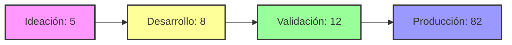
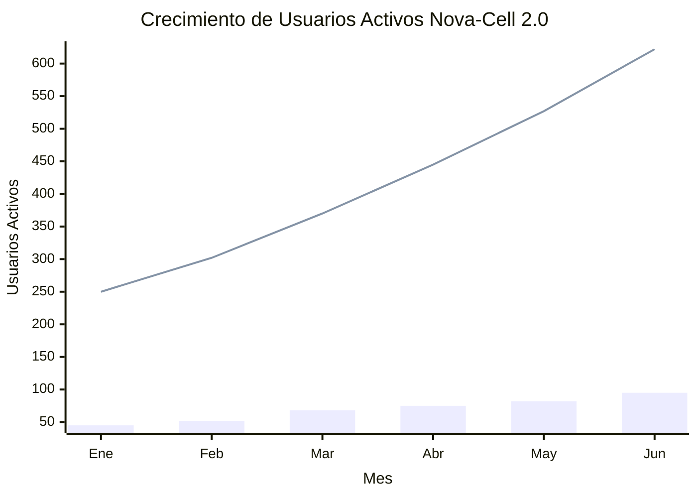
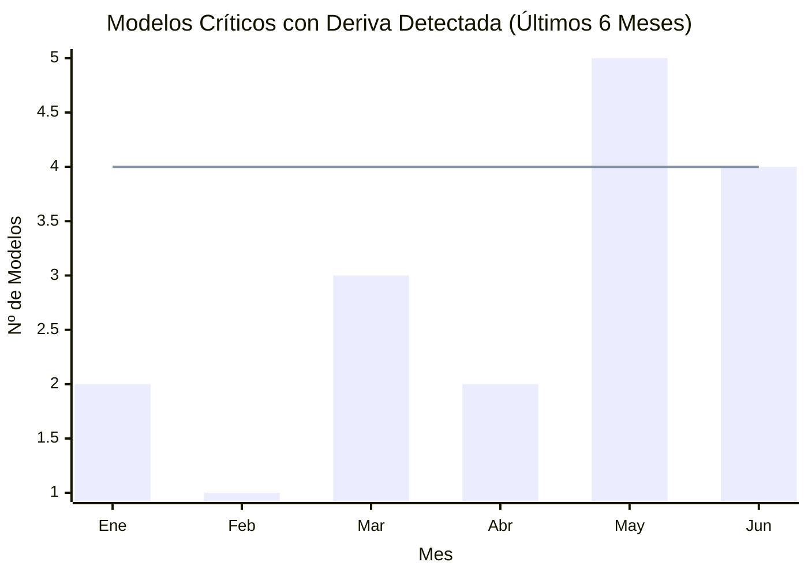
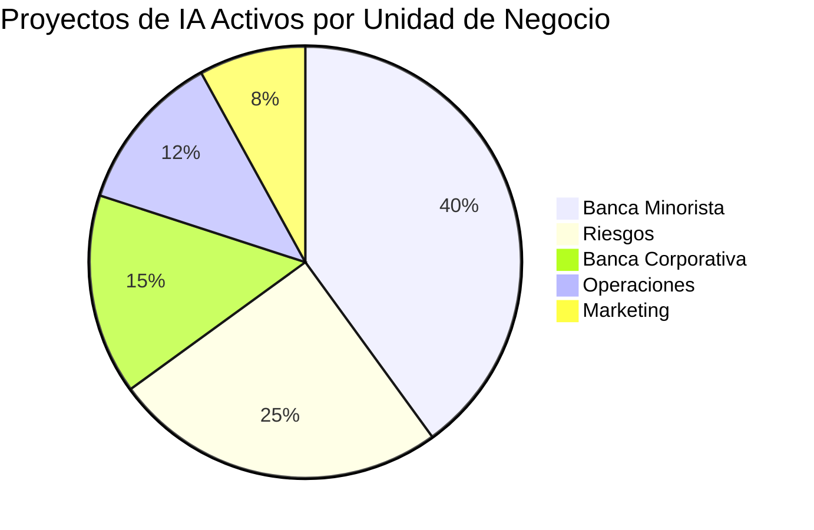

# Dashboard de Métricas IMPACT - Centro de Excelencia de IA (Nova-Cell 2.0)

## Vista Ejecutiva: Resumen General de IMPACT

Este dashboard provee una visión 360° del rendimiento y valor del Centro de Excelencia de IA, basado en el framework IMPACT. Las métricas reflejan el estado actual de nuestros proyectos, plataformas y su alineación con los objetivos estratégicos del banco.

    

        
ROI Total de Proyectos IA

        

            315%
        

        

            ▲ 12% vs. Trimestre Anterior
        

    

    

        
Modelos en Producción

        

            82
        

        

            ▲ 5 nuevos este mes
        

    

    

        
Adopción por Unidades de Negocio

        

            75%
        

        

            12 de 16 unidades de negocio activas
        

    

    

        
Nivel de Confianza (Trust Score)

        

            9.2/ 10
        

        

            Promedio de auditorías de equidad y seguridad
        

    

---

### Controles y Filtros

    Periodo:
    <button class="filter-button">Últimos 30 días</button>
    <button class="filter-button">Este Trimestre</button>
    <button class="filter-button">Año Actual</button>
    Unidad de Negocio:
    <button class="filter-button">Todas</button>
    <button class="filter-button">Banca Minorista</button>
    <button class="filter-button">Banca Corporativa</button>
    <button class="filter-button">Riesgos</button>

### Alertas y Notificaciones

    

        <strong>CRÍTICO:</strong> El modelo de Detección de Fraude v2.1 (TDC) muestra una degradación en la precisión del 8% en las últimas 48 horas. Se requiere intervención inmediata.
    

    

        <strong>ADVERTENCIA:</strong> El tiempo de inferencia para el modelo de Scoring de Crédito ha aumentado un 15% por encima del SLA. Investigar posible sobrecarga en la infraestructura.
    

---

## I - Implementation (Implementación)
*Mide la velocidad y eficiencia con la que desplegamos soluciones de IA desde la ideación hasta la producción.*

    

        
Tiempo Promedio de Despliegue

        

            52días
        

        

            ▼ 8% más rápido que el H1
        

    

    

        
Proyectos en Pipeline

        

            25
        

        

            8 en desarrollo, 12 en validación, 5 en ideación
        

    

    

        
Tasa de Éxito de Despliegue

        

            98%
        

        

            Despliegues sin necesidad de rollback
        

    

### Pipeline de Proyectos IA

---

## M - Momentum (Impulso)
*Evalúa la adopción, crecimiento y escalabilidad de la plataforma Nova-Cell 2.0 y sus soluciones.*

    

        
Llamadas a API / día (promedio)

        

            1.2M
        

        

            ▲ 25% Crecimiento MoM
        

    

    

        
Usuarios Activos en Plataforma

        

            450+
        

        

            Data Scientists, Analistas, Jefes de Producto
        

    

    

        
Nuevos Casos de Uso Iniciados

        

            8
        

        

            Este trimestre
        

    

### Tendencia de Adopción (Últimos 6 Meses)

---

## P - Performance (Rendimiento)
*Monitorea la calidad técnica, precisión y eficiencia operativa de los modelos en producción.*

    

        
Precisión Ponderada de Modelos

        

            94.6%
        

        

            Promedio de todos los modelos críticos
        

    

    

        
Latencia de Inferencia (p95)

        

            120ms
        

        

            Dentro del SLA de 200ms
        

    

    

        
Uptime de la Plataforma

        

            99.98%
        

        

            Últimos 90 días
        

    

### Detección de Deriva de Modelos (Model Drift)

---

## A - Acceptance (Aceptación)
*Mide cómo las unidades de negocio adoptan, utilizan y perciben el valor de las soluciones de IA.*

    

        
NPS de Unidades de Negocio

        

            +45
        

        

            ▲ 8 puntos vs. encuesta anterior
        

    

    

        
Tasa de Adopción de Features

        

            68%
        

        

            Features clave usadas activamente por usuarios target
        

    

    

        
Satisfacción del Usuario

        

            4.3/ 5
        

        

            Promedio de evaluaciones post-implementación
        

    

### Distribución de Proyectos por Unidad de Negocio

---

## C - Cost-Effective (Costo-Efectividad)
*Cuantifica el impacto financiero, incluyendo ahorros, ingresos generados y eficiencia operacional.*

    

        
Ahorro por Detección de Fraude

        

            $8.2MMXN
        

        

            Acumulado en el año fiscal
        

    

    

        
Horas-Hombre Ahorradas

        

            15,000+
        

        

            Por automatización de procesos (anualizado)
        

    

    

        
Costo por Inferencia

        

            $0.0012MXN
        

        

            ▼ 5% optimización de infraestructura
        

    

### Detalle de Impacto Financiero (Q2)

| Iniciativa de IA | Unidad de Negocio | Ahorro / Ingreso Generado (MXN) | ROI de la Iniciativa |
|------------------|-------------------|----------------------------------|----------------------|
| Scoring Alternativo de Crédito | Banca Minorista | $12.5M (Ingreso) | **450%** |
| Optimización de Campañas | Marketing | $4.8M (Ingreso) | **320%** |
| Clasificación de Documentos | Operaciones | $3.1M (Ahorro) | **280%** |
| Prevención de Fuga de Clientes | Banca Corporativa | $7.9M (Retención) | **410%** |
| Detección de Anomalías | Riesgos | $5.3M (Prevención) | **380%** |
| Chatbot de Servicio | Contact Center | $2.8M (Ahorro) | **290%** |

---

## T - Trust (Confianza)
*Asegura que nuestras soluciones de IA son seguras, éticas, justas, transparentes y cumplen con la regulación.*

    

        
Auditorías de Sesgo (Bias) Pasadas

        

            100%
        

        

            De modelos en producción
        

    

    

        
Cobertura de Explicabilidad (XAI)

        

            85%
        

        

            De modelos de decisión crítica con reportes SHAP/LIME
        

    

    

        
Cumplimiento Regulatorio (CNBV)

        

            100%
        

        

            Cero incidentes reportados en auditorías
        

    

### Matriz de Cumplimiento Regulatorio

| Regulación | Estado | Última Auditoría | Próxima Revisión |
|------------|--------|------------------|------------------|
| **CNBV - Disposiciones CUB** | ✅ Cumple | 15-May-2024 | 15-Nov-2024 |
| **ISO/IEC 42001:2023** | ✅ Cumple | 30-Jun-2024 | 30-Dec-2024 |
| **LFPDPPP** | ✅ Cumple | 20-Apr-2024 | 20-Oct-2024 |
| **EU AI Act (preparación)** | 🔄 En proceso | N/A | Mar-2025 |

---

## Configuración y Acceso

### Perfiles de Usuario

- **Ejecutivos**: Vista resumida con KPIs principales y tendencias
- **Gerentes de Unidad**: Métricas específicas de su área + benchmarks
- **Data Scientists**: Performance técnico detallado + drift monitoring
- **Risk Officers**: Compliance, auditorías y métricas de confianza

### Actualización de Datos

- **Tiempo Real**: Métricas de performance y disponibilidad
- **Diario**: Métricas de adopción y uso
- **Semanal**: Métricas financieras y de impacto
- **Mensual**: NPS, satisfacción y auditorías

### Exportación y Reportes

Todos los datos pueden exportarse en formatos:
- PDF para reportes ejecutivos
- Excel para análisis detallado
- API REST para integración con otros sistemas

---

*Dashboard generado el 09 de Enero de 2025 | Versión 2.0 | Centro de Excelencia de IA*