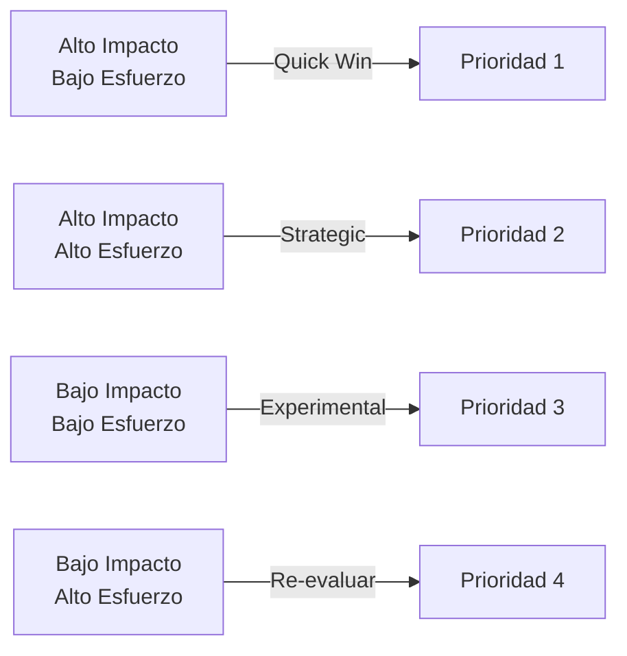

# AI Opportunity Radar Tool - Identificación y Priorización Estratégica

  

    <h2>🚀 Radar de Oportunidades de IA para Banca</h2>
    
Herramienta visual e interactiva para identificar, evaluar y priorizar oportunidades de IA estratégicas, con análisis multidimensional y alineación con el Framework IMPACT del CoE.

  

## 📊 Herramienta Interactiva de Evaluación

  <iframe srcdoc='<!DOCTYPE html>
<html lang="es">
<head>
    <meta charset="UTF-8">
    <meta name="viewport" content="width=device-width, initial-scale=1.0">
    <title>AI Opportunity Radar Tool - Banco Nova</title>
    <!-- Chart.js CDN for interactive charts -->
    
    
    
</head>
<body>
    

        <h1>🚀 AI Opportunity Radar Tool - Banco Nova</h1>
        
Identifica, evalúa y prioriza oportunidades de IA estratégicas para el Banco.

        

            <h2>1. Evaluación de Oportunidades de IA</h2>
            

                <label for="opportunity-select">Seleccionar Oportunidad Existente:</label>
                <select id="opportunity-select">
                    <option value="">-- Crear Nueva Oportunidad --</option>
                </select>
                <button onclick="loadOpportunityFromSelect()">Cargar</button>
            

            <form id="evaluation-form">
                <h3>Detalles de la Oportunidad</h3>
                

                    <label for="opportunity-name">Nombre de la Oportunidad:</label>
                    <input type="text" id="opportunity-name" placeholder="Ej: Scoring Crediticio Avanzado" required>
                

                

                    <label for="opportunity-description">Descripción Breve:</label>
                    <input type="text" id="opportunity-description" placeholder="Ej: Mejora la precisión de evaluación de riesgo crediticio">
                

                <h3>Dimensiones del Radar (Scoring 0-100)</h3>
                

                    <label for="impactoNegocio">Impacto en Negocio (Revenue/Cost):</label>
                    <input type="range" id="impactoNegocio" min="0" max="100" value="50" oninput="updateScore('impactoNegocio')">
                    <input type="number" id="impactoNegocio-num" min="0" max="100" value="50" oninput="updateRange('impactoNegocio')">
                    50
                

                

                    <label for="viabilidadTecnica">Viabilidad Técnica:</label>
                    <input type="range" id="viabilidadTecnica" min="0" max="100" value="50" oninput="updateScore('viabilidadTecnica')">
                    <input type="number" id="viabilidadTecnica-num" min="0" max="100" value="50" oninput="updateRange('viabilidadTecnica')">
                    50
                

                

                    <label for="alineacionEstrategica">Alineación Estratégica:</label>
                    <input type="range" id="alineacionEstrategica" min="0" max="100" value="50" oninput="updateScore('alineacionEstrategica')">
                    <input type="number" id="alineacionEstrategica-num" min="0" max="100" value="50" oninput="updateRange('alineacionEstrategica')">
                    50
                

                

                    <label for="madurezDatos">Madurez de Datos:</label>
                    <input type="range" id="madurezDatos" min="0" max="100" value="50" oninput="updateScore('madurezDatos')">
                    <input type="number" id="madurezDatos-num" min="0" max="100" value="50" oninput="updateRange('madurezDatos')">
                    50
                

                

                    <label for="riesgoRegulatorio">Riesgo Regulatorio:</label>
                    <input type="range" id="riesgoRegulatorio" min="0" max="100" value="50" oninput="updateScore('riesgoRegulatorio')">
                    <input type="number" id="riesgoRegulatorio-num" min="0" max="100" value="50" oninput="updateRange('riesgoRegulatorio')">
                    50
                

                

                    <label for="complejidadImplementacion">Complejidad de Implementación:</label>
                    <input type="range" id="complejidadImplementacion" min="0" max="100" value="50" oninput="updateScore('complejidadImplementacion')">
                    <input type="number" id="complejidadImplementacion-num" min="0" max="100" value="50" oninput="updateRange('complejidadImplementacion')">
                    50
                

                

                    <label for="adopcionEsperada">Adopción Esperada (Usuarios/Clientes):</label>
                    <input type="range" id="adopcionEsperada" min="0" max="100" value="50" oninput="updateScore('adopcionEsperada')">
                    <input type="number" id="adopcionEsperada-num" min="0" max="100" value="50" oninput="updateRange('adopcionEsperada')">
                    50
                

                

                    <label for="timeToValue">Time to Value (Meses, 0=rápido, 100=lento):</label>
                    <input type="range" id="timeToValue" min="0" max="100" value="50" oninput="updateScore('timeToValue')">
                    <input type="number" id="timeToValue-num" min="0" max="100" value="50" oninput="updateRange('timeToValue')">
                    50
                

                

                    
<strong>Score Total Ponderado:</strong> 0

                    
<strong>Clasificación Automática:</strong> N/A 

                

                

                    <button type="button" onclick="addOrUpdateOpportunity()">Guardar Oportunidad</button>
                    <button type="button" onclick="resetForm()">Nueva Oportunidad</button>
                

            </form>
        

        

            <h2>2. Dashboard de Comparación y Priorización</h2>
            

                <label for="compare-opportunities-select">Oportunidades a Comparar:</label>
                <select id="compare-opportunities-select" multiple size="5" onchange="updateComparisonChart()">
                    <!-- Options will be populated by JS -->
                </select>
                <button onclick="updateComparisonChart()">Actualizar Gráfico</button>
            

            

                <canvas id="radarChart"></canvas>
            

            

                

                    <h4>Matriz de Priorización (Impacto vs Esfuerzo)</h4>
                    

                        

                        
Bajo Esfuerzo

                        
Alto Esfuerzo

                        
Alto Impacto

                        

                        

                        
Bajo Impacto

                        

                        

                    

                    

                        Impacto (Alto/Bajo)
                        Esfuerzo (Bajo/Alto)
                    

                

                

                    <h4>Roadmap Sugerido & Análisis de Gaps</h4>
                    

                        
Selecciona oportunidades para ver el roadmap sugerido y el análisis de gaps.

                    

                

            

        

        

            <h2>3. Integración con el CoE IA</h2>
            

                

                    <h4>Alineación con Framework IMPACT</h4>
                    
Las oportunidades son evaluadas bajo criterios que alimentan directamente el Framework IMPACT del CoE IA:

                    <ul class="recommendation-list">
                        <li><strong>Impacto en Negocio:</strong> Contribuye a <em>Performance (Eficiencia)</em> y <em>Cost-Effective (ROI)</em>.</li>
                        <li><strong>Time to Value:</strong> Clave para <em>Implementation (Time to First Value)</em>.</li>
                        <li><strong>Adopción Esperada:</strong> Relacionado con <em>Acceptance (Tasa de Aceptación)</em>.</li>
                        <li><strong>Alineación Estratégica:</strong> Asegura la coherencia con la visión del CoE IA.</li>
                    </ul>
                

                

                    <h4>Conexión con Proceso AISIA</h4>
                    
La evaluación de <strong>Riesgo Regulatorio</strong> y <strong>Viabilidad Técnica</strong> es crucial para el proceso AISIA:

                    <ul class="recommendation-list">
                        <li>Oportunidades con <strong>Alto Riesgo Regulatorio</strong> (>70) deben ser priorizadas para revisión AISIA.</li>
                        <li>El <strong>AI Risk Officer</strong> y <strong>AI Governance Lead</strong> deben ser consultados.</li>
                        <li>Referencia: Anexo B - Checklist de Evaluación AISIA.</li>
                    </ul>
                

                

                    <h4>Referencias a Playbooks</h4>
                    
Según los resultados de la evaluación:

                    <ul class="recommendation-list">
                        <li><strong>Baja Madurez de Datos:</strong> Consultar Knowledge Hub para guías de calidad de datos.</li>
                        <li><strong>Alta Complejidad:</strong> Involucrar al AI Platform Team (Nova-Cell) y MLOps Engineer.</li>
                        <li><strong>Baja Adopción:</strong> Contactar al AI Training Lead para programas de capacitación.</li>
                    </ul>
                

            

        

        

            <h2>4. Exportar Resultados</h2>
            <button onclick="exportOpportunities()">Exportar Todas las Oportunidades (JSON)</button>
            <button onclick="printReport()">Imprimir Reporte Actual</button>
        

    

    
</body>
</html>' width="100%" height="2200" style="border: none; border-radius: 8px;">
  </iframe>

## 🎯 Características Principales

### Dimensiones de Evaluación (8 Ejes)

| Dimensión | Descripción | Peso |
|-----------|-------------|------|
| **Impacto en Negocio** | Revenue/Cost impact | 25% |
| **Viabilidad Técnica** | Factibilidad tecnológica | 15% |
| **Alineación Estratégica** | Coherencia con visión bancaria | 20% |
| **Madurez de Datos** | Disponibilidad y calidad de datos | 10% |
| **Riesgo Regulatorio** | Cumplimiento normativo | 10% |
| **Complejidad de Implementación** | Esfuerzo y recursos requeridos | 10% |
| **Adopción Esperada** | Aceptación por usuarios/clientes | 5% |
| **Time to Value** | Tiempo hasta generar valor | 5% |

### Clasificación Automática de Oportunidades

!!! success "Quick Win"
    Alto Impacto + Bajo Esfuerzo = Implementación inmediata

!!! info "Strategic"
    Alto Impacto + Alto Esfuerzo = Planificación robusta

!!! warning "Transformación"
    Impacto Medio + Alto Esfuerzo = Inversión a largo plazo

!!! tip "Experimental"
    Bajo Impacto + Bajo Esfuerzo = Pruebas de concepto

## 📈 Dashboard de Comparación

### Visualización Radar

El gráfico radar permite comparar hasta 8 oportunidades simultáneamente:
- Visualización multidimensional clara
- Identificación rápida de fortalezas y debilidades
- Comparación directa entre diferentes iniciativas

### Matriz de Priorización (Impacto vs Esfuerzo)

## 🏦 Catálogo de Oportunidades Bancarias Pre-cargadas

### 1. Scoring Crediticio Avanzado
- **Impacto**: 90/100
- **Viabilidad**: 80/100
- **Clasificación**: Strategic

### 2. Detección de Fraude en Tiempo Real
- **Impacto**: 95/100
- **Viabilidad**: 70/100
- **Clasificación**: Strategic

### 3. Chatbots Conversacionales
- **Impacto**: 70/100
- **Viabilidad**: 90/100
- **Clasificación**: Quick Win

### 4. RPA para Back-office
- **Impacto**: 65/100
- **Viabilidad**: 95/100
- **Clasificación**: Quick Win

### 5. Análisis de Sentimiento en RRSS
- **Impacto**: 50/100
- **Viabilidad**: 70/100
- **Clasificación**: Experimental

### 6. Predicción de Churn
- **Impacto**: 80/100
- **Viabilidad**: 75/100
- **Clasificación**: Strategic

### 7. Optimización de Precios
- **Impacto**: 85/100
- **Viabilidad**: 60/100
- **Clasificación**: Transformación

### 8. KYC Automatizado
- **Impacto**: 75/100
- **Viabilidad**: 85/100
- **Clasificación**: Strategic

## 🔗 Integración con Framework IMPACT

La herramienta se alinea directamente con las métricas del Framework IMPACT:

| Dimensión Radar | Métrica IMPACT | Contribución |
|-----------------|----------------|--------------|
| Impacto en Negocio | Performance & Cost-Effective | ROI y eficiencia operativa |
| Time to Value | Implementation | Velocidad de entrega de valor |
| Adopción Esperada | Acceptance | Tasa de adopción usuario |
| Alineación Estratégica | Momentum | Coherencia con visión CoE |

## 🛡️ Conexión con Proceso AISIA

### Triggers para Evaluación AISIA

- **Riesgo Regulatorio > 70**: Revisión obligatoria AISIA
- **Viabilidad Técnica < 30**: Evaluación de factibilidad
- **Impacto en Clientes Alto**: Análisis de impacto ético

### Stakeholders Clave

- **AI Risk Officer**: Oportunidades de alto riesgo
- **AI Governance Lead**: Cumplimiento regulatorio
- **Data Ethicist**: Implicaciones éticas de datos

## 📋 Análisis de Gaps y Roadmap

### Gaps Comunes y Acciones

| Gap Identificado | Umbral | Acción Recomendada |
|------------------|--------|-------------------|
| Baja Madurez de Datos | < 50 | Consultar Knowledge Hub, invertir en calidad de datos |
| Baja Viabilidad Técnica | < 50 | Involucrar AI Platform Team (Nova-Cell) |
| Alto Riesgo Regulatorio | > 70 | Proceso AISIA exhaustivo |
| Alta Complejidad | > 70 | Plan de proyecto detallado con MLOps |
| Baja Adopción Esperada | < 60 | Programa AI Champions, gestión del cambio |

## 💡 Guía de Uso

### Proceso de Evaluación

1. **Seleccionar o crear** nueva oportunidad
2. **Evaluar** cada dimensión (0-100)
3. **Revisar** clasificación automática
4. **Comparar** con otras oportunidades
5. **Analizar** gaps y requisitos
6. **Exportar** resultados para presentación

### Mejores Prácticas

- Involucrar stakeholders clave en la evaluación
- Actualizar scores periódicamente
- Usar datos históricos para calibrar estimaciones
- Documentar supuestos y limitaciones
- Priorizar Quick Wins para momentum inicial

## 📊 Exportación y Reportes

### Formatos Disponibles

- **JSON**: Exportación completa de datos
- **Print**: Reporte visual para presentaciones
- **Dashboard**: Vista ejecutiva en tiempo real

## 🆘 Soporte

Para dudas sobre el uso del AI Opportunity Radar:

- **Email**: opportunity-radar@banco.mx
- **Teams**: Canal #ai-opportunities
- **Wiki**: wiki.banco.mx/opportunity-radar
- **Helpdesk CoE**: Ext. 4242

---

*AI Opportunity Radar Tool v2.0 | Centro de Excelencia de IA | Última actualización: 09 de enero de 2025*