# Calculadora ROI para Iniciativas de IA en Banca

  

    <h2>💰 Análisis Financiero Integral para Proyectos de IA</h2>
    
Herramienta completa para calcular ROI, VAN, TIR y otros indicadores financieros clave, diseñada específicamente para evaluar iniciativas de IA en el contexto bancario mexicano.

  

## 📊 Calculadora Interactiva

  <iframe srcdoc='<!DOCTYPE html>
<html lang="es">
  <head>
    <meta charset="UTF-8">
    <meta name="viewport" content="width=device-width, initial-scale=1.0">
    <title>Calculadora ROI para Iniciativas de IA en Banca Mexicana</title>
    
    <!-- Normalización y estilos básicos -->
    <link rel="stylesheet" href="https://cdnjs.cloudflare.com/ajax/libs/normalize/8.0.1/normalize.min.css">
    <!-- Librería de Chart.js para gráficos -->
    
    
    
  </head>
  
  <body>
    <!-- Título principal -->
    <h1>Calculadora ROI para Iniciativas de IA en Banco Mexicano</h1>
    

      Esta herramienta calcula ROI, VAN, TIR, Payback period y más, integrando casos de uso bancarios como scoring, AML, chatbots y RPA.
    

    
    <!-- Formulario principal -->
    <form id="roiForm">
      
      <!-- Sección 1: Información del Proyecto -->
      <fieldset>
        <legend>1. Información del Proyecto</legend>
        <label for="projectName">Nombre del proyecto de IA:</label>
        <input type="text" id="projectName" placeholder="Ej. Optimización de scoring crediticio" required>
        
        <label for="initiativeType">Tipo de iniciativa:</label>
        <select id="initiativeType" required>
          <option value="">Seleccione</option>
          <option value="ML">Machine Learning (ML)</option>
          <option value="RPA">Robotic Process Automation (RPA)</option>
          <option value="NLP">Natural Language Processing (NLP)</option>
          <option value="CV">Computer Vision</option>
        </select>
        
        <label for="businessArea">Área de negocio impactada:</label>
        <input type="text" id="businessArea" placeholder="Ej. Crédito, Riesgo, Atención al Cliente" required>
        
        <label for="projectDuration">Duración del proyecto (meses):</label>
        <input type="number" id="projectDuration" placeholder="Ej. 12" required min="1">
      </fieldset>
      
      <!-- Sección 2: Costos de Implementación -->
      <fieldset>
        <legend>2. Costos de Implementación</legend>
        
        <label for="softwareLicenses">Licencias de software/cloud (MXN):</label>
        <input type="number" id="softwareLicenses" step="0.01" placeholder="Ej. 500000" required min="0">
        
        <label for="developmentCost">Desarrollo e integración (MXN):</label>
        <input type="number" id="developmentCost" step="0.01" placeholder="Ej. 750000" required min="0">
        
        <label for="trainingCost">Capacitación y change management (MXN):</label>
        <input type="number" id="trainingCost" step="0.01" placeholder="Ej. 200000" required min="0">
        
        <label for="infrastructureCost">Infraestructura y hardware (MXN):</label>
        <input type="number" id="infrastructureCost" step="0.01" placeholder="Ej. 300000" required min="0">
        
        <label for="consultingCost">Consultoría externa (MXN):</label>
        <input type="number" id="consultingCost" step="0.01" placeholder="Ej. 150000" required min="0">
        
        <label for="complianceCost">Costos de validación y compliance (MXN):</label>
        <input type="number" id="complianceCost" step="0.01" placeholder="Ej. 100000" required min="0">
      </fieldset>
      
      <!-- Sección 3: Beneficios Esperados -->
      <fieldset>
        <legend>3. Beneficios Esperados</legend>
        
        <label for="operationalSavings">Reducción de costos operativos (MXN):</label>
        <input type="number" id="operationalSavings" step="0.01" placeholder="Ej. 800000" required min="0">
        
        <label for="revenueIncrease">Incremento en ingresos (MXN):</label>
        <input type="number" id="revenueIncrease" step="0.01" placeholder="Ej. 1200000" required min="0">
        
        <label for="productivityImprovement">Mejora en productividad (%):</label>
        <input type="number" id="productivityImprovement" step="0.01" placeholder="Ej. 15" required min="0">
        
        <label for="riskReduction">Reducción de riesgos/pérdidas (MXN):</label>
        <input type="number" id="riskReduction" step="0.01" placeholder="Ej. 300000" required min="0">
        
        <label for="customerExp">Mejora en experiencia del cliente (valor intangibles cuantificados):</label>
        <input type="number" id="customerExp" step="0.01" placeholder="Ej. 500000" required min="0">
        
        <label for="intangibles">Beneficios intangibles cuantificados (MXN):</label>
        <input type="number" id="intangibles" step="0.01" placeholder="Ej. 250000" required min="0">
      </fieldset>
      
      <!-- Sección 4: Parámetros Financieros -->
      <fieldset>
        <legend>4. Parámetros Financieros</legend>
        
Defina los siguientes parámetros considerando la realidad bancaria mexicana:

        
        <label for="discountRate">Tasa de descuento (ej. TIIE/CETES en %):</label>
        <input type="number" id="discountRate" step="0.01" placeholder="Ej. 8.5" required min="0">
        
        <label for="forecastYears">Años de proyección:</label>
        <input type="number" id="forecastYears" placeholder="Ej. 5" required min="1">
      </fieldset>
      
      

        <button type="button" id="calculateBtn">Calcular</button>
        <button type="reset">Reiniciar formulario</button>
      

      
    </form>
    
    <!-- Resultados y visualizaciones -->
    

      <h2>Resultados del Análisis Financiero</h2>
      

    

    
    <canvas id="roiChart" width="600" height="300"></canvas>
    
    <!-- Botones para exportar resultados (simulados) -->
    

      <button id="exportPDF">Exportar a PDF</button>
      <button id="exportExcel">Exportar a Excel</button>
    

    
    <!-- ====================================
         Lógica JavaScript para cálculos y gráficos 
         ==================================== -->
    
  </body>
</html>' width="100%" height="1800" style="border: none; border-radius: 8px;">
  </iframe>

## 📈 Características de la Calculadora

### Indicadores Financieros Calculados

| Indicador | Descripción | Fórmula |
|-----------|-------------|---------|
| **ROI Simple** | Retorno sobre la inversión básico | (Beneficios - Costos) / Costos × 100 |
| **ROI Compuesto** | ROI considerando valor del dinero en el tiempo | Suma de flujos descontados |
| **VAN** | Valor Actual Neto del proyecto | -I₀ + Σ(Fₙ/(1+r)ⁿ) |
| **TIR** | Tasa Interna de Retorno | Tasa donde VAN = 0 |
| **Payback Period** | Tiempo de recuperación de inversión | Años hasta flujo acumulado ≥ inversión |
| **Análisis de Sensibilidad** | Escenarios optimista/pesimista | VAN con ±10% en beneficios |

### Casos de Uso Pre-configurados

!!! tip "Ejemplos Bancarios Disponibles"
    La calculadora incluye configuraciones pre-cargadas para:
    
    - **Scoring Crediticio**: Optimización de modelos de riesgo
    - **AML/PLD**: Detección de transacciones sospechosas
    - **Chatbot**: Asistente virtual para atención al cliente
    - **RPA**: Automatización de procesos operativos

## 🎯 Guía de Uso

### 1. Información del Proyecto

Complete los datos básicos del proyecto de IA:
- Nombre descriptivo del proyecto
- Tipo de tecnología (ML, RPA, NLP, Computer Vision)
- Área de negocio impactada
- Duración estimada en meses

### 2. Costos de Implementación

Ingrese todos los costos asociados:
- **Licencias**: Software, cloud, herramientas
- **Desarrollo**: Programación e integración
- **Capacitación**: Training y gestión del cambio
- **Infraestructura**: Servidores, hardware
- **Consultoría**: Expertos externos
- **Compliance**: Validación y cumplimiento regulatorio

### 3. Beneficios Esperados

Cuantifique los beneficios del proyecto:
- **Ahorros operativos**: Reducción de costos directos
- **Incremento de ingresos**: Nuevas oportunidades de negocio
- **Productividad**: Mejora porcentual en eficiencia
- **Reducción de riesgos**: Mitigación de pérdidas
- **Experiencia del cliente**: Valor cuantificado de mejoras
- **Intangibles**: Otros beneficios monetizados

### 4. Parámetros Financieros

Configure los parámetros de evaluación:
- **Tasa de descuento**: Basada en TIIE/CETES actual
- **Años de proyección**: Horizonte de evaluación (típicamente 3-5 años)

## 📊 Interpretación de Resultados

### Criterios de Decisión

| Indicador | Criterio de Aceptación | Interpretación |
|-----------|------------------------|----------------|
| **VAN** | > 0 | Proyecto genera valor |
| **TIR** | > Tasa de descuento | Rentabilidad superior al costo de capital |
| **ROI** | > 30% | Alto retorno sobre inversión |
| **Payback** | < 2 años | Recuperación rápida de inversión |

### Benchmarks de la Industria Bancaria

Según estudios de McKinsey y Gartner para banca mexicana:

- **Proyectos ML/Scoring**: ROI promedio 45-60%
- **Iniciativas RPA**: ROI promedio 30-40%
- **Chatbots/NLP**: ROI promedio 35-50%
- **Computer Vision**: ROI promedio 25-35%

## 🔗 Integración con Framework IMPACT

La calculadora ROI se alinea con las métricas del Framework IMPACT:

```mermaid
graph LR
    A[Calculadora ROI] --> B[Implementation]
    A --> C[Momentum]
    A --> D[Performance]
    A --> E[Acceptance]
    A --> F[Cost-Effective]
    A --> G[Trust]
    
    B --> H[Tiempo de implementación]
    C --> I[Proyectos evaluados/mes]
    D --> J[ROI real vs proyectado]
    E --> K[Tasa de aprobación]
    F --> L[Eficiencia de costos]
    G --> M[Cumplimiento regulatorio]
```

## 💡 Mejores Prácticas

### Para Maximizar el ROI

1. **Identificación clara de beneficios**
   - Cuantifique todos los beneficios tangibles
   - Monetice beneficios intangibles cuando sea posible
   - Considere beneficios indirectos y de largo plazo

2. **Estimación conservadora de costos**
   - Incluya costos ocultos (mantenimiento, actualizaciones)
   - Considere costos de cambio organizacional
   - Agregue buffer del 15-20% para contingencias

3. **Validación con stakeholders**
   - Revise estimaciones con áreas de negocio
   - Obtenga aprobación de Risk y Compliance
   - Documente supuestos y limitaciones

4. **Monitoreo post-implementación**
   - Compare ROI proyectado vs real
   - Ajuste modelos para futuros proyectos
   - Documente lecciones aprendidas

## 📚 Referencias y Recursos

### Metodologías Financieras
- **WACC**: Weighted Average Cost of Capital para banca
- **CAPM**: Capital Asset Pricing Model ajustado
- **Monte Carlo**: Simulación para análisis de riesgo

### Fuentes de Datos
- **Banxico**: Tasas de referencia (TIIE, CETES)
- **CNBV**: Benchmarks del sector bancario
- **ABM**: Estudios de transformación digital

## 🆘 Soporte

Para dudas sobre el uso de la calculadora ROI:

- **Email**: roi-calculator@novasolutionsystems.com
- **Teams**: Canal #roi-iniciativas-ia
- **Wiki**: wiki.novasolutionsystems.com/roi-calculator
- **Helpdesk CoE**: Ext. 4242

---

*Calculadora ROI v2.0 | Centro de Excelencia de IA | Última actualización: 09 de enero de 2025*