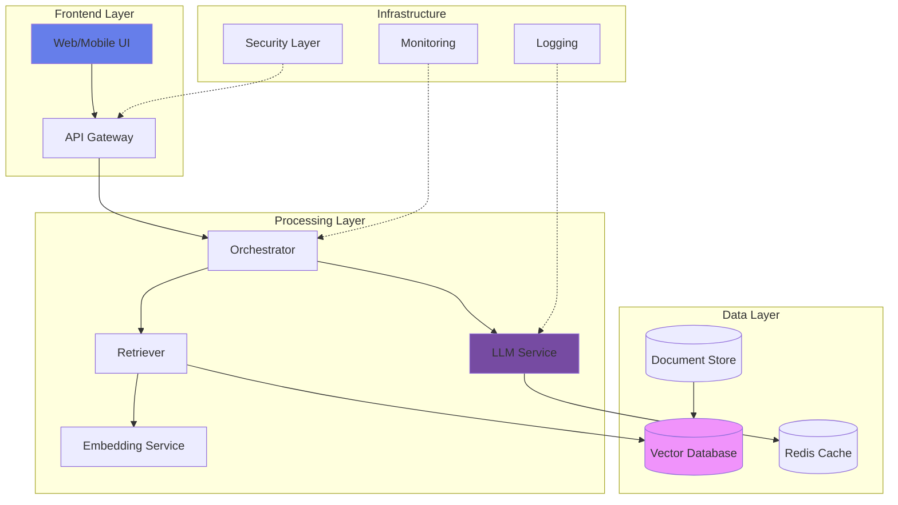
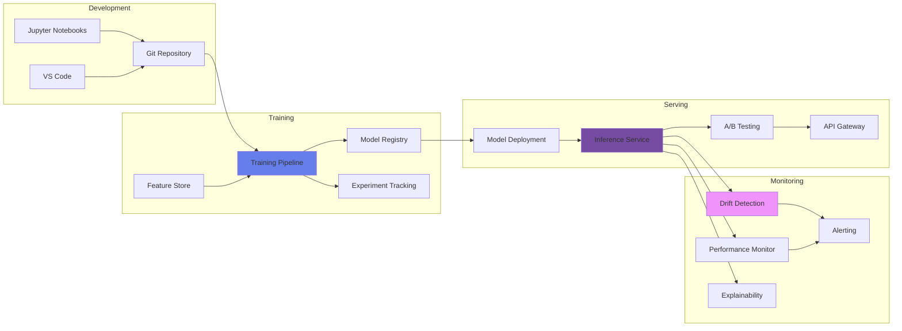
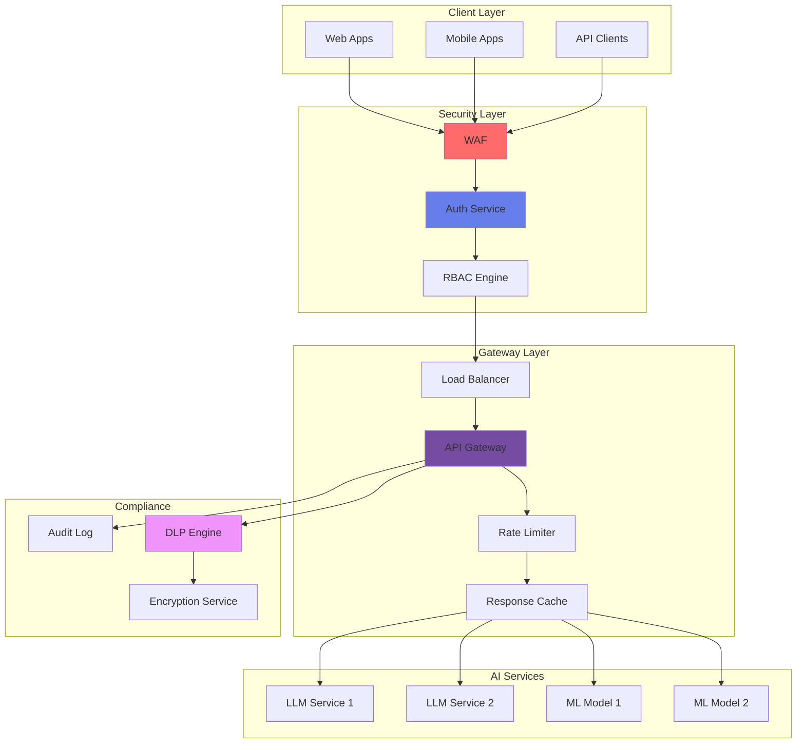
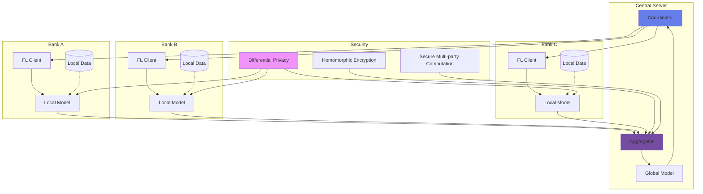
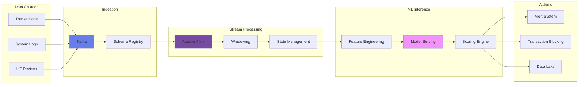

# 🏗️ Arquitecturas de Referencia para IA

## Patrones Arquitectónicos Probados para Soluciones de IA Empresarial

### 📐 Overview de Arquitecturas

Nuestras arquitecturas de referencia están diseñadas para acelerar la implementación de soluciones de IA, garantizando escalabilidad, seguridad y cumplimiento regulatorio en el sector bancario mexicano.

## 🎯 Arquitectura 1: RAG (Retrieval-Augmented Generation)

### Caso de Uso
Asistentes inteligentes que combinan conocimiento corporativo con capacidades generativas de LLMs.

### Diagrama de Arquitectura



### Componentes Clave

```yaml
components:
  vector_database:
    technology: Pinecone / Weaviate / Qdrant
    capacity: 10M+ embeddings
    dimensions: 1536 (OpenAI) / 768 (BERT)
    
  llm_service:
    primary: Azure OpenAI GPT-4
    fallback: Claude 3 / Llama 2
    context_window: 128k tokens
    
  embedding_model:
    text: text-embedding-ada-002
    multilingual: multilingual-e5-large
    domain_specific: FinBERT-custom
    
  orchestration:
    framework: LangChain / LlamaIndex
    memory: Conversation Buffer Memory
    agents: ReAct pattern
    
  caching:
    semantic: Redis with vector similarity
    response: 24hr TTL
    embedding: Persistent
```

### Implementación de Referencia

```python
class RAGArchitecture:
    def __init__(self):
        self.embedder = EmbeddingService()
        self.vector_store = VectorDatabase()
        self.llm = LLMService()
        self.reranker = CrossEncoderReranker()
        
    async def process_query(self, query: str, context: dict):
        # 1. Generate query embedding
        query_embedding = await self.embedder.embed(query)
        
        # 2. Retrieve relevant documents
        candidates = await self.vector_store.search(
            embedding=query_embedding,
            top_k=20,
            filters=context.get('filters', {})
        )
        
        # 3. Rerank for relevance
        reranked = self.reranker.rerank(
            query=query,
            documents=candidates,
            top_k=5
        )
        
        # 4. Generate response with context
        response = await self.llm.generate(
            prompt=self.build_prompt(query, reranked),
            temperature=0.7,
            max_tokens=1000
        )
        
        # 5. Post-process and validate
        return self.validate_response(response, context)
```

## 🤖 Arquitectura 2: MLOps Platform

### Caso de Uso
Plataforma end-to-end para desarrollo, despliegue y monitoreo de modelos ML.

### Diagrama de Arquitectura



### Stack Tecnológico

```yaml
mlops_stack:
  orchestration:
    primary: Kubeflow
    alternative: MLflow + Airflow
    
  feature_store:
    offline: Delta Lake / Hudi
    online: Redis / DynamoDB
    
  training:
    compute: Kubernetes + GPU nodes
    frameworks: TensorFlow, PyTorch, XGBoost
    distributed: Horovod / Ray
    
  model_registry:
    solution: MLflow Model Registry
    versioning: DVC
    metadata: Model cards
    
  serving:
    batch: Spark on K8s
    real_time: TorchServe / TensorFlow Serving
    edge: ONNX Runtime
    
  monitoring:
    metrics: Prometheus + Grafana
    logging: ELK Stack
    drift: Evidently AI
    explainability: SHAP / LIME
```

### Pipeline de Referencia

```python
class MLOpsPipeline:
    def __init__(self):
        self.feature_store = FeatureStore()
        self.trainer = ModelTrainer()
        self.registry = ModelRegistry()
        self.deployer = ModelDeployer()
        self.monitor = ModelMonitor()
    
    def run_training_pipeline(self, config):
        # 1. Feature engineering
        features = self.feature_store.get_training_dataset(
            entity='customer',
            features=config['features'],
            time_range=config['time_range']
        )
        
        # 2. Model training with experiment tracking
        with mlflow.start_run():
            model = self.trainer.train(
                features=features,
                algorithm=config['algorithm'],
                hyperparameters=config['hyperparameters']
            )
            
            # 3. Model validation
            metrics = self.trainer.validate(model, features.test)
            mlflow.log_metrics(metrics)
            
            # 4. Model registration if performance threshold met
            if metrics['auc'] > config['threshold']:
                model_uri = self.registry.register_model(
                    model=model,
                    name=config['model_name'],
                    tags={'environment': 'production'}
                )
                
                # 5. Automated deployment
                self.deployer.deploy(
                    model_uri=model_uri,
                    endpoint=config['endpoint'],
                    strategy='canary',
                    traffic_split=0.1
                )
        
        return model_uri
```

## 🔐 Arquitectura 3: Secure AI Gateway

### Caso de Uso
Gateway centralizado para acceso seguro a servicios de IA con control de acceso, rate limiting y auditoría.

### Diagrama de Arquitectura



### Configuración de Seguridad

```python
class SecureAIGateway:
    def __init__(self):
        self.auth = AuthenticationService()
        self.rbac = RBACEngine()
        self.rate_limiter = RateLimiter()
        self.dlp = DataLossPreventionEngine()
        self.audit = AuditLogger()
        
    async def process_request(self, request):
        # 1. Authentication
        token = await self.auth.validate_token(request.headers['Authorization'])
        if not token.valid:
            raise UnauthorizedException()
        
        # 2. Authorization
        permissions = self.rbac.check_permissions(
            user=token.user,
            resource=request.path,
            action=request.method
        )
        
        # 3. Rate limiting
        if not self.rate_limiter.check_limit(
            user=token.user,
            endpoint=request.path,
            window='1h'
        ):
            raise RateLimitException()
        
        # 4. DLP scanning
        if self.dlp.contains_sensitive_data(request.body):
            self.audit.log_security_event(
                event='DLP_VIOLATION',
                user=token.user,
                data=request.body
            )
            raise DLPViolationException()
        
        # 5. Process request
        response = await self.route_to_service(request)
        
        # 6. Response filtering
        filtered_response = self.dlp.filter_response(response)
        
        # 7. Audit logging
        self.audit.log_transaction(
            user=token.user,
            request=request,
            response=filtered_response,
            latency=self.calculate_latency()
        )
        
        return filtered_response
```

## 🌐 Arquitectura 4: Federated Learning

### Caso de Uso
Entrenamiento distribuido de modelos preservando la privacidad de datos entre múltiples entidades.

### Diagrama de Arquitectura



### Implementación Federada

```python
class FederatedLearningArchitecture:
    def __init__(self):
        self.coordinator = CentralCoordinator()
        self.aggregator = SecureAggregator()
        self.privacy = PrivacyEngine()
        
    def federated_training_round(self, global_model, clients):
        # 1. Distribute global model to clients
        encrypted_model = self.privacy.encrypt_model(global_model)
        
        client_updates = []
        for client in clients:
            # 2. Local training with differential privacy
            local_update = client.train_locally(
                model=encrypted_model,
                data=client.local_data,
                epsilon=1.0,  # Privacy budget
                delta=1e-5
            )
            
            # 3. Add noise for privacy
            noisy_update = self.privacy.add_gaussian_noise(
                update=local_update,
                sensitivity=self.calculate_sensitivity(),
                epsilon=0.5
            )
            
            client_updates.append(noisy_update)
        
        # 4. Secure aggregation
        aggregated_update = self.aggregator.secure_aggregate(
            updates=client_updates,
            aggregation_method='FedAvg',
            use_homomorphic_encryption=True
        )
        
        # 5. Update global model
        new_global_model = self.coordinator.update_global_model(
            current_model=global_model,
            aggregated_update=aggregated_update,
            learning_rate=0.01
        )
        
        return new_global_model
```

## 📊 Arquitectura 5: Real-Time Streaming AI

### Caso de Uso
Procesamiento de eventos en tiempo real con inferencia de ML para detección de fraude y anomalías.

### Diagrama de Arquitectura



### Pipeline de Streaming

```python
class StreamingAIPipeline:
    def __init__(self):
        self.kafka_consumer = KafkaConsumer()
        self.feature_engine = StreamingFeatureEngine()
        self.model_server = ModelServer()
        self.action_handler = ActionHandler()
        
    async def process_stream(self):
        async for event in self.kafka_consumer.consume():
            # 1. Parse and validate event
            parsed_event = self.parse_event(event)
            
            # 2. Real-time feature engineering
            features = await self.feature_engine.compute_features(
                event=parsed_event,
                window_size='5m',
                aggregations=['count', 'sum', 'avg', 'std']
            )
            
            # 3. Model inference
            prediction = await self.model_server.predict(
                features=features,
                model_version='latest',
                timeout_ms=100
            )
            
            # 4. Decision logic
            if prediction.fraud_probability > 0.85:
                await self.action_handler.block_transaction(
                    transaction_id=parsed_event.id
                )
                await self.action_handler.send_alert(
                    severity='HIGH',
                    message=f"Fraud detected: {prediction.fraud_probability}"
                )
            
            # 5. Store for batch analysis
            await self.store_prediction(
                event=parsed_event,
                features=features,
                prediction=prediction
            )
```

## 🔄 Patrones de Integración

### Event-Driven AI

```yaml
pattern: Event-Driven AI
use_cases:
  - Real-time fraud detection
  - Customer behavior tracking
  - Operational anomaly detection
  
components:
  event_bus: Apache Kafka / AWS Kinesis
  processing: Flink / Spark Streaming
  state_store: RocksDB / Redis
  
benefits:
  - Low latency (<100ms)
  - Horizontal scalability
  - Fault tolerance
  
considerations:
  - Exactly-once semantics
  - State management complexity
  - Schema evolution
```

### Microservices for AI

```yaml
pattern: AI Microservices
use_cases:
  - Multi-model serving
  - A/B testing
  - Gradual rollouts
  
components:
  orchestration: Kubernetes
  service_mesh: Istio
  api_gateway: Kong / Zuul
  
benefits:
  - Independent scaling
  - Technology diversity
  - Fault isolation
  
considerations:
  - Service discovery
  - Circuit breaking
  - Distributed tracing
```

## 📋 Checklist de Implementación

### Pre-Implementación
- [ ] Definir requisitos de negocio
- [ ] Evaluar volúmenes de datos
- [ ] Identificar integraciones necesarias
- [ ] Definir SLAs y KPIs
- [ ] Revisar compliance regulatorio

### Implementación
- [ ] Setup de infraestructura base
- [ ] Configuración de seguridad
- [ ] Implementación de pipelines
- [ ] Pruebas de integración
- [ ] Pruebas de carga y stress

### Post-Implementación
- [ ] Monitoreo continuo
- [ ] Optimización de performance
- [ ] Documentación actualizada
- [ ] Capacitación de equipos
- [ ] Plan de evolución

## 📚 Recursos Adicionales

### Documentación Técnica
- [Guía de Implementación MLOps](../documentacion-tecnica/mlops-guide.md)
- [Security Best Practices](arquitecturas-seguras.md)
- [API Standards](../../technical/api-documentation.md)

### Herramientas
- [Architecture Decision Records](https://nova-cell.banco.mx/tools/adr)
- [Cost Calculator](../../tools/roi-calculator.md)
- [Performance Benchmarks](https://nova-cell.banco.mx/benchmarks)

### Soporte
- **Architecture Team**: architecture@banco.mx
- **CoE Support**: coe-ia@banco.mx
- **Office Hours**: Martes y Jueves 15:00-17:00

---

**¿Necesitas ayuda con tu arquitectura de IA?**

[Solicitar Revisión Arquitectónica](mailto:architecture@banco.mx?subject=Architecture%20Review){.md-button .md-button--primary}
[Descargar Templates](https://nova-cell.banco.mx/templates/architectures){.md-button}

---

*Centro de Excelencia de IA - Arquitecturas probadas para IA empresarial*