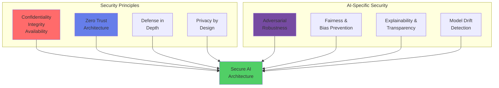
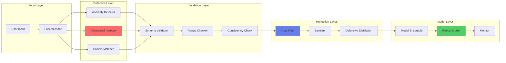
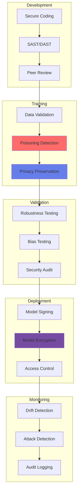

# 🔐 Arquitecturas Seguras para IA

## Implementación de Seguridad End-to-End en Soluciones de IA Bancaria

### 🛡️ Principios de Seguridad para IA



## 🏗️ Arquitectura Zero Trust para IA

### Componentes del Framework

```yaml
zero_trust_components:
  identity:
    authentication:
      - Multi-factor authentication (MFA)
      - Biometric verification
      - Certificate-based auth
    authorization:
      - Attribute-based access control (ABAC)
      - Just-in-time access
      - Principle of least privilege
      
  device:
    management:
      - Device registration and compliance
      - Endpoint detection and response (EDR)
      - Mobile device management (MDM)
    verification:
      - Device health attestation
      - Secure boot verification
      - TPM-based authentication
      
  network:
    segmentation:
      - Micro-segmentation
      - Software-defined perimeter (SDP)
      - Network isolation
    encryption:
      - TLS 1.3 everywhere
      - IPSec for backend
      - Certificate pinning
      
  application:
    security:
      - Runtime application self-protection (RASP)
      - Interactive application security testing (IAST)
      - Container security scanning
    api_security:
      - OAuth 2.0 + OIDC
      - API rate limiting
      - Schema validation
      
  data:
    protection:
      - Encryption at rest (AES-256)
      - Encryption in transit (TLS 1.3)
      - Encryption in use (homomorphic)
    governance:
      - Data classification
      - Data loss prevention (DLP)
      - Rights management
```

### Implementación de Referencia

```python
class ZeroTrustAIGateway:
    def __init__(self):
        self.identity_verifier = IdentityVerifier()
        self.device_validator = DeviceValidator()
        self.risk_scorer = RiskScorer()
        self.policy_engine = PolicyEngine()
        self.encryption_manager = EncryptionManager()
        
    async def authenticate_request(self, request):
        # 1. Verify identity with continuous authentication
        identity_score = await self.identity_verifier.verify(
            credentials=request.credentials,
            biometrics=request.biometric_data,
            behavior_pattern=request.session_behavior
        )
        
        # 2. Validate device trust
        device_score = await self.device_validator.validate(
            device_id=request.device_id,
            compliance_check=True,
            security_posture=request.device_health
        )
        
        # 3. Calculate risk score
        risk_score = self.risk_scorer.calculate(
            identity_score=identity_score,
            device_score=device_score,
            location=request.location,
            time_of_access=request.timestamp,
            resource_sensitivity=self.classify_resource(request.resource)
        )
        
        # 4. Apply dynamic policy
        access_decision = self.policy_engine.evaluate(
            risk_score=risk_score,
            requested_action=request.action,
            data_classification=request.data_classification
        )
        
        # 5. Encrypt sensitive data
        if access_decision.granted:
            encrypted_channel = await self.encryption_manager.establish_secure_channel(
                encryption_level=self.determine_encryption_level(risk_score)
            )
            
            return AccessGrant(
                token=self.generate_short_lived_token(access_decision),
                encrypted_channel=encrypted_channel,
                audit_id=self.log_access_decision(access_decision)
            )
        
        return AccessDenied(reason=access_decision.denial_reason)
```

## 🛡️ Defensa Contra Ataques Adversarios

### Arquitectura de Detección y Mitigación



### Técnicas de Robustez

```python
class AdversarialDefense:
    def __init__(self):
        self.detector = AdversarialDetector()
        self.transformer = DefensiveTransformer()
        self.ensemble = RobustEnsemble()
        
    def defend_against_attacks(self, input_data):
        # 1. Detect potential adversarial inputs
        detection_results = self.detector.detect(
            input_data=input_data,
            methods=['statistical', 'ml_based', 'gradient_based']
        )
        
        if detection_results.is_adversarial:
            # 2. Apply defensive transformations
            cleaned_input = self.transformer.apply(
                input_data=input_data,
                transformations=[
                    'gaussian_noise',
                    'jpeg_compression',
                    'bit_depth_reduction',
                    'spatial_smoothing'
                ]
            )
            
            # 3. Use robust ensemble
            predictions = []
            for model in self.ensemble.models:
                pred = model.predict(cleaned_input)
                predictions.append(pred)
            
            # 4. Certified robustness check
            certified_output = self.certify_prediction(
                predictions=predictions,
                epsilon=0.1  # Perturbation bound
            )
            
            return RobustPrediction(
                output=certified_output,
                confidence=self.calculate_robust_confidence(predictions),
                defense_applied=True
            )
        
        return self.ensemble.predict(input_data)
    
    def certify_prediction(self, predictions, epsilon):
        """Randomized smoothing for certified robustness"""
        base_prediction = np.mean(predictions, axis=0)
        noise_samples = []
        
        for _ in range(100):
            noisy_pred = self.add_calibrated_noise(base_prediction, epsilon)
            noise_samples.append(noisy_pred)
        
        # Return certified prediction with confidence bounds
        return {
            'prediction': np.median(noise_samples, axis=0),
            'lower_bound': np.percentile(noise_samples, 2.5, axis=0),
            'upper_bound': np.percentile(noise_samples, 97.5, axis=0),
            'certified_radius': epsilon
        }
```

## 🔒 Privacidad Diferencial en IA

### Arquitectura de Privacidad

```python
class DifferentialPrivacyArchitecture:
    def __init__(self, epsilon=1.0, delta=1e-5):
        self.epsilon = epsilon  # Privacy budget
        self.delta = delta      # Probability of privacy breach
        self.accountant = PrivacyAccountant()
        
    def private_training(self, dataset, model):
        # 1. Add noise to gradients (DP-SGD)
        optimizer = DPSGD(
            l2_norm_clip=1.0,
            noise_multiplier=self.calculate_noise_multiplier(),
            num_microbatches=32
        )
        
        # 2. Private aggregation
        for epoch in range(num_epochs):
            for batch in dataset:
                # Clip gradients
                clipped_grads = self.clip_gradients(
                    model.compute_gradients(batch),
                    max_norm=1.0
                )
                
                # Add calibrated noise
                noisy_grads = self.add_gaussian_noise(
                    clipped_grads,
                    std=self.noise_multiplier * self.l2_norm_clip
                )
                
                # Update model
                optimizer.apply_gradients(noisy_grads)
                
                # Track privacy budget
                self.accountant.update(
                    noise_multiplier=self.noise_multiplier,
                    sampling_rate=batch_size/len(dataset)
                )
                
                if self.accountant.get_epsilon() > self.epsilon:
                    return self.finalize_model(model)
        
        return model
    
    def private_inference(self, model, query):
        # Add noise to predictions for query privacy
        raw_prediction = model.predict(query)
        
        # Laplace mechanism for numeric outputs
        if isinstance(raw_prediction, float):
            sensitivity = self.compute_sensitivity(model, query)
            noise = np.random.laplace(0, sensitivity/self.epsilon)
            return raw_prediction + noise
        
        # Exponential mechanism for categorical outputs
        else:
            scores = model.get_class_scores(query)
            probabilities = self.exponential_mechanism(
                scores=scores,
                epsilon=self.epsilon
            )
            return np.random.choice(len(scores), p=probabilities)
```

## 🔐 Seguridad en el Ciclo de Vida del Modelo

### Pipeline Seguro de MLOps



### Implementación de Seguridad MLOps

```python
class SecureMLOpsPipeline:
    def __init__(self):
        self.security_scanner = SecurityScanner()
        self.crypto_manager = CryptoManager()
        self.integrity_checker = IntegrityChecker()
        
    def secure_model_deployment(self, model, deployment_config):
        # 1. Security scanning
        vulnerabilities = self.security_scanner.scan(
            model=model,
            checks=['code_injection', 'model_extraction', 'data_leakage']
        )
        
        if vulnerabilities.critical:
            raise SecurityException("Critical vulnerabilities found")
        
        # 2. Model signing and encryption
        signed_model = self.crypto_manager.sign_model(
            model=model,
            private_key=self.get_signing_key(),
            algorithm='RSA-PSS'
        )
        
        encrypted_model = self.crypto_manager.encrypt_model(
            model=signed_model,
            encryption_key=self.generate_encryption_key(),
            algorithm='AES-256-GCM'
        )
        
        # 3. Secure deployment
        deployment_manifest = {
            'model': encrypted_model,
            'signature': signed_model.signature,
            'access_policy': self.create_access_policy(deployment_config),
            'security_controls': {
                'rate_limiting': {'requests_per_minute': 100},
                'input_validation': {'schema': model.input_schema},
                'output_filtering': {'pii_removal': True},
                'monitoring': {'anomaly_detection': True}
            }
        }
        
        # 4. Deploy with security controls
        deployment_result = self.deploy_with_controls(deployment_manifest)
        
        # 5. Continuous security monitoring
        self.setup_monitoring(
            deployment_id=deployment_result.id,
            alerts=['drift', 'attack', 'performance']
        )
        
        return deployment_result
```

## 📊 Monitoreo de Seguridad en Tiempo Real

### Dashboard de Seguridad

```python
class SecurityMonitoringDashboard:
    def __init__(self):
        self.metrics = {
            'authentication': AuthenticationMetrics(),
            'attacks': AttackDetectionMetrics(),
            'privacy': PrivacyMetrics(),
            'compliance': ComplianceMetrics()
        }
        
    def real_time_monitoring(self):
        dashboard_data = {
            'security_score': self.calculate_security_score(),
            'active_threats': self.detect_active_threats(),
            'compliance_status': self.check_compliance(),
            'privacy_violations': self.detect_privacy_issues()
        }
        
        # Real-time alerting
        if dashboard_data['security_score'] < 0.7:
            self.trigger_alert('LOW_SECURITY_SCORE', dashboard_data)
        
        if dashboard_data['active_threats']:
            self.trigger_incident_response(dashboard_data['active_threats'])
        
        return dashboard_data
    
    def detect_active_threats(self):
        threats = []
        
        # Model extraction attempts
        if self.metrics['attacks'].extraction_attempts > threshold:
            threats.append({
                'type': 'MODEL_EXTRACTION',
                'severity': 'HIGH',
                'count': self.metrics['attacks'].extraction_attempts
            })
        
        # Data poisoning detection
        if self.metrics['attacks'].poisoning_score > 0.3:
            threats.append({
                'type': 'DATA_POISONING',
                'severity': 'CRITICAL',
                'score': self.metrics['attacks'].poisoning_score
            })
        
        # Adversarial attacks
        if self.metrics['attacks'].adversarial_rate > 0.05:
            threats.append({
                'type': 'ADVERSARIAL_ATTACK',
                'severity': 'MEDIUM',
                'rate': self.metrics['attacks'].adversarial_rate
            })
        
        return threats
```

## 🚨 Respuesta a Incidentes de Seguridad IA

### Playbook de Respuesta

```yaml
incident_response_playbook:
  detection:
    - Automated threat detection
    - Security event correlation
    - Anomaly identification
    
  containment:
    immediate:
      - Isolate affected model
      - Block malicious requests
      - Enable fallback system
    short_term:
      - Patch vulnerabilities
      - Update security rules
      - Increase monitoring
      
  eradication:
    - Remove malicious artifacts
    - Clean poisoned data
    - Retrain affected models
    
  recovery:
    - Restore from secure backup
    - Gradual service restoration
    - Validation testing
    
  lessons_learned:
    - Root cause analysis
    - Update security policies
    - Improve detection capabilities
```

## 🔍 Auditoría y Compliance

### Framework de Auditoría

```python
class AISecurityAudit:
    def __init__(self):
        self.audit_checks = {
            'access_control': AccessControlAuditor(),
            'data_protection': DataProtectionAuditor(),
            'model_integrity': ModelIntegrityAuditor(),
            'compliance': ComplianceAuditor()
        }
        
    def comprehensive_audit(self, ai_system):
        audit_report = {
            'timestamp': datetime.now(),
            'system': ai_system.name,
            'findings': []
        }
        
        # Access control audit
        access_findings = self.audit_checks['access_control'].audit(
            policies=ai_system.access_policies,
            logs=ai_system.access_logs,
            users=ai_system.user_registry
        )
        
        # Data protection audit
        data_findings = self.audit_checks['data_protection'].audit(
            encryption_status=ai_system.encryption_config,
            pii_handling=ai_system.pii_processes,
            retention_policies=ai_system.data_retention
        )
        
        # Model integrity audit
        model_findings = self.audit_checks['model_integrity'].audit(
            model_signatures=ai_system.model_signatures,
            version_control=ai_system.model_versions,
            validation_results=ai_system.validation_logs
        )
        
        # Compliance audit
        compliance_findings = self.audit_checks['compliance'].audit(
            regulations=['GDPR', 'CCPA', 'LFPDPPP'],
            policies=ai_system.compliance_policies,
            evidence=ai_system.compliance_evidence
        )
        
        audit_report['findings'] = {
            'access_control': access_findings,
            'data_protection': data_findings,
            'model_integrity': model_findings,
            'compliance': compliance_findings
        }
        
        audit_report['risk_score'] = self.calculate_risk_score(audit_report)
        audit_report['recommendations'] = self.generate_recommendations(audit_report)
        
        return audit_report
```

## 📋 Checklist de Seguridad para IA

### Pre-Deployment
- [ ] Análisis de amenazas y modelado de riesgos
- [ ] Revisión de código y dependencias
- [ ] Pruebas de penetración
- [ ] Validación de robustez adversaria
- [ ] Auditoría de privacidad
- [ ] Evaluación de sesgo y fairness

### Deployment
- [ ] Cifrado de modelos y datos
- [ ] Configuración de access control
- [ ] Implementación de rate limiting
- [ ] Setup de monitoreo de seguridad
- [ ] Configuración de backup y recovery
- [ ] Documentación de seguridad

### Post-Deployment
- [ ] Monitoreo continuo de amenazas
- [ ] Detección de drift y anomalías
- [ ] Auditorías periódicas
- [ ] Actualizaciones de seguridad
- [ ] Ejercicios de respuesta a incidentes
- [ ] Revisión de logs y métricas

## 📚 Recursos y Referencias

### Documentación
- [OWASP Top 10 for LLM Applications](https://owasp.org/www-project-top-10-for-large-language-model-applications/)
- [NIST AI Risk Management Framework](https://www.nist.gov/itl/ai-risk-management-framework)
- [ISO/IEC 23053 - AI Trustworthiness](https://www.iso.org/standard/74438.html)

### Herramientas
- [AI Security Scanner](https://nova-cell.banco.mx/tools/security-scanner)
- [Adversarial Robustness Toolkit](https://github.com/Trusted-AI/adversarial-robustness-toolbox)
- [Privacy Meter](https://github.com/privacytrustlab/ml_privacy_meter)

### Contacto
- **Security Team**: security-ai@banco.mx
- **Incident Response**: soc@banco.mx (24/7)
- **CoE Support**: coe-ia@banco.mx

---

**¿Necesitas una evaluación de seguridad para tu proyecto de IA?**

[Solicitar Security Assessment](mailto:security-ai@banco.mx?subject=AI%20Security%20Assessment){.md-button .md-button--primary}
[Reportar Incidente](https://security.banco.mx/incident){.md-button}

---

*Centro de Excelencia de IA - Seguridad sin compromisos para IA empresarial*