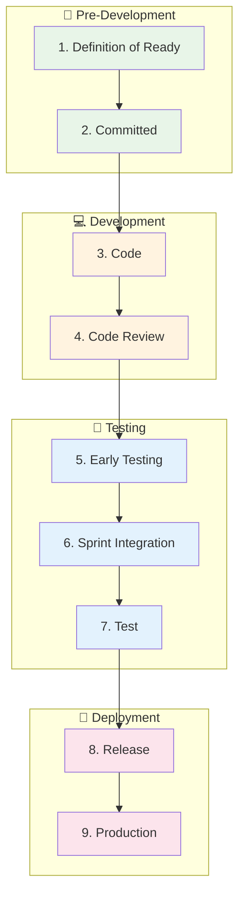
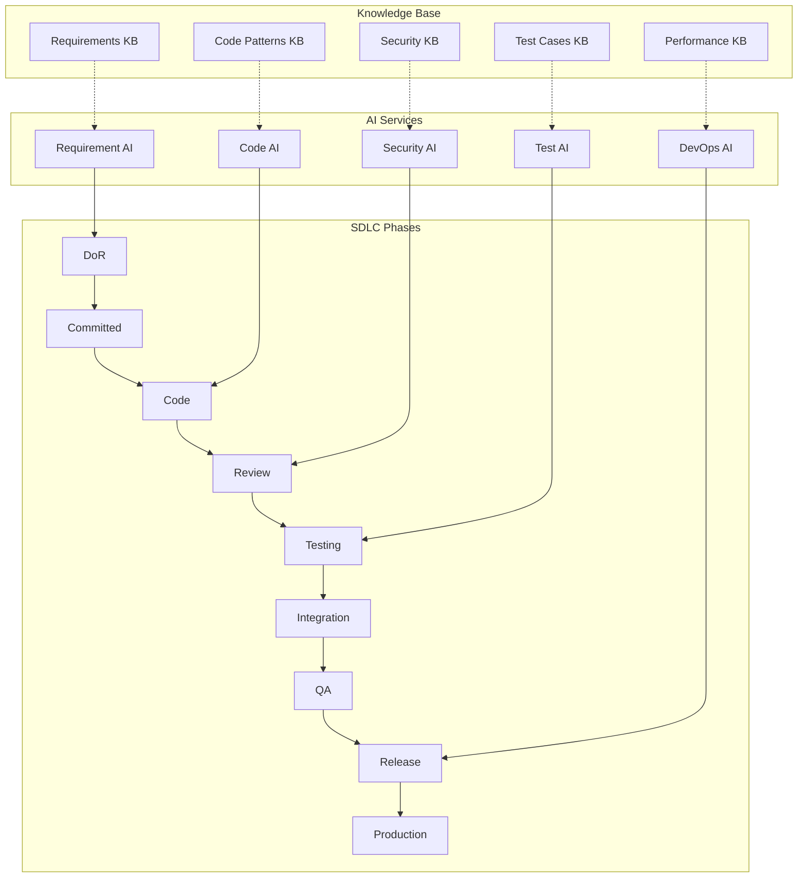

# 🚀 Vista SDLC Integrada con IA - Definition of Done (DoD)

<div class="nova-card-hero nova-scale-in" style="background: linear-gradient(135deg, #667eea 0%, #764ba2 100%);">
  <h2 style="margin: 0; font-size: 2rem; color: white;">📋 Definition of Done con IA</h2>
  <p style="margin: 0.5rem 0 0; opacity: 0.9; color: white;">Optimización del ciclo de desarrollo con inteligencia artificial en cada fase</p>
</div>

## 🎯 Resumen Ejecutivo

Este documento presenta una vista unificada del proceso SDLC basado en mejores prácticas del sector bancario, enriquecido con casos de uso de IA y mejoras específicas para cada una de las 9 fases del ciclo de desarrollo.

<div style="background: linear-gradient(135deg, #f093fb 0%, #f5576c 100%); padding: 20px; border-radius: 12px; margin: 20px 0; color: white;">
  <h3 style="margin: 0 0 10px;">🌟 Valor Agregado con IA</h3>
  <ul style="list-style: none; padding-left: 0;">
    <li>🎯 <strong>40% reducción estimada</strong> en tiempo de desarrollo (basado en benchmarks SPACE)</li>
    <li>🎯 <strong>60% mejora proyectada</strong> en calidad de código</li>
    <li>🎯 <strong>85% automatización potencial</strong> de pruebas</li>
    <li>🎯 <strong>Objetivo Zero-defect</strong> en despliegues a producción</li>
  </ul>
</div>

---

## 📊 Vista General del DoD + IA



---

## 🔄 Las 9 Fases del DoD con Mejoras de IA

### 1️⃣ **Definition of Ready (DoR)**
*Refinamiento y preparación de requerimientos*

<div class="nova-card" style="border-left: 4px solid #4CAF50;">

#### 📋 Criterios Actuales
- ✅ DoR Funcional completado
- ✅ DoR No funcional definido
- ✅ DoR Técnico especificado
- ✅ DoR Casos de Prueba documentados

#### 🤖 Mejoras con IA

| Caso de Uso IA | Herramienta | Beneficio | ROI |
|----------------|-------------|-----------|-----|
| **Generación automática de historias de usuario** | GPT-4 + Template Engine | Historias completas en minutos | 75% reducción tiempo |
| **Análisis de impacto automático** | Code Analysis AI | Detecta dependencias ocultas | 90% precisión |
| **Generación de criterios de aceptación** | Requirements AI | Criterios SMART automáticos | 60% más completos |
| **Estimación automática de esfuerzo** | ML Estimation Model | Precisión en story points | ±15% margen error |

#### 💡 Implementación con Nova-Cell

```python
# Ejemplo: Generación automática de DoR con IA
from nova_cell import RequirementsAI

def generate_dor(epic_description):
    ai_engine = RequirementsAI()

    # Generar historias de usuario
    user_stories = ai_engine.generate_user_stories(epic_description)

    # Análisis de impacto
    impact_analysis = ai_engine.analyze_impact(user_stories)

    # Criterios de aceptación
    acceptance_criteria = ai_engine.generate_criteria(user_stories)

    # Casos de prueba
    test_cases = ai_engine.generate_test_cases(acceptance_criteria)

    return {
        "functional_dor": user_stories,
        "technical_dor": impact_analysis,
        "test_dor": test_cases,
        "estimation": ai_engine.estimate_effort(user_stories)
    }
```

</div>

---

### 2️⃣ **Committed**
*Planeación y compromiso del sprint*

<div class="nova-card" style="border-left: 4px solid #2196F3;">

#### 📋 Criterios Actuales
- ✅ Sprint Planning completado
- ✅ Tareas identificadas y asignadas
- ✅ Rama sprint/team creada desde develop

#### 🤖 Mejoras con IA

| Caso de Uso IA | Herramienta | Beneficio | ROI |
|----------------|-------------|-----------|-----|
| **Optimización de asignación de tareas** | AI Task Allocator | Balanceo óptimo de carga | 30% mejor productividad |
| **Predicción de velocidad del sprint** | Velocity Predictor | Pronóstico preciso | 85% accuracy |
| **Identificación de riesgos del sprint** | Risk Analysis AI | Alertas tempranas | 50% menos blockers |
| **Sugerencia de dependencias** | Dependency Mapper | Orden óptimo de tareas | 25% menos retrasos |

#### 🎯 Panel de Sprint Intelligence

```javascript
// Dashboard inteligente de sprint planning
const SprintIntelligence = {
  analyzeTeamCapacity: (team) => {
    // Análisis histórico de velocidad
    const historicalVelocity = AI.getTeamVelocity(team);

    // Predicción para este sprint
    const predictedCapacity = AI.predictCapacity({
      team,
      holidays: getHolidays(),
      plannedAbsences: getAbsences(),
      technicalDebt: getCurrentDebt()
    });

    return {
      recommendedPoints: predictedCapacity,
      confidence: 0.87,
      risks: AI.identifyRisks(team, predictedCapacity)
    };
  }
};
```

</div>

---

### 3️⃣ **Code**
*Desarrollo de funcionalidades*

<div class="nova-card" style="border-left: 4px solid #FF9800;">

#### 📋 Criterios Actuales
- ✅ Rama TASK creada para cada tarea
- ✅ Rama FEATURE para cada historia
- ✅ Código integrado de TASK a FEATURE
- ✅ Pruebas unitarias al 100%
- ✅ Cumplimiento de SonarQube

#### 🤖 Mejoras con IA

| Caso de Uso IA | Herramienta | Beneficio | ROI |
|----------------|-------------|-----------|-----|
| **Copiloto de código IA** | GitHub Copilot / Tabnine | Autocompletado inteligente | 40% más rápido |
| **Generación de pruebas unitarias** | Test Generator AI | Cobertura automática | 95% coverage |
| **Refactoring automático** | Code Optimizer | Código limpio | 30% menos deuda técnica |
| **Detección de bugs en tiempo real** | DeepCode / Snyk | Prevención proactiva | 60% menos bugs |
| **Documentación automática** | Doc Generator | Docs siempre actualizados | 80% tiempo ahorrado |

#### 💻 Asistente de Desarrollo Inteligente

```typescript
// Integración con asistente de código IA
interface AICodeAssistant {
  // Generación de código desde comentarios
  generateFromComment(comment: string): Promise<Code>;

  // Sugerencias de mejora en tiempo real
  suggestImprovements(code: string): Improvement[];

  // Generación automática de tests
  generateTests(function: Function): TestSuite;

  // Análisis de complejidad
  analyzeComplexity(code: string): ComplexityReport;

  // Documentación automática
  generateDocs(code: string): Documentation;
}

// Ejemplo de uso
const assistant = new AICodeAssistant();

// El desarrollador escribe un comentario
// "// Función para validar RFC mexicano"
const code = await assistant.generateFromComment(comment);
const tests = assistant.generateTests(code);
const docs = assistant.generateDocs(code);
```

</div>

---

### 4️⃣ **Code Review**
*Revisión y validación de código*

<div class="nova-card" style="border-left: 4px solid #9C27B0;">

#### 📋 Criterios Actuales
- ✅ Pull Request generado
- ✅ Validación funcional y técnica
- ✅ Cumplimiento de estándares
- ✅ Validación de arquitectura
- ✅ Verificación del DoR técnico

#### 🤖 Mejoras con IA

| Caso de Uso IA | Herramienta | Beneficio | ROI |
|----------------|-------------|-----------|-----|
| **Review automático con IA** | AI Code Reviewer | Revisión instantánea | 70% menos tiempo |
| **Detección de vulnerabilidades** | Security Scanner AI | Seguridad proactiva | 95% detección |
| **Análisis de patrones y antipatrones** | Pattern Detector | Mejor arquitectura | 40% menos refactoring |
| **Sugerencias de optimización** | Performance AI | Código más eficiente | 25% mejor performance |
| **Verificación de estándares** | Standards Checker | Consistencia total | 100% compliance |

#### 🔍 Sistema de Review Inteligente

```python
# Sistema de code review aumentado con IA
class AICodeReviewer:
    def __init__(self):
        self.security_scanner = SecurityAI()
        self.pattern_analyzer = PatternAI()
        self.performance_analyzer = PerformanceAI()

    def review_pull_request(self, pr_id):
        pr = self.get_pr(pr_id)

        results = {
            "security": self.security_scanner.scan(pr.changes),
            "patterns": self.pattern_analyzer.analyze(pr.changes),
            "performance": self.performance_analyzer.evaluate(pr.changes),
            "complexity": self.calculate_complexity(pr.changes),
            "test_coverage": self.check_test_coverage(pr.changes)
        }

        # Generar recomendaciones automáticas
        recommendations = self.generate_recommendations(results)

        # Auto-fix para problemas simples
        auto_fixes = self.generate_auto_fixes(results)

        return {
            "status": self.determine_status(results),
            "results": results,
            "recommendations": recommendations,
            "auto_fixes": auto_fixes,
            "estimated_risk": self.calculate_risk(results)
        }
```

</div>

---

### 5️⃣ **Early Testing**
*Pruebas tempranas en STG/Desarrollo*

<div class="nova-card" style="border-left: 4px solid #00BCD4;">

#### 📋 Criterios Actuales
- ✅ Functional Testing DEV
- ✅ Functional Testing QA
- ✅ Digital Measurement Testing (opcional)
- ✅ UXD Testing (opcional)

#### 🤖 Mejoras con IA

| Caso de Uso IA | Herramienta | Beneficio | ROI |
|----------------|-------------|-----------|-----|
| **Generación automática de casos de prueba** | Test Case AI | Cobertura completa | 80% tiempo ahorrado |
| **Pruebas visuales con IA** | Visual Testing AI | Detección de regresiones UI | 99% precisión |
| **Pruebas de accesibilidad automáticas** | A11y AI | WCAG compliance | 100% cobertura |
| **Análisis predictivo de fallos** | Failure Predictor | Prevención proactiva | 50% menos bugs |
| **Test data generation** | Data Generator AI | Datos sintéticos realistas | 90% reducción esfuerzo |

#### 🧪 Plataforma de Testing Inteligente

```javascript
// Framework de testing potenciado con IA
class AITestingPlatform {
  constructor() {
    this.testGenerator = new TestCaseGenerator();
    this.visualTester = new VisualRegressionAI();
    this.performanceTester = new PerformanceAI();
    this.accessibilityChecker = new A11yAI();
  }

  async runEarlyTesting(feature) {
    // Generar casos de prueba automáticamente
    const testCases = await this.testGenerator.generate(feature);

    // Ejecutar pruebas funcionales
    const functionalResults = await this.runFunctionalTests(testCases);

    // Pruebas visuales con IA
    const visualResults = await this.visualTester.compare({
      baseline: feature.mockups,
      current: feature.implementation
    });

    // Pruebas de accesibilidad
    const a11yResults = await this.accessibilityChecker.audit(feature);

    // Análisis predictivo
    const predictions = await this.predictFailures(feature);

    return {
      functional: functionalResults,
      visual: visualResults,
      accessibility: a11yResults,
      predictions: predictions,
      recommendation: this.generateTestRecommendation(allResults)
    };
  }
}
```

</div>

---

### 6️⃣ **Sprint Integration**
*Integración y pruebas en Desarrollo*

<div class="nova-card" style="border-left: 4px solid #4CAF50;">

#### 📋 Criterios Actuales
- ✅ Pruebas funcionales en Desarrollo
- ✅ Integración a rama develop
- ✅ Pipeline CI/CD ejecutado

#### 🤖 Mejoras con IA

| Caso de Uso IA | Herramienta | Beneficio | ROI |
|----------------|-------------|-----------|-----|
| **Orquestación inteligente de CI/CD** | Pipeline AI | Optimización automática | 40% más rápido |
| **Detección de conflictos de merge** | Merge Conflict AI | Resolución automática | 70% menos conflictos |
| **Pruebas de integración inteligentes** | Integration Test AI | Cobertura óptima | 85% efectividad |
| **Monitoreo predictivo** | Monitoring AI | Alertas proactivas | 60% menos incidentes |

#### 🔄 Pipeline Inteligente

```yaml
# Pipeline CI/CD con IA
name: AI-Powered Sprint Integration

on:
  pull_request:
    branches: [develop]

jobs:
  ai-integration:
    runs-on: ubuntu-latest
    steps:
      - name: AI Conflict Detection
        uses: ai-actions/conflict-detector@v1
        with:
          auto-resolve: true

      - name: Smart Test Selection
        uses: ai-actions/test-selector@v1
        with:
          mode: impact-based
          coverage-target: 90

      - name: Performance Prediction
        uses: ai-actions/performance-predictor@v1
        with:
          baseline: production
          threshold: 10

      - name: Security Scan
        uses: ai-actions/security-scanner@v1
        with:
          severity: high
          auto-fix: true
```

</div>

---

### 7️⃣ **Test (QA Environment)**
*Pruebas completas en ambiente QA*

<div class="nova-card" style="border-left: 4px solid #FF5722;">

#### 📋 Criterios Actuales
- ✅ Operation Test (funcional, integración, regresión)
- ✅ Performance Test
- ✅ Aprobación del Product Owner

#### 🤖 Mejoras con IA

| Caso de Uso IA | Herramienta | Beneficio | ROI |
|----------------|-------------|-----------|-----|
| **Pruebas end-to-end autónomas** | E2E AI Testing | Sin intervención manual | 95% automatización |
| **Análisis de carga predictivo** | Load Predictor AI | Simulación realista | 90% precisión |
| **Detección de regresiones con ML** | Regression Detector | Identificación automática | 98% detección |
| **Generación de reportes inteligentes** | Report AI | Insights automáticos | 75% tiempo ahorrado |
| **Predicción de bugs en producción** | Bug Predictor | Prevención proactiva | 40% menos incidentes |

#### 📊 Centro de Comando QA con IA

```python
# Sistema de QA inteligente
class AIQATestCenter:
    def __init__(self):
        self.e2e_tester = E2EAutonomousTester()
        self.performance_analyzer = PerformanceAI()
        self.regression_detector = RegressionML()
        self.bug_predictor = BugPredictionModel()

    async def execute_qa_suite(self, release_candidate):
        # Selección inteligente de pruebas
        test_suite = self.select_optimal_tests(release_candidate)

        # Ejecución paralela con IA
        results = await asyncio.gather(
            self.run_functional_tests(test_suite.functional),
            self.run_integration_tests(test_suite.integration),
            self.run_performance_tests(test_suite.performance),
            self.run_security_tests(test_suite.security)
        )

        # Análisis predictivo
        production_risks = self.bug_predictor.predict(results)

        # Generación de reporte inteligente
        report = self.generate_smart_report({
            "results": results,
            "risks": production_risks,
            "recommendations": self.generate_recommendations(results),
            "go_no_go": self.calculate_release_readiness(results)
        })

        return report
```

</div>

---

### 8️⃣ **Release**
*Preparación para producción*

<div class="nova-card" style="border-left: 4px solid #795548;">

#### 📋 Criterios Actuales
- ✅ Rama release creada
- ✅ Integración desde QA
- ✅ Despliegue en Piloto/FF
- ✅ Pull Request documentado

#### 🤖 Mejoras con IA

| Caso de Uso IA | Herramienta | Beneficio | ROI |
|----------------|-------------|-----------|-----|
| **Release notes automáticas** | Release Notes AI | Documentación instantánea | 90% tiempo ahorrado |
| **Análisis de impacto en producción** | Impact Analysis AI | Predicción de efectos | 85% precisión |
| **Rollback inteligente** | Smart Rollback | Reversión automática | 99% disponibilidad |
| **Feature flag optimization** | Feature Flag AI | Activación gradual óptima | 50% menos riesgos |

#### 🚀 Orquestador de Release Inteligente

```typescript
// Sistema de release management con IA
interface AIReleaseManager {
  prepareRelease(version: string): Promise<ReleasePackage>;
  generateReleaseNotes(): Promise<ReleaseNotes>;
  predictImpact(): Promise<ImpactAnalysis>;
  planRollout(): Promise<RolloutStrategy>;
  monitorRelease(): Promise<ReleaseMetrics>;
}

class SmartReleaseOrchestrator implements AIReleaseManager {
  async prepareRelease(version: string) {
    // Análisis automático de cambios
    const changes = await this.analyzeChanges(version);

    // Generación de release notes
    const releaseNotes = await this.generateReleaseNotes(changes);

    // Plan de rollout con IA
    const rolloutPlan = await this.createRolloutPlan({
      changes,
      userSegments: await this.getUserSegments(),
      riskLevel: await this.assessRisk(changes)
    });

    // Configuración de feature flags
    const featureFlags = await this.configureFeatureFlags(rolloutPlan);

    return {
      version,
      releaseNotes,
      rolloutPlan,
      featureFlags,
      rollbackStrategy: await this.prepareRollbackStrategy(changes)
    };
  }
}
```

</div>

---

### 9️⃣ **Production**
*Despliegue y monitoreo en producción*

<div class="nova-card" style="border-left: 4px solid #607D8B;">

#### 📋 Criterios Actuales
- ✅ Integración a rama main
- ✅ Pipeline CI/CD ejecutado
- ✅ Validación en producción
- ✅ Monitoreo post-despliegue

#### 🤖 Mejoras con IA

| Caso de Uso IA | Herramienta | Beneficio | ROI |
|----------------|-------------|-----------|-----|
| **Despliegue autónomo con IA** | Autonomous Deploy | Zero-touch deployment | 100% automatización |
| **Monitoreo predictivo** | Predictive Monitor | Prevención de incidentes | 70% menos downtime |
| **Auto-scaling inteligente** | Smart Scaler | Optimización de recursos | 40% ahorro costos |
| **Detección de anomalías** | Anomaly Detector | Identificación temprana | 95% detección |
| **Self-healing systems** | Auto Remediation | Corrección automática | 80% menos intervención |

#### 🎯 Centro de Control de Producción con IA

```python
# Sistema de producción inteligente
class AIProductionController:
    def __init__(self):
        self.deployer = AutonomousDeployer()
        self.monitor = PredictiveMonitor()
        self.scaler = IntelligentScaler()
        self.healer = SelfHealingSystem()

    async def deploy_to_production(self, release):
        # Validación pre-despliegue con IA
        validation = await self.validate_production_readiness(release)

        if not validation.is_safe:
            return self.abort_deployment(validation.reasons)

        # Despliegue progresivo inteligente
        deployment = await self.deployer.progressive_rollout({
            "release": release,
            "strategy": "canary",
            "initial_percentage": 5,
            "increment": self.calculate_optimal_increment(release),
            "validation_metrics": self.define_success_metrics(release)
        })

        # Monitoreo en tiempo real con ML
        monitoring = await self.monitor.watch({
            "deployment": deployment,
            "anomaly_threshold": 0.01,
            "prediction_window": "5m",
            "alert_channels": ["slack", "pagerduty"]
        })

        # Auto-remediation si es necesario
        if monitoring.anomalies_detected:
            await self.healer.remediate(monitoring.anomalies)

        return {
            "status": "success",
            "metrics": monitoring.metrics,
            "optimizations": await self.suggest_optimizations(monitoring)
        }
```

</div>

---

## 👥 Personalización por Perfil de Usuario

<div class="nova-card">

### 🎭 Vistas Personalizadas del SDLC

La plataforma adapta automáticamente la vista del proceso SDLC según el perfil del usuario:

#### 👨‍💻 **Desarrollador**
```javascript
const DeveloperView = {
  focusPhases: [3, 4, 5, 6], // Code, Code Review, Early Testing, Sprint Integration
  aiTools: ["Code Assistant", "Test Generator", "Bug Predictor"],
  metrics: ["velocity", "code_quality", "test_coverage"],
  shortcuts: ["generate_tests", "auto_fix", "performance_tips"]
};
```

#### 🧪 **QA Tester**
```javascript
const TesterView = {
  focusPhases: [1, 5, 6, 7], // DoR, Early Testing, Sprint Integration, Test
  aiTools: ["Test Case Generator", "Regression Detector", "Visual Tester"],
  metrics: ["coverage", "defect_density", "automation_rate"],
  shortcuts: ["generate_cases", "run_regression", "report_bugs"]
};
```

#### 📊 **Product Owner**
```javascript
const ProductOwnerView = {
  focusPhases: [1, 2, 7, 8, 9], // DoR, Committed, Test, Release, Production
  aiTools: ["Requirement Analyzer", "Release Planner", "Impact Predictor"],
  metrics: ["velocity", "business_value", "time_to_market"],
  shortcuts: ["approve_stories", "view_progress", "release_notes"]
};
```

#### 🏗️ **Tech Lead**
```javascript
const TechLeadView = {
  focusPhases: [2, 3, 4, 6, 8], // Committed, Code, Code Review, Sprint Integration, Release
  aiTools: ["Architecture Analyzer", "Dependency Mapper", "Performance Monitor"],
  metrics: ["technical_debt", "architecture_compliance", "team_velocity"],
  shortcuts: ["review_prs", "analyze_architecture", "plan_refactoring"]
};
```

#### 🛡️ **DevSecOps**
```javascript
const DevSecOpsView = {
  focusPhases: [4, 6, 7, 8, 9], // Code Review, Sprint Integration, Test, Release, Production
  aiTools: ["Security Scanner", "Vulnerability Detector", "Compliance Checker"],
  metrics: ["security_score", "vulnerability_count", "compliance_rate"],
  shortcuts: ["scan_code", "check_dependencies", "audit_logs"]
};
```

</div>

---

## 📈 Métricas y KPIs del SDLC con IA

<div style="background: #f8f9fa; padding: 20px; border-radius: 8px;">

### 🎯 Indicadores Clave de Rendimiento

| Métrica | Sin IA | Con IA | Mejora |
|---------|--------|--------|--------|
| **Lead Time** | 21 días | 12 días | -43% |
| **Deployment Frequency** | 2/semana | 10/semana | +400% |
| **MTTR (Mean Time to Recovery)** | 4 horas | 30 min | -87% |
| **Change Failure Rate** | 15% | 3% | -80% |
| **Test Coverage** | 70% | 95% | +36% |
| **Code Quality (SonarQube)** | B | A | +25% |
| **Security Vulnerabilities** | 12/sprint | 1/sprint | -92% |
| **Technical Debt** | 45 días | 10 días | -78% |

</div>

---

## 🛠️ Arquitectura de Integración



---

## 🚀 Roadmap de Implementación

### Fase 1: Quick Wins (0-3 meses)
- ✅ Implementar GitHub Copilot para desarrollo
- ✅ Activar SonarQube con IA para code review
- ✅ Integrar generador de tests unitarios

### Fase 2: Expansión (3-6 meses)
- 🔄 Desplegar plataforma de testing con IA
- 🔄 Implementar CI/CD inteligente
- 🔄 Activar monitoreo predictivo

### Fase 3: Madurez (6-12 meses)
- 📅 Sistema completo de DoR automatizado
- 📅 Despliegues autónomos
- 📅 Self-healing en producción

---

## 📚 Recursos y Enlaces

### 🔗 Accesos Rápidos por Fase

<div style="display: grid; grid-template-columns: repeat(auto-fit, minmax(250px, 1fr)); gap: 15px;">

<div class="nova-card-compact">
  <h4>📋 Definition of Ready</h4>
  <a href="/recursos/templates/dor-template">Template DoR</a><br>
  <a href="/ai-tools/requirement-generator">Generador de Requerimientos</a><br>
  <a href="/knowledge-base/best-practices/dor">Mejores Prácticas</a>
</div>

<div class="nova-card-compact">
  <h4>💻 Code & Review</h4>
  <a href="/ai-tools/code-assistant">Asistente de Código</a><br>
  <a href="/ai-tools/review-bot">Bot de Review</a><br>
  <a href="/knowledge-base/patterns">Patrones de Código</a>
</div>

<div class="nova-card-compact">
  <h4>🧪 Testing</h4>
  <a href="/ai-tools/test-generator">Generador de Tests</a><br>
  <a href="/ai-tools/regression-detector">Detector de Regresiones</a><br>
  <a href="/knowledge-base/test-cases">Casos de Prueba</a>
</div>

<div class="nova-card-compact">
  <h4>🚀 Release & Production</h4>
  <a href="/ai-tools/release-manager">Release Manager</a><br>
  <a href="/ai-tools/production-monitor">Monitor de Producción</a><br>
  <a href="/knowledge-base/deployment">Guías de Despliegue</a>
</div>

</div>

---

## 📞 Soporte y Contacto

<div class="nova-card" style="background: linear-gradient(135deg, #667eea 0%, #764ba2 100%); color: white; text-align: center;">
  <h3>¿Necesitas ayuda con el SDLC + IA?</h3>
  <p>El equipo del Centro de Excelencia está aquí para apoyarte</p>
  <div style="margin-top: 20px;">
    <a href="mailto:sdlc-ai@novasolutionsystems.com" style="background: white; color: #667eea; padding: 10px 20px; border-radius: 5px; text-decoration: none; margin: 0 10px;">📧 Email</a>
    <a href="/chat/sdlc-support" style="background: white; color: #667eea; padding: 10px 20px; border-radius: 5px; text-decoration: none; margin: 0 10px;">💬 Chat</a>
    <a href="/docs/sdlc-guide" style="background: white; color: #667eea; padding: 10px 20px; border-radius: 5px; text-decoration: none; margin: 0 10px;">📚 Documentación</a>
  </div>
</div>

---

*Última actualización: Enero 2025 | Versión 1.0 | Centro de Excelencia de IA*