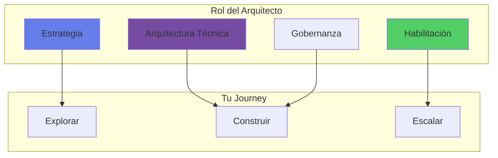
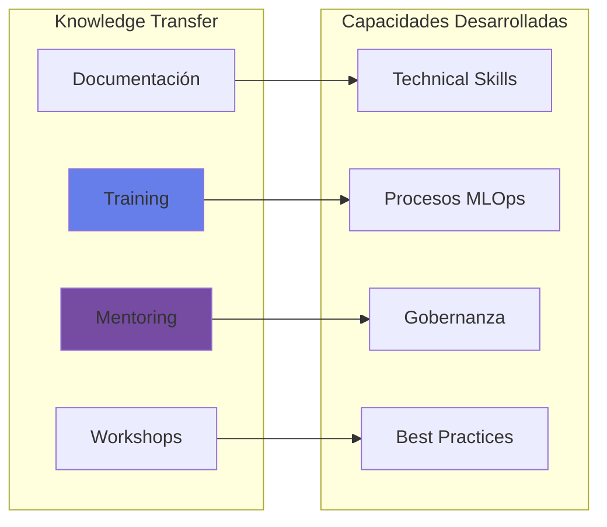

# 🏗️ Arquitecto de Adopción IA

## Tu Guía Experto para la Transformación con Inteligencia Artificial

### 🎯 ¿Qué es un Arquitecto de Adopción?

El Arquitecto de Adopción es tu consultor senior dedicado que te acompaña durante todo el journey de implementación de IA, desde la ideación hasta el escalamiento empresarial. Actúa como puente entre la visión de negocio y la ejecución técnica.



## 👤 Perfil del Arquitecto de Adopción

### Expertise Técnica
- **10+ años** en arquitectura de soluciones empresariales
- **5+ años** específicos en IA/ML en producción
- Certificaciones en cloud (AWS, Azure, GCP)
- Experiencia en sector financiero regulado

### Habilidades Clave
- Visión estratégica de negocio
- Comunicación ejecutiva efectiva
- Gestión de stakeholders complejos
- Metodologías ágiles y design thinking
- Change management y transformación digital

### Especialización Sectorial
- Regulación bancaria mexicana (CNBV, Banxico)
- Compliance y gestión de riesgos
- Procesos bancarios core
- Ecosistema fintech

## 🚀 Servicios del Arquitecto

### 1. Discovery & Assessment (Semanas 1-2)

```python
class DiscoveryPhase:
    def __init__(self, organization):
        self.org = organization
        self.findings = {}
        
    def execute(self):
        activities = {
            "as_is_analysis": self.analyze_current_state(),
            "maturity_assessment": self.assess_ai_maturity(),
            "opportunity_mapping": self.identify_opportunities(),
            "readiness_evaluation": self.evaluate_readiness(),
            "gap_analysis": self.identify_gaps()
        }
        
        return self.generate_roadmap(activities)
```

**Entregables:**
- Reporte de madurez IA (AI Maturity Score)
- Mapa de oportunidades priorizadas
- Business case preliminar
- Roadmap de adopción personalizado

### 2. Arquitectura de Solución (Semanas 3-4)

```yaml
solution_architecture:
  functional_design:
    - Casos de uso detallados
    - User journeys
    - Requisitos funcionales
    - Criterios de aceptación
    
  technical_architecture:
    - Diagrama de componentes
    - Flujos de datos
    - Integraciones
    - Stack tecnológico
    
  security_architecture:
    - Threat modeling
    - Controles de seguridad
    - Compliance mapping
    - Privacy by design
    
  operational_design:
    - MLOps framework
    - Monitoring strategy
    - SLAs y KPIs
    - Runbooks
```

### 3. Implementación Guiada (Semanas 5-12)

**Acompañamiento Durante:**

| Fase | Actividades del Arquitecto | Frecuencia |
|------|----------------------------|------------|
| **Sprint Planning** | Definición de historias técnicas | Semanal |
| **Daily Standups** | Resolución de blockers | Diario |
| **Architecture Reviews** | Validación de diseño | Bisemanal |
| **Security Reviews** | Evaluación de controles | Semanal |
| **Demo Sessions** | Feedback con stakeholders | Quincenal |
| **Retrospectives** | Mejora continua | Por sprint |

### 4. Habilitación del Equipo



## 📊 Modelo de Engagement

### Opciones de Servicio

| Modelo | Duración | Dedicación | Ideal Para | Inversión |
|--------|----------|------------|------------|-----------|
| **Full-Time** | 3-6 meses | 100% | Transformación completa | $45,000 USD/mes |
| **Part-Time** | 6-12 meses | 50% | Proyectos específicos | $25,000 USD/mes |
| **Advisory** | Ongoing | 20% | Consultoría estratégica | $12,000 USD/mes |
| **On-Demand** | Por horas | Variable | Resolución puntual | $500 USD/hora |

### Paquetes Especializados

#### 🎯 Quick Start Package (2 semanas)
- Assessment de madurez
- Identificación de quick wins
- Roadmap 90 días
- **Inversión:** $15,000 USD

#### 🚀 Transformation Package (3 meses)
- Arquitectura completa
- Implementación de PoC
- Habilitación del equipo
- **Inversión:** $120,000 USD

#### 🏆 Scale Package (6 meses)
- De piloto a producción
- MLOps implementation
- Centro de excelencia setup
- **Inversión:** $250,000 USD

## 💡 Casos de Éxito

### Caso 1: Banco Regional - Chatbot Inteligente

**Situación Inicial:**
- 80% llamadas repetitivas al call center
- Tiempo de espera: 15 minutos promedio
- Satisfacción del cliente: 2.8/5

**Intervención del Arquitecto:**
```python
intervention = {
    "semana_1-2": "Assessment y diseño de solución",
    "semana_3-4": "Arquitectura conversacional",
    "semana_5-8": "Implementación con el equipo",
    "semana_9-12": "Optimización y escalamiento"
}
```

**Resultados:**
- ✅ 65% reducción en llamadas
- ✅ Tiempo de respuesta: <30 segundos
- ✅ Satisfacción: 4.3/5
- ✅ ROI: 320% en 6 meses

### Caso 2: Fintech - Credit Scoring con ML

**Situación Inicial:**
- Modelo tradicional con 12 variables
- 48 horas para decisión
- NPL del 5.2%

**Intervención del Arquitecto:**
- Diseño de feature engineering pipeline
- Arquitectura de ML en tiempo real
- Framework de model governance
- Estrategia de champion-challenger

**Resultados:**
- ✅ Modelo con 300+ features
- ✅ Decisión en <1 minuto
- ✅ NPL reducido a 2.8%
- ✅ $12M USD en ahorros anuales

## 🎓 Proceso de Habilitación

### Transferencia de Conocimiento

```yaml
knowledge_transfer_plan:
  week_1_4:
    focus: "Fundamentos de IA"
    activities:
      - IA 101 para el equipo
      - Casos de uso en banca
      - Herramientas y plataformas
    
  week_5_8:
    focus: "Hands-on Development"
    activities:
      - Pair programming
      - Code reviews
      - Best practices workshops
    
  week_9_12:
    focus: "Operacionalización"
    activities:
      - MLOps training
      - Monitoring setup
      - Incident management
    
  ongoing:
    focus: "Mejora Continua"
    activities:
      - Monthly reviews
      - Quarterly assessments
      - Innovation sessions
```

### Certificación del Equipo

Al finalizar el engagement, tu equipo recibe:
- 🏅 Certificación "AI-Ready Team"
- 📚 Playbooks personalizados
- 🛠️ Toolkit de herramientas
- 🎯 Métricas de madurez

## 📈 Métricas de Éxito

### KPIs del Servicio

```python
success_metrics = {
    "velocidad": {
        "time_to_poc": "< 8 semanas",
        "time_to_production": "< 16 semanas",
        "velocity_increase": "> 40%"
    },
    "calidad": {
        "defect_rate": "< 5%",
        "technical_debt": "< 10%",
        "test_coverage": "> 80%"
    },
    "adopcion": {
        "user_adoption": "> 75%",
        "stakeholder_satisfaction": "> 4.5/5",
        "team_capability_score": "> 4/5"
    },
    "valor": {
        "roi_achieved": "> 200%",
        "cost_optimization": "> 30%",
        "revenue_impact": "Medible"
    }
}
```

## 🤝 Tu Arquitecto Asignado

### Proceso de Asignación

1. **Matching Call** (30 min)
   - Entendemos tu contexto y necesidades
   - Evaluamos fit cultural y técnico

2. **Propuesta de Arquitecto**
   - CV del arquitecto propuesto
   - Casos de éxito relevantes
   - Plan de trabajo preliminar

3. **Meet & Greet** (1 hora)
   - Conoce a tu arquitecto
   - Alineación de expectativas
   - Definición de quick wins

4. **Kick-off** (2 horas)
   - Setup de governance
   - Calendario de trabajo
   - Primeros entregables

## 🛠️ Herramientas y Frameworks

### Stack del Arquitecto

```yaml
frameworks:
  estrategia:
    - AI Canvas
    - Value Stream Mapping
    - OKR Framework
    
  arquitectura:
    - TOGAF for AI
    - Well-Architected Framework
    - Domain Driven Design
    
  implementacion:
    - Scrum/SAFe
    - DevOps/MLOps
    - GitFlow
    
  gobernanza:
    - COBIT for AI
    - ISO 42001
    - NIST AI Framework
```

### Herramientas Colaborativas

- **Documentación:** Confluence + Notion
- **Diagramas:** Miro + Draw.io
- **Código:** GitHub + VS Code
- **Comunicación:** Slack + Teams
- **Tracking:** Jira + Azure DevOps

## 💰 ROI del Servicio

### Análisis Costo-Beneficio

```python
roi_calculator = {
    "inversion": {
        "arquitecto_6_meses": 250_000,  # USD
        "herramientas": 50_000,
        "capacitacion": 30_000,
        "total": 330_000
    },
    "beneficios": {
        "aceleracion_time_to_market": 800_000,
        "reduccion_errores": 450_000,
        "optimizacion_recursos": 320_000,
        "innovacion_habilitada": 600_000,
        "total": 2_170_000
    },
    "roi": "557%",
    "payback_period": "4.2 meses"
}
```

## 📞 Solicita tu Arquitecto

### Canales de Contacto

- **Email:** arquitecto-ia@novasolutionsystems.com
- **Portal:** nova-cell.novasolutionsystems.com/arquitecto
- **Teléfono:** +52 55 1234 5678 ext. 2100
- **WhatsApp Business:** +52 55 9876 5432

### Información Requerida

Para asignarte el mejor arquitecto, necesitamos:
1. Descripción del proyecto/iniciativa
2. Tamaño del equipo
3. Timeline esperado
4. Presupuesto disponible
5. Tecnologías actuales
6. Nivel de madurez IA

## 🌟 Testimonios

> "Nuestro Arquitecto de Adopción transformó completamente nuestra aproximación a la IA. En 4 meses pasamos de cero a tener 3 modelos en producción."
> 
> **— María González, CDO Banco Regional**

> "La combinación de expertise técnica y visión de negocio del arquitecto fue clave para el éxito de nuestro proyecto de credit scoring."
> 
> **— Carlos Rodríguez, CTO Fintech XYZ**

> "No solo implementamos IA, construimos una capability organizacional sostenible gracias a la guía del arquitecto."
> 
> **— Ana Martínez, Head of Innovation**

## 📚 Recursos Adicionales

### Documentación
- [Playbook del Arquitecto de Adopción](../recursos/playbook-arquitecto.md)
- [Framework de Madurez IA](../recursos/maturity-framework.md)
- [Casos de Estudio](../recursos/case-studies.md)

### Webinars y Eventos
- **Office Hours:** Jueves 11:00 AM
- **Webinar Mensual:** Primer martes del mes
- **AI Architecture Summit:** Anual en octubre

### Comunidad
- [Slack: #arquitectos-ia](https://banco-ai.slack.com)
- [LinkedIn: AI Architects Network](https://linkedin.com/groups/ai-architects)
- [GitHub: arquitectura-referencia](https://github.com/banco/ai-architectures)

---

**¿Listo para acelerar tu adopción de IA con un experto dedicado?**

[Solicitar Arquitecto](mailto:arquitecto-ia@novasolutionsystems.com?subject=Solicitud%20Arquitecto%20Adopción){.md-button .md-button--primary}
[Agendar Consulta Gratuita](https://calendly.com/coe-ia/arquitecto-consultation){.md-button}

---

*Centro de Excelencia de IA - Tu socio estratégico en la transformación inteligente*