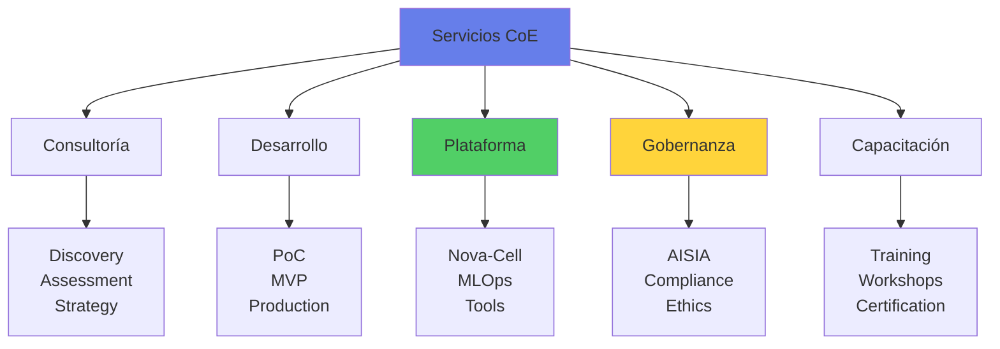
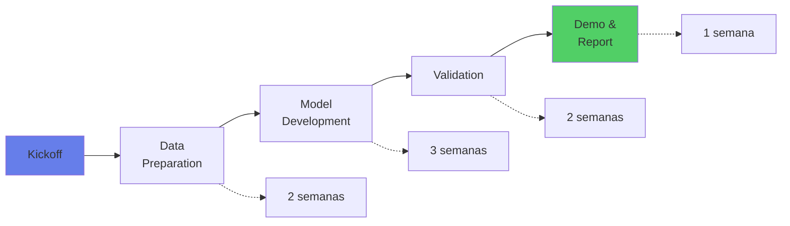
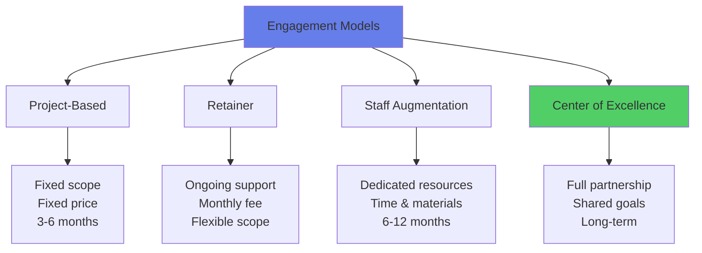

# 📚 Catálogo de Servicios del CoE de IA

## 🎯 Visión General

El Centro de Excelencia de IA ofrece un portafolio integral de servicios diseñados para acelerar y asegurar la adopción exitosa de inteligencia artificial en toda la organización, manteniendo los más altos estándares de calidad, seguridad y cumplimiento regulatorio.

### Modelo de Servicio



## 🤝 Servicios de Consultoría

### 1. AI Discovery Workshop

**Descripción**: Sesión facilitada para identificar oportunidades de IA en tu área

**Duración**: 1-2 días

**Entregables**:
- Catálogo de oportunidades priorizadas
- Matriz de valor vs factibilidad
- Roadmap inicial de IA
- Business case preliminar top 3

**Ideal para**:
- Áreas sin casos de uso definidos
- Líderes explorando potencial de IA
- Equipos iniciando journey de IA

**Costo**: Sin cargo para primera sesión

**SLA**: Disponibilidad en 2 semanas

---

### 2. AI Readiness Assessment

**Descripción**: Evaluación integral de madurez para adopción de IA

**Duración**: 2-3 semanas

**Componentes Evaluados**:
```python
readiness_dimensions = {
    "data": {
        "availability": "¿Existen los datos necesarios?",
        "quality": "¿Qué tan limpios y confiables son?",
        "governance": "¿Hay procesos de gobierno establecidos?",
        "score": 0-100
    },
    "technology": {
        "infrastructure": "¿Capacidad de cómputo y almacenamiento?",
        "tools": "¿Herramientas y plataformas disponibles?",
        "integration": "¿Facilidad de integración con sistemas?",
        "score": 0-100
    },
    "people": {
        "skills": "¿Capacidades técnicas del equipo?",
        "culture": "¿Apertura al cambio y data-driven?",
        "leadership": "¿Apoyo ejecutivo?",
        "score": 0-100
    },
    "process": {
        "agility": "¿Metodologías ágiles adoptadas?",
        "governance": "¿Procesos de decisión claros?",
        "risk_management": "¿Framework de riesgos?",
        "score": 0-100
    }
}
```

**Entregables**:
- Reporte de madurez con scoring
- Gap analysis detallado
- Roadmap de mejora
- Recomendaciones priorizadas

**Costo**: $150K-300K MXN

---

### 3. AI Strategy Development

**Descripción**: Desarrollo de estrategia integral de IA alineada con objetivos de negocio

**Duración**: 4-6 semanas

**Alcance**:
- Visión y objetivos de IA
- Casos de uso prioritarios
- Arquitectura target
- Modelo operativo
- Plan de inversión
- Roadmap 3 años

**Metodología**:
1. **Discovery**: Entrevistas con stakeholders
2. **Analysis**: Benchmark y mejores prácticas
3. **Design**: Estrategia y arquitectura
4. **Planning**: Roadmap y business case
5. **Validation**: Comité ejecutivo

**Entregables**:
- Documento estratégico ejecutivo
- Business case detallado
- Arquitectura de referencia
- Plan de implementación
- Modelo de gobierno

**Costo**: $500K-1M MXN

---

### 4. Use Case Prioritization

**Descripción**: Evaluación y priorización sistemática de casos de uso de IA

**Duración**: 1-2 semanas

**Framework de Evaluación**:

| Criterio | Peso | Factores |
|----------|------|----------|
| **Valor de Negocio** | 40% | ROI, impacto estratégico, urgencia |
| **Factibilidad Técnica** | 30% | Datos, tecnología, complejidad |
| **Riesgo** | 20% | Regulatorio, operacional, reputacional |
| **Fit Organizacional** | 10% | Cultura, skills, change management |

**Entregables**:
- Matriz de priorización
- Fichas técnicas por caso
- Roadmap de implementación
- Quick wins identificados

**Costo**: $100K-200K MXN

## 🚀 Servicios de Desarrollo

### 5. Proof of Concept (PoC)

**Descripción**: Desarrollo rápido de PoC para validar viabilidad técnica

**Duración**: 4-8 semanas

**Proceso**:


**Incluye**:
- Acceso a Nova-Cell sandbox
- Data engineering básico
- Desarrollo de modelo
- Métricas de performance
- Demo funcional
- Reporte de viabilidad

**No incluye**:
- Integración con sistemas
- UI/UX elaborado
- Escalamiento
- Productización

**Costo**: $300K-800K MXN

---

### 6. MVP Development

**Descripción**: Desarrollo de MVP production-ready

**Duración**: 12-16 semanas

**Componentes**:
- ✅ Modelo ML/AI optimizado
- ✅ APIs RESTful/gRPC
- ✅ UI/UX funcional
- ✅ Integración básica
- ✅ Testing integral
- ✅ Documentación
- ✅ Deployment pipeline
- ✅ Monitoring básico

**Equipo Típico**:
- Product Owner (cliente)
- Tech Lead (CoE)
- 2 Data Scientists (CoE)
- 2 ML Engineers (CoE/cliente)
- 1 UX Designer (compartido)
- 1 DevOps (compartido)

**Modelo de Trabajo**:
- Metodología Agile/Scrum
- Sprints de 2 semanas
- Demos bi-semanales
- Retrospectivas continuas

**Costo**: $2M-5M MXN

---

### 7. Production Deployment Support

**Descripción**: Soporte especializado para deployment a producción

**Duración**: 2-4 semanas

**Servicios Incluidos**:
- Revisión de production readiness
- Configuración de infraestructura
- Setup de monitoring
- Deployment automation
- Performance tuning
- Cutover planning
- Go-live support
- Hypercare (2 semanas)

**Requisitos**:
- MVP completado y probado
- Infraestructura disponible
- Equipo de soporte identificado
- Plan de rollback definido

**Costo**: $500K-1M MXN

---

### 8. Model Optimization & Tuning

**Descripción**: Optimización de modelos existentes

**Alcance**:
- Performance profiling
- Hyperparameter optimization
- Feature engineering avanzado
- Model compression
- Inference optimization
- Cost optimization

**Resultados Típicos**:
- +10-30% accuracy improvement
- 50-80% latency reduction
- 30-60% cost reduction
- 2-5x throughput increase

**Duración**: 2-4 semanas

**Costo**: $200K-500K MXN

## 🔧 Servicios de Plataforma

### 9. Nova-Cell Platform Access

**Descripción**: Acceso a la plataforma enterprise de ML/AI

**Capacidades**:
```yaml
nova_cell_features:
  compute:
    cpu: "Unlimited vCPUs"
    gpu: "NVIDIA A100/V100"
    memory: "Up to 1TB RAM"
    
  storage:
    data_lake: "Acceso completo"
    feature_store: "Compartido"
    model_registry: "Ilimitado"
    
  tools:
    notebooks: "JupyterLab Enterprise"
    ides: "VS Code, PyCharm"
    frameworks: "TF, PyTorch, Scikit, XGBoost"
    automl: "AutoGluon, H2O"
    
  mlops:
    experiment_tracking: "MLflow"
    pipelines: "Kubeflow, Airflow"
    serving: "TorchServe, TF Serving"
    monitoring: "Grafana, Evidently"
    
  compliance:
    audit_logging: "Completo"
    access_control: "RBAC"
    encryption: "At rest & transit"
    data_privacy: "PII handling"
```

**Planes de Suscripción**:

| Plan | Recursos | Soporte | Costo Mensual |
|------|----------|---------|---------------|
| **Sandbox** | Limitados | Comunidad | Gratis |
| **Standard** | Compartidos | Business hours | $50K MXN |
| **Premium** | Dedicados | 24x7 | $200K MXN |
| **Enterprise** | Ilimitados | Dedicated TAM | $500K+ MXN |

---

### 10. MLOps Pipeline Setup

**Descripción**: Implementación de pipelines MLOps end-to-end

**Componentes**:
- CI/CD para ML
- Automated training
- Model validation
- A/B testing framework
- Drift detection
- Automated retraining
- Model governance

**Duración**: 4-6 semanas

**Entregables**:
- Pipelines configurados
- Automation scripts
- Monitoring dashboards
- Runbooks
- Training para equipo

**Costo**: $800K-1.5M MXN

---

### 11. Feature Store Implementation

**Descripción**: Implementación de feature store enterprise

**Beneficios**:
- Reutilización de features
- Consistencia training-serving
- Reducción time-to-market
- Governance de features
- Lineage tracking

**Tecnologías**:
- Feast (open source)
- Tecton (enterprise)
- Databricks Feature Store
- AWS SageMaker Feature Store

**Duración**: 6-8 semanas

**Costo**: $1M-2M MXN

## ⚖️ Servicios de Gobernanza

### 12. AISIA Assessment

**Descripción**: Evaluación sistemática de impacto de iniciativas de IA

**Proceso**:
1. Pre-screening (1 día)
2. Assessment completo (1 semana)
3. Comité review (2 días)
4. Reporte y recomendaciones

**Dimensiones Evaluadas**:
- Impacto financiero
- Complejidad técnica
- Riesgo y compliance
- Datos y privacidad
- Cambio organizacional
- Innovación

**Obligatorio para**:
- Proyectos >$1M MXN
- Sistemas Tier 1-2
- Modelos customer-facing
- Casos regulados

**Costo**: Incluido en programa

---

### 13. Model Risk Management

**Descripción**: Gestión integral del riesgo de modelos

**Servicios**:
- Model inventory management
- Independent model validation
- Performance monitoring
- Drift detection & alerts
- Challenger models
- Regulatory reporting

**Framework**:
```python
model_risk_services = {
    "validation": {
        "conceptual_soundness": "Review de approach",
        "data_quality": "Validación de datos",
        "implementation": "Code review",
        "performance": "Backtesting",
        "documentation": "Completeness check"
    },
    "monitoring": {
        "accuracy_tracking": "Continuous",
        "drift_detection": "Daily",
        "bias_monitoring": "Weekly",
        "regulatory_metrics": "Monthly"
    },
    "governance": {
        "approval_workflow": "Automated",
        "audit_trail": "Complete",
        "version_control": "Git-based",
        "access_control": "Role-based"
    }
}
```

**SLA**: 
- Tier 1: Validación en 2 semanas
- Tier 2: Validación en 1 semana
- Tier 3-4: Validación en 3 días

**Costo**: $200K-500K MXN por modelo

---

### 14. AI Ethics Review

**Descripción**: Evaluación ética de sistemas de IA

**Criterios de Evaluación**:
- Fairness y no discriminación
- Transparencia y explicabilidad
- Privacy y consentimiento
- Accountability
- Beneficencia
- Seguridad

**Proceso**:
1. Self-assessment
2. Technical review
3. Ethics committee
4. Recomendaciones
5. Follow-up

**Requerido para**:
- Modelos de decisión crediticia
- Sistemas de scoring
- Customer profiling
- Automated decisions

**Costo**: Incluido en programa

---

### 15. Regulatory Compliance Support

**Descripción**: Soporte para cumplimiento regulatorio

**Cobertura**:
- CNBV (Circular Única, Anexo 57)
- Banxico (Disposiciones)
- LFPDPPP (Privacidad)
- CONDUSEF (Protección al consumidor)
- International (GDPR, etc.)

**Servicios**:
- Gap analysis regulatorio
- Documentación requerida
- Preparación para auditorías
- Regulatory reporting
- Liaison con reguladores

**Modalidades**:
- Consultoría puntual
- Soporte continuo
- Auditoría pre-deployment

**Costo**: $300K-800K MXN por proyecto

## 🎓 Servicios de Capacitación

### 16. AI Fundamentals Training

**Descripción**: Introducción a conceptos de IA para no-técnicos

**Formato**: Presencial o virtual

**Duración**: 8 horas (1 día)

**Contenido**:
- ¿Qué es IA/ML/DL?
- Casos de uso en banca
- El proceso de ML
- Datos y su importancia
- Ética y riesgos
- Hands-on con AutoML

**Audiencia**: 
- Ejecutivos
- Product Owners
- Business Analysts
- Cualquier interesado

**Capacidad**: 20-30 personas

**Costo**: $50K MXN por grupo

---

### 17. ML Engineering Bootcamp

**Descripción**: Programa intensivo para desarrollar ML Engineers

**Duración**: 12 semanas (part-time)

**Curriculum**:

| Semana | Tema | Práctica |
|--------|------|----------|
| 1-2 | Python for ML | Data manipulation |
| 3-4 | ML Fundamentals | Sklearn basics |
| 5-6 | Deep Learning | TensorFlow/PyTorch |
| 7-8 | MLOps | Pipelines, versioning |
| 9-10 | Deployment | APIs, containerization |
| 11-12 | Project | End-to-end solution |

**Requisitos**:
- Programación básica
- Estadística básica
- Compromiso 20 hrs/semana

**Certificación**: Incluida

**Costo**: $100K MXN por persona

---

### 18. Executive AI Workshop

**Descripción**: Sesión estratégica para líderes

**Duración**: 4 horas

**Agenda**:
1. AI State of the Art (1 hr)
2. Industry Benchmarks (1 hr)
3. Organizational Readiness (1 hr)
4. Strategic Planning (1 hr)

**Outcomes**:
- Visión clara de oportunidades
- Understanding de inversión
- Roadmap inicial
- Próximos pasos

**Audiencia**: C-Level, VPs, Directors

**Costo**: $150K MXN

---

### 19. Certification Programs

**Programas Disponibles**:

| Certificación | Nivel | Duración | Costo |
|---------------|-------|----------|-------|
| **AI Practitioner** | Básico | 40 hrs | $20K MXN |
| **ML Engineer** | Intermedio | 80 hrs | $50K MXN |
| **AI Architect** | Avanzado | 120 hrs | $80K MXN |
| **AI Ethics Specialist** | Especializado | 60 hrs | $40K MXN |

**Beneficios**:
- Certificado oficial del banco
- Badge digital
- Acceso a comunidad
- Recursos continuos
- Career advancement

## 📞 Modelo de Engagement

### Tipos de Engagement



### Service Level Agreements (SLAs)

| Service Type | Response Time | Resolution Time | Availability |
|--------------|---------------|-----------------|--------------|
| **Consultoría** | 48 hrs | 2 weeks | Business hours |
| **Desarrollo** | 24 hrs | Per project plan | Extended hours |
| **Plataforma** | 1 hr (P1) | 4 hrs (P1) | 24x7 for Premium |
| **Gobernanza** | 24 hrs | 1 week | Business hours |
| **Capacitación** | 72 hrs | 2 weeks scheduling | Business hours |

## 💰 Modelo de Pricing

### Factores de Precio

```python
pricing_factors = {
    "complexity": {
        "low": 1.0,    # Standard models, structured data
        "medium": 1.5,  # Custom models, mixed data
        "high": 2.0,    # Novel approaches, unstructured
        "very_high": 3.0  # Research required, cutting edge
    },
    "urgency": {
        "standard": 1.0,  # Normal timeline
        "accelerated": 1.3,  # 25% faster
        "urgent": 1.5     # 50% faster
    },
    "tier": {
        "tier_1": 2.0,  # Critical systems
        "tier_2": 1.5,  # Important systems
        "tier_3": 1.2,  # Standard systems
        "tier_4": 1.0   # Low risk systems
    },
    "volume": {
        "single": 1.0,
        "multiple_3_5": 0.9,
        "multiple_6_10": 0.8,
        "enterprise": 0.7
    }
}
```

### Modelos de Financiamiento

1. **CAPEX**: Desarrollo one-time
2. **OPEX**: Suscripción mensual
3. **Híbrido**: CAPEX inicial + OPEX mantenimiento
4. **Success-based**: Pago por resultados
5. **Innovation Fund**: Financiamiento interno para casos estratégicos

## 📊 Portafolio de Éxito

### Casos de Éxito Recientes

| Proyecto | Área | Duración | ROI | Impacto |
|----------|------|----------|-----|---------|
| **Credit Scoring 2.0** | Riesgo | 6 meses | 340% | -30% defaults |
| **Fraud Detection ML** | Seguridad | 4 meses | 520% | -45% fraudes |
| **Customer 360 AI** | Marketing | 8 meses | 280% | +25% conversión |
| **Document Intelligence** | Operaciones | 3 meses | 410% | -60% tiempo proceso |
| **Chatbot Cobranza** | Cobranza | 5 meses | 380% | +40% recuperación |

## 🤝 Cómo Empezar

### Paso 1: Contacto Inicial
- Email: coe-ia@novasolutionsystems.com
- Teams: #ai-center-of-excellence
- Portal: nova-cell.novasolutionsystems.com/services
- Teléfono: Ext. 5555

### Paso 2: Discovery Call (30 min)
- Entender necesidad
- Identificar servicio adecuado
- Definir siguientes pasos
- Estimar timeline y costo

### Paso 3: Propuesta Formal
- Alcance detallado
- Plan de trabajo
- Equipo asignado
- Inversión requerida
- Timeline

### Paso 4: Kickoff
- Firma de acuerdo
- Asignación de recursos
- Setup de herramientas
- Inicio de proyecto

## 🌟 Compromiso del CoE

### Nuestros Principios

1. **Excelencia Técnica**: Mejores prácticas y tecnología de punta
2. **Orientación a Valor**: Foco en ROI y resultados de negocio
3. **Colaboración**: Trabajo conjunto, no en silos
4. **Transparencia**: Comunicación clara y honesta
5. **Innovación Responsable**: IA ética y regulada
6. **Mejora Continua**: Aprendizaje de cada proyecto

### Garantías

- ✅ Cumplimiento de SLAs
- ✅ Calidad certificada ISO
- ✅ Compliance regulatorio
- ✅ Transferencia de conocimiento
- ✅ Soporte post-implementación
- ✅ Satisfacción del cliente

---

**Para más información o solicitar servicios:**

📧 coe-ia@novasolutionsystems.com  
💬 Teams: #ai-services  
🌐 nova-cell.novasolutionsystems.com  
📞 Ext. 5555

*"Transformando el futuro del banco con IA responsable"*