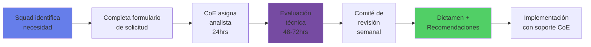
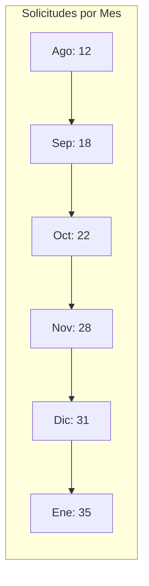

# 🤖 Evaluación de Modelos LLM - Centro de Excelencia IA

## Validación sistemática de seguridad, performance y compliance para modelos de lenguaje

48h
SLA promedio de respuesta

127
Modelos evaluados

89%
Tasa de aprobación con condiciones

100%
Compliance regulatorio

[Solicitar Evaluación de Modelo](#formulario-de-solicitud){.md-button .md-button--primary}

---

## 🛡️ ¿Por Qué Evaluar con el CoE?

La adopción no controlada de modelos LLM representa uno de los mayores riesgos de Shadow AI en servicios financieros. Según Gartner 2024, el 75% de los empleados bancarios ya utilizan herramientas de IA sin autorización formal, exponiendo datos sensibles y violando regulaciones.

### 🔒 Mitigación de Riesgos
- Prevención de fugas de datos
- Cumplimiento CNBV y regulatorio
- Protección contra model poisoning

### 💰 Optimización de Costos
- Negociación centralizada con proveedores
- Evitar duplicación de licencias
- ROI validado antes de adopción

### 🚀 Aceleración de Adopción
- Modelos pre-aprobados listos para usar
- Documentación y mejores prácticas
- Soporte técnico especializado

### 📊 Gobernanza Consistente
- Políticas uniformes cross-squads
- Auditoría centralizada
- Métricas de adopción consolidadas

---

## 📐 Framework de Evaluación

### Nuestro Enfoque: Basado en Cloudflare Application Confidence Score

Adoptamos y extendemos la metodología de Cloudflare Application Confidence Score, añadiendo criterios específicos para el sector bancario mexicano.

| Criterio | Cloudflare Score | Nuestro Score CoE | Peso | Descripción |
|----------|-----------------|-------------------|------|-------------|
| **Seguridad de Datos** | Training on prompts | Training + Data Residency | 30% | ¿El modelo entrena con inputs? ¿Dónde se almacenan los datos? |
| **Compliance** | ISO 42001 | ISO 42001 + CNBV + PLD | 25% | Certificaciones y cumplimiento regulatorio mexicano |
| **Performance** | No evalúa | Latencia + Accuracy + Costo | 20% | Métricas técnicas y eficiencia |
| **Gobernanza** | Model Cards | Model Cards + Explicabilidad | 15% | Transparencia y auditabilidad |
| **Estabilidad** | Financial Health | Financial + SLA + Soporte Local | 10% | Viabilidad del proveedor |

### 📊 Escala de Puntuación

- **5.0 - 4.5** ✅ **Aprobado sin restricciones** - Uso libre en todos los casos
- **4.4 - 3.5** ⚠️ **Aprobado con condiciones** - Requiere controles adicionales
- **3.4 - 2.5** 🔶 **Requiere mitigaciones adicionales** - Solo casos específicos
- **< 2.5** ❌ **No apto para uso empresarial** - Prohibido en ambiente corporativo

---

## 🔄 Proceso de Solicitud

### Cómo Solicitar una Evaluación

### ⏱️ SLA Comprometidos

| Tipo de Solicitud | SLA Respuesta Inicial | SLA Dictamen Final | Prioridad |
|-------------------|----------------------|-------------------|-----------|
| **Modelo Pre-aprobado** | 2 horas | 24 horas | Automático |
| **Modelo Conocido** | 24 horas | 48 horas | Alta |
| **Modelo Nuevo** | 24 horas | 5 días hábiles | Normal |
| **Evaluación Compleja** | 48 horas | 10 días hábiles | Comité |
| **Urgente (justificado)** | 4 horas | 48 horas | Crítica |

---

## 📝 Formulario de Solicitud

### Formulario de Evaluación de Modelo LLM

<form id="llm-evaluation-form" class="evaluation-form">

#### Información del Solicitante

<label for="nombre">Nombre completo*</label>
<input type="text" id="nombre" name="nombre" required>

<label for="email">Email corporativo*</label>
<input type="email" id="email" name="email" required pattern=".*@banco\.mx$">

<label for="squad">Squad/Equipo*</label>
<select id="squad" name="squad" required>
<option value="">Seleccionar...</option>
<option value="digital">Banca Digital</option>
<option value="riesgos">Riesgos</option>
<option value="operaciones">Operaciones</option>
<option value="ti">Tecnología</option>
<option value="innovacion">Innovación</option>
<option value="datos">Data & Analytics</option>
</select>

<label for="proyecto">Cliente/Proyecto*</label>
<select id="proyecto" name="proyecto" required>
<option value="">Seleccionar...</option>
<option value="retail">Banca Retail</option>
<option value="empresarial">Banca Empresarial</option>
<option value="wealth">Wealth Management</option>
<option value="interno">Proceso Interno</option>
</select>

<label for="sponsor">Gerente/Sponsor*</label>
<input type="text" id="sponsor" name="sponsor" required>

#### Información del Modelo

<label for="modelo">Nombre del modelo*</label>
<input type="text" id="modelo" name="modelo" required placeholder="ej. GPT-4, Claude 3, Gemini Pro">

<label for="proveedor">Proveedor*</label>
<select id="proveedor" name="proveedor" required>
<option value="">Seleccionar...</option>
<option value="openai">OpenAI</option>
<option value="anthropic">Anthropic</option>
<option value="google">Google</option>
<option value="microsoft">Microsoft</option>
<option value="meta">Meta</option>
<option value="mistral">Mistral</option>
<option value="otro">Otro</option>
</select>

<label for="version">Versión específica*</label>
<input type="text" id="version" name="version" required placeholder="ej. gpt-4-1106-preview">

<label for="tier">Tier/Plan*</label>
<select id="tier" name="tier" required>
<option value="">Seleccionar...</option>
<option value="free">Free</option>
<option value="plus">Plus</option>
<option value="team">Team</option>
<option value="enterprise">Enterprise</option>
<option value="custom">Custom</option>
</select>

<label for="documentacion">URL documentación</label>
<input type="url" id="documentacion" name="documentacion" placeholder="https://...">

#### Caso de Uso

<label for="descripcion">Descripción del caso de uso* (mín. 200 caracteres)</label>
<textarea id="descripcion" name="descripcion" required minlength="200" rows="4"></textarea>

<label>Función principal* (selecciona todas las aplicables)</label>

<label><input type="checkbox" name="funcion" value="codigo"> Generación de código</label>
<label><input type="checkbox" name="funcion" value="docs"> Documentación técnica</label>
<label><input type="checkbox" name="funcion" value="analisis"> Análisis de datos</label>
<label><input type="checkbox" name="funcion" value="atencion"> Atención al cliente</label>
<label><input type="checkbox" name="funcion" value="procesamiento"> Procesamiento de documentos</label>
<label><input type="checkbox" name="funcion" value="testing"> Testing/QA</label>
<label><input type="checkbox" name="funcion" value="otro"> Otro: <input type="text" name="funcion_otro"></label>

#### Datos a Procesar

<label>Tipo de datos* (selecciona todos los aplicables)</label>

<label><input type="checkbox" name="datos" value="codigo"> Código fuente</label>
<label><input type="checkbox" name="datos" value="pii"> Datos personales (PII)</label>
<label><input type="checkbox" name="datos" value="financiera"> Información financiera</label>
<label><input type="checkbox" name="datos" value="interna"> Documentación interna</label>
<label><input type="checkbox" name="datos" value="publica"> Datos públicos</label>
<label><input type="checkbox" name="datos" value="logs"> Logs/Métricas</label>

<label for="volumen">Volumen estimado*</label>
<select id="volumen" name="volumen" required>
<option value="">Seleccionar...</option>
<option value="bajo">< 1,000 requests/mes</option>
<option value="medio">1,000 - 10,000 requests/mes</option>
<option value="alto">10,000 - 100,000 requests/mes</option>
<option value="muy_alto">> 100,000 requests/mes</option>
</select>

#### Consideraciones Adicionales

<label>¿Requiere fine-tuning?</label>

<label><input type="radio" name="finetuning" value="si"> Sí</label>
<label><input type="radio" name="finetuning" value="no" checked> No</label>

<label>¿Integración con sistemas existentes?</label>

<label><input type="radio" name="integracion" value="si"> Sí</label>
<label><input type="radio" name="integracion" value="no" checked> No</label>

<label>¿Manejo de datos sensibles?</label>

<label><input type="radio" name="sensibles" value="si"> Sí</label>
<label><input type="radio" name="sensibles" value="no" checked> No</label>

<label for="presupuesto">Presupuesto mensual estimado (USD)</label>
<input type="number" id="presupuesto" name="presupuesto" min="0" step="100">

<label for="fecha">Fecha deseada de implementación</label>
<input type="date" id="fecha" name="fecha" min="2025-02-01">

<label for="comentarios">Comentarios adicionales</label>
<textarea id="comentarios" name="comentarios" rows="3"></textarea>

<button type="submit" class="btn-primary">Enviar Solicitud</button>
<button type="button" class="btn-secondary">Guardar Borrador</button>
<button type="button" class="btn-tertiary">Cancelar</button>

</form>

---

## 📊 Catálogo de Modelos Evaluados por el CoE

### ✅ Modelos Aprobados

<input type="text" placeholder="Buscar modelo..." class="search-input">
<select class="filter-select">
<option>Todos los proveedores</option>
<option>OpenAI</option>
<option>Anthropic</option>
<option>Google</option>
<option>Meta</option>
</select>
<select class="filter-select">
<option>Todos los casos de uso</option>
<option>Código</option>
<option>Documentación</option>
<option>Análisis</option>
<option>Testing</option>
</select>

| Modelo | Proveedor | Score CoE | Tier Aprobado | Casos de Uso | Restricciones | Última Revisión | Acciones |
|--------|-----------|-----------|---------------|--------------|---------------|-----------------|----------|
| **GPT-4 Turbo** | OpenAI | 4.2/5.0 | Enterprise | Código, Docs | No PII directo | 15/01/2025 | [Ver detalles](#) [Solicitar acceso](#) |
| **Claude 3 Opus** | Anthropic | 4.6/5.0 | Team, Enterprise | Análisis, Docs | Ninguna | 10/01/2025 | [Ver detalles](#) [Solicitar acceso](#) |
| **Gemini Pro** | Google | 4.3/5.0 | Business, Enterprise | Datos, Testing | Datos en México | 08/01/2025 | [Ver detalles](#) [Solicitar acceso](#) |
| **Llama 3 70B** | Meta | 4.0/5.0 | Self-hosted | Todos | On-premise only | 20/12/2024 | [Ver detalles](#) [Solicitar acceso](#) |
| **Mixtral 8x7B** | Mistral | 3.8/5.0 | Self-hosted | Código | Validación manual | 18/12/2024 | [Ver detalles](#) [Solicitar acceso](#) |
| **Codex** | OpenAI | 4.1/5.0 | Enterprise | Código | Solo desarrollo | 15/12/2024 | [Ver detalles](#) [Solicitar acceso](#) |
| **Claude 3 Sonnet** | Anthropic | 4.4/5.0 | Team | Docs, Análisis | Límite 100K tokens | 12/12/2024 | [Ver detalles](#) [Solicitar acceso](#) |
| **Gemini Nano** | Google | 3.6/5.0 | Edge | Mobile apps | Dispositivos Android | 10/12/2024 | [Ver detalles](#) [Solicitar acceso](#) |

### ❌ Modelos No Aprobados

| Modelo | Proveedor | Score CoE | Razón Principal | Alternativa Sugerida | Fecha Evaluación | Re-evaluación |
|--------|-----------|-----------|-----------------|---------------------|------------------|---------------|
| **ChatGPT Free** | OpenAI | 1.8/5.0 | Entrena con datos usuario | GPT-4 Enterprise | 05/01/2025 | No aplicable |
| **Bard Consumer** | Google | 2.1/5.0 | Sin controles empresa | Gemini Business | 03/01/2025 | Q3 2025 |
| **Llama 2 7B** | Meta | 2.4/5.0 | Performance insuficiente | Llama 3 70B | 15/12/2024 | No aplicable |
| **GPT-3.5** | OpenAI | 2.3/5.0 | Deprecated, sin soporte | GPT-4 Turbo | 10/12/2024 | No aplicable |
| **PaLM API** | Google | 2.2/5.0 | Descontinuado | Gemini Pro | 01/12/2024 | No aplicable |
| **Falcon 7B** | TII | 2.5/5.0 | Falta de soporte empresa | Llama 3 | 28/11/2024 | Q2 2025 |

---

## 📚 Mejores Prácticas

### Guías y Recursos para Implementación Segura

<strong>📋 Antes de Solicitar</strong>

- ✓ Verificar el catálogo de modelos pre-aprobados
- ✓ Definir claramente el caso de uso y ROI esperado
- ✓ Identificar tipos de datos a procesar
- ✓ Consultar con arquitectura sobre integraciones
- ✓ Revisar presupuesto con finance
- ✓ Obtener aprobación del sponsor
- ✓ Documentar requerimientos técnicos
- ✓ Preparar plan de contingencia

<strong>⚙️ Durante la Evaluación</strong>

- ✓ Responder rápidamente a solicitudes del CoE
- ✓ Proveer acceso a documentación técnica
- ✓ Participar en sesiones de testing
- ✓ Documentar requerimientos específicos
- ✓ Preparar plan de rollback
- ✓ Definir métricas de éxito
- ✓ Identificar stakeholders clave
- ✓ Preparar ambiente de pruebas

<strong>🚀 Post-Aprobación</strong>

- ✓ Seguir las condiciones establecidas
- ✓ Implementar monitoreo recomendado
- ✓ Reportar métricas mensuales al CoE
- ✓ Participar en reviews trimestrales
- ✓ Compartir learnings con la comunidad
- ✓ Actualizar documentación
- ✓ Capacitar al equipo
- ✓ Escalar gradualmente

---

## 📞 ¿Necesitas Ayuda?

### Canales de Soporte

<h4>📧 Consultas Generales</h4>

<strong>Email:</strong> coe-ia@novasolutionsystems.com

<strong>#Google Chat:</strong> #coe-ia-soporte

<strong>SLA:</strong> 24 horas hábiles

<h4>🚨 Urgencias</h4>

<strong>Hotline:</strong> ext. 5555

<strong>Escalación:</strong> ai@novasolutionsystems.com

<strong>SLA:</strong> 4 horas

<h4>🗓️ Office Hours</h4>

<strong>Horario:</strong> Martes y Jueves 10:00-11:00 AM

<strong>#Google Chat:</strong> [Unirse a sesión](https://chat.google.com/room/AAQAugDuKpE?cls=1)

<strong>Formato:</strong> Agenda abierta

---

## 📈 Dashboard de Evaluaciones

### Métricas en Tiempo Real

8

Solicitudes en proceso

↑ 12% vs semana anterior

3.2

Días promedio evaluación

↓ 0.5 días vs mes anterior

76%

Tasa aprobación mensual

→ Sin cambios

23

Modelos en producción

↑ 3 nuevos este mes

45/52

Squads usando IA aprobada

↑ 86% adopción

### Tendencias Últimos 6 Meses

---

## 📑 Recursos Adicionales

### Enlaces Importantes

- 📄 [Política de IA Empresarial (PDF)](/docs/politica-ia-empresarial.pdf)
- 📊 [Matriz de Riesgos de Modelos LLM](/docs/matriz-riesgos-llm.xlsx)
- 📅 [Calendario de Comités de Evaluación](/calendar/comite-evaluacion)
- ❓ [FAQ Técnicas](/faq/evaluacion-modelos)
- 📖 [Glosario de Términos](/glosario/ia)
- 🔄 [Actualizaciones y Changelog](/changelog/evaluacion)

### Documentos de Referencia

- [Framework Cloudflare Application Confidence Score](https://blog.cloudflare.com/application-confidence-score)
- [Circular CNBV sobre IA en Servicios Financieros](/docs/cnbv-circular-ia.pdf)
- [ISO/IEC 42001:2023 - AI Management System](/docs/iso-42001-summary.pdf)
- [NIST AI Risk Management Framework](/docs/nist-ai-rmf.pdf)

---

## ⚖️ Disclaimer Legal

> **IMPORTANTE:** Todos los modelos evaluados están sujetos a revisión continua. Las aprobaciones pueden ser revocadas si cambian las condiciones de seguridad, compliance o performance. El uso de modelos no evaluados está estrictamente prohibido y sujeto a sanciones disciplinarias según la política corporativa de Tecnología de la Información y el Código de Conducta del banco.
> 
> La evaluación del CoE no exime a los equipos de su responsabilidad en el uso apropiado de los modelos, la protección de datos y el cumplimiento de todas las regulaciones aplicables. Cada squad es responsable de implementar los controles recomendados y reportar cualquier incidente de seguridad o desviación de las condiciones de uso aprobadas.

---

---

**Centro de Excelencia de IA** | Nova | coe-ia@novasolutionsystems.com | ext. 5555