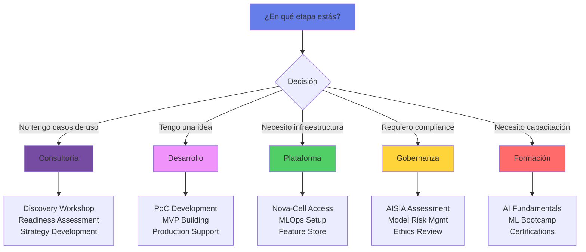

# 🎯 Servicios del Centro de Excelencia

## Nuestro Portafolio de Servicios

El Centro de Excelencia de IA ofrece un conjunto integral de servicios diseñados para acelerar tu journey de adopción de IA, desde la ideación hasta el escalamiento empresarial.

### 🔍 ¿Qué servicio necesitas?



## 📚 Catálogo Completo

### [Ver Catálogo Detallado de Servicios →](catalogo-servicios.md)

Explora nuestros 19 servicios especializados organizados en 5 categorías principales:

- **5 Servicios de Consultoría** - Desde discovery hasta estrategia
- **4 Servicios de Desarrollo** - PoC, MVP y producción
- **3 Servicios de Plataforma** - Infraestructura y herramientas
- **4 Servicios de Gobernanza** - Compliance y gestión de riesgos
- **4 Servicios de Capacitación** - Formación y certificación

## 🚀 Quick Start por Rol

### Para Product Owners
1. **AI Discovery Workshop** - Identifica oportunidades en tu área
2. **Use Case Prioritization** - Evalúa y prioriza casos de uso
3. **PoC Development** - Valida viabilidad técnica

### Para Desarrolladores
1. **Nova-Cell Platform Access** - Ambiente de desarrollo listo
2. **ML Engineering Bootcamp** - Desarrolla habilidades de ML
3. **MLOps Pipeline Setup** - Automatiza tu flujo de trabajo

### Para Ejecutivos
1. **Executive AI Workshop** - Visión estratégica de IA
2. **AI Strategy Development** - Plan integral de adopción
3. **ROI & Business Case** - Justificación de inversión

## 💡 Servicios Más Solicitados

### Top 5 Este Mes

| # | Servicio | Solicitudes | Tiempo Promedio |
|---|----------|-------------|-----------------|
| 1 | **PoC Development** | 12 | 6 semanas |
| 2 | **Nova-Cell Access** | 28 | Inmediato |
| 3 | **AI Discovery Workshop** | 8 | 2 días |
| 4 | **AISIA Assessment** | 15 | 1 semana |
| 5 | **ML Engineering Bootcamp** | 45 personas | 12 semanas |

## 📊 Modelo de Engagement

### Opciones Flexibles

| Modelo | Mejor Para | Duración | Inversión |
|--------|------------|----------|-----------|
| **Project-Based** | Iniciativas específicas | 3-6 meses | Fijo |
| **Retainer** | Soporte continuo | Mensual | Recurrente |
| **Staff Augmentation** | Reforzar equipo | 6-12 meses | T&M |
| **CoE Partnership** | Transformación completa | Largo plazo | Estratégico |

## 🏆 Casos de Éxito

### Proyectos Destacados 2024

```python
casos_exito = {
    "Credit Scoring 2.0": {
        "servicio": "MVP Development",
        "duracion": "6 meses",
        "roi": "340%",
        "impacto": "-30% en defaults"
    },
    "Fraud Detection ML": {
        "servicio": "PoC + Production",
        "duracion": "4 meses",
        "roi": "520%",
        "impacto": "-45% fraudes"
    },
    "Customer 360 AI": {
        "servicio": "Strategy + Development",
        "duracion": "8 meses",
        "roi": "280%",
        "impacto": "+25% conversión"
    }
}
```

## 📈 Métricas de Satisfacción

### NPS por Servicio

- Consultoría: ⭐⭐⭐⭐⭐ 4.8/5 (NPS: 72)
- Desarrollo: ⭐⭐⭐⭐⭐ 4.7/5 (NPS: 68)
- Plataforma: ⭐⭐⭐⭐ 4.5/5 (NPS: 65)
- Gobernanza: ⭐⭐⭐⭐ 4.6/5 (NPS: 70)
- Capacitación: ⭐⭐⭐⭐⭐ 4.9/5 (NPS: 78)

## 🤝 Cómo Solicitar Servicios

### Proceso Simple en 4 Pasos

1. **Contacto Inicial**
   - Email: coe-ia@novasolutionsystems.com
   - Portal: nova-cell.novasolutionsystems.com/services
   - #Google Chat: #ai-services

2. **Discovery Call** (30 min)
   - Entendemos tu necesidad
   - Recomendamos servicio apropiado
   - Estimamos timeline y costo

3. **Propuesta Formal** (3-5 días)
   - Alcance detallado
   - Plan de trabajo
   - Equipo asignado

4. **Kickoff** (1 semana)
   - Firma de acuerdo
   - Setup inicial
   - Inicio del servicio

## 🔮 Nuevos Servicios 2025

### Próximamente

- **🤖 AutoML as a Service** - Modelos sin código
- **🔍 AI Audit Service** - Auditoría independiente
- **🌍 Multi-Cloud MLOps** - Gestión híbrida
- **📱 Edge AI Solutions** - IA en dispositivos
- **🧠 Neuromorphic Computing Lab** - Investigación avanzada

## 📞 Soporte y Contacto

### Canales de Atención

| Canal | Horario | Response Time |
|-------|---------|---------------|
| **Email** | 24/7 | <24 hrs |
| **Teams** | Lun-Vie 9-18h | <2 hrs |
| **Portal** | 24/7 | Inmediato |
| **Teléfono** | Lun-Vie 9-18h | Inmediato |
| **Office Hours** | Mar y Jue 10-12h | En vivo |

### Equipo de Servicios

- **Head of Services**: Maria González
- **Consulting Lead**: Carlos Rodríguez  
- **Development Lead**: Ana Martínez
- **Platform Lead**: Luis Hernández
- **Training Lead**: Sofia López

## 📚 Recursos Adicionales

### Documentación
- [Catálogo Completo de Servicios](catalogo-servicios.md)
- [SLAs y Términos](../legal/sla-terms.md)
- [FAQ de Servicios](../support/services-faq.md)

### Herramientas
- [Calculadora de ROI](../tools/roi-calculator.md)
- [Readiness Assessment Tool](../tools/readiness-assessment.md)
- [Service Request Portal](https://nova-cell.novasolutionsystems.com/request)

### Comunidad
- [AI Community Forum](../community/forum.md)
- [Newsletter Mensual](../community/newsletter.md)
- [Eventos y Workshops](../events/upcoming.md)

---

**¿Listo para empezar tu journey de IA?**

[Solicitar Servicio](https://nova-cell.novasolutionsystems.com/request){.md-button .md-button--primary}
[Agendar Discovery Call](mailto:coe-ia@novasolutionsystems.com?subject=Discovery%20Call){.md-button}

---

*Centro de Excelencia de IA - Transformando el futuro del banco con inteligencia artificial responsable*