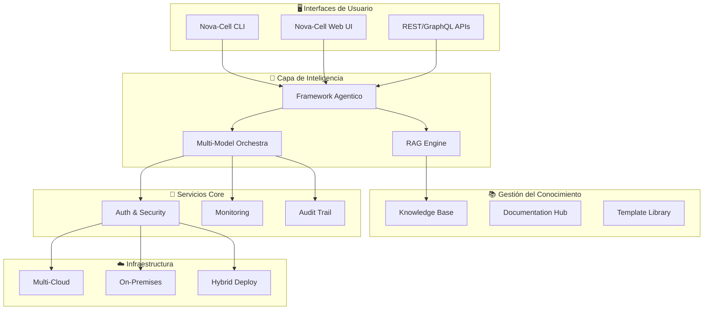

# 🚀 Nova-Cell Platform Hub

## 🎯 Plataforma Unificada de IA para Banca

**Versión:** 2.0.3 | **Status:** Production Ready | **Última Actualización:** Enero 2025

Nova-Cell es la plataforma integral de IA del Centro de Excelencia, diseñada específicamente para acelerar la adopción de inteligencia artificial en el sector bancario mexicano, cumpliendo con todas las regulaciones locales.

## 🌟 ¿Qué es Nova-Cell?

Nova-Cell es una **plataforma empresarial end-to-end** que unifica todos los componentes necesarios para desarrollar, desplegar y gestionar aplicaciones de IA en un entorno bancario regulado:

<div style="background: linear-gradient(135deg, #667eea 0%, #764ba2 100%); padding: 20px; border-radius: 10px; color: white; margin: 20px 0;">
  <h3 style="margin-top: 0;">🎯 Nuestra Misión</h3>
  <p><strong>"Democratizar el acceso a IA de vanguardia mientras garantizamos seguridad bancaria, cumplimiento regulatorio y excelencia operacional"</strong></p>
</div>

## 🏗️ Arquitectura de la Plataforma



## 🛠️ Componentes Principales

### 1️⃣ [Nova-Cell CLI](./nova-cell-cli.md)
**Herramienta de línea de comandos para desarrolladores**

```bash
# Instalación rápida
pip install nova-cell-cli

# Comandos esenciales
nova init my-ai-project        # Crear proyecto
nova deploy --env production   # Desplegar a producción
nova monitor --dashboard       # Monitoreo en tiempo real
nova test --compliance cnbv    # Validación regulatoria
```

**Características:**
- 🚀 Desarrollo rápido con scaffolding automático
- 🔧 Gestión de modelos y versiones
- 📊 Métricas y monitoreo integrado
- ✅ Validación de compliance automática

[**→ Ir a Documentación CLI**](./nova-cell-cli.md)

---

### 2️⃣ [Nova-Cell Web UI](./nova-cell-webui.md)
**Interfaz gráfica intuitiva para todos los usuarios**

<div style="border: 2px solid #e2e8f0; border-radius: 8px; padding: 15px; margin: 15px 0;">
  <h4>🎨 Características de la Interfaz</h4>
  <ul>
    <li>✨ <strong>No-Code/Low-Code:</strong> Construye flujos de IA sin programar</li>
    <li>📊 <strong>Dashboards Interactivos:</strong> Visualiza métricas en tiempo real</li>
    <li>🔄 <strong>Gestión de Workflows:</strong> Diseña y ejecuta pipelines complejos</li>
    <li>👥 <strong>Colaboración:</strong> Comparte proyectos y resultados</li>
  </ul>
</div>

**Módulos Disponibles:**
- **Project Manager:** Gestión integral de proyectos de IA
- **Model Studio:** Entrenamiento y evaluación de modelos
- **Data Explorer:** Análisis y preparación de datos
- **Compliance Center:** Validación regulatoria y auditoría

[**→ Acceder a Web UI**](https://nova-cell.banco.mx) | [**→ Ver Guía de Usuario**](./nova-cell-webui.md)

---

### 3️⃣ [Framework Agentico](./nova-cell-agentic.md)
**Sistema multi-agente autónomo para tareas complejas**

```python
from nova_cell.agentic import AgentOrchestrator, Agent

# Crear orquestador de agentes
orchestrator = AgentOrchestrator()

# Definir agentes especializados
analyst = Agent(
    name="financial_analyst",
    role="Analizar datos financieros",
    capabilities=["data_analysis", "risk_assessment", "reporting"]
)

validator = Agent(
    name="compliance_validator",
    role="Validar cumplimiento regulatorio",
    capabilities=["cnbv_check", "basel_validation", "audit_trail"]
)

# Ejecutar tarea compleja
result = orchestrator.execute(
    task="Evaluar solicitud de crédito empresarial",
    agents=[analyst, validator],
    context=customer_data
)
```

**Capacidades Agenticas:**
- 🧠 **Razonamiento Autónomo:** Agentes que toman decisiones independientes
- 🔄 **Colaboración Multi-Agente:** Coordinación entre agentes especializados
- 📈 **Aprendizaje Continuo:** Mejora basada en resultados históricos
- 🎯 **Goal-Oriented:** Enfoque en objetivos de negocio

[**→ Explorar Framework Agentico**](./nova-cell-agentic.md)

---

### 4️⃣ [Knowledge Base](./nova-cell-knowledge-base.md)
**Repositorio centralizado de conocimiento bancario**

<div style="background: #f7fafc; border-left: 4px solid #4299e1; padding: 15px; margin: 15px 0;">
  <h4>📚 Contenido del Knowledge Base</h4>
  <table>
    <tr>
      <td><strong>📖 Documentación</strong></td>
      <td>2,500+ páginas de guías y tutoriales</td>
    </tr>
    <tr>
      <td><strong>🏦 Regulaciones</strong></td>
      <td>CNBV, Banxico, CONDUSEF actualizadas</td>
    </tr>
    <tr>
      <td><strong>📋 Templates</strong></td>
      <td>150+ plantillas pre-aprobadas</td>
    </tr>
    <tr>
      <td><strong>🔬 Best Practices</strong></td>
      <td>Casos de uso probados en producción</td>
    </tr>
  </table>
</div>

**Integración RAG (Retrieval Augmented Generation):**
```python
from nova_cell.knowledge import KnowledgeBase

kb = KnowledgeBase()

# Buscar información regulatoria
regulation = kb.search(
    query="Requisitos CNBV para modelos de riesgo crediticio",
    sources=["regulations", "circulars"],
    date_range="2024-2025"
)

# Generar respuesta aumentada
response = kb.generate_answer(
    question="¿Cómo implementar un modelo de scoring compatible con CNBV?",
    context=regulation,
    citations=True
)
```

[**→ Acceder al Knowledge Base**](./nova-cell-knowledge-base.md)

---

### 5️⃣ [APIs y SDKs](../../../developers/tutorials/api-integration-guide.md)
**Integración programática completa**

<div style="display: grid; grid-template-columns: 1fr 1fr; gap: 20px; margin: 20px 0;">
  <div style="border: 1px solid #e2e8f0; padding: 15px; border-radius: 8px;">
    <h4>🔌 REST API</h4>
    <ul>
      <li>OpenAPI 3.0 Specification</li>
      <li>Rate limiting inteligente</li>
      <li>Webhooks para eventos</li>
      <li>Batch processing</li>
    </ul>
  </div>
  <div style="border: 1px solid #e2e8f0; padding: 15px; border-radius: 8px;">
    <h4>🎨 GraphQL API</h4>
    <ul>
      <li>Schema introspection</li>
      <li>Subscriptions real-time</li>
      <li>Query optimization</li>
      <li>Federation support</li>
    </ul>
  </div>
</div>

**SDKs Oficiales:**
- 🐍 **Python SDK:** `pip install nova-cell-sdk`
- 📦 **Node.js SDK:** `npm install @nova-cell/sdk`
- ☕ **Java SDK:** Maven Central disponible
- 🦀 **Rust SDK:** En desarrollo

---

## 🎯 Casos de Uso Principales

### 🏦 Banca Digital
- **Chatbots Inteligentes:** Atención 24/7 con comprensión contextual
- **Análisis de Documentos:** Procesamiento automático de contratos y solicitudes
- **Detección de Fraude:** Modelos en tiempo real con 99.2% de precisión

### 📊 Risk Management
- **Credit Scoring:** Evaluación automatizada con explicabilidad
- **Portfolio Analysis:** Optimización de riesgo-retorno
- **Stress Testing:** Simulaciones regulatorias automatizadas

### 🤝 Customer Experience
- **Personalización:** Recomendaciones basadas en comportamiento
- **Sentiment Analysis:** Análisis de satisfacción en tiempo real
- **Churn Prevention:** Predicción y retención proactiva

## 🚀 Quick Start

### Opción 1: Cloud (SaaS)
```bash
# Registro en Nova-Cell Cloud
nova cloud register --org "mi-banco"

# Crear primer proyecto
nova create project "mi-primer-ai" --template banking-starter

# Deploy
nova deploy --cloud aws --region us-east-1
```

### Opción 2: On-Premises
```bash
# Descargar instalador
wget https://nova-cell.banco.mx/installer/latest

# Instalación completa
./nova-cell-installer --mode on-premises \
  --license $LICENSE_KEY \
  --admin-email admin@banco.mx

# Verificar instalación
nova doctor --full-check
```

### Opción 3: Hybrid
```yaml
# nova-cell.config.yml
deployment:
  mode: hybrid
  compute:
    training: on-premises  # Datos sensibles
    inference: cloud       # Escalabilidad
  storage:
    primary: on-premises
    backup: cloud
  compliance:
    data-residency: mexico
    encryption: end-to-end
```

## 📊 Métricas de Éxito

<div style="background: linear-gradient(to right, #f6f9fc 0%, #e9f3ff 100%); padding: 20px; border-radius: 10px; margin: 20px 0;">
  <h3>🎯 Resultados Comprobados</h3>
  <div style="display: grid; grid-template-columns: repeat(4, 1fr); gap: 15px; text-align: center;">
    <div>
      <h4 style="color: #4299e1; margin: 5px 0;">75%</h4>
      <p style="margin: 0; font-size: 0.9em;">Reducción en tiempo de desarrollo</p>
    </div>
    <div>
      <h4 style="color: #48bb78; margin: 5px 0;">99.9%</h4>
      <p style="margin: 0; font-size: 0.9em;">Uptime garantizado</p>
    </div>
    <div>
      <h4 style="color: #ed8936; margin: 5px 0;">2.5x</h4>
      <p style="margin: 0; font-size: 0.9em;">Mejora en productividad</p>
    </div>
    <div>
      <h4 style="color: #9f7aea; margin: 5px 0;">100%</h4>
      <p style="margin: 0; font-size: 0.9em;">Compliance regulatorio</p>
    </div>
  </div>
</div>

## 🔒 Seguridad y Compliance

### Certificaciones
- ✅ **ISO 27001** - Gestión de Seguridad de la Información
- ✅ **SOC 2 Type II** - Controles de Seguridad
- ✅ **PCI DSS** - Seguridad de Datos de Tarjetas
- ✅ **CNBV Compliant** - Normativa Bancaria Mexicana

### Características de Seguridad
- 🔐 **Encriptación E2E:** AES-256 en reposo, TLS 1.3 en tránsito
- 🔑 **Zero Trust Architecture:** Verificación continua
- 📝 **Audit Trail Inmutable:** Blockchain para trazabilidad
- 🛡️ **DLP (Data Loss Prevention):** Protección de datos sensibles

## 📚 Recursos y Documentación

### 📖 Documentación Técnica
- [API Reference](../../../developers/tutorials/api-integration-guide.md)
- [Developer Guide](../../../developers/guides/nova-cell-installation-guide.md)
- [Architecture Deep Dive](../../technical/nova-cell-developer-guide.md)

### 🎓 Aprendizaje
- [Nova-Cell Academy](../../../developers/academy/curriculum-desarrolladores-ai.md)
- [Video Tutorials](https://learning.banco.mx/nova-cell)
- [Certificación Oficial](https://cert.nova-cell.mx)

### 💡 Soporte
- [Community Forum](https://community.nova-cell.mx)
- [Stack Overflow](https://stackoverflow.com/questions/tagged/nova-cell)
- [GitHub Issues](https://github.com/banco/nova-cell/issues)

## 🗺️ Roadmap 2025

### Q1 2025
- ✨ **AutoML Integration:** Entrenamiento automático de modelos
- 🌐 **Multi-language Support:** Soporte para 10+ idiomas
- 📱 **Mobile SDK:** iOS y Android nativo

### Q2 2025
- 🧠 **Neural Architecture Search:** Optimización automática
- 🔄 **Federated Learning:** Entrenamiento distribuido
- 🎯 **Industry Templates:** Plantillas específicas por sector

### Q3 2025
- 🤖 **AGI Capabilities:** Capacidades generales avanzadas
- 🌍 **Global Expansion:** Compliance multi-país
- 🚀 **Quantum Ready:** Preparación para computación cuántica

## 🤝 Comunidad y Ecosistema

### Partners Tecnológicos
<div style="display: flex; justify-content: space-around; align-items: center; padding: 20px; background: #f7fafc; border-radius: 10px;">
  <div>🤖 OpenAI</div>
  <div>🧠 Anthropic</div>
  <div>🔷 Microsoft Azure</div>
  <div>☁️ AWS</div>
  <div>🌐 Google Cloud</div>
</div>

### Contribuir
¿Interesado en contribuir a Nova-Cell? 

- 📝 [Contribution Guidelines](https://github.com/banco/nova-cell/CONTRIBUTING.md)
- 🐛 [Report Issues](https://github.com/banco/nova-cell/issues)
- 💡 [Feature Requests](https://feedback.nova-cell.mx)

## 📞 Contacto

<div style="background: #f7fafc; padding: 20px; border-radius: 10px; margin: 20px 0;">
  <h3>🆘 ¿Necesitas Ayuda?</h3>
  <table style="width: 100%;">
    <tr>
      <td><strong>📧 Email:</strong></td>
      <td>nova-support@banco.mx</td>
    </tr>
    <tr>
      <td><strong>📞 Teléfono:</strong></td>
      <td>+52 55 1234 5678</td>
    </tr>
    <tr>
      <td><strong>💬 Chat:</strong></td>
      <td>Portal interno → Nova-Cell Support</td>
    </tr>
    <tr>
      <td><strong>📍 Presencial:</strong></td>
      <td>Torre IA, Piso 15, Santa Fe</td>
    </tr>
  </table>
</div>

---

<div style="text-align: center; padding: 20px; background: linear-gradient(135deg, #667eea 0%, #764ba2 100%); color: white; border-radius: 10px;">
  <h2 style="margin: 0;">🚀 ¿Listo para transformar tu banco con IA?</h2>
  <p style="margin: 10px 0;">Únete a más de 50 instituciones que ya confían en Nova-Cell</p>
  <div style="margin-top: 20px;">
    <a href="./nova-cell-cli.md" style="background: white; color: #667eea; padding: 10px 20px; border-radius: 5px; text-decoration: none; margin: 0 10px;">Comenzar con CLI</a>
    <a href="./nova-cell-webui.md" style="background: white; color: #764ba2; padding: 10px 20px; border-radius: 5px; text-decoration: none; margin: 0 10px;">Explorar Web UI</a>
    <a href="https://demo.nova-cell.mx" style="background: white; color: #667eea; padding: 10px 20px; border-radius: 5px; text-decoration: none; margin: 0 10px;">Ver Demo</a>
  </div>
</div>

---

*Nova-Cell Platform v2.0.3 | Centro de Excelencia de IA | Enero 2025*