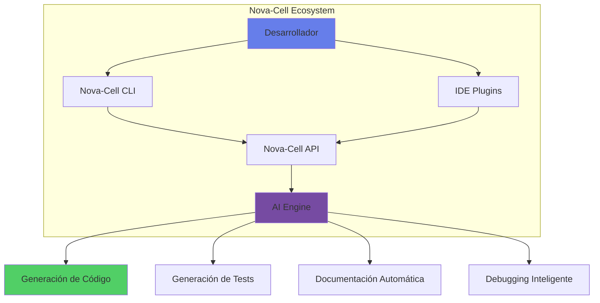

# 🚀 Nova-Cell Knowledge Base

## La Plataforma de Productividad con IA para Desarrolladores

### 🌟 ¿Qué es Nova-Cell?

Nova-Cell es nuestra plataforma empresarial que potencia a los desarrolladores tradicionales con capacidades de IA, permitiéndoles ser hasta 10x más productivos en sus tareas diarias de desarrollo, sin necesidad de ser expertos en inteligencia artificial.



## 🎯 Casos de Uso Principales

### Para Desarrolladores Backend
- 🔧 Generación automática de APIs REST/GraphQL
- 🗄️ Creación de modelos y migraciones de base de datos
- 🔐 Implementación de autenticación y autorización
- 📝 Documentación OpenAPI/Swagger automática
- ✅ Tests unitarios y de integración

### Para Desarrolladores Frontend
- 🎨 Generación de componentes React/Vue/Angular
- 📱 Layouts responsive automáticos
- 🔄 State management boilerplate
- 🎭 Tests de componentes y E2E
- ♿ Accesibilidad automática

### Para Full-Stack Developers
- 🏗️ Scaffolding de proyectos completos
- 🔗 Integración frontend-backend
- 🚀 Configuración de CI/CD
- 📊 Dashboard de métricas
- 🔍 End-to-end testing

## 💡 Características Clave

### 1. Generación Inteligente de Código

```python
# Simplemente describe lo que necesitas
# @nova-cell: crear servicio de autenticación con JWT y refresh tokens

# Nova-Cell genera:
from fastapi import FastAPI, Depends, HTTPException, status
from fastapi.security import OAuth2PasswordBearer, OAuth2PasswordRequestForm
from jose import JWTError, jwt
from passlib.context import CryptContext
from datetime import datetime, timedelta
from typing import Optional
import os

class AuthService:
    def __init__(self):
        self.pwd_context = CryptContext(schemes=["bcrypt"], deprecated="auto")
        self.SECRET_KEY = os.getenv("SECRET_KEY", "your-secret-key")
        self.ALGORITHM = "HS256"
        self.ACCESS_TOKEN_EXPIRE_MINUTES = 30
        self.REFRESH_TOKEN_EXPIRE_DAYS = 7
        
    def verify_password(self, plain_password: str, hashed_password: str) -> bool:
        """Verifica que la contraseña coincida con el hash"""
        return self.pwd_context.verify(plain_password, hashed_password)
    
    def get_password_hash(self, password: str) -> str:
        """Genera hash de la contraseña"""
        return self.pwd_context.hash(password)
    
    def create_access_token(self, data: dict, expires_delta: Optional[timedelta] = None):
        """Crea un JWT access token"""
        to_encode = data.copy()
        if expires_delta:
            expire = datetime.utcnow() + expires_delta
        else:
            expire = datetime.utcnow() + timedelta(minutes=self.ACCESS_TOKEN_EXPIRE_MINUTES)
        
        to_encode.update({"exp": expire, "type": "access"})
        encoded_jwt = jwt.encode(to_encode, self.SECRET_KEY, algorithm=self.ALGORITHM)
        return encoded_jwt
    
    def create_refresh_token(self, data: dict):
        """Crea un JWT refresh token"""
        to_encode = data.copy()
        expire = datetime.utcnow() + timedelta(days=self.REFRESH_TOKEN_EXPIRE_DAYS)
        to_encode.update({"exp": expire, "type": "refresh"})
        encoded_jwt = jwt.encode(to_encode, self.SECRET_KEY, algorithm=self.ALGORITHM)
        return encoded_jwt
    
    def verify_token(self, token: str, token_type: str = "access"):
        """Verifica y decodifica un token JWT"""
        try:
            payload = jwt.decode(token, self.SECRET_KEY, algorithms=[self.ALGORITHM])
            if payload.get("type") != token_type:
                raise HTTPException(
                    status_code=status.HTTP_401_UNAUTHORIZED,
                    detail="Invalid token type"
                )
            return payload
        except JWTError:
            raise HTTPException(
                status_code=status.HTTP_401_UNAUTHORIZED,
                detail="Could not validate credentials"
            )
```

### 2. Testing Automático Inteligente

```javascript
// Tu componente React
function ShoppingCart({ items, onCheckout, onRemoveItem }) {
  const total = items.reduce((sum, item) => sum + item.price * item.quantity, 0);
  
  return (
    <div className="shopping-cart">
      {items.map(item => (
        <CartItem key={item.id} item={item} onRemove={onRemoveItem} />
      ))}
      <div className="total">Total: ${total.toFixed(2)}</div>
      <button onClick={() => onCheckout(items)} disabled={items.length === 0}>
        Checkout
      </button>
    </div>
  );
}

// @nova-cell: genera tests completos incluyendo edge cases

// Nova-Cell genera:
import { render, screen, fireEvent, waitFor } from '@testing-library/react';
import '@testing-library/jest-dom';
import ShoppingCart from './ShoppingCart';

describe('ShoppingCart Component', () => {
  const mockOnCheckout = jest.fn();
  const mockOnRemoveItem = jest.fn();
  
  const sampleItems = [
    { id: 1, name: 'Product 1', price: 10.99, quantity: 2 },
    { id: 2, name: 'Product 2', price: 5.50, quantity: 1 }
  ];
  
  beforeEach(() => {
    jest.clearAllMocks();
  });
  
  test('renders empty cart correctly', () => {
    render(
      <ShoppingCart 
        items={[]} 
        onCheckout={mockOnCheckout} 
        onRemoveItem={mockOnRemoveItem} 
      />
    );
    
    expect(screen.getByText('Total: $0.00')).toBeInTheDocument();
    expect(screen.getByRole('button', { name: /checkout/i })).toBeDisabled();
  });
  
  test('calculates total correctly', () => {
    render(
      <ShoppingCart 
        items={sampleItems} 
        onCheckout={mockOnCheckout} 
        onRemoveItem={mockOnRemoveItem} 
      />
    );
    
    // 10.99 * 2 + 5.50 * 1 = 27.48
    expect(screen.getByText('Total: $27.48')).toBeInTheDocument();
  });
  
  test('enables checkout button when items present', () => {
    render(
      <ShoppingCart 
        items={sampleItems} 
        onCheckout={mockOnCheckout} 
        onRemoveItem={mockOnRemoveItem} 
      />
    );
    
    const checkoutButton = screen.getByRole('button', { name: /checkout/i });
    expect(checkoutButton).toBeEnabled();
  });
  
  test('calls onCheckout with items when checkout clicked', () => {
    render(
      <ShoppingCart 
        items={sampleItems} 
        onCheckout={mockOnCheckout} 
        onRemoveItem={mockOnRemoveItem} 
      />
    );
    
    fireEvent.click(screen.getByRole('button', { name: /checkout/i }));
    expect(mockOnCheckout).toHaveBeenCalledWith(sampleItems);
    expect(mockOnCheckout).toHaveBeenCalledTimes(1);
  });
  
  test('handles items with zero price correctly', () => {
    const freeItems = [
      { id: 1, name: 'Free Sample', price: 0, quantity: 5 }
    ];
    
    render(
      <ShoppingCart 
        items={freeItems} 
        onCheckout={mockOnCheckout} 
        onRemoveItem={mockOnRemoveItem} 
      />
    );
    
    expect(screen.getByText('Total: $0.00')).toBeInTheDocument();
  });
  
  test('handles large quantities and prices correctly', () => {
    const expensiveItems = [
      { id: 1, name: 'Expensive Item', price: 999999.99, quantity: 100 }
    ];
    
    render(
      <ShoppingCart 
        items={expensiveItems} 
        onCheckout={mockOnCheckout} 
        onRemoveItem={mockOnRemoveItem} 
      />
    );
    
    expect(screen.getByText('Total: $99999999.00')).toBeInTheDocument();
  });
});
```

### 3. Documentación Automática

Nova-Cell genera documentación completa y actualizada automáticamente:

- 📖 README.md con instrucciones de instalación y uso
- 📐 Diagramas de arquitectura
- 🔗 Documentación de APIs (OpenAPI/Swagger)
- 📝 JSDoc/PyDoc para funciones
- 🗂️ Guías de contribución
- 📊 Reportes de cobertura de tests

### 4. Debugging Asistido por IA

```typescript
// Tienes un error complicado
// @nova-cell: debug - usuarios reportan que el carrito se vacía aleatoriamente

// Nova-Cell analiza y encuentra:
/*
🔍 ANÁLISIS DE NOVA-CELL:

PROBLEMA IDENTIFICADO: Race condition en el estado del carrito

CAUSA RAÍZ:
El carrito se almacena en localStorage y en el estado de React simultáneamente.
Cuando múltiples pestañas están abiertas, los cambios en una pestaña no se 
sincronizan correctamente con las otras.

SOLUCIÓN PROPUESTA:
*/

import { useState, useEffect, useCallback } from 'react';

// Implementar un hook personalizado con sincronización entre pestañas
function useShoppingCart() {
  const [items, setItems] = useState([]);
  const STORAGE_KEY = 'shopping_cart';
  
  // Cargar carrito inicial del localStorage
  useEffect(() => {
    const stored = localStorage.getItem(STORAGE_KEY);
    if (stored) {
      setItems(JSON.parse(stored));
    }
  }, []);
  
  // Escuchar cambios de otras pestañas
  useEffect(() => {
    const handleStorageChange = (e) => {
      if (e.key === STORAGE_KEY && e.newValue) {
        setItems(JSON.parse(e.newValue));
      }
    };
    
    window.addEventListener('storage', handleStorageChange);
    return () => window.removeEventListener('storage', handleStorageChange);
  }, []);
  
  // Función para actualizar el carrito
  const updateCart = useCallback((newItems) => {
    setItems(newItems);
    localStorage.setItem(STORAGE_KEY, JSON.stringify(newItems));
    
    // Disparar evento personalizado para sincronización en la misma pestaña
    window.dispatchEvent(new CustomEvent('cartUpdated', { 
      detail: newItems 
    }));
  }, []);
  
  return { items, updateCart };
}
```

## 🛠️ Herramientas y Componentes

### Nova-Cell CLI

```bash
# Instalación
npm install -g @banco/nova-cell-cli

# Comandos principales
nova-cell init                    # Inicializa proyecto
nova-cell generate component      # Genera componente
nova-cell generate api            # Genera API
nova-cell test                    # Genera y ejecuta tests
nova-cell document                # Genera documentación
nova-cell optimize                # Optimiza código
nova-cell security-scan           # Escanea vulnerabilidades
```

### IDE Plugins

| IDE | Features | Instalación |
|-----|----------|-------------|
| **VS Code** | • Autocompletado<br>• Snippets<br>• Refactoring<br>• Quick fixes | `ext install nova-cell.vscode` |
| **IntelliJ IDEA** | • Code generation<br>• Live templates<br>• Inspections | Via Plugin Marketplace |
| **Visual Studio** | • IntelliSense<br>• Code actions<br>• Debugging | Via Extensions |
| **Sublime Text** | • Completions<br>• Build systems | Package Control |

### Nova-Cell API

```python
from nova_cell import NovaCellClient

client = NovaCellClient(api_key="your-api-key")

# Generar código
code = client.generate_code(
    description="REST API for user management with CRUD operations",
    language="python",
    framework="fastapi"
)

# Generar tests
tests = client.generate_tests(
    code=code,
    coverage_target=90,
    include_edge_cases=True
)

# Optimizar código existente
optimized = client.optimize(
    code=existing_code,
    targets=["performance", "security", "readability"]
)

# Generar documentación
docs = client.generate_docs(
    code=code,
    format="markdown",
    include_examples=True
)
```

## 📊 Métricas y Analytics

### Dashboard Personal

Nova-Cell trackea y muestra tu productividad:

```
╔══════════════════════════════════════════════════════════╗
║           NOVA-CELL PRODUCTIVITY DASHBOARD               ║
╠══════════════════════════════════════════════════════════╣
║                                                          ║
║  📈 Esta Semana                                         ║
║  ├─ Código generado:        3,847 líneas                ║
║  ├─ Tests creados:          142 casos                   ║
║  ├─ Bugs prevenidos:        23                          ║
║  ├─ Tiempo ahorrado:        18.5 horas                  ║
║  └─ Productividad:          +47% vs semana anterior     ║
║                                                          ║
║  🏆 Achievements                                         ║
║  ├─ "Speed Coder" - 1000+ líneas en un día ✓           ║
║  ├─ "Test Master" - 100% coverage achieved ✓            ║
║  └─ "Bug Hunter" - 50 bugs prevenidos      🔒           ║
║                                                          ║
║  💡 Sugerencias                                          ║
║  • Usa más templates personalizados para mayor speed    ║
║  • Activa el modo "pair programming" con Nova-Cell      ║
║                                                          ║
╚══════════════════════════════════════════════════════════╝
```

## 🔒 Seguridad y Compliance

### Arquitectura de Seguridad (IA Gobernada)

Nova-Cell implementa **seguridad de extremo a extremo** con múltiples capas de protección específicamente diseñadas para el sector financiero:

#### 🛡️ Capas de Seguridad

1. **Control de Acceso Zero Trust**
   - Gateway de autenticación para VPC
   - SSO corporativo con MFA requerido
   - Logs de acceso por cada login
   - Control por dispositivo y geolocalización

2. **Infraestructura VPC Privada**
   - Residencia de datos en AWS Querétaro
   - Sin exposición a internet público
   - Solo endpoints privados
   - Acceso controlado por capa Zero Trust

3. **Endpoints LLM Privados**
   - ✅ Sin uso de datos para entrenamiento
   - ✅ Sin compartir información
   - ✅ Solo procesamiento efímero
   - ✅ Encriptación de extremo a extremo

4. **Gestión y Monitoreo Completo**
   - **LangFuse**: Atribución y rastreo de tokens
   - **Atribución Git**: Logs de sesión completos
   - **Rastreo de Costos**: Control financiero granular
   - **Cumplimiento**: Auditoría automática

#### 🏦 Compliance Bancario Específico

**Marco Regulatorio Integrado:**
- ✅ **CNBV**: Cumplimiento normativo mexicano
- ✅ **PCI-DSS**: Protección de datos de tarjetas
- ✅ **SOX**: Controles financieros
- ✅ **ISO 27001**: Gestión de seguridad de información
- ✅ **ISO 42001**: IA responsable
- ✅ **ISO 23053**: Mitigación de sesgo algorítmico

#### 📊 Trazabilidad Total

**Características del Sistema de Auditoría:**
- **24/7** - Métricas capturadas continuamente
- **5 años** - Retención de logs
- **Tiempo Real** - Detección de anomalías
- **100% Cobertura** - Trazabilidad completa
- **Por Desarrollador** - Granularidad individual

### Configuración de Seguridad

```yaml
# nova-cell.config.yml
security:
  # Control de acceso
  access_control:
    authentication: "corporate_sso"
    mfa_required: true
    session_timeout: 480  # 8 horas
    device_registration: true

  # Residencia de datos
  data_sovereignty:
    region: "mx-central-1"  # AWS Querétaro
    data_locality: "mexico"
    cross_border_transfer: false

  # Filtros de datos sensibles
  data_protection:
    never_send: ["passwords", "api_keys", "tokens", "pii", "financial_data"]
    mask_patterns:
      - "\\b\\d{4}-\\d{4}-\\d{4}-\\d{4}\\b"  # Credit cards
      - "\\b[A-Z]{4}\\d{6}[A-Z0-9]{2}\\b"   # CLABE
      - "\\b\\d{3}-\\d{2}-\\d{4}\\b"        # SSN patterns
    exclude_files: ["*.env", "*.key", "*.pem", "*.p12", "*.jks"]

  # Validación de código generado
  code_validation:
    vulnerability_scan: true
    dependency_check: true
    license_compliance: true
    security_patterns: true
    compliance_rules: ["PCI_DSS", "ISO_27001", "CNBV"]

  # Compliance bancario
  compliance:
    standards: ["PCI_DSS", "ISO_27001", "SOX", "CNBV", "ISO_42001", "ISO_23053"]
    risk_assessment: "continuous"
    bias_detection: true
    explainability: "required"

  # Auditoría y monitoreo
  audit:
    log_all_generations: true
    log_all_access: true
    retention_days: 1825  # 5 años
    real_time_monitoring: true
    anomaly_detection: true
    compliance_reporting: "automated"

  # Gestión de riesgos IA
  ai_governance:
    model_validation: "mandatory"
    human_oversight: "required"
    fallback_mechanisms: true
    performance_monitoring: "continuous"
    drift_detection: true
```

## 🎓 Recursos de Aprendizaje

### Tutoriales Interactivos

1. **Getting Started** (30 min)
   - Instalación y configuración
   - Primer código generado
   - Integración con tu IDE

2. **Intermediate** (2 horas)
   - Templates personalizados
   - Workflows avanzados
   - Optimización de prompts

3. **Advanced** (4 horas)
   - Arquitecturas complejas
   - Integración CI/CD
   - Custom plugins

### Video Tutorials

- 🎥 [Nova-Cell en 5 minutos](https://learning.novasolutionsystems.com/nova-cell/intro)
- 🎥 [De cero a API en 15 minutos](https://learning.novasolutionsystems.com/nova-cell/api)
- 🎥 [Testing automático con Nova-Cell](https://learning.novasolutionsystems.com/nova-cell/testing)

### Documentación

- 📚 [Guía Completa](https://docs.nova-cell.novasolutionsystems.com)
- 📚 [API Reference](https://api.nova-cell.novasolutionsystems.com/docs)
- 📚 [Best Practices](https://docs.nova-cell.novasolutionsystems.com/best-practices)
- 📚 [Troubleshooting](https://docs.nova-cell.novasolutionsystems.com/troubleshooting)

## 🤝 Comunidad y Soporte

### Canales de Comunicación

- **Slack**: #nova-cell-users (1,500+ miembros)
- **Teams**: Nova-Cell Community
- **Forum**: forum.nova-cell.novasolutionsystems.com
- **Stack Overflow**: [nova-cell] tag

### Office Hours

- **Martes 15:00-16:00**: Tips & Tricks
- **Jueves 11:00-12:00**: Advanced Techniques
- **Viernes 16:00-17:00**: Q&A General

### Soporte Técnico

- 📧 **Email**: ai@novasolutionsystems.com
- 💬 **Chat**: Disponible en horario laboral
- 📞 **Hotline**: ext. 7777 (urgencias)
- 🎫 **Tickets**: support.nova-cell.novasolutionsystems.com

## 🚀 Roadmap y Evolución

### Fases de Madurez IA en Desarrollo

Nova-Cell está diseñado para evolucionar a través de las **3 fases de transformación IA** identificadas en nuestro análisis del sector financiero:

#### Fase 1: IA como Asistente (Actual - 2025)
**Características:**
- IA ayuda con sugerencias y automatización
- GitHub Copilot, autocompleta código
- Acelera tareas individuales
- **ROI esperado**: 1.4x-1.9x productividad

**Funcionalidades actuales:**
- ✅ Soporte para React Native
- ✅ Generación de microservicios
- 🔄 AI Pair Programming mode
- 🔄 Voice commands

#### Fase 2: Equipos Híbridos Humano/Agentes (2025-2026)
**Características:**
- Agentes IA como colaboradores digitales del equipo
- IA redacta test cases y refactoriza código bajo comando
- Reduce bloques sustanciales de trabajo
- **ROI esperado**: 2.2x-2.5x productividad

**Roadmap Q2-Q4 2025:**
- 📅 **Squad Aumentado Nova**: Equipos híbridos completos
- 📅 **Arquitecto de Adopción IA**: Role especializado
- 📅 **Framework IMPACT**: Métricas predictivas
- 📅 **Multi-modelo Router**: Selección inteligente de LLMs
- 📅 Integración con Jira/Azure DevOps
- 📅 Custom model training para contexto bancario

#### Fase 3: Liderado por Humanos, Operado por Agentes (2026-2027)
**Características:**
- Agentes IA ejecutan workflows completos con mínima intervención
- IA construye, prueba y despliega microservicios según indicaciones
- Escala y velocidad dramáticas
- **ROI esperado**: 3x+ productividad

**Roadmap 2026-2027:**
- 📅 **Nova Cell 2.0**: Bring Your Own Cloud
- 📅 **Architecture generation**: Diseño automático de sistemas
- 📅 **Performance optimization AI**: Optimización continua
- 📅 **Security audit automation**: Auditorías autónomas
- 📅 **Full autonomy mode**: Desarrollo end-to-end

### Evolución Tecnológica

#### 2025: Nova Cell 1.0 (AWS Administrado)
- Plataforma SaaS totalmente gestionada
- Residencia de datos en AWS Querétaro
- Compliance bancario pre-configurado

#### 2026: Nova Cell 2.0 (Azure Native Blueprint)
- **"Bring Your Own Cloud"**
- Código IaC transferible
- Control total del cliente

#### 2027: Nova Cell 2.1 (Multi-Cloud + On-Premise)
- Blueprints para AWS, Azure, Google Cloud
- Despliegue on-premise con OpenShift
- Autonomía tecnológica completa

## 💰 ROI y Casos de Éxito

### Framework IMPACT: Métricas de Adopción

Basado en nuestro análisis de transformación IA en el sector financiero, Nova-Cell utiliza el **Framework IMPACT** para medir y garantizar el éxito de la implementación:

#### 📊 Las 6 Métricas Críticas que Predicen el Éxito

| Métrica | Zona Óptima | Señal de Alerta | Descripción |
|---------|-------------|-----------------|-------------|
| **Tasa de Aceptación** | 25%-40% | <15% ó >60% | Porcentaje de sugerencias de IA aceptadas por desarrolladores |
| **Time to First Value** | <15 minutos | >30 minutos | Tiempo hasta obtener el primer resultado útil |
| **Adopción Semanal** | 60%-70% | <40% | Porcentaje de desarrolladores usando la herramienta semanalmente |
| **Flow Efficiency** | +20%-30% | Sin mejora | Mejora en tiempo productivo sin interrupciones |
| **ROI** | 150% (6 meses) | <100% | Retorno sobre inversión esperado |
| **Productividad** | 2.2x-2.5x | <1.5x | Multiplicador de velocidad en tareas específicas |

#### 🕐 Curva de Adopción de 11 Semanas

**Expectativas Realistas por Fase:**

| Semanas | Fase | Productividad | Adopción | Características |
|---------|------|---------------|----------|-----------------|
| **1-3** | Fricción Inicial | 0.8x-1.1x | 20% | Curva de aprendizaje, resistencia natural |
| **4-6** | Adaptación | 1.4x | 40% | Recuperación gradual, primeros quick wins |
| **7-9** | Aceleración | 1.9x | 60% | Confianza establecida |
| **10-11** | Madurez | 2.2x+ | 80% | ROI positivo alcanzado |

#### ⚠️ Sistema de Alerta Temprana

**Señales de Éxito (Leading Indicators):**
- ✅ Tasa de aceptación estable entre 25-40%
- ✅ TTFV consistentemente bajo 15 minutos
- ✅ Crecimiento semanal de usuarios +5%
- ✅ Developer NPS >20
- ✅ Uso diario promedio >30 minutos

**Señales de Alerta (6-8 semanas antes del fracaso):**
- 🚨 Caída del 30% en uso de features
- 🚨 Reducción 50% en uso semanal
- 🚨 Tasa de aceptación <15%
- 🚨 Incremento >40% en bugs post-IA
- 🚨 Developer NPS negativo

### Métricas de Impacto Comparativo

| Métrica | Antes de Nova-Cell | Con Nova-Cell | Mejora | Industria Benchmark |
|---------|-------------------|---------------|--------|-------------------|
| **Tiempo desarrollo feature** | 2 semanas | 5 días | -64% | -45% a -55% |
| **Bugs en producción** | 8.3 por release | 2.1 por release | -75% | -40% a -50% |
| **Coverage de tests** | 45% | 87% | +93% | +40% a +50% |
| **Tiempo en documentación** | 20% del sprint | 2% del sprint | -90% | -30% a -40% |
| **Satisfacción desarrollador** | 6.2/10 | 8.9/10 | +44% | +20% a +30% |

### Testimonios

> "Nova-Cell cambió completamente mi forma de trabajar. Ahora me enfoco en la lógica de negocio mientras Nova-Cell se encarga del boilerplate."
> — **Miguel A., Senior Backend Developer**

> "La generación automática de tests me salvó incontables horas. Los tests que genera Nova-Cell son mejores que los que yo escribía."
> — **Laura S., Frontend Developer**

> "Como Tech Lead, Nova-Cell me ayuda a mantener consistencia en el código del equipo y acelerar el onboarding de nuevos developers."
> — **Roberto C., Tech Lead**

## 🎯 Comenzar Ahora

### 3 Pasos para Empezar

1. **Instala Nova-Cell CLI**
   ```bash
   npm install -g @banco/nova-cell-cli
   nova-cell auth login
   ```

2. **Configura tu proyecto**
   ```bash
   nova-cell init
   nova-cell config --interactive
   ```

3. **Genera tu primer código**
   ```bash
   nova-cell generate --help
   nova-cell generate api users --crud
   ```

---

**¿Listo para multiplicar tu productividad?**

[Instalar Nova-Cell](nova-cell-cli.md){.md-button .md-button--primary}
[Ver Demo en Vivo](https://demo.nova-cell.novasolutionsystems.com){.md-button}
[Unirse a la Comunidad](#comunidad-y-soporte){.md-button}

---

*Centro de Excelencia de IA - Empoderando a cada desarrollador con superpoderes de IA*