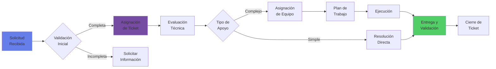

# 🆘 Solicitar Apoyo del CoE

## Tu Portal Único para Soporte en IA

### 🎯 ¿Cómo Podemos Ayudarte?

### 🚀 Necesito empezar un proyecto
Identificación de oportunidades, definición de casos de uso, y roadmap de implementación.

### 🛠️ Tengo un problema técnico
Troubleshooting, debugging, optimización de modelos, y resolución de issues.

### 📚 Requiero capacitación
Workshops, bootcamps, certificaciones, y programas de formación personalizados.

### 🔍 Busco evaluación/auditoría
Assessment de modelos, revisión de arquitectura, auditoría de seguridad, y compliance.

---

## 📝 Formulario de Solicitud de Apoyo

<form id="support-request-form" class="support-form">

### Información del Solicitante

<label for="nombre">Nombre completo*</label>
<input type="text" id="nombre" name="nombre" required>

<label for="email">Email corporativo*</label>
<input type="email" id="email" name="email" required pattern=".*@banco\.mx$">

<label for="telefono">Teléfono/Extensión*</label>
<input type="tel" id="telefono" name="telefono" required>

<label for="squad">Squad/Departamento*</label>
<select id="squad" name="squad" required>
<option value="">Seleccionar...</option>
<option value="digital">Banca Digital</option>
<option value="riesgos">Riesgos</option>
<option value="operaciones">Operaciones</option>
<option value="ti">Tecnología</option>
<option value="innovacion">Innovación</option>
<option value="datos">Data & Analytics</option>
<option value="comercial">Comercial</option>
<option value="rh">Recursos Humanos</option>
</select>

<label for="gerente">Gerente/Sponsor*</label>
<input type="text" id="gerente" name="gerente" required>

### Tipo de Solicitud

<label>Categoría de apoyo requerido*</label>

<label class="radio-card">
<input type="radio" name="categoria" value="consultoria" required>

💡
Consultoría
Estrategia, casos de uso, roadmap

</label>
<label class="radio-card">
<input type="radio" name="categoria" value="desarrollo">

⚙️
Desarrollo
PoC, MVP, implementación

</label>
<label class="radio-card">
<input type="radio" name="categoria" value="soporte">

🔧
Soporte Técnico
Troubleshooting, optimización

</label>
<label class="radio-card">
<input type="radio" name="categoria" value="capacitacion">

🎓
Capacitación
Training, workshops, certificación

</label>
<label class="radio-card">
<input type="radio" name="categoria" value="evaluacion">

📊
Evaluación
Assessment, auditoría, validación

</label>
<label class="radio-card">
<input type="radio" name="categoria" value="gobernanza">

📋
Gobernanza
Compliance, políticas, frameworks

</label>

<label for="prioridad">Prioridad*</label>
<select id="prioridad" name="prioridad" required>
<option value="">Seleccionar...</option>
<option value="critica">🔴 Crítica - Bloqueante para producción (SLA: 4 horas)</option>
<option value="alta">🟠 Alta - Impacto significativo (SLA: 24 horas)</option>
<option value="media">🟡 Media - Importante pero no urgente (SLA: 48 horas)</option>
<option value="baja">🟢 Baja - Mejora o consulta general (SLA: 5 días)</option>
</select>

### Descripción de la Solicitud

<label for="titulo">Título/Resumen*</label>
<input type="text" id="titulo" name="titulo" required maxlength="100" placeholder="Descripción breve del apoyo requerido">

<label for="descripcion">Descripción detallada* (mín. 100 caracteres)</label>
<textarea id="descripcion" name="descripcion" required minlength="100" rows="6" placeholder="Por favor describe:
- Contexto y situación actual
- Problema o necesidad específica
- Resultado esperado
- Restricciones o consideraciones especiales"></textarea>

<label for="impacto">Impacto en el negocio*</label>
<textarea id="impacto" name="impacto" required rows="3" placeholder="¿Cómo afecta esto al negocio? ¿Cuántos usuarios impactados? ¿Pérdida potencial?"></textarea>

### Información Adicional

<label for="proyecto">Proyecto/Iniciativa relacionada</label>
<input type="text" id="proyecto" name="proyecto" placeholder="Nombre del proyecto si aplica">

<label for="presupuesto">Presupuesto disponible</label>
<select id="presupuesto" name="presupuesto">
<option value="">No definido</option>
<option value="0-10k">< $10,000 USD</option>
<option value="10-50k">$10,000 - $50,000 USD</option>
<option value="50-100k">$50,000 - $100,000 USD</option>
<option value="100k+">> $100,000 USD</option>
</select>

<label for="fecha_requerida">Fecha requerida</label>
<input type="date" id="fecha_requerida" name="fecha_requerida" min="2025-01-20">

<label for="duracion">Duración estimada</label>
<select id="duracion" name="duracion">
<option value="">No definido</option>
<option value="dias">Días</option>
<option value="semanas">Semanas</option>
<option value="meses">Meses</option>
<option value="ongoing">Ongoing</option>
</select>

<label>Servicios específicos requeridos (opcional)</label>

<label><input type="checkbox" name="servicios" value="arquitectura"> Diseño de arquitectura</label>
<label><input type="checkbox" name="servicios" value="poc"> Desarrollo de PoC</label>
<label><input type="checkbox" name="servicios" value="mlops"> Implementación MLOps</label>
<label><input type="checkbox" name="servicios" value="seguridad"> Evaluación de seguridad</label>
<label><input type="checkbox" name="servicios" value="training"> Training del equipo</label>
<label><input type="checkbox" name="servicios" value="mentoring"> Mentoring/Coaching</label>

<label for="archivos">Adjuntar documentación (opcional)</label>
<input type="file" id="archivos" name="archivos" multiple accept=".pdf,.doc,.docx,.xlsx,.pptx,.png,.jpg">
<small>Máximo 5 archivos, 10MB cada uno</small>

<label for="comentarios">Comentarios adicionales</label>
<textarea id="comentarios" name="comentarios" rows="3"></textarea>

### Confirmación

<label class="checkbox-label">
<input type="checkbox" name="urgente" value="si">
<strong>⚡ Marcar como URGENTE</strong> (requiere justificación y aprobación gerencial)
</label>

<label class="checkbox-label">
<input type="checkbox" name="terminos" required>
Confirmo que la información proporcionada es correcta y que cuento con la aprobación de mi gerente para esta solicitud*
</label>

<button type="submit" class="btn-primary">Enviar Solicitud</button>
<button type="button" class="btn-secondary" onclick="saveDraft()">Guardar Borrador</button>
<button type="reset" class="btn-tertiary">Limpiar Formulario</button>

</form>

---

## ⏱️ SLAs de Respuesta

### Tiempos de Respuesta Comprometidos

| Prioridad | Primera Respuesta | Asignación de Recursos | Resolución/Plan de Acción |
|-----------|------------------|----------------------|---------------------------|
| 🔴 **Crítica** | 1 hora | 4 horas | 24 horas |
| 🟠 **Alta** | 4 horas | 24 horas | 48 horas |
| 🟡 **Media** | 24 horas | 48 horas | 5 días hábiles |
| 🟢 **Baja** | 48 horas | 5 días hábiles | 10 días hábiles |

### Horario de Atención

- **Soporte Regular:** Lunes a Viernes, 9:00 - 18:00 hrs
- **Soporte Extendido:** Lunes a Viernes, 7:00 - 22:00 hrs (con cargo adicional)
- **Soporte 24/7:** Solo para servicios críticos con contrato enterprise

---

## 🔄 Proceso de Atención

---

## 📊 Tracking de tu Solicitud

### Estados de la Solicitud

📥
<h4>Recibida</h4>

Tu solicitud ha sido registrada en nuestro sistema

👀
<h4>En Revisión</h4>

Estamos evaluando los requerimientos y recursos necesarios

👥
<h4>Asignada</h4>

Un especialista ha sido asignado a tu solicitud

⚙️
<h4>En Progreso</h4>

Trabajando activamente en la solución

✅
<h4>Resuelta</h4>

Solución entregada, pendiente tu validación

🔒
<h4>Cerrada</h4>

Ticket cerrado con éxito

### Consulta el Estado de tu Ticket

<input type="text" placeholder="Ingresa tu número de ticket (ej: COE-2025-0123)" class="ticket-input">
<button class="btn-primary">Consultar Estado</button>

---

## 💬 Canales Alternativos de Contacto

### Para Consultas Rápidas

<h4>💬 Chat en Vivo</h4>

Disponible en horario de oficina

<a href="#" class="btn-secondary">Iniciar Chat</a>

<h4>📧 Email Directo</h4>

ai@novasolutionsystems.com

Respuesta en 24 horas

<h4>📞 Hotline</h4>

+52 55 1234 5678 ext. 1000

Lun-Vie 9:00-18:00

<h4>💼 Teams</h4>

#coe-ia-support

<a href="https://teams.microsoft.com/channel/coe-support" class="btn-secondary">Ir al Canal</a>

### Office Hours Semanales

**Sesiones abiertas de consulta sin cita previa:**
- 🗓️ **Martes:** 10:00 - 11:00 hrs - Temas técnicos
- 🗓️ **Jueves:** 15:00 - 16:00 hrs - Estrategia y gobernanza
- 🗓️ **Viernes:** 12:00 - 13:00 hrs - Open Q&A

[Unirse a Office Hours](https://teams.microsoft.com/meet/office-hours){.md-button}

---

## 📈 Métricas de Satisfacción

### Nuestro Desempeño (Último Mes)

4.7/5
Satisfacción General

92%
SLA Cumplido

18 hrs
Tiempo Promedio Resolución

156
Tickets Resueltos

---

## ❓ Preguntas Frecuentes

<strong>¿Necesito aprobación de mi gerente para solicitar apoyo?</strong>

Sí, todas las solicitudes requieren aprobación gerencial, especialmente si implican asignación de recursos o presupuesto.

<strong>¿Cuánto cuesta el servicio de apoyo?</strong>

El apoyo básico está incluido en el servicio del CoE. Proyectos específicos o dedicación exclusiva pueden tener costos adicionales que se cotizarán caso por caso.

<strong>¿Puedo solicitar apoyo para proyectos ya en curso?</strong>

Sí, podemos apoyar en cualquier fase del proyecto, desde ideación hasta optimización post-producción.

<strong>¿Qué pasa si mi solicitud es rechazada?</strong>

Te proporcionaremos feedback detallado y alternativas. Puedes reenviar la solicitud con las modificaciones sugeridas.

<strong>¿Cómo escalo una solicitud si no recibo respuesta?</strong>

Puedes escalar contactando a ai@novasolutionsystems.com o llamando a la extensión 9999.

---

## 📚 Recursos de Autoservicio

### Antes de Solicitar Apoyo, Consulta:

<h4>📖 Knowledge Base</h4>

+500 artículos técnicos

<a href="../recursos/knowledge-base">Explorar →</a>

<h4>🎥 Video Tutoriales</h4>

+100 horas de contenido

<a href="../recursos/videos">Ver Videos →</a>

<h4>💬 Comunidad</h4>

+1,000 miembros activos

<a href="../comunidad">Unirse →</a>

<h4>🔧 Herramientas</h4>

Calculadoras y templates

<a href="../herramientas">Acceder →</a>

---

---

**Centro de Excelencia de IA** | Siempre listos para apoyarte | ai@novasolutionsystems.com